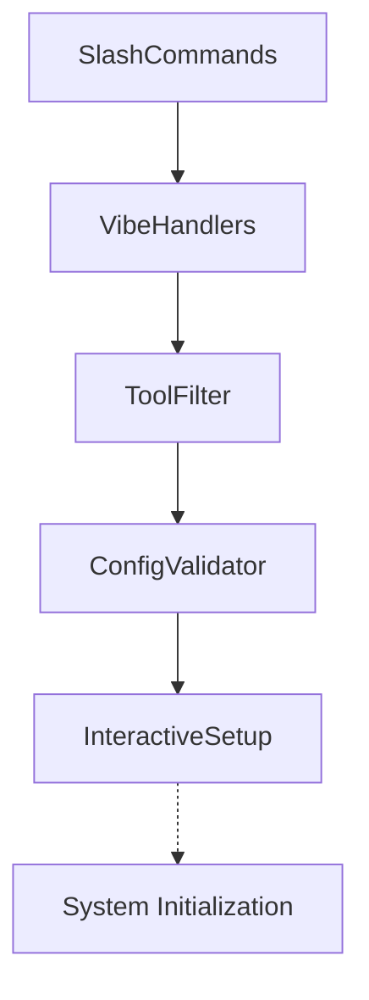

# Subsystems (continued)

This section details the auxiliary subsystems within the `src` directory, focusing on interactive setup, command processing, and configuration validation. These modules provide the foundational infrastructure required for user interaction and system orchestration, and developers should review them when extending the CLI or modifying user-facing command structures.

The modules listed below facilitate the bridge between raw user input and core system logic. By standardizing how commands are parsed and configurations are validated, they ensure consistent behavior across the application lifecycle. These components are designed to be lightweight, acting as the entry point for user-driven events before delegating to heavier processing units.

> **Key concept:** The command handler pattern decouples user-invoked slash commands from the underlying execution logic, allowing for modular expansion of the feature set without modifying core routing code.

When implementing new command handlers or utility functions, it is important to maintain state consistency. For instance, when a user executes a command, the system may invoke `SessionStore.addMessageToCurrentSession` to ensure the interaction is persisted, or utilize `CodeBuddyClient.performToolProbe` to verify tool availability before execution.

## src (5 modules)

- **src/utils/interactive-setup** (rank: 0.002, 10 functions)
- **src/utils/tool-filter** (rank: 0.002, 11 functions)
- **src/commands/slash-commands** (rank: 0.002, 12 functions)
- **src/utils/config-validator** (rank: 0.002, 0 functions)
- **src/commands/handlers/vibe-handlers** (rank: 0.002, 6 functions)

These utilities often interact with the broader agent architecture to ensure that the environment is correctly configured. Before a command is fully processed, the system may check the current state using `CodeBuddyAgent.initializeAgentSystemPrompt` to ensure the agent is ready to receive input, or validate the session state via `SessionStore.loadSession`.

---

**See also:** [Subsystems](./3-subsystems.md) · [Tool System](./5-tools.md) · [Configuration](./8-configuration.md) · [API Reference](./9-api-reference.md)

--- END ---