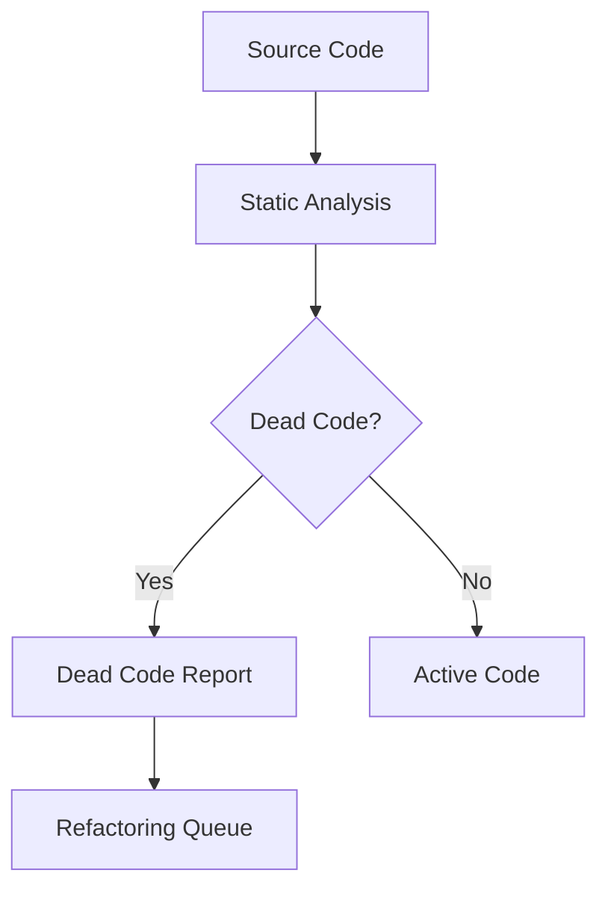

# Code Quality Metrics

This section provides a quantitative overview of the codebase's structural integrity, identifying areas of high coupling and potential technical debt. Developers should review these metrics before initiating major refactoring or architectural changes to ensure system stability and maintainability.

## Code Health: 100/100 (Excellent)

A perfect score indicates that the codebase currently adheres to all defined linting, type safety, and architectural standards. This baseline is maintained through automated CI checks and strict adherence to dependency boundaries.

## Dead Code Analysis

The following analysis highlights functions that appear to be unreachable within the current execution graph. Identifying unreachable code is critical for reducing binary size and simplifying the cognitive load for new contributors. Note that dynamic dispatch targets and exported API methods are excluded from this list to prevent false positives.

| Confidence | Count |
|---|---|
| High | 3098 |
| Medium | 0 |
| Low | 1910 |
| **Total** | **5244** |

### Top Dead Code Candidates

*Note: Exported API methods and dynamic dispatch targets are excluded.*

- `A2UIManager.cb` (high confidence)
- `A2UIManager.handleUserAction` (high confidence)
- `A2UIManager.renderToHTML` (high confidence)
- `A2UIManager.renderToTerminal` (high confidence)
- `A2UIManager.sendCanvasEvent` (high confidence)
- `A2UIManager.shutdown` (high confidence)
- `A2UITool.getManager` (high confidence)
- `ACPRouter.clearLog` (high confidence)
- `ACPRouter.findByCapability` (high confidence)
- `ACPRouter.getAgent` (high confidence)
- `ACPRouter.getAgents` (high confidence)
- `ACPRouter.getLog` (high confidence)
- `ACPRouter.register` (high confidence)
- `ACPRouter.reject` (high confidence)
- `ACPRouter.request` (high confidence)

## Module Coupling

Module coupling metrics quantify the interdependencies between system components. High values in the 'Calls' column indicate tight coupling, which can impede independent module testing and increase the risk of cascading failures.

| Module A | Module B | Calls | Imports | Total |
|---|---|---|---|---|
| src/browser-automation/browser-tool | src/tools/browser-tool | 29 | 0 | 29 |
| src/tools/browser-tool | src/tools/browser/playwright-tool | 20 | 0 | 20 |
| src/middleware/middlewares | src/middleware/types | 19 | 0 | 19 |
| src/agent/repo-profiling/infrastructure/index | src/agent/repo-profiling/infrastructure/project-meta | 15 | 0 | 15 |
| src/errors/index | src/tools/git-tool | 13 | 0 | 13 |
| src/docs/docs-generator | src/tools/doc-generator | 12 | 0 | 12 |
| src/cache/cache-manager | src/utils/cache | 10 | 0 | 10 |
| src/tools/docker-tool | src/utils/confirmation-service | 10 | 0 | 10 |
| src/tools/kubernetes-tool | src/utils/confirmation-service | 10 | 0 | 10 |
| src/commands/handlers/debug-handlers | src/utils/debug-logger | 9 | 0 | 9 |
| src/themes/theme-manager | src/ui/context/theme-context | 9 | 0 | 9 |
| src/agent/parallel/parallel-executor | src/optimization/parallel-executor | 8 | 0 | 8 |
| src/commands/handlers/branch-handlers | src/persistence/conversation-branches | 8 | 0 | 8 |
| src/commands/handlers/core-handlers | src/utils/autonomy-manager | 8 | 0 | 8 |
| src/context/pruning/index | src/context/pruning/ttl-manager | 8 | 0 | 8 |

Most dependent module: `src/utils/validators`
Most depended-upon: `src/utils/validators`

> **Key concept:** The `src/utils/validators` module serves as the primary dependency for input validation across the system. Excessive coupling here suggests that validation logic should be abstracted into middleware or service-specific validators to improve modularity and reduce the impact of changes.

## Refactoring Suggestions

The following functions exhibit high PageRank scores, indicating they are central nodes in the call graph. While these functions require attention, developers should look to established patterns in the codebase, such as `EnhancedMemory.calculateImportance` or `SessionStore.saveSession`, which demonstrate effective encapsulation and lower coupling. Addressing these high-coupling functions will improve testability and reduce the risk of regression during future feature development.

- **getErrorMessage**: Called by 155 functions — high coupling, consider interface extraction (PageRank: 1.000, 155 callers)
- **isExpired**: Called by 10 functions — high coupling, consider interface extraction (PageRank: 0.626, 10 callers)
- **send**: Called by 41 functions — high coupling, consider interface extraction (PageRank: 0.547, 41 callers)
- **SubagentManager.spawn**: Called by 96 functions — high coupling, consider interface extraction (PageRank: 0.444, 96 callers)
- **generateId**: Called by 17 functions — high coupling, consider interface extraction (PageRank: 0.429, 17 callers)
- **createId**: Called by 27 functions — high coupling, consider interface extraction (PageRank: 0.427, 27 callers)
- **DesktopAutomationManager.ensureProvider**: Called by 30 functions — high coupling, consider interface extraction (PageRank: 0.363, 30 callers)
- **tokenize**: Called by 20 functions — high coupling, consider interface extraction (PageRank: 0.345, 20 callers)
- **BrowserManager.getCurrentPage**: Called by 35 functions — high coupling, consider interface extraction (PageRank: 0.336, 35 callers)
- **formatSize**: Called by 20 functions — high coupling, consider interface extraction (PageRank: 0.301, 20 callers)

---

**See also:** [Overview](./1-overview.md) · [Architecture](./2-architecture.md) · [Subsystems](./3-subsystems.md) · [Tool System](./5-tools.md)

**Key source files:** `src/utils/validators.ts`

--- END ---