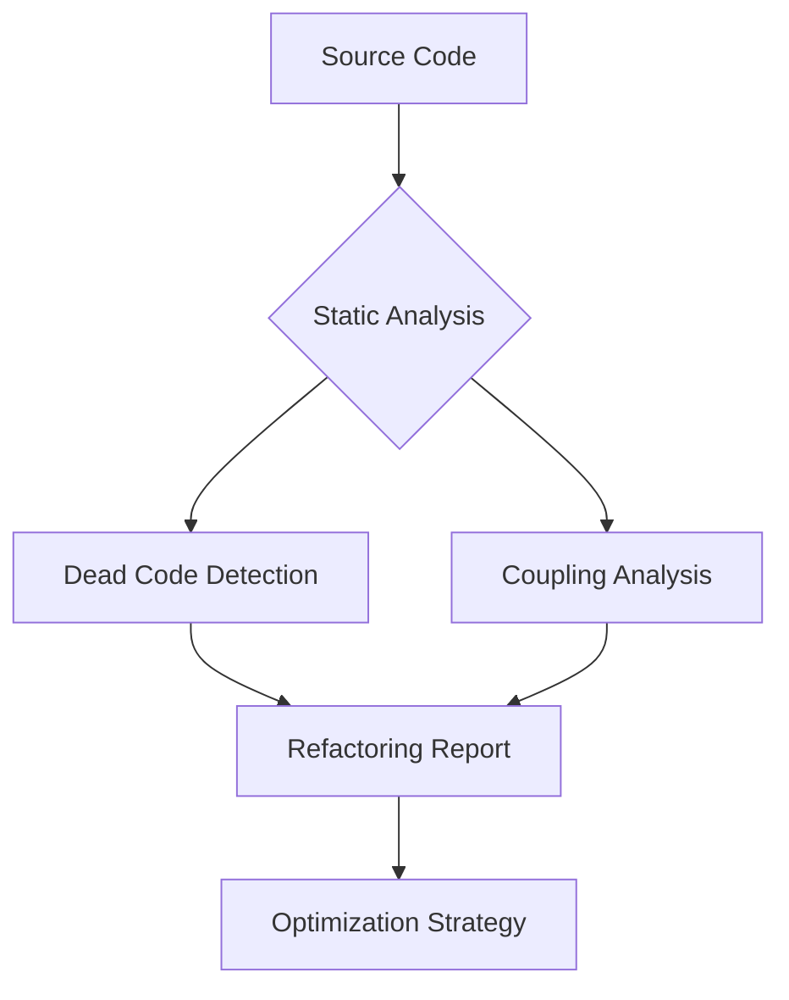

# Code Quality Metrics

This document provides a comprehensive overview of the system's technical debt, structural coupling, and dead code analysis. These metrics are essential for maintainers and architects to identify high-risk areas of the codebase, prioritize refactoring efforts, and ensure long-term system maintainability.

## Dead Code Analysis

The dead code analysis identifies unreachable or unused code paths that increase binary size and cognitive load for developers. The following table summarizes the confidence levels of identified dead code candidates, where "High" indicates a high probability of safe removal.

| Confidence | Count |
|---|---|
| High | 3097 |
| Medium | 0 |
| Low | 1910 |
| **Total** | **5241** |

### Top Dead Code Candidates

*Note: Exported API methods and dynamic dispatch targets are excluded.*

- `A2UIManager.cb` (high confidence)
- `A2UIManager.handleUserAction` (high confidence)
- `A2UIManager.renderToHTML` (high confidence)
- `A2UIManager.renderToTerminal` (high confidence)
- `A2UIManager.sendCanvasEvent` (high confidence)
- `A2UIManager.shutdown` (high confidence)
- `A2UITool.getManager` (high confidence)
- `ACPRouter.clearLog` (high confidence)
- `ACPRouter.findByCapability` (high confidence)
- `ACPRouter.getAgent` (high confidence)
- `ACPRouter.getAgents` (high confidence)
- `ACPRouter.getLog` (high confidence)
- `ACPRouter.register` (high confidence)
- `ACPRouter.reject` (high confidence)
- `ACPRouter.request` (high confidence)

While dead code removal reduces the overall footprint, structural integrity is equally dependent on how modules interact with one another.

## Module Coupling

Module coupling measures the degree of interdependence between software modules. High coupling, particularly in utility modules, can lead to "ripple effects" where changes in one area necessitate broad, unintended modifications across the system.

| Module A | Module B | Calls | Imports | Total |
|---|---|---|---|---|
| src/browser-automation/browser-tool | src/tools/browser-tool | 29 | 0 | 29 |
| src/tools/browser-tool | src/tools/browser/playwright-tool | 20 | 0 | 20 |
| src/middleware/middlewares | src/middleware/types | 19 | 0 | 19 |
| src/agent/repo-profiling/infrastructure/index | src/agent/repo-profiling/infrastructure/project-meta | 15 | 0 | 15 |
| src/errors/index | src/tools/git-tool | 13 | 0 | 13 |
| src/docs/docs-generator | src/tools/doc-generator | 12 | 0 | 12 |
| src/cache/cache-manager | src/utils/cache | 10 | 0 | 10 |
| src/tools/docker-tool | src/utils/confirmation-service | 10 | 0 | 10 |
| src/tools/kubernetes-tool | src/utils/confirmation-service | 10 | 0 | 10 |
| src/commands/handlers/debug-handlers | src/utils/debug-logger | 9 | 0 | 9 |
| src/themes/theme-manager | src/ui/context/theme-context | 9 | 0 | 9 |
| src/agent/parallel/parallel-executor | src/optimization/parallel-executor | 8 | 0 | 8 |
| src/commands/handlers/branch-handlers | src/persistence/conversation-branches | 8 | 0 | 8 |
| src/commands/handlers/core-handlers | src/utils/autonomy-manager | 8 | 0 | 8 |
| src/context/pruning/index | src/context/pruning/ttl-manager | 8 | 0 | 8 |

> **Key concept:** The `src/utils/validators` module currently acts as a central dependency hub. High fan-in for this module suggests that any breaking change to its API will trigger a system-wide recompilation or test failure, making it a prime candidate for interface abstraction.

Most dependent module: `src/utils/validators`
Most depended-upon: `src/utils/validators`

To mitigate these coupling risks, we identify specific methods that exhibit high PageRank scores, indicating they are critical nodes in the system's call graph.

## Refactoring Suggestions

The following methods have been identified as high-priority candidates for refactoring. By extracting these into interfaces or moving them to more specialized modules, we can reduce the complexity of the call graph and improve testability.

- `getErrorMessage()`: Called by 155 functions — high coupling, consider interface extraction (PageRank: 1.000, 155 callers)
- `isExpired()`: Called by 10 functions — high coupling, consider interface extraction (PageRank: 0.630, 10 callers)
- `send()`: Called by 41 functions — high coupling, consider interface extraction (PageRank: 0.547, 41 callers)
- `SubagentManager.spawn()`: Called by 96 functions — high coupling, consider interface extraction (PageRank: 0.444, 96 callers)
- `generateId()`: Called by 17 functions — high coupling, consider interface extraction (PageRank: 0.429, 17 callers)
- `createId()`: Called by 27 functions — high coupling, consider interface extraction (PageRank: 0.427, 27 callers)
- `DesktopAutomationManager.ensureProvider()`: Called by 30 functions — high coupling, consider interface extraction (PageRank: 0.363, 30 callers)
- `tokenize()`: Called by 20 functions — high coupling, consider interface extraction (PageRank: 0.345, 20 callers)
- `BrowserManager.getCurrentPage()`: Called by 35 functions — high coupling, consider interface extraction (PageRank: 0.336, 35 callers)
- `formatSize()`: Called by 20 functions — high coupling, consider interface extraction (PageRank: 0.301, 20 callers)

---

**See also:** [Overview](./1-overview.md) · [Architecture](./2-architecture.md) · [Subsystems](./3-subsystems.md) · [Tool System](./5-tools.md)

**Key source files:** `src/utils/validators.ts`