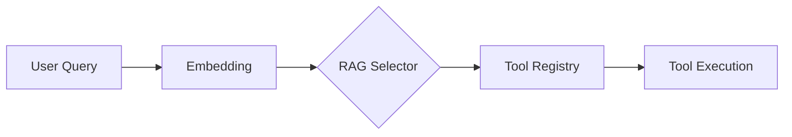

# Tool System

The tool system provides an extensible framework for agent capabilities, utilizing a dual-registry architecture to manage over 100 distinct modules. This documentation covers the categorization, RAG-based selection logic, and registration processes required for developers to integrate new tools or modify existing execution flows.

## Tool Registry

The tool ecosystem contains **117** tool modules organized in `src/tools/` and `src/tools/registry/`. The registry acts as the central authority for tool availability and lifecycle management.

Initialization is handled via `initializeToolRegistry()`, which orchestrates the loading of MCP servers and plugin-based tools. Developers should utilize `initializeMCPServers()` and `addMCPToolsToCodeBuddyTools()` to ensure new capabilities are correctly registered within the system's runtime environment.

The registry maintains a structured mapping of tools, which are further organized into functional categories to streamline discovery and access.

## Tool Categories

| Category | Tools | Count |
|----------|-------|-------|
| system | `bash`, `process`, `js_repl`, `docker` +2 | 6 |
| file_search | `search`, `find_symbols`, `find_references`, `find_definition` +1 | 5 |
| file_write | `create_file`, `str_replace_editor`, `edit_file`, `multi_edit` | 4 |
| web | `web_search`, `web_fetch`, `browser` | 3 |
| planning | `create_todo_list`, `get_todo_list`, `update_todo_list` | 3 |
| codebase | `codebase_map`, `code_graph`, `spawn_subagent` | 3 |
| file_read | `view_file`, `list_directory` | 2 |
| git | `git` | 1 |

While categorization provides a logical grouping, the system employs a dynamic selection process to ensure only the most relevant tools are exposed to the model.

## RAG-Based Tool Selection

Each user query triggers a semantic similarity search over tool metadata:

1. **Query embedding** — User message converted to vector
2. **Similarity scoring** — Each tool scored against query (0-1)
3. **Top-K selection** — ~15-20 most relevant tools selected
4. **Token savings** — Reduces prompt from 110+ tools to ~15-20

Tools have priority (3-10), keywords, and category metadata used for matching.

> **Key concept:** The RAG tool selector reduces prompt size from 110+ tools to ~15, saving approximately 8,000 tokens per LLM call.

This selection mechanism ensures that the LLM context window remains focused on relevant capabilities. By converting user messages into vector embeddings, the system performs a similarity search against tool metadata, effectively filtering the available toolset before the prompt is constructed.

## Registered Tools

The following inventory details the specific tools currently registered and available for use within the system.

27 tools registered in metadata:

- **bash**: bash
- **browser**: browser
- **code**: code_graph
- **codebase**: codebase_map
- **computer**: computer_control
- **create**: create_file, create_todo_list
- **docker**: docker
- **edit**: edit_file
- **find**: find_symbols, find_references, find_definition
- **get**: get_todo_list
- **git**: git
- **js**: js_repl
- **kubernetes**: kubernetes
- **list**: list_directory
- **multi**: multi_edit
- **process**: process
- **search**: search, search_multi
- **spawn**: spawn_subagent
- **str**: str_replace_editor
- **update**: update_todo_list
- **view**: view_file
- **web**: web_search, web_fetch

---

**See also:** [Overview](./1-overview.md) · [Architecture](./2-architecture.md) · [Subsystems](./3-subsystems.md) · [Context & Memory](./7-context-memory.md)

**Key source files:** `src/tools/.ts`, `src/tools/registry/.ts`

--- END ---