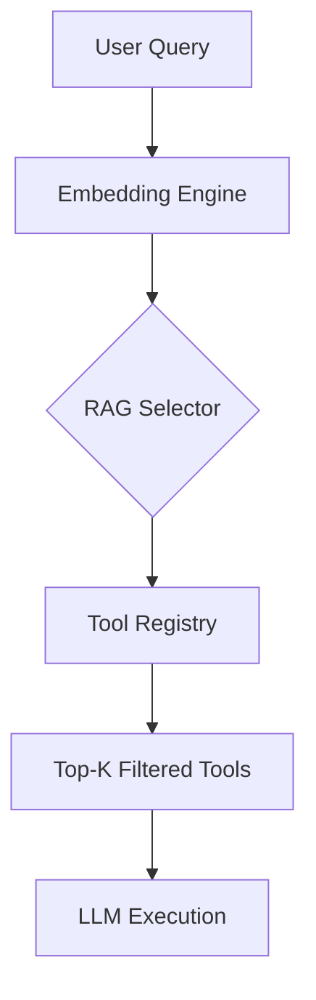

# Tool System

The tool system implements a dual-registry architecture designed to manage a high-density library of 117 distinct functional modules. This documentation is intended for developers and system architects who need to understand how the system dynamically selects, registers, and executes tools to maintain optimal performance and token efficiency.

## Tool Registry

The tool ecosystem contains **117** tool modules organized in `src/tools/` and `src/tools/registry/`. These modules are structured to ensure modularity, allowing developers to extend the system's capabilities without modifying the core execution engine.

Following the registration of these modules, the system categorizes them to facilitate efficient lookup and semantic retrieval.

## Tool Categories

| Category | Tools | Count |
|----------|-------|-------|
| system | `process`, `js_repl`, `git`, `kubernetes` +5 | 9 |
| file_search | `find_symbols`, `find_references`, `find_definition`, `search_multi` +2 | 6 |
| file_write | `str_replace_editor`, `edit_file`, `multi_edit`, `list_directory` +1 | 5 |
| file_read | `create_file`, `search`, `view_file`, `list_directory` | 4 |
| web | `web_fetch`, `browser`, `computer_control`, `web_search` | 4 |
| planning | `get_todo_list`, `update_todo_list`, `codebase_map`, `create_todo_list` | 4 |
| codebase | `code_graph`, `spawn_subagent`, `codebase_map` | 3 |
| git | `docker`, `git` | 2 |

Once categorized, the system utilizes a Retrieval-Augmented Generation (RAG) approach to ensure that only the most relevant tools are exposed to the LLM during any given interaction.

## RAG-Based Tool Selection

Each user query triggers a semantic similarity search over tool metadata to optimize the context window. The selection process follows a four-step pipeline:

1. **Query embedding** — User message converted to vector
2. **Similarity scoring** — Each tool scored against query (0-1)
3. **Top-K selection** — ~15-20 most relevant tools selected
4. **Token savings** — Reduces prompt from 110+ tools to ~15-20

> **Key concept:** The RAG tool selector reduces prompt size from 110+ tools to ~15, saving approximately 8,000 tokens per LLM call.

The selection logic is handled by `ToolRegistry.selectRelevantTools()`, which evaluates tools based on priority (3-10), associated keywords, and category metadata.

## Registered Tools

The following 27 tools are currently registered in the system metadata, serving as the primary interface for agentic actions:

- **bash**: bash
- **browser**: browser
- **code**: code_graph
- **codebase**: codebase_map
- **computer**: computer_control
- **create**: create_file, create_todo_list
- **docker**: docker
- **edit**: edit_file
- **find**: find_symbols, find_references, find_definition
- **get**: get_todo_list
- **git**: git
- **js**: js_repl
- **kubernetes**: kubernetes
- **list**: list_directory
- **multi**: multi_edit
- **process**: process
- **search**: search, search_multi
- **spawn**: spawn_subagent
- **str**: str_replace_editor
- **update**: update_todo_list
- **view**: view_file
- **web**: web_search, web_fetch

Developers looking to add new functionality should implement the standard interface and register the tool via `RegistryManager.register()`.

---

**See also:** [Overview](./1-overview.md) · [Architecture](./2-architecture.md) · [Subsystems](./3-subsystems.md) · [Context & Memory](./7-context-memory.md)

**Key source files:** `src/tools/.ts`, `src/tools/registry/.ts`