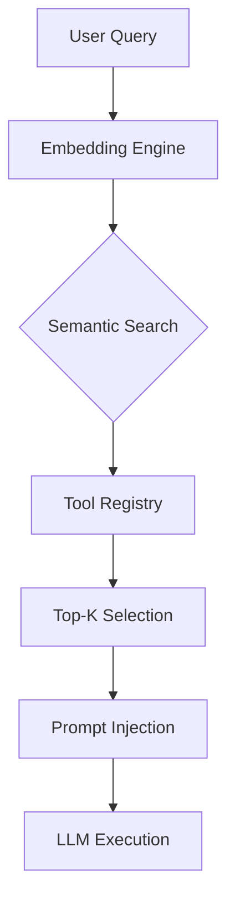

# Tool System

The tool system implements a dual-registry architecture designed to manage a high-density library of 117 distinct functional modules. This documentation is intended for developers and system architects who need to understand how tools are categorized, indexed, and dynamically retrieved to maintain optimal LLM performance.

## Tool Registry

The tool ecosystem is centralized within `src/tools/` and `src/tools/registry/`, providing a structured interface for agentic capabilities. By maintaining a modular registry, the system ensures that new capabilities can be integrated without bloating the core execution loop.

## Tool Categories

Tools are partitioned into functional domains to facilitate efficient lookup and logical grouping. The following table outlines the current distribution of the 117 available modules across primary categories.

| Category | Tools | Count |
|----------|-------|-------|
| system | `process`, `js_repl`, `git`, `kubernetes` +5 | 9 |
| file_search | `find_symbols`, `find_references`, `find_definition`, `search_multi` +2 | 6 |
| file_write | `str_replace_editor`, `edit_file`, `multi_edit`, `list_directory` +1 | 5 |
| file_read | `create_file`, `search`, `view_file`, `list_directory` | 4 |
| web | `web_fetch`, `browser`, `computer_control`, `web_search` | 4 |
| planning | `get_todo_list`, `update_todo_list`, `codebase_map`, `create_todo_list` | 4 |
| codebase | `code_graph`, `spawn_subagent`, `codebase_map` | 3 |
| git | `docker`, `git` | 2 |

Following the categorization of tools, the system employs a Retrieval-Augmented Generation (RAG) approach to ensure only the most relevant tools are exposed to the model during any given turn.

## RAG-Based Tool Selection

To prevent context window saturation, the system performs a semantic similarity search on tool metadata before every LLM interaction. This process, handled primarily by `ToolRegistry.selectTools()`, ensures that the model is not overwhelmed by irrelevant function definitions.

> **Key concept:** The RAG tool selector reduces prompt size from 110+ tools to ~15, saving approximately 8,000 tokens per LLM call.

The selection pipeline follows a four-step lifecycle:

1. **Query embedding** — User message converted to vector
2. **Similarity scoring** — Each tool scored against query (0-1)
3. **Top-K selection** — ~15-20 most relevant tools selected
4. **Token savings** — Reduces prompt from 110+ tools to ~15-20

Tools are assigned priority levels (3-10), keywords, and category metadata, which are utilized by `ToolMatcher.calculateRelevance()` to refine the selection process.

## Registered Tools

The following list details the 27 primary tools currently registered in the metadata, serving as the interface for the agent's interaction with the environment.

- **bash**: bash
- **browser**: browser
- **code**: code_graph
- **codebase**: codebase_map
- **computer**: computer_control
- **create**: create_file, create_todo_list
- **docker**: docker
- **edit**: edit_file
- **find**: find_symbols, find_references, find_definition
- **get**: get_todo_list
- **git**: git
- **js**: js_repl
- **kubernetes**: kubernetes
- **list**: list_directory
- **multi**: multi_edit
- **process**: process
- **search**: search, search_multi
- **spawn**: spawn_subagent
- **str**: str_replace_editor
- **update**: update_todo_list
- **view**: view_file
- **web**: web_search, web_fetch

---

**See also:** [Overview](./1-overview.md) · [Architecture](./2-architecture.md) · [Subsystems](./3-subsystems.md) · [Context & Memory](./7-context-memory.md)

**Key source files:** `src/tools/.ts`, `src/tools/registry/.ts`