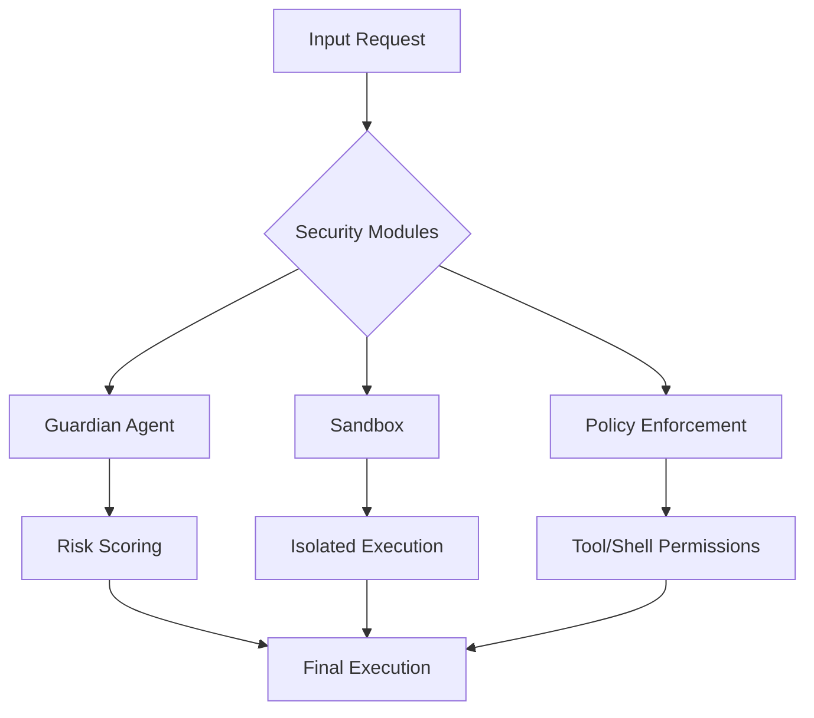

# Security Architecture

The security architecture implements a defense-in-depth strategy across 30 specialized modules located in `src/security/`. This documentation provides a comprehensive overview of the security primitives, validation layers, and isolation mechanisms required to maintain system integrity during automated code generation and execution.

This guide is intended for core contributors and security auditors who need to understand how the system mitigates risks associated with AI-driven tool execution and filesystem modifications.

The following table outlines the core modules within the `src/security/` directory, each serving a specific role in the system's threat mitigation strategy.

| Module | Purpose |
|--------|---------|
| `approval-modes` | Three-Tier Approval Modes System |
| `audit-logger` | Audit Logger for Code Generation Operations |
| `bash-parser` | Bash Command Parser (Vibe-inspired) |
| `code-validator` | Generated Code Validator |
| `credential-manager` | Secure Credential Manager |
| `csrf-protection` | CSRF Protection Module |
| `dangerous-patterns` | Centralized Dangerous Patterns Registry |
| `data-redaction` | Data Redaction Engine |
| `guardian-agent` | Guardian Sub-Agent — AI-powered automatic approval reviewer |
| `index` | Security Module |
| `permission-config` | Permission Configuration System |
| `permission-modes` | Permission Modes |
| `permission-patterns` | Pattern-based Permissions |
| `policy-amendments` | Policy Amendment Suggestions |
| `remote-approval` | Remote Approval Forwarding |
| `safe-binaries` | Safe Binaries System |
| `sandbox` | Execution sandboxing |
| `sandboxed-terminal` | Sandboxed Terminal |
| `security-audit` | Security Audit Tool |
| `security-modes` | Security Modes - Inspired by OpenAI Codex CLI |
| `sender-policies` | Per-Sender Policies & Agents List |
| `session-encryption` | Session Encryption for secure storage of chat sessions |
| `shell-env-policy` | Shell Environment Policy — Codex-inspired subprocess env control |
| `skill-scanner` | Skill Code Scanner (OpenClaw-inspired) |
| `ssrf-guard` | SSRF Guard — OpenClaw-inspired server-side request forgery protection |
| `syntax-validator` | Pre-Write Syntax Validator |
| `tool-permissions` | Tool Permissions System |
| `tool-policy` | OpenClaw-inspired Tool Policy System |
| `trust-folders` | Trust Folder Manager |
| `write-policy` | WritePolicy — enforces diff-first writes at the tool-handler level. |

## Security Features

The system leverages several high-level security features to ensure that AI-generated operations remain within defined safety boundaries. These features are invoked during the lifecycle of a tool call, specifically through `GuardianAgent.review()` and `Sandbox.execute()`.

> **Key concept:** The `GuardianAgent` utilizes a risk-scoring heuristic to intercept high-stakes operations before they reach the execution layer, effectively reducing the attack surface by filtering out non-compliant shell commands and unauthorized file access attempts.

*   **AI Guardian Agent**: Automatic approval reviewer with risk scoring
*   **Sandbox Isolation**: Sandboxed execution environment
*   **SSRF Protection**: Blocks requests to private IP ranges
*   **Shell Command Validation**: Dangerous pattern detection
*   **Environment Filtering**: Sensitive variable stripping

Beyond these high-level features, the system relies on granular policy enforcement to manage how tools interact with the host environment. Developers should utilize `WritePolicy.enforce()` to ensure that all filesystem modifications adhere to the required diff-first safety protocols.

---

**See also:** [Overview](./1-overview.md) · [Architecture](./2-architecture.md) · [Subsystems](./3-subsystems.md) · [Tool System](./5-tools.md)

**Key source files:** `src/security/.ts`