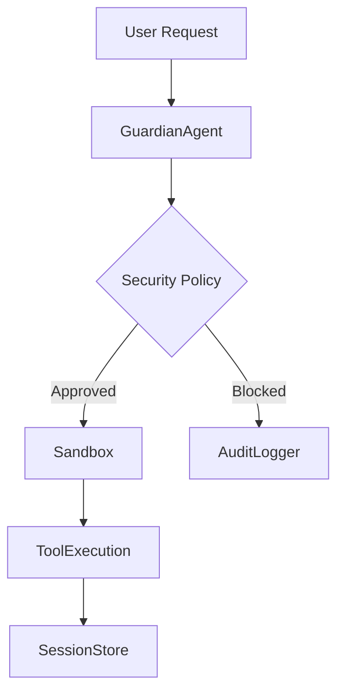

# Security Architecture

The security architecture implements a defense-in-depth strategy across 30 distinct modules within `src/security/`. This framework is critical for maintaining system integrity during code generation, tool execution, and session management, ensuring that all operations adhere to strict safety policies before reaching the host environment.

The project has **30** security modules in `src/security/`:

| Module | Purpose |
|--------|---------|
| `approval-modes` | Three-Tier Approval Modes System |
| `audit-logger` | Audit Logger for Code Generation Operations |
| `bash-parser` | Bash Command Parser (Vibe-inspired) |
| `code-validator` | Generated Code Validator |
| `credential-manager` | Secure Credential Manager |
| `csrf-protection` | CSRF Protection Module |
| `dangerous-patterns` | Centralized Dangerous Patterns Registry |
| `data-redaction` | Data Redaction Engine |
| `guardian-agent` | Guardian Sub-Agent — AI-powered automatic approval reviewer |
| `index` | Security Module |
| `permission-config` | Permission Configuration System |
| `permission-modes` | Permission Modes |
| `permission-patterns` | Pattern-based Permissions |
| `policy-amendments` | Policy Amendment Suggestions |
| `remote-approval` | Remote Approval Forwarding |
| `safe-binaries` | Safe Binaries System |
| `sandbox` | Execution sandboxing |
| `sandboxed-terminal` | Sandboxed Terminal |
| `security-audit` | Security Audit Tool |
| `security-modes` | Security Modes - Inspired by OpenAI Codex CLI |
| `sender-policies` | Per-Sender Policies & Agents List |
| `session-encryption` | Session Encryption for secure storage of chat sessions |
| `shell-env-policy` | Shell Environment Policy — Codex-inspired subprocess env control |
| `skill-scanner` | Skill Code Scanner (OpenClaw-inspired) |
| `ssrf-guard` | SSRF Guard — OpenClaw-inspired server-side request forgery protection |
| `syntax-validator` | Pre-Write Syntax Validator |
| `tool-permissions` | Tool Permissions System |
| `tool-policy` | OpenClaw-inspired Tool Policy System |
| `trust-folders` | Trust Folder Manager |
| `write-policy` | WritePolicy — enforces diff-first writes at the tool-handler level. |

These modules collectively enforce granular control over system resources and external interactions. The following features highlight the primary mechanisms used to mitigate common attack vectors and maintain a trusted execution environment.

## Security Features

- **AI Guardian Agent**: Automatic approval reviewer with risk scoring
- **Sandbox Isolation**: Sandboxed execution environment
- **SSRF Protection**: Blocks requests to private IP ranges
- **Shell Command Validation**: Dangerous pattern detection
- **Environment Filtering**: Sensitive variable stripping

> **Key concept:** The security architecture relies on `DMPairingManager.isBlocked` and `DMPairingManager.isApproved` to gate communication channels, ensuring that only verified entities can trigger sensitive operations within the `src/security/` domain.

The system integrates security checks directly into the tool execution lifecycle. For instance, before any sensitive operation is performed, the system verifies sender authorization using `DMPairingManager.isBlocked` and `DMPairingManager.isApproved`. If a tool requires interaction with the host environment, such as `ScreenshotTool.capture`, the security layer validates the request against `DMPairingManager.requiresPairing` to ensure the session is authorized.

---

**See also:** [Overview](./1-overview.md) · [Architecture](./2-architecture.md) · [Subsystems](./3-subsystems.md) · [Tool System](./5-tools.md)

**Key source files:** `src/security/.ts`

--- END ---