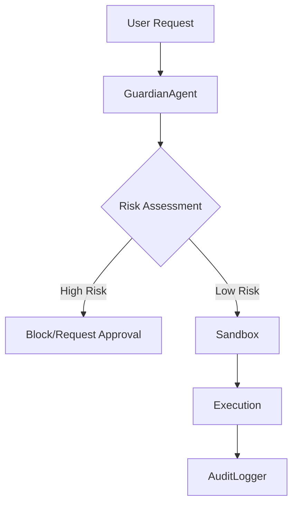

# Security Architecture

The security architecture implements a defense-in-depth strategy across 30 distinct modules, ensuring that all code generation and execution operations remain within strictly defined safety boundaries. This documentation is intended for core contributors and security auditors who need to understand how the system mitigates risks ranging from unauthorized shell access to server-side request forgery.

The following table details the core security modules located in `src/security/`, which serve as the foundation for the system's integrity and policy enforcement.

| Module | Purpose |
|--------|---------|
| `approval-modes` | Three-Tier Approval Modes System |
| `audit-logger` | Audit Logger for Code Generation Operations |
| `bash-parser` | Bash Command Parser (Vibe-inspired) |
| `code-validator` | Generated Code Validator |
| `credential-manager` | Secure Credential Manager |
| `csrf-protection` | CSRF Protection Module |
| `dangerous-patterns` | Centralized Dangerous Patterns Registry |
| `data-redaction` | Data Redaction Engine |
| `guardian-agent` | Guardian Sub-Agent — AI-powered automatic approval reviewer |
| `index` | Security Module |
| `permission-config` | Permission Configuration System |
| `permission-modes` | Permission Modes |
| `permission-patterns` | Pattern-based Permissions |
| `policy-amendments` | Policy Amendment Suggestions |
| `remote-approval` | Remote Approval Forwarding |
| `safe-binaries` | Safe Binaries System |
| `sandbox` | Execution sandboxing |
| `sandboxed-terminal` | Sandboxed Terminal |
| `security-audit` | Security Audit Tool |
| `security-modes` | Security Modes - Inspired by OpenAI Codex CLI |
| `sender-policies` | Per-Sender Policies & Agents List |
| `session-encryption` | Session Encryption for secure storage of chat sessions |
| `shell-env-policy` | Shell Environment Policy — Codex-inspired subprocess env control |
| `skill-scanner` | Skill Code Scanner (OpenClaw-inspired) |
| `ssrf-guard` | SSRF Guard — OpenClaw-inspired server-side request forgery protection |
| `syntax-validator` | Pre-Write Syntax Validator |
| `tool-permissions` | Tool Permissions System |
| `tool-policy` | OpenClaw-inspired Tool Policy System |
| `trust-folders` | Trust Folder Manager |
| `write-policy` | WritePolicy — enforces diff-first writes at the tool-handler level. |

These modules are orchestrated to provide a comprehensive security layer that intercepts and validates operations before they reach the host environment. The following diagram illustrates the primary flow of a secure operation request:

> **Key concept:** The `GuardianAgent.review()` method utilizes a risk-scoring heuristic to evaluate operations, reducing the manual approval burden by automatically flagging only high-entropy or sensitive system calls before they reach the `Sandbox.execute()` lifecycle.

## Security Features

Beyond the modular structure, the system enforces specific runtime protections to maintain environment isolation and prevent malicious command execution. These features are invoked during the lifecycle of any tool execution or code generation task.

- **AI Guardian Agent**: Automatic approval reviewer with risk scoring
- **Sandbox Isolation**: Sandboxed execution environment
- **SSRF Protection**: Blocks requests to private IP ranges
- **Shell Command Validation**: Dangerous pattern detection
- **Environment Filtering**: Sensitive variable stripping

To ensure consistent enforcement, developers should utilize the `AuditLogger.log()` method for all security-sensitive events, ensuring that every decision made by the `GuardianAgent` or `SSRFGuard` is captured for post-execution analysis.

---

**See also:** [Overview](./1-overview.md) · [Architecture](./2-architecture.md) · [Subsystems](./3-subsystems.md) · [Tool System](./5-tools.md)

**Key source files:** `src/security/.ts`