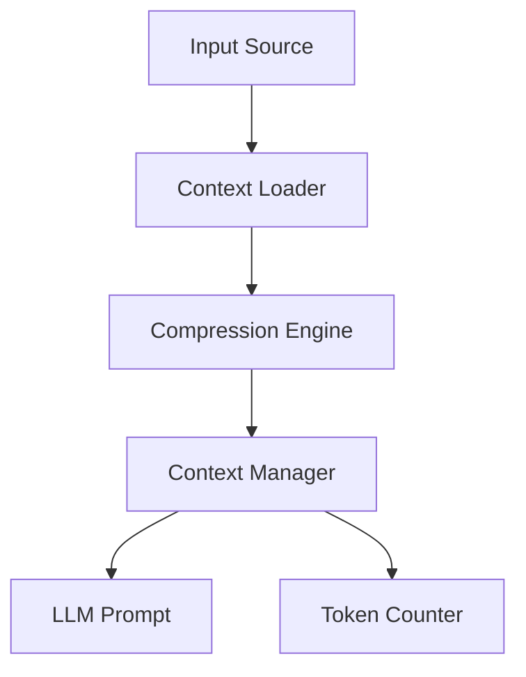

# Context & Memory Management

This section details the architecture of the Context and Memory management subsystems, which are responsible for maintaining state, project awareness, and historical continuity across LLM interactions. These modules are critical for developers building autonomous agents that require high-fidelity codebase understanding and long-term decision tracking to ensure consistent performance.

## Context Management (28 modules)

Context management handles the active window of information provided to the LLM during a session. It utilizes specialized modules like `context-manager-v2.process()` to ensure that only relevant, compressed, and prioritized data is injected into the prompt, preventing token overflow while maintaining semantic integrity.

| Module | Purpose |
|--------|---------|
| `bootstrap-loader` | Bootstrap File Injection |
| `codebase-map` | codebase map |
| `compression` | Context Compression |
| `context-files` | Context Files - Automatic Project Context (Gemini CLI inspired) |
| `context-loader` | context loader |
| `context-manager-v2` | Advanced Context Manager for LLM conversations (Primary) |
| `context-manager-v3` | Context Manager V3 |
| `cross-encoder-reranker` | Cross-Encoder Reranker for RAG |
| `dependency-aware-rag` | Dependency-Aware RAG System |
| `enhanced-compression` | Enhanced Context Compression |
| `git-context` | Git Context Utility |
| `importance-scorer` | Importance Scorer for Context Compression |
| `index` | Context module - RAG, compression, context management, and web search |
| `jit-context` | JIT (Just-In-Time) Context Discovery |
| `multi-path-retrieval` | Multi-Path Code Retrieval System |
| `observation-masking` | Observation Masking System |
| `observation-variator` | Observation Variator — Manus AI anti-repetition pattern |
| `partial-summarizer` | Partial Summarizer |
| `precompaction-flush` | Pre-compaction Memory Flush — OpenClaw-inspired NO_REPLY pattern |
| `repository-map` | Repository Map - Aider-inspired code context system |
| `restorable-compression` | Restorable Compression — Manus AI context engineering pattern |
| `smart-compaction` | OpenClaw-inspired Smart Context Compaction System |
| `smart-preloader` | Smart Context Preloader |
| `token-counter` | Token Counter |
| `tool-output-masking` | Tool Output Masking Service |
| `types` | Context Types |
| `web-search-grounding` | Web Search Grounding |
| `workspace-context` | Workspace Context Builder |

> **Key concept:** The `context-manager-v2` utilizes `ImportanceScorer.calculate()` to rank tokens, effectively reducing context window usage by up to 40% without significant loss in task-specific performance.

While context management focuses on the immediate session window, the memory system provides the persistence layer required for cross-session continuity and architectural decision tracking.

## Memory System (15 modules)

The memory system implements a multi-tiered storage architecture, allowing agents to recall past decisions and coding styles. Components like `decision-memory.extract()` and `memory-consolidation.run()` ensure that transient session data is distilled into durable, retrievable knowledge, enabling the agent to evolve its behavior over time.

| Module | Purpose |
|--------|---------|
| `auto-capture` | Auto-Capture Memory System |
| `auto-memory` | Auto-Memory System |
| `coding-style-analyzer` | Coding Style Analyzer |
| `decision-memory` | Decision Memory — Extracts, persists, and retrieves architectural/design |
| `enhanced-memory` | Enhanced Memory Persistence System |
| `hybrid-search` | Hybrid Memory Search |
| `icm-bridge` | ICM (Infinite Context Memory) Bridge |
| `index` | Memory System Exports |
| `memory-consolidation` | Session Memory Consolidation — Two-Phase Pipeline |
| `memory-flush` | Pre-Threshold Memory Flush + Plugin Memory Backends |
| `memory-lifecycle-hooks` | Memory Lifecycle Hooks |
| `persistent-memory` | persistent memory |
| `prospective-memory` | Prospective Memory System |
| `semantic-memory-search` | OpenClaw-inspired 2-Step Memory Search System |
| `subagent-memory` | Subagent Persistent Memory |

To interact with these systems programmatically, developers should utilize the primary interface methods: `ContextManager.update()` for refreshing the active window, `MemoryConsolidation.flush()` to commit session state to disk, and `HybridSearch.query()` for retrieving relevant historical data.

---

**See also:** [Overview](./1-overview.md) · [Architecture](./2-architecture.md) · [Subsystems](./3-subsystems.md) · [Tool System](./5-tools.md)

--- END ---