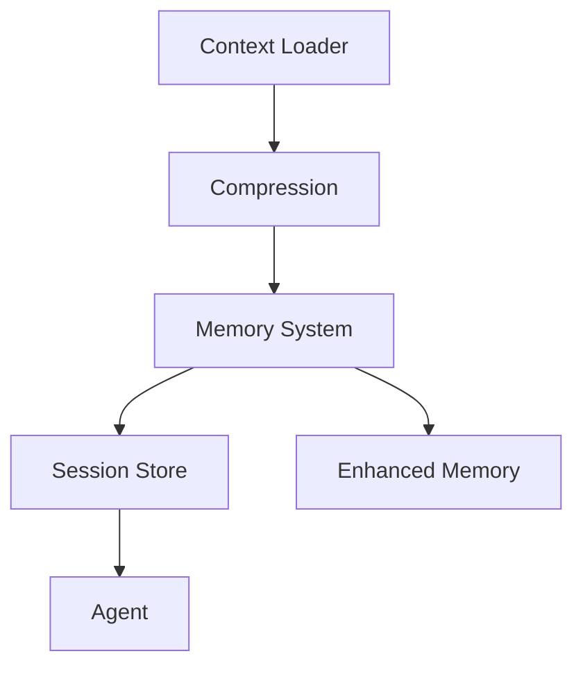

# Context & Memory Management

This section details the architecture of the Context and Memory subsystems, which are responsible for maintaining state, managing token budgets, and persisting long-term knowledge across sessions. Developers working on agent reasoning, RAG implementations, or session persistence should review these modules to understand how data flows from raw input to optimized, long-term memory.

## Context Management (28 modules)

The context management layer acts as the primary interface between the raw codebase and the LLM's input window. It handles retrieval, compression, and masking to ensure the model receives relevant, high-signal information while staying within token limits. This layer is critical for maintaining the "context window" efficiency required for large-scale repository analysis.

| Module | Purpose |
|--------|---------|
| `bootstrap-loader` | Bootstrap File Injection |
| `codebase-map` | codebase map |
| `compression` | Context Compression |
| `context-files` | Context Files - Automatic Project Context (Gemini CLI inspired) |
| `context-loader` | context loader |
| `context-manager-v2` | Advanced Context Manager for LLM conversations (Primary) |
| `context-manager-v3` | Context Manager V3 |
| `cross-encoder-reranker` | Cross-Encoder Reranker for RAG |
| `dependency-aware-rag` | Dependency-Aware RAG System |
| `enhanced-compression` | Enhanced Context Compression |
| `git-context` | Git Context Utility |
| `importance-scorer` | Importance Scorer for Context Compression |
| `index` | Context module - RAG, compression, context management, and web search |
| `jit-context` | JIT (Just-In-Time) Context Discovery |
| `multi-path-retrieval` | Multi-Path Code Retrieval System |
| `observation-masking` | Observation Masking System |
| `observation-variator` | Observation Variator — Manus AI anti-repetition pattern |
| `partial-summarizer` | Partial Summarizer |
| `precompaction-flush` | Pre-compaction Memory Flush — OpenClaw-inspired NO_REPLY pattern |
| `repository-map` | Repository Map - Aider-inspired code context system |
| `restorable-compression` | Restorable Compression — Manus AI context engineering pattern |
| `smart-compaction` | OpenClaw-inspired Smart Context Compaction System |
| `smart-preloader` | Smart Context Preloader |
| `token-counter` | Token Counter |
| `tool-output-masking` | Tool Output Masking Service |
| `types` | Context Types |
| `web-search-grounding` | Web Search Grounding |
| `workspace-context` | Workspace Context Builder |

Once context is retrieved and compressed, it must be integrated into the agent's persistent state. This is handled by the Memory System, which manages the lifecycle of stored information using methods such as `SessionStore.convertChatEntryToMessage` to ensure data is correctly formatted before storage.

## Memory System (15 modules)

The Memory System provides a multi-tiered storage architecture designed to handle both short-term session data and long-term architectural knowledge. It utilizes specialized modules to consolidate, search, and flush memory, ensuring the agent maintains continuity across restarts.

> **Key concept:** The `EnhancedMemory` module utilizes a two-phase pipeline to consolidate session data, ensuring that critical architectural decisions are persisted via `EnhancedMemory.saveAll` while transient data is pruned to maintain performance.

| Module | Purpose |
|--------|---------|
| `auto-capture` | Auto-Capture Memory System |
| `auto-memory` | Auto-Memory System |
| `coding-style-analyzer` | Coding Style Analyzer |
| `decision-memory` | Decision Memory — Extracts, persists, and retrieves architectural/design |
| `enhanced-memory` | Enhanced Memory Persistence System |
| `hybrid-search` | Hybrid Memory Search |
| `icm-bridge` | ICM (Infinite Context Memory) Bridge |
| `index` | Memory System Exports |
| `memory-consolidation` | Session Memory Consolidation — Two-Phase Pipeline |
| `memory-flush` | Pre-Threshold Memory Flush + Plugin Memory Backends |
| `memory-lifecycle-hooks` | Memory Lifecycle Hooks |
| `persistent-memory` | persistent memory |
| `prospective-memory` | Prospective Memory System |
| `semantic-memory-search` | OpenClaw-inspired 2-Step Memory Search System |
| `subagent-memory` | Subagent Persistent Memory |

To maintain system integrity, the memory system relies on `EnhancedMemory.loadMemories` to hydrate the agent's state upon initialization. During operation, the system continuously evaluates the relevance of stored data using `EnhancedMemory.calculateImportance`, which determines whether specific memory blocks should be retained or archived.

---

**See also:** [Overview](./1-overview.md) · [Architecture](./2-architecture.md) · [Subsystems](./3-subsystems.md) · [Tool System](./5-tools.md)

--- END ---