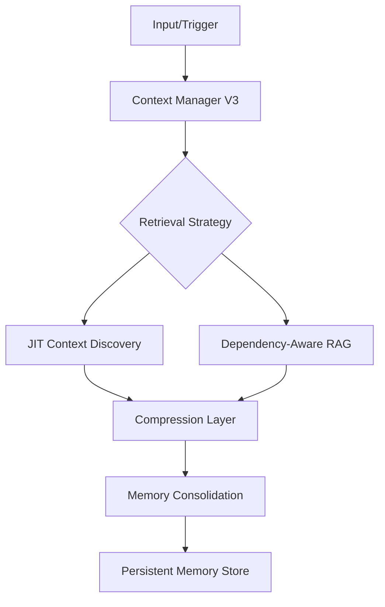

# Context & Memory Management

This section details the orchestration of the system's state, covering both transient conversational context and long-term persistent memory. These modules are critical for maintaining coherence across extended development sessions and ensuring the LLM operates with a high-fidelity understanding of the codebase. Developers working on retrieval-augmented generation (RAG) or state persistence should familiarize themselves with these components to avoid redundant context injection.

## Context Management (28 modules)

The Context Management subsystem is responsible for the dynamic assembly of the LLM's prompt window. It utilizes specialized loaders and compression algorithms to ensure that only the most relevant codebase information is provided, optimizing for both token efficiency and model performance.

| Module | Purpose |
|--------|---------|
| `bootstrap-loader` | Bootstrap File Injection |
| `codebase-map` | codebase map |
| `compression` | Context Compression |
| `context-files` | Context Files - Automatic Project Context (Gemini CLI inspired) |
| `context-loader` | context loader |
| `context-manager-v2` | Advanced Context Manager for LLM conversations (Primary) |
| `context-manager-v3` | Context Manager V3 |
| `cross-encoder-reranker` | Cross-Encoder Reranker for RAG |
| `dependency-aware-rag` | Dependency-Aware RAG System |
| `enhanced-compression` | Enhanced Context Compression |
| `git-context` | Git Context Utility |
| `importance-scorer` | Importance Scorer for Context Compression |
| `index` | Context module - RAG, compression, context management, and web search |
| `jit-context` | JIT (Just-In-Time) Context Discovery |
| `multi-path-retrieval` | Multi-Path Code Retrieval System |
| `observation-masking` | Observation Masking System |
| `observation-variator` | Observation Variator — Manus AI anti-repetition pattern |
| `partial-summarizer` | Partial Summarizer |
| `precompaction-flush` | Pre-compaction Memory Flush — OpenClaw-inspired NO_REPLY pattern |
| `repository-map` | Repository Map - Aider-inspired code context system |
| `restorable-compression` | Restorable Compression — Manus AI context engineering pattern |
| `smart-compaction` | OpenClaw-inspired Smart Context Compaction System |
| `smart-preloader` | Smart Context Preloader |
| `token-counter` | Token Counter |
| `tool-output-masking` | Tool Output Masking Service |
| `types` | Context Types |
| `web-search-grounding` | Web Search Grounding |
| `workspace-context` | Workspace Context Builder |

> **Key concept:** The `context-manager-v3` utilizes `ContextManager.process()` to orchestrate the lifecycle of a prompt, ensuring that `token-counter` limits are respected before the payload is dispatched to the LLM.

While context management handles the immediate "working memory" of the current session, the system must also maintain a historical record of architectural decisions and coding styles. This is handled by the Memory System, which bridges the gap between ephemeral interactions and long-term project knowledge.

## Memory System (15 modules)

The Memory System provides a persistent layer that allows the agent to "remember" past decisions, user preferences, and subagent states across different sessions. By leveraging `memory-consolidation`, the system distills high-volume interaction logs into actionable architectural insights.

| Module | Purpose |
|--------|---------|
| `auto-capture` | Auto-Capture Memory System |
| `auto-memory` | Auto-Memory System |
| `coding-style-analyzer` | Coding Style Analyzer |
| `decision-memory` | Decision Memory — Extracts, persists, and retrieves architectural/design |
| `enhanced-memory` | Enhanced Memory Persistence System |
| `hybrid-search` | Hybrid Memory Search |
| `icm-bridge` | ICM (Infinite Context Memory) Bridge |
| `index` | Memory System Exports |
| `memory-consolidation` | Session Memory Consolidation — Two-Phase Pipeline |
| `memory-flush` | Pre-Threshold Memory Flush + Plugin Memory Backends |
| `memory-lifecycle-hooks` | Memory Lifecycle Hooks |
| `persistent-memory` | persistent memory |
| `prospective-memory` | Prospective Memory System |
| `semantic-memory-search` | OpenClaw-inspired 2-Step Memory Search System |
| `subagent-memory` | Subagent Persistent Memory |

> **Key concept:** The `decision-memory` module uses `DecisionMemory.extract()` to parse conversation logs for design patterns, which are then stored in a vector database to inform future architectural suggestions.

---

**See also:** [Overview](./1-overview.md) · [Architecture](./2-architecture.md) · [Subsystems](./3-subsystems.md) · [Tool System](./5-tools.md)

--- END ---