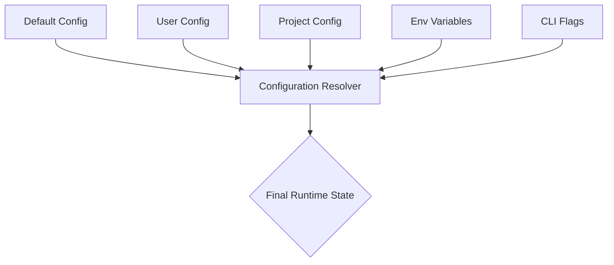

# Configuration System

This section details the multi-tier configuration architecture that governs the application's behavior, from default settings to runtime overrides. Understanding this hierarchy is critical for developers and power users who need to customize environment-specific behaviors or troubleshoot configuration conflicts.

## Configuration Hierarchy

The system employs a strict precedence model to resolve configuration values. When a setting is defined in multiple locations, the system resolves the value based on the following order of priority, where higher numbers override lower ones:

1. Default (in-code) — Base behavior
2. User (`~/.codebuddy/`) — Personal preferences
3. Project (`.codebuddy/`) — Project-specific settings
4. Environment variables — Runtime overrides
5. CLI flags — Highest priority

Following the resolution of these tiers, the system aggregates the final configuration state. The diagram below illustrates how these layers interact to produce the final runtime configuration.

## Key Configuration Files

The application relies on a combination of standard project configuration files and a specialized `.codebuddy/` directory to manage state, memory, and project-specific metadata. The following table outlines the critical files required for system operation.

| File | Location |
|------|----------|
| `tsconfig.json` | project root |
| `.prettierrc` | project root |
| `vitest.config.ts` | project root |
| `.env.example` | project root |
| `AUDIT-REPORT.md` | .codebuddy/ |
| `autonomy.json` | .codebuddy/ |
| `code-graph-snapshot.json` | .codebuddy/ |
| `code-graph.json` | .codebuddy/ |
| `CODEBUDDY.md` | .codebuddy/ |
| `CODEBUDDY_MEMORY.md` | .codebuddy/ |
| `CONTEXT.md` | .codebuddy/ |
| `GROK.md` | .codebuddy/ |
| `HEARTBEAT.md` | .codebuddy/ |
| `hooks.json` | .codebuddy/ |
| `settings.local.json` | .claude/ |

Beyond static configuration files, the system requires specific environment variables to authenticate with external services.

## Environment Variables

Environment variables serve as the primary mechanism for injecting sensitive credentials and runtime-specific parameters without committing them to version control.

| Variable | Description |
|----------|-------------|
| `GROK_API_KEY` | API Key (required) |

## Model Configuration

Model behavior is centralized within the codebase, allowing for granular control over token limits and output formatting. Models are configured via `src/config/model-tools.ts` using glob matching patterns to apply settings dynamically.

> **Key concept:** The model configuration system uses glob matching to apply settings across model families, allowing developers to define a single `contextWindow` policy for all "gpt-4*" models while overriding specific parameters for local models like Ollama.

The configuration logic, handled primarily by `ModelConfig.load()`, supports the following features:

- Per-model: `contextWindow`, `maxOutputTokens`, `patchFormat`
- Provider auto-detection from model name or base URL
- Supports: Grok, Claude, GPT, Gemini, Ollama, LM Studio

---

**See also:** [Overview](./1-overview.md) · [Tool System](./5-tools.md) · [Context & Memory](./7-context-memory.md) · [Development Guide](./10-development.md)

**Key source files:** `src/config/model-tools.ts`