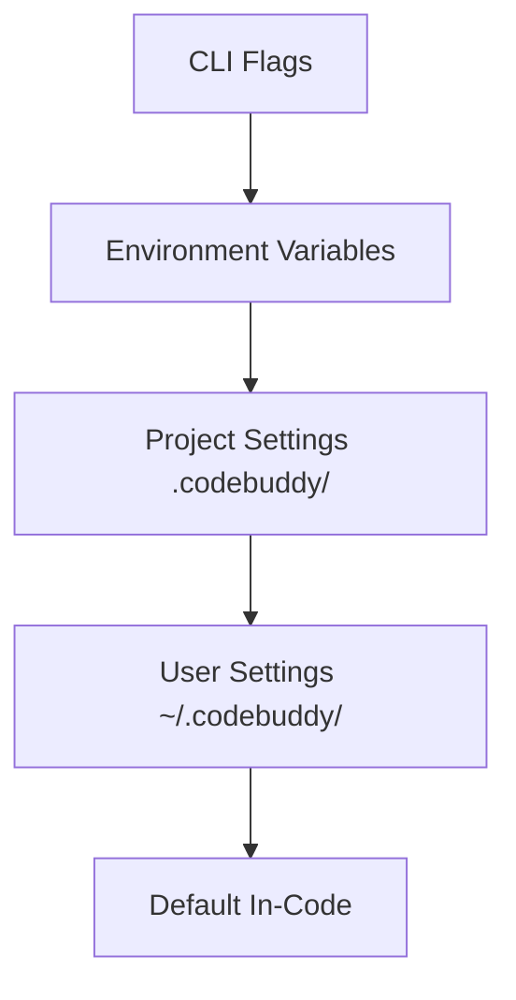

# Configuration System

The configuration system manages the multi-layered settings architecture that governs agent behavior, environment integration, and runtime parameters. Understanding this hierarchy is critical for developers configuring local environments or deploying the agent, as incorrect precedence can lead to unexpected model behavior or authentication failures.

## Configuration Hierarchy

The system resolves configuration values using a strict precedence model, where higher-priority sources override lower-priority defaults. This ensures that runtime flags can temporarily modify behavior without requiring permanent changes to the project configuration.

The hierarchy dictates the order of precedence, but the physical storage of these configurations relies on a structured filesystem approach.

## Key Configuration Files

The system utilizes the `.codebuddy/` directory to store project-specific state and configuration. When initializing the environment, the system ensures these directories are accessible using `SessionStore.ensureWritableDirectory()`.

| File | Location |
|------|----------|
| `tsconfig.json` | project root |
| `.prettierrc` | project root |
| `vitest.config.ts` | project root |
| `.env.example` | project root |
| `AUDIT-REPORT.md` | .codebuddy/ |
| `autonomy.json` | .codebuddy/ |
| `CODEBUDDY.md` | .codebuddy/ |
| `CODEBUDDY_MEMORY.md` | .codebuddy/ |
| `CONTEXT.md` | .codebuddy/ |
| `GROK.md` | .codebuddy/ |
| `HEARTBEAT.md` | .codebuddy/ |
| `hooks.json` | .codebuddy/ |
| `lessons.md` | .codebuddy/ |
| `mcp.json` | .codebuddy/ |
| `settings.local.json` | .claude/ |

Beyond static file configuration, runtime behavior is heavily influenced by environment variables, which provide the necessary context for authentication and feature toggling.

## Environment Variables

Environment variables serve as the primary mechanism for injecting sensitive credentials and runtime overrides without modifying the codebase. This approach ensures that secrets remain decoupled from version control.

> **Key concept:** Environment variables are evaluated at runtime. If a variable like `GROK_API_KEY` is missing, the system will fail to initialize the corresponding provider, necessitating a fallback or explicit error handling.

| Variable | Description |
|----------|-------------|
| `GROK_API_KEY` | Required API key from x.ai |
| `CODEBUDDY_MAX_TOKENS` | Override response token limit |
| `MORPH_API_KEY` | Enables fast file editing |
| `YOLO_MODE` | Full autonomy mode (requires `/yolo on`) |
| `MAX_COST` | Session cost limit in dollars |
| `GROK_BASE_URL` | Custom API endpoint |
| `GROK_MODEL` | Default model to use |
| `JWT_SECRET` | Secret for API server auth |
| `PICOVOICE_ACCESS_KEY` | Porcupine wake word (text-match fallback if absent) |
| `BRAVE_API_KEY` | Brave Search for MCP web search |
| `EXA_API_KEY` | Exa neural search for MCP |
| `PERPLEXITY_API_KEY` | Perplexity AI (or via OpenRouter) |
| `OPENROUTER_API_KEY` | OpenRouter key |
| `CACHE_TRACE` | Debug prompt construction |
| `PERF_TIMING` | Startup phase profiling |
| `VERBOSE` | Verbose output |
| `SENTRY_DSN` | Sentry error reporting DSN |
| `OTEL_EXPORTER_OTLP_ENDPOINT` | OpenTelemetry OTLP endpoint for distributed tracing |

Once the configuration is parsed, the system validates model capabilities to ensure compatibility with the requested inference provider.

## Model Configuration

Models are configured via `src/config/model-tools.ts` using glob matching patterns to determine provider-specific settings. The system performs validation checks using `CodeBuddyClient.validateModel()` to ensure the requested model is supported by the current environment.

- Per-model: `contextWindow`, `maxOutputTokens`, `patchFormat`
- Provider auto-detection from model name or base URL
- Supports: Grok, Claude, GPT, Gemini, Ollama, LM Studio

When interacting with specific providers, the system may invoke `CodeBuddyClient.isGeminiModelName()` to apply provider-specific logic or constraints during the request lifecycle.

---

**See also:** [Overview](./1-overview.md) · [Tool System](./5-tools.md) · [Context & Memory](./7-context-memory.md) · [API Reference](./9-api-reference.md)

**Key source files:** `src/config/model-tools.ts`