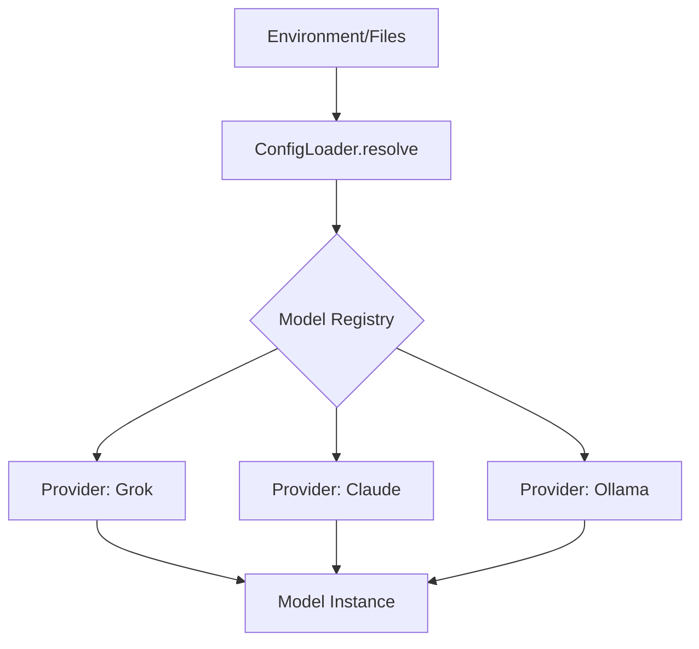

# Configuration System

The configuration system implements a multi-layered hierarchy designed to balance global defaults with granular, project-specific overrides. This documentation is intended for developers and system administrators who need to customize environment behavior, manage API credentials, or tune model parameters for specific workflows.

## Configuration Hierarchy

The system resolves settings by traversing a five-tier priority stack, where each subsequent layer overrides the values defined in the previous one. This ensures that CLI flags always take precedence over static configuration files, providing maximum flexibility during runtime.

```
1. Default (in-code)     — Base behavior
2. User (~/.codebuddy/)  — Personal preferences
3. Project (.codebuddy/) — Project-specific settings
4. Environment variables — Runtime overrides
5. CLI flags             — Highest priority
```

> **Key concept:** The configuration resolution engine uses a "last-write-wins" strategy. By utilizing `ConfigLoader.resolve()`, the system merges deep objects from the hierarchy, ensuring that specific project settings do not inadvertently wipe out global user preferences.

Following the resolution of these layers, the system maps specific file-based configurations to the application state.

## Key Configuration Files

The following table outlines the critical files utilized by the system. These files are categorized by their location and purpose, ranging from standard development tooling to internal state management within the `.codebuddy/` directory.

| File | Location |
|------|----------|
| `tsconfig.json` | project root |
| `.prettierrc` | project root |
| `vitest.config.ts` | project root |
| `.env.example` | project root |
| `AUDIT-REPORT.md` | .codebuddy/ |
| `autonomy.json` | .codebuddy/ |
| `code-graph-snapshot.json` | .codebuddy/ |
| `code-graph.json` | .codebuddy/ |
| `CODEBUDDY.md` | .codebuddy/ |
| `CODEBUDDY_MEMORY.md` | .codebuddy/ |
| `CONTEXT.md` | .codebuddy/ |
| `GROK.md` | .codebuddy/ |
| `HEARTBEAT.md` | .codebuddy/ |
| `hooks.json` | .codebuddy/ |
| `settings.local.json` | .claude/ |

Once the file system is parsed, the application integrates environment-level secrets to authenticate external services.

## Environment Variables

Environment variables serve as the primary mechanism for injecting sensitive credentials and runtime-specific toggles. The system requires specific keys to be present in the environment before initialization; failure to provide these will result in a startup error.

| Variable | Description |
|----------|-------------|
| `GROK_API_KEY` | API Key (required) |

The integration of these variables is handled by the core configuration module, which orchestrates the flow of data from the environment into the model provider interfaces.

## Model Configuration

Models are managed through `src/config/model-tools.ts`, which utilizes glob matching to apply settings across various providers. This centralized approach allows for fine-grained control over `contextWindow`, `maxOutputTokens`, and `patchFormat` on a per-model basis.



The system supports automatic provider detection based on the model name or the provided base URL. This logic is encapsulated within `ModelManager.initialize()`, which validates the configuration against the supported provider list: Grok, Claude, GPT, Gemini, Ollama, and LM Studio.

**See also:** [Overview](./1-overview.md) · [Tool System](./5-tools.md) · [Context & Memory](./7-context-memory.md) · [Development Guide](./10-development.md)

**Key source files:** `src/config/model-tools.ts`