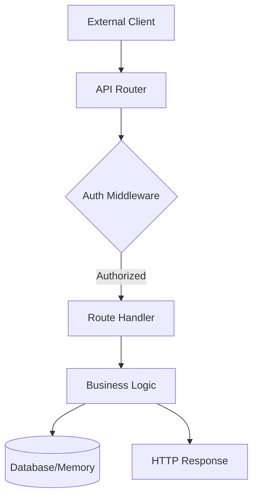

# CLI & API Reference

This section provides a comprehensive index of the system's interface layer, covering both the slash command architecture and the HTTP API endpoints. Developers should consult this reference when extending command functionality or integrating external services with the core platform.

## Slash Commands

The slash command system serves as the primary interface for user-driven interactions within the CLI environment. These commands are modularized to ensure that specific functional domains—such as documentation generation or prompt management—remain decoupled from the core execution loop.

| File | Purpose |
|------|---------|
| `/builtins` | Built-in Slash Commands |
| `/docs` | /docs slash command — Generate DeepWiki-style documentation |
| `/index` | Slash Command Module |
| `/prompts` | /prompt Slash Commands |
| `/types` | Slash Command Types |

> **Key concept:** The slash command architecture utilizes a centralized registry pattern. When a user invokes a command, the system routes the request through the `/index` module, which validates the command signature against the definitions in `/types` before execution.

Having established the command-line interface structure, we now turn to the backend communication layer, which handles external requests and service-to-service orchestration.

## HTTP API Routes

The HTTP API layer exposes the system's internal capabilities to external clients and agents. This layer is organized by functional domain, with each route file mapping to specific business logic, such as memory retrieval, tool discovery, or task execution.

| Route File | Endpoints |
|------------|----------|
| `a2a-protocol.ts` | GET /.well-known/agent.json, GET /agents, POST /tasks/send, GET /tasks/:id |
| `canvas.ts` | N/A |
| `chat.ts` | POST / |
| `health.ts` | N/A |
| `index.ts` | N/A |
| `memory.ts` | GET /, POST / |
| `metrics.ts` | GET /, GET /json, GET /snapshot, GET /history, GET /dashboard |
| `sessions.ts` | GET / |
| `tools.ts` | GET /, GET /categories |
| `workflow-builder.ts` | N/A |

To better understand how these routes interact with the underlying system, consider the following data flow for an incoming API request:

When implementing new endpoints, developers should ensure that route handlers utilize the appropriate controller methods, such as `MetricsController.getSnapshot()` or `MemoryController.postEntry()`, to maintain consistency across the API surface.

---

**See also:** [Architecture](./2-architecture.md) · [Subsystems](./3-subsystems.md) · [Tool System](./5-tools.md) · [Context & Memory](./7-context-memory.md)