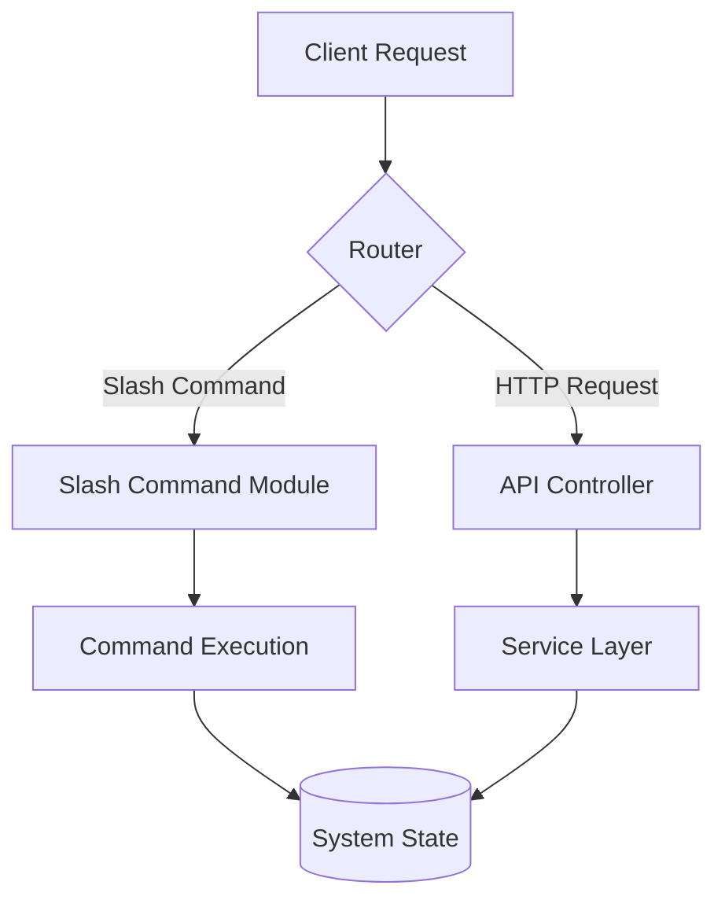

# CLI & API Reference

This section provides a comprehensive technical reference for the system's command-line interface (CLI) slash commands and HTTP API endpoints. It is intended for developers integrating external services, building custom agents, or extending the core command-line functionality.

The system architecture relies on a modular routing and command registration pattern to ensure scalability. Below is the high-level data flow for incoming requests:

## Slash Commands

The CLI utilizes a modular slash command architecture, where each file in the `/commands` directory maps to specific user-facing functionality. These commands are registered via the `CommandRegistry.register()` method to ensure type safety and consistent execution context.

| File | Purpose |
|------|---------|
| `/builtins` | Built-in Slash Commands |
| `/docs` | /docs slash command — Generate DeepWiki-style documentation |
| `/index` | Slash Command Module |
| `/prompts` | /prompt Slash Commands |
| `/types` | Slash Command Types |

> **Key concept:** The `/docs` command leverages the `DocumentationGenerator.generate()` method to parse existing codebase annotations, reducing manual documentation overhead by automating the extraction of metadata and interface definitions.

Following the command registration, the system exposes a RESTful API layer to facilitate inter-agent communication and external service integration.

## HTTP API Routes

The API layer is structured to support both internal state management and external A2A (Agent-to-Agent) communication protocols. Developers should interact with these routes using the standard `ApiClient.request()` method to ensure proper authentication headers and error handling are applied.

| Route File | Endpoints |
|------------|----------|
| `a2a-protocol.ts` | GET /.well-known/agent.json, GET /agents, POST /tasks/send, GET /tasks/:id |
| `canvas.ts` | N/A |
| `chat.ts` | POST / |
| `health.ts` | N/A |
| `index.ts` | N/A |
| `memory.ts` | GET /, POST / |
| `metrics.ts` | GET /, GET /json, GET /snapshot, GET /history, GET /dashboard |
| `sessions.ts` | GET / |
| `tools.ts` | GET /, GET /categories |
| `workflow-builder.ts` | N/A |

The `a2a-protocol.ts` file is particularly critical for distributed deployments, as it handles the discovery and task delegation logic required for multi-agent orchestration.

---

**See also:** [Architecture](./2-architecture.md) · [Subsystems](./3-subsystems.md) · [Tool System](./5-tools.md) · [Context & Memory](./7-context-memory.md)