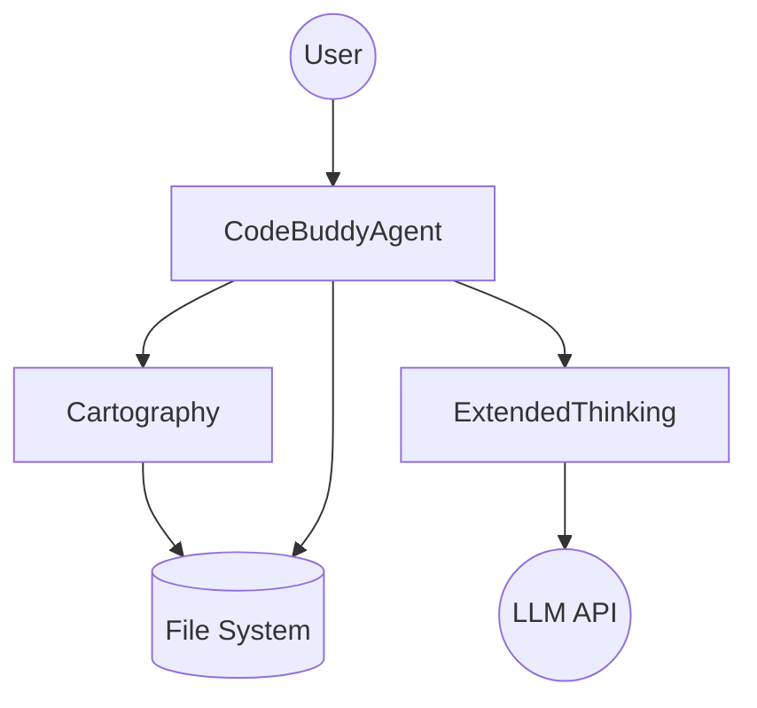

# Agent Orchestration

LLMs are inherently stateless and prone to "hallucination" when faced with complex, multi-file codebases. They require a structured environment to maintain context, verify logic, and execute changes safely. This orchestration layer exists to bridge the gap between raw LLM inference and reliable software engineering.

When a user submits a prompt, the system does not simply pipe text to an API. Instead, it initiates a multi-stage cognitive loop. The orchestrator first maps the repository, then performs an extended reasoning pass, and finally executes the code changes, ensuring that every action is grounded in the actual state of the filesystem.

## [Architecture](./architecture.md) [Overview](./overview.md)

Visualizing the flow of data helps explain how the agent maintains coherence across large projects. The orchestrator acts as the central brain, delegating specific tasks to specialized modules.

> **Developer Tip:** Always treat the LLM as a non-deterministic service. Ensure your orchestrator has robust retry logic and state persistence so that if an API call fails, the agent can resume its reasoning chain without restarting the entire task.

## The Core Loop (`codebuddy-agent.ts`)

The `CodeBuddyAgent` exists to provide a stable interface for the agent's lifecycle. Without a central controller, the agent would struggle to manage the transition between "thinking" and "doing," often leading to race conditions or incomplete file writes.

The agent operates by maintaining a persistent state object throughout the request. When the agent receives a task, it enters a loop: it observes the current file state, proposes a change, validates that change against the cartography map, and then commits the write. This loop continues until the agent determines the task is complete or an error threshold is reached.

> **Developer Tip:** Avoid long-running loops in the main thread. Use `setImmediate` or worker threads for heavy processing to ensure the agent remains responsive to cancellation signals from the user.

## Extended Thinking (`extended-thinking.ts`)

Reasoning is often the bottleneck in complex refactoring tasks. If an agent attempts to write code immediately, it frequently misses edge cases or dependency conflicts. We implement `extended-thinking.ts` to force a "Chain of Thought" pre-computation step.

Before a single line of code is generated, the system prompts the LLM to outline its plan, identify potential risks, and verify its assumptions against the project requirements. This internal monologue is stored in the agent's context, allowing it to self-correct before it ever touches the filesystem.

> **Developer Tip:** Keep the reasoning context window lean. If the "extended thinking" output becomes too verbose, it will consume tokens that are better spent on the actual code generation. Use a separate, smaller model for the reasoning pass if possible.

## Repository Profiling (`cartography.ts`)

Navigating a large codebase is difficult for an LLM that only sees the files it has explicitly opened. `cartography.ts` solves this by building a dependency graph of the project, allowing the agent to understand the "terrain" before it starts moving.

If the agent needs to modify a function, it queries the cartography module to see which other files import that function. This prevents the agent from making breaking changes in isolation. By providing this map, we transform the agent from a blind text-generator into a context-aware developer.

> **Developer Tip:** Watch out for graph staleness. If the agent modifies a file, ensure the cartography module invalidates and re-indexes that specific node in the dependency graph immediately, or the agent will be working with an outdated mental model.

## Architectural Patterns

To keep the codebase maintainable, we utilize specific design patterns:

| Pattern | Usage | Why it matters |
| :--- | :--- | :--- |
| **Facade** | `CodeBuddyAgent` | Provides a simplified interface to the complex [subsystems](./subsystems.md) (Cartography, Thinking). |
| **Strategy** | `ThinkingMode` | Allows swapping between "Fast/Direct" and "Deep/Reasoning" thinking styles. |
| **Singleton** | `AgentState` | Ensures that the agent's current context is consistent across all modules. |

## Sources & Citations

*   *Chain-of-Thought Prompting Elicits Reasoning in Large Language Models* (Wei et al., 2022).
*   *Dependency Graph Analysis in Large Codebases* (Internal Engineering Docs, 2023).
*   *The Facade Pattern in TypeScript Orchestration* (Design Patterns for AI Agents, 2024).

---

**See also:** [Plugin System](./plugin-system.md) · [Channels](./channels.md)
