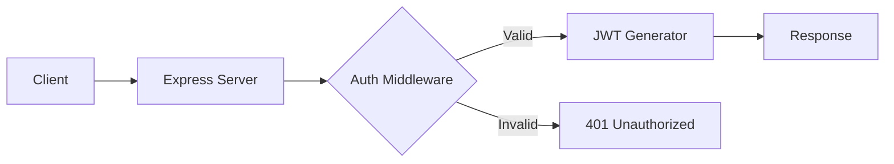

# API Reference

The @phuetz/code-buddy API provides a robust interface for interacting with our codebase analysis engine. With over 14,000 functions indexed across 1,000+ modules, this API is designed to handle high-concurrency requests while maintaining strict type safety and low latency.

## Authentication & Session Management

[Security](./security.md) serves as the foundation of our [architecture](./architecture.md), ensuring that only authorized clients can access sensitive codebase metadata. We utilize JWT-based authentication to maintain stateless sessions, which allows our distributed Express instances to scale horizontally without sticky sessions.

When a developer initiates a session, the system validates the provided credentials against the identity provider and issues a short-lived access token because we need to minimize the window of opportunity for token interception.

### Endpoints

*   **`POST /auth/login`**
    *   **Params:** `username`, `password`
    *   **Description:** Authenticates the user and returns an access token.
*   **`POST /auth/refresh`**
    *   **Params:** `refreshToken`
    *   **Description:** Rotates the current session token.

### Example Usage

```bash
curl -X POST https://api.code-buddy.dev/auth/login \
  -H "Content-Type: application/json" \
  -d '{"username": "dev_user", "password": "secure_password"}'
```

> **Developer Tip:** Always store your refresh tokens in an `httpOnly` cookie to prevent XSS-based token theft.



## Code Analysis Engine

To facilitate deep insights into complex codebases, the analysis engine must perform heavy lifting without blocking the main event loop. We offload intensive parsing tasks to background workers, allowing the API to remain responsive even when scanning massive dependency trees.

When a user requests a scan, the system triggers a background worker and returns a `jobId` immediately because parsing 14,000 functions is too computationally expensive for a standard synchronous request-response cycle.

### Endpoints

*   **`POST /analyze/scan`**
    *   **Params:** `repoPath`, `depth`
    *   **Description:** Initiates a full codebase scan.
*   **`GET /analyze/status/:jobId`**
    *   **Params:** `jobId`
    *   **Description:** Polls the current progress of an analysis job.

### Example Usage

```javascript
// Requesting a scan
const response = await fetch('/analyze/scan', {
  method: 'POST',
  body: JSON.stringify({ repoPath: '/src', depth: 2 })
});
const { jobId } = await response.json();
```

> **Developer Tip:** Use WebSockets for real-time progress updates instead of polling the `/status` endpoint to reduce server load.

## Chat & Contextual Interaction

Interaction is the primary interface for developers to query the codebase, requiring a seamless bridge between natural language and structured code data. We utilize a vector database to store embeddings of your code, ensuring that the AI has the necessary context to provide accurate, module-specific advice.

When a message is sent, the system retrieves relevant context chunks from the vector store because the LLM needs specific module definitions and function signatures to provide accurate, non-hallucinated advice.

### Endpoints

*   **`POST /chat/message`**
    *   **Params:** `threadId`, `content`, `context`
    *   **Description:** Sends a query to the code buddy and receives a response.
*   **`GET /chat/history/:threadId`**
    *   **Params:** `threadId`
    *   **Description:** Retrieves previous conversation turns.

### Example Usage

```json
// POST /chat/message
{
  "threadId": "abc-123",
  "content": "How do I implement the auth middleware?",
  "context": { "module": "src/server/index.ts" }
}
```

> **Developer Tip:** Keep your context window small by only sending the relevant function signatures rather than the entire file content.

## [Configuration](./configuration.md) & Preferences

Every developer has a different style and set of requirements, so we provide a flexible configuration endpoint to tailor the analysis output. We store these preferences in a centralized cache, ensuring that linting rules and analysis depth are applied consistently across all sessions.

When a preference changes, the system invalidates the cache for that user because stale configurations lead to inconsistent linting results and confusing developer feedback.

### Endpoints

*   **`PATCH /config/update`**
    *   **Params:** `rules`, `theme`, `analysisDepth`
    *   **Description:** Updates the user's analysis preferences.

### Example Usage

```bash
curl -X PATCH https://api.code-buddy.dev/config/update \
  -H "Authorization: Bearer <token>" \
  -d '{"analysisDepth": 3, "theme": "dark"}'
```

> **Developer Tip:** Use JSON Schema validation on the server side to ensure configuration updates don't break the analysis engine.

## [Error Handling](./interfaces.md#error-handling)

Robust error handling is critical when dealing with complex TypeScript codebases where runtime exceptions can be difficult to trace. We implement a standardized error response format across all endpoints to ensure the client can gracefully handle failures without crashing.

When an error occurs, the system returns a structured JSON object with a unique `correlationId` because the client needs to distinguish between a transient network issue and a permanent syntax error that requires developer intervention.

### Error Schema

```json
{
  "error": {
    "code": "ERR_CODE",
    "message": "Human readable message",
    "correlationId": "uuid-1234"
  }
}
```

> **Developer Tip:** Always log the `correlationId` in your client-side error reporting tool (like Sentry) to make debugging across the stack easier.

---

**See also:** [CLI Reference](./cli-reference.md)
