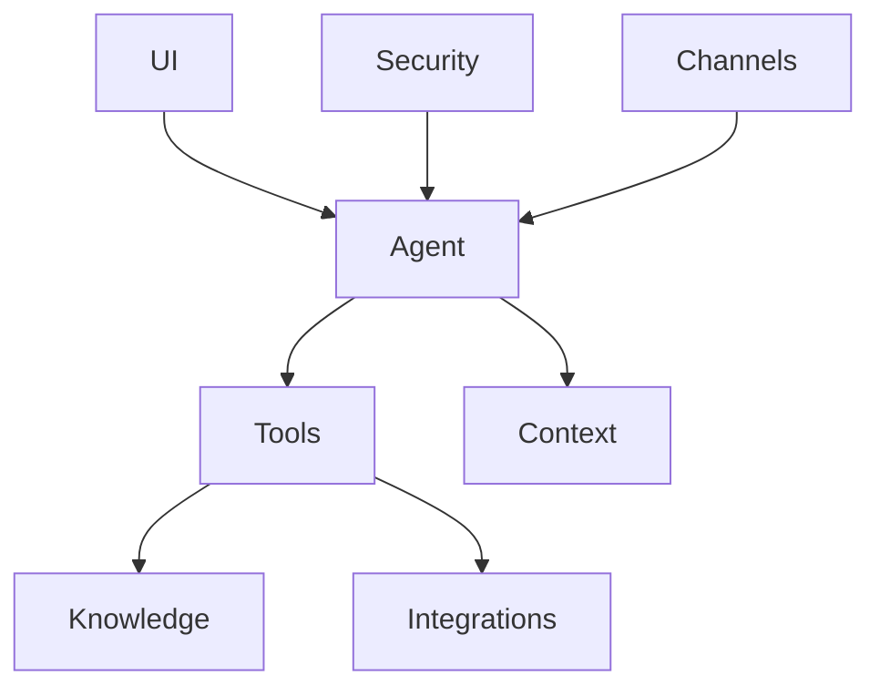

# Architecture

Code-buddy is engineered as a highly modular, plugin-based ecosystem designed to manage the complexity of over 1,000 modules and 14,000+ functions. We chose this architecture because monolithic structures fail to scale when handling diverse agentic tasks; by decoupling the [agent orchestration](./agent-orchestration.md) from specific tool implementations, we ensure that adding a new capability doesn't require refactoring the core engine.

### System [Overview](./overview.md)

To maintain stability across such a large codebase, the system is organized into distinct functional layers. Each layer serves a specific domain—from `channels` handling input to `security` enforcing guardrails—allowing developers to isolate concerns effectively.

> **Developer Tip:** When adding new functionality, always place logic in the thinnest possible layer; if a feature involves both UI and logic, split it into `ui` and `agent` modules rather than creating a "god object."

### How It Works

When a developer triggers a command, the system initiates a multi-stage orchestration flow to ensure the request is safe, understood, and actionable. The process begins at the `channels` layer, which captures the raw input, and passes it through `message-preprocessing` to sanitize and normalize the data before it ever reaches the core logic.

The system then invokes the `CodeBuddyAgent` (defined in `src/agent/codebuddy-agent.ts`), which acts as the central brain. It evaluates the current state using the `CodeActMode` singleton to determine the appropriate execution strategy. This singleton pattern is critical here because it ensures that the agent's state—such as its current context and active toolset—remains consistent throughout the lifecycle of a single user interaction.

> **Developer Tip:** Use the `CodeActMode` singleton to manage state transitions, but avoid storing long-lived user data inside it; pass state via the `context` layer to keep the agent stateless between distinct requests.

### Core Execution Flow

1.  **Ingestion:** The `channels` layer receives the request and triggers `message-preprocessing` to strip sensitive data and format the payload.
2.  **Validation:** The `security` layer intercepts the preprocessed message, checking it against `auth-monitoring` policies to ensure the user has the necessary permissions.
3.  **Orchestration:** The `CodeBuddyAgent` receives the validated request and queries the `context` layer to retrieve relevant history or project state.
4.  **Execution:** Based on the context, the agent selects the appropriate tool from the `tools` layer, which may interact with `knowledge` bases or external `integrations`.
5.  **Response:** The result is passed back through the `ui` layer, which formats the output for the specific channel that initiated the request.

> **Developer Tip:** Always implement a "dry-run" mode in your tools; this allows the agent to simulate execution without side effects, which is invaluable for debugging complex orchestration flows.

### [Design Decisions and Trade-offs](./[subsystems](./subsystems.md).md#design-decisions-and-trade-offs)

We opted for a heavy reliance on Singleton patterns for core services like `AuthMonitoring`, `Polls`, and `SendPolicy` to minimize memory overhead and ensure a "single source of truth" for system-wide configurations. While this simplifies state management, it introduces a trade-off: unit testing becomes more difficult because global state persists between tests.

To mitigate this, we enforce strict dependency injection in all non-singleton modules. By requiring dependencies to be passed into constructors rather than imported directly, we maintain the ability to mock these services during testing, effectively balancing the performance benefits of singletons with the necessity of testable code.

> **Developer Tip:** If you find yourself needing to reset a singleton's state during testing, expose a `reset()` method that is strictly guarded by `process.env.NODE_ENV === 'test'`.

### Data Flow

Data moves through the system as a unidirectional stream, starting from the input channel and terminating at the output interface. This flow is strictly enforced to prevent race conditions, especially when multiple tools are executing concurrently.

Information is transformed at each layer: raw strings become structured objects in the `channels` layer, enriched with metadata in the `context` layer, and finally converted into actionable tool calls by the `agent` layer. This transformation pipeline ensures that by the time a tool executes, it has all the necessary, validated, and sanitized information required to perform its task without needing to query the database or external APIs again.

> **Developer Tip:** Use TypeScript interfaces to define the "contract" for data moving between layers; if a layer changes its output format, the compiler will immediately highlight which downstream layers need updates.