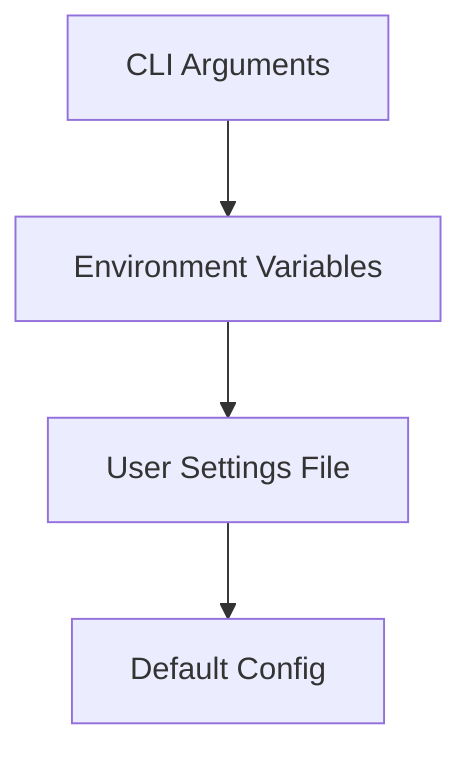

# Configuration

To ensure `@phuetz/code-buddy` operates securely and predictably across different environments, the system relies on a layered configuration strategy. We prioritize [security](./security.md) by isolating sensitive credentials from application logic, allowing you to rotate keys without modifying the codebase. When the application initializes, it aggregates these layers into a single runtime configuration object, ensuring that the most specific instruction—whether it's a CLI flag or an environment variable—always takes precedence over global defaults.

### Configuration Hierarchy

Understanding the order of precedence is critical when debugging unexpected behavior. When you launch the application, the system evaluates configuration sources in a specific sequence. It checks for CLI arguments first because these represent the most immediate, ephemeral intent of the user. If no CLI argument is found, it falls back to environment variables, then to user settings files, and finally to the hardcoded defaults.



> **Developer Tip:** Use `dotenv` or a similar tool to manage local `.env` files during development, but ensure `.env` is added to your `.gitignore` to prevent accidental credential exposure.

### Environment Variables

Environment variables serve as the primary mechanism for injecting secrets and operational overrides into the runtime. Because these values are injected at the process level, they are ideal for sensitive API keys and environment-specific toggles that should not be committed to version control.

| Variable | Type | Default | Description |
| :--- | :--- | :--- | :--- |
| `GROK_API_KEY` | String | Required | API key for x.ai services. |
| `MORPH_API_KEY` | String | N/A | Enables fast file editing capabilities. |
| `YOLO_MODE` | Boolean | `false` | Enables full autonomy mode (requires `/yolo on`). |
| `MAX_COST` | Number | `0` | Session cost limit in USD. |
| `GROK_BASE_URL` | String | `api.x.ai` | Custom API endpoint for Grok. |
| `GROK_MODEL` | String | `grok-beta` | Default model identifier. |
| `JWT_SECRET` | String | Required | Secret for API server authentication. |
| `PICOVOICE_ACCESS_KEY` | String | N/A | Access key for Porcupine wake word detection. |
| `BRAVE_API_KEY` | String | N/A | API key for Brave Search MCP. |
| `EXA_API_KEY` | String | N/A | API key for Exa neural search MCP. |
| `PERPLEXITY_API_KEY` | String | N/A | API key for Perplexity AI. |
| `OPENROUTER_API_KEY` | String | N/A | API key for OpenRouter. |
| `CODEBUDDY_MAX_TOKENS` | Number | `4096` | Override for response token limits. |
| `CACHE_TRACE` | Boolean | `false` | Enables debug logging for prompt construction. |
| `PERF_TIMING` | Boolean | `false` | Profiles the startup phase. |
| `VERBOSE` | Boolean | `false` | Enables verbose output logging. |
| `SENTRY_DSN` | String | N/A | DSN for Sentry error reporting. |
| `OTEL_EXPORTER_OTLP_ENDPOINT` | String | N/A | OTLP endpoint for distributed tracing. |

> **Developer Tip:** When debugging complex prompt issues, set `CACHE_TRACE=true` to inspect the exact prompt structure sent to the LLM before it is processed.

### Tool Profiles & User Settings

Beyond simple keys, the system allows for granular control over AI behavior via TypeScript configuration files. When you want to customize how the AI interacts with your file system or specific tools, you modify the tool profiles. The system loads these files because they provide a structured, type-safe way to define capabilities that are too complex for simple environment variables.

#### `src/config/user-settings.ts`
This file manages general user preferences and behavioral constraints.

```typescript
export const userSettings = {
  theme: 'dark',
  autoSave: true,
  defaultProjectRoot: './projects',
  telemetry: false
};
```

#### `src/config/tool-profiles.ts`
This file defines the capabilities and constraints for specific tools available to the agent.

```typescript
export const toolProfiles = {
  fileSystem: {
    readOnly: false,
    allowedPaths: ['/src', '/docs']
  },
  search: {
    enabled: true,
    provider: 'brave'
  }
};
```

> **Developer Tip:** Since these are TypeScript files, you can use logic (e.g., `process.env` checks) inside these files to dynamically adjust settings based on the environment without needing a complex build step.

### Configuration File Formats

For persistent settings that don't change frequently, we utilize standard TypeScript exports. This approach allows for compile-time validation of your configuration. If you attempt to provide a string where a number is expected in `user-settings.ts`, the TypeScript compiler will catch the error during the `build` process, preventing runtime failures.

To apply changes, simply modify the respective files in `src/config/` and restart the application using `npm run dev` or `npm run start`. The system re-reads these files on every initialization, ensuring your latest changes are always applied.

---

**See also:** [Security](./security.md)
