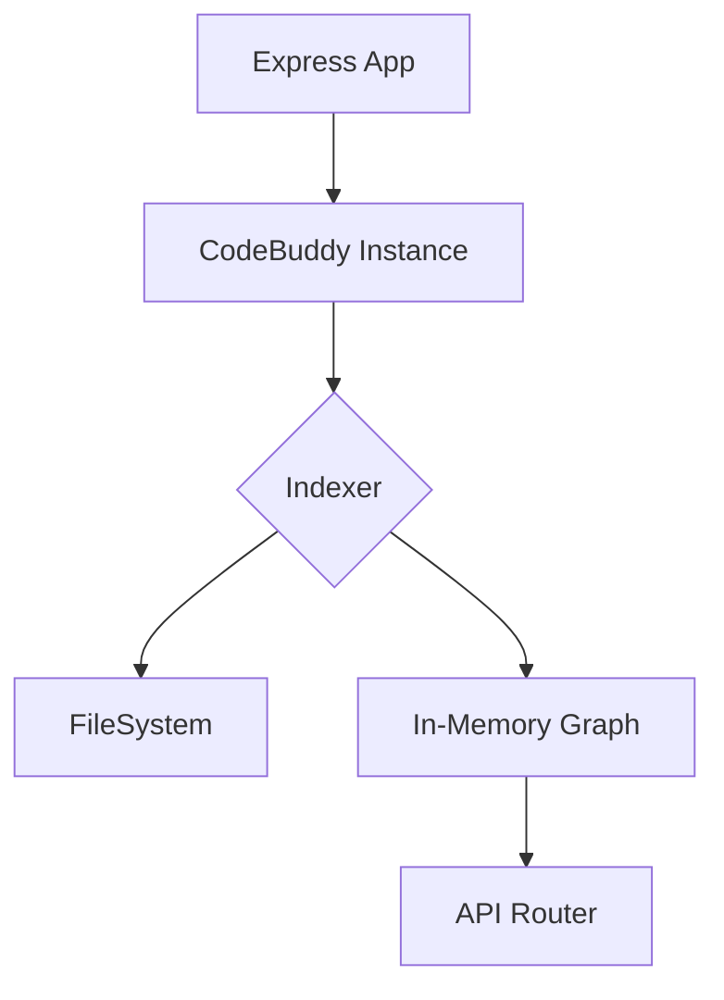

# Getting Started

When you are staring at a repository containing 1,083 modules and 14,351 functions, finding the right entry point can feel like searching for a needle in a haystack. @phuetz/code-buddy solves this by dynamically indexing your TypeScript codebase, allowing you to query relationships and dependencies instantly through a lightweight Express middleware.

## Prerequisites

To ensure the server runs without compatibility issues, you must have a stable Node.js environment. The project relies on modern TypeScript features and asynchronous file system operations, so we require a runtime that supports ES modules and `async/await` patterns natively.

*   **Node.js:** v18.0.0 or higher
*   **Package Manager:** npm (v9+) or yarn (v3+)
*   **TypeScript:** v5.0.0 or higher

> **Developer Tip:** Use [nvm](https://github.com/nvm-sh/nvm) to manage your Node versions. This prevents global dependency conflicts when switching between different projects.

## Installation

Because this package acts as middleware for your existing Express application, it needs to be installed as a dependency within your project root. This allows the server to hook into your existing request lifecycle and expose the indexing endpoints.

Run the following command in your terminal:

```bash
npm install @phuetz/code-buddy
```

> **Developer Tip:** Always use `--save-exact` when installing to ensure your dependency tree remains deterministic across different developer machines.

## Minimal Working Example

Once the package is installed, you need to initialize the Code Buddy instance within your Express application. When the server boots, it triggers an initial scan of your `src` directory because it must build an in-memory graph of your 14,351 functions to provide sub-millisecond lookup times.

```typescript
import express from 'express';
import { CodeBuddy } from '@phuetz/code-buddy';

const app = express();
const buddy = new CodeBuddy({ rootDir: './src' });

// Initialize the indexing engine
await buddy.init();

// Mount the middleware
app.use('/code-buddy', buddy.router);

app.listen(3000, () => console.log('Code Buddy active on /code-buddy'));
```

The following diagram illustrates how the system initializes:



> **Developer Tip:** Always `await` the `init()` method before starting your Express server to ensure the index is fully populated before the first request arrives.

## Common [Configuration](./configuration.md) Options

Customization is essential because every codebase contains noise that shouldn't be indexed, such as test files, build artifacts, or third-party vendor code. By providing a configuration object, you can fine-tune the scanner to ignore specific directories, ensuring the memory footprint remains low.

```typescript
const buddy = new CodeBuddy({
  rootDir: './src',
  exclude: ['**/__tests__/**', '**/dist/**', '**/node_modules/**'],
  maxDepth: 5,
  enableCache: true
});
```

> **Developer Tip:** Create a `.codebuddyignore` file in your root directory to keep your configuration clean; the library automatically detects and respects this file.

## Next Steps

Finally, now that your server is running, you may want to explore the advanced query capabilities or integrate the CLI tools. These resources will help you leverage the full power of the dependency graph:

*   [API Reference](/docs/api) — Detailed documentation on available endpoints.
*   [CLI Usage](/docs/cli) — How to generate dependency reports without the server.
*   [Performance Tuning](/docs/performance) — Strategies for indexing massive codebases.

> **Developer Tip:** Check the server logs on startup; Code Buddy outputs the total number of indexed functions and the time taken, which is useful for benchmarking your CI/CD pipeline.

---

**See also:** [Key Concepts](./key-concepts.md) · [Configuration](./configuration.md)
