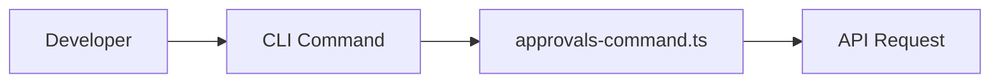
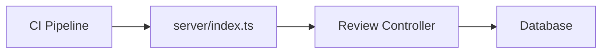

# CLI & [API Reference](./api-reference.md)

Code Buddy is designed to bridge the gap between local development workflows and automated CI/CD pipelines. By providing a unified interface for code [approvals](./cli-reference.md#approvals) and status tracking, it ensures that your team maintains high standards across a codebase of over 14,000 functions.

To facilitate this, we provide two primary interaction layers: a Command Line Interface for developers working in their local terminals, and a REST API for automated systems.

## Command Line Interface (CLI)

The CLI is built to minimize context switching for developers. When a developer needs to sign off on a feature branch, they shouldn't have to leave their terminal to navigate a web dashboard. By utilizing `src/commands/cli/approvals-command.ts`, the CLI interacts directly with the local environment to validate and submit approval states.

### Commands

| Command | Parameters | Description |
| :--- | :--- | :--- |
| `approve` | `--id` (string) | Marks a specific PR or commit as approved. |
| `reject` | `--id` (string), `--reason` (string) | Rejects a PR with a mandatory feedback string. |
| `status` | `--id` (string) | Fetches the current approval state of a module. |

### Usage Example

When you execute `code-buddy approve --id PR-123`, the system validates the local git context before sending the request to the server.

```bash
# Approving a pull request
npx @phuetz/code-buddy approve --id PR-123

# Rejecting with feedback
npx @phuetz/code-buddy reject --id PR-123 --reason "Missing unit tests"
```

### CLI Workflow


> **Developer Tip:** Use the `--dry-run` flag during your initial setup to verify that your authentication tokens are correctly configured without actually modifying the PR state.

---

## REST API

RESTful endpoints are essential for integrating Code Buddy into your existing CI/CD infrastructure. Because our [architecture](./architecture.md) relies on `src/server/index.ts` to handle incoming webhooks and status updates, the API is designed to be stateless and highly scalable, allowing it to handle requests from thousands of concurrent build jobs.

### Endpoints

| Method | Endpoint | Params | Description |
| :--- | :--- | :--- | :--- |
| `POST` | `/api/v1/review` | `prId`, `status`, `user` | Submits a review decision to the server. |
| `GET` | `/api/v1/status/:id` | `id` | Retrieves the current approval status. |
| `POST` | `/api/v1/sync` | `repoUrl` | Triggers a manual sync of the module registry. |

### Usage Example

When the CI pipeline finishes running the test suite, it notifies the server of the result. The server then updates the database, ensuring that the approval status is always in sync with the latest build artifacts.

```http
POST /api/v1/review HTTP/1.1
Content-Type: application/json

{
  "prId": "PR-123",
  "status": "APPROVED",
  "user": "ci-bot"
}
```

### API Workflow


> **Developer Tip:** Implement an exponential backoff strategy in your CI pipeline when calling the `/api/v1/sync` endpoint to prevent rate-limiting during high-traffic deployment windows.

---

## Error Handling

Consistency in error reporting is critical when managing a codebase of this magnitude. When an operation fails, the system returns a standardized JSON object, allowing your tools to programmatically handle issues without manual intervention.

### Standard Error Structure

Every error response follows this schema:
```json
{
  "error": "ERROR_CODE",
  "message": "Human-readable explanation",
  "timestamp": "ISO-8601"
}
```

### Common Error Codes

*   `AUTH_FAILED`: The provided API token is invalid or expired.
*   `MODULE_NOT_FOUND`: The requested PR or module ID does not exist in the registry.
*   `VALIDATION_ERROR`: The payload provided does not match the required schema (e.g., missing `reason` on rejection).

> **Developer Tip:** Always log the `timestamp` from the error response; it is invaluable when cross-referencing logs between the CLI client and the server during debugging sessions.