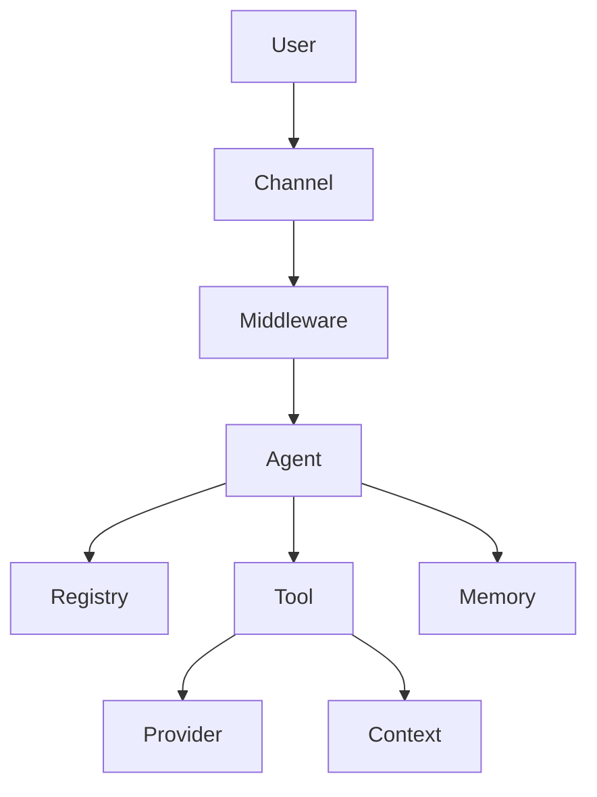

# Key Concepts

When a developer integrates `@phuetz/code-buddy`, they are essentially building a bridge between their codebase and an intelligent assistant. Understanding these primitives is crucial because they form the backbone of how the system orchestrates complex coding tasks across diverse environments.

## Core [Architecture](./architecture.md): Agents & Orchestration

To maintain consistency, the system requires a central authority that interprets intent and manages the lifecycle of automated tasks. The **CodeBuddy** instance acts as the root orchestrator, delegating specific responsibilities to an **Agent** that is tracked and managed within the **Registry**.

*   **CodeBuddy**: The primary entry point and orchestrator for the entire application lifecycle.
*   **Agent**: A specialized unit of logic designed to interpret user intent and execute tasks.
*   **Registry**: A centralized store that tracks available agents and their current operational status.
*   **Middleware**: Intercepting logic that processes requests before they reach the agent, useful for logging or authentication.

> **Developer Tip:** Keep agents focused on single domains (e.g., "RefactoringAgent" vs "TestingAgent") to prevent prompt drift and reduce token usage.

## Communication & Interfaces: [Channels](./channels.md)

Systems need a way to talk to the outside world without coupling the core logic to specific transport protocols like HTTP, WebSockets, or CLI inputs. By utilizing **Channels**, the system normalizes incoming **Requests** and outgoing **Responses**, ensuring the agent remains agnostic about whether it is interacting with a developer via a terminal or a [REST API](./interfaces.md#rest-api).

*   **Channel**: An abstraction layer that defines how the system communicates with external interfaces.
*   **Request**: A standardized data structure representing the user's intent or command.
*   **Response**: The structured output returned by the agent back to the channel.
*   **Session**: A persistent state container that tracks the history of a specific user interaction.

> **Developer Tip:** Use channels to decouple transport logic from business logic; if you need to switch from Express to a CLI, you should only need to implement a new Channel.

## Capabilities: Tools & Execution

An agent is effectively blind and paralyzed without the ability to interact with the filesystem, external APIs, or project metadata. **Tools** provide the "hands" for the agent, utilizing a **Provider** to execute specific actions, while maintaining **Context** to ensure the agent knows exactly where it is in the project structure.

*   **Tool**: A discrete function or capability that an agent can invoke to perform work.
*   **Provider**: The underlying service or driver that executes the logic defined by a tool.
*   **Context**: The metadata and state information provided to a tool to ensure it operates within the correct scope.
*   **Memory**: A storage mechanism that allows the agent to recall previous interactions or project states.

> **Developer Tip:** Always validate tool inputs using a schema validator; never trust the agent's output to directly modify the file system without sanitization.

## Architectural [Overview](./overview.md)

The following diagram illustrates how a user request flows through the system, moving from the interface layer into the execution logic.

---

**See also:** [Architecture](./architecture.md) · [Subsystems](./subsystems.md)
