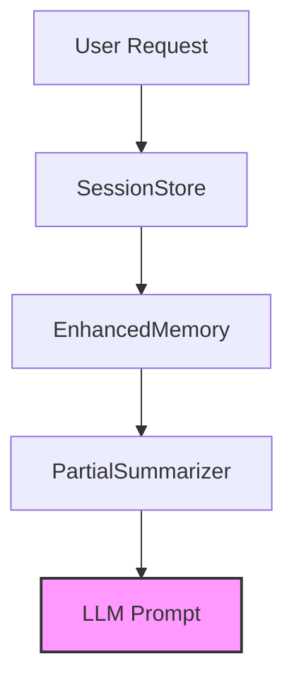

# Memory & Context

Large Language Models are inherently stateless, meaning they treat every interaction as a blank slate. This creates a significant friction point where users must constantly re-explain their codebase or previous instructions, leading to a disjointed experience. We built the Memory & Context subsystem to solve this "amnesia" by maintaining a persistent, summarized state of the conversation, ensuring that the AI retains continuity across multiple HTTP requests.

> **Developer Tip:** Use `EnhancedMemory` for active, short-term context and `SessionStore` for long-term session recovery to balance performance and persistence.

## [Architecture](./architecture.md)

To visualize how these pieces fit together, consider the lifecycle of a single user interaction. When a request arrives, the system orchestrates a handoff between the session store and the summarizer to build a coherent prompt. This ensures that the LLM receives only the most relevant historical data, preventing context window overflow while maintaining conversational flow.

> **Developer Tip:** Always validate the session ID before invoking `EnhancedMemory` to prevent cross-user data leakage during concurrent requests.

## [Module Breakdown](./[channels](./channels.md).md#module-breakdown)

Below is a breakdown of the core modules responsible for managing state and context within the application. These modules work in concert to transform raw user input into a structured, context-aware prompt.

| Module | Description |
| :--- | :--- |
| `src/memory/enhanced-memory.ts` | Manages active conversation state and short-term recall. |
| `src/persistence/session-store.ts` | Handles long-term storage and retrieval of user sessions. |
| `src/context/partial-summarizer.ts` | Compresses historical context to fit within LLM token limits. |

> **Developer Tip:** Keep the `PartialSummarizer` logic lightweight; heavy processing here increases latency for every turn in the conversation.

## [Data Flow](./subsystems.md#data-flow)

Data traverses the system in a specific sequence to ensure the LLM receives relevant information without exceeding token limits. When a user sends a message, the system first fetches the existing session from `session-store`. It then passes this raw data to `enhanced-memory` to inject the current state, and finally, `partial-summarizer` condenses the history into a concise prompt. This pipeline ensures the model remains "aware" of the conversation history while keeping the context window manageable.

> **Developer Tip:** Monitor the token count returned by `partial-summarizer` to avoid 400 errors from the LLM provider.

## [Entry Points](./channels.md#entry-points)

Developers looking to extend or debug the memory subsystem should begin by examining the integration points in the Express middleware. These entry points are where the request context is initialized and where the memory state is hydrated before reaching the controller logic.

> **Developer Tip:** Use the `DEBUG=code-buddy:memory:*` environment variable to trace state transitions in real-time during development.

---

**See also:** [Channels](./channels.md) · [Tools & Integrations](./tools-integrations.md)
