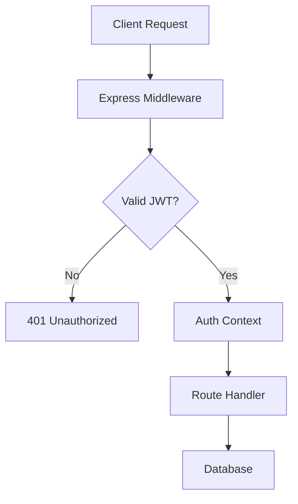

# [Security](./security.md) & [Configuration](./configuration.md)

Security is not a feature to be added at the end of the development cycle; it is the foundational constraint upon which the entire `@phuetz/code-buddy` architecture is built. We prioritize defense-in-depth to ensure that even if one layer of the application fails, the integrity of user data remains intact.

When a user interacts with the system, the application must verify their identity and permissions before executing any business logic. We achieve this by centralizing our security logic within `src/security/index.ts`, which acts as the gatekeeper for all incoming requests, ensuring that no unauthorized code execution occurs.

> **Developer Tip:** Always treat the `src/security/index.ts` file as immutable in production; avoid adding business logic here to prevent circular dependencies and security regressions.

## Authentication & Authorization

Authentication is the process of verifying who a user is, while authorization determines what they are allowed to do. We decouple these concerns to ensure that our authentication provider can be swapped or upgraded without requiring a rewrite of our authorization logic.

When a request hits the Express server, the system triggers the authentication middleware. This middleware inspects the request headers for a valid JSON Web Token (JWT). If the token is missing or expired, the system rejects the request immediately because we operate on a "deny-by-default" policy.

> **Developer Tip:** Use environment variables for your JWT secrets; never hardcode keys in `src/security/index.ts` or any other repository file.

## Protected Resources

Protecting sensitive data requires granular control over access patterns. We identify sensitive resources—specifically those involving user configurations—and wrap them in strict validation layers to prevent unauthorized modification or exposure.

When a developer attempts to access or modify `src/config/user-settings.ts`, the system enforces a strict schema validation check. This is necessary because user settings often contain preferences that, if manipulated, could lead to account takeover or data leakage. We ensure that only the authenticated user or an administrator can perform write operations on these specific modules.

> **Developer Tip:** Use TypeScript interfaces to define strict shapes for your configuration objects, preventing prototype pollution attacks when parsing user-provided settings.

## Threat Model Summary

Threat modeling allows us to anticipate how an attacker might attempt to compromise the system. We assume the network is hostile and that every input is potentially malicious, which drives our decision to implement aggressive sanitization and rate limiting.

If an attacker attempts to inject malicious payloads into our API endpoints, the system automatically sanitizes the input and logs the event for audit purposes. We do this because proactive detection is significantly more cost-effective than reactive incident response. Our primary threats include Cross-Site Scripting (XSS), SQL Injection, and unauthorized API access.

> **Developer Tip:** Implement `helmet` in your Express app to automatically set secure HTTP headers, which mitigates common web vulnerabilities like XSS and clickjacking.

## Security Checklist for Contributors

Maintaining a secure codebase is a collective responsibility that requires constant vigilance. We enforce these standards to ensure that every pull request maintains the integrity of the `@phuetz/code-buddy` ecosystem.

Before pushing code to the repository, every contributor must verify that their changes do not introduce new dependencies without a security audit. This is critical because third-party packages are a common vector for supply chain attacks. By following this checklist, we ensure that security remains a constant, not an afterthought.

1.  **Dependency Audit:** Run `npm audit` and resolve all high-severity vulnerabilities.
2.  **Secret Scanning:** Ensure no API keys, tokens, or passwords are committed to the codebase.
3.  **Input Validation:** Verify that all new API endpoints validate request bodies against a schema.
4.  **Least Privilege:** Ensure that new functions only access the data they absolutely require.
5.  **Logging:** Confirm that no PII (Personally Identifiable Information) is written to application logs.

> **Developer Tip:** Add a pre-commit hook using `husky` to automatically run your security linting and dependency checks before every commit.