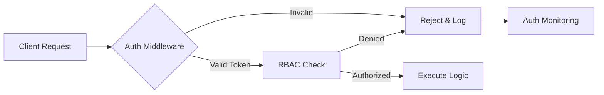

# Security

At @phuetz/code-buddy, we operate on the fundamental belief that trust is the primary currency of developer tooling. Because our system interacts directly with proprietary source code and sensitive environment configurations, we treat security not as a feature, but as the foundational layer of our [architecture](./architecture.md).

### Security Model [Overview](./overview.md)

To ensure the integrity of the 14,351 functions within our codebase, we employ a "Defense in Depth" strategy. When a user initiates a request, the system must verify identity, validate intent, and audit the action before any code execution occurs. We prioritize this layered approach because perimeter security alone is insufficient against sophisticated supply chain attacks or internal credential compromise.

We implement this model through centralized middleware located in `src/security/index.ts`. This module acts as the gatekeeper for all incoming Express routes, ensuring that every request is authenticated and authorized before it reaches the business logic layer.

> **Developer Tip:** Always define security policies as code. If a security rule isn't in `src/security/index.ts`, it effectively does not exist.

### Authentication and Authorization

Stateless authentication is essential for our distributed architecture, allowing us to scale horizontally without maintaining complex session state across our 1,083 modules. When a request hits the Express server, the system validates a JSON Web Token (JWT) to establish identity, then queries our Role-Based Access Control (RBAC) service to determine if the user has the necessary permissions for the requested operation.

The following diagram illustrates the request lifecycle:

We track all authentication events via `src/automation/auth-monitoring.ts`. This module captures login attempts, token refreshes, and authorization failures, providing the telemetry needed to detect brute-force attacks or credential stuffing in real-time.

> **Developer Tip:** Never log raw JWTs or sensitive headers. Use `src/automation/auth-monitoring.ts` to log only metadata and event types.

### Protected Assets

Protecting intellectual property is our highest priority, as a breach could expose the entire codebase to unauthorized parties. We classify assets into tiers—Public, Internal, and Restricted—and apply strict Access Control Lists (ACLs) to each. When the system processes a repository, it treats the source code as a Restricted asset, ensuring it is encrypted at rest and accessed only by authorized service accounts.

By enforcing these boundaries, we prevent lateral movement within the system. If a single service is compromised, the attacker remains trapped within the scope of that service's limited permissions, unable to access the broader codebase or sensitive environment variables.

> **Developer Tip:** Use environment variables for all secrets. Never hardcode API keys or connection strings in your TypeScript files.

### [Threat Model Summary](./security-config.md#threat-model-summary)

Proactive threat detection is significantly more cost-effective than reactive incident response. When an attacker attempts to inject malicious code into a Pull Request, the system must detect the anomaly before it reaches the main branch. We model our threats based on the OWASP Top 10, with a specific focus on Injection, Broken Access Control, and Security Misconfiguration.

Our monitoring infrastructure continuously scans for these patterns. If the system detects an unauthorized attempt to modify core modules, it triggers an automated alert to the security team and temporarily suspends the associated user account.

> **Developer Tip:** Run `npm audit` before every commit. If you introduce a new dependency, verify its security posture first.

### [Security Checklist for Contributors](./security-config.md#security-checklist-for-contributors)

Human error remains the leading cause of security vulnerabilities in modern software development. Before a contributor submits a Pull Request, they must verify that their changes do not introduce new attack vectors. We enforce this through a mandatory checklist that must be completed before code review.

1.  **Secrets Check:** Ensure no hardcoded credentials, API keys, or tokens exist in the code.
2.  **Dependency Audit:** Verify that any new packages are vetted and have no known vulnerabilities.
3.  **Middleware Integration:** If adding a new route, ensure it is wrapped in the security middleware defined in `src/security/index.ts`.
4.  **Logging:** Confirm that any new logs do not capture PII (Personally Identifiable Information).
5.  **Principle of Least Privilege:** Verify that the code requests only the minimum permissions required to function.

> **Developer Tip:** Use pre-commit hooks to automate this checklist. If you find yourself manually checking these items, write a script to do it for you.

---

**See also:** [Configuration](./configuration.md)
