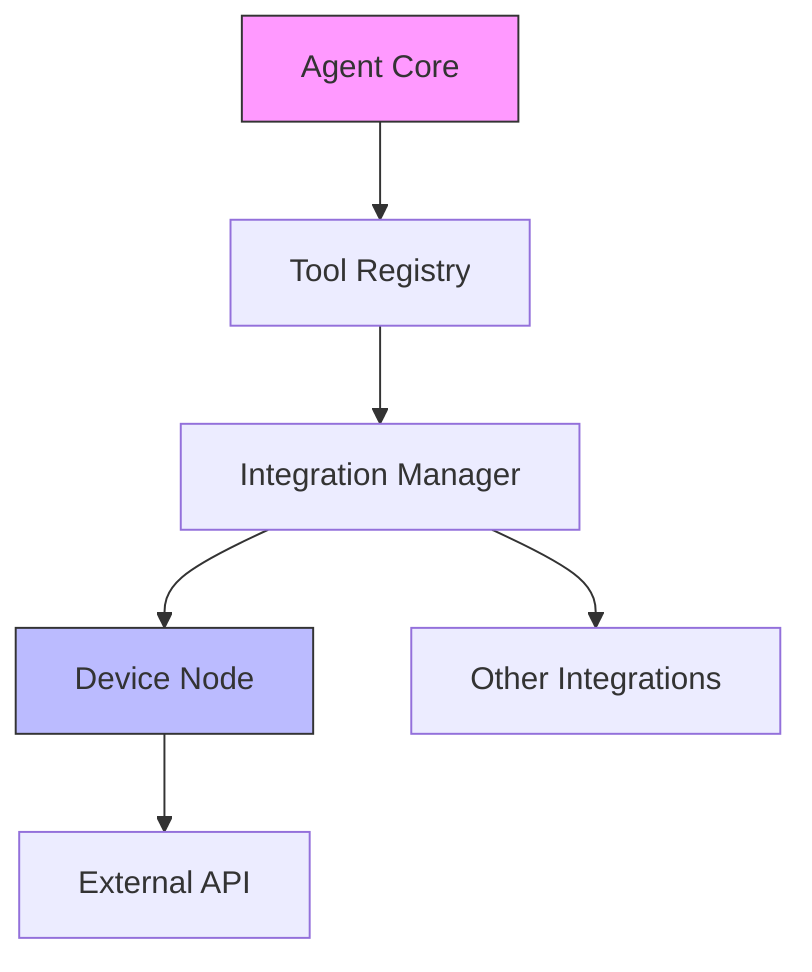

# Tools & Integrations

To bridge the gap between static code analysis and actionable outcomes, the Code-Buddy agent requires a robust interface layer. Without this subsystem, the agent would be limited to text generation; by implementing tools and integrations, we allow the agent to manipulate the environment, query external APIs, and interact with hardware, transforming it from a passive assistant into an active participant in the development lifecycle.

> **Developer Tip:** Always define your tool schemas using Zod to ensure the agent receives strict type validation before execution.

## Subsystem [Overview](./overview.md)

When a user prompts the agent to perform an action, the system must translate natural language into a structured execution plan. This happens because the agent needs to interact with external APIs or local hardware without hardcoding every possible interaction into the core logic. The subsystem acts as a middleware layer, intercepting the agent's intent, resolving it to a specific tool, and dispatching the request to the appropriate integration.

> **Developer Tip:** Keep your integration logic decoupled from the agent core; if an API changes, you should only need to update the specific integration module, not the agent's decision-making logic.

## [Module Breakdown](./[channels](./channels.md).md#module-breakdown)

The following modules form the backbone of the interaction layer. They are structured to separate the *definition* of a tool from the *execution* of the integration.

| Module | Description |
| :--- | :--- |
| `src/tools/index.ts` | The central registry that exposes available tools to the agent's LLM context. |
| `src/integrations/index.ts` | The orchestrator that manages authentication and connection state for external services. |
| `src/nodes/device-node.ts` | A specialized node handling direct communication with local hardware or device-specific protocols. |

> **Developer Tip:** Use the `src/tools/index.ts` file to export a unified interface; this prevents circular dependencies when the agent initializes its toolset.

## [Data Flow](./subsystems.md#data-flow)

Data traverses the subsystem by first hitting the Tool Registry, which validates the agent's request against the available tool definitions. Once validated, the request is passed to the Integration Manager, which handles the necessary authentication and payload formatting. Finally, the specific node (such as the `DeviceNode`) executes the command and returns the result back up the chain, ensuring the agent receives a structured response it can interpret.

> **Developer Tip:** Implement comprehensive [error handling](./interfaces.md#error-handling) at the `IntegrationManager` level to catch network timeouts or authentication failures before they bubble up to the agent.

## [Entry Points](./channels.md#entry-points)

Developers looking to extend functionality should start by registering new capabilities within the `src/tools/index.ts` file. This is the primary entry point where you define the tool's name, description, and input schema. Once registered, you can implement the underlying logic in a new integration module or extend the existing `src/nodes/device-node.ts` if the functionality pertains to hardware interaction.

> **Developer Tip:** Before deploying a new tool, write a unit test that mocks the `IntegrationManager` to verify that the agent correctly selects your tool based on a natural language prompt.

---

**See also:** [Plugin System](./plugin-system.md) · [Channels](./channels.md)
