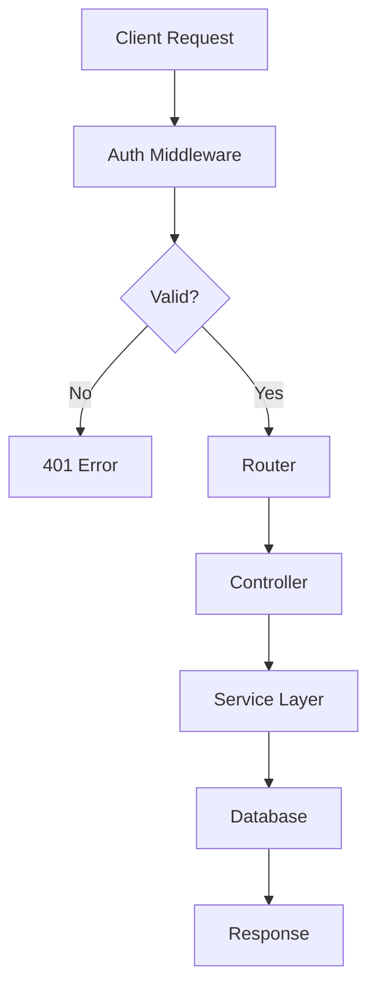

# Troubleshooting

Navigating a codebase of 14,000+ functions requires a systematic approach to problem-solving. When you encounter unexpected behavior in `@phuetz/code-buddy`, it is rarely a random event; it is usually a symptom of a [configuration](./configuration.md) mismatch or a dependency conflict within the Express middleware chain.

## Common Issues

Understanding the "why" behind an error is the first step toward a permanent fix. Below are the ten most frequent issues identified in our [architecture](./architecture.md).

### 1. Authentication Timeout
**Symptom:** API requests return a `401 Unauthorized` despite valid credentials.
**Cause:** The `auth-monitoring.ts` module is designed to aggressively prune stale sessions. If the system clock drifts or the session TTL is misconfigured, the validator rejects tokens prematurely.
**Solution:** Verify your `SESSION_TTL` in your `.env` file and ensure your server time is synchronized via NTP.

### 2. Circular Dependency Errors
**Symptom:** The application fails to compile with `ReferenceError: Cannot access 'X' before initialization`.
**Cause:** Because the project contains over 1,000 modules, implicit circular dependencies often emerge when utility functions in `src/utils/index.ts` import from high-level controllers.
**Solution:** Refactor shared logic into a dedicated `types` or `constants` file that does not import from the main application logic.

### 3. Middleware Execution Order
**Symptom:** Request body is `undefined` in your controller.
**Cause:** Express processes middleware in the order they are defined. If your body-parser is registered *after* your route handler, the request object will not be populated.
**Solution:** Move `app.use(express.json())` to the top of your `app.ts` file, immediately after the app initialization.

### 4. Environment Variable Injection
**Symptom:** The application throws `TypeError: Cannot read property 'db_url' of undefined`.
**Cause:** The configuration loader fails to read the environment because the `dotenv` package was not initialized before the configuration module was imported.
**Solution:** Ensure `require('dotenv').config()` is the very first line in your entry point file (`index.ts` or `server.ts`).

### 5. Unhandled Promise Rejections
**Symptom:** The server process exits silently without an error message.
**Cause:** Asynchronous operations in TypeScript often swallow errors if they are not wrapped in a `try/catch` block or chained with a `.catch()` handler, leading to unhandled promise rejections that crash the Node.js process.
**Solution:** Add a global process listener: `process.on('unhandledRejection', (reason) => console.error(reason))`.

### 6. Port Conflict
**Symptom:** `EADDRINUSE: address already in use :::3000`.
**Cause:** A zombie process from a previous development session is likely still holding the port, preventing the new instance of `code-buddy` from binding to it.
**Solution:** Run `lsof -i :3000` to identify the PID, then execute `kill -9 <PID>` to release the port.

### 7. Memory Heap Overflow
**Symptom:** The application crashes with `FATAL ERROR: Ineffective mark-compacts near heap limit`.
**Cause:** Large-scale data processing in the automation layer can exceed the default Node.js heap limit (usually 512MB or 1GB).
**Solution:** Increase the memory limit by starting the app with `node --max-old-space-size=4096 dist/index.js`.

### 8. TypeScript Compilation Mismatch
**Symptom:** `Property 'x' does not exist on type 'y'`.
**Cause:** You are likely using a cached version of the `tsconfig.tsbuildinfo` file that does not reflect recent changes in the `src/utils` directory.
**Solution:** Delete the `dist/` folder and the `.tsbuildinfo` file, then run `npm run build` to force a clean compilation.

### 9. Database Connection Timeout
**Symptom:** Queries hang indefinitely and eventually throw a timeout error.
**Cause:** The connection pool is exhausted because previous database connections were not properly closed in the `finally` block of your service functions.
**Solution:** Implement a connection pool manager that explicitly closes connections after every transaction.

### 10. Silent Logging Failures
**Symptom:** No logs appear in the console or log files.
**Cause:** The logging utility is likely initialized with a log level higher than the current environment setting (e.g., set to `ERROR` while you are trying to debug `INFO` logs).
**Solution:** Update your `LOG_LEVEL` environment variable to `debug` during development.

> **Developer Tip:** Use `npm list <package-name>` to verify that you aren't accidentally using multiple versions of the same dependency, which is a common source of "ghost" bugs in large projects.

---

## Debugging Mode

When standard logs are insufficient, you must inspect the request lifecycle. We use the `DEBUG` environment variable to toggle verbose output across the 1,000+ modules.

### Enabling Debug Mode
To see the internal flow of the application, restart your server with the debug flag enabled:

```bash
DEBUG=code-buddy:* npm run dev
```

### Request Lifecycle Diagram
The following diagram illustrates how a request flows through the system. If you are debugging, check which node in this chain fails to return a response.



> **Developer Tip:** Use the Chrome DevTools inspector by running `node --inspect dist/index.js` to set breakpoints directly in your TypeScript source code.

---

## Reporting Issues

If you have exhausted the steps above and the system is still failing, we encourage you to submit a bug report. Because this codebase is extensive, providing a minimal reproduction is mandatory for a quick resolution.

### How to Submit
1.  **Search:** Check existing GitHub issues to see if your problem has already been reported.
2.  **Isolate:** Create a minimal repository or a single file that reproduces the error.
3.  **Template:** Use the "Bug Report" template in the repository.
4.  **Context:** Include your `package.json` dependencies and the output of `node -v`.

> **Developer Tip:** Always attach the output of `npm run diagnose`, which generates a sanitized report of your environment configuration and dependency tree.