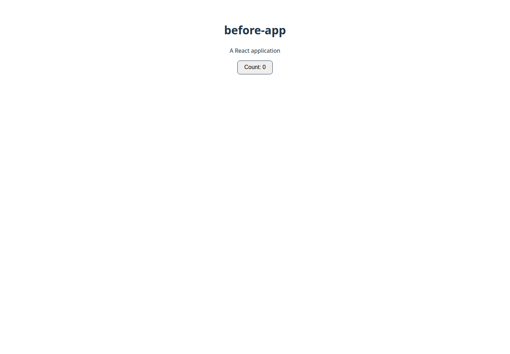
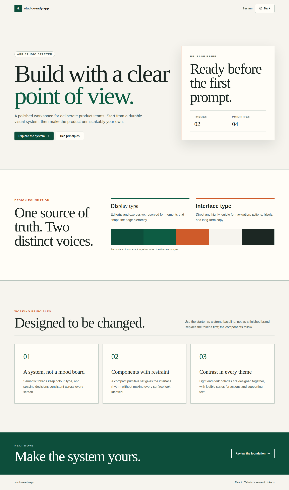
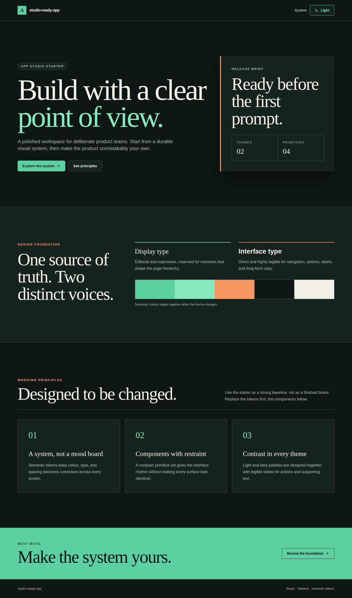
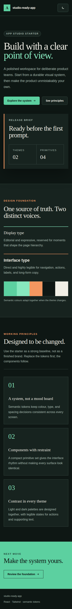

# App Studio — gabarit web et direction visuelle

Date : 2 septembre 2026

Branche : `appstudio-design`

Production `/home/patrice/code-buddy` : non modifiée

Push : aucun

## Synthèse d'une page

App Studio propose maintenant deux choix React distincts : `react-tailwind`, sélectionné par défaut pour les demandes web, et `react-ts`, conservé comme gabarit nu. Le nouveau choix ne dépend pas d'une génération IA pour être présentable : il produit directement une page responsive, des thèmes clair et sombre, un jeu de jetons sémantiques centralisé et quatre primitives réutilisables (`Button`, `Card`, `Badge`, `ThemeToggle`). `express-api` et `node-cli` n'ont pas été modifiés.

La promesse principale est démontrée sur un projet réellement généré. Le moteur a créé 17 fichiers sans avertissement ; `npm install` a installé 136 paquets et trouvé 0 vulnérabilité ; `npm run build` a compilé 32 modules avec Vite 6.4.3 en 574 ms. Le rendu Playwright ne produit aucune erreur console, la bascule sombre change effectivement les couleurs calculées, et la page mobile mesure 390 px de contenu pour un viewport de 390 px. Les six contrastes sémantiques critiques testés dépassent WCAG AA ; le plus faible vaut 6,08:1.

Le prompt réel de « Générer avec IA » reçoit désormais un contrat court mais vérifiable : palette issue du sujet, deux familles avec des rôles séparés, hiérarchie typographique explicite, ratios WCAG AA, deux thèmes complets et interdiction nominative du dégradé violet sur blanc, du centrage généralisé, des rayons partout, d'Inter par défaut et des emoji comme puces/icônes. Un test appelle `buildAiGenerationPrompt` et recherche chaque règle dans sa sortie — il ne vérifie donc pas un fichier documentaire orphelin.

21st.dev est ajouté uniquement comme référence en ligne optionnelle pour les générations React/Vite. Le prompt dit à l'agent de consulter le catalogue public avec `web_search`, puis d'adapter une idée aux jetons locaux. Aucun package, compte, secret, CLI ou MCP 21st n'est requis ; en cas d'absence réseau, l'agent doit continuer immédiatement avec les primitives locales. Cette intégration est volontairement plus modeste que le MCP officiel : elle préserve le fonctionnement hors ligne mais n'offre ni cartes de prévisualisation ni installation automatique.

Les gates du chantier sont verts : 10 tests cœur/outillage, 11 tests Cowork ciblés, les deux typechecks, les deux lints ciblés et le build Vite complet de Cowork. La suite Cowork globale n'est pas entièrement verte : après installation locale des dépendances sans scripts ni modification du lock, elle termine à 2 997 réussites, 5 échecs, 12 ignorés. Les cinq rouges sont dans quatre fichiers non modifiés par ce chantier (deux gardes de continuité relationnelle, une attente de source de configuration et deux tests du Live Launcher). Ils sont consignés, pas maquillés en succès.

## Avant / après — preuve visuelle

Les deux vues sont des pages réellement servies par Vite et capturées à 1 440 px avec Playwright/Chromium.

| Avant — `react-ts` conservé | Après — `react-tailwind` clair |
|---|---|
|  |  |

| Après — sombre | Après — mobile sombre, 390 px |
|---|---|
|  |  |

### Ce qui sort du moteur

| | `react-ts` avant, intact | `react-tailwind` après |
|---|---:|---:|
| Fichiers créés | 9 | 17 |
| CSS de production | 0,36 kB | 15,23 kB |
| Composants UI fournis | 0 | 4 |
| Jetons couleur/type/espace | non | `src/styles/tokens.css` |
| Thème sombre | non | oui, préférence système + bascule persistée |
| Paquets installés | 293 | 136 |
| Audit npm au 02/09/2026 | 4 avis : 2 modérés, 1 haut, 1 critique | 0 |
| Build | Vite 5.4.21, 31 modules, 458 ms | Vite 6.4.3, 32 modules, 574 ms |

Le gabarit nouveau crée exactement :

```text
package.json
vite.config.ts
tailwind.config.ts
postcss.config.cjs
tsconfig.json
tsconfig.node.json
index.html
src/main.tsx
src/styles/tokens.css
src/index.css
src/components/ui/Button.tsx
src/components/ui/Card.tsx
src/components/ui/Badge.tsx
src/components/ThemeToggle.tsx
src/App.tsx
.gitignore
README.md
```

## Exécution du projet neuf

Répertoire de preuve final : `/tmp/appstudio-proof-secure-q75xXX/studio-ready-app`.

Génération :

```text
success: true
filesCreated: 17
warnings: []
```

Installation :

```text
added 136 packages, and audited 137 packages in 3s
found 0 vulnerabilities
```

Build :

```text
> tsc && vite build
vite v6.4.3 building for production...
✓ 32 modules transformed.
dist/index.html                   1.22 kB │ gzip:  0.71 kB
dist/assets/index-CoIvNU6v.css   15.23 kB │ gzip:  3.85 kB
dist/assets/index-B60dUht0.js   153.08 kB │ gzip: 48.93 kB
✓ built in 574ms
```

Contrôle navigateur :

```json
{
  "dark": {
    "theme": "dark",
    "background": "rgb(14, 23, 20)",
    "color": "rgb(241, 239, 230)",
    "cardBackground": "rgb(23, 35, 31)"
  },
  "mobile": { "scrollWidth": 390, "clientWidth": 390 },
  "consoleErrors": []
}
```

Contrastes calculés depuis les jetons réellement générés :

| Paire | Clair | Sombre |
|---|---:|---:|
| texte principal / canvas | 14,00:1 | 15,83:1 |
| texte secondaire / canvas | 6,08:1 | 8,84:1 |
| texte d'action / fond d'action | 9,68:1 | 9,54:1 |

## Cohérence des déclarations

Le test `cowork/tests/app-studio-template-parity.test.ts` compare les ensembles réels issus de :

- `TemplateEngine.getTemplates()` dans le cœur ;
- `STUDIO_TEMPLATES` dans le processus principal Cowork ;
- `DEFAULT_TEMPLATES` dans le fallback renderer.

L'ensemble attendu est verrouillé à `express-api`, `node-cli`, `react-tailwind`, `react-ts`. Le test échoue si une seule déclaration manque. Le type `StudioTemplateId`, les variables du composer, la suggestion automatique et l'outil agent `scaffold_app` acceptent également `react-tailwind`. Un test séparé exécute ce dernier et vérifie ses fichiers.

## Guide injecté dans le vrai prompt

Le contrat est exporté par `studio-ai-generation.ts`, puis ajouté à la chaîne retournée par `buildAiGenerationPrompt`. Extrait de la sortie testée :

```text
CONTRAT DE DESIGN — exécute chaque règle :
- Direction et palette : définis une palette tirée du sujet [...]
- Typographie : choisis deux familles de polices distinctes [...] Inter par défaut est interdit.
- Hiérarchie typographique : rends display, h1, h2, corps et légende visiblement distincts [...]
- Contraste vérifié : respecte WCAG AA (4.5:1 [...], 3:1 [...]) [...]
- Livre les thèmes clair ET sombre [...]
- Interdits nommés : aucun dégradé violet sur fond blanc, ne pas tout centrer,
  pas de coins arrondis sur tous les éléments, aucun emoji comme puce ou icône.
```

Le test `studio-ai-generation-design-guide.test.ts` appelle le builder avec une demande réelle (« carnet de voyage en Islande ») et prouve la présence de chacune de ces contraintes, ainsi que du repli hors ligne 21st.dev.

## 21st.dev : ce qui est réellement livré

Pour la stack React/Vite seulement, le prompt fournit l'URL publique `https://21st.dev/community/components`, charge `web_search` via `tool_search` si nécessaire, demande d'adapter le composant aux jetons locaux et interdit de bloquer la génération. Le catalogue et son MCP officiel sont documentés par 21st.dev :

- https://docs.21st.dev/mcp
- https://21st.dev/community/components

Choix volontaire : aucun serveur MCP distant n'est auto-enregistré et aucune commande d'installation n'est lancée. La documentation officielle indique que les installations ont des quotas et peuvent demander compte/clé ; les rendre obligatoires aurait cassé la promesse hors ligne. La base locale reste donc la voie garantie, le catalogue une inspiration consultable lorsque le réseau existe.

## Vérifications

| Commande | Résultat |
|---|---|
| `npx vitest run tests/templates/ tests/tools/scaffold-app-tool.test.ts` | 2 fichiers, 10/10 verts |
| Cowork : 5 fichiers ciblés template/prompt | 5 fichiers, 11/11 verts |
| `npx tsc --noEmit -p tsconfig.json` | vert |
| Cowork : `npm run typecheck` | vert |
| ESLint cœur ciblé | vert |
| ESLint Cowork ciblé | vert |
| Cowork : `npx vite build` | vert ; renderer 5 396 modules, main 4 305, preload 6 |
| Projet neuf : `npm install` | vert ; 136 paquets, audit 0 |
| Projet neuf : `npm run build` | vert ; Vite 6.4.3, 32 modules |
| Playwright desktop clair/sombre + mobile | vert ; 0 erreur console, 0 overflow horizontal |
| Cowork : `npm test` | **rouge hors lot** ; 533 fichiers verts, 4 rouges, 9 ignorés ; 2 997 tests verts, 5 rouges, 12 ignorés |

Les cinq échecs globaux restants :

1. `codebuddy-engine-runner-continuity.test.ts` : garde « sans remplacer les personnes » absente ;
2. `codebuddy-engine-runner-semantic-gate.test.ts` : révision relationnelle non resanitisée ;
3. `index-config-window-behavior.test.ts` : le test cherche la config redacted dans `window-management.ts` ;
4. et 5. `live-launcher-panel.test.tsx` : deux scénarios reçoivent un listener non fonction.

Aucun de ces quatre fichiers de test ni leurs modules de production n'est modifié par les commits App Studio.

## Ce qui reste faible

- Le gabarit nu `react-ts` reste volontairement nu et conserve sa pile historique ; son audit actuel n'est pas vert. Le modifier aurait violé l'exigence de conservation.
- Les deux familles sont des piles système hors ligne. Leur personnalité varie légèrement selon l'OS ; des fontes vendored exigeraient une sélection de licence et ajouteraient du poids.
- Le test de contraste couvre les six couples sémantiques structurants, pas toutes les compositions arbitraires qu'un modèle pourrait ajouter ensuite. Un audit axe/Lighthouse de l'app générée reste utile.
- La source 21st.dev est une consultation publique optionnelle, pas l'expérience MCP avec aperçus et installation. Cette limite est assumée pour ne demander ni réseau, ni compte, ni secret.
- Les trois déclarations de gabarits existent encore physiquement à trois endroits. Le test empêche leur divergence mais une future extraction partagée réduirait la duplication.
- La capture prouve le livrable généré, pas encore le parcours Electron complet « choisir → créer → démarrer la preview » dans une seule E2E.
- La suite Cowork globale comporte cinq rouges hors lot décrits ci-dessus ; le chantier ne peut donc pas annoncer un `npm test` global vert.

## Ensuite

1. Ajouter une E2E Cowork qui sélectionne `React + Tailwind Studio`, passe par l'IPC de scaffold, lance Vite et compare une capture claire/sombre.
2. Ajouter axe-core et une régression visuelle sur les viewports 390, 768 et 1 440 px.
3. Proposer 21st MCP comme réglage opt-in avec test de santé court, cache de résultats et repli local ; jamais au démarrage obligatoire.
4. Extraire le catalogue des templates dans un module partagé main/renderer, tout en gardant le test de parité avec le moteur cœur.
5. Traiter séparément la modernisation de `react-ts`, avec migration explicite plutôt qu'une modification silencieuse du gabarit nu.

## Commits

- `ce5957b2a` — `feat(app-studio): add presentation-ready React template`
- `3e7f53ab5` — `feat(app-studio): enforce design direction in generation`
- `5d317423e` — `test(app-studio): cover styled agent scaffolding`
- `415b6c478` — `fix(app-studio): use a clean template dependency floor`
- `6df11b338` — `docs(app-studio): record build and visual proof`
