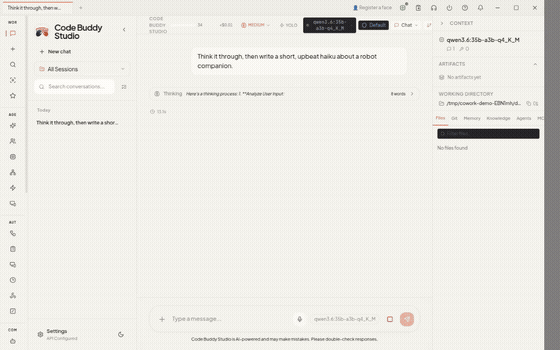
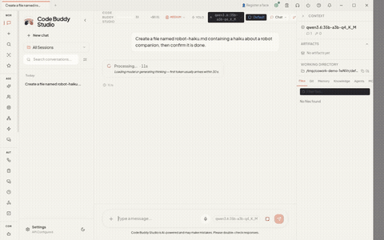
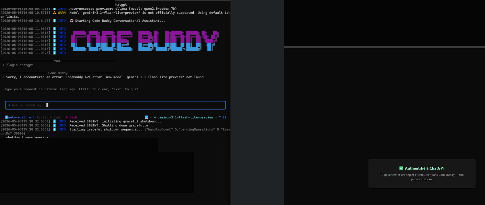
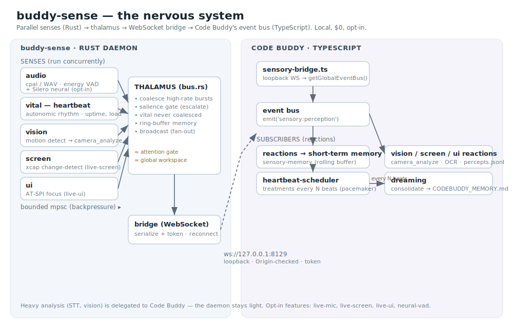
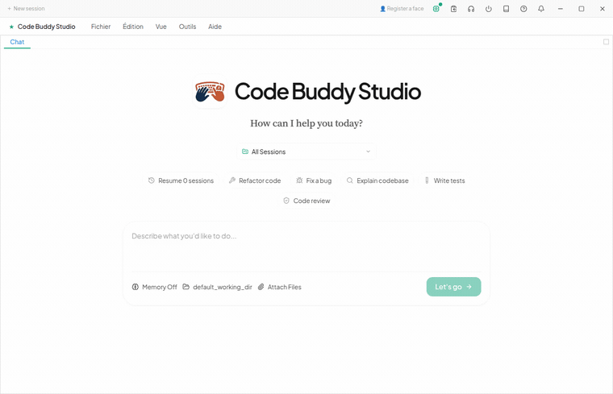

<div align="center">


# Code Buddy

### The open-source AI coding agent that runs **free, on your own machine**

<p align="center">
  <a href="https://www.npmjs.com/package/@phuetz/code-buddy"></a>
  <a href="https://opensource.org/licenses/MIT"></a>
  <a href="https://nodejs.org"></a>
  <a href="https://www.typescriptlang.org/"></a>
  <a href="https://deepwiki.com/phuetz/code-buddy/"></a>
</p>

<p align="center">
  <a href="https://github.com/phuetz/code-buddy/stargazers"></a>
  
  
</p>

<br/>

Watch a **local model reason on screen, then use real tools to do the work** — no cloud, no API bill, `~$0`. Or bring any of **15 providers** (Claude, GPT, Grok, Gemini, …) with automatic failover. From your terminal, a desktop app, your phone, or a 24/7 service. No lock-in.

<p align="center">
  <a href="docs/qa/code-buddy-studio/cowork-demo-moneyshot.mp4"></a>
  <br/>
  <sub>A <b>local</b> model reasons, then uses a tool to create a real file — <code>~$0.0001</code>, no cloud. <a href="cowork/readme.md#demo">More demos →</a></sub>
</p>

- 🆓 **Free & local-first** — runs entirely on local **Ollama (`$0`)**, any of **15 providers** with auto-failover, or a flat-fee **ChatGPT Plus/Pro** login (no API metering).
- 🧠 **Reasoning you can watch** — local models think step-by-step on screen, then call tools to act. See the [live captures](cowork/readme.md#demo).
- 🛠️ **~110 tools** — edit, shell, web search, browser, PDFs/Office, a skills marketplace, and MCP connectors to extend it.
- 🖥️ **Runs everywhere** — terminal TUI, the **Cowork** desktop app, an HTTP/WebSocket server, your phone, or a 24/7 background service — one core engine.
- 🤝 **Multi-AI Fleet** — peers observe each other live and call each other's models & read-only tools (`peer.chat` / `peer.tool.invoke`) across your network.
- 👁️ **Personal companion** *(optional)* — bidirectional voice, opt-in camera/presence, persistent memory, and 20+ messaging channels.

> **Don't take our word for it — [see it work, reproduce it yourself ✅](docs/proof.md).** Every headline claim above, with the exact command and the real `$0` output (local model writes code + a passing test, goal mode, the desktop app, the autonomous fleet loop).

<br/>

[Live site ↗](https://phuetz.github.io/code-buddy/) ·
[Proof ✅](docs/proof.md) ·
[Quick Start](#quick-start) ·
[In action](#in-action) ·
[What it does](#what-code-buddy-does) ·
[FAQ](docs/faq.md) ·
[Docs](#documentation) ·
[Contributing](#contributing)

</div>

---

## What is Code Buddy?

An open-source, multi-provider AI coding agent with a terminal UI, an HTTP/WebSocket server, and the **Cowork** desktop app — all on one core engine. It reads files, writes code, runs commands, opens PRs, and plans complex tasks across **15 LLM providers** with automatic failover and per-provider circuit breakers. With `buddy login`, a ChatGPT Plus / Pro subscription becomes the flat-fee brain of the whole system — no API keys, no per-token metering. An optional companion layer adds voice, durable memory, opt-in camera perception, and 24/7 background operation.

---

## In action

**It writes the code *and* the test, then runs it — `$0`.** Hand Code Buddy a task in the terminal; here Grok (a flat-fee subscription, no API key) writes FizzBuzz + a test and runs it green — then a human re-runs the test to confirm. Unedited:

<p align="center">
  
</p>

**Free local AI, with the reasoning on screen.** A local Ollama model (`qwen3.6:35b-a3b`) thinks through a task, then *uses tools* to do it — no cloud, ~`$0.0001`. Unedited captures from the Cowork desktop app:

<table>
  <tr>
    <td width="50%" align="center">
      <a href="docs/qa/code-buddy-studio/cowork-demo-chat.mp4"></a><br/>
      <sub><b>Reasoning chat</b> — thinks step-by-step, then answers · local · <code>~$0.0001</code></sub>
    </td>
    <td width="50%" align="center">
      <a href="docs/qa/code-buddy-studio/cowork-demo-task.mp4"></a><br/>
      <sub><b>Real task</b> — reasons, <b>uses the file tool</b>, confirms the artifact · local · <code>~$0.0001</code></sub>
    </td>
  </tr>
</table>

**ChatGPT Pro / Plus login** — `buddy login`, sign in once, then chat with `gpt-5.5` from the terminal. No API key; cost reported as `$0.0000` (flat-fee plan).

<p align="center">
  
</p>

**xAI / SuperGrok login** — `buddy login xai`, sign in once, then Grok answers for `$0` (flat-fee subscription, no API key):

<p align="center">
  
</p>

**Self-audit.** Asked to find a bug in its own integration code, `gpt-5.5` reads `provider-chatgpt-responses.ts`, spots a stale-variable issue (mutated `body.model` not propagated), and proposes the exact fix:

<p align="center">
  
</p>

**On your phone — chat with the same agent over Telegram.** Code Buddy runs as a messaging-channel bot, so the agent you use in the terminal is reachable from your pocket. Real, unedited captures (the bot is named *"Lisa"* here). The system prompt and tools **scale to each question** — light and instant for plain chat, escalating to load tools only when the request needs them (the same on-demand pattern as Codex / Claude):

<table>
  <tr>
    <td width="33%" align="center" valign="top">
      <br/>
      <sub><b>Chat + live tools, on demand</b><br/>"Bonjour" answers instantly; <i>"what time is it?"</i> and <i>"tomorrow's weather in Paris?"</i> pull the time and <b><code>web_search</code></b> tools — only when actually asked.</sub>
    </td>
    <td width="33%" align="center" valign="top">
      <br/>
      <sub><b>Reads its own code</b><br/>Confirms it can inspect its own source (or any accessible file) via <code>view_file</code> — then introduces its recursive self-improvement →</sub>
    </td>
    <td width="33%" align="center" valign="top">
      <br/>
      <sub><b>Improves itself across sessions</b><br/>The <code>lessons_*</code> loop (Manus-inspired): after each fix or success it extracts <b>RULE / PATTERN / CONTEXT</b> lessons, persisted to <code>.codebuddy/lessons.md</code> (project + global). <i>Accurate — matches its real source.</i></sub>
    </td>
  </tr>
</table>

🎙️ **And you can _talk_ to it.** Send a voice note and it replies by voice — speech-to-text (faster-whisper) and text-to-speech (Piper) both run **locally, `$0`**, mirroring your modality (voice in → voice out). Needs the local voice engines installed; it transparently degrades to a text reply otherwise.

More desktop demos (Fleet, Autonomy, Companion, …) and captures: [`cowork/readme.md`](cowork/readme.md#demo) · [`docs/screenshots/`](docs/screenshots/README.md).

---

## What's shipped

**1.4.0 GA — these aren't roadmap items.** The captures above are unedited, and the core runs today:

- ✅ **`$0` local coding agent** — a local Ollama model reasons on screen, then calls tools to do real work. *(the demos above)*
- ✅ **ChatGPT Plus/Pro → `gpt-5.5` at `$0`** — `buddy login`, flat-fee, no API key, no per-token metering.
- ✅ **Goal loops (Ralph loop)** — a judge model re-checks completion every turn and auto-continues until done; proven multi-turn on a free local model, with a real in-loop length-truncation recovery ([test](tests/agent/in-loop-recovery.real.test.ts), no mocks).
- ✅ **Multi-AI Fleet** — peers observe each other live and call each other's models & read-only tools (`peer.chat` / `peer.tool.invoke`).
- ✅ **15 providers** with automatic failover and per-provider circuit breakers; **~110 tools**, MCP connectors, and a skills marketplace.
- ✅ **~27K Vitest tests** — run locally and on a real-environment runner (the suite is no-mocks / real-integration, so it needs live Ollama/Hermes/browser rather than a vanilla CI box).

**Honest about scope:** [Hermes / OpenClaw parity](docs/hermes-openclaw-parity.md) lays out exactly what's shipped, what's externally-gated, and where the edges are — including which messaging channels are full integrations vs. in-process stubs.

---

## Research — a sensory "nervous system" *(experimental)*

Toward the long-term companion/robot vision, [`buddy-sense/`](buddy-sense/) is a **Rust, event-driven perception layer**. Parallel **sense modules** (audio VAD — energy or Silero neural; an autonomic **heartbeat**; screen via `xcap`; UI focus via AT-SPI) feed a **thalamus** that gates + coalesces the stream and broadcasts it over a loopback WebSocket into Code Buddy's event bus — where the heartbeat **paces background memory consolidation** ("dreaming", inspired by OpenClaw). Local, `$0`, permissive deps only (clean-room — no proprietary code copied).

<p align="center"></p>

**Honestly experimental** — distinct from the GA core above: the default daemon emits the heartbeat (+ audio from a WAV file); the live camera/mic aren't wired into the daemon yet. `speech → STT → 'hearing' percept` **is** wired (faster-whisper), with a hook left for driving a full agent turn. What's real today: the pure detector cores + thalamus + bridge are unit-tested (`cargo test`, 20 tests, no hardware), and the loopback bridge → event bus → reaction path (incl. the speech transcription) is covered on the Code Buddy side.

```bash
cd buddy-sense && cargo test     # 20 tests, no hardware
./buddy-sense/demo.sh            # headless end-to-end: heartbeat + audio VAD → Code Buddy
```

Design, the five sense modules, the opt-in features, and the diagrams: [`buddy-sense/README.md`](buddy-sense/README.md).

---

## Quick Start

```bash
# Install from npm
npm install -g @phuetz/code-buddy

# …or from source (newest features)
git clone https://github.com/phuetz/code-buddy.git
cd code-buddy && npm install && npm run build && npm link   # exposes `buddy` globally
```

> **Requirements:** Node.js **≥ 18** for the CLI. The **Cowork desktop app needs Node ≥ 22** plus a C++ build toolchain for native modules (`better-sqlite3`). Run **`buddy doctor`** anytime to check your environment (`--fix` to auto-remediate).

Then pick a brain:

```bash
# Option A — free & local: point at a local Ollama, $0
export CODEBUDDY_PROVIDER=ollama
buddy

# Option B — log in with your ChatGPT Plus / Pro subscription (no API key)
buddy login        # opens browser for OAuth → tokens persisted
buddy whoami       # ✅ connected · you@example.com · Plan: pro
buddy              # auto-routes to gpt-5.5 via the Codex backend, cost $0.0000

# Option C — bring your own API key
export GROK_API_KEY=...   # or GEMINI_API_KEY / OPENAI_API_KEY / ANTHROPIC_API_KEY
buddy

# Option D — log in with your xAI / SuperGrok subscription (no API key)
buddy login xai    # browser OAuth → routes to Grok (grok-4-latest), cost $0
```

```bash
buddy --prompt "analyze the codebase structure"   # one-shot task
buddy --yolo                                       # full autonomy
```

**Use several logins at once, or fail over automatically across them:**

```bash
buddy llm                                    # list the LLMs you're logged into + the failover order
buddy llm ensemble "is this approach sound?" # ask ChatGPT + Grok + Ollama together, then synthesize
CODEBUDDY_LLM_FAILOVER=1 buddy -p "…"         # if the primary errors, auto-continue on the next active LLM
```

<p align="center">
  
  <br/>
  <sub>Your logins at a glance — and automatic failover from one to the next when one has a problem, at <code>$0</code>. Real run, unedited.</sub>
</p>

<p align="center">
  
  <br/>
  <sub><code>buddy llm ensemble</code> — every brain you're logged into answers, then it's synthesized into one. Real run, unedited.</sub>
</p>

See [Getting Started](docs/getting-started.md) for install options, headless mode, sessions, and typical workflows.

---

## Cowork Desktop

Cowork is the desktop cockpit for Code Buddy: chat, tools, traces, workflows, settings, permissions, models, MCP connectors, skills, artifacts, and companion controls — all against the same core agent as the CLI. The Code Buddy settings panel can probe the local backend, start it, discover models, and route turns through the embedded engine or a configured server.

<p align="center">
  <a href="docs/qa/code-buddy-studio/showcase-2026-06-16/cowork-chat-stream.mp4"></a>
  <br/>
  <sub>Real <code>gpt-5.5</code> in the Cowork desktop app — the answer streams in, cost <code>$0.0000</code>. <a href="docs/qa/code-buddy-studio/showcase-2026-06-16/cowork-chat-stream.mp4">MP4 →</a></sub>
</p>

<p align="center">
  <a href="docs/assets/cowork-chat-demo.mp4"></a>
  <br/>
  <sub>…and fully local: a reasoning model (<code>qwen3.6:35b-a3b</code>) <b>thinks on screen</b>, then answers — no cloud, <code>$0</code>. <a href="docs/assets/cowork-chat-demo.mp4">MP4 →</a></sub>
</p>

<p align="center">
  <a href="docs/assets/cowork-panels-demo.mp4"></a>
  <br/>
  <sub>The left rail opens every panel as a dock tab — here the <b>Autonomy dashboard</b> (24/7 daemon, free-first model ladder, live subagents) and <b>Project Memory</b>. <a href="docs/assets/cowork-panels-demo.mp4">MP4 →</a></sub>
</p>

<table>
  <tr>
    <td width="50%" align="center"><br/><sub>Home — expanded menu, quick-action cards, gradient hero</sub></td>
    <td width="50%" align="center"><br/><sub>A launcher opens its panel as a tab — here the Autonomy dashboard (daemon, model ladder, subagents)</sub></td>
  </tr>
  <tr>
    <td width="50%" align="center"><br/><sub>Fleet dispatch · tool-permission posture · Hermes toolsets</sub></td>
    <td width="50%" align="center"><br/><sub>Light &amp; dark themes</sub></td>
  </tr>
</table>

**📄 It also builds real Office documents — via multi-step skills.** Ask in plain language → the agent triggers an open-source document **skill** that drives `openpyxl` / `python-pptx` / `python-docx` in **visible steps** (check the lib → write the script → run it → verify) → a real, professionally-styled **Excel, PowerPoint, Word, or PDF**. Below, `gpt-5.5` builds an Excel budget in the desktop app — the activity shows each step, cost `$0.0000`:

<p align="center">
  <a href="docs/qa/code-buddy-studio/showcase-2026-06-16/cowork-office-skill.mp4"></a>
  <br/>
  <sub>Prompt → the <code>xlsx</code> skill runs <code>openpyxl</code> in visible steps → a verified <code>budget.xlsx</code> with a live <code>=SUM</code> formula and styling, <code>$0.0000</code>. <a href="docs/qa/code-buddy-studio/showcase-2026-06-16/cowork-office-skill.mp4">▶ Watch the run (MP4) →</a></sub>
</p>

**🐍 The same engine reads, charts, researches, and automates — via clean-room Python skills.** Open-source (MIT) skills extend the document story, each running real Python in the same visible steps (preflight the libs → write the script → run it → verify):

- **`doc-ingest`** — turn existing **PDF / Word / PowerPoint / Excel** files into clean Markdown the agent can reason over: the *read* counterpart to the create skills, using the already-bundled libraries (**zero extra install**).
- **`data-charts`** — analyze tabular data and render **bar / line / scatter / pie / histogram** charts with `pandas` + `matplotlib`.
- **`web-automate`** — drive a real **headless browser** with `playwright` (optional `camoufox` stealth) to navigate, screenshot, scrape rendered content, and fill forms.
- **`web-research`** — autonomous multi-source research: fetch pages, extract their main content, and synthesize a **cited** Markdown brief (lean — bundled `beautifulsoup4`, falls back to `web-automate` for JS pages).

The heavier skills are **opt-in** (`npm run prepare:python:extras`) so the base download stays lean; each preflights its dependencies and tells you exactly how to enable them — no proprietary content.

**🤖 It coordinates a team of agents.** `/swarm <task>` decomposes a goal, delegates to specialist sub-agents (coder → tester → reviewer), then synthesizes — each agent's live activity (`round N`, tool calls) and output visible in the panel. Below, `gpt-5.5` writes **and tests** a Python function end-to-end — cost `$0.0000`:

<p align="center">
  
  <br/>
  <sub>Orchestrator plans → <code>coder</code> / <code>tester</code> / <code>reviewer</code> run in turn (live activity) → tester reports <code>4 tests · OK</code> → synthesized result, all on <code>gpt-5.5</code> for <code>$0.0000</code>.</sub>
</p>

**🎯 It works toward a standing goal.** Goal mode runs an autonomous loop: the agent acts, an LLM judge checks whether the goal is satisfied after each turn, and it keeps going (within a turn budget) until done — self-correcting on the judge's feedback:

<p align="center">
  
  <br/>
  <sub>Act → judge rejects turn 1/20 (<em>"not exactly one line"</em>) → agent self-corrects → <code>✓ Goal achieved</code>. Real <code>gpt-5.5</code> loop, <code>$0.0000</code>.</sub>
</p>

```bash
# Node >= 22 required for the desktop app (the CLI runs on >= 18)
buddy install-gui          # one-time: install Electron + build the desktop bundle
buddy gui                  # launch the desktop app (or: buddy desktop)
buddy server --port 3000   # optional: shared backend for Cowork, Fleet, OpenAI-compatible clients

# Source dev loop
npm install && npm run build && npm run dev:gui
```

The CLI guards this: on Node < 22, `buddy gui` prints a clear upgrade message instead of crashing. Linux source builds need a manual Electron rebuild — see [`cowork/DEV-LINUX.md`](cowork/DEV-LINUX.md). Camera/voice are opt-in and local: snapshots are explicit, percepts are append-only under `.codebuddy/companion/`, and Cowork uses MediaPipe Tasks Vision for face/hand/pose signals. Details: [Cowork Desktop](docs/cowork.md) · [Cowork Architecture](cowork/ARCHITECTURE.md).

---

## What Code Buddy does

Code Buddy is one engine — terminal, desktop, and HTTP — that an LLM drives to read code, edit files, run commands, search the web, open PRs, and plan complex work. Below is the whole surface, explained. Jump to any area:

| Area | In one line | Deep dive |
|:-----|:------------|:----------|
| [Providers & login](#providers--login) | 15 LLM providers + ChatGPT/xAI login at **$0** flat-fee, auto-failover, ensembles | [providers.md](docs/providers.md) |
| [The agentic loop](#the-agentic-loop) | autonomous tool-calling with a middleware pipeline + confirm-before-execute | [CLAUDE.md](CLAUDE.md) |
| [~110 tools](#110-tools) | edit/shell/web/browser/docs/media, RAG-selected, 5-strategy edit matching | [tools-reference.md](docs/tools-reference.md) |
| [Reasoning](#reasoning) | extended thinking + Tree-of-Thought / MCTS, `/think` | [reasoning.md](docs/reasoning.md) |
| [Goal loops & autonomy](#goal-loops--autonomy) | Ralph loop + LLM judge, YOLO, a 24/7 daemon | [fleet-guide.md](docs/fleet-guide.md) |
| [Multi-AI Fleet](#multi-ai-fleet) | peers call each other's models + read-only tools over WebSocket | [fleet-guide.md](docs/fleet-guide.md) |
| [Self-improvement](#self-improvement) | authors + empirically gates its own tools/skills (opt-in) | [CLAUDE.md](CLAUDE.md) |
| [Skills](#skills) | 40 bundled (Office/research/automation) + authored + imported, firewalled | [commands.md](docs/commands.md) |
| [Memory & context](#memory--context) | compression, importance-weighted window, JIT project context | [context-engine.md](docs/context-engine.md) |
| [Security & sandboxing](#security--sandboxing) | Guardian risk-scorer, permission modes, sandbox tiers, SSRF guard, secrets | [security.md](docs/security.md) |
| [Server & infrastructure](#server--infrastructure) | OpenAI-compatible HTTP, WS gateway, daemon, cron | [infrastructure.md](docs/infrastructure.md) |
| [Channels](#channels) | 20+ messaging platforms with DM-pairing access control | [channels.md](docs/channels.md) |
| [Git & code intelligence](#git--code-intelligence) | auto-commit, `/pr`, LSP rename, bug finder, the Code Explorer graph | [development.md](docs/development.md) |
| [Config & modes](#config--modes) | TOML profiles, permission/agent/security modes, model-aware limits | [configuration.md](docs/configuration.md) |

### Providers & login
Code Buddy talks to **15 LLM providers** through one OpenAI-compatible dispatcher (`src/codebuddy/client.ts`), picking exactly one strategy at startup: Grok, Claude, GPT, Gemini, Ollama, LM Studio, AWS Bedrock, Azure, Groq, Together, Fireworks, OpenRouter, vLLM, Copilot, Mistral. **`buddy login`** signs into a ChatGPT Plus/Pro subscription (routed via OpenAI's Codex Responses backend) and **`buddy login xai`** into SuperGrok — both **flat-fee, no API key, cost reported `$0.0000`** (no per-token metering). Multiple logins coexist: **`buddy llm`** lists them, **`buddy llm ensemble "<q>"`** asks them all and synthesizes one answer, and `CODEBUDDY_LLM_FAILOVER=1` auto-continues on the next active LLM when one errors (per-provider circuit breakers). `[model_pairs]` in TOML splits an *architect* and *editor* model. **Validated live (2026-06-23, real keys / local):** chat works on **Mistral, Ollama, Gemini, xAI/Grok, OpenRouter and DeepSeek**; agentic tool-use (real `create_file`/`bash` calls) is confirmed on **Mistral** and **Grok**. Ollama/Grok/ChatGPT are also reproduced in [`docs/proof.md`](docs/proof.md). Anthropic is wired but its key needs API credits to verify. Other listed providers share the same dispatcher but aren't individually load-tested here.

### The agentic loop
The core is a stateful multi-turn loop (`src/agent/execution/agent-executor.ts`, `runTurnLoop`): the LLM proposes tool calls, the executor validates + confirms + runs them, feeds results back, and loops until done or you stop. A **middleware pipeline** (`src/agent/middleware/`) adds turn/cost limits, reasoning injection, workflow guards, auto-repair, and quality gates in priority order. Before any risky action the **ConfirmationService** checks permission mode → declarative rules → session flags → the Guardian Agent, and fail-closed guards block catastrophic commands (`rm -rf /`, fork bombs, `drop database`). Run it interactively (`buddy`), one-shot (`buddy -p "<task>"`), or fully autonomous (`buddy --yolo`).

### ~110 tools
The agent has **~110 tools** — file edit, shell, web search (5-provider fallback), a real headless browser, PDF/Office, media/vision, code-exec, agent orchestration — and uses **RAG selection** to send only the relevant ones each turn (BM25 `tool_search` as fallback). Edits land even in refactored code via a **5-strategy cascade**: exact → flexible (trim/indent) → regex (tokenized) → fuzzy (Levenshtein 10%) → LCS (90%). It also speaks Codex-style **`apply_patch`**, and `code_exec` runs LLM-written JavaScript in a `vm` sandbox (no `process`/`require`, 30s). Extend it with MCP servers (auto-discovered from `.codebuddy/mcp.json`), plugins, or new tool classes.

### Reasoning
Two systems: **Extended Thinking** (provider budget tokens — off/minimal/low/medium/high/xhigh) and Code Buddy's own **Tree-of-Thought + MCTS** with four depths (shallow CoT → beam search → MCTS → exhaustive). A reasoning middleware auto-detects complex queries and injects guidance; `/think`, `/megathink`, and `/ultrathink` set the depth, and the `reason` tool streams its search. (MCTSr Q-value `Q(a) = 0.5·(min(R) + mean(R))`.)

### Goal loops & autonomy
A **goal loop** is autonomy with a referee: the agent acts, an LLM **judge** checks the goal after each turn, and it self-corrects until done or the turn budget runs out — no hand-written retry logic. Drive it with `/goal "<objective>"` + `/subgoal` (numbered criteria), or headless `buddy goal`. **`buddy --yolo`** grants 400 tool rounds under a `$100` cap with guardrails, and the **24/7 autonomous daemon** (`buddy autonomy install`) claims tasks from a shared queue and runs them free-first (local → Tailscale → paid).

### Multi-AI Fleet
Run several Code Buddy instances as **peers on a WebSocket mesh** that observe each other's events live and call each other's models + read-only tools: `peer.chat` (one-shot), `peer.chat-session.*` (multi-turn, persisted), and `peer.tool.invoke` (remote read-only tools, behind three security gates that fail closed). **`/fleet route "<prompt>"`** classifies a task, gathers peer capabilities, runs a privacy lint (SSN/IBAN/card detection), and recommends a delegation; `/fleet listen|send|status|history` manage the mesh. It interops over A2A + ACP + MCP.

### Self-improvement
An empirically-gated loop (`src/agent/self-improvement/`) that improves Code Buddy's *learned* layer — never its own `src/`. It can author its own **lessons**, **tools** (`register_tool`, sandboxed, namespaced `authored__*`), and **skills**, each passing a gate before it's kept: tools must pass **held-out** behavioral cases the proposer never sees (a tool that hardcodes the visible answers fails fresh inputs → rejected), and skills pass a prompt-injection **firewall**. It's **opt-in and off by default** (`CODEBUDDY_SELF_IMPROVE=true`); `buddy improve status|cycle|tools|skills` drive it.

### Skills
Skills are procedural guidance (Markdown + frontmatter + triggers) the agent discovers and injects by topic. **40 are bundled**, including ones that build real Office docs and run analysis in *visible* Python steps (preflight libs → write script → run → verify): `xlsx`/`docx`/`pptx`, `doc-ingest` (PDF/Office → Markdown), `data-charts` (pandas/matplotlib), `web-automate` (Playwright), `web-research` (cited briefs). The agent can also **author** its own skills and **import** external ones from Hermes / OpenClaw — every imported skill is scanned by a **firewall** that quarantines prompt-injection/exfiltration payloads (`buddy skills import|imported|list`).

### Memory & context
For long sessions, `ContextManagerV2` compresses with a sliding window + **importance-weighted scoring** (errors 0.95, decisions 0.90, code 0.70, chat 0.25 — high-value messages survive truncation), masks old tool output, prunes stale images, and repairs the transcript after compaction. **JIT context** loads nearby `CODEBUDDY.md`/`CONTEXT.md`/`AGENTS.md` files when a tool touches a path, and each turn injects `<lessons_context>` and `<todo_context>`. Durable facts persist to bounded project/user memory (`/memory recent|remember|recall`), security-scanned against injection/secret-exfiltration.

### Security & sandboxing
Layered, fail-closed safety: the **Guardian Agent** scores each operation 0–100 (auto-approve <80, prompt 80–90, deny ≥90; read-only tools skip the LLM call), **permission modes** (`plan`/`acceptEdits`/`dontAsk`/`bypassPermissions`), **sandbox tiers** (read-only / workspace-write / full-access via bubblewrap·landlock·seatbelt, with `.git`/`.ssh`/`.aws` always read-only), an **SSRF guard** (blocks private ranges + IPv4/IPv6 bypass vectors with a DNS check before every fetch), an AES-256-GCM **secrets vault** (`buddy secrets`), a **write policy** (`strict` forces `apply_patch`), and an **output sanitizer** that strips model-leakage tokens.

### Server & infrastructure
**`buddy server`** exposes an HTTP API (port 3000) including an **OpenAI-compatible `/api/chat/completions`**, plus a **WebSocket gateway** (3001) for desktop/mobile clients (device pairing, presence, Origin-hardened, JWT in production). A **daemon** runs 24/7 with auto-restart, a heartbeat checklist, daily session reset, and a cross-platform service installer (systemd/launchd/Task Scheduler). **Cron** scheduling (`buddy cron add`) supports no-LLM `--watchdog` monitors and `--pre-check` gates so an expensive LLM run only fires when something actually changed.

### Channels
Code Buddy runs on **20+ messaging platforms** — Telegram, Discord, Slack, WhatsApp, Signal, Matrix, IRC, Nostr, Mattermost, Nextcloud Talk, iMessage (real persistent transports with auto-reconnect) plus REST/webhook adapters (Teams, Google Chat, Feishu, LINE, ntfy, DingTalk, WeCom, …). **DM pairing** prevents unauthorized credit burn: an unknown user gets a 6-char code (15-min TTL) you approve via `buddy pairing approve`. (A few niche adapters — Twitch/Tlon/Gmail — are in-process stubs, and Feishu real-time *inbound* needs the Lark SDK installed.)

### Git & code intelligence
`buddy dev run` plans + implements + tests + **auto-commits** with a Conventional-Commit message; **`/pr`** opens a summarized PR; `lsp_rename`/`lsp_code_action` drive language servers for safe refactors; the **bug finder** flags 25+ patterns across 6 languages. For whole-repo understanding, the optional **[Code Explorer](https://github.com/phuetz/code-explorer)** (the `gitnexus` MCP server — a standalone Rust code-intelligence engine) pre-indexes the repo into a knowledge graph with 31 tools for impact/blast-radius, coupling, hotspots, and execution traces, answering structural questions with ~40× less context. Code Buddy also runs as an **ACP** agent (`buddy acp`) so editors like Zed can drive it natively.

### Config & modes
Configure via env vars, **TOML profiles** (`[profiles.<name>]`, `buddy --profile`), and per-project `.codebuddy/settings.json`. **Permission modes** gate approvals, **agent modes** (`plan`/`code`/`ask`/`architect`) restrict the tool surface, and **security modes** (`suggest`/`auto-edit`/`full-auto`) tune the approval flow. Per-model capabilities (context window, max output, patch format) live in `src/config/model-tools.ts`. The UI ships in **English and French (complete)**; `de`/`es`/`ja`/`zh` are registered locale scaffolds that currently fall back to English.

---

## Documentation

| Document | Description |
|:---------|:------------|
| [Getting Started](docs/getting-started.md) | Prerequisites, install, first run, headless mode, sessions |
| [Providers](docs/providers.md) | All 15 providers, connection profiles, model pairs, circuit breaker |
| [Tools Reference](docs/tools-reference.md) | Tool categories, RAG selection, edit matching, `apply_patch`, streaming |
| [Commands](docs/commands.md) | All slash commands, CLI subcommands, companion commands, global flags |
| [Cowork Desktop](docs/cowork.md) · [Architecture](cowork/ARCHITECTURE.md) · [README](cowork/readme.md) | Desktop overview, install, source build, sandbox modes, internals |
| [Agents](docs/agents.md) · [Reasoning](docs/reasoning.md) | Orchestration, SWE agent, planning flow, A2A; thinking, ToT, MCTS |
| [Fleet Guide](docs/fleet-guide.md) | Multi-AI hub, peer-rpc methods, env-driven auto-detect, Tailscale labs |
| [Security](docs/security.md) · [Context Engine](docs/context-engine.md) | Permission modes, Guardian, sandboxing, secrets; compression, JIT context |
| [Channels](docs/channels.md) · [Configuration](docs/configuration.md) | 20+ channels, DM pairing; env vars, TOML, model limits |
| [Infrastructure](docs/infrastructure.md) · [Deployment](docs/deployment.md) | Server, gateway, daemon, cron; systemd, Docker, Kubernetes, upgrades |
| [Development](docs/development.md) | Build, test, architecture, conventions, adding tools |
| [Hermes / OpenClaw Parity](docs/hermes-openclaw-parity.md) | Where Code Buddy stands vs Hermes Agent & OpenClaw |

---

## Contributing

```bash
git clone https://github.com/phuetz/code-buddy.git
cd code-buddy && npm install
npm run dev          # development mode
npm run validate     # lint + typecheck + test (run before committing) — 27K+ Vitest tests
```

See [Development](docs/development.md) for architecture and coding conventions, and [CONTRIBUTING.md](CONTRIBUTING.md) for the workflow.

---

## License

MIT — see [LICENSE](LICENSE).

---

<div align="center">

**[Report Bug](https://github.com/phuetz/code-buddy/issues)** ·
**[Request Feature](https://github.com/phuetz/code-buddy/discussions)** ·
**[Star on GitHub ⭐](https://github.com/phuetz/code-buddy)**

<sub>Multi-AI: Grok · Claude · ChatGPT · Gemini · LM Studio · Ollama · AWS Bedrock · Azure · Groq · Together · Fireworks · OpenRouter · vLLM · Copilot · Mistral</sub>

</div>
