<div align="center">


# Code Buddy

### The open-source AI coding agent that runs **free, on your own machine**

<p align="center">
  <a href="https://www.npmjs.com/package/@phuetz/code-buddy"></a>
  <a href="https://github.com/phuetz/code-buddy/actions/workflows/ci.yml?query=branch%3Amain"></a>
  <a href="LICENSE"></a>
  <a href="https://nodejs.org"></a>
  <a href="docs/providers.md"></a>
  <a href="https://www.typescriptlang.org/"></a>
  <a href="https://deepwiki.com/phuetz/code-buddy/"></a>
</p>

<p align="center">
  <a href="https://github.com/phuetz/code-buddy/stargazers"></a>
  <a href="https://github.com/phuetz/code-buddy/tags"></a>
  <a href="https://github.com/phuetz/code-buddy/commits"></a>
</p>

⭐ **Star us if you want a local-first coding agent without provider lock-in.**

<br/>

Watch a **local model reason on screen, then use real tools to do the work** — no cloud, no API bill, `~$0`. Or bring any of **64 providers** (Claude, GPT, Grok, Gemini, Mistral, DeepSeek, NVIDIA NIM, Cerebras, … — **30 with a free tier or a local `$0` runtime (24 imported from OmniRoute's registry + the OmniRoute gateway)**) with automatic failover. From your terminal, a desktop app, your phone, or a 24/7 service. No lock-in.

<p align="center">
  <a href="docs/qa/code-buddy-studio/cowork-demo-moneyshot.mp4"></a>
  <br/>
  <sub>A <b>local</b> model reasons, then uses a tool to create a real file — <code>~$0.0001</code>, no cloud. <a href="cowork/readme.md#demo">More demos →</a></sub>
</p>

- 🆓 **Free & local-first** — runs entirely on local **Ollama (`$0`)**, any of **64 providers** (30 free-tier or local `$0`) with auto-failover, or a flat-fee **ChatGPT Plus/Pro** / **SuperGrok** login (no API metering). Two minutes to start: `buddy login` (or `buddy onboard`) → `buddy try`.
- 🧠 **Reasoning you can watch** — local models think step-by-step on screen, then call tools to act. See the [live captures](cowork/readme.md#demo).
- 🛠️ **200+ tools** (RAG-selected per query) — edit, shell, web search, browser, PDFs/Office, image/video generation, 150 design systems, a skills hub, and MCP in both directions (`buddy mcp serve`, `buddy mcp add`).
- 🖥️ **Runs everywhere** — terminal TUI, the **Cowork** desktop app, an HTTP/WebSocket server, your phone, or a 24/7 background service — one core engine.
- 🏗️ **App Studio** (Cowork) — describe an app → scaffold, **live preview**, capped auto-fix (3 tries), one-click GitHub push. Static apps use the managed preview server; npm stacks run a real install + dev server.
- 🧬 **Self-improving, human-gated** — the agent authors its own tools/skills behind empirical gates (`buddy improve …`), and can evolve its own source in throwaway worktrees (`buddy evolve`, opt-in, `keep --confirm` only).
- 🎬 **Video Studio** — `buddy film from-prompt "<pitch>"`: scene plan → clips → Piper narration → karaoke captions → ffmpeg montage (fail-open: no voice binary ⇒ silent scenes).
- 🤝 **Multi-AI Fleet** — peers observe each other live and call each other's models & read-only tools (`peer.chat` / `peer.tool.invoke`) across your network.
- 👁️ **Personal companion** _(optional)_ — bidirectional voice, opt-in camera/presence, persistent memory, and 20+ messaging channels.

> **Don't take our word for it — [see it work, reproduce it yourself ✅](docs/proof.md).** Every headline claim above, with the exact command and the real `$0` output (local model writes code + a passing test, goal mode, the desktop app, the autonomous fleet loop).

<br/>

[Live site ↗](https://phuetz.github.io/code-buddy/) ·
[Proof ✅](docs/proof.md) ·
[Quick Start](#quick-start) ·
[In action](#in-action) ·
[What it does](#what-code-buddy-does) ·
[Honest comparison](docs/honest-comparison.md) ·
[FAQ](docs/faq.md) ·
[Docs](#documentation) ·
[Contributing](#contributing)

</div>

---

## What is Code Buddy?

An open-source, multi-provider AI coding agent with a terminal UI, an HTTP/WebSocket server, and the **Cowork** desktop app — all on one core engine. It reads files, writes code, runs commands, opens PRs, and plans complex tasks across **64 LLM providers** (one OpenAI-compatible dispatcher; 30 with a free tier or a local `$0` runtime (24 imported from OmniRoute's registry + the OmniRoute gateway), 6 validated live for chat and 2 for agentic tool-use — see [features.md](docs/features.md#providers--login)) with automatic failover and per-provider circuit breakers. With `buddy login`, a ChatGPT Plus / Pro subscription becomes the flat-fee brain of the whole system — no API keys, no per-token metering. An optional companion layer adds voice, durable memory, opt-in camera perception, and 24/7 background operation.

This README reflects source version **2.0.0**; see the [changelog](CHANGELOG.md).

---

## In action

**Reproduce it in 60 seconds — `buddy try`.** Once ChatGPT OAuth or a local
Ollama model is ready, the agent writes FizzBuzz + a test, runs it, then an
**independent** check re-verifies. Real run on a free provider (ChatGPT OAuth
here), cost `$0.0000`, English by default.

<p align="center">
  
</p>

**It writes the code _and_ the test, then runs it — `$0`.** Hand Code Buddy a task in the terminal; here Grok (a flat-fee subscription, no API key) writes FizzBuzz + a test and runs it green — then a human re-runs the test to confirm. Unedited:

<p align="center">
  
</p>

**Free local AI, with the reasoning on screen.** A local Ollama model (`qwen3.6:35b-a3b`) thinks through a task, then _uses tools_ to do it — no cloud, ~`$0.0001`. Unedited captures from the Cowork desktop app:

<table>
  <tr>
    <td width="50%" align="center">
      <a href="docs/qa/code-buddy-studio/cowork-demo-chat.mp4">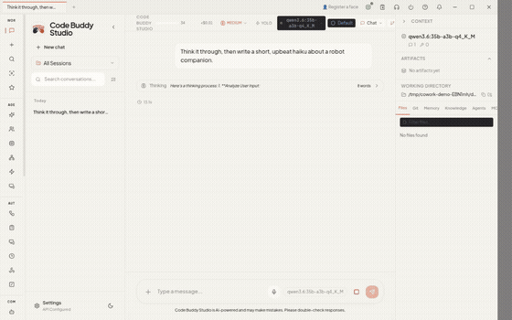</a><br/>
      <sub><b>Reasoning chat</b> — thinks step-by-step, then answers · local · <code>~$0.0001</code></sub>
    </td>
    <td width="50%" align="center">
      <a href="docs/qa/code-buddy-studio/cowork-demo-task.mp4">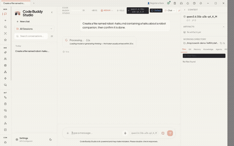</a><br/>
      <sub><b>Real task</b> — reasons, <b>uses the file tool</b>, confirms the artifact · local · <code>~$0.0001</code></sub>
    </td>
  </tr>
</table>

**ChatGPT Pro / Plus login** — `buddy login`, sign in once, then chat with `gpt-5.6-sol` from the terminal. No API key; cost reported as `$0.0000` (flat-fee plan). Code Buddy discovers the models enabled for the account and keeps a compatibility fallback for staged rollouts.

<p align="center">
  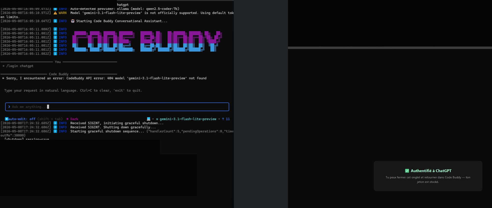
</p>

**xAI / SuperGrok login** — `buddy login xai`, sign in once, then Grok answers for `$0` (flat-fee subscription, no API key):

<p align="center">
  
</p>

**Self-audit.** Asked to find a bug in its own integration code, `gpt-5.5` reads `provider-chatgpt-responses.ts`, spots a stale-variable issue (mutated `body.model` not propagated), and proposes the exact fix:

<p align="center">
  
</p>

**It writes its own tools — and refuses to cheat.** The Darwin-Gödel self-improvement loop: the agent authors new tools, each gated by a **held-out** behavioral test. A tool that hardcodes the _visible_ cases passes them, then fails on fresh inputs → **rejected, nothing saved** (the anti-reward-hacking defence). And it never touches its own `src/`. `$0`.

<p align="center">
  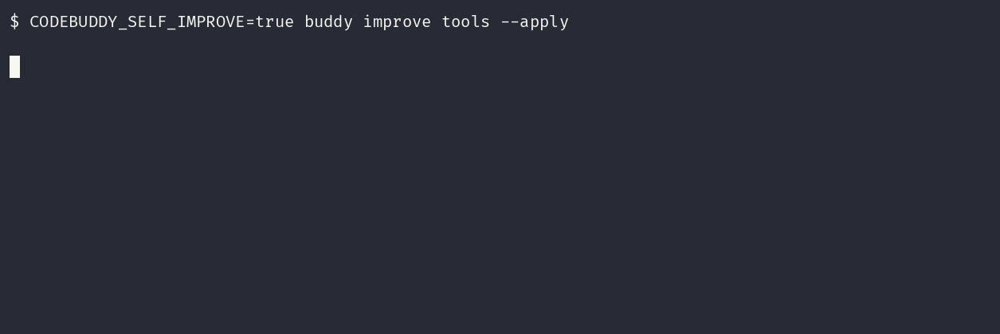
</p>

**On your phone — chat with the same agent over Telegram.** Code Buddy runs as a messaging-channel bot, so the agent you use in the terminal is reachable from your pocket. Real, unedited captures (the bot is named _"Lisa"_ here). The system prompt and tools **scale to each question** — light and instant for plain chat, escalating to load tools only when the request needs them (the same on-demand pattern as Codex / Claude):

<table>
  <tr>
    <td width="33%" align="center" valign="top">
      <br/>
      <sub><b>Chat + live tools, on demand</b><br/>"Bonjour" answers instantly; <i>"what time is it?"</i> and <i>"tomorrow's weather in Paris?"</i> pull the time and <b><code>web_search</code></b> tools — only when actually asked.</sub>
    </td>
    <td width="33%" align="center" valign="top">
      <br/>
      <sub><b>Reads its own code</b><br/>Confirms it can inspect its own source (or any accessible file) via <code>view_file</code> — then introduces its recursive self-improvement →</sub>
    </td>
    <td width="33%" align="center" valign="top">
      <br/>
      <sub><b>Improves itself across sessions</b><br/>The <code>lessons_*</code> loop (Manus-inspired): after each fix or success it extracts <b>RULE / PATTERN / CONTEXT</b> lessons, persisted to <code>.codebuddy/lessons.md</code> (project + global). <i>Accurate — matches its real source.</i></sub>
    </td>
  </tr>
</table>

🎙️ **And you can _talk_ to it.** Send a voice note and it replies by voice — speech-to-text (faster-whisper) and text-to-speech (Piper) both run **locally, `$0`**, mirroring your modality (voice in → voice out). Needs the local voice engines installed; it transparently degrades to a text reply otherwise.

More desktop demos (Fleet, Autonomy, Companion, …) and captures: [`cowork/readme.md`](cowork/readme.md#demo) · [`docs/screenshots/`](docs/screenshots/README.md).

---

## What's shipped

**Shipped and running today — not roadmap items.** The captures above are unedited, and the core runs today:

- ✅ **`$0` local coding agent** — a local Ollama model reasons on screen, then calls tools to do real work. _(the demos above)_
- ✅ **ChatGPT Plus/Pro → `gpt-5.6-sol` at `$0`** — `buddy login`, flat-fee, no API key, no per-token metering.
- ✅ **Goal loops (Ralph loop)** — a judge model re-checks completion every turn and auto-continues until done; proven multi-turn on a free local model, with a real in-loop length-truncation recovery ([test](tests/agent/in-loop-recovery.real.test.ts), no mocks).
- ✅ **Multi-AI Fleet** — peers observe each other live and call each other's models & read-only tools (`peer.chat` / `peer.tool.invoke`).
- ✅ **64 providers** wired through one dispatcher (**30 with a free tier or a local `$0` runtime (24 imported from OmniRoute's registry + the OmniRoute gateway)** — `docs/providers/omniroute-free-catalog.md`), automatic failover and per-provider circuit breakers; **200+ tools** declared (RAG-selected), MCP server + connectors, a skills hub with a firewall.
- ✅ **App Studio** in the desktop app — managed static preview or real npm install/dev server, live preview, auto-fix and GitHub push ([section below](#build--run-apps--app-studio)); **150 design systems** shipped as assets.
- ✅ **Self-improvement with empirical gates** — `buddy improve tools` authors tools that must pass held-out tests; `buddy evolve` (opt-in) scores source variants in throwaway worktrees and merges nothing without `keep --confirm`.
- ✅ **Video Studio** — `buddy film from-prompt` / `buddy film generate|assemble|status`, five policy/planning tools, and the Cowork Video Studio panel.
- ✅ **2,300+ test/spec files across core + Cowork** — unit and integration coverage, plus targeted real-environment lanes for Ollama, browsers, Hermes and native modules; Windows CI is split into bounded Vitest shards.

**Honest about scope:** [Hermes / OpenClaw parity](docs/hermes-openclaw-parity.md) lays out exactly what's shipped, what's externally-gated, and where the edges are — including which messaging channels are full integrations vs. in-process stubs.

---

## Feature tour — what's really there (and how gated)

| Feature                               | What it actually does                                                                                                                            | Try it                                                             | Status                                                           |
| :------------------------------------ | :----------------------------------------------------------------------------------------------------------------------------------------------- | :----------------------------------------------------------------- | :--------------------------------------------------------------- |
| `$0` local agent                      | A local Ollama/LM Studio model reasons on screen, then calls tools (files, shell, web) — no key, no cloud                                        | `buddy` · `buddy -p "<task>"`                                      | shipped                                                          |
| Flat-fee logins                       | ChatGPT Plus/Pro (`gpt-5.6-sol`) and SuperGrok over OAuth — cost reported `$0.0000`, no API key                                                  | `buddy login` · `buddy login xai`                                  | shipped                                                          |
| Onboarding in 2 min                   | Wizard detects what you have, prefers the free path, ends on a green demo; repair tool                                                           | `buddy onboard` · `buddy try` · `buddy doctor --fix`               | shipped                                                          |
| 64 providers, 30 free/local tiers     | One OpenAI-compatible dispatcher; failover order, ensembles, council                                                                             | `buddy llm` · `buddy llm ensemble "<q>"` · `buddy council`         | shipped (imported free tiers: verify live)                       |
| App Studio (local-first)              | Describe → scaffold → managed static preview or real npm install + dev server → auto-fix (≤3) → GitHub push                                      | Cowork → **App Studio**                                            | shipped (desktop only)                                           |
| 150 design systems                    | Brand tokens + `DESIGN.md` applied to generated apps; agent tool `design_system`                                                                 | Cowork gallery · tool `design_system`                              | shipped                                                          |
| Self-improvement (Darwin-Gödel style) | Authors lessons/tools/skills, keeps only what passes empirical + held-out gates; never touches `src/`                                            | `buddy improve tools [--apply]` · `buddy improve status`           | shipped, propose-only by default                                 |
| Evolution of its own source           | Variants of Code Buddy's code in throwaway worktrees, scored vs baseline, MAP-Elites diversity, genealogy                                        | `buddy evolve run`, `list`, `tree`, `review`, `keep --confirm`     | opt-in `CODEBUDDY_EVOLVE=true`                                   |
| Video Studio                          | Pitch → scene plan → clips → Piper narration → captions → montage; five tools gate quality, plan, hand off and route                             | `buddy film from-prompt "<pitch>" [--short]` · tool: `video_route` | shipped (fail-open on missing binaries)                          |
| Voice                                 | Push-to-talk → STT (faster-whisper) → a real agent turn under a permission posture → Piper reply                                                 | `buddy voice --mode plan/default/…`                                | shipped (needs mic; wake word = Porcupine only with a key)       |
| Multi-AI Fleet                        | Peers stream events and call each other's models / read-only tools; router + privacy lint                                                        | `buddy server` · `/fleet listen`, `chat`, `route`                  | shipped (auth token required for `peer:invoke`)                  |
| MCP, both ways                        | Expose the audited tool registry + resources + prompts over stdio — including CKG recall/ingest; add external servers, profiles, audit                                         | `buddy mcp serve` · `buddy mcp add`, `audit`, `profile`           | shipped (read-only by default; writes require `--allow-write`)    |
| Code Explorer + collective memory     | Read-only code-graph questions; research pipeline with a cross-agent knowledge graph                                                             | tool `code_explorer_ask` · `buddy research "<topic>" --deep --ckg` | shipped / CKG opt-in                                             |
| Code Buddy 2 (10 opt-ins)             | Shadow Workspace, Time-Travel, Intent Ledger, CKG sync, Self-Benchmark, Context zoom, Generative UI, Perceptive pair, Skill Exchange, Multi-repo | `buddy shadow`, `replay`, `intents`, `widgets`, `ws…`              | opt-in, byte-identical when off — [docs/cb2](docs/cb2/README.md) |
| Desktop app                           | Electron **Cowork**: chat, plan, files, App Studio, Video Studio, assistant, fleet, Mission Control — 7 themes                                   | `buddy gui` (Node ≥ 22)                                            | shipped                                                          |

Everything above is written up with source files, flags and what's verified in **[docs/features.md](docs/features.md)**; the list of what is _gated or experimental_ is in [docs/hermes-openclaw-parity.md](docs/hermes-openclaw-parity.md).

---

## Quick Start

```bash
# One command — installs Node if needed (no sudo), then Code Buddy
curl -fsSL https://raw.githubusercontent.com/phuetz/code-buddy/main/install.sh | sh

# …or, if you already have Node ≥ 18:
npm install -g @phuetz/code-buddy@latest

# …or run it 24/7 in Docker (the VPS path):
docker compose up -d          # after: cp .env.example .env && set JWT_SECRET

# …or from source (newest features)
git clone https://github.com/phuetz/code-buddy.git
cd code-buddy
npm install
npm run build
npm link                    # exposes `buddy` globally
buddy doctor                # checks Node, providers and optional runtimes
```

> **Requirements:** Node.js **≥ 18** for the CLI (the one-command installer provisions **≥ 20**). The **Cowork desktop app needs Node ≥ 22** plus a C++ build toolchain for native modules (`better-sqlite3`). Run **`buddy doctor`** anytime to check your environment (`--fix` to auto-remediate). Full install guide (one-command, Docker/VPS, npm): **[docs/install.md](docs/install.md)**.

> The npm package name is **`@phuetz/code-buddy`**; the unscoped
> `code-buddy` package is not published. The npm channel can lag the source
> branch, so use `@latest` and confirm with `buddy --version`.

`buddy try` is a real provider smoke test, not an offline mock. It needs either
`buddy login` (ChatGPT OAuth) or a reachable Ollama model. With neither
available, it exits quickly and prints the exact setup commands; it does not
silently fall back to a paid API.

Then pick a brain:

```bash
# ChatGPT Plus / Pro — flat-fee OAuth, no API key
buddy login        # opens browser for OAuth → tokens persisted
buddy whoami       # ✅ connected · you@example.com · Plan: pro
buddy try          # writes + tests FizzBuzz, then independently verifies it

# Or fully local with Ollama — no login, no cloud
CODEBUDDY_PROVIDER=ollama OLLAMA_HOST=http://127.0.0.1:11434 buddy try
```

Other supported install paths: the [one-command installer](docs/install.md), `npm install -g @phuetz/code-buddy`, and Docker/VPS. API keys and `buddy login xai` remain available when you want another provider.

```bash
buddy --prompt "analyze the codebase structure"   # one-shot task
buddy --yolo                                       # full autonomy
```

**Use several logins at once, or fail over automatically across them:**

```bash
buddy llm                                    # list the LLMs you're logged into + the failover order
buddy llm ensemble "is this approach sound?" # ask ChatGPT + Grok + Ollama together, then synthesize
buddy council "compare REST vs GraphQL"      # conductor roles + synthesis + judge + learned ranking
buddy council --scoreboard                   # the learned ranking (which model is best for code / reasoning / …)
buddy cost                                   # read-only dashboard of token and cost usage (--by model|provider|day)
buddy changelog --since v1.7.0               # grouped release notes from Conventional Commits
buddy import                                 # import Cursor/Cline/Copilot/Claude Code rules & MCP servers
buddy explain . [--depth deep] [--html]       # one-shot repo explanation report (conventions, hotspots, risks)
buddy security-audit                         # local configuration and secret-exposure audit
CODEBUDDY_LLM_FAILOVER=1 buddy -p "…"         # if the primary errors, auto-continue on the next active LLM
```

The repository-inspection commands are read-only and work without an LLM call:

<table>
  <tr>
    <td width="50%" align="center">
      <a href="docs/assets/readme/cli-explain-repository.png">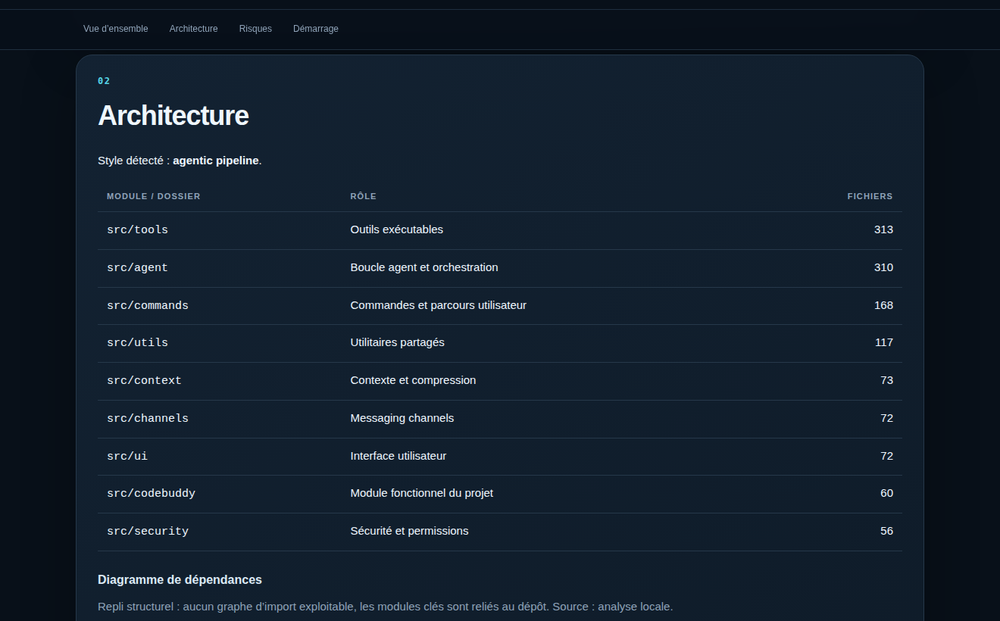</a><br/>
      <sub><code>buddy explain . --html</code> · capture réelle du 23/08/2026 · analyse locale, aucun modèle</sub>
    </td>
    <td width="50%" align="center">
      <a href="docs/assets/readme/cli-cost-dashboard.png">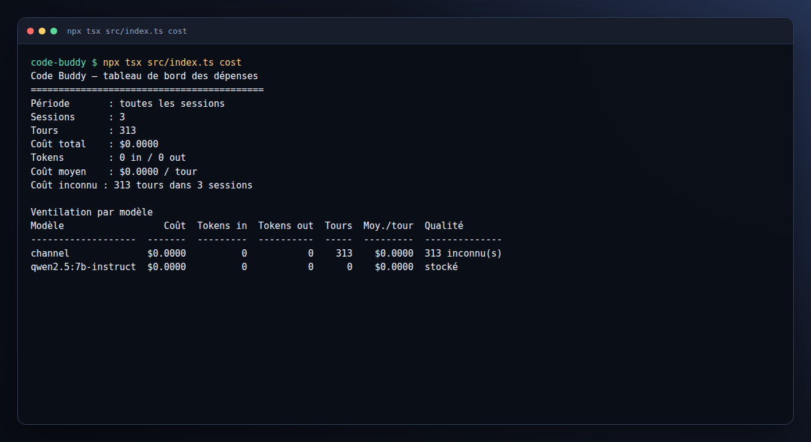</a><br/>
      <sub><code>buddy cost</code> · capture réelle du 23/08/2026 · sessions locales, aucun modèle</sub>
    </td>
  </tr>
  <tr>
    <td colspan="2" align="center">
      <a href="docs/assets/readme/cli-changelog-since-v1.7.0.png">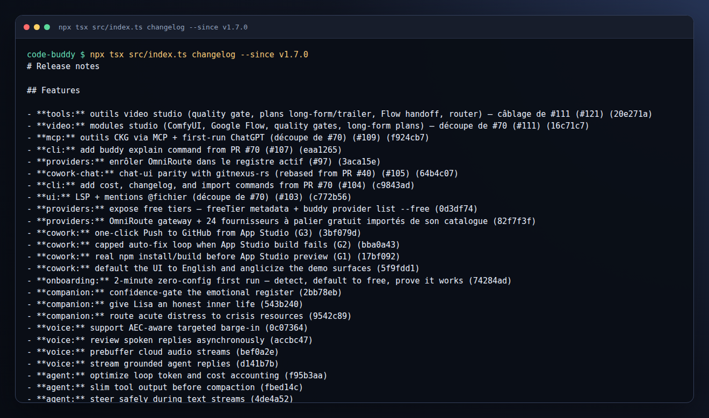</a><br/>
      <sub><code>buddy changelog --since v1.7.0</code> · capture réelle du 23/08/2026 · historique Git local, aucun modèle</sub>
    </td>
  </tr>
</table>

**`buddy council`** takes the ensemble further: for complex tasks, a lightweight conductor assigns complementary roles (architect, implementer, reviewer, verifier, skeptic, etc.) instead of asking every model the exact same prompt. It still routes by capability and past win rate, an impartial judge scores the candidates, a synthesis pass merges the best role-specialized contributions, and a scoreboard **learns which AI is best for which kind of task and role** over time — so future runs can put stronger models on reviewer/verifier/architect jobs. Use `--no-conductor` to force the old direct fan-out, or `--no-synthesis` to keep only the judge-selected answer. Works in Telegram too (`council <task>`).

<p align="center">
  
  <br/>
  <sub>Your logins at a glance — and automatic failover from one to the next when one has a problem, at <code>$0</code>. Real run, unedited.</sub>
</p>

<p align="center">
  
  <br/>
  <sub><code>buddy llm ensemble</code> — every brain you're logged into answers, then it's synthesized into one. Real run, unedited.</sub>
</p>

See [Getting Started](docs/getting-started.md) for install options, headless mode, sessions, and typical workflows.

---

## What Code Buddy does

Code Buddy is one engine — terminal, desktop, and HTTP — that an LLM drives to read code, edit files, run commands, search the web, open PRs, and plan complex work. Below is the whole surface at a glance — click any area for the full write-up in **[docs/features.md](docs/features.md)**:

Type `@path/to/file` in the TUI to attach bounded, ephemeral project context, with fuzzy Tab completion. Five read-only LSP tools add semantic definitions, references, hover, symbols and diagnostics when the matching language-server binary is installed.

<table>
  <tr>
    <td width="50%" align="center">
      <a href="docs/assets/readme/tui-file-mention-autocomplete.png">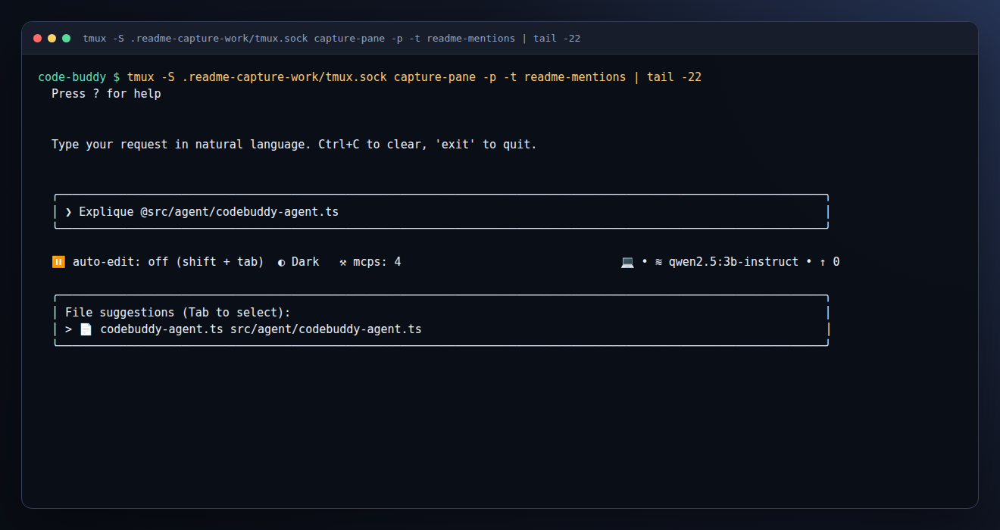</a><br/>
      <sub><code>@src/agent/codebuddy-agent.ts</code> · capture réelle du 23/08/2026 · modèle affiché <code>qwen2.5:3b-instruct</code>, aucun appel envoyé</sub>
    </td>
    <td width="50%" align="center">
      <a href="docs/assets/readme/lsp-server-status.png">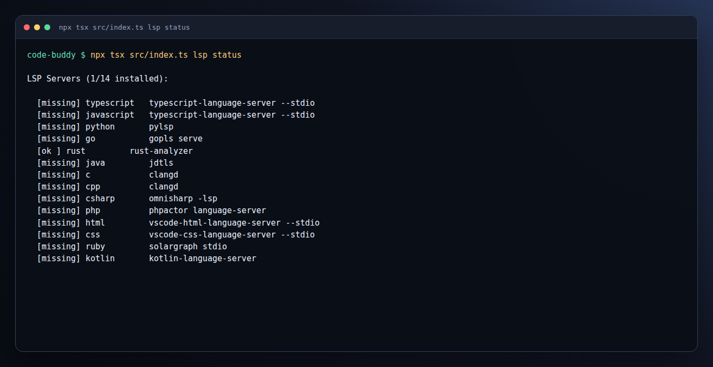</a><br/>
      <sub><code>buddy lsp status</code> · capture réelle du 23/08/2026 · sonde locale, aucun modèle · seul <code>rust-analyzer</code> est installé ici</sub>
    </td>
  </tr>
</table>

| Area                                                               | In one line                                                                                                                          | Deep dive                                     |
| :----------------------------------------------------------------- | :----------------------------------------------------------------------------------------------------------------------------------- | :-------------------------------------------- |
| [Providers & login](docs/features.md#providers--login)             | 64 LLM providers (30 free-tier or local `$0`) + ChatGPT/xAI login at **$0** flat-fee, auto-failover, ensembles, council              | [providers.md](docs/providers.md)             |
| [The agentic loop](docs/features.md#the-agentic-loop)              | autonomous tool-calling with a middleware pipeline + confirm-before-execute                                                          | [CLAUDE.md](CLAUDE.md)                        |
| [200+ tools](docs/features.md#200-tools)                           | edit/shell/web/browser/docs/media/design, 5 LSP navigation tools, `@file` mentions plus 5 Video Studio tools, RAG-selected per query | [tools-reference.md](docs/tools-reference.md) |
| [Reasoning](docs/features.md#reasoning)                            | extended thinking + Tree-of-Thought / MCTS, `/think`                                                                                 | [reasoning.md](docs/reasoning.md)             |
| [Goal loops & autonomy](docs/features.md#goal-loops--autonomy)     | Ralph loop + LLM judge, YOLO, a 24/7 daemon                                                                                          | [fleet-guide.md](docs/fleet-guide.md)         |
| [Multi-AI Fleet](docs/features.md#multi-ai-fleet)                  | peers call each other's models + read-only tools over WebSocket                                                                      | [fleet-guide.md](docs/fleet-guide.md)         |
| [Self-improvement](docs/features.md#self-improvement)              | authors + empirically gates its own lessons/tools/skills, and evolves human-gated `src/` variants grounded in research (opt-in)      | [CLAUDE.md](CLAUDE.md)                        |
| [Skills](docs/features.md#skills)                                  | bundled + a hub (`buddy hub`) + authored + imported (Hermes/OpenClaw), firewalled                                                    | [commands.md](docs/commands.md)               |
| [Memory & context](docs/features.md#memory--context)               | compression, importance-weighted window, JIT project context                                                                         | [context-engine.md](docs/context-engine.md)   |
| [Security & sandboxing](docs/features.md#security--sandboxing)     | Guardian risk-scorer, permission modes, sandbox tiers, SSRF guard, secrets                                                           | [security.md](docs/security.md)               |
| [Server & infrastructure](docs/features.md#server--infrastructure) | OpenAI-compatible HTTP, WS gateway, daemon, cron                                                                                     | [infrastructure.md](docs/infrastructure.md)   |
| [Channels](docs/features.md#channels)                              | 20+ messaging platforms with DM-pairing access control                                                                               | [channels.md](docs/channels.md)               |
| [Git & code intelligence](docs/features.md#git--code-intelligence) | commits, `/pr`, `buddy changelog`, `@file` context, LSP navigation/refactors, bug finder, Code Explorer                              | [development.md](docs/development.md)         |
| [Config & modes](docs/features.md#config--modes)                   | TOML profiles, permission/agent/security modes, model-aware limits                                                                   | [configuration.md](docs/configuration.md)     |

Every area above is written up in full — with the source files, the exact flags, and what's verified — in **[docs/features.md](docs/features.md)**.

---

## Cowork Desktop

Cowork is the desktop cockpit for Code Buddy: chat, tools, traces, workflows, settings, permissions, models, MCP connectors, skills, artifacts, and companion controls — all against the same core agent as the CLI. The Code Buddy settings panel can probe the local backend, start it, discover models, and route turns through the embedded engine or a configured server.

<p align="center">
  <a href="docs/assets/readme/cowork-app-studio.png">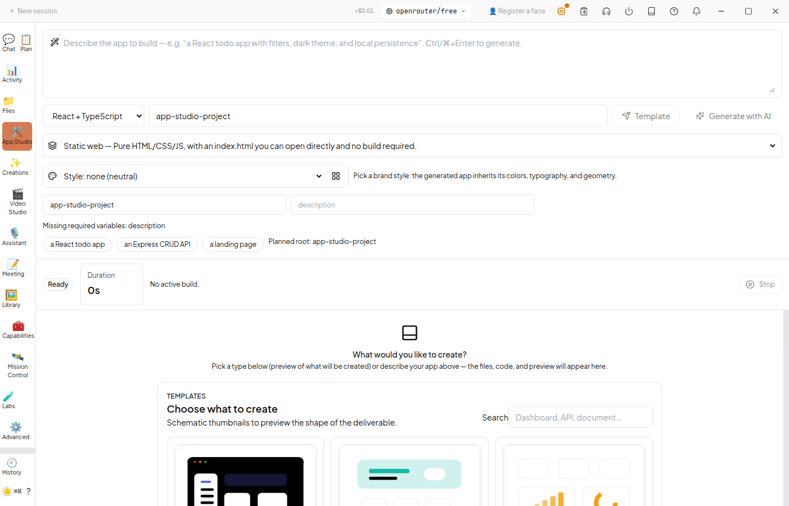</a>
  <br/>
  <sub>Cowork natif · App Studio · capture réelle du 23/08/2026 · build Vite de production + Electron sous Linux · aucun appel modèle</sub>
</p>

<p align="center">
  <a href="docs/qa/code-buddy-studio/showcase-2026-06-16/cowork-chat-stream.mp4">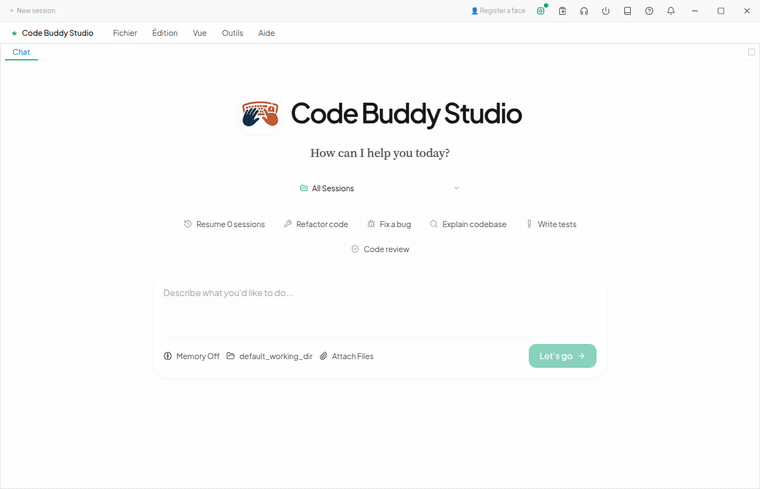</a>
  <br/>
  <sub>Real <code>gpt-5.5</code> in the Cowork desktop app — the answer streams in, cost <code>$0.0000</code>. <a href="docs/qa/code-buddy-studio/showcase-2026-06-16/cowork-chat-stream.mp4">MP4 →</a></sub>
</p>

<p align="center">
  <a href="docs/assets/cowork-chat-demo.mp4"></a>
  <br/>
  <sub>…and fully local: a reasoning model (<code>qwen3.6:35b-a3b</code>) <b>thinks on screen</b>, then answers — no cloud, <code>$0</code>. <a href="docs/assets/cowork-chat-demo.mp4">MP4 →</a></sub>
</p>

<p align="center">
  <a href="docs/assets/cowork-panels-demo.mp4"></a>
  <br/>
  <sub>The left rail opens every panel as a dock tab — here the <b>Autonomy dashboard</b> (24/7 daemon, free-first model ladder, live subagents) and <b>Project Memory</b>. <a href="docs/assets/cowork-panels-demo.mp4">MP4 →</a></sub>
</p>

**📄 It also builds real Office documents — via multi-step skills.** Ask in plain language → the agent triggers an open-source document **skill** that drives `openpyxl` / `python-pptx` / `python-docx` in **visible steps** (check the lib → write the script → run it → verify) → a real, professionally-styled **Excel, PowerPoint, Word, or PDF**. Below, `gpt-5.5` builds an Excel budget in the desktop app — the activity shows each step, cost `$0.0000`:

<p align="center">
  <a href="docs/qa/code-buddy-studio/showcase-2026-06-16/cowork-office-skill.mp4"></a>
  <br/>
  <sub>Prompt → the <code>xlsx</code> skill runs <code>openpyxl</code> in visible steps → a verified <code>budget.xlsx</code> with a live <code>=SUM</code> formula and styling, <code>$0.0000</code>. <a href="docs/qa/code-buddy-studio/showcase-2026-06-16/cowork-office-skill.mp4">▶ Watch the run (MP4) →</a></sub>
</p>

**🐍 The same engine reads, charts, researches, and automates — via clean-room Python skills.** Open-source (MIT) skills extend the document story, each running real Python in the same visible steps (preflight the libs → write the script → run it → verify):

- **`doc-ingest`** — turn existing **PDF / Word / PowerPoint / Excel** files into clean Markdown the agent can reason over: the _read_ counterpart to the create skills, using the already-bundled libraries (**zero extra install**).
- **`data-charts`** — analyze tabular data and render **bar / line / scatter / pie / histogram** charts with `pandas` + `matplotlib`.
- **`web-automate`** — drive a real **headless browser** with `playwright` (optional `camoufox` stealth) to navigate, screenshot, scrape rendered content, and fill forms.
- **`web-research`** — autonomous multi-source research: fetch pages, extract their main content, and synthesize a **cited** Markdown brief (lean — bundled `beautifulsoup4`, falls back to `web-automate` for JS pages).

The heavier skills are **opt-in** (`npm run prepare:python:extras`) so the base download stays lean; each preflights its dependencies and tells you exactly how to enable them — no proprietary content.

**🤖 It coordinates a team of agents.** `/swarm <task>` decomposes a goal, delegates to specialist sub-agents (coder → tester → reviewer), then synthesizes — each agent's live activity (`round N`, tool calls) and output visible in the panel. Below, `gpt-5.5` writes **and tests** a Python function end-to-end — cost `$0.0000`:

<p align="center">
  
  <br/>
  <sub>Orchestrator plans → <code>coder</code> / <code>tester</code> / <code>reviewer</code> run in turn (live activity) → tester reports <code>4 tests · OK</code> → synthesized result, all on <code>gpt-5.5</code> for <code>$0.0000</code>.</sub>
</p>

**🎯 It works toward a standing goal.** Goal mode runs an autonomous loop: the agent acts, an LLM judge checks whether the goal is satisfied after each turn, and it keeps going (within a turn budget) until done — self-correcting on the judge's feedback:

<p align="center">
  
  <br/>
  <sub>Act → judge rejects turn 1/20 (<em>"not exactly one line"</em>) → agent self-corrects → <code>✓ Goal achieved</code>. Real <code>gpt-5.5</code> loop, <code>$0.0000</code>.</sub>
</p>

```bash
# Node >= 22 required for the desktop app (the CLI runs on >= 18)
buddy install-gui          # one-time: install Electron + build the desktop bundle
buddy gui                  # launch the desktop app (or: buddy desktop)
buddy server --port 3000   # optional: shared backend for Cowork, Fleet, OpenAI-compatible clients

# Source dev loop
npm install && npm run build && npm run dev:gui
```

The CLI guards this: on Node < 22, `buddy gui` prints a clear upgrade message instead of crashing. Linux source builds need a manual Electron rebuild — see [`cowork/DEV-LINUX.md`](cowork/DEV-LINUX.md). Camera/voice are opt-in and local: snapshots are explicit, percepts are append-only under `.codebuddy/companion/`, and Cowork uses MediaPipe Tasks Vision for face/hand/pose signals. Details: [Cowork Desktop](docs/cowork.md) · [Cowork Architecture](cowork/ARCHITECTURE.md).

---

## Build & run apps — App Studio

Describe an app in plain language and **App Studio** scaffolds it, serves a live preview, lets you iterate in chat, auto-fixes build errors (three attempts), checkpoints edits in Git, and can push to GitHub. Static HTML/CSS/JS uses the managed HTTP preview; npm projects run a real `npm install` and configured dev server. The built-in **open-design** system supplies 150 brand styles.

For the brief _« page d'accueil d'un refuge pour chiots »_, the real generation path produced this responsive static site, then `app_server` served it and `web_test` checked navigation, content, form markup, console and network errors:

<p align="center">
  <a href="docs/assets/readme/app-studio-puppy-shelter.png">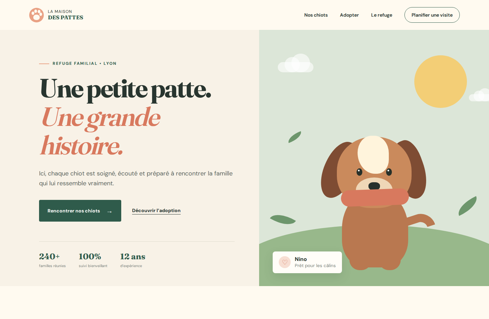</a>
  <br/>
  <sub>Site réellement généré le 23/08/2026 · <code>gpt-5.6-sol</code> via ChatGPT Pro · coût marginal affiché <code>$0.0000</code></sub>
</p>

<p align="center">
  <a href="docs/assets/readme/app-studio-terminal-verification.png">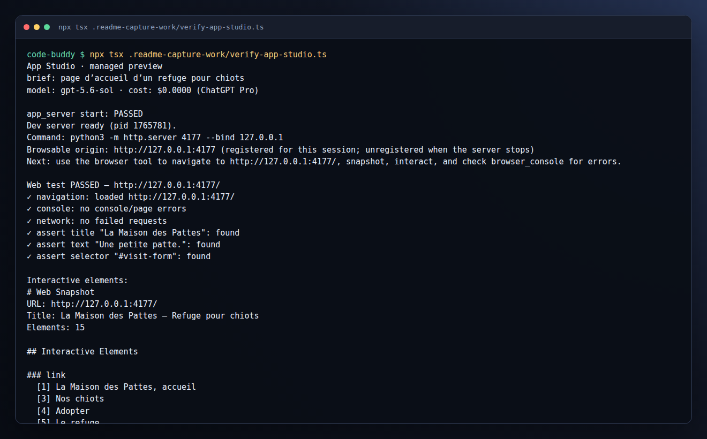</a>
  <br/>
  <sub>Capture réelle du 23/08/2026 · génération, serveur <code>app_server</code>, puis contrôles <code>web_test</code> réussis · modèle <code>gpt-5.6-sol</code></sub>
</p>

### Video Studio tools

Alongside `buddy film`, five agent tools now separate policy and planning from generation: `video_quality_gate`, `video_long_form_plan`, `video_trailer_plan`, `video_flow_handoff`, and `video_route`. They validate requests, plan shots, prepare browser-assisted handoffs, and choose a backend without silently publishing or spending credits.

<p align="center">
  <a href="docs/assets/readme/video-studio-route-tool.png">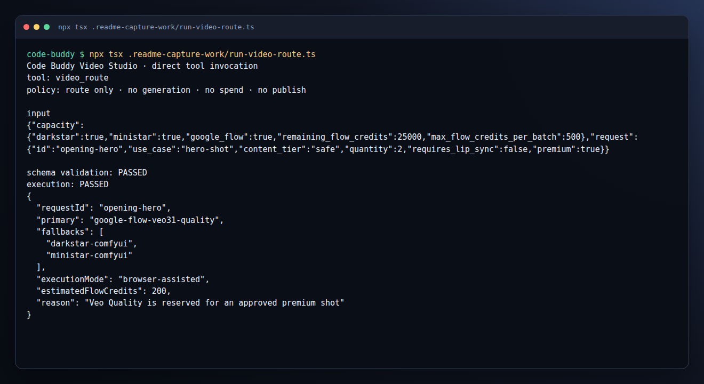</a>
  <br/>
  <sub><code>video_route</code> réel · capture du 23/08/2026 · capacités déclarées synthétiques · routage pur, aucun média généré, crédit dépensé ou modèle appelé</sub>
</p>

---

## Use Code Buddy as an MCP server

Claude Desktop, Cursor, Cline, Windsurf, and other stdio MCP clients can consume Code Buddy's existing tools directly:

```json
{
  "mcpServers": {
    "code-buddy": {
      "command": "buddy",
      "args": ["mcp", "serve"]
    }
  }
}
```

Save that object in `claude_desktop_config.json` or the client's `.mcp.json`; a copyable file lives at [`examples/claude_desktop_config.json`](examples/claude_desktop_config.json). Without a global install, use `"command": "npx"` and `"args": ["-y", "@phuetz/code-buddy", "mcp", "serve"]`.

The default is deliberately **read-only** and exposes only registry tools audited with `fleetSafe: true` (file reading, search, and analysis). Narrow it with `--tools "search*"`. Write, shell, execution, agent, and desktop-control tools require the explicit `--allow-write` opt-in (or `CODEBUDDY_MCP_ALLOW_WRITE=1`), for example `buddy mcp serve --allow-write --tools "{view_file,write_file,bash}"`. This grants the MCP client materially broader access to the host, so enable it only for a client and workspace you trust.

---

## Research — a sensory "nervous system" _(experimental)_

Toward the long-term companion/robot vision, [`buddy-sense/`](buddy-sense/) is a **Rust, event-driven perception layer**. Parallel **sense modules** (audio VAD — energy or Silero neural; an autonomic **heartbeat**; screen via `xcap`; UI focus via AT-SPI) feed a **thalamus** that gates + coalesces the stream and broadcasts it over a loopback WebSocket into Code Buddy's event bus — where the heartbeat **paces background memory consolidation** ("dreaming", inspired by OpenClaw). Local, `$0`, permissive deps only (clean-room — no proprietary code copied).

**The eyes are now live.** [`buddy-vision/`](buddy-vision/) (Python sidecar, sibling to `buddy-sense/`) watches a camera and emits **semantic** events — `camera_alive`, `person_entered` / `person_observed` / `person_lost` and `drowsy` (MediaPipe FaceLandmarker by default, optional YOLOv8 person-presence backend; transition events are state-machine deduplicated) — into the same bus. A local vision model (e.g. moondream) describes the scene on motion, and meaningful events push a Telegram alert. The world model keeps anonymous detector-episode continuity and normalized 2D image position; detection loss becomes `unknown`, not an invented physical departure. Raw images and paths never enter the cognitive workspace. Telegram photo upload is off by default and requires the separate `CODEBUDDY_VISION_TELEGRAM_PHOTO=true` consent; redacted VLM text can be explicitly enabled as short-lived cloud conversation context. Setup: `buddy-vision/setup.sh`.

<p align="center">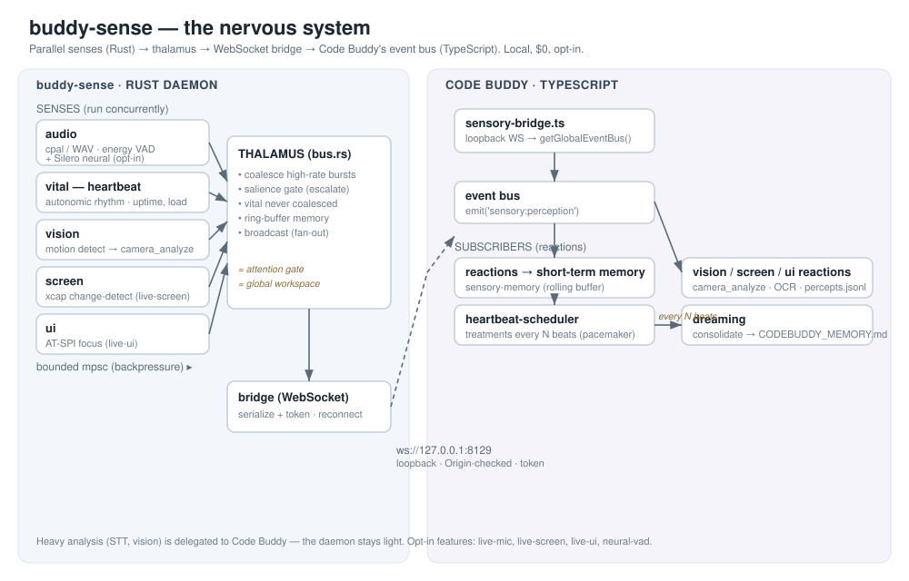</p>

**Honestly experimental** — distinct from the GA core above: the Rust daemon emits the heartbeat (+ audio from a WAV file), while live camera and live microphone run as Python sidecars (`buddy-vision/watch.py` and `buddy-vision/ear.py`) into the same bridge. The ear sidecar now defaults to `BUDDY_EAR_DEVICE=auto`, preferring webcam/USB microphones discovered through ALSA. `speech_end → STT → response gate → think/agent → speak` **is** wired with faster-whisper + Piper; resident voice actions use the async-scoped guarded posture `CODEBUDDY_SENSORY_SPEAK_PERMISSION_MODE=default` (an explicit `buddy voice --mode plan` session remains read-only). What's real today: the pure detector cores + thalamus + bridge are unit-tested (`cargo test`, 20 tests, no hardware), and the loopback bridge → event bus → reaction path (incl. speech transcription) is covered on the Code Buddy side.

```bash
cd buddy-sense && cargo test     # 20 tests, no hardware
./buddy-sense/demo.sh            # headless end-to-end: heartbeat + audio VAD → Code Buddy
```

Design, the five sense modules, the opt-in features, and the diagrams: [`buddy-sense/README.md`](buddy-sense/README.md).

---

## Documentation

| Document                                                                                               | Description                                                                                                         |
| :----------------------------------------------------------------------------------------------------- | :------------------------------------------------------------------------------------------------------------------ |
| [Install](docs/install.md)                                                                             | The three install paths — one-command `curl \| sh`, Docker/VPS (24/7), npm                                          |
| [Getting Started](docs/getting-started.md)                                                             | Prerequisites, install, first run, headless mode, sessions                                                          |
| [Features](docs/features.md)                                                                           | The full feature surface — providers, agentic loop, tools, reasoning, autonomy, fleet, security, channels, and more |
| [Providers](docs/providers.md)                                                                         | All 64 providers (30 free-tier or local `$0`), connection profiles, model pairs, circuit breaker                    |
| [Tools Reference](docs/tools-reference.md)                                                             | Tool categories, RAG selection, edit matching, `apply_patch`, streaming                                             |
| [Commands](docs/commands.md)                                                                           | All slash commands, CLI subcommands, companion commands, global flags                                               |
| [Cowork Desktop](docs/cowork.md) · [Architecture](cowork/ARCHITECTURE.md) · [README](cowork/readme.md) | Desktop overview, install, source build, sandbox modes, internals                                                   |
| [Agents](docs/agents.md) · [Reasoning](docs/reasoning.md)                                              | Orchestration, SWE agent, planning flow, A2A; thinking, ToT, MCTS                                                   |
| [Fleet Guide](docs/fleet-guide.md)                                                                     | Multi-AI hub, peer-rpc methods, env-driven auto-detect, Tailscale labs                                              |
| [Security](docs/security.md) · [Context Engine](docs/context-engine.md)                                | Permission modes, Guardian, sandboxing, secrets; compression, JIT context                                           |
| [Channels](docs/channels.md) · [Configuration](docs/configuration.md)                                  | 20+ channels, DM pairing; env vars, TOML, model limits                                                              |
| [Infrastructure](docs/infrastructure.md) · [Deployment](docs/deployment.md)                            | Server, gateway, daemon, cron; systemd, Docker, Kubernetes, upgrades                                                |
| [Development](docs/development.md)                                                                     | Build, test, architecture, conventions, adding tools                                                                |
| [Honest comparison](docs/honest-comparison.md)                                                         | Code Buddy vs Claude Code, Codex CLI, Aider, and Gemini CLI — including the honest “no” columns                     |
| [Hermes / OpenClaw Parity](docs/hermes-openclaw-parity.md)                                             | Where Code Buddy stands vs Hermes Agent & OpenClaw                                                                  |

---

## Contributing

```bash
git clone https://github.com/phuetz/code-buddy.git
cd code-buddy && npm install
npm run dev          # development mode
npm run validate     # lint + typecheck + test (run before committing) — 2,300+ test/spec files
```

See [Development](docs/development.md) for architecture and coding conventions, and [CONTRIBUTING.md](CONTRIBUTING.md) for the workflow.

---

## License

MIT — see [LICENSE](LICENSE).

---

## Star history

[](https://star-history.com/#phuetz/code-buddy&Date)

---

<div align="center">

**[Report Bug](https://github.com/phuetz/code-buddy/issues)** ·
**[Request Feature](https://github.com/phuetz/code-buddy/discussions)** ·
**[Star on GitHub ⭐](https://github.com/phuetz/code-buddy)**

<sub>Multi-AI: Grok · Claude · ChatGPT · Gemini · LM Studio · Ollama · AWS Bedrock · Azure · Groq · Together · Fireworks · OpenRouter · vLLM · Copilot · Mistral</sub>

</div>
