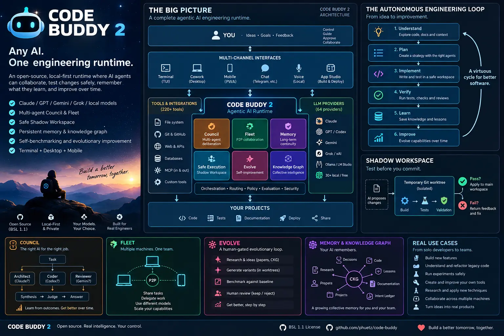
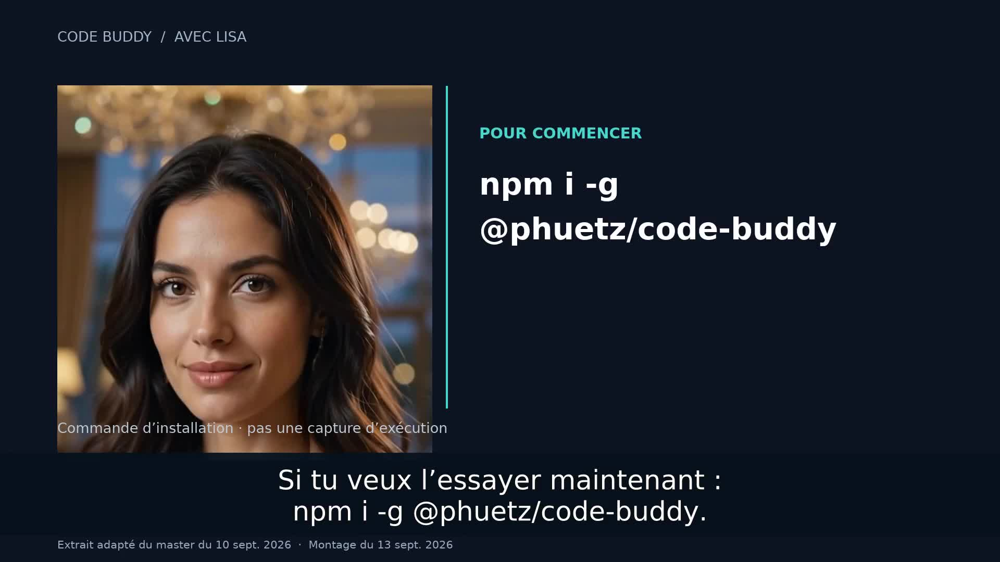
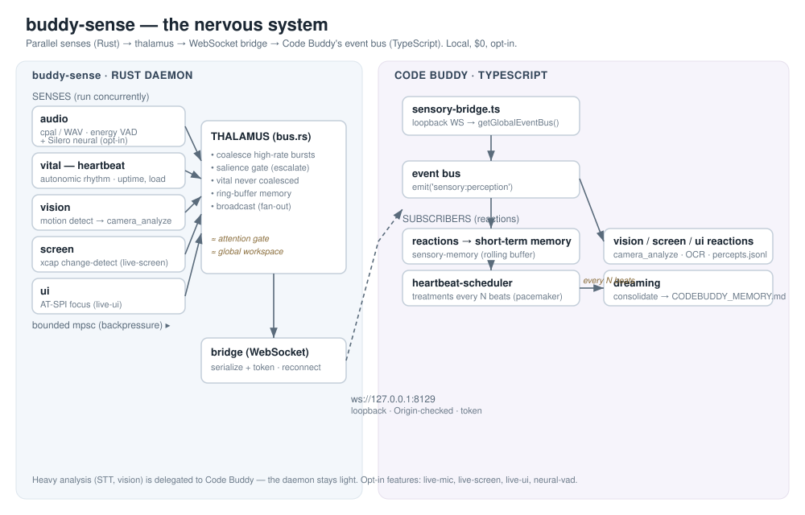

<div align="center">

# Code Buddy 2

**A local-first AI coding agent that can also run as a fleet, a desktop app, and a companion.**
It reads your repository, writes code, runs commands, and you can watch it work — on your machine,
at $0 with [Ollama](https://ollama.com) or a ChatGPT subscription.

<p>
  <a href="https://www.npmjs.com/package/@phuetz/code-buddy"></a>
  <a href="https://github.com/phuetz/code-buddy/actions/workflows/ci.yml?query=branch%3Amain"></a>
  <a href="LICENSE"></a>
</p>

[Français](README.fr.md) ·
[What Code Buddy is](#what-code-buddy-is) ·
[Install](#install) ·
[First run](#first-run) ·
[Opt-in](#opt-in) ·
[Not ready](#not-ready) ·
[License](#license) ·
[Documentation](#documentation)

<p>
  <a href="docs/qa/code-buddy-studio/cowork-demo-moneyshot.mp4"></a>
  <br/>
  <sub>A local model reasons on screen, then uses a tool to create a real file. No cloud API bill.</sub>
</p>

<p>
  <a href="docs/assets/infographic-code-buddy-2.webp"></a>
  <br/>
  <sub>The big picture: interfaces, the agentic runtime, tools and providers, and the loop that turns an idea into an improvement.</sub>
</p>

</div>

---

## What Code Buddy is

### One minute with Lisa · French presentation

[](https://youtu.be/2XgFHxBeI8Q)

[Watch on YouTube](https://youtu.be/2XgFHxBeI8Q) · [MP4 alternative](https://www.agile-up.com/code-buddy/lisa/presentation.mp4) · [French subtitles](assets/site/lisa/presentation.fr.srt)

Lisa introduces the multi-AI hub, installation and optional perception components. Edited on September 13, 2026 from an existing September 10 master, with a synthetic voice and portrait, illustrative footage and French captions. Illustrations are not execution evidence. Voice and robotics require additional components beyond the npm package.

Code Buddy combines a terminal coding agent with cloud, gateway and local model routing,
query-selected tools, and the following interfaces. Optional services require their documented
configuration; enabling a feature does not replace its permission checks.

For changes planned for 2.3.0, see the [changelog](CHANGELOG.md). The
[2.2.0 release notes](docs/RELEASE-NOTES-2.2.0.md) describe the last published
version and its integration limits.

- **A multi-AI fleet hub.** Peers running `buddy server` observe each other's events and call each
  other's models: one-shot `peer.chat`, multi-turn `peer.chat-session.*`, and `peer.tool.invoke`
  for remote **read-only** tools. That last one passes three ordered gates — an allowlist, a
  per-tool `fleetSafe` flag, and a workspace root that **fails closed** when unset, so a
  misconfigured peer cannot expose its disk. See [Fleet](docs/fleet-guide.md).

- **Cowork, a desktop GUI.** An Electron app with a visual workflow runner, a media library and a
  video studio. It is a separate package needing Node.js ≥ 22 — see [Cowork](docs/cowork.md).

- **Ten opt-in innovations.** Speculative writes validated in a ghost worktree before touching
  your files, per-turn time-travel sessions, falsifiable intent specs, pull-only knowledge-graph
  federation between peers, a capability self-benchmark, recoverable ("zoom-in") compaction,
  generative widgets, on-screen error watching, signed skill packages, and read-only multi-repo
  search. Index: [`docs/cb2/README.md`](docs/cb2/README.md).

- **A self-improvement loop with four learnable surfaces.** The agent can propose *lessons*,
  *tools* it writes itself, *skills*, and *execution strategies* — and each proposal is
  **empirically gated**: applied to a snapshot, re-scored, and rolled back on regression or no
  gain. Authored tools face held-out cases hidden from the proposer, so a tool that hardcodes the
  visible answers is rejected. A strategy is a schema-checked JSON in which no field can disable a
  guard. The loop never edits the agent's own `src/` — that is a scanned invariant.

- **A council that learns which model to trust.** Several models answer under a
  falsifiable-output contract, a judge scores them, and a scoreboard records which model wins
  which kind of task. The judge abstains rather than guess.

- **A perception layer.** A Rust sense daemon (audio, vision, screen, UI focus, heartbeat) feeds
  events to the agent over a loopback-only bridge; speech, camera reactions and spoken reminders
  build on it. It stays silent until you turn it on.

<p align="center">
  
</p>

---

## Install

Three commands (Node.js 22 or 24 recommended; 20 is the declared minimum):

```bash
npm i -g @phuetz/code-buddy   # the package is scoped; `code-buddy` alone is not on npm
buddy login                   # ChatGPT subscription — no API key, $0 marginal cost
buddy                         # start chatting
```

`buddy login` also accepts `xai`. To stay entirely local instead, skip it, start
[Ollama](https://ollama.com), and run `buddy onboard`. Either way `buddy doctor` tells you in one
line whether you are ready, and `buddy doctor --fix` can point a running Ollama at a suitable
installed model and say why it chose it.

The published package can lag this repository. To track the source instead:

```bash
git clone https://github.com/phuetz/code-buddy.git
cd code-buddy && npm install
npm run build && npm link
```

If the `@vscode/ripgrep` install script receives a GitHub 403, see the
[source-install workaround](docs/install.md#ripgrep-download-blocked-during-npm-ci).

- **Cowork** is built separately from a Code Buddy source checkout (Node.js ≥ 22,
  `node dist/index.js install-gui`), not part of the three
