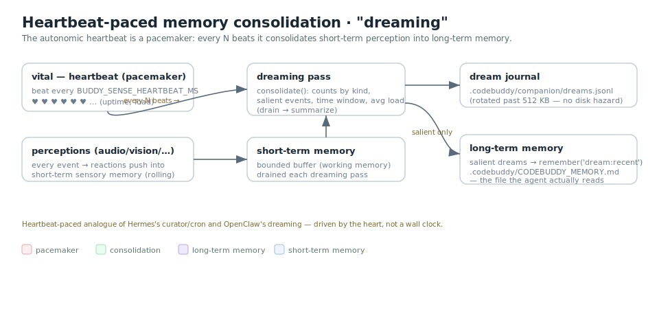

# buddy-sense

A parallel, event-driven **nervous system** in Rust — the perception layer for
[Code Buddy](https://github.com/phuetz/code-buddy) / the Lisa companion.

The human brain is massively parallel: sight, hearing, and the heartbeat all run
concurrently, gated by the brain, and memory consolidates in the background.
`buddy-sense` reproduces that: the **sense modules** run concurrently, a **thalamus**
gates/coalesces the stream, and a **bridge** feeds events into Code Buddy's event
bus, where they trigger processing (and heartbeat-paced memory consolidation). The
default daemon emits the heartbeat (and audio when given a WAV); the screen/ui live
captures are opt-in features, and vision is a detector core with no live path yet.


- **Senses** emit `SensoryEvent { modality, kind, ts_ms, salience, payload }` over
  bounded channels (backpressure).
- **Thalamus** (`bus.rs`): coalesces high-rate low-salience bursts, lets salient
  events bypass coalescing (an attention **gate** — note: it does not reorder by
  priority), and broadcasts (the "global workspace", GWT). The vital heartbeat is
  never coalesced. (A per-modality ring buffer is Phase-2/3 scaffolding, not yet
  read by the binary; the real short-term memory is on the Code Buddy side.)
- **Bridge** (`bridge.rs`): ships events as JSON over a WebSocket (loopback,
  Origin-checked, optional token) to Code Buddy's `sensory-bridge`.
- Heavy analysis (STT, vision models, OCR) is **delegated to Code Buddy** — the
  daemon stays light.

## The five senses

| Sense | File | Emits | Live capture |
|-------|------|-------|--------------|
| **audio** | `senses/audio.rs` | `speech_start/end` (energy VAD, or Silero neural) | WAV file (no live mic yet) |
| **vital** | `senses/vital.rs` | `heartbeat` (uptime, load) — the autonomic rhythm | always on |
| **vision** | `senses/video.rs` | `motion` (→ Code Buddy `camera_analyze`) | detector core (frames fed) |
| **screen** | `senses/screen.rs` | `change` (xcap screen diff) | `live-screen` (xcap) |
| **ui** | `senses/ui.rs` | `app_focus`/`window_title`/`element_focus` (AT-SPI) | `live-ui` (atspi) |

## Heartbeat-paced memory ("dreaming")

The heartbeat is a pacemaker: every N beats, Code Buddy's `dreaming` consolidates
the short-term sensory buffer into long-term memory (salient dreams →
`CODEBUDDY_MEMORY.md`, the file the agent reads). The heartbeat-paced analogue of
OpenClaw's dreaming.



## Build & run

```bash
cargo test                                   # pure cores: thalamus, VAD, motion, mapper (no hardware)
cargo build
BUDDY_SENSE_BRIDGE_URL=ws://127.0.0.1:8129 \
  ./target/debug/buddy-sense path/to/audio.wav   # audio sense over a WAV (+ the heartbeat)
./target/debug/buddy-sense                   # heartbeat-only (pass a .wav for audio)
```

Or run the headless end-to-end demo (heartbeat + audio VAD over a generated WAV →
Code Buddy's event bus, no hardware):

```bash
./demo.sh
```

On the Code Buddy side: `CODEBUDDY_SENSORY=true buddy server` starts the bridge.

### Optional features (opt-in; the core builds + tests without them)

| Feature | Adds | System / model needs |
|---------|------|----------------------|
| `live-screen` | live screen capture (xcap, X11/Wayland) | xcb libs |
| `live-ui` | live AT-SPI focus events (atspi/zbus) | a running a11y bus (none to build) |
| `neural-vad` | Silero neural VAD via ONNX Runtime | a model + onnxruntime — see [models/README.md](models/README.md) |
| `stt` | in-process offline STT (sherpa-onnx) — the `buddy-sense stt` subcommand | nothing to install: sherpa-rs's `download-binaries` fetches the prebuilt sherpa-onnx + onnxruntime at build (no C++ compile, no sudo) |
| `live-audio` | live-microphone sense (the robot's real-time ears): continuous ffmpeg capture → VAD endpointer → offline decode → `audio/transcript_final` | the system `ffmpeg` + a PulseAudio/PipeWire source (no `cpal`, no `libasound2-dev`, no sudo); implies `stt` |

#### In-process STT (`stt` feature)

`buddy-sense stt` is a persistent worker: it loads the NeMo Parakeet-TDT offline
transducer **once** and decodes a whole utterance in ~110 ms (RTF ~0.03 on CPU),
replacing the out-of-process python whisper/parakeet workers — no python on the hot
path, no per-utterance spawn. Protocol (mirrors the TS `FasterWhisperWorker`): emits
`{"ready":true}` once loaded, then reads `{"id","wav"}` lines on stdin and answers
`{"id","text"}` (or `{"id","error"}`) on stdout; sherpa's own logs go to stderr.

```bash
cargo build --release --features stt
# the prebuilt .so are copied next to the binary → point the loader at that dir:
LD_LIBRARY_PATH=target/release \
  BUDDY_SENSE_STT_MODEL_DIR=~/.codebuddy/asr/sherpa-onnx-nemo-parakeet-tdt-0.6b-v3-int8 \
  ./target/release/buddy-sense stt
```

Code Buddy's `speech-reaction.ts` drives this worker when `CODEBUDDY_SPEECH_ENGINE=sherpa-rs`
(or `auto` when the binary is built). Env: `BUDDY_SENSE_STT_MODEL_DIR` (model dir),
`BUDDY_SENSE_STT_THREADS` (decode threads). **Rebuild after pulling** — an older
binary built without `stt` ignores the `stt` arg and runs the daemon instead.

#### Live microphone (`live-audio` feature)

The daemon's real-time ears. Instead of the batch `ear.py → WAV → worker` chain,
`live-audio` keeps **one** ffmpeg reading the mic continuously (`-f pulse`, the same
ffmpeg the camera sense uses — so no `cpal`, no `libasound2-dev`, no sudo), runs a
streaming energy-VAD endpointer to carve the stream into utterances, decodes each
one in-process (`stt`, ~120 ms) and broadcasts an `audio/transcript_final` event
whose payload already carries the text — the Code Buddy side consumes it directly,
no WAV round-trip. The model is OFFLINE, so there is no frame-by-frame
`transcript_partial`; latency is set by the endpoint silence, not the decode.

```bash
cargo build --release --features live-audio   # implies stt
LD_LIBRARY_PATH=target/release \
  BUDDY_SENSE_MIC_SOURCE=default \
  BUDDY_SENSE_MIC_DEBUG=1 \
  ./target/release/buddy-sense           # then speak — finals print to stderr
```

Env: `BUDDY_SENSE_MIC_SOURCE` (PulseAudio source, default `default`; e.g. the BRIO's
`alsa_input.usb-046d_Logitech_BRIO…`), `BUDDY_SENSE_MIC_THRESHOLD` (minimum normalized
RMS used by the energy VAD, default `0.02`). The adaptive gate is on by default: it
calibrates for one second, tracks the 10th-percentile idle noise over two seconds,
and derives separate open/close thresholds above that floor. This prevents an
amplified microphone or continuous room noise from keeping every utterance open
until the 15-second safety cap. Set `BUDDY_SENSE_MIC_ADAPTIVE=false` to restore the
exact fixed-threshold behavior (then `BUDDY_SENSE_MIC_THRESHOLD` is the open
threshold and 60% of it is the close threshold). `BUDDY_SENSE_MIC_ENDPOINT_MS`
sets silence to close an utterance (default `420`; confirmed silence is trimmed
to an 80 ms acoustic tail before STT),
`BUDDY_SENSE_MIC_DEBUG=1` (echo each final to stderr), `BUDDY_SENSE_FFMPEG` (ffmpeg path).

Each `transcript_final` includes additive endpoint diagnostics: `endedReason`
(`silence` or `cap`), `endpointWaitMs`, `rmsOn`, `rmsOff`, `noiseFloorRms`,
`adaptiveVad`, `hardCap`, and `hardCapCount`. If Smart Turn joins several
segments, any earlier hard cap is preserved in the final count/reason.

When the verified Smart Turn v3.2 model is present, `live-audio` automatically
adds audio-native end-of-turn detection above the fast VAD. Install it once from
the Code Buddy root with `node scripts/install-smart-turn.mjs`. A prediction of
an unfinished thought keeps the audio locally for at most 1200 ms and joins the
continuation; timeout, worker crash, or missing model fails open to VAD.
Configuration: `BUDDY_SENSE_SMART_TURN=false` disables it,
`BUDDY_SENSE_SMART_TURN_THRESHOLD` changes the completion threshold (default
`0.5`), `BUDDY_SENSE_SMART_TURN_MAX_HOLD_MS` bounds the wait, and
`BUDDY_SENSE_SMART_TURN_TIMEOUT_MS` bounds inference.

Built with tokio + tokio-tungstenite (+ optional xcap / atspi / vad-rs / sherpa-rs;
the `live-audio` mic path uses the system ffmpeg, not cpal).
Local-only, $0. Permissive deps (MIT/Apache) — clean-room, no proprietary code.
