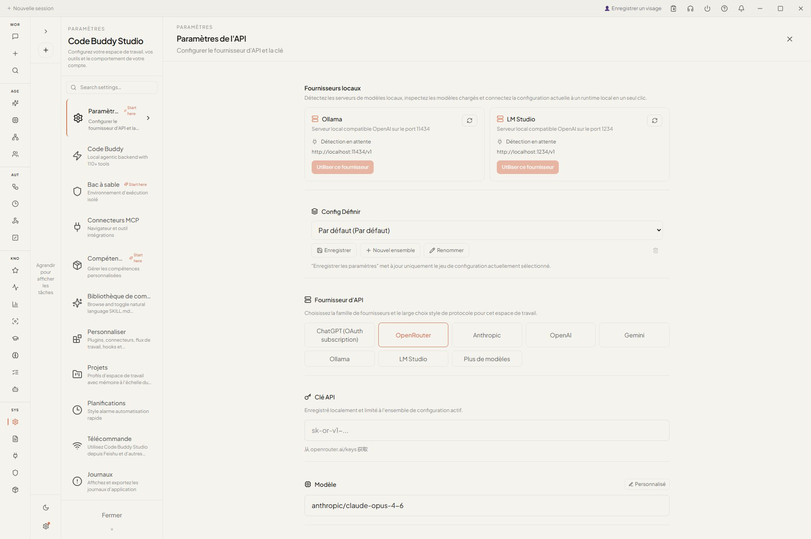

<p align="center">
  
</p>

<h1 align="center">🚀 Code Buddy Cowork — the desktop cockpit for Code Buddy</h1>

<p align="center">
  The Electron GUI for <a href="https://github.com/phuetz/code-buddy">Code Buddy</a>, running the <b>same embedded core engine</b> as the terminal CLI.
</p>

<p align="center">
  <a href="#features">Features</a> •
  <a href="#demo">Demo</a> •
  <a href="#install">Install</a> •
  <a href="#quick-start">Quick Start</a> •
  <a href="#core-engine">Core Engine</a> •
  <a href="#skills">Skills</a>
</p>

<p align="center">
  
  
  
  
</p>

---

## 📖 Introduction

**Cowork** is the desktop GUI for **[Code Buddy](https://github.com/phuetz/code-buddy)** — a multi-provider AI coding agent, multi-AI **fleet** hub, and personal companion. It is **not a separate product**: it runs the **same embedded Code Buddy core engine** as the CLI, so it inherits the full agentic loop (15 providers, ~110 tools, RAG tool selection, MCP routing, middlewares, memory, skills, model hot-swap) and adds a cockpit on top — chat + live traces, the Fleet, the Buddy Companion, autonomy, memory/reasoning, and settings.

Once Code Buddy is installed, launch it with `buddy gui` (alias `buddy desktop`).

> Integrated desktop overview & screenshot-privacy policy: [`docs/cowork.md`](../docs/cowork.md) · Architecture: [`ARCHITECTURE.md`](./ARCHITECTURE.md) · Linux dev loop: [`DEV-LINUX.md`](./DEV-LINUX.md) · Engine vs. legacy runner: [`RUNNER_AUDIT.md`](./RUNNER_AUDIT.md).

> [!WARNING]
> **Disclaimer**: Cowork is an AI agent that can read/write files and run commands. Exercise caution when authorizing modifications — use permission modes and the workspace sandbox.

---

<a id="features"></a>
## ✨ Key Features

- **Same engine as the CLI** — the embedded Code Buddy core: 15 providers (Grok, Claude, GPT, Gemini, **local Ollama**, LM Studio, Bedrock, Azure, Groq, Together, Fireworks, OpenRouter, vLLM, Copilot, Mistral), ~110 tools, MCP, skills, reasoning, memory.
- **Multi-AI Fleet** — Fleet Command Center, peer events, Agent Team, and an **Autonomy** panel that shows the autonomous fleet's live task queue (status / priority / claim / DAG deps / worklog).
- **Buddy Companion** — voice (STT/TTS), opt-in camera vision (MediaPipe face/hand/pose), presence, missions, routines, proactive check-ins.
- **Memory & Reasoning** — browse cross-session persistent memory and inspect Tree-of-Thought / MCTS reasoning traces.
- **Visual workflows** — DAG editor with approval gates and pause/resume.
- **MCP & Skills** — connect MCP servers (browser, Notion, …) and run/author Agent Skills (PPTX/DOCX/PDF/XLSX, workspace organization, …).
- **Real-time trace** — watch the agent's reasoning and tool execution as it runs.
- **Secure workspace** — operations confined to your chosen folder, plus optional VM isolation (WSL2 on Windows, Lima on macOS) for shell commands.

The left nav is grouped to mirror Code Buddy's areas: **Work · Agents & Fleet · Automation · Companion · Insights & Learning · System**.

<a id="demo"></a>
## 🎬 Demo

Real captures of **this** app (Code Buddy Cowork) — its actual panels, not borrowed/stock media:

<table>
  <tr>
    <td width="50%" align="center">
      <br/>
      <sub><b>Work surface</b> — chat + tools on the embedded Code Buddy core engine</sub>
    </td>
    <td width="50%" align="center">
      <br/>
      <sub><b>Fleet Command Center</b> — multi-AI peers (<code>peer.chat</code> / <code>peer.tool.invoke</code>)</sub>
    </td>
  </tr>
  <tr>
    <td align="center">
      <br/>
      <sub><b>Agent Team</b> — orchestrated multi-agent coordination</sub>
    </td>
    <td align="center">
      <br/>
      <sub><b>Autonomy</b> — autonomous task execution &amp; progress</sub>
    </td>
  </tr>
  <tr>
    <td align="center">
      <br/>
      <sub><b>Buddy Companion</b> — voice, vision, presence</sub>
    </td>
    <td align="center">
      <br/>
      <sub><b>Settings</b> — providers, sandbox, MCP, skills, permissions</sub>
    </td>
  </tr>
</table>

> [!NOTE]
> These are real screenshots of this Cowork build. To add moving demos, record your own screencasts and drop them here — first review every frame for account IDs, tokens, OAuth callback URLs, private paths, and notifications (see the [media privacy rules](../docs/cowork.md)); use reviewed crops or synthetic workspaces.

---

<a id="install"></a>
## 📦 Install

Cowork ships **inside the Code Buddy monorepo** — there is no separate download or app store listing. Install Code Buddy, then launch the GUI.

```bash
# 1. Get Code Buddy (Cowork needs Node.js >= 22; the root CLI supports >= 18)
git clone https://github.com/phuetz/code-buddy.git
cd code-buddy && npm install && npm run build && npm link   # exposes `buddy`

# 2. Build + launch the desktop app
buddy install-gui        # installs Electron + builds the Cowork bundle
buddy gui                # launch (alias: buddy desktop)

# Dev loop with live reload
npm run dev:gui          # Vite + Electron from source
```

- **Linux** (the primary dev target): see [`DEV-LINUX.md`](./DEV-LINUX.md) — build the renderer with `npx vite build` (~30 s) and boot Electron with `--no-sandbox --disable-gpu`.
- **macOS / Windows**: supported via Electron. `better-sqlite3` is a native module, rebuilt against Electron headers on `postinstall` (`npm run rebuild`).

---

<a id="quick-start"></a>
## 🚀 Quick Start

### 1. Choose a model
Cowork inherits Code Buddy's providers — cheapest paths first:

- **ChatGPT subscription** (no API key, `$0` marginal): `buddy login`, then use `gpt-5.5`.
- **Local & free**: run **Ollama** and pick a tool-capable model (`qwen3`, `devstral`, `mistral`). Set it in **Settings → API**, or `CODEBUDDY_PROVIDER=ollama`.
- **API key**: Grok / OpenAI / Anthropic / Gemini / OpenRouter / GLM / MiniMax / Kimi … — paste the key + base URL in **Settings → API**.

### 2. Configure
Open ⚙️ **Settings** (grouped into Essentials · Models & Cost · Tools & MCP · Skills & Plugins · Automation · Security & Workspace · Server & Diagnostics). Set your provider/model and pick a **workspace** folder the agent may work in.

### 3. Cowork
Enter a prompt — e.g. *"Read `financial_report.csv` in this folder and create a 5‑slide PowerPoint summary."* Watch the run in the trace panel; use the Stop button to cancel an active turn.

---

<a id="core-engine"></a>
## Core Engine Runner

Cowork runs on the embedded **Code Buddy core engine** by default — the same agentic loop as the terminal CLI, so it inherits the core middlewares, transcript repair, output sanitizer, MCP routing, skills reload, and model hot-swap.

- **Default path**: Auto mode uses the embedded engine when the built bundle is available.
- **Fallback path**: the legacy `pi-coding-agent` runner remains available when the engine bundle is missing or `CODEBUDDY_EMBEDDED=0` is set.
- **Visibility**: the titlebar runner badge shows engine vs. pi fallback. **Settings → Core engine** lets you choose Auto / Always on / Always off.
- **Active turns**: prompts are serialized per session by `SessionManager`. Stop cancels an active run; follow-up prompts queue intentionally.

See [`RUNNER_AUDIT.md`](./RUNNER_AUDIT.md) for the engine-vs-pi parity matrix and deprecation notes.

### 📝 Notes
1. **Network** — for tools like `WebSearch`, some proxy setups need a virtual network interface (TUN mode).
2. **Notion connector** — set the integration token **and** add the connection on a root page ([Notion docs](https://www.notion.com/help/add-and-manage-connections-with-the-api)).
3. **better-sqlite3** — rebuilt for Electron via `npm run rebuild` (runs on `postinstall`).

---

<a id="skills"></a>
## 🧰 Skills

Cowork bundles Agent Skills under `cowork/.claude/skills/`, and supports user-added/custom skills:

- `pptx` — PowerPoint generation
- `docx` — Word document processing
- `pdf` — PDF handling & forms
- `xlsx` — Excel spreadsheets
- `workspace-organizer` — safe folder organization & cleanup planning
- `skill-creator` — author your own skills

Code Buddy itself also ships a marketplace (`buddy hub`) and a project skill for driving the CLI (`.claude/skills/code-buddy/`).

---

## 🏗️ Architecture

Electron app (Node ≥ 22, Vite + React + better-sqlite3) wrapping the Code Buddy core engine. Main process bridges (IPC), a preload context bridge, and a React renderer (`src/renderer/`) with the nav rail (`ShellNavigation.tsx`), settings (`SettingsPanel.tsx`), and the Fleet / Companion / Memory / Reasoning / Autonomy panels. Full details — Electron contexts, bridges, embedded engine, persistence, runner model — in [`ARCHITECTURE.md`](./ARCHITECTURE.md).

---

## 🗺️ Roadmap

- [x] Embedded Code Buddy core engine (CLI parity)
- [x] Multi-AI Fleet + **Autonomy** panel
- [x] Buddy Companion (voice / vision / presence)
- [x] **Memory** + **Reasoning** panels
- [x] Skills (PPTX/DOCX/PDF/XLSX) + MCP connectors
- [x] Workspace sandbox (path guard; WSL2 / Lima VM isolation)
- [ ] Packaged installers (Linux AppImage · macOS `.dmg` · Windows `.exe`)
- [ ] Screen/window recording for real-time machine context (see Code Buddy roadmap)
