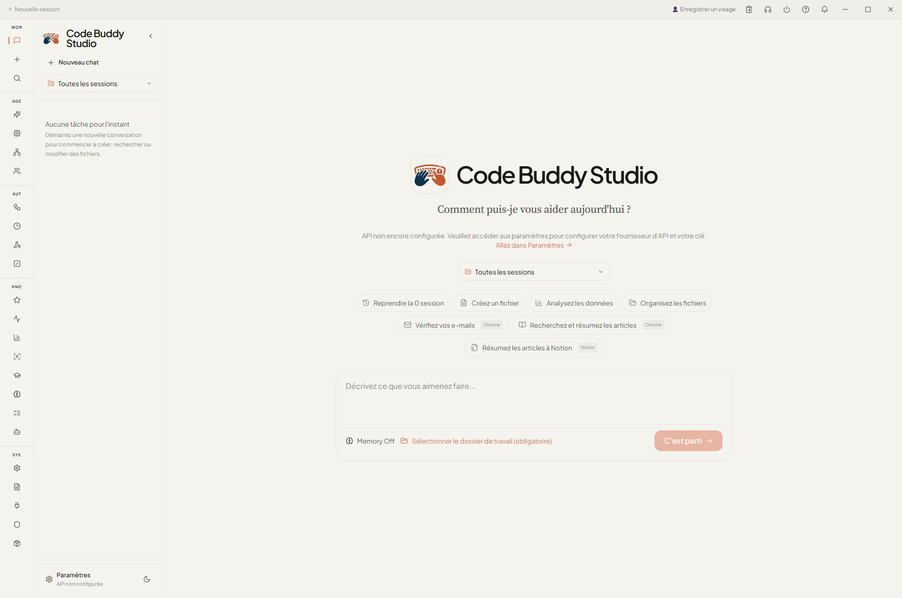
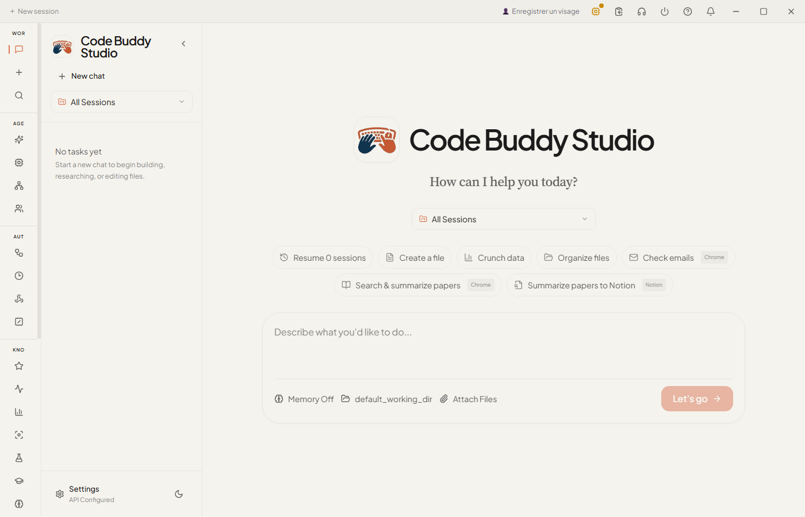
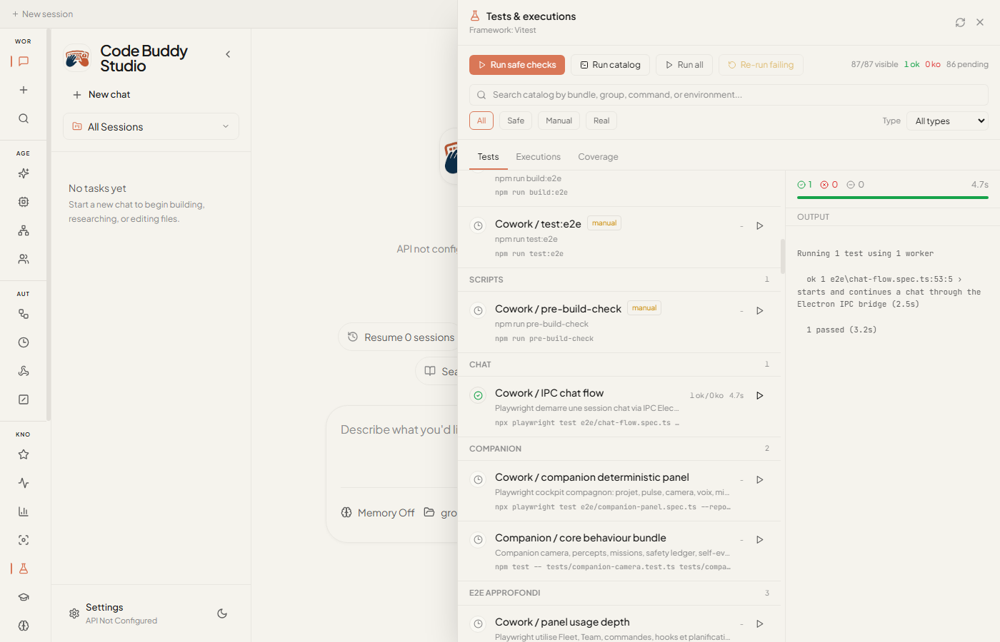
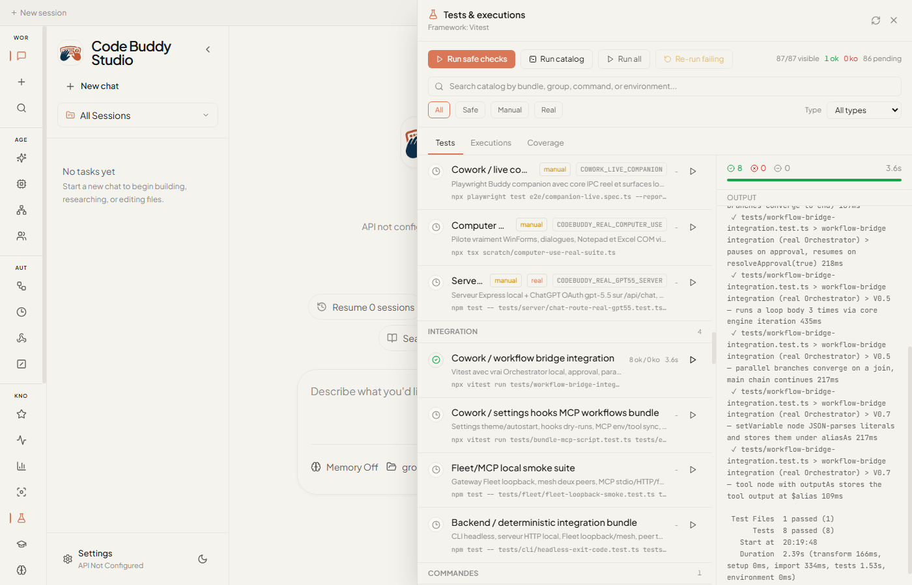
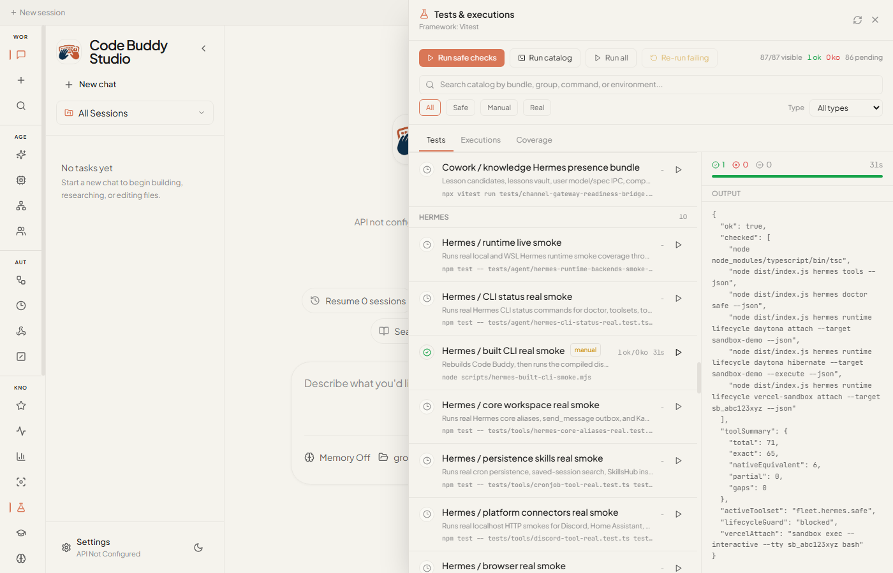
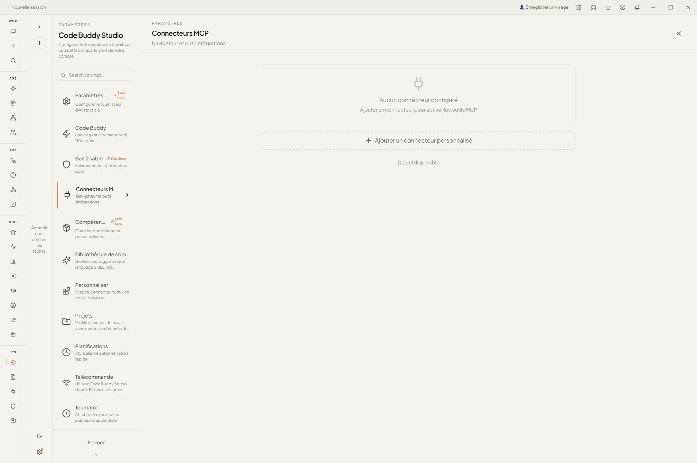
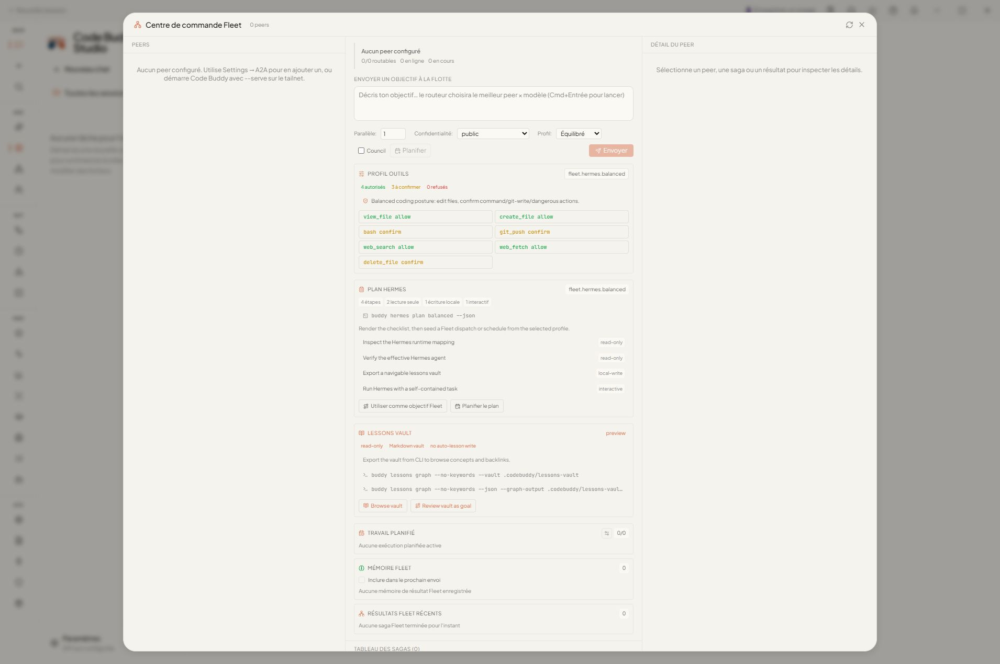
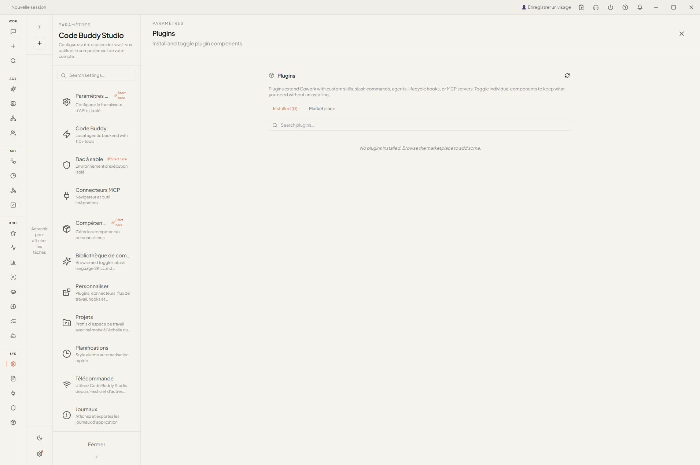

# Guide utilisateur Cowork

Cowork est le cockpit desktop de Code Buddy. Il regroupe le chat, les outils, les traces, les workflows, les réglages, les permissions, les connecteurs MCP, Fleet, le compagnon Buddy et la fenêtre **Tests & executions** dans une application Electron.

Chaque capture ci-dessous est un PNG local au dépôt. Les documents publics et les captures sont vérifiés par `tests/docs/public-screenshot-privacy.test.ts` pour éviter de publier des comptes, tokens ou chemins locaux privés.

## 1. Préparer Code Buddy

Depuis le dépôt source :

```bash
git clone https://github.com/phuetz/code-buddy.git
cd code-buddy
npm install
npm run build
```

Pour utiliser un abonnement ChatGPT Plus / Pro comme route modèle :

```bash
buddy login
buddy whoami
```

Pour les flux Cowork appuyés par le serveur local :

```bash
buddy server --port 3000
```

Cowork peut aussi utiliser les providers configurés par clé API dans Settings.

## 2. Lancer Cowork

Depuis le dépôt source :

```bash
npm run dev:gui
```

Le premier écran affiche la surface de travail. Sélectionne un workspace, puis démarre un chat ou ouvre les panneaux depuis la barre latérale.



Pour vérifier un package avant release, construis l'app desktop puis lance l'exécutable Windows `win-unpacked` généré via le smoke opt-in :

```bash
npm run build:gui
cd cowork
COWORK_PACKAGED_EXE="release/win-unpacked/Code Buddy Cowork.exe" npx playwright test e2e/packaged-launch-smoke.spec.ts --reporter=list --timeout=120000
```

Ce smoke vérifie que l'app est réellement packagée, utilise un profil `userData` isolé, attend le shell renderer, puis publie cette capture :



## 3. Configurer la route agent

Ouvre **Settings** pour choisir le provider, le modèle, le mode du moteur embarqué, l'URL backend, le comportement des permissions, les connecteurs MCP, les plugins et les quick prompts.


Pour la route ChatGPT OAuth, lance d'abord `buddy login`, puis choisis le profil ou modèle ChatGPT dans Cowork. Le run Electron réel ci-dessous force le profil ChatGPT et rend le marqueur `REAL-GPT55-COWORK-GUI`.


Pour les providers locaux ou personnalisés, utilise le panneau de configuration API pour tester les profils, config sets, diagnostics, Ollama, LM Studio, gateways loopback et retry avant de router un chat dessus. Le bundle local provider vérifié exerce ces chemins depuis le runner desktop avec `143 ok / 0 ko`.


## 4. Utiliser chat, fichiers et contexte workspace

Flux typique :

1. Sélectionner un dossier workspace.
2. Joindre des fichiers ou les déposer dans le champ de chat.
3. Demander une sortie concrète : rapport, changement de code, tableur, suite de tests.
4. Relire les appels d'outils et la trace avant d'accepter une action risquée.
5. Sauvegarder ou exporter les artefacts produits.

Cowork garde les opérations de fichiers dans le workspace sélectionné. Le moteur applique les mêmes protections que le CLI : réparation de transcript, sanitizer de sortie, routage MCP et changement de modèle à chaud.

La preuve runner ci-dessous démarre une session chat via IPC Electron, rend le premier message utilisateur, reçoit `OK-CHAT-IPC start`, continue la même session et vérifie `OK-CHAT-IPC continue` avec `1 ok / 0 ko`.



## 5. Travailler avec artefacts, documents et planifications

Les artefacts générés restent attachés à la conversation et peuvent être ouverts depuis les surfaces de prévisualisation ou d'atelier Cowork. Le bundle artefacts vérifié couvre la détection d'artefacts, les liens de fichiers, la progression d'atelier document, l'extraction de chemins depuis les sorties d'outils, la normalisation des citations et les états de messages prêts pour document.


Pour les suivis, utilise les surfaces de planification depuis Settings ou les commandes slash. Le bundle scheduling vérifié couvre les tâches ponctuelles et répétées, `runNow`, les créneaux daily/weekly, les titres de session, `/schedule` et les métadonnées de planification visibles dans Cowork.


## 6. Relire les permissions avant les actions risquées

Quand l'agent demande une opération sensible, Cowork affiche un dialogue de permission. Le flux E2E réel injecte une demande Bash, clique **Allow**, persiste une règle d'écriture à portée limitée, puis prouve que la fenêtre de tests peut rejouer ce scénario depuis l'application desktop.


Bonnes pratiques :

- Approuver une seule commande pour une action ponctuelle.
- Persister une règle de chemin seulement si le scope est volontaire.
- Garder l'automatisation desktop destructive en opt-in.
- Relancer les tests sûrs avant de publier un résultat.

## 7. Exécuter les vérifications réelles depuis le desktop

La fenêtre **Tests & executions** lance les bundles locaux sûrs et les checks réels opt-in. Elle affiche le statut, les compteurs, les badges d'environnement et l'historique d'exécution.


Lignes utiles :

| Ligne | Preuve |
| --- | --- |
| `Cowork / real GPT-5.5 chat` | Chat Electron réel via ChatGPT OAuth |
| `Server / real GPT-5.5 chat API` | Routes HTTP locales avec ChatGPT OAuth |
| `Cowork / permission real flow` | Prompt de permission réel et règle persistée |
| `MCP / real transport suite` | Fixtures MCP stdio/HTTP et garde fail-closed |
| `Computer Use / real desktop suite` | WinForms, dialogue, Notepad et Excel COM en opt-in |
| `Cowork / workflow bridge integration` | Exécution réelle du `Orchestrator` local depuis le runner desktop : branches parallèles, reprise approval, reset de boucle, join/convergence et sortie capturée sans codes ANSI visibles |
| `Hermes / built CLI real smoke` | Rebuild Code Buddy, vérifie tools/doctor Hermes, prouve le garde-fou lifecycle et documente l'attach Vercel Sandbox |
| `Mobile / supervision gateway bundle` | Routes pairing/status en loopback, file d'approbation et bridge Cowork |

Pour les vérifications quotidiennes, commence par les bundles sûrs. Ils ne demandent ni vrai token provider, ni Docker, ni opt-in d'automatisation desktop :

| Besoin | Ligne runner | Preuve |
| --- | --- | --- |
| Vérifier les plugins et skills réutilisables | `Plugins / skills bundle` | `755 ok / 0 ko`, [capture](./qa/code-buddy-studio/screenshots/80-test-runner-plugins-skills-bundle.png) |
| Vérifier l'UI terminal et l'observer | `UI / terminal observer bundle` | `376 ok / 0 ko`, [capture](./qa/code-buddy-studio/screenshots/81-test-runner-terminal-ui-observer-bundle.png) |
| Vérifier les sessions, la sync et les caches | `Data / session sync cache bundle` | `901 ok / 0 ko`, [capture](./qa/code-buddy-studio/screenshots/83-test-runner-data-session-sync-cache-bundle.png) |
| Vérifier la voix, le wake-word fallback et la TTS | `Voice / speech TTS bundle` | `164 ok / 0 ko`, [capture](./qa/code-buddy-studio/screenshots/87-test-runner-voice-speech-tts-bundle.png) |
| Vérifier les planifications, hooks, webhooks et notifications | `Automation / scheduler hooks notifications bundle` | `766 ok / 0 ko`, [capture](./qa/code-buddy-studio/screenshots/88-test-runner-scheduler-hooks-notifications-bundle.png) |
| Vérifier doctor, backup, settings et migrations | `Maintenance / doctor backup settings bundle` | `254 ok / 0 ko`, [capture](./qa/code-buddy-studio/screenshots/89-test-runner-maintenance-doctor-backup-settings-bundle.png) |

Le runner expose aussi le suivi des exécutions :


La ligne workflow bridge lance la suite d'intégration réelle depuis le runner desktop. Elle exerce le `Orchestrator` local, les branches parallèles, la pause/reprise approval, le reset d'un corps de boucle, le join/convergence, `setVariable` et `outputAs`, puis affiche `8 ok / 0 ko`.



La ligne Hermes reste manuelle car elle reconstruit le CLI compilé avant de l'exécuter. Elle prouve `hermes tools`, `hermes doctor safe`, le plan Daytona attach, le blocage Daytona et Vercel Sandbox de `--execute` sans allow flags et le mapping Vercel Sandbox attach.



La ligne supervision mobile vérifie la frontière local-operator avant de considérer un flux téléphone comme utilisable. Elle couvre les routes pairing/status limitées au loopback, le refus des en-têtes forwarder usurpés, l'approbation ou annulation des drafts de prompt, le client bridge mobile Cowork et le contrat de listener désactivé qui garde l'exécution off-device bloquée tant que TLS et l'auth ne sont pas configurés explicitement.


Quand un job Hermes research-script propose un candidat SKILL.md réutilisable, inspecte le candidat avant installation :

```bash
buddy tools skill-candidate inspect .codebuddy/skill-candidates/<candidate-dir>
```

La preuve de run réussi doit montrer un artefact local écrit : `outputStatus: written` et `outputVerified: true`. Un process qui sort proprement avec `outputStatus: placeholder` ou `outputStatus: missing` signifie que le run distant ou sandbox n'a pas encore rendu de preuve exploitable ; Cowork et le CLI refusent donc de le compter comme preuve répétable pour une promotion.

## 8. Étendre Cowork avec MCP, Fleet et Skills

Utilise **MCP Connectors** pour ajouter des outils externes et des transports locaux.



Utilise **Fleet Command Center** et les surfaces d'équipe quand plusieurs peers ou workflows doivent coopérer.



Utilise les surfaces **Skills** et plugins pour les documents, tableurs, présentations, automatisations navigateur et opérations métier réutilisables.



Pour l'apprentissage et les opérations Hermes, utilise les surfaces knowledge pour relire les lesson candidates avant qu'elles deviennent des leçons durables, parcourir le lessons vault, inspecter les plans/profils d'outils Hermes, relire les skill candidates et vérifier la readiness du modèle de présence local. Le bundle knowledge vérifié couvre ces chemins sans écrire silencieusement de mémoire ou de leçons.


## 9. Activer prudemment l'automatisation desktop

Les checks Computer Use sont opt-in car ils manipulent de vraies applications desktop. La suite validée pilote des contrôles Windows Forms, des dialogues, Notepad et Excel COM, puis affiche `1 ok / 0 ko` depuis le runner.


Avant d'utiliser Computer Use :

- Fermer les documents privés et onglets sensibles.
- Garder le workspace aussi étroit que possible.
- Préférer les lignes sûres du runner pour commencer.
- Ne publier que des captures caviardées ou sans information privée.

## 10. Publier des preuves sans fuite privée

Avant de publier de la documentation ou des captures :

```bash
npm run test:docs-public
```

Le dossier QA public commence dans [`qa/code-buddy-studio/`](./qa/code-buddy-studio/README.md). Son rapport complet conserve les preuves de commandes réelles pour ChatGPT OAuth, Cowork/Electron, routes serveur, MCP, Fleet, permissions, Docker, Computer Use, Hermes et compagnon Buddy.
