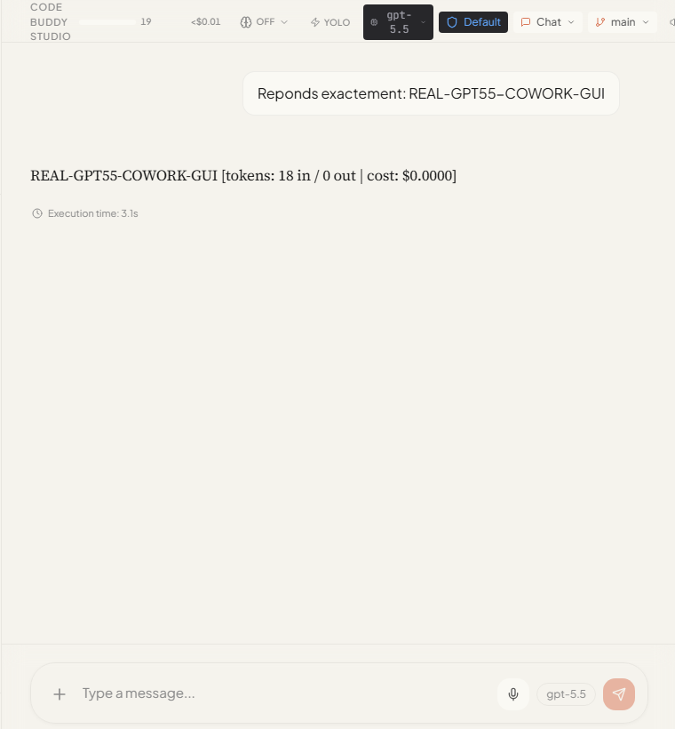

# Cowork Desktop

Cowork is the desktop cockpit for Code Buddy. It gives the same core agent a
visual workspace: chat, model configuration, tools, test execution, traces,
sessions, workflows, MCP connectors, skills, companion controls, and Hermes-style
learning surfaces are all reachable from one Electron app.

Use this page when you want to try Cowork from a GitHub checkout, validate the
ChatGPT subscription route, or explain what the desktop app adds beyond the CLI.

## What Cowork Adds

- A supervised desktop workspace for Code Buddy sessions and artifacts.
- A model and provider settings panel, including ChatGPT OAuth via `buddy login`.
- A built-in test runner that can launch safe local checks and explicit real
  provider checks from the GUI.
- A trace and execution view for agent work, tool calls, failures, and reruns.
- Visual workflow surfaces for Fleet, Hermes parity, skills, lessons, MCP, and
  companion features.
- A one-click Hermes local smoke card in the Fleet Command Center that verifies
  local runtime execution, local Playwright browser control, and local protocol
  gateways without exposing raw trace paths in the UI.
- A sandbox posture around project workspaces, with WSL2/Lima support where
  available and path restrictions in fallback mode.

Cowork is intentionally not a separate brain. It routes work through the Code
Buddy core engine, so CLI improvements, provider fixes, transcript repair,
sanitization, tools, memory, and Hermes features can surface in the GUI too.

## Quick Start From Source

From a fresh checkout:

```bash
npm install
npm run build
npm run dev:gui
```

For a production-like Electron validation without packaging the installer:

```bash
cd cowork
npm run build:e2e
npx playwright test e2e/cowork-smoke.spec.ts --reporter=list --workers=1
```

Cowork itself requires Node.js 22 or newer. The root CLI still supports Node.js
18 or newer.

## Visual Tour

These screenshots are public-safe captures from the QA workspace. They use
synthetic prompts, local fixtures, or redacted paths; raw real-provider
screenshots remain excluded until the capture-review pass is complete.

### Start A Session

The home work surface is the default place to pick a workspace, start a new
chat, resume a session, or use a quick prompt.


### Run Verification From The GUI

Open `Tests & executions` from the left navigation to run typecheck, lint,
unit tests, E2E checks, real-provider opt-in checks, and Hermes smoke bundles.
The panel separates safe, manual, and real checks so public docs can cite
exactly which proof was run.


### Check Hermes From Cowork

Hermes rows in the test runner rebuild the CLI, run real local smoke checks,
and show reproducible command output without printing private checkout paths.


### Review Tool Permissions

Permission dialogs show the requested tool, input, scoped rule suggestion, and
allow/deny choices before a command is approved. This is the normal supervised
path for shell, file, and computer-use operations.


## ChatGPT Subscription Route

Code Buddy can use a ChatGPT Plus / Pro login as a flat-fee backend for
`gpt-5.5`:

```bash
buddy login
buddy whoami
```

After login, Cowork can be configured to use:

- provider: `chatgpt`
- base URL: `https://chatgpt.com/backend-api/codex`
- model: `gpt-5.5`
- API key placeholder: `oauth-chatgpt`

The GUI configuration panel writes this profile for normal use. The Playwright
real-provider smoke tests also configure the same profile inside an isolated
Electron user-data directory, so the test does not depend on or expose a normal
Cowork profile.

## Real Validation

Latest local validation in this branch: 2026-06-01, Europe/Paris.

The checks below were run in PowerShell against the real ChatGPT OAuth backend
with `gpt-5.5`. The account email and account id from `buddy whoami` were
intentionally not copied into this document.

```powershell
npx tsx src/index.ts whoami

Push-Location cowork
npm run build:e2e
$env:COWORK_REAL_GPT55='1'
npx playwright test e2e/chat-real-gpt55.spec.ts --reporter=list --timeout=240000
npx playwright test e2e/test-runner-cowork-real-gpt55.spec.ts --reporter=list --timeout=360000
Pop-Location

$env:CODEBUDDY_REAL_GPT55_SERVER='1'; npm test -- tests/server/chat-route-real-gpt55.test.ts --run

Push-Location cowork
$env:CODEBUDDY_REAL_GPT55_SERVER='1'
npx playwright test e2e/test-runner-server-real-gpt55.spec.ts --reporter=list --timeout=420000
Pop-Location
```

Result:

- ChatGPT OAuth status: connected, paid plan detected, private identifiers
  redacted from public docs.
- Cowork E2E build: passed, with the existing Vite chunk-size and mixed dynamic
  import warnings.
- Direct Cowork chat through ChatGPT `gpt-5.5`: passed.
- Cowork `Tests & executions` launching the real Cowork `gpt-5.5` chat smoke:
  passed.
- Code Buddy HTTP server routes (`/api/chat`, SSE, OpenAI-compatible
  completions, model listing) through real ChatGPT `gpt-5.5`: passed.
- Cowork `Tests & executions` launching the real server `gpt-5.5` smoke: passed.

Public-safe real-provider proof screenshots:




No functional bug was found in this pass. The only fix made here is a
documentation visibility fix: GitHub links now point at the actual lower-case
`cowork/readme.md` path.

### Hermes Local Smoke In Cowork

The Fleet Command Center includes a `Hermes local smoke` card. Use its play
button when you want a quick local proof before claiming Hermes substrate
health from the desktop UI.

Equivalent CLI proof:

```powershell
npx tsx src/index.ts hermes smoke --json
```

Latest real local proof on this branch:

- runtime: passed (`OK-HERMES-LOCAL`)
- browser: passed (`OK-HERMES-BROWSER` through local Playwright)
- protocols: passed (MCP stdio echo plus 4 local HTTP A2A/ACP routes)

The Cowork card intentionally renders status and counts, not full stdout or
Playwright trace paths. Dedicated runtime/browser/protocol cards remain
available when an operator needs deeper detail.

### Public-Safe Hermes Status Panels

Several Cowork Fleet cockpit strips reuse the same Hermes status payloads as
the CLI. These payloads are designed for screenshots and GitHub issue comments:
they expose commands, counts, and relative workspace paths, but not the local
home directory, absolute checkout path, or raw Playwright trace path.

Useful CLI equivalents:

```powershell
npx tsx src/index.ts hermes learning status --json
npx tsx src/index.ts hermes skills status --json
npx tsx src/index.ts hermes status safe --json
npx tsx src/index.ts hermes browser status --json
npx tsx src/index.ts hermes runtime status --json
```

Latest local privacy proof on this branch:

- sampled Hermes status JSON outputs did not contain the local user profile path
  or the absolute repository checkout path.
- `hermes learning status --json` reports `[workspace]` and `[codebuddy-runs]`
  labels instead of absolute paths.
- `hermes learning status --json` and `hermes skills status --json` report `.codebuddy/...` relative paths for
  skill caches, lockfiles, roots, candidate review commands, and candidate
  action metadata. Candidate samples expose `candidatePath`, `reviewManifestPath`,
  `inspectCommand`, and eligible `installCommand` templates without printing
  SKILL.md bodies.
- `hermes status safe --json` keeps the overview compact by exposing only the
  next skill candidate action in `readiness.skills.nextCandidate`, using the
  same relative path and copy-paste command fields.
- Cowork's Fleet skill-candidate strip loads the full review queue, including
  not-yet-eligible candidates, but keeps install controls hidden until the
  candidate is eligible and a reviewer identity is provided.

## Screenshot And Privacy Policy

Real Cowork tests can write Playwright screenshots under
`docs/qa/code-buddy-studio/screenshots/`. Treat those files as QA evidence first,
not public marketing assets.

Before committing or publishing a screenshot:

1. Use a synthetic workspace with no customer code, no private repositories, and
   no personal files.
2. Check for account email, account id, local home directory, access tokens,
   session names, browser tabs, terminal history, and notifications.
3. Crop or redact paths and identity details.
4. Prefer marker prompts such as `REAL-GPT55-COWORK-GUI` over natural private
   prompts.
5. Keep full-page screenshots out of the public README unless they have been
   manually reviewed.

This page deliberately embeds only screenshots that have passed a manual public
review. Fresh screenshots from a private workstation should stay as QA evidence
until they pass the same manual privacy review.

## Useful Entry Points

- [Cowork source README](../cowork/readme.md)
- [Cowork architecture](../cowork/ARCHITECTURE.md)
- [Cowork pilotability matrix](cowork-pilotability-matrix.md)
- [Hermes / Cowork / CLI improvement log](hermes-cowork-cli-improvement-plan.md)
- [Full QA ledger](qa/code-buddy-studio/feature-qa.md)

## Troubleshooting

- If ChatGPT checks skip, set `COWORK_REAL_GPT55=1` or
  `CODEBUDDY_REAL_GPT55_SERVER=1` explicitly.
- If `whoami` is not connected, rerun `buddy login`.
- If Electron cannot start, rerun `cd cowork && npm run build:e2e` and verify
  Node.js 22 or newer is active in the Cowork package.
- If screenshots are generated during testing, review them before staging.
