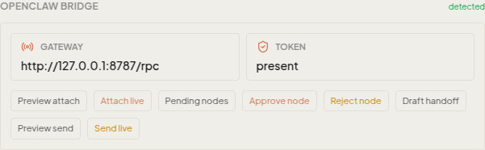

# Cowork Desktop

Cowork is the desktop cockpit for Code Buddy. It gives the same core agent a
visual workspace: chat, model configuration, tools, test execution, traces,
sessions, workflows, MCP connectors, skills, companion controls, and Hermes-style
learning surfaces are all reachable from one Electron app.

The [Continuity Fabric](cowork-continuity-fabric.md) adds session-scoped
profiles/models, capability-scoped remote supervision, a universal proof-aware
preview rail, voice latency instrumentation, and portable signed profiles.

The [Flow Studio](flow-studio.md) adds reusable visual ingredients, keyframes,
parallel variants and a Scenebuilder over Cowork's existing image/video engines.

[Human-approved Project evolution](project-evolution.md) turns reusable session
decisions into persistent master-instruction or knowledge-file proposals. It is
local and deterministic by default, shows an exact before/after review, and
blocks stale approvals before any Project context is changed.

[Workflow supervision and AgentBase](workflow-supervision-agentbase.md) adds a
production-compiler dry-run, persisted run history/comparison/replay and guided
failure diagnosis, plus one honest control plane over installed MCP connectors,
OAuth presence, scoped permissions, status and audit.

[Meeting Live](meeting-live.md) records the local microphone only after an
explicit participant-consent confirmation, persists crash-recoverable audio
checkpoints, and finalizes them through local Whisper and the deterministic
Meeting Notes pipeline.

Use this page when you want to try Cowork from a GitHub checkout, validate the
ChatGPT subscription route, or explain what the desktop app adds beyond the CLI.

> 📚 **Full Cowork documentation set** (architecture, every panel, visual workflows,
> build/run, settings, troubleshooting): [`docs/cowork/`](cowork/README.md).

## What Cowork Adds

- A supervised desktop workspace for Code Buddy sessions and artifacts.
- A model and provider settings panel, including ChatGPT OAuth via `buddy login`.
- A built-in test runner that can launch safe local checks and explicit real
  provider checks from the GUI.
- A trace and execution view for agent work, tool calls, failures, and reruns.
- A **Living Briefing** on the calm Home surface: the latest evidence-backed
  autonomy handover, its costs and operator decisions, a safe next intention,
  and one-click Pocket TTS playback. When no Night Watch artifact exists,
  Cowork falls back to recent sessions/activity without inventing progress.
- An autonomous coding progress card in `Tests & executions -> Executions`,
  backed by the core `RunStore` and `workflow-progress.json` artifacts.
- Visual workflow surfaces for Fleet, Hermes parity, skills, lessons, MCP, and
  companion features.
- Persisted workflow supervision with compiler-faithful dry-runs, replay,
  comparison and non-executing failure guidance.
- A local AgentBase connector control plane where catalog availability remains
  distinct from a real connection and external actions require fresh approval.
- A local Meeting Live recorder with atomic checkpoints, explicit consent,
  restart recovery and private Markdown/JSON meeting reports.
- A one-click Hermes local smoke card in the Fleet Command Center that verifies
  local runtime execution, local Playwright browser control, and local protocol
  gateways without exposing raw trace paths in the UI.
- A sandbox posture around project workspaces, with WSL2/Lima support where
  available and path restrictions in fallback mode.

Cowork is intentionally not a separate brain. It routes work through the Code
Buddy core engine, so CLI improvements, provider fixes, transcript repair,
sanitization, tools, memory, and Hermes features can surface in the GUI too.

## Quick Start From Source

From a fresh checkout:

```bash
npm install
npm run build
npm run dev:gui
```

For a production-like Electron validation without packaging the installer:

```bash
cd cowork
npm run build:e2e
npx playwright test e2e/cowork-smoke.spec.ts --reporter=list --workers=1
```

Cowork itself requires Node.js 22 or newer. The root CLI still supports Node.js
18 or newer.

## Visual Tour

These screenshots are public-safe captures from the QA workspace. They use
synthetic prompts, local fixtures, or redacted paths; raw real-provider
screenshots remain excluded until the capture-review pass is complete.

### Start A Session

The home work surface is the default place to pick a workspace, start a new
chat, resume a session, or use a quick prompt.


### Run Verification From The GUI

Open `Tests & executions` from the left navigation to run typecheck, lint,
unit tests, E2E checks, real-provider opt-in checks, and Hermes smoke bundles.
The panel separates safe, manual, and real checks so public docs can cite
exactly which proof was run.


### Follow Autonomous Work

Autonomous coding runs created by `buddy autonomous-code` are persisted in the
core observability store. Cowork reads those runs from the same store and shows
the status, completed workflow nodes, active node, approval state, and next
action in the Executions tab.


Reproduction and privacy rules: [Autonomous Coding And Cowork Progress](autonomous-coding-cowork-progress.md).

The Home view also discovers the daemon-owned
`~/.codebuddy/fleet/briefings/latest.json` artifact. Its **Living Briefing**
shows the proven overnight results, retained improvements, paid-model count,
attention points and safest next opportunity. The adjacent report action opens
`latest.md`; the voice action reads only the compact synthesis through the
existing local TTS route.

### Keep Talking While A Mission Runs

The voice overlay distinguishes a direct conversational turn from a durable
background mission. A deterministic local classifier can recommend mission
mode for deep research, multi-step work, or a deliverable, but it never selects
the mode by itself: the user must click **Mission en arrière-plan** before
sending.

The request is persisted first in the existing Mission Orchestrator under
`~/.codebuddy/missions/`. Cowork then starts one normal background session,
acknowledges the delegation through local TTS, waits for playback to finish,
and reopens the microphone. The overlay shows restored and live missions as
`queued`, `running`, `completed`, or `failed`, including progress, explicit
cancellation, and a link to the terminal result session.

The launch handshake is persisted before the IPC acknowledgement. On restart,
Cowork reconciles the mission with its background SessionManager session:
queued/running work resumes its truthful state, completed/failed work settles,
and a missing session fails visibly instead of remaining queued forever.

A voice barge-in only interrupts the foreground speech/turn; it does not cancel
the background mission. Cancellation requires the mission's dedicated stop
button and id. Delegation is also not consent for an external side effect:
sending, publishing, buying, calling, booking, or mutating a remote service
continues to require the existing explicit confirmation gate.

### Review And Run Browser Operator

The agent tool `browser_operator` now feeds a real Cowork runtime rather than
only printing a plan. The overlay first receives the structured draft, then
the main process compiles the exact executable actions against the active
Project workspace and returns a SHA-256 receipt. Preparing does not navigate.
The user must review the URL and every action, tick the review box, and approve
that exact hash before the browser starts.

Interactive steps prompt again immediately before acting, even when Cowork is
configured to auto-approve ordinary local file or shell work. The conservative
effect policy blocks plans whose text identifies purchases, messages,
publications, bookings or destructive/account-changing actions. Immediately
before every interaction, a second local semantic preflight combines the
effective URL with the exact target's visible text, ARIA name, labels, bounded
neighborhood, link and enclosing form action. It therefore catches neutral
buttons such as `Continue` or `OK` inside payment, message or deletion flows.
Only this bounded inspection result is classified in the main process; the DOM
is not sent to another model. Read actions are `read`, ordinary inspected
interactions are `low`, and sensitive effects remain blocked until an
effect-specific approval receipt exists. The ordinary browser confirmation can
never serve as that receipt. If a mutating target cannot be inspected locally,
execution fails closed before confirmation or page interaction. STOP interrupts
the owned Stagehand browser, while screenshots and the final redacted proof
remain under the workspace with private permissions.

`isolated` uses a separate headless browser. `local` opens a visible Code Buddy
browser with a private persistent profile (`~/.codebuddy/browser-operator-profile`,
overridable with `CODEBUDDY_BROWSER_OPERATOR_PROFILE_DIR`). A sign-in performed
inside that window survives later runs. It does **not** attach to unrelated
Chrome/Edge tabs from the user's personal profile; this avoids silently
broadening the approved scope or corrupting a profile already locked by Chrome.
Code Buddy places a private ownership marker in a new empty profile directory
and refuses any non-empty directory without that marker. Consequently, the
environment override must never name an existing Chrome/Edge profile. A
cross-process lease remains held from browser startup through Stagehand shutdown;
concurrent local runs fail closed, while a dead process lock is recovered from
its PID/host identity or expired heartbeat. Older unmarked Code Buddy profile
directories must be moved aside (or recreated empty) once so they can be marked
safely; Code Buddy deliberately does not guess that an existing profile is its
own.
The previous overlay webview was removed because it showed another page
instance rather than the page actually being controlled.

### Bridge OpenClaw Safely

The Companion panel includes an `OpenClaw bridge` section for optional
external-channel interoperability. It shows secret-safe discovery status,
dry-run preview actions, handoff draft creation, and separately confirmed live
attach/send buttons.



### Check Hermes From Cowork

Hermes rows in the test runner rebuild the CLI, run real local smoke checks,
and show reproducible command output without printing private checkout paths.


### Review Tool Permissions

Permission dialogs show the requested tool, input, scoped rule suggestion, and
allow/deny choices before a command is approved. This is the normal supervised
path for shell, file, and computer-use operations.


## ChatGPT Subscription Route

Code Buddy can use a ChatGPT Plus / Pro login as a flat-fee backend for
`gpt-5.6-sol`:

```bash
buddy login
buddy whoami
```

After login, Cowork can be configured to use:

- provider: `chatgpt`
- base URL: `https://chatgpt.com/backend-api/codex`
- model: `gpt-5.6-sol`
- API key placeholder: `oauth-chatgpt`

The GUI configuration panel writes this profile for normal use. The Playwright
real-provider smoke tests also configure the same profile inside an isolated
Electron user-data directory, so the test does not depend on or expose a normal
Cowork profile.

## Real Validation

Latest local validation in this branch: 2026-06-01, Europe/Paris.

The checks below were run in PowerShell against the real ChatGPT OAuth backend
with `gpt-5.5`. The account email and account id from `buddy whoami` were
intentionally not copied into this document.

```powershell
npx tsx src/index.ts whoami

Push-Location cowork
npm run build:e2e
$env:COWORK_REAL_GPT55='1'
npx playwright test e2e/chat-real-gpt55.spec.ts --reporter=list --timeout=240000
npx playwright test e2e/test-runner-cowork-real-gpt55.spec.ts --reporter=list --timeout=360000
Pop-Location

$env:CODEBUDDY_REAL_GPT55_SERVER='1'; npm test -- tests/server/chat-route-real-gpt55.test.ts --run

Push-Location cowork
$env:CODEBUDDY_REAL_GPT55_SERVER='1'
npx playwright test e2e/test-runner-server-real-gpt55.spec.ts --reporter=list --timeout=420000
Pop-Location
```

Result:

- ChatGPT OAuth status: connected, paid plan detected, private identifiers
  redacted from public docs.
- Cowork E2E build: passed, with the existing Vite chunk-size and mixed dynamic
  import warnings.
- Direct Cowork chat through ChatGPT `gpt-5.5`: passed.
- Cowork `Tests & executions` launching the real Cowork `gpt-5.5` chat smoke:
  passed.
- Code Buddy HTTP server routes (`/api/chat`, SSE, OpenAI-compatible
  completions, model listing) through real ChatGPT `gpt-5.5`: passed.
- Cowork `Tests & executions` launching the real server `gpt-5.5` smoke: passed.

Public-safe real-provider proof screenshots:


### Publication Hardening

This documentation pass found no Cowork runtime regression, but it did harden
the public evidence trail:

- GitHub entry links now point at the actual lower-case `cowork/readme.md`
  path.
- Real-provider proof screenshots use reviewed `public-*` crops; raw GPT-5.5
  captures were removed from the tracked tree and ignored locally.
- The GPT-5.5 Playwright producers now write cropped `public-*` targets by
  default, so future opt-in replays do not regenerate publishable full-page
  screenshots.
- Public Cowork QA Markdown and HTML links are checked so the GitHub-facing
  docs do not point at untracked `scratch/` artifacts.

### Hermes Local Smoke In Cowork

The Fleet Command Center includes a `Hermes local smoke` card. Use its play
button when you want a quick local proof before claiming Hermes substrate
health from the desktop UI.

Equivalent CLI proof:

```powershell
npx tsx src/index.ts hermes smoke --json
```

Latest real local proof on this branch:

- runtime: passed (`OK-HERMES-LOCAL`)
- browser: passed (`OK-HERMES-BROWSER` through local Playwright)
- protocols: passed (MCP stdio echo plus 4 local HTTP A2A/ACP routes)

The Cowork card intentionally renders status and counts, not full stdout or
Playwright trace paths. Dedicated runtime/browser/protocol cards remain
available when an operator needs deeper detail.

### Public-Safe Hermes Status Panels

Several Cowork Fleet cockpit strips reuse the same Hermes status payloads as
the CLI. These payloads are designed for screenshots and GitHub issue comments:
they expose commands, counts, and relative workspace paths, but not the local
home directory, absolute checkout path, or raw Playwright trace path.

Useful CLI equivalents:

```powershell
npx tsx src/index.ts hermes learning status --json
npx tsx src/index.ts hermes skills status --json
npx tsx src/index.ts hermes status safe --json
npx tsx src/index.ts hermes browser status --json
npx tsx src/index.ts hermes runtime status --json
```

Latest local privacy proof on this branch:

- sampled Hermes status JSON outputs did not contain the local user profile path
  or the absolute repository checkout path.
- `hermes learning status --json` reports `[workspace]` and `[codebuddy-runs]`
  labels instead of absolute paths.
- `hermes learning status --json` and `hermes skills status --json` report `.codebuddy/...` relative paths for
  skill caches, lockfiles, roots, candidate review commands, and candidate
  action metadata. Candidate samples expose `candidatePath`, `reviewManifestPath`,
  `inspectCommand`, and eligible `installCommand` templates without printing
  SKILL.md bodies.
- `hermes status safe --json` keeps the overview compact by exposing only the
  next skill candidate action in `readiness.skills.nextCandidate`, using the
  same relative path and copy-paste command fields.
- Cowork's Fleet skill-candidate strip loads the full review queue, including
  not-yet-eligible candidates, but keeps install controls hidden until the
  candidate is eligible and a reviewer identity is provided.

## Screenshot And Video Privacy Policy

Real Cowork tests can write Playwright screenshots under
`docs/qa/code-buddy-studio/screenshots/`, and the GitHub README can embed public
demo videos through `user-attachments` URLs. Treat screenshots and videos as QA
evidence first, not public marketing assets.

Before committing or publishing a screenshot or video:

1. Use a synthetic workspace with no customer code, no private repositories, and
   no personal files.
2. Check for account email, account id, local home directory, access tokens,
   OAuth callback URLs, session names, browser tabs, terminal history, and
   notifications.
3. Crop or redact paths and identity details.
4. Prefer marker prompts such as `REAL-GPT55-COWORK-GUI` over natural private
   prompts.
5. Keep full-page screenshots and raw private recordings out of the public
   README unless they have been manually reviewed.

This page deliberately embeds only screenshots that have passed a manual public
review. Fresh screenshots or videos from a private workstation should stay as QA
evidence until they pass the same manual privacy review.

Current reviewed GitHub user-attachments demo videos:

- Folder organization and cleanup, backed by the built-in
  `workspace-organizer` skill.
- PPT generation from source files.
- XLSX spreadsheet generation.
- GUI operation / computer-use demonstration.
- Feishu/Lark remote-control demonstration.

Current reviewed OpenClaw bridge screenshot:
`docs/qa/code-buddy-studio/screenshots/111-companion-openclaw-bridge.png`.
It is a cropped Playwright fixture capture with a synthetic workspace, local
loopback endpoint, and no gateway token value.

## Useful Entry Points

- [Cowork source README](../cowork/readme.md)
- [Cowork architecture](../cowork/ARCHITECTURE.md)
- [Application validation guide](application-validation-guide.md)
- [Autonomous coding + Cowork progress](autonomous-coding-cowork-progress.md)
- [Cowork pilotability matrix](archive/internal/cowork-pilotability-matrix.md)
- [Hermes / Cowork / CLI improvement log](archive/internal/hermes-cowork-cli-improvement-plan.md)
- [Full QA ledger](qa/code-buddy-studio/feature-qa.md)

## Troubleshooting

- If ChatGPT checks skip, set `COWORK_REAL_GPT55=1` or
  `CODEBUDDY_REAL_GPT55_SERVER=1` explicitly.
- If `whoami` is not connected, rerun `buddy login`.
- If Electron cannot start, rerun `cd cowork && npm run build:e2e` and verify
  Node.js 22 or newer is active in the Cowork package.
- If screenshots are generated during testing, review them before staging.
