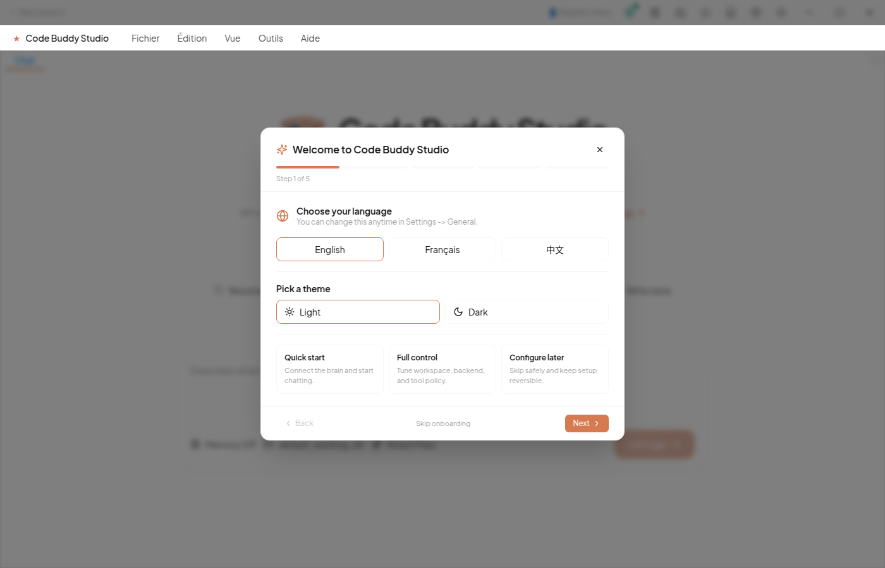
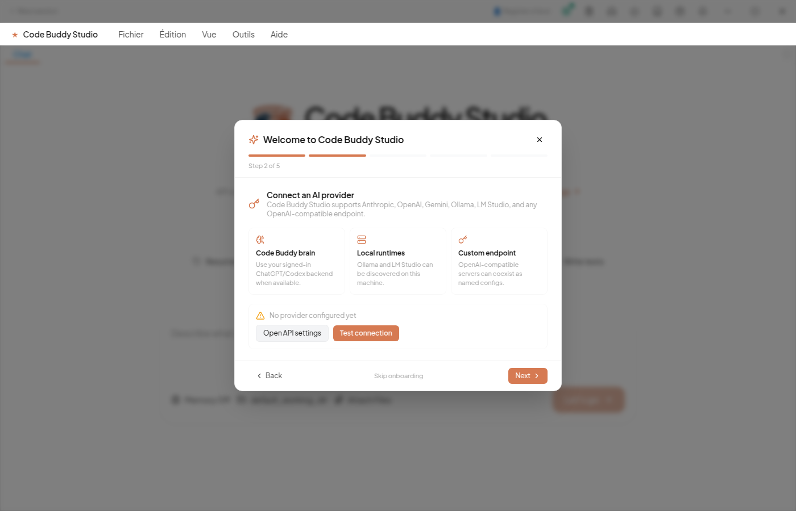
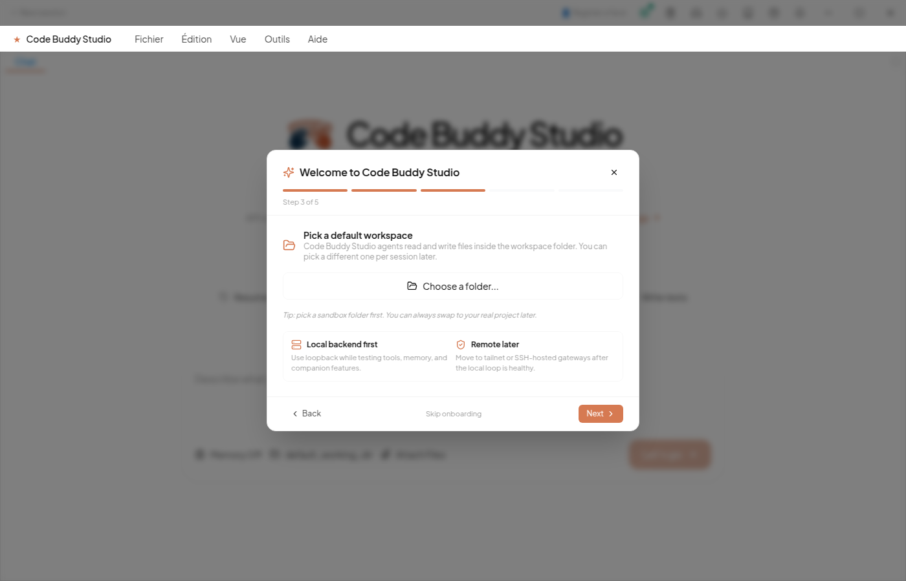
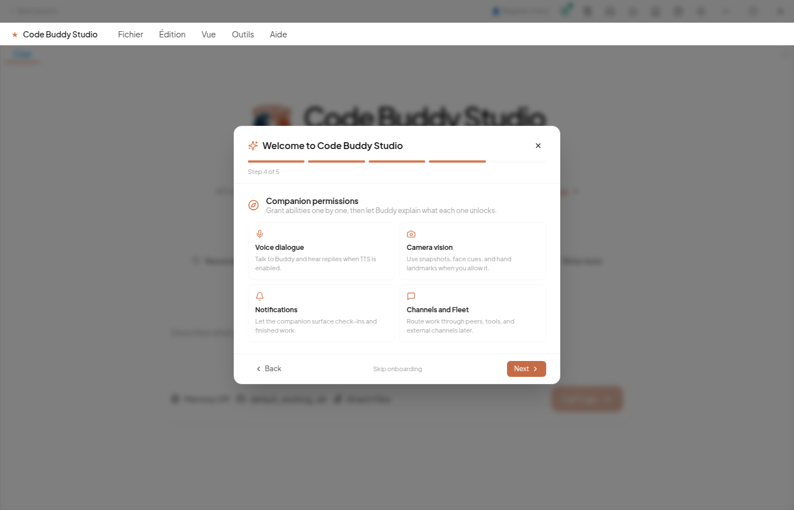
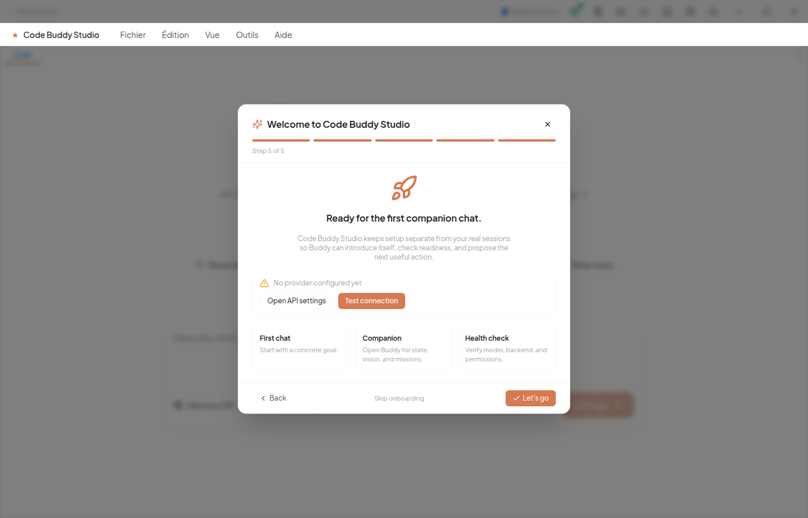
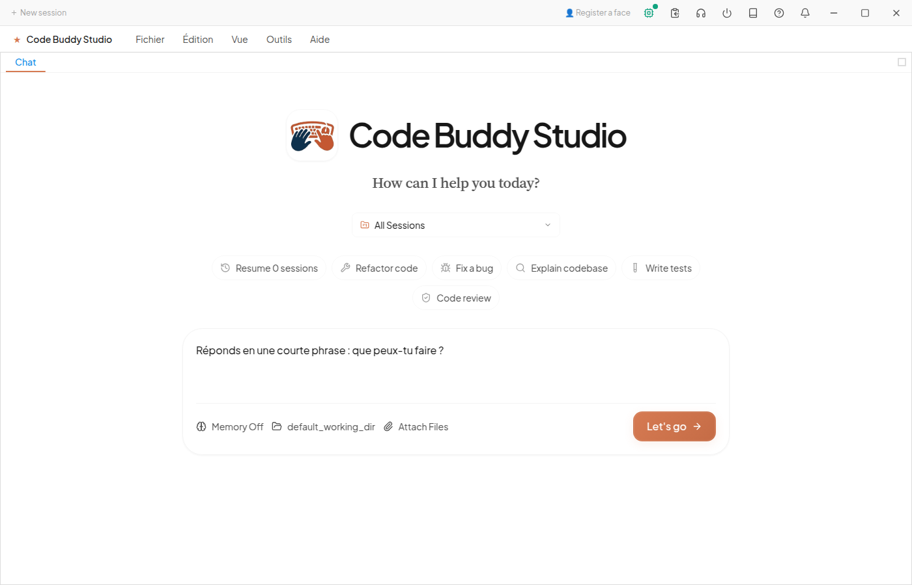
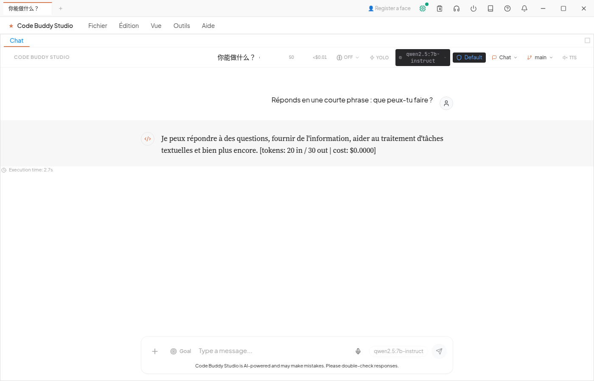

# Getting Started

## Prerequisites

- **Node.js** 18.0.0 or higher
- **ripgrep** (recommended for faster search)
- **Docker** (optional, required for CodeAct/sandbox execution)

```bash
# macOS
brew install ripgrep

# Ubuntu/Debian
sudo apt-get install ripgrep

# Windows
choco install ripgrep
```

## Installation

```bash
# From source (recommended during the 1.0 release-candidate phase — gets the latest)
git clone https://github.com/phuetz/code-buddy.git
cd code-buddy
npm install
npm run build
npm link            # exposes `buddy` globally (or use: npm start / node dist/index.js)

# npm — published stable release
# NOTE: during the rc phase the npm release can lag the source; prefer from-source for newest features
npm install -g @phuetz/code-buddy

# Or try without installing (also subject to the lag note above)
npx @phuetz/code-buddy@latest
```

## First Run

```bash
# Set your API key (Grok/xAI is the default provider)
export GROK_API_KEY=your_api_key

# Start interactive mode
buddy

# Or with a specific task
buddy --prompt "analyze the codebase structure"

# Use a local LLM (LM Studio)
buddy --base-url http://localhost:1234/v1 --api-key lm-studio

# Use Ollama
buddy --base-url http://localhost:11434/v1 --model llama3

# Full autonomy mode
buddy --yolo
```

Code Buddy auto-detects your provider from the API key environment variables. Set any of `GROK_API_KEY`, `ANTHROPIC_API_KEY`, `OPENAI_API_KEY`, `GOOGLE_API_KEY`, `MISTRAL_API_KEY`, etc.

## Onboarding the Cowork GUI (Ollama, $0)

Code Buddy also ships a desktop GUI — **Cowork** (`npm run build:gui`). On first launch a guided
wizard takes you from zero to your first chat. Here is the full journey against a **local Ollama**
model (`qwen2.5:7b-instruct`) — no API key, $0. *(Screenshots are real captures from the
Electron app, generated by `cowork/e2e/onboarding-ollama-screens.spec.ts`.)*

1. **Welcome.** Pick your language and a setup path.

   

2. **Connect an AI provider.** Choose a brain — *Code Buddy brain* (your signed-in ChatGPT/Codex
   backend), *Local runtimes* (Ollama / LM Studio, discovered on this machine), or a *Custom
   endpoint*. The connection panel verifies reachability with **Test connection** — the same live
   probe as Settings → API.

   

3. **Pick a workspace.** The folder Code Buddy agents read and write in (changeable per session later).

   

4. **Capabilities.** Opt into the companion features you want (voice, camera, notifications, channels).

   

5. **Ready.** Setup is kept separate from your real sessions, so Buddy can introduce itself and
   propose the next useful action.

   

6. **First prompt.** Type a request in the welcome composer.

   

7. **First response — real, local, $0.** The reply streams back from `qwen2.5:7b-instruct` running
   on local Ollama (here: 33 output tokens, ~6 s, cost **$0.0000**).

   

> The CLI has the same guided flow: run `buddy onboard`. It probes `/v1/models`, lists the real
> models your endpoint serves, and verifies the key before saving (see **First Run** above).

## Headless Mode (CI / Scripting)

```bash
# Single prompt, JSON output to stdout
buddy -p "create a hello world Express app" --output-format json > result.json

# Pipe into other tools
buddy -p "explain this code" --output-format json 2>/dev/null | jq '.result'

# CI with full autonomy
buddy -p "run tests and fix failures" \
  --dangerously-skip-permissions \
  --output-format json \
  --max-tool-rounds 30

# Auto-approve all tool executions
buddy -p "fix lint errors" --auto-approve --output-format text
```

Headless mode exits cleanly after completion -- safe for `timeout`, shell scripts, and CI pipelines.

## Session Management

```bash
# List recent saved sessions
buddy session list
buddy session list --limit 25

# Search saved sessions by content
buddy session search "database migration"

# Resume a specific session by ID (supports partial matching)
buddy session resume abc123

# Resume the most recent session
buddy session last

# Continue the most recent session
buddy --continue

# Resume a specific session by ID (supports partial matching)
buddy --resume abc123

# Legacy flag form for scripts
buddy --search-sessions "database migration"

# Set a cost limit for the session
buddy --max-price 5.00
```

The `buddy session` command group is the operator-friendly surface for
finding and resuming work, while `--continue`, `--resume`, and
`--search-sessions` remain available for scripts. Session search uses
the local SQLite FTS index when available and falls back to JSON session
files. Results include parent lineage and a compact matching snippet so
you can decide what to resume without opening every session.
`CODEBUDDY_HOME` controls the home directory for new installs; the
historical `GROK_HOME` alias still works.

## Typical Workflow

```bash
# 1. First-time setup
buddy --setup                # Quick API key setup wizard
buddy onboard                # Full interactive config wizard
buddy doctor                 # Verify environment and dependencies
buddy --init                 # Scaffold .codebuddy/ + AGENTS.md in current project

# 2. Start coding
buddy                        # Launch interactive chat
buddy --vim                  # Launch with Vim keybindings

# 3. Describe what you want in natural language
> "Create a Node.js project with Express and Prisma"
> "Add Google OAuth authentication"
> "Write tests for the auth module"
> "Fix the typecheck errors"
> "Commit everything"

# 4. Advanced modes
buddy --model gemini-2.5-flash  # Switch AI model
buddy --system-prompt architect # Use architect system prompt
buddy identity awaken           # Install Buddy's companion identity for this project
buddy companion setup           # Install companion identity + voice/TTS defaults
buddy companion status          # Check ChatGPT auth, identity, voice, TTS, and camera readiness
buddy companion self            # Record Buddy's current self-state as a percept
buddy companion evaluate        # Score readiness and record self-improvement suggestions
buddy companion radar           # Compare Buddy to Hermes, OpenClaw, Lisa, and UNI
buddy companion impulses        # Ask Buddy for the next proactive companion move
buddy companion missions sync   # Turn radar gaps into a local mission board
buddy companion missions run-next # Prepare the next mission brief
buddy companion safety recent   # Inspect sensitive companion events
buddy companion camera snapshot # Capture one webcam frame into .codebuddy/camera/
buddy companion percepts recent # Read Buddy's local sensory journal
buddy lora lisa                 # Init a Krea 2 character LoRA project for Lisa's visual identity
# CODEBUDDY_LORA_TRAIN=true FAL_KEY=… buddy lora train cloud lisa --steps 1000
# buddy lora install .codebuddy/lora/lisa/output/*.safetensors --name lisa
# Full guide: docs/krea-lora.md
buddy speak "Bonjour"           # Speak text aloud through the configured TTS provider
buddy daemon start              # Run 24/7 in background
buddy server --port 3000        # Expose REST/WebSocket API
```

Code Buddy autonomously reads files, writes code, runs commands, and fixes errors -- typically 5-15 tool calls per task (up to 50, or 400 in YOLO mode). After each edit, it can auto-commit (Aider-style), run linters, and execute tests automatically.

For a ChatGPT-subscription-backed companion flow, run `buddy login`, then
`buddy companion setup`, then switch to `/persona use companion` in chat. In
Cowork, use the mic button or the titlebar voice overlay and enable voice output.
Starting a new recording now interrupts any assistant voice playback first, so
you can cut in naturally when Buddy is speaking; the interruption is also
recorded in the companion safety ledger when it actually affects the dialogue.
For visual context, say or type a request such as "Buddy, regarde ceci" and use
`/companion camera snapshot` or the `camera_snapshot` tool to capture a local frame.
Successful snapshots append a `vision` percept to
`.codebuddy/companion/percepts.jsonl`, which is the local sensory journal future
Cowork panels and companion loops can reuse. Cowork also has a Buddy companion
titlebar panel that shows readiness, recent percepts, self-state recording, and
explicit camera snapshots for the active project. Use `buddy companion evaluate`
or the panel's self-evaluation button to let Buddy score its own readiness and
write concrete `suggestion` percepts for the next improvements it should pursue.
Use `buddy companion radar` or the panel's radar button when you want Buddy to
compare itself against Hermes-style learning loops, OpenClaw-style always-on
integrations, Lisa-style senses/workflows, and UNI-style real-time companion UX.
Use `buddy companion impulses` or the panel's impulses button when you want a
short proactive check-in from Buddy. It summarizes readiness, stale senses,
mission pressure, and safety events into a prioritized next move, and can record
those impulses as `suggestion` percepts for the self-improvement loop.
Then run `buddy companion missions sync` to persist those gaps as a P0/P1/P2
mission board in `.codebuddy/companion/missions.json`; Cowork can display the
same board, mark missions started or done, and run the next mission. `buddy
companion missions run-next` selects the current or highest-priority open
mission, marks it in progress, and writes a workspace-local brief under
`.codebuddy/companion/mission-runs/` with safety notes plus verification steps.
Camera snapshots and mission transitions also append to
`.codebuddy/companion/safety-ledger.jsonl`; inspect it with `buddy companion
safety recent` or from the Cowork companion panel.
The companion identity is still bounded by the normal safety and verification
rules; it makes Buddy more present and conversational without pretending to be
literally conscious.

## Auto-memory

When `memoryEnabled` is on (default), the agent **proactively persists** facts it learns about you and your project to `.codebuddy/CODEBUDDY_MEMORY.md` (project-scoped) and `~/.codebuddy/memory.md` (user-scoped, all projects). No `/memory remember` typing required — the LLM is instructed to call the `remember` tool whenever it learns something non-obvious.

Examples of what gets auto-persisted:
- "User prefers single quotes in JS"
- "This project uses Vitest, not Jest"
- "Build with `npm run build:gui` for the Electron app"
- Architectural decisions, gotchas, conventions you reveal in conversation

To inspect what's been persisted:
```
> /memory recent              # Last 10 entries with relative timestamps
> /memory recent 5 user       # Top 5 entries scoped to user-level
> /memory forget <key>        # Remove an entry (when noise creeps in)
> /status                     # See counts + last update at-a-glance
```

Same UX pattern as Claude Code's auto-managed `MEMORY.md`. The agent re-reads these files into the system prompt at the start of every session, so what it learned yesterday stays available today. Edit the markdown by hand any time — Code Buddy parses it on next launch.

## Talking to other Claudes (Fleet)

Code Buddy can connect to other Code Buddy instances over your network so multiple agents can share events live and invoke each other's LLMs. This is the **Fleet Hub** (Phases (d).1 → (d).16a, May 2026).

### 30-second quickstart

On the **listener** instance (the one that wants to be observable):
```bash
buddy server --port 3000          # Start the local Gateway WS
```

On the **peer** instance (the one connecting):
```bash
buddy
> /fleet listen ws://other-host:3000 --api-key <fleet:listen-scoped-key>
```

You're now streaming the peer's `fleet:agent:tool_started`, `fleet:workflow:event`, `fleet:session:message` events live in your own session.

To send a message to the peer (and have it route to its LLM):
```
> /fleet send ministar-linux peer.chat {"prompt":"hello, can you analyze this file?"}
```

For a longer conversation, open a multi-turn chat session with an
operating posture:
```
> /fleet chat start ministar-linux --provider lemonade --profile review
> /fleet chat say audit the dispatch flow before we change it
> /fleet status --with-sessions
```

`--provider` pins the session to that exact backend; an unavailable
provider fails closed instead of silently switching models.

Inspect connection state:
```
> /fleet status               # Current peer URL, connection state, recent events
> /fleet stop                 # Disconnect cleanly
```

From a shell, inspect the same operating postures before you route:
```bash
buddy fleet profiles
buddy fleet policy review bash
```

### Two stated objectives

The fleet hub serves two complementary goals (per the design doc):
1. **Real-time inter-AI collaboration** — multiple Claudes / Geminis observing the same project, exchanging messages
2. **Pilot local LLMs from any peer** — Ollama on one node, prompted from another (free coding/reasoning over your Tailscale network)

### Local swarm (no peers needed)

If you don't want to set up multiple peers but want the team-lead pattern, use the local Multi-Agent System:
```
> /swarm refactor the auth module to use JWT with PKCE
```
This auto-enables `MultiAgentSystem`, decomposes the task, and dispatches subtasks to specialized worker agents (orchestrator, coder, reviewer, tester) running concurrently. Inspired by Korben's article on Claude Code's hidden Swarms mode — but Code Buddy ships the infrastructure built-in (no patch needed). Track with `/swarm status`, stop with `/swarm stop`.

### Full guide

See [`docs/fleet-guide.md`](fleet-guide.md) for: provider auto-detection (Ollama priority), all peer-rpc methods, env vars (`CODEBUDDY_FLEET_*`), Tailscale lab examples, security model, hub-vs-spoke topology, and the V1.x roadmap.

For the reprise path, use the short operator checklists:
[`docs/reprise/cli-smoke.md`](archive/internal/reprise/cli-smoke.md) and
[`docs/reprise/fleet-minimal.md`](archive/internal/reprise/fleet-minimal.md).

## Troubleshooting

### "API key required" or "401 Unauthorized" at startup
Most providers need an env var **and** the matching base URL. Common pairs:
- Grok / xAI: `export GROK_API_KEY=...` (default base URL works)
- Anthropic: `export ANTHROPIC_API_KEY=...`
- Google Gemini: `export GOOGLE_API_KEY=...` or `GEMINI_API_KEY=...`
- OpenAI: `export OPENAI_API_KEY=...`
- Ollama (local): no key needed, but pass `--base-url http://localhost:11434/v1 --model llama3`

Run `buddy doctor` to verify which keys are detected. Check the active provider mid-session with `/status`.

### "Cannot find module" or ESM import errors
Code Buddy is ESM-only. From source, ensure Node.js ≥ 18.0.0 and that you ran `npm install && npm run build` in the project root. Imports of `.ts` files need a `.js` extension at the import site (the build handles this for you).

### Slow startup (> 5s) or noticeable cold-start cost
Set `PERF_TIMING=true` to see which lazy-loaded modules dominate startup. Most heavy features (voice, browser automation, desktop) are loaded on-demand only when first invoked, so a vanilla `buddy` should warm up in 1-2 seconds.

### "Lock file exists" / stale session
```bash
buddy doctor --fix          # Auto-removes stale lock files in .codebuddy/
```

### Permission prompts on every tool call
Switch to a more autonomous mode:
```bash
buddy --permission-mode acceptEdits   # Auto-approve safe edits
buddy --yolo                          # Full autonomy (use with care, $100 cap)
```
Or use `/yolo on` mid-session.

### Memory not persisting across sessions
Confirm `.codebuddy/CODEBUDDY_MEMORY.md` exists in your project. If not, run `buddy --init`. Then run `/memory recent` to confirm the agent is actually persisting (auto-memory shipped in 1.0.0-rc.2). If `/memory recent` shows "never", make sure `memoryEnabled` is on in your config (default).

### Fleet: "AUTH_FAILED" when connecting to a peer
The peer's API key needs the `fleet:listen` scope for `/fleet listen`.
If you also call `/fleet send`, `/fleet chat`, or `/fleet tool`, the
same key also needs `peer:invoke`.

On the peer, regenerate or reconfigure a server-side key with the
required scopes. On the connecting instance, pass that key with
`--api-key` or store it in `CODEBUDDY_FLEET_API_KEY`:

```
CODEBUDDY_FLEET_API_KEY=cb_sk_...
```

### Fleet: connection drops repeatedly
Auto-reconnect is opt-in (`autoReconnect: true` in the listener options). Without it, a single drop ends the session. With it, the listener uses exponential backoff. Check `/fleet status` for the current state. Persistent drops usually indicate an apiKey scope issue or a network/firewall problem (Tailscale ACLs, port 3000 reachable?).

### Cannot find ripgrep / search is slow
Install ripgrep (see Prerequisites). Without it, Code Buddy falls back to a slower Node-based search.

### Stream errors mid-response (ECONNRESET, "socket hang up")
Enable opt-in stream retry:
```bash
export CODEBUDDY_STREAM_RETRY=1     # Exponential backoff, 4 attempts max
buddy
```
Trade-off: a retried stream restarts from the beginning, so you may see duplicated content across the retry boundary. Still opt-in as of 1.0.0.

### Cowork launch fails after a Windows or Electron update
If Cowork reports that it cannot locate `better_sqlite3.node`, rebuild the
native Electron module:

```bash
buddy install-gui
```

For source checkouts you can also run:

```bash
cd cowork
npm run rebuild
```

`buddy install-gui` now prefers Cowork's own Electron binary and rebuilds
Cowork native modules, which keeps `better-sqlite3` aligned with the Electron
runtime that launches the app.

### More
- `buddy doctor` — full environment check
- [`docs/fleet-guide.md`](fleet-guide.md) — Fleet-specific issues and architecture
- [`CHANGELOG.md`](../CHANGELOG.md) — what changed when
- [GitHub Issues](https://github.com/phuetz/code-buddy/issues) — known problems
