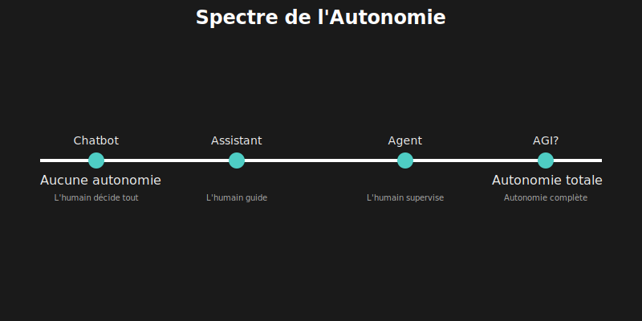

# 🤖 Chapitre 2 : Le Rôle des Agents dans l'Écosystème IA

---

## 🎬 Scène d'ouverture : La Confusion du Buzzword

*Salle de réunion, le lendemain matin...*

Lina présentait son prototype à l'équipe. Sur l'écran, un terminal noir avec une interface minimaliste — son chatbot amélioré qui pouvait lire des fichiers et exécuter du code.

Marc, le lead technique, croisa les bras.

— "C'est cool, mais AutoGPT fait déjà ça, non ? Et Claude Code, et Cursor, et Copilot... Tout le monde prétend avoir un 'agent IA' maintenant."

Lina hésita. Elle *savait* que son prototype était différent, mais comment l'expliquer clairement ?

— "La différence," commença-t-elle prudemment, "c'est dans ce qu'ils font réellement. Un chatbot te donne une réponse. Un assistant te donne de l'aide. Mais un **agent**..."

Elle fit une pause dramatique.

— "Un agent **résout** le problème. Tout seul. De bout en bout."

Sophie, la PM, fronça les sourcils.

— "Mais Copilot m'aide à écrire du code. Ce n'est pas un agent ?"

— "Non. Copilot te suggère du code. Tu dois valider, corriger, intégrer. Lui ne peut pas lancer les tests, voir qu'ils échouent, comprendre pourquoi, et corriger jusqu'à ce que ça marche. Un vrai agent, si."

Le silence dans la salle indiqua qu'elle avait touché une corde sensible.

— "Laissez-moi vous montrer la différence..."

---

## 📚 2.1 Une Taxonomie Claire des Systèmes IA

Le terme "agent IA" est devenu l'un des buzzwords les plus galvaudés de 2024. Startups, entreprises établies, et projets open-source — tous revendiquent avoir un "agent". Mais cette confusion terminologique masque des différences fondamentales en termes de capacités et d'architecture.

Pour construire quelque chose de vraiment utile, il faut d'abord comprendre ce qui existe, et où notre système se situe dans le paysage.

### 2.1.1 📊 Les Quatre Niveaux d'Intelligence Artificielle Appliquée

Au fil des années, une hiérarchie naturelle a émergé :


Cette pyramide n'est pas qu'une taxonomie académique — elle a des implications pratiques directes sur ce que chaque système peut accomplir.

### 2.1.2 📋 Tableau Comparatif Détaillé

| Aspect | 💬 Chatbot | ⚡ Assistant | 🚀 Agent | 🤝 Multi-Agent |
|:-------|:-----------|:-------------|:---------|:---------------|
| **Mémoire** | Session uniquement | Session + documents | Persistante | Partagée entre agents |
| **Outils** | 0 | 1-5 | 10-50+ | Spécialisés par rôle |
| **Autonomie** | Aucune | Guidée par l'humain | Boucle autonome | Coordination autonome |
| **Reasoning** | Linéaire | Chain-of-thought | ToT, MCTS | Distribué |
| **Feedback** | Aucun | De l'utilisateur | Auto-évaluation | Inter-agents |
| **Qui décide ?** | L'humain, toujours | L'humain, souvent | L'agent, supervisé | Les agents, négocié |
| **Exemple** | FAQ bot | GitHub Copilot | Grok-CLI | MetaGPT |

### 2.1.3 🎚️ Le Spectre de l'Autonomie

La différence fondamentale entre ces niveaux n'est pas technologique — c'est le **degré d'autonomie** accordé au système.



> 💡 **Point crucial** : Plus l'autonomie augmente, plus la **confiance** et la **sécurité** deviennent critiques. Un agent qui peut modifier du code et exécuter des commandes a le pouvoir de faire des dégâts considérables s'il n'est pas correctement encadré.

Cette réalité explique pourquoi les agents modernes (Claude Code, Grok-CLI) intègrent des systèmes de permission, de confirmation, et de sandbox. L'autonomie sans garde-fous serait irresponsable.

---

## 🕰️ 2.2 L'Évolution vers les Agents (2020-2025)

Pour comprendre où nous en sommes, il faut retracer le chemin parcouru. L'émergence des agents n'était pas un accident — c'est le résultat de plusieurs percées technologiques qui se sont alignées.

### 2.2.1 📅 Chronologie des Innovations Clés


### 2.2.2 🔑 Les Quatre Catalyseurs Technologiques

Ce ne sont pas les LLMs seuls qui ont rendu les agents possibles. Quatre innovations spécifiques ont été déterminantes :

#### 1️⃣ Function Calling (2023)

Avant le function calling, les LLMs ne pouvaient que générer du texte. Demander l'exécution d'un outil nécessitait du parsing complexe et peu fiable.

```
┌─────────────────────────────────────────────────────────────────────┐
│                    🔧 AVANT vs APRÈS FUNCTION CALLING               │
├─────────────────────────────────────────────────────────────────────┤
│                                                                      │
│  AVANT (parsing manuel) :                                           │
│  ─────────────────────────                                          │
│  LLM : "Je vais maintenant lire le fichier config.ts"              │
│        "```bash"                                                    │
│        "cat config.ts"                                              │
│        "```"                                                        │
│                                                                      │
│  → Il faut parser le texte, extraire la commande, espérer          │
│    que le format soit cohérent... fragile !                        │
│                                                                      │
│  APRÈS (function calling natif) :                                   │
│  ─────────────────────────────────                                  │
│  LLM retourne un JSON structuré :                                   │
│  {                                                                   │
│    "function_call": {                                               │
│      "name": "read_file",                                           │
│      "arguments": "{\"path\": \"config.ts\"}"                       │
│    }                                                                 │
│  }                                                                   │
│                                                                      │
│  → Structure garantie, facile à traiter, fiable !                  │
│                                                                      │
└─────────────────────────────────────────────────────────────────────┘
```

#### 2️⃣ Fenêtres de Contexte Étendues (2023-2024)

Un agent doit voir suffisamment de code pour comprendre ce qu'il fait. Les fenêtres de 4K tokens de GPT-3.5 étaient insuffisantes.

| 🤖 Modèle | 📏 Contexte | 📝 Équivalent pratique |
|:----------|:-----------:|:-----------------------|
| GPT-3.5 | 4K tokens | Une seule fonction |
| GPT-4 (initial) | 8K → 32K | Un fichier moyen |
| GPT-4 Turbo | 128K | Un petit projet |
| Claude 3 | 200K | Un projet complet |
| Grok-2 | 128K | Codebase avec RAG |

> 💡 **Implication** : Avec 200K tokens, un agent peut voir ~100 fichiers simultanément. C'est ce qui rend possible la compréhension contextuelle de codebases entières.

#### 3️⃣ Benchmarks Standardisés (2023-2024)

Sans mesure, pas d'amélioration. L'émergence de benchmarks spécifiques aux agents a permis de quantifier les progrès :

| 📊 Benchmark | Focus | Meilleur score 2024 | Signification |
|:-------------|:------|:-------------------:|:--------------|
| **SWE-bench** | Correction de vrais bugs GitHub | ~30% | 1 bug sur 3 résolu automatiquement |
| **WebArena** | Navigation web autonome | ~35% | Tâches web de difficulté moyenne |
| **GAIA** | Raisonnement général multi-étapes | ~55% | Questions nécessitant recherche |
| **HumanEval** | Génération de code | ~95% | Fonctions simples et isolées |

> ⚠️ **Nuance importante** : Ces chiffres montrent à la fois le potentiel (95% sur HumanEval) et les limites actuelles (30% sur SWE-bench). Les tâches réelles, avec leur complexité et leur ambiguïté, restent difficiles.

#### 4️⃣ MCP Protocol (2024)

Anthropic a standardisé comment les agents découvrent et utilisent les outils. Avant MCP, chaque agent avait sa propre façon de définir les outils — incompatibilité garantie.

```
┌─────────────────────────────────────────────────────────────────────┐
│                    🔌 MODEL CONTEXT PROTOCOL (MCP)                  │
├─────────────────────────────────────────────────────────────────────┤
│                                                                      │
│  AVANT MCP : Chaque outil défini différemment                       │
│  ─────────────────────────────────────────────                      │
│  Agent A : { name: "readFile", params: ["path"] }                  │
│  Agent B : { tool: "file_read", input: { filepath: "..." } }       │
│  Agent C : function read(file: string): string                     │
│                                                                      │
│  → Pas d'interopérabilité, duplication d'efforts                   │
│                                                                      │
│  AVEC MCP : Standard universel                                      │
│  ────────────────────────────                                       │
│  {                                                                   │
│    "name": "read_file",                                             │
│    "description": "Read contents of a file",                        │
│    "inputSchema": {                                                 │
│      "type": "object",                                              │
│      "properties": {                                                │
│        "path": {                                                    │
│          "type": "string",                                          │
│          "description": "Path to the file"                         │
│        }                                                            │
│      },                                                             │
│      "required": ["path"]                                           │
│    }                                                                │
│  }                                                                   │
│                                                                      │
│  → Un outil MCP fonctionne avec tous les agents MCP-compatibles    │
│                                                                      │
│  Transports supportés :                                             │
│  • stdio : Communication via stdin/stdout                          │
│  • HTTP : API REST standard                                         │
│  • SSE : Server-Sent Events pour streaming                         │
│                                                                      │
└─────────────────────────────────────────────────────────────────────┘
```

---

## 📖 2.3 Les Travaux de Recherche Fondamentaux

Grok-CLI n'est pas une invention ex nihilo — il s'appuie sur des années de recherche académique et industrielle. Comprendre ces travaux, c'est comprendre **pourquoi** l'agent est conçu comme il l'est.

### 2.3.1 🌳 Tree-of-Thought (Yao et al., 2023)

**Le problème** : Le raisonnement linéaire (un chemin unique) échoue sur les problèmes qui nécessitent exploration et backtracking.

**L'idée** : Au lieu de suivre une seule chaîne de pensée, explorer plusieurs chemins en parallèle, évaluer lesquels sont prometteurs, et abandonner les impasses.

```
┌─────────────────────────────────────────────────────────────────────┐
│                    🌳 TREE-OF-THOUGHT EN ACTION                     │
├─────────────────────────────────────────────────────────────────────┤
│                                                                      │
│  Problème : "Game of 24 : Utiliser 4, 5, 6, 10 pour obtenir 24"    │
│                                                                      │
│  Raisonnement linéaire (Chain-of-Thought) :                         │
│  ──────────────────────────────────────────                         │
│  4 + 5 = 9... 9 + 6 = 15... 15 + 10 = 25 ✗                         │
│  → Un seul chemin, échec, pas de récupération possible             │
│                                                                      │
│  Tree-of-Thought :                                                  │
│  ─────────────────                                                  │
│                        [Problème]                                   │
│                            │                                        │
│            ┌───────────────┼───────────────┐                        │
│            │               │               │                        │
│            ▼               ▼               ▼                        │
│       [4 + 5 = 9]    [4 × 5 = 20]    [10 - 4 = 6]                  │
│            │               │               │                        │
│       ✗ impasse      [20 + 6 = 26]   [6 × 5 = 30]                  │
│                           ✗               ✗                         │
│                                            │                        │
│                                   Backtrack...                      │
│                                            │                        │
│                                   [4 × 6 = 24] ✓                    │
│                                                                      │
│  → Exploration systématique, trouve la solution !                  │
│                                                                      │
└─────────────────────────────────────────────────────────────────────┘
```

| 📊 Métrique | Chain-of-Thought | Tree-of-Thought |
|:------------|:----------------:|:---------------:|
| Game of 24 | 4% | **74%** |
| Creative Writing | baseline | +15% qualité |
| Mini-Crosswords | 16% | **60%** |

**Dans Grok-CLI** : `src/agent/reasoning/tree-of-thought.ts`

### 2.3.2 🎲 RethinkMCTS (Zhang et al., 2024)

**Le problème** : Tree-of-Thought explore trop de mauvais chemins. Comment prioriser intelligemment ?

**L'idée** : Adapter Monte-Carlo Tree Search (l'algorithme derrière AlphaGo) à la génération de code.

```
┌─────────────────────────────────────────────────────────────────────┐
│                    🎲 MCTS POUR LA GÉNÉRATION DE CODE               │
├─────────────────────────────────────────────────────────────────────┤
│                                                                      │
│  Les 4 phases de MCTS :                                             │
│                                                                      │
│  1️⃣ SELECT : Choisir le nœud le plus prometteur                    │
│     └─ Utilise UCB1 : exploitation + exploration                    │
│                                                                      │
│  2️⃣ EXPAND : Générer des variations de code                        │
│     └─ Le LLM propose plusieurs approches                          │
│                                                                      │
│  3️⃣ SIMULATE : Exécuter les tests                                  │
│     └─ Feedback objectif sur la qualité                            │
│                                                                      │
│  4️⃣ BACKPROPAGATE : Mettre à jour les scores                       │
│     └─ Les bons chemins deviennent plus attractifs                 │
│                                                                      │
│  ┌─────────────────────────────────────────────────────────────┐   │
│  │                                                             │   │
│  │      [Racine]                                               │   │
│  │      score: 0.5                                             │   │
│  │          │                                                  │   │
│  │    ┌─────┴─────┐                                            │   │
│  │    │           │                                            │   │
│  │    ▼           ▼                                            │   │
│  │ [Approche A] [Approche B]                                   │   │
│  │  score: 0.3   score: 0.7 ◄── Plus prometteur               │   │
│  │                   │                                         │   │
│  │             ┌─────┴─────┐                                   │   │
│  │             │           │                                   │   │
│  │             ▼           ▼                                   │   │
│  │          [B.1]       [B.2]                                  │   │
│  │         score: 0.8   score: 0.4                             │   │
│  │          ✓ !                                                │   │
│  │                                                             │   │
│  └─────────────────────────────────────────────────────────────┘   │
│                                                                      │
│  Résultat : Converge vers la solution optimale avec moins          │
│             d'explorations que ToT naïf                             │
│                                                                      │
└─────────────────────────────────────────────────────────────────────┘
```

| 📊 Amélioration | Benchmark |
|:----------------|:---------:|
| HumanEval | +15% vs ToT |
| MBPP | +12% vs ToT |
| Exploration | -40% de nœuds visités |

**Dans Grok-CLI** : `src/agent/reasoning/mcts.ts`

### 2.3.3 💰 FrugalGPT (Chen et al., Stanford, 2023)

**Le problème** : Les meilleurs modèles coûtent cher. Utiliser GPT-4 pour tout est du gaspillage.

**L'idée** : Un "routeur" intelligent qui envoie chaque requête au modèle approprié selon sa complexité.

```
┌─────────────────────────────────────────────────────────────────────┐
│                    💰 FRUGALGPT MODEL ROUTING                       │
├─────────────────────────────────────────────────────────────────────┤
│                                                                      │
│                      Requête entrante                               │
│                            │                                        │
│                            ▼                                        │
│                   ┌────────────────┐                                │
│                   │  🧠 Classifier │                                │
│                   │  (complexité)  │                                │
│                   └───────┬────────┘                                │
│                           │                                         │
│         ┌─────────────────┼─────────────────┐                       │
│         │                 │                 │                       │
│         ▼                 ▼                 ▼                       │
│    ┌─────────┐      ┌─────────┐      ┌─────────┐                   │
│    │ 💚 Tier │      │ 💛 Tier │      │ ❤️ Tier │                   │
│    │   1     │      │    2    │      │    3    │                   │
│    │  ($)    │      │  ($$)   │      │ ($$$)   │                   │
│    ├─────────┤      ├─────────┤      ├─────────┤                   │
│    │ Grok-2  │      │ Grok-2  │      │ Grok-3  │                   │
│    │  mini   │      │ standard│      │  + ToT  │                   │
│    └─────────┘      └─────────┘      └─────────┘                   │
│         │                 │                 │                       │
│         ▼                 ▼                 ▼                       │
│    "ls -la"        "refactor      "debug cette                     │
│    "git status"     cette          race condition                  │
│    Simple!          fonction"      complexe"                       │
│                     Modéré         Difficile!                      │
│                                                                      │
│  📊 Économies mesurées : 30-70% des coûts API                      │
│  📈 Sans perte de qualité sur les tâches simples                   │
│                                                                      │
└─────────────────────────────────────────────────────────────────────┘
```

| 🎯 Type de tâche | Modèle utilisé | Coût relatif |
|:-----------------|:---------------|:------------:|
| Commandes simples | Tier 1 (mini) | 1x |
| Refactoring standard | Tier 2 (standard) | 5x |
| Debugging complexe | Tier 3 (avancé) | 20x |
| Architecture | Tier 3 + ToT | 30x |

**Dans Grok-CLI** : `src/optimization/model-routing.ts`

### 2.3.4 ⚡ LLMCompiler (Kim et al., Berkeley, 2023)

**Le problème** : Les appels d'outils séquentiels sont lents. Si trois fichiers sont indépendants, pourquoi les lire un par un ?

**L'idée** : Analyser les dépendances entre appels d'outils et exécuter en parallèle quand possible.

```
┌─────────────────────────────────────────────────────────────────────┐
│                    ⚡ LLMCOMPILER PARALLÉLISATION                   │
├─────────────────────────────────────────────────────────────────────┤
│                                                                      │
│  Tâche : "Lis config.ts, types.ts, et utils.ts puis analyse-les"   │
│                                                                      │
│  EXÉCUTION SÉQUENTIELLE (avant) :                                   │
│  ─────────────────────────────────                                  │
│  ┌────────────┐ ┌────────────┐ ┌────────────┐ ┌────────────┐       │
│  │read config │→│read types  │→│read utils  │→│  analyze   │       │
│  │   500ms    │ │   500ms    │ │   500ms    │ │   1000ms   │       │
│  └────────────┘ └────────────┘ └────────────┘ └────────────┘       │
│                                                                      │
│  Total : 2500ms                                                     │
│                                                                      │
│  EXÉCUTION LLMCOMPILER (après) :                                    │
│  ─────────────────────────────────                                  │
│  ┌────────────┐                                                     │
│  │read config │─┐                                                   │
│  │   500ms    │ │                                                   │
│  └────────────┘ │                                                   │
│  ┌────────────┐ ├──→ ┌────────────┐                                │
│  │read types  │─┤    │  analyze   │                                │
│  │   500ms    │ │    │   1000ms   │                                │
│  └────────────┘ │    └────────────┘                                │
│  ┌────────────┐ │                                                   │
│  │read utils  │─┘                                                   │
│  │   500ms    │                                                     │
│  └────────────┘                                                     │
│                                                                      │
│  Total : 1500ms (⚡ 1.7x plus rapide !)                             │
│                                                                      │
│  Sur des tâches plus complexes : 2.5-4.6x speedup                   │
│                                                                      │
└─────────────────────────────────────────────────────────────────────┘
```

**Dans Grok-CLI** : `src/optimization/parallel-executor.ts`

### 2.3.5 🔧 ChatRepair (Xia et al., ISSTA 2024)

**Le problème** : Les LLMs échouent souvent au premier essai de correction de bug. Une seule tentative ne suffit pas.

**L'idée** : Créer une boucle itérative où l'agent essaie, observe le résultat des tests, et réessaie avec le feedback.

```
┌─────────────────────────────────────────────────────────────────────┐
│                    🔧 CHATREPAIR : BOUCLE ITÉRATIVE                 │
├─────────────────────────────────────────────────────────────────────┤
│                                                                      │
│                        Bug signalé                                  │
│                            │                                        │
│                            ▼                                        │
│                   ┌────────────────┐                                │
│                   │ 🔍 LOCALISER   │ ◄── Ochiai, DStar, Tarantula  │
│                   │   la faute     │     (spectral fault loc.)     │
│                   └───────┬────────┘                                │
│                           │                                         │
│                           ▼                                         │
│                   ┌────────────────┐                                │
│                   │ 🔧 GÉNÉRER     │ ◄── LLM avec contexte         │
│                   │   un patch     │     + historique d'erreurs    │
│                   └───────┬────────┘                                │
│                           │                                         │
│                           ▼                                         │
│                   ┌────────────────┐                                │
│                   │ 🧪 EXÉCUTER    │                                │
│                   │   les tests    │                                │
│                   └───────┬────────┘                                │
│                           │                                         │
│                      ┌────┴────┐                                    │
│                      │ Succès? │                                    │
│                      └────┬────┘                                    │
│                     Non   │   Oui                                   │
│                      │    │    │                                    │
│                      ▼    │    ▼                                    │
│              ┌──────────┐ │  ✅ Terminé !                           │
│              │ 📝 FEEDBACK│ │                                       │
│              │  d'erreur │ │                                       │
│              └─────┬────┘ │                                        │
│                    │      │                                        │
│                    └──────┘ (retour à GÉNÉRER, max 5 itérations)   │
│                                                                      │
│  📊 Amélioration : +40% bugs résolus vs single-shot                │
│                                                                      │
└─────────────────────────────────────────────────────────────────────┘
```

| 📊 Métrique | Single-shot | ChatRepair (5 iter) |
|:------------|:-----------:|:-------------------:|
| Bugs résolus (Defects4J) | 19% | **27%** (+42%) |
| Bugs résolus (QuixBugs) | 31% | **44%** (+42%) |
| Temps moyen par bug | 30s | 90s |

**Dans Grok-CLI** : `src/agent/repair/iterative-repair.ts`

### 2.3.6 📦 Context Compression (JetBrains Research, 2024)

**Le problème** : Le contexte long coûte cher et dilue l'attention du modèle. Plus on donne d'information, moins elle est utilisée efficacement.

**L'idée** : Compresser intelligemment en gardant ce qui est essentiel et en résumant ou supprimant le reste.

```
┌─────────────────────────────────────────────────────────────────────┐
│                    📦 COMPRESSION INTELLIGENTE                      │
├─────────────────────────────────────────────────────────────────────┤
│                                                                      │
│  Contexte original : 50,000 tokens                                  │
│                                                                      │
│  ┌─────────────────────────────────────────────────────────────┐   │
│  │ 🔴 PRIORITÉ HAUTE — Garder intégralement                    │   │
│  │                                                             │   │
│  │  • Code modifié récemment                                   │   │
│  │  • Fonctions référencées dans la question                  │   │
│  │  • Types et interfaces utilisés                            │   │
│  │  • Erreurs et stack traces                                  │   │
│  └─────────────────────────────────────────────────────────────┘   │
│                                                                      │
│  ┌─────────────────────────────────────────────────────────────┐   │
│  │ 🟡 PRIORITÉ MOYENNE — Résumer                               │   │
│  │                                                             │   │
│  │  • Imports et dépendances → liste des noms                 │   │
│  │  • Documentation → points clés uniquement                  │   │
│  │  • Tests existants → signatures seulement                  │   │
│  │  • Historique de conversation → résumé                     │   │
│  └─────────────────────────────────────────────────────────────┘   │
│                                                                      │
│  ┌─────────────────────────────────────────────────────────────┐   │
│  │ 🟢 PRIORITÉ BASSE — Supprimer                               │   │
│  │                                                             │   │
│  │  • Code non lié à la tâche                                 │   │
│  │  • Commentaires redondants                                  │   │
│  │  • Messages anciens déjà traités                           │   │
│  │  • Fichiers de configuration standard                      │   │
│  └─────────────────────────────────────────────────────────────┘   │
│                                                                      │
│  Contexte compressé : 15,000 tokens (70% de réduction !)           │
│                                                                      │
│  📊 Résultat : -7% coûts, +2.6% taux de succès                     │
│                                                                      │
└─────────────────────────────────────────────────────────────────────┘
```

**Dans Grok-CLI** : `src/context/context-compressor.ts`

### 2.3.7 🕸️ CodeRAG (2024)

**Le problème** : Le RAG classique trouve des fichiers par similarité textuelle, mais ignore les dépendances du code. Comprendre une classe nécessite souvent ses imports.

**L'idée** : Construire un graphe de dépendances et inclure automatiquement les fichiers liés.

```
┌─────────────────────────────────────────────────────────────────────┐
│                    🕸️ DEPENDENCY-AWARE RAG                         │
├─────────────────────────────────────────────────────────────────────┤
│                                                                      │
│  Query : "Comment fonctionne GrokAgent ?"                           │
│                                                                      │
│  RAG CLASSIQUE :                                                    │
│  ───────────────                                                    │
│  → Recherche "GrokAgent" dans les embeddings                       │
│  → Retourne : grok-agent.ts ✓                                      │
│  → Manque : types.ts, tools.ts, client.ts (dépendances !)          │
│                                                                      │
│  CODERAG (Dependency-Aware) :                                       │
│  ─────────────────────────────                                      │
│  → Recherche "GrokAgent"                                           │
│  → Analyse le graphe d'imports :                                   │
│                                                                      │
│         ┌─────────────────┐                                        │
│         │  grok-agent.ts  │ ◄── Query match                        │
│         │   (principal)   │                                        │
│         └────────┬────────┘                                        │
│                  │ imports                                          │
│      ┌───────────┼───────────┐                                     │
│      │           │           │                                      │
│      ▼           ▼           ▼                                      │
│  ┌───────┐  ┌────────┐  ┌────────┐                                │
│  │types.ts│  │tools.ts│  │client.ts│                               │
│  │(types)│  │(41 outils)│ │(API)  │                                │
│  └───────┘  └────────┘  └────────┘                                │
│                  │                                                  │
│                  ▼                                                  │
│            ┌──────────┐                                            │
│            │ utils.ts │ ◄── Import transitif                       │
│            └──────────┘                                            │
│                                                                      │
│  → Retourne : grok-agent.ts + types.ts + tools.ts + client.ts     │
│  → Contexte complet pour vraiment comprendre !                     │
│                                                                      │
│  📊 Amélioration : +25% pertinence des réponses                    │
│                                                                      │
└─────────────────────────────────────────────────────────────────────┘
```

**Dans Grok-CLI** : `src/context/dependency-aware-rag.ts`

---

## 📋 2.4 Tableau Récapitulatif des Recherches

| 📖 Publication | 📅 Année | ⚠️ Problème | 💡 Solution | 📈 Amélioration | 📁 Fichier Grok-CLI |
|:---------------|:--------:|:------------|:------------|:----------------|:--------------------|
| Tree-of-Thought | 2023 | Reasoning linéaire | Exploration multi-chemins | +70% problèmes complexes | `tree-of-thought.ts` |
| RethinkMCTS | 2024 | Exploration inefficace | MCTS guidé par UCB1 | +15% génération code | `mcts.ts` |
| FrugalGPT | 2023 | Coûts API élevés | Model routing intelligent | -30-70% coûts | `model-routing.ts` |
| LLMCompiler | 2023 | Latence des outils | Parallélisation auto | 2.5-4.6x speedup | `parallel-executor.ts` |
| ChatRepair | 2024 | Réparation single-shot | Boucle itérative | +42% bugs résolus | `iterative-repair.ts` |
| JetBrains | 2024 | Contexte coûteux | Compression intelligente | -7% coûts, +2.6% succès | `context-compressor.ts` |
| CodeRAG | 2024 | RAG sans dépendances | Graphe d'imports | +25% pertinence | `dependency-aware-rag.ts` |

---

## 🌐 2.5 L'Écosystème des Agents en 2025

### 2.5.1 🛠️ Agents de Développement

Le marché des agents de développement s'est structuré en plusieurs catégories :

| 🤖 Agent | 📊 Type | ✅ Forces | ⚠️ Faiblesses |
|:---------|:--------|:----------|:--------------|
| **GitHub Copilot** | Assistant | Intégration IDE fluide, vitesse | Pas autonome, suggestions locales |
| **Cursor** | Assistant+ | Context-aware, multi-fichier | Limité à l'environnement IDE |
| **Claude Code** | Agent | Autonome, sécurisé, bien intégré | Propriétaire, coût |
| **Devin** | Agent | Full-stack, très autonome | Accès limité, coût élevé |
| **Grok-CLI** | Agent | Open-source, complet, recherche | Plus récent, communauté plus petite |
| **Aider** | Agent | Simple, efficace, léger | Moins de fonctionnalités avancées |

### 2.5.2 🤝 Frameworks Multi-Agents

Pour les tâches nécessitant plusieurs perspectives ou spécialisations :

| 🔧 Framework | 🎯 Paradigme | 📋 Cas d'usage idéal |
|:-------------|:-------------|:---------------------|
| **LangChain** | Chaîne d'outils | Prototypage rapide, PoC |
| **LangGraph** | Graphe d'états | Workflows complexes avec branches |
| **AutoGen** | Multi-agent dialogique | Collaboration et débat entre agents |
| **CrewAI** | Équipes spécialisées | Projets avec rôles définis |
| **MetaGPT** | Simulation d'entreprise | Projets structurés type "startup" |

### 2.5.3 📡 Standards Émergents

```
┌─────────────────────────────────────────────────────────────────────┐
│                    📡 STANDARDS AGENTS 2025                         │
├─────────────────────────────────────────────────────────────────────┤
│                                                                      │
│  🔌 MCP (Model Context Protocol) — Anthropic                        │
│  ─────────────────────────────────────────────                      │
│  • Standard pour la communication agent ↔ outils                   │
│  • Transports : stdio, HTTP, SSE                                   │
│  • Découverte dynamique des capacités                              │
│  • Adopté par Claude Code, en expansion                            │
│                                                                      │
│  🔧 OpenAI Function Calling                                         │
│  ────────────────────────────                                       │
│  • JSON Schema pour les paramètres                                 │
│  • Parallel function calling supporté                              │
│  • De facto standard pour la plupart des providers                 │
│  • Compatible avec Grok API (via OpenAI SDK)                       │
│                                                                      │
│  🤝 A2A (Agent-to-Agent) — Émergent                                 │
│  ────────────────────────────────────                               │
│  • Communication entre agents différents                           │
│  • Délégation de tâches inter-agents                               │
│  • Pas encore standardisé, plusieurs propositions                  │
│  • Enjeu majeur pour le multi-agent                                │
│                                                                      │
└─────────────────────────────────────────────────────────────────────┘
```

---

## 🎯 2.6 Pourquoi Construire son Propre Agent ?

Sophie, la PM, interrompit la présentation de Lina :

— "Mais si Claude Code existe déjà et qu'il est si bon, pourquoi réinventer la roue ?"

Marc acquiesça.

— "C'est la question que tout le monde se pose."

Lina avait prévu cette objection.

— "Trois raisons. La première : **le contrôle**. Claude Code est une boîte noire. Si demain Anthropic change son pricing, ses conditions, ou décide de ne plus supporter une feature dont on dépend, on n'a aucun recours."

— "Fair enough. Et les deux autres ?"

— "La deuxième : **la customisation**. Notre codebase a des spécificités. Des conventions, des outils internes, des patterns qu'aucun agent générique ne connaît. Un agent custom peut être parfaitement adapté."

— "Et la troisième ?"

Lina sourit.

— "**L'apprentissage**. En construisant un agent, on comprend vraiment comment ça marche. Et cette compréhension, c'est ce qui nous permettra de l'utiliser efficacement — ou de diagnostiquer quand ça ne marche pas."

### 2.6.1 📊 Comparaison Agent Commercial vs Custom

| 🎯 Aspect | 🏢 Agent Commercial | 🔧 Agent Custom |
|:----------|:--------------------|:----------------|
| **Contrôle** | Limité aux options exposées | Total, code source disponible |
| **Coût** | Abonnement + usage | API uniquement |
| **Customisation** | Plugins si disponibles | Tout est modifiable |
| **Données** | Transitent par le provider | Restent locales si voulu |
| **Évolution** | Dépend du vendor | Vous décidez du roadmap |
| **Apprentissage** | Limité à l'usage | Profond, technique |

### 2.6.2 📋 Cas d'Usage pour un Agent Custom

| 🎯 Situation | 💡 Pourquoi Custom ? |
|:-------------|:---------------------|
| **Outils internes** | Intégration avec CI/CD propriétaire, bases de données internes |
| **Sécurité stricte** | Données sensibles qui ne peuvent pas quitter l'entreprise |
| **Volume élevé** | Contrôle fin du routing et des coûts à grande échelle |
| **Recherche** | Expérimentation avec de nouvelles techniques |
| **Formation** | Comprendre le fonctionnement pour mieux utiliser |

---

## 🗺️ 2.7 Référence Grok-CLI : Où Trouver Quoi

Chaque technique de recherche mentionnée dans ce chapitre est implémentée dans Grok-CLI :

```
src/
├── agent/
│   ├── reasoning/
│   │   ├── tree-of-thought.ts    ◄── ToT (Yao 2023)
│   │   └── mcts.ts               ◄── RethinkMCTS (Zhang 2024)
│   └── repair/
│       ├── iterative-repair.ts   ◄── ChatRepair (Xia 2024)
│       └── fault-localization.ts ◄── Ochiai, DStar (spectral)
├── context/
│   ├── dependency-aware-rag.ts   ◄── CodeRAG (2024)
│   ├── context-compressor.ts     ◄── JetBrains Research (2024)
│   └── observation-masking.ts    ◄── AgentCoder
├── optimization/
│   ├── model-routing.ts          ◄── FrugalGPT (Chen 2023)
│   ├── parallel-executor.ts      ◄── LLMCompiler (Kim 2023)
│   └── latency-optimizer.ts      ◄── Human-AI Flow Research
└── mcp/
    └── client.ts                 ◄── MCP Protocol (Anthropic 2024)
```

---

## 📝 2.8 Points Clés à Retenir

### 📊 Sur la Taxonomie

| Concept | Point clé |
|:--------|:----------|
| **4 niveaux** | Chatbot → Assistant → Agent → Multi-Agent |
| **Différence clé** | Le degré d'autonomie et de capacité d'action |
| **Agent vs Assistant** | L'agent résout, l'assistant aide |

### 🕰️ Sur l'Évolution

| Concept | Point clé |
|:--------|:----------|
| **Catalyseurs** | Function calling, contexte étendu, MCP |
| **2023** | Année charnière (GPT-4, AutoGPT) |
| **2024-2025** | Maturation et standardisation |

### 📖 Sur la Recherche

| Concept | Point clé |
|:--------|:----------|
| **ToT/MCTS** | Exploration multi-chemins > raisonnement linéaire |
| **FrugalGPT** | Adapter le modèle à la complexité de la tâche |
| **ChatRepair** | Itérer avec feedback > essai unique |
| **CodeRAG** | Inclure les dépendances, pas juste le fichier |

### 🎯 Sur la Décision Custom vs Commercial

| Concept | Point clé |
|:--------|:----------|
| **Custom** | Contrôle, personnalisation, apprentissage |
| **Commercial** | Rapidité, support, moins de maintenance |
| **Hybride** | Souvent la meilleure approche en pratique |

---

## 🏋️ 2.9 Exercices

### Exercice 1 : Classification (15 min)

Classez ces 5 produits selon la taxonomie Chatbot/Assistant/Agent :
1. ChatGPT vanilla (sans plugins)
2. GitHub Copilot
3. Claude Code
4. Siri
5. Un script qui utilise GPT pour formater du JSON

### Exercice 2 : Analyse de Publication (30 min)

Choisissez une publication du tableau récapitulatif. Trouvez l'article sur arXiv et :
1. Lisez l'abstract
2. Identifiez le problème résolu
3. Résumez la solution en 3 phrases

### Exercice 3 : Comparaison Pratique (1h)

Installez [Aider](https://github.com/paul-gauthier/aider) et comparez-le à votre intuition de ce que devrait faire un agent :
1. Quelles tâches réussit-il bien ?
2. Où sont ses limites ?
3. Qu'est-ce qui le distingue d'un simple wrapper LLM ?

### Exercice 4 : Réflexion Métier (20 min)

Pour votre domaine ou projet actuel :
1. Quels outils spécifiques un agent custom devrait-il avoir ?
2. Quelles intégrations seraient impossibles avec un agent commercial ?
3. Le coût de construction justifie-t-il les bénéfices ?

---

## 📚 2.10 Pour Aller Plus Loin

### Publications Fondamentales

- Yao, S., et al. (2023). "Tree of Thoughts: Deliberate Problem Solving with Large Language Models." arXiv:2305.10601
- Kim, S., et al. (2023). "LLMCompiler: An LLM Compiler for Parallel Function Calling." arXiv:2312.04511
- Chen, L., et al. (2023). "FrugalGPT: How to Use Large Language Models While Reducing Cost and Improving Performance." arXiv:2305.05176
- Xia, C., et al. (2024). "ChatRepair: Autonomous Repair of Programs via Large Language Models." ISSTA 2024

### Spécifications et Documentation

- Anthropic. (2024). "Model Context Protocol Specification." https://modelcontextprotocol.io
- OpenAI. (2024). "Function Calling Guide." https://platform.openai.com/docs/guides/function-calling

---

## 🌅 Épilogue : Le Choix de Lina

La réunion touchait à sa fin. Marc résuma :

— "Donc si je comprends bien, Copilot c'est niveau 2, et ce que tu veux construire c'est niveau 3 ?"

— "Exactement," confirma Lina. "Un agent qui peut prendre un ticket, comprendre le contexte, explorer le code, proposer une solution, la tester, et itérer jusqu'à ce que ça marche. Sans que j'aie à valider chaque ligne."

Sophie hocha la tête.

— "Et tout ce que tu as montré — Tree-of-Thought, MCTS, ChatRepair — c'est ce qui rend ça possible ?"

— "Ce sont les briques. Le chapitre suivant, on va voir comment les assembler. L'anatomie d'un agent — les 6 composants qui font qu'un agent est vraiment un agent."

Marc sourit.

— "OK. Tu as mon attention. Montre-nous l'architecture."

---

| ⬅️ Précédent | 📖 Sommaire | ➡️ Suivant |
|:-------------|:-----------:|:-----------|
| [Comprendre les LLMs](01-comprendre-les-llms.md) | [Index](README.md) | [Anatomie d'un Agent](03-anatomie-agent.md) |
