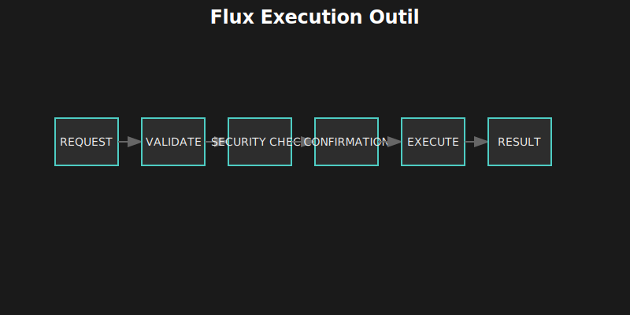

# 🏗️ Chapitre 3 : Anatomie d'un Agent Autonome

---

## 🎬 Scène d'ouverture : Les Six Piliers

*Le tableau blanc de Lina ressemblait à une toile d'araignée de concepts. Des flèches partaient dans tous les sens, reliant des boxes multicolores.*

Marc observait le chaos organisé, essayant de comprendre la logique.

— "OK, récapitulons," dit Lina en pointant le centre du tableau où elle avait écrit en grosses lettres :

**ORCHESTRATEUR — REASONING — MEMORY — ACTION — LEARNING — SECURITY**

— "Ces six composants. Si l'un manque, ce n'est pas vraiment un agent. C'est juste un chatbot amélioré."

Marc s'approcha.

— "Ça ressemble à... un cerveau humain, en fait."

Lina sourit.

— "Exactement. On essaie de reproduire ce que fait un développeur quand il résout un problème. Il réfléchit, se souvient, agit, apprend de ses erreurs, et — c'est important — il ne fait pas n'importe quoi. Il a du bon sens."

Sophie, la PM, intervint :

— "Et l'orchestrateur, c'est quoi ? La conscience ?"

— "En quelque sorte. C'est ce qui coordonne tout. Ce qui décide quand réfléchir, quand agir, quand s'arrêter. Sans lui, les autres composants seraient des pièces détachées."

Elle prit un marqueur et commença à dessiner les connexions.

— "Laissez-moi vous montrer comment tout ça s'assemble..."

---

## 🔬 3.1 Vue d'Ensemble : Les Six Composants

Un agent n'est pas simplement un LLM avec des outils. C'est une **architecture cognitive** où plusieurs systèmes spécialisés collaborent pour produire un comportement intelligent. Chaque composant a un rôle précis, et c'est leur interaction qui fait la magie.

### 3.1.1 🏛️ Architecture Globale


### 3.1.2 📊 Rôle de Chaque Composant

| 🔧 Composant | 🎯 Rôle Principal | 🧠 Analogie Humaine | 📁 Implémentation Grok-CLI |
|:-------------|:------------------|:--------------------|:---------------------------|
| **Orchestrateur** | Coordonne le flux, gère la boucle | Conscience, attention | `src/agent/grok-agent.ts` |
| **Reasoning** | Résout les problèmes complexes | Réflexion, analyse | `src/agent/reasoning/` |
| **Memory** | Stocke et retrouve l'information | Mémoire court/long terme | `src/context/`, `src/database/` |
| **Action** | Interagit avec le monde externe | Corps, mains | `src/tools/` |
| **Learning** | S'améliore avec l'expérience | Apprentissage | `src/learning/` |
| **Security** | Protège contre les erreurs/abus | Prudence, bon sens | `src/security/` |

> 💡 **Analogie du développeur** : Quand vous résolvez un bug, vous utilisez tous ces composants : vous *réfléchissez* au problème, vous *vous souvenez* de bugs similaires, vous *agissez* (éditez le code), vous *apprenez* pour la prochaine fois, et vous faites *attention* à ne pas introduire de nouvelles erreurs.

---

## 🎯 3.2 L'Orchestrateur : Le Chef d'Orchestre

L'orchestrateur est le cœur de l'agent. C'est lui qui décide quand appeler le LLM, quand exécuter un outil, quand s'arrêter. Sans lui, les autres composants seraient comme des musiciens talentueux mais sans chef — capables individuellement, mais incapables de produire une symphonie.

### 3.2.1 🔄 La Boucle Agentique (ReAct)

Le pattern fondamental de tout agent est la boucle **ReAct** (Reasoning + Acting) :


### 3.2.2 💻 Implémentation Réelle

Voici un extrait de la véritable implémentation de `GrokAgent` dans `src/agent/grok-agent.ts` :

```typescript
// src/agent/grok-agent.ts
export class GrokAgent extends EventEmitter {
  private grokClient: GrokClient;
  private contextManager: ContextManagerV2;
  // Maximum history entries to prevent memory bloat
  private static readonly MAX_HISTORY_SIZE = 1000;
  private maxToolRounds: number;
  private yoloMode: boolean = false;
  private sessionCostLimit: number;
  private sessionCost: number = 0;

  constructor(
    apiKey: string,
    baseURL?: string,
    model?: string,
    maxToolRounds?: number,
    useRAGToolSelection: boolean = true
  ) {
    super();
    // ... initialisation ...

    // Mode YOLO : autonomie totale ou sécurité par défaut
    this.yoloMode = process.env.YOLO_MODE === "true";
    this.maxToolRounds = maxToolRounds || (this.yoloMode ? 400 : 50);

    // Initialisation du gestionnaire de contexte avec compression intelligente
    this.contextManager = createContextManager(modelToUse, maxContextTokens);
  }

  async processUserMessage(message: string): Promise<ChatEntry[]> {
    // ... setup ...

    try {
      // Sélection d'outils via RAG pour réduire le contexte
      const { tools } = await this.getToolsForQuery(message);

      // Compression intelligente du contexte avant envoi
      const preparedMessages = this.contextManager.prepareMessages(this.messages);

      let currentResponse = await this.grokClient.chat(preparedMessages, tools, ...);

      // Boucle principale (ReAct Loop)
      while (toolRounds < maxToolRounds) {
        // ... traitement réponse ...

        if (assistantMessage.tool_calls && assistantMessage.tool_calls.length > 0) {
          toolRounds++;

          // Exécution parallèle possible pour les outils en lecture seule
          const results = await this._executeToolCallsParallel(assistantMessage.tool_calls);

          // ... mise à jour historique ...

          // Récursion : obtenir la prochaine action du LLM
          currentResponse = await this.grokClient.chat(nextPreparedMessages, tools, ...);
        } else {
          break; // Fin de tâche
        }
      }

      // ... gestion des coûts ...
      this.recordSessionCost(inputTokens, totalOutputTokens);

      return newEntries;
    } catch (error) {
      // ... gestion d'erreurs ...
    }
  }
}
```

### 3.2.3 🚧 Gestion des Limites

L'orchestrateur doit protéger contre plusieurs risques :

| ⚠️ Risque | 🛡️ Protection | 📊 Valeur Typique |
|:----------|:--------------|:------------------|
| **Boucle infinie** | Limite de rounds | 30-400 rounds |
| **Dépassement contexte** | Compression automatique | 128K tokens max |
| **Coût excessif** | Budget par session | $10/session |
| **Outil bloqué** | Timeout par outil | 5min/outil |
| **Répétition** | Détection de patterns | Hash des 5 derniers messages |

```typescript
// Détection de boucle par répétition
if (this.detectLoop()) {
  this.emit('warning', 'Possible boucle détectée');
  // Stratégies possibles :
  // 1. Demander clarification à l'utilisateur
  // 2. Changer d'approche (élever le niveau de reasoning)
  // 3. Résumer et repartir à zéro
}
```

---

## 🧠 3.3 Reasoning : Le Moteur de Réflexion

Le composant Reasoning détermine *comment* l'agent réfléchit à un problème. Tous les problèmes ne nécessitent pas la même profondeur de réflexion — demander l'heure est différent de debugger une race condition.

### 3.3.1 📊 Les Quatre Niveaux de Raisonnement

```
┌─────────────────────────────────────────────────────────────────────┐
│                    🧠 NIVEAUX DE REASONING                          │
├─────────────────────────────────────────────────────────────────────┤
│                                                                      │
│  🟢 NIVEAU 0 : DIRECT                                               │
│  ┌─────────────────────────────────────────────────────────────┐    │
│  │  Question simple → Réponse directe                          │    │
│  │  "Quelle heure est-il ?" → Appel tool datetime              │    │
│  │  🎯 Tokens thinking : 0                                     │    │
│  │  ⏱️ Latence : ~1s                                           │    │
│  └─────────────────────────────────────────────────────────────┘    │
│                                                                      │
│  🟡 NIVEAU 1 : CHAIN-OF-THOUGHT (mot-clé: "think")                  │
│  ┌─────────────────────────────────────────────────────────────┐    │
│  │  Problème modéré → Raisonnement linéaire étape par étape    │    │
│  │  "Refactor cette fonction" → Analyse → Plan → Exécution     │    │
│  │  🎯 Tokens thinking : ~4,000                                │    │
│  │  ⏱️ Latence : ~5-10s                                        │    │
│  └─────────────────────────────────────────────────────────────┘    │
│                                                                      │
│  🟠 NIVEAU 2 : TREE-OF-THOUGHT (mot-clé: "megathink")               │
│  ┌─────────────────────────────────────────────────────────────┐    │
│  │  Problème complexe → Exploration multi-chemins              │    │
│  │  "Debug ce crash aléatoire" → Hypothèses → Tests → Solution │    │
│  │  🎯 Tokens thinking : ~10,000                               │    │
│  │  ⏱️ Latence : ~20-30s                                       │    │
│  └─────────────────────────────────────────────────────────────┘    │
│                                                                      │
│  🔴 NIVEAU 3 : MCTS (mot-clé: "ultrathink")                         │
│  ┌─────────────────────────────────────────────────────────────┐    │
│  │  Problème critique → Simulation et optimisation             │    │
│  │  "Redesign l'architecture" → Variantes → Éval → Meilleur    │    │
│  │  🎯 Tokens thinking : ~32,000                               │    │
│  │  ⏱️ Latence : ~60-120s                                      │    │
│  └─────────────────────────────────────────────────────────────┘    │
│                                                                      │
└─────────────────────────────────────────────────────────────────────┘
```

### 3.3.2 🎯 Détection Automatique du Niveau

```typescript
// src/agent/thinking-keywords.ts (logique de détection)
export class ThinkingKeywordsManager {
  detectLevel(message: string): ThinkingLevel {
    const lowerMessage = message.toLowerCase();

    // Mots-clés explicites
    if (lowerMessage.includes('ultrathink') ||
        lowerMessage.includes('deep analysis')) {
      return ThinkingLevel.MCTS;
    }
    if (lowerMessage.includes('megathink') ||
        lowerMessage.includes('think hard')) {
      return ThinkingLevel.TREE_OF_THOUGHT;
    }
    if (lowerMessage.includes('think')) {
      return ThinkingLevel.CHAIN_OF_THOUGHT;
    }

    // Détection automatique basée sur la complexité
    if (this.isComplexTask(message)) {
      return ThinkingLevel.CHAIN_OF_THOUGHT;
    }

    return ThinkingLevel.DIRECT;
  }

  private isComplexTask(message: string): boolean {
    const complexIndicators = [
      'debug', 'refactor', 'optimize', 'architect',
      'investigate', 'analyze', 'design', 'why does',
      'race condition', 'memory leak', 'performance'
    ];
    return complexIndicators.some(ind =>
      message.toLowerCase().includes(ind)
    );
  }
}
```

### 3.3.3 📊 Comparaison des Niveaux

| 🎚️ Niveau | 🎯 Cas d'usage | ⏱️ Latence | 💰 Coût relatif | 📈 Qualité |
|:----------|:---------------|:-----------|:----------------|:-----------|
| Direct | Commandes simples | ~1s | 1x | Suffisante |
| CoT | Refactoring, bugs simples | ~5-10s | 3x | Bonne |
| ToT | Bugs complexes, design | ~20-30s | 8x | Très bonne |
| MCTS | Architecture, problèmes critiques | ~60-120s | 20x | Optimale |

> 💡 **Principe** : Utiliser le minimum de reasoning nécessaire. Overkill = gaspillage de temps et d'argent.

---

## 💾 3.4 Memory : La Mémoire Multi-Niveaux

La mémoire est ce qui distingue un agent d'un chatbot sans état. Sans mémoire, chaque interaction repart de zéro. Avec mémoire, l'agent peut apprendre, se souvenir du contexte, et s'améliorer.

### 3.4.1 🏗️ Les Trois Horizons de Mémoire

```
┌─────────────────────────────────────────────────────────────────────┐
│                    💾 ARCHITECTURE MÉMOIRE                          │
├─────────────────────────────────────────────────────────────────────┤
│                                                                      │
│  ┌─────────────────────────────────────────────────────────────┐    │
│  │           🧠 MÉMOIRE COURT TERME (Working Memory)           │    │
│  │  ┌─────────────────────────────────────────────────────┐    │    │
│  │  │  📝 Conversation courante                           │    │    │
│  │  │     • Messages user/assistant                       │    │    │
│  │  │     • Tool calls et résultats                      │    │    │
│  │  │     • Fichiers récemment lus                       │    │    │
│  │  │  ⏱️ Durée : session active (~minutes/heures)       │    │    │
│  │  │  💿 Stockage : RAM                                 │    │    │
│  │  └─────────────────────────────────────────────────────┘    │    │
│  └─────────────────────────────────────────────────────────────┘    │
│                              │                                       │
│                              ▼                                       │
│  ┌─────────────────────────────────────────────────────────────┐    │
│  │           📋 MÉMOIRE MOYEN TERME (Session Memory)           │    │
│  │  ┌─────────────────────────────────────────────────────┐    │    │
│  │  │  📊 Contexte de session                             │    │    │
│  │  │     • Résumé des conversations précédentes         │    │    │
│  │  │     • Fichiers modifiés dans la session            │    │    │
│  │  │     • Décisions et choix effectués                 │    │    │
│  │  │  ⏱️ Durée : session (heures/jours)                 │    │    │
│  │  │  💿 Stockage : SQLite (table sessions)             │    │    │
│  │  └─────────────────────────────────────────────────────┘    │    │
│  └─────────────────────────────────────────────────────────────┘    │
│                              │                                       │
│                              ▼                                       │
│  ┌─────────────────────────────────────────────────────────────┐    │
│  │           🏛️ MÉMOIRE LONG TERME (Persistent Memory)         │    │
│  │  ┌─────────────────────────────────────────────────────┐    │    │
│  │  │  📚 Connaissances persistantes                      │    │    │
│  │  │     • Embeddings du codebase (RAG)                 │    │    │
│  │  │     • Patterns de réparation appris                │    │    │
│  │  │     • Conventions et style du projet               │    │    │
│  │  │     • Préférences utilisateur                      │    │    │
│  │  │  ⏱️ Durée : permanente                             │    │    │
│  │  │  💿 Stockage : SQLite + fichiers embeddings        │    │    │
│  │  └─────────────────────────────────────────────────────┘    │    │
│  └─────────────────────────────────────────────────────────────┘    │
│                                                                      │
└─────────────────────────────────────────────────────────────────────┘
```

### 3.4.2 🗄️ Schéma de Base de Données

```sql
-- Mémoire long terme avec embeddings
CREATE TABLE memories (
  id TEXT PRIMARY KEY,
  content TEXT NOT NULL,
  type TEXT NOT NULL,           -- 'fact', 'preference', 'convention'
  embedding BLOB,               -- Vecteur 384/1536 dimensions
  importance REAL DEFAULT 0.5,  -- Score 0-1
  created_at DATETIME DEFAULT CURRENT_TIMESTAMP,
  accessed_at DATETIME,
  access_count INTEGER DEFAULT 0
);

-- Sessions (mémoire moyen terme)
CREATE TABLE sessions (
  id TEXT PRIMARY KEY,
  started_at DATETIME,
  ended_at DATETIME,
  summary TEXT,                 -- Résumé auto-généré
  metadata JSON                 -- Fichiers modifiés, stats, etc.
);

-- Patterns de réparation appris
CREATE TABLE repair_learning (
  id TEXT PRIMARY KEY,
  error_pattern TEXT NOT NULL,
  solution_pattern TEXT NOT NULL,
  success_count INTEGER DEFAULT 0,
  failure_count INTEGER DEFAULT 0,
  -- Confidence calculée automatiquement
  confidence REAL GENERATED ALWAYS AS (
    success_count * 1.0 / (success_count + failure_count + 1)
  )
);
```

### 3.4.3 🔍 RAG : Retrieval-Augmented Generation

Le RAG permet de retrouver les informations pertinentes dans la mémoire long terme :


### 3.4.4 📦 Compression de Contexte

Quand le contexte dépasse la limite du modèle :

| 🎯 Priorité | 📝 Contenu | 🔧 Action |
|:------------|:-----------|:----------|
| 🔴 **Haute** | System prompt, message actuel, code en cours d'édition | Garder intégralement |
| 🟡 **Moyenne** | Historique récent, imports, documentation | Résumer |
| 🟢 **Basse** | Historique ancien, fichiers non liés | Supprimer |

---

## 🔧 3.5 Action : Les Outils de l'Agent

Le composant Action est ce qui distingue un agent d'un simple chatbot. C'est la capacité d'**agir** sur le monde — lire des fichiers, exécuter du code, modifier du texte.

### 3.5.1 📐 Anatomie d'un Outil

Chaque outil suit une interface standard :

```typescript
export interface Tool {
  name: string;                      // Identifiant unique
  description: string;               // Description pour le LLM
  inputSchema: JSONSchema;           // Paramètres acceptés
  requiresConfirmation?: boolean;    // Demande approbation ?
  timeout?: number;                  // Limite de temps

  execute(args: Record<string, unknown>): Promise<ToolResult>;
}

export interface ToolResult {
  success: boolean;
  output?: string;                   // Résultat pour le LLM
  error?: string;                    // Message d'erreur si échec
  metadata?: Record<string, unknown>; // Infos supplémentaires
}
```

### 3.5.2 🧰 Les 41 Outils de Grok-CLI

```
┌─────────────────────────────────────────────────────────────────────┐
│                    🧰 CATALOGUE D'OUTILS (41)                       │
├─────────────────────────────────────────────────────────────────────┤
│                                                                      │
│  📁 FICHIERS (12 outils)                                            │
│  ├── read_file         📖 Lire un fichier                           │
│  ├── write_file        ✏️ Écrire un fichier                         │
│  ├── edit_file         🔧 Éditer une partie de fichier              │
│  ├── multi_edit        ⚡ Éditions multiples atomiques              │
│  ├── list_directory    📂 Lister un répertoire                      │
│  ├── create_directory  📁 Créer un répertoire                       │
│  ├── delete_file       🗑️ Supprimer un fichier                      │
│  ├── move_file         🔄 Déplacer/renommer                         │
│  ├── copy_file         📋 Copier un fichier                         │
│  ├── file_info         ℹ️ Métadonnées d'un fichier                  │
│  ├── find_files        🔍 Recherche par pattern glob                │
│  └── search_content    🔎 Recherche dans le contenu                 │
│                                                                      │
│  💻 SHELL (4 outils)                                                │
│  ├── bash              ⚡ Exécuter une commande                     │
│  ├── interactive_bash  🖥️ Session shell interactive                 │
│  ├── background_task   🔄 Tâche en arrière-plan                     │
│  └── kill_process      ❌ Terminer un processus                     │
│                                                                      │
│  📊 GIT (5 outils)                                                  │
│  ├── git_status        📋 État du repo                              │
│  ├── git_diff          📝 Différences                               │
│  ├── git_commit        💾 Créer un commit                           │
│  ├── git_log           📜 Historique                                │
│  └── git_branch        🌿 Gestion branches                          │
│                                                                      │
│  🔍 RECHERCHE (4 outils)                                            │
│  ├── search_code       🎯 Recherche sémantique                      │
│  ├── find_symbol       📍 Trouver définition                        │
│  ├── find_references   🔗 Trouver utilisations                      │
│  └── search_web        🌐 Recherche web                             │
│                                                                      │
│  🎨 MÉDIAS (5 outils)                                               │
│  ├── screenshot        📸 Capture d'écran                           │
│  ├── audio_transcribe  🎙️ Transcrire audio                          │
│  ├── video_extract     🎬 Extraire frames                           │
│  ├── image_analyze     🖼️ Analyser image                            │
│  └── qr_code           📱 Générer/lire QR                           │
│                                                                      │
│  📄 DOCUMENTS (5 outils)                                            │
│  ├── pdf_extract       📑 Extraire texte PDF                        │
│  ├── excel_read        📊 Lire Excel/CSV                            │
│  ├── excel_write       📈 Écrire Excel                              │
│  ├── archive_extract   📦 Extraire archives                         │
│  └── archive_create    🗜️ Créer archives                            │
│                                                                      │
│  ⚙️ SYSTÈME (6 outils)                                              │
│  ├── memory_store      💾 Stocker en mémoire                        │
│  ├── memory_recall     🧠 Rappeler de mémoire                       │
│  ├── spawn_agent       🤖 Lancer sous-agent                         │
│  ├── http_request      🌐 Requête HTTP                              │
│  ├── database_query    🗄️ Query SQL                                 │
│  └── thinking          💭 Réflexion approfondie                     │
│                                                                      │
└─────────────────────────────────────────────────────────────────────┘
```

### 3.5.3 🔄 Flux d'Exécution d'un Outil



---

## 📚 3.6 Learning : L'Apprentissage Continu

Un agent qui n'apprend pas répète les mêmes erreurs. Le composant Learning permet à l'agent de s'améliorer avec l'expérience.

### 3.6.1 📖 Ce que l'Agent Apprend

```
┌─────────────────────────────────────────────────────────────────────┐
│                    📚 TYPES D'APPRENTISSAGE                         │
├─────────────────────────────────────────────────────────────────────┤
│                                                                      │
│  🔧 PATTERNS DE RÉPARATION                                          │
│  ┌─────────────────────────────────────────────────────────────┐    │
│  │  Erreur observée → Solution appliquée → Résultat             │    │
│  │                                                              │    │
│  │  Exemple :                                                   │    │
│  │  "Cannot find module 'X'" → npm install X → ✓ résolu         │    │
│  │  → Mémorisé avec confidence 0.95                             │    │
│  │                                                              │    │
│  │  Prochaine fois : suggère automatiquement "npm install X"    │    │
│  └─────────────────────────────────────────────────────────────┘    │
│                                                                      │
│  📝 CONVENTIONS DE CODE                                             │
│  ┌─────────────────────────────────────────────────────────────┐    │
│  │  Style observé dans le projet :                              │    │
│  │     • Indentation : 2 spaces                                 │    │
│  │     • Quotes : single                                        │    │
│  │     • Semicolons : yes                                       │    │
│  │     • Naming : camelCase                                     │    │
│  │                                                              │    │
│  │  → Appliqué automatiquement au code généré                   │    │
│  └─────────────────────────────────────────────────────────────┘    │
│                                                                      │
│  📊 STATISTIQUES D'OUTILS                                           │
│  ┌─────────────────────────────────────────────────────────────┐    │
│  │  Outil       │ Temps moyen │ Taux succès │ Fréquence         │    │
│  │  ─────────────────────────────────────────────────────────   │    │
│  │  bash        │    1.2s     │    85%      │    45%            │    │
│  │  read_file   │    0.1s     │    99%      │    30%            │    │
│  │  edit_file   │    0.3s     │    92%      │    20%            │    │
│  │                                                              │    │
│  │  → Utilisé pour prédiction de temps et optimisation          │    │
│  └─────────────────────────────────────────────────────────────┘    │
│                                                                      │
│  👤 PRÉFÉRENCES UTILISATEUR                                         │
│  ┌─────────────────────────────────────────────────────────────┐    │
│  │  Comportements observés :                                    │    │
│  │     • Préfère explications détaillées                        │    │
│  │     • Demande confirmation avant git push                    │    │
│  │     • Utilise TypeScript strict                              │    │
│  │                                                              │    │
│  │  → Personnalise les réponses futures                         │    │
│  └─────────────────────────────────────────────────────────────┘    │
│                                                                      │
└─────────────────────────────────────────────────────────────────────┘
```

### 3.6.2 🔄 Boucle d'Apprentissage

| Étape | Action | Exemple |
|:------|:-------|:--------|
| 1️⃣ **Observer** | Capturer erreur + tentative de solution | "TypeError: undefined" + "ajout de null check" |
| 2️⃣ **Exécuter** | Tester la solution | Relancer les tests |
| 3️⃣ **Évaluer** | Succès ou échec ? | Tests passent ✓ |
| 4️⃣ **Mémoriser** | Stocker le pattern avec son score | Pattern + confidence 0.85 |
| 5️⃣ **Réutiliser** | Suggérer pour erreurs similaires | Même erreur → même solution |

---

## 🛡️ 3.7 Security : La Protection Multi-Couches

Un agent qui peut modifier des fichiers et exécuter des commandes est puissant — et dangereux. Le composant Security est le garde-fou qui empêche les catastrophes.

### 3.7.1 🎚️ Les Trois Modes d'Approbation

```
┌─────────────────────────────────────────────────────────────────────┐
│                    🎚️ MODES D'APPROBATION                           │
├─────────────────────────────────────────────────────────────────────┤
│                                                                      │
│  🟢 MODE 1 : READ-ONLY (Confiance minimale)                         │
│  ┌─────────────────────────────────────────────────────────────┐    │
│  │  ✅ Autorisé : read_file, list_dir, git_status, search      │    │
│  │  ❌ Bloqué  : write, edit, bash, delete, git_commit         │    │
│  │  📋 Usage   : Exploration, audit, review de code            │    │
│  └─────────────────────────────────────────────────────────────┘    │
│                                                                      │
│  🟡 MODE 2 : AUTO-APPROVE (Par défaut)                              │
│  ┌─────────────────────────────────────────────────────────────┐    │
│  │  ✅ Auto   : read, write dans working dir, git add/commit   │    │
│  │  ⚠️ Confirm: bash "dangereux", delete, git push             │    │
│  │  ❌ Bloqué : rm -rf, format, credentials en clair           │    │
│  │  📋 Usage  : Développement quotidien                        │    │
│  └─────────────────────────────────────────────────────────────┘    │
│                                                                      │
│  🔴 MODE 3 : FULL-ACCESS (YOLO mode)                                │
│  ┌─────────────────────────────────────────────────────────────┐    │
│  │  ✅ Auto   : Tout sauf blacklist absolue                    │    │
│  │  ❌ Bloqué : rm -rf /, format, credentials en clair         │    │
│  │  📋 Usage  : Scripts automatisés, CI/CD                     │    │
│  │  ⚠️ DANGER : À utiliser avec grande précaution              │    │
│  └─────────────────────────────────────────────────────────────┘    │
│                                                                      │
└─────────────────────────────────────────────────────────────────────┘
```

### 3.7.2 🔒 Mesures de Sécurité

| 🛡️ Protection | 📝 Description | 🎯 Contre quoi ? |
|:--------------|:---------------|:-----------------|
| **Blacklist** | Commandes interdites (rm -rf /, format) | Destruction système |
| **Path validation** | Chemins restreints au working dir | Accès fichiers sensibles |
| **Sandbox** | Firejail pour commandes à risque | Effets de bord |
| **Redaction** | Masquage auto des secrets | Fuite de credentials |
| **Audit log** | Journal de toutes les actions | Traçabilité |
| **Timeout** | Limite de temps par outil | Blocage/boucle |

### 3.7.3 🔐 Redaction Automatique

```typescript
// Patterns détectés et masqués automatiquement
const REDACTION_PATTERNS = [
  // API Keys
  { regex: /api[_-]?key[=:]\s*["']?([a-zA-Z0-9_-]{20,})/gi,
    replace: 'api_key=[REDACTED]' },

  // Passwords
  { regex: /password[=:]\s*["']?([^"'\s]+)/gi,
    replace: 'password=[REDACTED]' },

  // AWS Keys
  { regex: /AKIA[0-9A-Z]{16}/g,
    replace: '[AWS_KEY_REDACTED]' },

  // Private keys
  { regex: /-----BEGIN (?:RSA )?PRIVATE KEY-----/,
    replace: '[PRIVATE_KEY_REDACTED]' }
];
```

---

## 💿 3.8 Persistance : La Fondation Stable

Tous les composants reposent sur une couche de persistance qui stocke données, cache, et configuration.

### 3.8.1 📁 Architecture de Stockage

```
~/.grok/                              📁 Répertoire utilisateur
├── grok.db                           🗄️ SQLite principal
│   ├── memories                      💾 Mémoire long terme
│   ├── sessions                      📋 Historique sessions
│   ├── messages                      💬 Messages conversation
│   ├── repair_learning               🔧 Patterns de réparation
│   └── tool_stats                    📊 Stats d'utilisation
│
├── cache/                            ⚡ Caches
│   ├── semantic-cache.json           🧠 Cache réponses API
│   ├── tool-cache.json               🔧 Cache résultats outils
│   └── embeddings/                   🔢 Embeddings calculés
│
├── settings.json                     ⚙️ Configuration utilisateur
└── logs/                             📜 Logs structurés

.grok/ (dans chaque projet)           📁 Configuration projet
├── project-settings.json             ⚙️ Settings du projet
├── mcp.json                          🔌 Serveurs MCP
├── hooks.json                        🪝 Hooks personnalisés
└── approval-mode.json                🎚️ Mode d'approbation
```

---

## 🎬 3.9 Le Flux Complet : Un Exemple

Voyons comment tous ces composants interagissent pour une vraie tâche.

> 👩‍💻 *Lina tape :* `"Trouve et corrige le bug dans la fonction calculateTotal"`

```
┌─────────────────────────────────────────────────────────────────────┐
│       🎬 FLUX COMPLET : "Corrige le bug dans calculateTotal"        │
├─────────────────────────────────────────────────────────────────────┤
│                                                                      │
│  1️⃣ ORCHESTRATEUR reçoit le message                                │
│     └─► Ajoute à l'historique de conversation                       │
│                                                                      │
│  2️⃣ MEMORY rappelle le contexte                                    │
│     └─► RAG trouve : calculateTotal dans src/utils/math.ts          │
│     └─► Charge les dépendances : types.ts, constants.ts             │
│                                                                      │
│  3️⃣ REASONING évalue la complexité                                 │
│     └─► "bug" + "debug" détectés → Chain-of-Thought activé          │
│                                                                      │
│  4️⃣ LLM appelé avec contexte enrichi                               │
│     └─► Prompt : message + fichiers trouvés + instructions debug    │
│                                                                      │
│  5️⃣ LLM répond : tool_call(search_content, {pattern: "divide"})    │
│                                                                      │
│  6️⃣ SECURITY vérifie                                               │
│     └─► search_content = lecture seule = ✅ auto-approved           │
│                                                                      │
│  7️⃣ ACTION exécute                                                 │
│     └─► Recherche dans math.ts                                      │
│     └─► Trouve : ligne 45, division potentielle par 0 !             │
│                                                                      │
│  8️⃣ ORCHESTRATEUR continue la boucle                               │
│                                                                      │
│  9️⃣ LLM analyse et propose : tool_call(edit_file, {...fix...})     │
│                                                                      │
│ 1️⃣0️⃣ SECURITY vérifie                                              │
│     └─► edit_file dans working dir = ✅ auto-approved               │
│                                                                      │
│ 1️⃣1️⃣ ACTION exécute                                                │
│     └─► Ajoute : if (divisor === 0) throw new Error(...)            │
│                                                                      │
│ 1️⃣2️⃣ LLM propose : tool_call(bash, {command: "npm test"})         │
│                                                                      │
│ 1️⃣3️⃣ ACTION exécute les tests                                      │
│     └─► Tests passent ✅                                             │
│                                                                      │
│ 1️⃣4️⃣ LEARNING mémorise                                             │
│     └─► Pattern : "division by zero" → "add guard check"            │
│     └─► Confidence +1                                                │
│                                                                      │
│ 1️⃣5️⃣ LLM répond : "Bug corrigé ! J'ai ajouté une vérification..."  │
│                                                                      │
│ 1️⃣6️⃣ ORCHESTRATEUR termine                                         │
│     └─► Affiche la réponse à l'utilisateur                          │
│                                                                      │
│  📊 Résultat : 5 rounds, 3 tool calls, ~15 secondes                 │
│                                                                      │
└─────────────────────────────────────────────────────────────────────┘
```

---

## 📝 3.10 Points Clés à Retenir

### 🏗️ Sur l'Architecture

| Concept | Point clé |
|:--------|:----------|
| **6 composants** | Orchestrateur, Reasoning, Memory, Action, Learning, Security |
| **Interdépendance** | Chaque composant dépend des autres |
| **Boucle ReAct** | Think → Act → Observe → Repeat |

### 🧠 Sur le Reasoning

| Concept | Point clé |
|:--------|:----------|
| **4 niveaux** | Direct → CoT → ToT → MCTS |
| **Principe** | Minimum nécessaire pour la tâche |
| **Mots-clés** | think, megathink, ultrathink |

### 💾 Sur la Memory

| Concept | Point clé |
|:--------|:----------|
| **3 horizons** | Court terme (session) → Moyen → Long terme (permanent) |
| **RAG** | Retrouver l'info pertinente par embeddings |
| **Compression** | Résumer/supprimer quand le contexte déborde |

### 🛡️ Sur la Security

| Concept | Point clé |
|:--------|:----------|
| **3 modes** | Read-only → Auto-approve → Full-access |
| **Défense en profondeur** | Validation → Sécurité → Confirmation → Exécution |
| **Redaction** | Masquage automatique des secrets |

---

## 🏋️ 3.11 Exercices

### Exercice 1 : Dessiner un Flux (20 min)

Dessinez le flux complet pour la commande :
> "Crée un fichier test.txt avec 'Hello World' dedans"

Identifiez chaque composant impliqué et les étapes.

### Exercice 2 : Implémenter un Outil (30 min)

Implémentez un outil `word_count` qui compte les mots d'un fichier :
```typescript
// Signature
word_count(path: string) → { words: number, lines: number, chars: number }
```

### Exercice 3 : Sécurité (15 min)

Listez 10 commandes bash qui devraient être **bloquées** et expliquez pourquoi :
1. `rm -rf /` — Destruction système
2. `:(){ :|:& };:` — Fork bomb
3. ... (8 autres)

### Exercice 4 : Schema SQL (20 min)

Concevez un schéma SQL pour stocker les préférences utilisateur avec :
- Type de préférence (style, comportement, confirmation)
- Valeur
- Date de dernière modification
- Fréquence d'utilisation

---

## 📚 3.12 Pour Aller Plus Loin

### Code Source Grok-CLI

- Orchestrateur : `src/agent/grok-agent.ts`
- Reasoning : `src/agent/reasoning/`
- Memory : `src/context/`, `src/database/`
- Action : `src/tools/`
- Learning : `src/learning/`
- Security : `src/security/`

### Références

- ReAct: Synergizing Reasoning and Acting (Yao et al., 2022)
- Cognitive Architectures for Language Agents (Sumers et al., 2023)

---

## 🌅 Épilogue : La Vision Complète

Marc recula pour observer le tableau blanc maintenant couvert de diagrammes.

— "Je comprends mieux maintenant. Ce n'est pas juste 'un LLM avec des outils'. C'est une vraie architecture avec des composants spécialisés qui collaborent."

Lina acquiesça.

— "Exactement. Et le plus beau, c'est que chaque composant peut être amélioré indépendamment. Tu veux un meilleur reasoning ? Implémente MCTS. Tu veux une meilleure mémoire ? Améliore le RAG. Tu veux plus de sécurité ? Ajoute des règles."

Sophie nota quelque chose.

— "Et dans les prochains chapitres, on va voir chaque composant en détail ?"

— "Oui. On commence par le Reasoning — Tree-of-Thought et MCTS. C'est là que la magie opère vraiment."

---

*Fin de la Partie I — Fondations*

---

| ⬅️ Précédent | 📖 Sommaire | ➡️ Suivant |
|:-------------|:-----------:|:-----------|
| [Le Rôle des Agents](02-role-des-agents.md) | [Index](README.md) | [Tree-of-Thought](04-tree-of-thought.md) |
