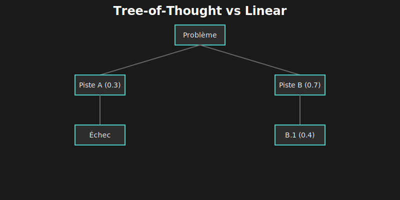

# 🌳 Chapitre 4 : Tree-of-Thought (ToT)

---

## 🎬 Scène d'ouverture : L'Impasse du Raisonnement Linéaire

*Lina fixait son écran depuis une heure. Le test échouait de manière intermittente — parfois il passait, parfois non. Son chatbot avait déjà proposé trois solutions... qui n'avaient rien résolu.*

— "C'est comme si tu tirais au hasard," soupira-t-elle en fermant la quatrième suggestion inutile.

Elle se leva et alla au tableau blanc. Comment résoudrait-elle ce problème elle-même ?

Elle commença à écrire :
- **Hypothèse 1** : Race condition ?
- **Hypothèse 2** : État partagé corrompu ?
- **Hypothèse 3** : Timing du mock ?
- **Hypothèse 4** : Fuite de mémoire entre tests ?

Puis elle nota des scores à côté de chaque hypothèse :
- Race condition : **80%** (comportement aléatoire classique)
- État partagé : **60%** (possible mais les tests sont isolés)
- Timing mock : **40%** (peu probable, les mocks sont synchrones)
- Fuite mémoire : **20%** (les tests sont courts)

Elle commença à explorer la piste de la race condition, généra des sous-hypothèses, en évalua certaines, en abandonna d'autres...

— "C'est ça," réalisa-t-elle soudain. "Je ne pense pas en ligne droite. Je pense en **arbre**. J'explore plusieurs chemins, j'évalue lesquels sont prometteurs, et j'abandonne les impasses."

Elle retourna à son code.

— "Et si je t'apprenais à faire pareil ?"

---

## 🎯 4.1 Le Problème du Raisonnement Linéaire

### 4.1.1 🔗 La Limite Fondamentale

Les LLMs génèrent du texte **token par token**, chaque token dépendant des précédents. C'est la génération autorégressive.

```
┌─────────────────────────────────────────────────────────────────────┐
│                    🔗 GÉNÉRATION AUTORÉGRESSIVE                     │
├─────────────────────────────────────────────────────────────────────┤
│                                                                      │
│  "Le problème est que" → P(token₁) → "la" →                        │
│    P(token₂|token₁) → "fonction" →                                  │
│      P(token₃|token₁,token₂) → "retourne" → ...                     │
│                                                                      │
│  ┌─────────────────────────────────────────────────────────────┐   │
│  │  ✅ FORCE : Cohérence locale                                │   │
│  │     Chaque token est cohérent avec son contexte immédiat    │   │
│  └─────────────────────────────────────────────────────────────┘   │
│                                                                      │
│  ┌─────────────────────────────────────────────────────────────┐   │
│  │  ❌ FAIBLESSE : Pas de vision globale                       │   │
│  │     Le modèle ne peut pas "voir" où mène un chemin          │   │
│  │     avant de s'y engager complètement                       │   │
│  └─────────────────────────────────────────────────────────────┘   │
│                                                                      │
│  Si le modèle s'engage sur une mauvaise piste au token 50,         │
│  il doit continuer sur cette piste jusqu'à la fin.                 │
│  PAS DE RETOUR EN ARRIÈRE POSSIBLE.                                │
│                                                                      │
└─────────────────────────────────────────────────────────────────────┘
```

### 4.1.2 🎮 Exemple Concret : Le Game of 24

Le **Game of 24** est un benchmark classique : utiliser quatre nombres avec +, -, ×, ÷ pour obtenir 24.



### 4.1.3 🧠 Pourquoi Ça Marche

ToT imite le raisonnement humain naturel :

| 🧠 Ce que fait l'humain | 🌳 Ce que fait ToT |
|:------------------------|:-------------------|
| "Et si j'essayais X ?" | Générer N pensées candidates |
| "Cette piste a l'air prometteuse" | Scorer chaque pensée (0-1) |
| "Je continue sur celle-ci" | Sélectionner les meilleures |
| "Non, mauvaise idée, revenons" | Élaguer et backtracker |

> 💡 **Insight clé** : Les humains ne pensent pas en ligne droite. Ils explorent, évaluent, abandonnent, recommencent. ToT donne cette capacité aux LLMs.

---

## 📐 4.2 L'Algorithme Tree-of-Thought

### 4.2.1 🏗️ Structure de Données

Chaque pensée est un **nœud** dans un arbre :

```typescript
interface ThoughtNode {
  id: string;
  content: string;           // Le contenu de cette pensée
  score: number;             // Évaluation de la promesse (0-1)
  depth: number;             // Profondeur dans l'arbre
  parent: ThoughtNode | null;
  children: ThoughtNode[];
  state: 'pending' | 'expanded' | 'pruned' | 'solution';
  metadata: {
    generatedAt: Date;
    evaluatedBy: 'self' | 'vote' | 'execution';
    confidence: number;
  };
}

interface ThoughtTree {
  root: ThoughtNode;
  problem: string;
  maxDepth: number;
  branchingFactor: number;   // Combien d'enfants par nœud
  solutions: ThoughtNode[];  // Solutions trouvées
}
```

### 4.2.2 🔄 Les Quatre Phases

```
┌─────────────────────────────────────────────────────────────────────┐
│                    🔄 ALGORITHME TREE-OF-THOUGHT                    │
├─────────────────────────────────────────────────────────────────────┤
│                                                                      │
│  📋 PHASE 1 : DÉCOMPOSITION                                         │
│  ┌─────────────────────────────────────────────────────────────┐    │
│  │  Identifier les étapes du problème                          │    │
│  │  "Pour débugger, je dois : localiser → comprendre → corriger"│    │
│  │                                                              │    │
│  │  Input : "Corrige le bug dans calculateTotal"               │    │
│  │  Output : ["localiser le bug", "comprendre la cause",       │    │
│  │           "implémenter le fix", "vérifier avec tests"]      │    │
│  └─────────────────────────────────────────────────────────────┘    │
│                               │                                      │
│                               ▼                                      │
│  🌱 PHASE 2 : GÉNÉRATION                                            │
│  ┌─────────────────────────────────────────────────────────────┐    │
│  │  Pour chaque nœud, générer N pensées candidates             │    │
│  │                                                              │    │
│  │  Nœud actuel : "Localiser le bug"                           │    │
│  │  Pensées générées :                                         │    │
│  │    → Pensée 1 : "Vérifier les logs"                         │    │
│  │    → Pensée 2 : "Analyser le stack trace"                   │    │
│  │    → Pensée 3 : "Ajouter des console.log"                   │    │
│  │    → Pensée 4 : "Utiliser le debugger"                      │    │
│  └─────────────────────────────────────────────────────────────┘    │
│                               │                                      │
│                               ▼                                      │
│  ⚖️ PHASE 3 : ÉVALUATION                                            │
│  ┌─────────────────────────────────────────────────────────────┐    │
│  │  Scorer chaque pensée (0-1)                                 │    │
│  │                                                              │    │
│  │    → "Vérifier les logs" : 0.8 (souvent utile)              │    │
│  │    → "Analyser stack trace" : 0.9 (erreur avec trace)       │    │
│  │    → "console.log" : 0.5 (basique mais lent)                │    │
│  │    → "Debugger" : 0.7 (puissant mais setup requis)          │    │
│  └─────────────────────────────────────────────────────────────┘    │
│                               │                                      │
│                               ▼                                      │
│  ✂️ PHASE 4 : SÉLECTION                                             │
│  ┌─────────────────────────────────────────────────────────────┐    │
│  │  Garder les K meilleures pensées, élaguer le reste          │    │
│  │                                                              │    │
│  │    ✅ Garde : "stack trace" (0.9), "logs" (0.8)             │    │
│  │    ❌ Élague : "console.log" (0.5), "debugger" (0.7)        │    │
│  │                                                              │    │
│  │  → Continue avec les branches sélectionnées                 │    │
│  └─────────────────────────────────────────────────────────────┘    │
│                               │                                      │
│                               ▼                                      │
│                    🔁 Répéter jusqu'à :                              │
│                       • Solution trouvée (score ≥ 0.9)              │
│                       • Profondeur max atteinte                     │
│                       • Toutes branches élaguées                    │
│                                                                      │
└─────────────────────────────────────────────────────────────────────┘
```

### 4.2.3 🌲 Visualisation d'un Arbre

```
┌─────────────────────────────────────────────────────────────────────┐
│                    🌲 EXEMPLE D'ARBRE ToT                           │
├─────────────────────────────────────────────────────────────────────┤
│                                                                      │
│                    "Corriger le bug NaN"                            │
│                           │                                          │
│         ┌─────────────────┼─────────────────┐                       │
│         │                 │                 │                        │
│         ▼                 ▼                 ▼                        │
│    ┌─────────┐      ┌─────────┐      ┌─────────┐                    │
│    │"Division│      │"Input   │      │"Type    │                    │
│    │ par 0"  │      │undefined│      │ coercion│                    │
│    │  (0.9)  │      │  (0.7)  │      │  (0.4)  │                    │
│    └────┬────┘      └────┬────┘      └────┬────┘                    │
│         │                │               ✗ élagué                    │
│    ┌────┴────┐      ┌────┴────┐                                     │
│    │         │      │         │                                      │
│    ▼         ▼      ▼         ▼                                      │
│ ┌──────┐ ┌──────┐ ┌──────┐ ┌──────┐                                │
│ │price │ │qty=0?│ │arg1? │ │arg2? │                                │
│ │ =0?  │ │      │ │      │ │      │                                │
│ │(0.95)│ │(0.85)│ │(0.6) │ │(0.5) │                                │
│ └──┬───┘ └──────┘ └──────┘ └──────┘                                │
│    │                                                                 │
│    ▼                                                                 │
│ ┌──────────────────────────────────┐                                │
│ │ ✅ SOLUTION TROUVÉE !            │                                │
│ │                                  │                                │
│ │ Ligne 45 : `total / price`       │                                │
│ │ Fix : if (price === 0) return 0  │                                │
│ │ Score : 0.98                     │                                │
│ └──────────────────────────────────┘                                │
│                                                                      │
└─────────────────────────────────────────────────────────────────────┘
```

---

## 🧭 4.3 Les Stratégies de Recherche

Il existe plusieurs façons de parcourir l'arbre. Le choix de la stratégie impacte fortement les résultats.

### 4.3.1 📊 Comparaison des Stratégies

| 🧭 Stratégie | 📝 Description | ✅ Avantages | ⚠️ Inconvénients |
|:-------------|:---------------|:-------------|:-----------------|
| **BFS** | Explorer tous les nœuds d'un niveau avant le suivant | Ne rate pas de solution proche | Coûteux en mémoire et appels |
| **DFS** | Explorer une branche jusqu'au bout | Économe en mémoire | Peut s'enliser dans une impasse |
| **Beam** | Garder les K meilleurs à chaque niveau | Bon compromis | Peut élaguer une bonne branche |

### 4.3.2 📐 Breadth-First Search (BFS)

```
┌─────────────────────────────────────────────────────────────────────┐
│                    📐 BREADTH-FIRST SEARCH                          │
├─────────────────────────────────────────────────────────────────────┤
│                                                                      │
│                        Problème                                     │
│                           │                                          │
│         ┌─────────────────┼─────────────────┐                       │
│         │                 │                 │                        │
│      Pensée 1         Pensée 2         Pensée 3    ◄── Niveau 1     │
│         │                 │                 │          (complet)     │
│     ┌───┴───┐         ┌───┴───┐         ┌───┴───┐                   │
│    1.1    1.2        2.1    2.2        3.1    3.2  ◄── Niveau 2     │
│                                                        (complet)     │
│                                                                      │
│  🔄 Ordre d'exploration : 1 → 2 → 3 → 1.1 → 1.2 → 2.1 → ...        │
│                                                                      │
│  ✅ Garantit de trouver la solution la plus proche de la racine    │
│  ❌ Explore beaucoup de nœuds avant d'aller en profondeur          │
│                                                                      │
└─────────────────────────────────────────────────────────────────────┘
```

### 4.3.3 📏 Depth-First Search (DFS)

```
┌─────────────────────────────────────────────────────────────────────┐
│                    📏 DEPTH-FIRST SEARCH                            │
├─────────────────────────────────────────────────────────────────────┤
│                                                                      │
│                        Problème                                     │
│                           │                                          │
│                       Pensée 1  ◄── Exploré en premier              │
│                           │                                          │
│                         1.1                                         │
│                           │                                          │
│                        1.1.1    ◄── Profondeur max                  │
│                           │                                          │
│                   (backtrack vers 1.2, puis Pensée 2)               │
│                                                                      │
│  🔄 Ordre d'exploration : 1 → 1.1 → 1.1.1 → backtrack → 1.2 → ...  │
│                                                                      │
│  ✅ Trouve rapidement des solutions profondes                       │
│  ❌ Peut explorer une longue branche inutile                        │
│                                                                      │
└─────────────────────────────────────────────────────────────────────┘
```

### 4.3.4 ⭐ Beam Search (Recommandé)

```
┌─────────────────────────────────────────────────────────────────────┐
│                    ⭐ BEAM SEARCH (K=2)                              │
├─────────────────────────────────────────────────────────────────────┤
│                                                                      │
│                        Problème                                     │
│                           │                                          │
│         ┌─────────────────┼─────────────────┐                       │
│         │                 │                 │                        │
│      P1(0.9) ✅       P2(0.7) ✅       P3(0.4) ❌                    │
│         │                 │              élagué                      │
│     ┌───┴───┐         ┌───┴───┐                                     │
│  1.1(0.85)✅ 1.2(0.5)❌ 2.1(0.6)✅ 2.2(0.3)❌                        │
│         │              élagué        │      élagué                  │
│        ...                         ...                              │
│                                                                      │
│  🔄 À chaque niveau : garde les K=2 meilleurs, élague le reste     │
│                                                                      │
│  ✅ Bon compromis exploration/exploitation                          │
│  ✅ Limite le nombre de nœuds (économie d'appels API)              │
│  ⚠️ Peut élaguer une branche qui deviendrait excellente plus tard  │
│                                                                      │
└─────────────────────────────────────────────────────────────────────┘
```

### 4.3.5 🎯 Configuration Recommandée par Tâche

| 🎯 Type de Tâche | 🧭 Stratégie | 🌿 Branching | 📏 Depth | 📊 Beam |
|:-----------------|:-------------|:------------:|:--------:|:-------:|
| Bug simple | BFS | 3 | 2 | 3 |
| Bug complexe | Beam | 4 | 4 | 3 |
| Refactoring | DFS | 2 | 6 | 2 |
| Architecture | Beam | 5 | 3 | 4 |
| Optimisation | Beam | 4 | 5 | 3 |

---

## ⚖️ 4.4 L'Évaluation des Pensées

L'évaluation est **critique** — une mauvaise évaluation mène à de mauvaises décisions d'élagage.

### 4.4.1 📊 Trois Méthodes d'Évaluation

| 🔧 Méthode | 📝 Description | ✅ Avantages | ⚠️ Inconvénients |
|:-----------|:---------------|:-------------|:-----------------|
| **Self** | Le LLM évalue ses propres pensées | Simple, un seul appel | Biais vers ses propres idées |
| **Vote** | Plusieurs évaluations, puis moyenne | Plus robuste | Plus d'appels API |
| **Execution** | Exécuter le code et vérifier | Objectif, précis | Seulement pour le code |

### 4.4.2 🤖 Auto-évaluation (Self)

```typescript
async function selfEvaluate(thought: ThoughtNode, problem: string): Promise<number> {
  const prompt = `
    Problème original : ${problem}

    Pensée à évaluer : ${thought.content}

    Évalue cette pensée sur une échelle de 0 à 1 :
    - 0.0-0.2 : Hors sujet ou fausse
    - 0.3-0.4 : Peu prometteuse
    - 0.5-0.6 : Pertinente, mérite exploration
    - 0.7-0.8 : Prometteuse, probablement sur la bonne piste
    - 0.9-1.0 : Excellente, très probablement la solution

    Réponds avec un seul nombre entre 0 et 1.
  `;

  const response = await llm.complete(prompt);
  return parseFloat(response);
}
```

### 4.4.3 🗳️ Évaluation par Vote

```typescript
async function voteEvaluate(
  thought: ThoughtNode,
  problem: string,
  numVotes: number = 3
): Promise<number> {
  const scores: number[] = [];

  // Générer plusieurs évaluations indépendantes
  for (let i = 0; i < numVotes; i++) {
    const score = await selfEvaluate(thought, problem);
    scores.push(score);
  }

  // Moyenne (ou médiane pour plus de robustesse)
  return scores.reduce((a, b) => a + b, 0) / scores.length;
}
```

### 4.4.4 ⚡ Évaluation par Exécution (Pour le Code)

La **meilleure** évaluation pour du code : l'exécuter et vérifier !

```typescript
async function executionEvaluate(
  thought: ThoughtNode,
  context: CodeContext
): Promise<number> {
  // Extraire le code de la pensée
  if (!thought.content.includes('```')) {
    return selfEvaluate(thought, context.problem);
  }

  const code = extractCode(thought.content);

  try {
    // Exécuter dans une sandbox
    await sandbox.execute(code);

    // Vérifier contre les tests
    const testResult = await runTests(context.tests);

    if (testResult.allPassed) {
      return 1.0;  // 🎯 Solution !
    }

    // Score proportionnel aux tests passés
    return testResult.passed / testResult.total;
  } catch (error) {
    // Erreur de syntaxe ou d'exécution
    return 0.1;
  }
}
```

---

## 💻 4.5 Implémentation Grok-CLI

### 4.5.1 📁 Architecture du Module

```
src/agent/reasoning/
├── index.ts                 # Point d'entrée, export
├── tree-of-thought.ts       # 🌳 Implémentation principale
├── thought-generator.ts     # 🌱 Génération de pensées
├── thought-evaluator.ts     # ⚖️ Évaluation
├── search-strategies.ts     # 🧭 BFS, DFS, Beam
├── types.ts                 # 📐 Types TypeScript
└── prompts/
    ├── decompose.ts         # Prompts de décomposition
    ├── generate.ts          # Prompts de génération
    └── evaluate.ts          # Prompts d'évaluation
```

### 4.5.2 💻 Code Principal (Simplifié)

```typescript
// src/agent/reasoning/tree-of-thought.ts
export class TreeOfThought {
  private llm: LLMClient;
  private config: ToTConfig;

  constructor(llm: LLMClient, config: Partial<ToTConfig> = {}) {
    this.llm = llm;
    this.config = {
      maxDepth: config.maxDepth ?? 4,
      branchingFactor: config.branchingFactor ?? 3,
      beamWidth: config.beamWidth ?? 3,
      threshold: config.threshold ?? 0.3,
      maxSolutions: config.maxSolutions ?? 1,
      searchStrategy: config.searchStrategy ?? 'beam',
      evaluationMethod: config.evaluationMethod ?? 'self',
      ...config
    };
  }

  async solve(problem: string): Promise<Solution[]> {
    // 1. Créer la racine
    const root = this.createNode(problem, 0);

    // 2. Décomposer le problème
    const decomposition = await this.decompose(problem);

    // 3. Exécuter la recherche
    const solutions = await this.search(root, decomposition);

    // 4. Trier par score et retourner
    return solutions
      .sort((a, b) => b.score - a.score)
      .map(node => ({
        path: this.getPath(node),
        content: node.content,
        score: node.score
      }));
  }

  private async search(root: ThoughtNode, decomp: Decomposition): Promise<ThoughtNode[]> {
    const solutions: ThoughtNode[] = [];
    const frontier: ThoughtNode[] = [root];

    while (frontier.length > 0 && solutions.length < this.config.maxSolutions) {
      // Sélectionner le prochain nœud selon la stratégie
      const node = this.selectNext(frontier);
      if (!node) break;

      // Profondeur max atteinte ?
      if (node.depth >= this.config.maxDepth) {
        if (node.score >= 0.7) solutions.push(node);
        continue;
      }

      // PHASE 2 : Générer des enfants
      const children = await this.generateThoughts(node);

      // PHASE 3 : Évaluer
      for (const child of children) {
        child.score = await this.evaluateThought(child, root.content);
      }

      // PHASE 4 : Sélectionner les meilleurs (beam)
      const selected = children
        .filter(c => c.score >= this.config.threshold)
        .sort((a, b) => b.score - a.score)
        .slice(0, this.config.beamWidth);

      // Ajouter à la frontière
      node.children = selected;
      frontier.push(...selected);

      // Early stopping : solution excellente trouvée
      for (const child of selected) {
        if (child.score >= 0.95) {
          solutions.push(child);
        }
      }
    }

    return solutions;
  }
}
```

### 4.5.3 🔗 Intégration avec les Thinking Keywords

```typescript
// src/agent/thinking-keywords.ts
export class ThinkingKeywordsManager {
  private tot: TreeOfThought;

  async processWithThinking(message: string, level: ThinkingLevel): Promise<string> {
    switch (level) {
      case ThinkingLevel.DIRECT:
        return message; // Pas de ToT

      case ThinkingLevel.CHAIN_OF_THOUGHT:
        return this.chainOfThought(message); // CoT simple

      case ThinkingLevel.TREE_OF_THOUGHT: // "megathink"
        const solutions = await this.tot.solve(message);
        return this.formatResult(solutions);

      case ThinkingLevel.MCTS: // "ultrathink" - chapitre suivant
        return this.mctsThink(message);
    }
  }

  private formatResult(solutions: Solution[]): string {
    if (solutions.length === 0) {
      return "Je n'ai pas trouvé de solution satisfaisante.";
    }

    const best = solutions[0];
    return `
## 🧠 Raisonnement

${best.path.map((p, i) => `${'  '.repeat(i)}→ ${p}`).join('\n')}

## ✅ Solution (confiance: ${(best.score * 100).toFixed(0)}%)

${best.content}
    `.trim();
  }
}
```

---

## 🎬 4.6 Cas Pratiques

### 4.6.1 🐛 Cas 1 : Debugging d'une Fonction

```
┌─────────────────────────────────────────────────────────────────────┐
│  🐛 PROBLÈME : "calculateDiscount retourne parfois NaN"             │
├─────────────────────────────────────────────────────────────────────┤
│                                                                      │
│  🌳 EXPLORATION ToT :                                               │
│                                                                      │
│  Niveau 1 : Hypothèses initiales                                    │
│  ├─ (0.8) "NaN vient souvent de division par 0"                    │
│  ├─ (0.7) "Peut-être un undefined dans les inputs"                 │
│  ├─ (0.5) "Conversion de type échouée"                             │
│  └─ (0.4) "Problème d'arrondi flottant" ❌ élagué                  │
│                                                                      │
│  Niveau 2 : Développement "Division par 0"                          │
│  ├─ "Division par 0"                                                │
│  │   ├─ (0.85) "Vérifier si price peut être 0"                     │
│  │   ├─ (0.75) "Vérifier si quantity peut être 0"                  │
│  │   └─ (0.60) "Vérifier le diviseur dans la formule"              │
│                                                                      │
│  Niveau 3 : Investigation ciblée                                    │
│  ├─ "Vérifier si price peut être 0"                                │
│  │   ├─ (0.95) "Lire la fonction, chercher division par price"     │
│  │   └─ → 🎯 TROUVÉ : `total / price` sans garde !                 │
│                                                                      │
│  ✅ SOLUTION : Ajouter `if (price === 0) return 0;`                │
│                                                                      │
└─────────────────────────────────────────────────────────────────────┘
```

### 4.6.2 🏗️ Cas 2 : Refactoring d'Architecture

```
┌─────────────────────────────────────────────────────────────────────┐
│  🏗️ PROBLÈME : "Refactorer UserService en modules séparés"         │
├─────────────────────────────────────────────────────────────────────┤
│                                                                      │
│  🌳 EXPLORATION ToT :                                               │
│                                                                      │
│  Niveau 1 : Stratégies de découpage                                 │
│  ├─ (0.8) "Découper par domaine (auth, profile, settings)"         │
│  ├─ (0.7) "Découper par couche (controller, service, repo)"        │
│  ├─ (0.6) "Découper par feature (login, signup, password)"         │
│  └─ (0.5) "Microservices complets" ❌ élagué (overkill)            │
│                                                                      │
│  Niveau 2 : Développement "par domaine"                             │
│  ├─ AuthModule                                                      │
│  │   ├─ (0.9) "login, logout, validateToken, refreshToken"         │
│  │   └─ Dépendances : UserRepository, TokenService                 │
│  ├─ ProfileModule                                                   │
│  │   ├─ (0.85) "getProfile, updateProfile, uploadAvatar"           │
│  │   └─ Dépendances : UserRepository, StorageService               │
│  └─ SettingsModule                                                  │
│      ├─ (0.80) "getSettings, updateSettings, deleteAccount"        │
│      └─ Dépendances : UserRepository, NotificationService          │
│                                                                      │
│  Niveau 3 : Plan d'implémentation                                   │
│  ├─ Ordre : Auth (critique) → Profile → Settings                   │
│  ├─ Migration : progressive avec feature flags                     │
│  └─ Tests : ajouter tests d'intégration inter-modules              │
│                                                                      │
│  ✅ SOLUTION : Plan de refactoring en 3 phases                     │
│                                                                      │
└─────────────────────────────────────────────────────────────────────┘
```

### 4.6.3 ⚡ Cas 3 : Optimisation de Performance

```
┌─────────────────────────────────────────────────────────────────────┐
│  ⚡ PROBLÈME : "L'API /users est lente (2s de latence)"            │
├─────────────────────────────────────────────────────────────────────┤
│                                                                      │
│  🌳 EXPLORATION ToT :                                               │
│                                                                      │
│  Niveau 1 : Sources de lenteur possibles                            │
│  ├─ (0.85) "Query N+1 sur la base de données"                      │
│  ├─ (0.75) "Pas de cache"                                          │
│  ├─ (0.65) "Serialisation JSON lourde"                             │
│  ├─ (0.55) "Trop de données retournées"                            │
│  └─ (0.40) "Connexion DB non poolée" ❌ élagué                     │
│                                                                      │
│  Niveau 2 : Investigation "Query N+1"                               │
│  ├─ (0.90) "Logger les queries SQL"                                │
│  │   └─ 📊 Résultat : 47 queries pour 10 users !                   │
│  └─ (0.85) "Vérifier les relations Prisma/ORM"                     │
│      └─ 📊 Résultat : `include` manquant sur posts, comments       │
│                                                                      │
│  Niveau 3 : Solution                                                │
│  ├─ Fix : `include: { posts: true, comments: { take: 5 } }`        │
│  ├─ Résultat : 3 queries au lieu de 47                             │
│  └─ Latence : 2s → 200ms (🚀 10× plus rapide !)                    │
│                                                                      │
│  ✅ SOLUTION : Eager loading des relations avec limite             │
│                                                                      │
└─────────────────────────────────────────────────────────────────────┘
```

---

## ⚙️ 4.7 Optimisations et Bonnes Pratiques

### 4.7.1 📊 Réduire les Appels API

```typescript
// ❌ Évaluation individuelle : N appels
for (const thought of thoughts) {
  thought.score = await evaluate(thought); // 1 appel par pensée
}

// ✅ Évaluation batch : 1 appel pour N pensées
async function batchEvaluate(thoughts: ThoughtNode[], problem: string): Promise<void> {
  const prompt = `
    Problème : ${problem}

    Évalue chacune de ces pensées (0-1) :
    ${thoughts.map((t, i) => `${i + 1}. ${t.content}`).join('\n')}

    Réponds en JSON : { "scores": [0.8, 0.5, ...] }
  `;

  const response = await llm.complete(prompt);
  const { scores } = JSON.parse(response);

  thoughts.forEach((t, i) => { t.score = scores[i] ?? 0.5; });
}
```

### 4.7.2 🏃 Early Stopping

```typescript
// Arrêter si on trouve une excellente solution tôt
if (node.score >= 0.95 && await verifySolution(node)) {
  return [node]; // 🎯 Pas besoin d'explorer plus !
}
```

### 4.7.3 💾 Cache des Pensées Similaires

```typescript
const thoughtCache = new Map<string, number>();

async function evaluateWithCache(thought: ThoughtNode): Promise<number> {
  const key = thought.content.toLowerCase().trim();

  if (thoughtCache.has(key)) {
    return thoughtCache.get(key)!; // Cache hit !
  }

  const score = await evaluate(thought);
  thoughtCache.set(key, score);
  return score;
}
```

### 4.7.4 📏 Profondeur Adaptative

```typescript
function adaptDepth(problem: string): number {
  const complexityIndicators = [
    'architecture', 'refactor', 'optimize',
    'debug intermittent', 'race condition'
  ];

  const isComplex = complexityIndicators.some(ind =>
    problem.toLowerCase().includes(ind)
  );

  return isComplex ? 6 : 3; // Plus profond si complexe
}
```

---

## ⚠️ 4.8 Limitations : Quand Ne Pas Utiliser ToT

### 4.8.1 💰 Le Coût

ToT multiplie les appels API :

| Configuration | Appels max | Coût estimé |
|:--------------|:----------:|:-----------:|
| Branching=3, Depth=4 | 3⁴ = 81 | ~$0.40 |
| Branching=4, Depth=4 | 4⁴ = 256 | ~$1.30 |
| + Évaluations | ×2 | ×2 |

> ⚠️ **Règle** : N'utilisez ToT que si le problème justifie le coût.

### 4.8.2 🚫 Tâches Inadaptées

| 🎯 Tâche | ToT ? | Raison |
|:---------|:-----:|:-------|
| "Quelle heure est-il ?" | ❌ | Trivial, pas d'ambiguïté |
| "Crée un fichier README" | ❌ | Pas d'exploration nécessaire |
| "Formatte ce JSON" | ❌ | Déterministe |
| "Corrige ce bug de race condition" | ✅ | Plusieurs hypothèses à explorer |
| "Optimise cette architecture" | ✅ | Trade-offs complexes |
| "Debug ce crash aléatoire" | ✅ | Causes multiples possibles |

### 4.8.3 🌀 Risque de Sur-exploration

ToT peut partir dans des directions absurdes si mal configuré :

```
Problème : "Ajoute un bouton"

ToT mal configuré :
├─ "Créer un bouton HTML"
│   ├─ "Avec quelle couleur ?"
│   │   ├─ "Rouge symbolise l'action"
│   │   ├─ "Bleu inspire confiance"
│   │   │   ├─ "Bleu clair ou foncé ?"
│   │   │   │   ├─ ... (exploration inutile !)
```

**Solutions** :
- Seuil de score élevé (0.5+)
- Early stopping agressif
- Limite de profondeur stricte

---

## 📝 4.9 Points Clés à Retenir

### 🎯 Sur le Problème

| Concept | Point clé |
|:--------|:----------|
| **Limite linéaire** | Le raisonnement token-by-token ne backtrack pas |
| **Conséquence** | Une erreur précoce se propage jusqu'à la fin |
| **Humain vs LLM** | Les humains explorent naturellement plusieurs pistes |

### 🌳 Sur Tree-of-Thought

| Concept | Point clé |
|:--------|:----------|
| **4 phases** | Décomposer → Générer → Évaluer → Sélectionner |
| **Stratégies** | BFS (exhaustif), DFS (profond), Beam (compromis) |
| **Évaluation** | Self (simple), Vote (robuste), Execution (objectif) |
| **Amélioration** | Game of 24 : 7% → 74% (+10×) |

### ⚙️ Sur l'Implémentation

| Concept | Point clé |
|:--------|:----------|
| **Fichier** | `src/agent/reasoning/tree-of-thought.ts` |
| **Activation** | Mot-clé "megathink" ou détection auto |
| **Optimisations** | Batch eval, cache, early stopping |
| **Coût** | Multiplié par branching × depth |

---

## 🏋️ 4.10 Exercices

### Exercice 1 : Visualisation (30 min)

Ajoutez une méthode `visualize()` qui affiche l'arbre en ASCII :
```
root
├── [0.9] pensée 1
│   ├── [0.85] pensée 1.1
│   └── [0.6] pensée 1.2
└── [0.7] pensée 2
```

### Exercice 2 : Benchmark (1h)

Comparez CoT vs ToT sur 5 bugs de votre codebase :
- Mesurez le taux de succès
- Comptez les appels API
- Calculez le coût

### Exercice 3 : Batch Evaluation (30 min)

Implémentez le batching d'évaluations et mesurez :
- Réduction du nombre d'appels
- Impact sur la qualité des scores

### Exercice 4 : Persistance (45 min)

Ajoutez la possibilité de sauvegarder et reprendre un arbre partiellement exploré (utile pour les problèmes longs).

---

## 📚 4.11 Pour Aller Plus Loin

### Publications

- Yao, S., et al. (2023). "Tree of Thoughts: Deliberate Problem Solving with Large Language Models." arXiv:2305.10601
- Long, J. (2023). "Large Language Model Guided Tree-of-Thought." arXiv:2305.08291

### Code Source

- Grok-CLI : `src/agent/reasoning/tree-of-thought.ts`
- Types : `src/agent/reasoning/types.ts`

---

## 🌅 Épilogue : La Première Victoire

Lina activa ToT sur son bug intermittent.

L'arbre se construisit sous ses yeux :
- Hypothèse "race condition" : score 0.85
- Sous-hypothèse "accès concurrent à la variable partagée" : score 0.92
- Solution proposée : "ajouter un mutex" : score 0.95

Elle appliqua le fix. Les tests passèrent. Dix fois de suite.

— "Enfin," souffla-t-elle.

Marc passa la tête par la porte.

— "T'as résolu le bug mystère ?"

— "Mieux. J'ai appris à l'agent à réfléchir comme moi. À explorer plusieurs pistes, à les évaluer, à abandonner les impasses."

— "Et maintenant ?"

Lina sourit.

— "Maintenant, on passe à la vitesse supérieure. MCTS — Monte-Carlo Tree Search. L'algorithme qui a battu les champions du monde de Go."

---

| ⬅️ Précédent | 📖 Sommaire | ➡️ Suivant |
|:-------------|:-----------:|:-----------|
| [Anatomie d'un Agent](03-anatomie-agent.md) | [Index](README.md) | [Monte-Carlo Tree Search](05-mcts.md) |
