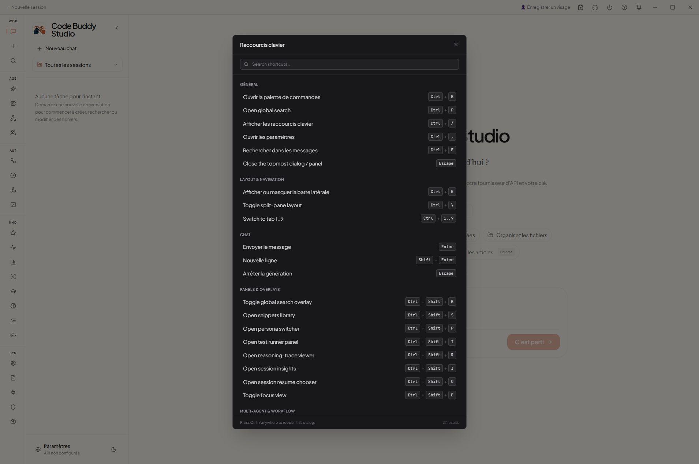
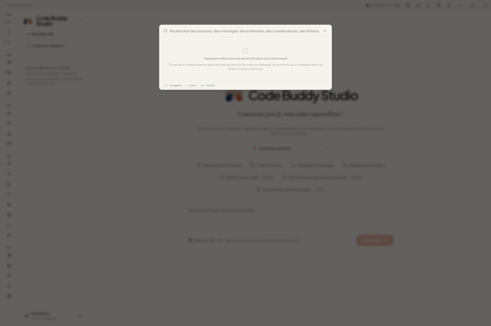
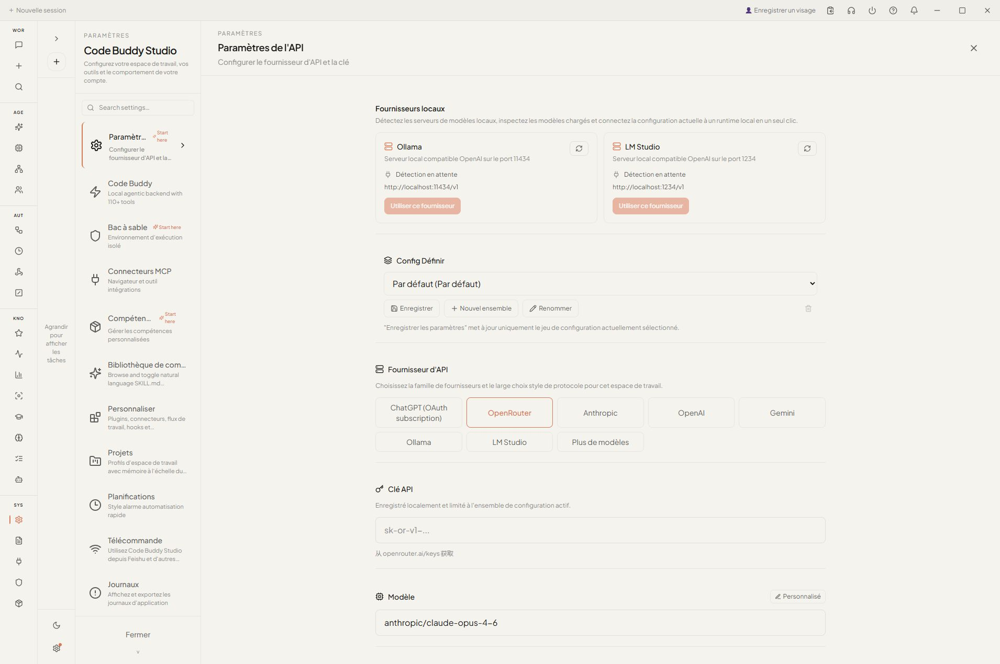
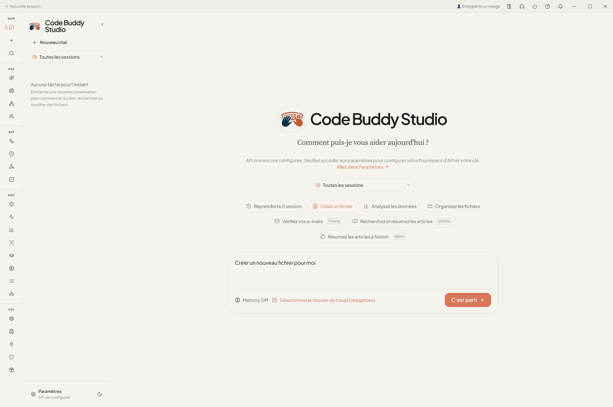
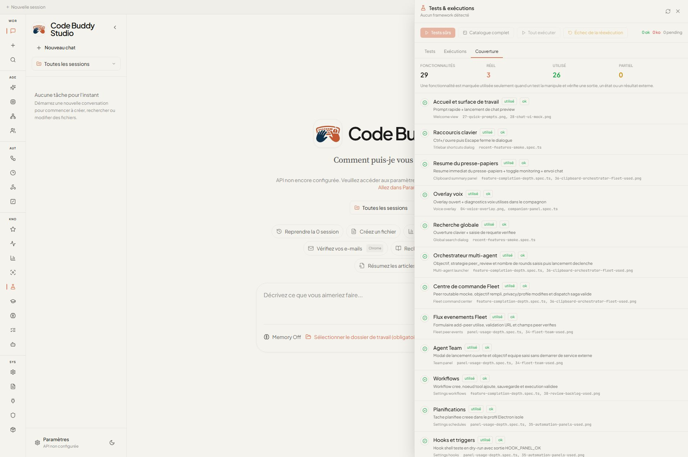

# Code Buddy Studio - QA fonctionnelle avec preuves

Date du controle : 26 mai 2026, 16:49 Europe/Paris
Application testee : Code Buddy Studio, preview locale `http://127.0.0.1:4177/`
Rapport machine : [`feature-qa-report.json`](./feature-qa-report.json)
Captures : [`screenshots/`](./screenshots/)

## Synthese

29 fonctionnalites visibles de Code Buddy Studio ont ete ouvertes et verifiees par un signal stable (`data-testid`, texte visible, champ actif ou message rendu). La matrice de couverture ne contient plus de surface simplement affichee : 3 preuves en conditions reelles, 26 preuves d'utilisation E2E et 0 fonctionnalite partielle.

La verification couvre le rendu, l'ouverture des surfaces utilisateur, le chat UI, le pont IPC Electron de chat, le mode compagnon deterministe et le mode compagnon live avec IPC coeur et surfaces materiel/locales. Le provider demande a aussi ete teste avec de vrais appels ChatGPT `gpt-5.5` : provider direct, streaming, tool-call, CLI, serveur HTTP compatible OpenAI et Cowork/Electron. Les surfaces dependantes d'une configuration distante (mesh Fleet reel, serveur MCP distant, workflows destructifs) ont maintenant un parcours local non destructif valide ; leur execution contre des services de production reste a rejouer avec les secrets et services correspondants.

Verification complementaire :

- Auth ChatGPT : `node dist\index.js whoami` OK, compte redige, plan `pro` confirme.
- Provider direct ChatGPT `gpt-5.5` : chat non-stream OK (`REAL-GPT55-PROVIDER-DIRECT`, 1883 ms), stream OK (`REAL-GPT55-STREAM-DIRECT`, 9 chunks, 2269 ms), tool-call OK (`qa_probe`, puis `REAL-GPT55-TOOL-ROUNDTRIP`, 2499 ms).
- CLI reel `gpt-5.5` : texte OK (`REAL-GPT55-CLI-FILE2`, ~27 s), JSON OK (`REAL-GPT55-CLI-JSON`, ~30 s), stream-json OK (`REAL-GPT55-CLI-STREAMJSON`), `view_file` OK (`REAL-GPT55-VIEW-FILE:1.0.0-rc.5`), `bash` OK (`REAL-GPT55-BASH-OK`).
- CLI headless erreur provider : `npm test -- tests/cli/cli-flags.test.ts tests/cli/headless-exit-code.test.ts --run` OK (23 tests). Le test lance vraiment `src/index.ts --prompt ... --quiet --output-format json` contre un provider HTTP local qui renvoie `500 qa forced provider failure` ; la sortie JSON conserve l'erreur et le process termine maintenant en exit code `1`.
- Serveur HTTP reel `gpt-5.5` : `CODEBUDDY_REAL_GPT55_SERVER=1 npm test -- tests/server/chat-route-real-gpt55.test.ts --run` OK. Le vrai serveur Express local passe `/api/chat`, `/api/chat` en SSE, `/api/chat/completions` et `/api/chat/models` via ChatGPT OAuth avec les marqueurs `REAL-GPT55-SERVER-CHAT-ROUTE`, `REAL-GPT55-SERVER-STREAM-ROUTE` et `REAL-GPT55-SERVER-COMPAT-ROUTE`.
- Erreurs provider exposees par le serveur HTTP : `npm test -- tests/server/chat-route-provider-error.test.ts tests/server/chat-route-real-http.test.ts --run` OK (2 fichiers, 5 tests). Les routes `/api/chat` et `/api/chat/completions` conservent maintenant les statuts exploitables : provider `429` -> HTTP `429`, code `RATE_LIMITED`, `Retry-After: 17`, details `providerStatus`; provider `503` -> HTTP `503`, type OpenAI-compatible `server_error`; le rate-limit serveur local reste distinct. La ligne `Server / provider error status bundle` du panneau lance aussi ce bundle depuis l'UI et affiche `4 ok / 0 ko`, capture `92-test-runner-server-provider-error-status-bundle.png`.
- Cowork/Electron reel `gpt-5.5` : `COWORK_REAL_GPT55=1 npx playwright test e2e/chat-real-gpt55.spec.ts --reporter=list --timeout=240000` OK, reponse rendue `REAL-GPT55-COWORK-GUI`, capture `29-real-gpt55-cowork-gui.png`.
- Fenetre `Tests & executions` : catalogue QA visible, execution tracking visible, entrees reelles `Cowork / real GPT-5.5 chat`, `Server / real GPT-5.5 chat API`, `Cowork / live companion core IPC`, `Docker / real sandbox smoke` et `Computer Use / real desktop suite` presentes avec badges d'environnement, matrice de couverture fonctionnelle visible. `npx vitest run tests/test-runner-bridge-catalog.test.ts --reporter=verbose` OK (7 tests, dont timeout d'un process infini et parsing robuste du resume Vitest), `npx playwright test e2e/test-runner-panel.spec.ts e2e/test-runner-failure-flow.spec.ts --reporter=list` OK, `npx playwright test e2e/test-runner-server-local-http.spec.ts --reporter=list --timeout=200000` OK, `COWORK_REAL_DOCKER_SANDBOX=1 npx playwright test e2e/test-runner-docker-real.spec.ts --reporter=list` OK, `CODEBUDDY_REAL_COMPUTER_USE=1 npx playwright test e2e/test-runner-computer-use-real-suite.spec.ts --reporter=list --timeout=500000` OK, `COWORK_REAL_GPT55=1 npx playwright test e2e/test-runner-cowork-real-gpt55.spec.ts --reporter=list --timeout=360000` OK, `CODEBUDDY_REAL_GPT55_SERVER=1 npx playwright test e2e/test-runner-server-real-gpt55.spec.ts --reporter=list --timeout=420000` OK, `COWORK_LIVE_COMPANION=1 npx playwright test e2e/test-runner-companion-live.spec.ts --reporter=list --timeout=380000` OK, `CODEBUDDY_TEST_RUNNER_SCRIPT_TIMEOUT_MS=1500 npx playwright test e2e/test-runner-script-timeout-flow.spec.ts --reporter=list` OK, `npx playwright test e2e/test-runner-safe-batch.spec.ts --reporter=list` OK, `npx playwright test e2e/test-runner-cancel-flow.spec.ts --reporter=list` OK et `npx playwright test e2e/test-runner-rerun-failing.spec.ts --reporter=list` OK. La relance groupee `npx playwright test e2e/test-runner-panel.spec.ts e2e/test-runner-failure-flow.spec.ts e2e/test-runner-safe-batch.spec.ts e2e/test-runner-cancel-flow.spec.ts e2e/test-runner-rerun-failing.spec.ts --reporter=list` passe aussi : 5/5 OK. Le panneau lance maintenant un check vert (`1 ok / 0 ko`), la regression `CLI / headless provider failure exit` qui lance le vrai CLI contre un provider HTTP local 500 (`1 ok / 0 ko`), le serveur local deterministe `Server / local HTTP chat routes` (`1 ok / 0 ko`), la suite locale `Fleet/MCP local smoke suite` (`14 ok / 0 ko`), le smoke Docker reel (`1 ok / 0 ko`), la suite Computer Use reelle qui pilote WinForms, dialogues, Notepad et Excel COM (`1 ok / 0 ko`, artefact 4/4), le smoke GUI Cowork ChatGPT reel `gpt-5.5` depuis sa propre ligne catalogue (`1 ok / 0 ko`), le smoke serveur HTTP ChatGPT reel `gpt-5.5` depuis la ligne serveur (`1 ok / 0 ko`) et le smoke compagnon live depuis sa ligne catalogue (`1 ok / 0 ko`). Il prouve aussi que `Tests surs` laisse les checks manuels en `pending`, annule un vrai script long en statut `skipped` avec run `cancelled`, echoue proprement un process infini sur timeout sans processus enfant restant et trace ce timeout dans `Executions` comme `Test runner: test:hang` en `failed`, puis relance uniquement le test Vitest defaillant apres correction du fixture. Un vrai script en echec (`0 ok / 1 ko`) avec stderr `QA_FAIL_MARKER` est aussi suivi dans l'onglet `Executions` via le RunStore d'observabilite. Le navigateur integre, apres rechargement de `http://127.0.0.1:4177/`, expose aussi `Run all`, `Tests surs`, `Re-run failing` et la couverture `29 / 3 / 26 / 0`. Captures `30-test-runner-window.png`, `31-test-runner-executions.png`, `32-test-runner-used-check.png`, `33-test-runner-coverage.png`, `42-test-runner-failure-flow.png`, `43-test-runner-execution-monitor.png`, `44-test-runner-docker-real.png`, `45-test-runner-safe-batch.png`, `46-test-runner-cancel-flow.png`, `47-test-runner-rerun-failing.png`, `48-test-runner-cowork-real-gpt55.png`, `49-test-runner-server-real-gpt55.png`, `50-test-runner-script-timeout.png`, `51-test-runner-timeout-execution-monitor.png`, `52-companion-live-core-ipc.png`, `53-test-runner-companion-live.png`, `54-test-runner-workflow-integration.png`, `55-test-runner-permission-real-flow.png`, `56-test-runner-server-local-http.png`, `73-test-runner-tools-editing-search-bundle.png`, `74-test-runner-agent-reasoning-execution-bundle.png`, `75-test-runner-autonomous-multi-agent-harness-bundle.png`, `76-test-runner-companion-core-behaviour-bundle.png`, `77-test-runner-browser-desktop-automation-bundle.png`, `78-test-runner-security-hardening-audit-bundle.png`, `79-test-runner-cli-command-surface-bundle.png`, `80-test-runner-plugins-skills-bundle.png`, `81-test-runner-terminal-ui-observer-bundle.png`, `82-test-runner-config-auth-provider-bundle.png`, `83-test-runner-data-session-sync-cache-bundle.png`, `108-test-runner-computer-use-real-suite.png`.
- Extension Fleet peer-tool depuis le runner : `npm test -- tests/server/peer-tool-bridge.test.ts tests/fleet/peer-tool-bridge.test.ts --run` OK (2 fichiers, 40 tests), `npx playwright test e2e/test-runner-fleet-peer-tool-security.spec.ts --reporter=list --timeout=200000` OK. La ligne `Fleet / peer tool security suite` lance vraiment les suites `peer.tool.invoke` depuis l'UI et couvre allowlist, flag `fleetSafe`, racine workspace fail-closed, scopes, `PolicyEngine`, troncature, nettoyage ANSI, streaming et audit avec `40 ok / 0 ko`. Capture `57-test-runner-fleet-peer-tool-security.png`.
- Bundle Fleet routing/orchestration depuis le runner : `npm test -- tests/fleet/task-router.test.ts tests/fleet/saga-store.test.ts tests/fleet/result-aggregator-consensus.test.ts tests/fleet/privacy-lint.test.ts tests/fleet/peer-chat-stream.test.ts tests/fleet/peer-chat-client-factory.test.ts tests/fleet/fleet-registry.test.ts tests/fleet/fleet-listener.test.ts tests/fleet/fleet-handler.test.ts tests/fleet/fleet-chat-helper.test.ts tests/fleet/dispatch-profile.test.ts tests/fleet/cost-tracker.test.ts tests/fleet/compaction-bridge.test.ts tests/fleet/capability-registry.test.ts tests/fleet/autonomous-tick-broadcaster.test.ts --run` OK (15 fichiers, 357 tests), `npx playwright test e2e/test-runner-fleet-routing-orchestration-bundle.spec.ts --reporter=list --timeout=280000` OK. La ligne `Fleet / routing orchestration bundle` lance depuis l'UI TaskRouter, saga store, consensus, privacy lint, peer chat stream/factory, registry/listener/handler, dispatch profiles, couts, compaction et tick broadcaster avec `357 ok / 0 ko`. Capture `85-test-runner-fleet-routing-orchestration-bundle.png`.
- Bundle contexte/compression/pruning depuis le runner : `npm test -- tests/context/web-search.test.ts tests/context/restorable-compression-gaps.test.ts tests/context/dangling-patch.test.ts tests/context/context-manager-v2-gaps.test.ts tests/context/pruning/ttl-manager.test.ts tests/context/observation-variator.test.ts tests/context/pruning/soft-trim.test.ts tests/context/importance-scorer.test.ts tests/context/pruning/hard-clear.test.ts tests/context/guard.test.ts tests/context/compaction/progressive-fallback.test.ts tests/context/compaction/parallel-summarizer.test.ts tests/context/compaction/memory-flush.test.ts tests/context/compaction/adaptive-chunker.test.ts --run` OK (14 fichiers, 282 tests), `npx playwright test e2e/test-runner-context-compression-pruning-bundle.spec.ts --reporter=list --timeout=280000` OK. La ligne `Context / compression pruning bundle` lance depuis l'UI web-search context, gaps de compression/restauration, dangling patch, garde-fous, scoring d'importance, TTL/soft-trim/hard-clear et fallback de compaction avec `282 ok / 0 ko`. Capture `86-test-runner-context-compression-pruning-bundle.png`.
- Bundle voix/speech/TTS depuis le runner : `npm test -- tests/voice-control.test.ts tests/voice/speech-recognition.test.ts tests/voice/wake-word.test.ts tests/talk-mode/tts.test.ts tests/talk-mode/audioreader-tts.test.ts tests/talk-mode/providers/openai-tts.test.ts tests/talk-mode/providers/edge-tts.test.ts tests/tools/audio-tool.test.ts tests/unit/voice-to-code.test.ts --run` OK (9 fichiers, 164 tests), `npx vitest run tests/voice-bridge.test.ts tests/voice-conversation-session.test.ts tests/voice-playback-interrupt.test.ts --reporter=verbose` OK cote Cowork (3 fichiers, 11 tests), `npx playwright test e2e/test-runner-voice-speech-tts-bundle.spec.ts --reporter=list --timeout=280000` OK. La ligne `Voice / speech TTS bundle` lance depuis l'UI voice control, speech recognition, wake-word fallback, TTS providers, audio tool et voice-to-code avec `164 ok / 0 ko`. Capture `87-test-runner-voice-speech-tts-bundle.png`.
- Bundle scheduler/hooks/notifications depuis le runner : `npm test -- tests/scheduler/watchdog-handlers.test.ts tests/scheduler/scheduled-delivery.test.ts tests/scheduler/pre-check-runner.test.ts tests/scheduler/cron-session.test.ts tests/scheduler/cron-precheck-persistence.test.ts tests/hooks/user-hooks.test.ts tests/hooks/moltbot-hooks.test.ts tests/hooks/lifecycle-hooks.test.ts tests/hooks/input-handler.test.ts tests/hooks/hermes-lifecycle-hooks.test.ts tests/hooks/advanced-hooks.test.ts tests/tools/hooks/tool-hooks.test.ts tests/tools/hooks/session-lanes.test.ts tests/webhooks/webhook-manager.test.ts tests/triggers/webhook-trigger.test.ts tests/unit/hook-manager.test.ts tests/unit/hook-llm-evaluation.test.ts tests/unit/scheduler.test.ts tests/unit/webhooks.test.ts tests/proactive/notification-manager.test.ts tests/agent/proactive/notification-default-sink.test.ts tests/unit/notifications.test.ts --run` OK (22 fichiers, 766 tests), `npx playwright test e2e/test-runner-scheduler-hooks-notifications-bundle.spec.ts --reporter=list --timeout=320000` OK. La ligne `Automation / scheduler hooks notifications bundle` lance depuis l'UI cron/prechecks, hooks lifecycle/input/tool lanes, webhooks, triggers et notifications avec `766 ok / 0 ko`. Capture `88-test-runner-scheduler-hooks-notifications-bundle.png`.
- Bundle maintenance/doctor/backup/settings depuis le runner : `npm test -- tests/doctor/doctor.test.ts tests/doctor/chatgpt-oauth-check.test.ts tests/unit/doctor-fix.test.ts tests/wizard/onboarding.test.ts tests/commands/backup-handlers.test.ts tests/utils/update-notifier.test.ts tests/update-notifier.test.ts tests/utils/settings-manager.test.ts tests/unit/settings-manager-baseurl.test.ts tests/unit/update-tag.test.ts tests/unit/migration-manager.test.ts tests/config/migration.test.ts tests/features/hooks-policies-memory-settings.test.ts --run` OK (13 fichiers, 254 tests, 3 skips volontaires), `npx playwright test e2e/test-runner-maintenance-doctor-backup-settings-bundle.spec.ts --reporter=list --timeout=300000` OK. La ligne `Maintenance / doctor backup settings bundle` lance depuis l'UI doctor, diagnostic OAuth ChatGPT, onboarding, backup, update notifier, settings et migrations avec `254 ok / 0 ko`. Capture `89-test-runner-maintenance-doctor-backup-settings-bundle.png`.
- Extension MCP depuis le runner : `npm test -- tests/mcp/mcp-stdio-real-fixture.test.ts tests/mcp/mcp-http-real-fixture.test.ts tests/mcp/mcp-streamable-http-limitation.test.ts --run` OK (3 fichiers, 3 tests), `npx playwright test e2e/test-runner-mcp-real-transport.spec.ts --reporter=list --timeout=200000` OK. La ligne `MCP / real transport suite` lance vraiment les transports MCP stdio, HTTP JSON-RPC et le garde-fou streamable HTTP fail-closed depuis l'UI avec `3 ok / 0 ko`. Capture `58-test-runner-mcp-real-transport.png`.
- Bundle infrastructure MCP/sandbox depuis le runner : `npm test -- tests/desktop/codebuddy-engine-adapter-mcp.test.ts tests/desktop/codebuddy-engine-adapter-lru.test.ts tests/desktop/codebuddy-engine-adapter-hotswap.test.ts tests/unit/mcp-tool-adapter.test.ts tests/unit/mcp-discovery.test.ts tests/unit/mcp-enhancements.test.ts tests/sandbox/sandbox-registry.test.ts tests/sandbox/auto-sandbox.test.ts tests/sandbox/os-sandbox.test.ts tests/sandbox/execpolicy.test.ts tests/unit/e2b-sandbox.test.ts --run` OK (11 fichiers, 190 tests), `npx playwright test e2e/test-runner-infra-mcp-sandbox-adapters-bundle.spec.ts --reporter=list --timeout=280000` OK. La ligne `Infrastructure / MCP sandbox adapters bundle` lance depuis l'UI MCP manager/discovery/tool adapter, adaptateur Electron core LRU/hotswap, registry sandbox, auto-sandbox, OS sandbox/exec policy et fallback E2B avec `190 ok / 0 ko`. Capture `93-test-runner-infra-mcp-sandbox-adapters-bundle.png`.
- Bundle remote control Cowork depuis le runner : `npx vitest run tests/remote-user-message-ui.test.ts tests/remote-manager-port-conflict.test.ts tests/remote-default-workdir.test.ts tests/remote-cwd-state.test.ts tests/remote-cwd-propagation.test.ts tests/remote-control-panel-links.test.ts tests/remote-control-panel-imports.test.ts tests/remote-control-panel-claude-layout.test.ts tests/slash-command-bridge-remote.test.ts --reporter=verbose` OK (9 fichiers, 16 tests), `npx playwright test e2e/test-runner-remote-control-bundle.spec.ts --reporter=list --timeout=220000` OK. La ligne `Cowork / remote control bundle` lance depuis l'UI remote manager, message utilisateur distant, workdir par defaut, `!cd`, propagation cwd, conflit de port, liens/layout du panneau remote et slash-command remote avec `16 ok / 0 ko`. Capture `94-test-runner-remote-control-bundle.png`.
- Bundle transports device depuis le runner : `npm test -- tests/unit/device-transports.test.ts tests/unit/transport.test.ts tests/features/tailscale-dashboard-nodes.test.ts --run` OK (3 fichiers, 178 tests), `npx playwright test e2e/test-runner-device-transport-adapters-bundle.spec.ts --reporter=list --timeout=220000` OK. La ligne `Device / transport adapters bundle` lance depuis l'UI les transports SSH/ADB/local, helpers transport et modelisation Tailscale dashboard nodes avec `178 ok / 0 ko`. Capture `95-test-runner-device-transport-adapters-bundle.png`.
- Bundle sandbox executor Cowork depuis le runner : `npx vitest run tests/tool-executor-sandbox.test.ts tests/sandbox-executor-containment.test.ts tests/sandbox-command-injection.test.ts --reporter=verbose` OK (3 fichiers, 42 tests), `npx playwright test e2e/test-runner-cowork-sandbox-executor-bundle.spec.ts --reporter=list --timeout=220000` OK. La ligne `Cowork / sandbox executor bundle` lance depuis l'UI la validation des commandes dangereuses, le containment workspace, les gardes WSL/Lima contre l'injection de commande et la protection `rm -rf`/symlink avec `42 ok / 0 ko`. Capture `96-test-runner-cowork-sandbox-executor-bundle.png`.
- Bundle projet/session/git Cowork depuis le runner : `npx vitest run tests/git-bridge-worktree.test.ts tests/git-bridge-compare.test.ts tests/file-attachment-helpers.test.ts tests/file-attachment-context.test.ts tests/recent-workspace-files.test.ts tests/workspace-path-constraints.test.ts tests/session-manager-crud.test.ts tests/session-manager-message-cache.test.ts tests/session-manager-queue-concurrency.test.ts tests/session-manager-title-unified.test.ts tests/session-search.test.ts tests/session-resume-dialog.test.ts tests/session-insights-bridge.test.ts tests/session-insights-audit.test.ts tests/session-insights-jump.test.ts tests/welcome-project-selector.test.ts --reporter=verbose` OK (16 fichiers, 73 tests), `npx playwright test e2e/test-runner-project-session-git-bundle.spec.ts --reporter=list --timeout=240000` OK. La ligne `Cowork / project session git bundle` lance depuis l'UI Git worktrees/compare, selection projet, fichiers recents, pieces jointes, CRUD/cache/search/resume de sessions et insights avec `73 ok / 0 ko`. Capture `97-test-runner-project-session-git-bundle.png`.
- Bundle UI/localisation/layout Cowork depuis le runner : `npx vitest run tests/app-layout-scroll-lock.test.ts tests/app-startup-lazy-load.test.ts tests/dark-theme-palette.test.ts tests/i18n-french-support.test.ts tests/welcome-view-claude-layout.test.ts tests/welcome-view-submit-guard.test.ts tests/chat-view-claude-layout.test.ts tests/chat-view-width-layout.test.ts tests/message-card-claude-layout.test.ts tests/message-card-file-attachment-layout.test.ts tests/config-modal-claude-layout.test.ts tests/focus-view-surface.test.ts tests/fleet-team-panel-browser-bridge.test.ts tests/settings-surface-tabs.test.ts tests/settings-panel-plugin-entry.test.ts tests/settings-panel-schedule-entry.test.ts tests/provider-guidance-ui.test.ts tests/prose-chat-list-style.test.ts tests/latex-delimiters.test.ts tests/markdown-local-link.test.ts --reporter=verbose` OK (20 fichiers, 95 tests), `npx playwright test e2e/test-runner-ui-localization-layout-bundle.spec.ts --reporter=list --timeout=240000` OK. La ligne `Cowork / UI localization layout bundle` lance depuis l'UI layout app/chat/welcome, palette sombre, i18n francais, traductions Fleet Command Center, settings/plugin/schedule, focus view, liens locaux, LaTeX et rendu markdown avec `95 ok / 0 ko`. Capture `98-test-runner-ui-localization-layout-bundle.png`.
- Bundle artefacts/documents Cowork depuis le runner : `npx vitest run tests/artifact-detector-agentic-harness.test.ts tests/artifact-icon.test.ts tests/artifact-parser.test.ts tests/artifact-path.test.ts tests/artifact-steps.test.ts tests/file-preview-agentic-harness.test.ts tests/chat-view-document-workshop.test.ts tests/document-workshop-flow.test.ts tests/document-workshop-progress.test.ts tests/file-link.test.ts tests/tool-output-path.test.ts tests/tool-result-summary.test.ts tests/message-card-link-handling.test.ts tests/message-card-citation-link-normalization.test.ts tests/message-card-ask-user-question-state.test.ts --reporter=verbose` OK (15 fichiers, 125 tests), `npx playwright test e2e/test-runner-artifact-document-bundle.spec.ts --reporter=list --timeout=240000` OK. La ligne `Cowork / artifact document bundle` lance depuis l'UI artefacts, document workshop, liens/fichiers, preuves DOCX, sorties d'outils et etats MessageCard avec `125 ok / 0 ko`. Capture `99-test-runner-artifact-document-bundle.png`.
- Bundle scheduling/session Cowork depuis le runner : `npx vitest run tests/schedule-helpers.test.ts tests/schedule-task-title.test.ts tests/scheduled-task-edge-cases.test.ts tests/scheduled-task-manager.test.ts tests/scheduled-task-session-title-entry.test.ts tests/scheduled-task-store.test.ts tests/session-manager-scheduled-title.test.ts tests/session-title-defaults.test.ts tests/session-title-flow-abort.test.ts tests/session-title-flow.test.ts tests/session-title-utils.test.ts tests/session-update-event.test.ts tests/slash-command-bridge-schedule.test.ts tests/settings-panel-schedule-entry.test.ts --reporter=verbose` OK (14 fichiers, 90 tests), `npx playwright test e2e/test-runner-scheduling-session-bundle.spec.ts --reporter=list --timeout=240000` OK. La ligne `Cowork / scheduling session bundle` lance depuis l'UI scheduled tasks, settings schedule, runNow, metadata Fleet, slash `/schedule` et generation de titres de session avec `90 ok / 0 ko`. Capture `100-test-runner-scheduling-session-bundle.png`.
- Bundle config/providers locaux Cowork depuis le runner : `npx vitest run tests/api-config-state.test.ts tests/api-config-state-config-sets.test.ts tests/api-diagnostics.test.ts tests/auth-utils.test.ts tests/config-store-config-sets.test.ts tests/config-store-env.test.ts tests/config-store-performance.test.ts tests/config-store-profiles.test.ts tests/config-test-routing.test.ts tests/settings-api-local-providers.test.ts tests/lmstudio-api.test.ts tests/lmstudio-discovery.test.ts tests/ollama-api.test.ts tests/ollama-base-url.test.ts tests/ollama-discovery.test.ts tests/loopback-url.test.ts tests/retry.test.ts tests/use-ipc-config-modal-gate.test.ts --reporter=verbose` OK (18 fichiers, 143 tests), `npx playwright test e2e/test-runner-local-provider-config-bundle.spec.ts --reporter=list --timeout=260000` OK. La ligne `Cowork / local provider config bundle` lance depuis l'UI API config, diagnostics, ConfigStore profiles/env/config sets, Ollama, LM Studio, loopback gateways, retry et gating du modal config avec `143 ok / 0 ko`. Capture `101-test-runner-local-provider-config-bundle.png`.
- Bundle activite/audit/diagnostics Cowork depuis le runner : `npx vitest run tests/activity-feed.test.ts tests/global-search-dialog.test.ts tests/global-search-service.test.ts tests/audit-bridge.test.ts tests/audit-log-viewer.test.ts tests/diagnostics-summary.test.ts tests/renderer-diagnostics.test.ts tests/client-event-utils.test.ts tests/runner-event-mapping.test.ts tests/preview-service.test.ts tests/context-panel-recent-files.test.ts --reporter=verbose` OK (11 fichiers, 67 tests), `npx playwright test e2e/test-runner-activity-audit-diagnostics-bundle.spec.ts --reporter=list --timeout=260000` OK. La ligne `Cowork / activity audit diagnostics bundle` lance depuis l'UI activity feed, global search, audit recall, diagnostics renderer, preview service, event mapping et recent files avec `67 ok / 0 ko`. Capture `102-test-runner-activity-audit-diagnostics-bundle.png`.
- Bundle Fleet command/team Cowork depuis le runner : `npx vitest run tests/aggregator-wiring.test.ts tests/fleet-bridge.test.ts tests/fleet-command-center-board.test.ts tests/fleet-discovery.test.ts tests/fleet-internet-proof-metadata.test.ts tests/fleet-ipc.test.ts tests/fleet-outcome-panel.test.ts tests/fleet-scheduled-work-strip.test.ts tests/saga-runner.test.ts tests/team-bridge.test.ts --reporter=verbose` OK (10 fichiers, 61 tests), `npx playwright test e2e/test-runner-fleet-command-team-bundle.spec.ts --reporter=list --timeout=260000` OK. La ligne `Cowork / Fleet command team bundle` lance depuis l'UI FleetBridge, IPC dispatch, board centre de commande, discovery YAML, SagaRunner, metadata internet proof, outcomes/scheduled work et TeamBridge avec `61 ok / 0 ko`. Capture `103-test-runner-fleet-command-team-bundle.png`.
- Bundle permissions/path rules Cowork depuis le runner : `npx vitest run tests/declarative-rules-explain.test.ts tests/permission-dialog-computer-use.test.ts tests/permission-rule-classification.test.ts tests/permission-rule-preview.test.ts tests/permission-target-rule.test.ts tests/rules-bridge-fallback.test.ts tests/settings-permission-rules-computer-use.test.ts tests/path-containment.test.ts tests/path-guard-command-conversion.test.ts tests/path-resolver-containment.test.ts tests/tool-executor-unc-paths.test.ts --reporter=verbose` OK (12 fichiers, 58 tests), `npx playwright test e2e/test-runner-permission-path-rules-bundle.spec.ts --reporter=list --timeout=260000` OK. La ligne `Cowork / permission path rules bundle` lance depuis l'UI PermissionDialog computer-use, rules quick actions, classification/preview/target rules, fallback declaratif, path containment, UNC et conversion de chemins de commande avec `58 ok / 0 ko`. Capture `104-test-runner-permission-path-rules-bundle.png`.
- Bundle settings/hooks/MCP/workflows Cowork depuis le runner : `npx vitest run tests/bundle-mcp-script.test.ts tests/engine-mcp-sync.test.ts tests/hooks-bridge-agent-dryrun.test.ts tests/hooks-bridge-events.test.ts tests/hooks-bridge-http-dryrun.test.ts tests/hooks-bridge-prompt-dryrun.test.ts tests/mcp-manager-env-merge.test.ts tests/mcp-tool-name.test.ts tests/settings-codebuddy-autostart.test.ts tests/theme-settings-persistence.test.ts tests/workflow-bridge-compilation.test.ts tests/workflow-bridge-integration.test.ts --reporter=verbose` OK (12 fichiers, 62 tests), `npx playwright test e2e/test-runner-settings-hooks-mcp-workflows-bundle.spec.ts --reporter=list --timeout=260000` OK. La ligne `Cowork / settings hooks MCP workflows bundle` lance depuis l'UI settings theme/autostart, hooks dry-run agent/HTTP/prompt, events hooks, MCP env/tool sync, staging MCP bundle, compilation DAG et Orchestrator reel avec `62 ok / 0 ko`. Capture `105-test-runner-settings-hooks-mcp-workflows-bundle.png`.
- Bundle commandes personnalisees/slash Cowork depuis le runner : `npx vitest run tests/custom-commands-service.test.ts tests/slash-command-bridge-schedule.test.ts --reporter=verbose` OK apres correction du saut de ligne final injecte dans les prompts custom (2 fichiers, 11 tests), `npx playwright test e2e/test-runner-custom-commands-slash-bundle.spec.ts --reporter=list --timeout=220000` OK. La ligne `Cowork / custom commands slash bundle` lance depuis l'UI seed defaults, save/delete, normalisation `/qa-panel-proof`, precedence custom sur builtin, autocomplete, execution remote et parsing `/schedule` avec `11 ok / 0 ko`. Capture `106-test-runner-custom-commands-slash-bundle.png`.
- Bundle knowledge/Hermes/presence Cowork depuis le runner : `npx vitest run tests/hermes-plan-strip.test.ts tests/hermes-surfaces-ipc.test.ts tests/lessons-vault-bridge.test.ts tests/lessons-vault-graph.test.ts tests/lessons-vault-strip.test.ts tests/presence-bridge-download.test.ts tests/presence-bridge-model.test.ts tests/presence-service.test.ts tests/skill-candidate-review-bridge.test.ts tests/skill-candidate-review-queue-strip.test.ts tests/tool-profile-inspector-strip.test.ts --reporter=verbose` OK (11 fichiers, 85 tests), `npx playwright test e2e/test-runner-knowledge-hermes-presence-bundle.spec.ts --reporter=list --timeout=240000` OK. La ligne `Cowork / knowledge Hermes presence bundle` lance depuis l'UI lesson candidates, lessons vault, user model/spec IPC, compagnon IPC, Hermes plan/tool profiles, skill candidate review et presence model flows avec `85 ok / 0 ko`. Capture `107-test-runner-knowledge-hermes-presence-bundle.png`.
- Extension chat IPC depuis le runner : `npx playwright test e2e/test-runner-cowork-ipc-chat.spec.ts --reporter=list --timeout=220000` OK. La ligne `Cowork / IPC chat flow` lance le vrai test Playwright `e2e/chat-flow.spec.ts` depuis l'UI, cree une session chat via IPC Electron, rend le message initial, injecte la reponse assistant `OK-CHAT-IPC start`, continue la conversation, puis verifie `OK-CHAT-IPC continue` avec `1 ok / 0 ko`. Capture `59-test-runner-cowork-ipc-chat.png`.
- Extension compagnon deterministe depuis le runner : `npx playwright test e2e/test-runner-companion-deterministic-panel.spec.ts --reporter=list --timeout=340000` OK. La ligne `Cowork / companion deterministic panel` lance le vrai test Playwright `e2e/companion-panel.spec.ts` depuis l'UI et couvre absence de projet, creation de projet, statut, pulse, self-state, camera, voix, diagnostics, missions et boucle d'amelioration avec `1 ok / 0 ko`. Capture `60-test-runner-companion-deterministic-panel.png`.
- Extension panels depuis le runner : `npx playwright test e2e/panel-usage-depth.spec.ts --reporter=list --timeout=220000` OK (2 tests), `npx playwright test e2e/test-runner-panel-usage-depth.spec.ts --reporter=list --timeout=320000` OK. La ligne `Cowork / panel usage depth` lance depuis l'UI les vrais usages Fleet, Team, commandes personnalisees, hooks et planifications avec `2 ok / 0 ko`. Capture `61-test-runner-panel-usage-depth.png`.
- Extension completion depuis le runner : `npx playwright test e2e/feature-completion-depth.spec.ts --reporter=list --timeout=260000` OK (4 tests), `npx playwright test e2e/test-runner-feature-completion-depth.spec.ts --reporter=list --timeout=440000` OK. La ligne `Cowork / feature completion depth` lance depuis l'UI les usages clipboard, orchestrateur, Fleet command center, connaissances, workflows, backlog, MCP et plugins avec `4 ok / 0 ko`. Capture `62-test-runner-feature-completion-depth.png`.
- Bundle fonctionnel depuis le runner : `npx playwright test e2e/chat-flow.spec.ts e2e/companion-panel.spec.ts e2e/panel-usage-depth.spec.ts e2e/feature-completion-depth.spec.ts --reporter=list --timeout=360000` OK (8 tests), `npx playwright test e2e/test-runner-functional-coverage-bundle.spec.ts --reporter=list --timeout=640000` OK. La ligne `Cowork / functional coverage bundle` lance depuis l'UI le paquet chat, compagnon, panneaux, workflows, MCP, plugins et automatisations avec `8 ok / 0 ko`. Capture `63-test-runner-functional-coverage-bundle.png`.
- Bundle backend depuis le runner : `npm test -- tests/cli/headless-exit-code.test.ts tests/server/chat-route-real-http.test.ts tests/fleet/fleet-loopback-smoke.test.ts tests/fleet/fleet-multi-peer-mesh-smoke.test.ts tests/server/peer-tool-bridge.test.ts tests/fleet/peer-tool-bridge.test.ts tests/mcp/mcp-stdio-real-fixture.test.ts tests/mcp/mcp-http-real-fixture.test.ts tests/mcp/mcp-streamable-http-limitation.test.ts --run` OK (9 fichiers, 55 tests), `npx playwright test e2e/test-runner-backend-deterministic-bundle.spec.ts --reporter=list --timeout=340000` OK. La ligne `Backend / deterministic integration bundle` lance depuis l'UI CLI headless, serveur HTTP local, Fleet loopback/mesh, peer tools et MCP reel avec `55 ok / 0 ko`. Capture `64-test-runner-backend-deterministic-bundle.png`.
- Bundle permissions depuis le runner : `npm test -- tests/security/write-policy.test.ts tests/security/permission-modes.test.ts tests/commands/permissions-handlers.test.ts tests/features/stream-permissions-prompts.test.ts tests/desktop/permission-bridge-unify.test.ts tests/approval-modes.test.ts tests/unit/approval-modes.test.ts tests/security-modes.test.ts tests/unit/security-modes.test.ts tests/unit/permission-config.test.ts tests/unit/tool-permissions.test.ts tests/utils/confirmation-service.test.ts --run` OK (12 fichiers, 524 tests), `npx playwright test e2e/test-runner-permissions-security-bundle.spec.ts --reporter=list --timeout=280000` OK. La ligne `Permissions / security policy bundle` lance depuis l'UI write-policy, permission modes, approval modes, security modes et confirmation service avec `524 ok / 0 ko`. Capture `65-test-runner-permissions-security-bundle.png`.
- Bundle Docker/sandbox depuis le runner : `CODEBUDDY_REAL_DOCKER_SANDBOX=1 npm test -- tests/sandbox/docker-sandbox-real-smoke.test.ts tests/sandbox/docker-sandbox.test.ts tests/unit/sandbox-docker.test.ts tests/agent/research-script-job-runner.test.ts --run` OK (4 fichiers, 82 tests), `npx playwright test e2e/test-runner-docker-sandbox-full-bundle.spec.ts --reporter=list --timeout=360000` OK. La ligne `Docker / sandbox full bundle` lance depuis l'UI un vrai conteneur Docker sans reseau, les tests sandbox/policy Docker et le job runner avec `82 ok / 0 ko`. Capture `66-test-runner-docker-sandbox-full-bundle.png`.
- Bundle observabilite depuis le runner : `npm test -- tests/observability/run-store.test.ts tests/observability/run-trajectory-export.test.ts tests/observability/run-recall-pack.test.ts tests/observability/policy-evals.test.ts tests/observability/golden-workflow-evals.test.ts tests/observability/mobile-supervision-snapshot.test.ts tests/commands/run-commands.test.ts tests/daemon/cron-run-recording.test.ts tests/observability.test.ts tests/unit/observability-dashboard.test.ts --run` OK (10 fichiers, 135 tests), `npx playwright test e2e/test-runner-observability-run-tracking-bundle.spec.ts --reporter=list --timeout=280000` OK. La ligne `Observability / run tracking bundle` lance depuis l'UI RunStore, trajectory export, recall packs, policy evals, mobile supervision, cron recording, run commands et dashboard avec `135 ok / 0 ko`. Capture `67-test-runner-observability-run-tracking-bundle.png`.
- Bundle supervision mobile/gateway depuis le runner : `npm test -- tests/observability/mobile-supervision-snapshot.test.ts tests/observability/mobile-supervision-pairing-state.test.ts tests/observability/mobile-supervision-pairing-acceptance-plan.test.ts tests/observability/mobile-supervision-gateway-policy.test.ts tests/observability/mobile-supervision-gateway-listener-shell.test.ts tests/observability/mobile-supervision-gateway-contract.test.ts tests/observability/mobile-supervision-approval-queue.test.ts tests/server/mobile.test.ts --run` OK (8 fichiers, 39 tests), `npx playwright test e2e/test-runner-mobile-supervision-gateway-bundle.spec.ts --reporter=list --timeout=260000` OK. La ligne `Mobile / supervision gateway bundle` lance depuis l'UI snapshot mobile, pairing preview-only, acceptance plan sans reseau, gateway policy/contract/listener, approval queue et routes serveur mobile avec `39 ok / 0 ko`. Capture `90-test-runner-mobile-supervision-gateway-bundle.png`.
- Bundle Gateway temps reel depuis le runner : `npm test -- tests/server/websocket.test.ts tests/server/broadcast-backpressure.test.ts tests/server/lane-queue-server.test.ts tests/server/fleet-bridge.test.ts tests/server/peer-rpc.test.ts tests/server/peer-chat-bridge.test.ts tests/gateway/ws-transport.test.ts tests/gateway/ws-transport-backpressure.test.ts tests/gateway/gateway.test.ts tests/gateway/tls-pairing.test.ts tests/fleet/heartbeat-broadcaster.test.ts tests/fleet/peer-session-bridge.test.ts --run` OK (12 fichiers, 218 tests), `npx playwright test e2e/test-runner-gateway-realtime-websocket-bundle.spec.ts --reporter=list --timeout=280000` OK. La ligne `Gateway / realtime websocket bundle` lance depuis l'UI WebSocket serveur, backpressure, lane queue, peer RPC/chat, Gateway transport, TLS pairing, heartbeats et peer sessions avec `218 ok / 0 ko`. Capture `68-test-runner-gateway-realtime-websocket-bundle.png`.
- Bundle A2A/ACP/canaux depuis le runner : `npm test -- tests/server/a2a-protocol.test.ts tests/server/acp-routes.test.ts tests/server/channel-a2a-bridge.test.ts tests/server/channel-intake.test.ts tests/protocols/a2a.test.ts tests/protocols/a2a-task-router.test.ts tests/protocols/a2a-skill-selection.test.ts tests/protocols/a2a-skill-routing.test.ts tests/protocols/a2a-remote-agents.test.ts tests/protocols/a2a-codebuddy-executor.test.ts --run` OK (10 fichiers, 82 tests), `npx playwright test e2e/test-runner-a2a-acp-channel-bundle.spec.ts --reporter=list --timeout=280000` OK. La ligne `A2A / ACP channel bundle` lance depuis l'UI agent cards/tasks, remote routing, skill routing, inbound executor, ACP sessions et pont channel avec `82 ok / 0 ko`. Capture `69-test-runner-a2a-acp-channel-bundle.png`.
- Bundle canaux/messagerie depuis le runner : `npm test -- tests/channels/channels.test.ts tests/channels/channel-handlers-additional-channels.test.ts tests/channels/slack-block-builder.test.ts tests/channels/slack.test.ts tests/channels/discord.test.ts tests/channels/telegram.test.ts tests/channels/teams.test.ts tests/channels/google-chat.test.ts tests/channels/webchat.test.ts tests/channels/whatsapp.test.ts tests/channels/signal.test.ts tests/channels/matrix.test.ts tests/channels/message-serialization.test.ts tests/channels/offline-queue.test.ts tests/channels/session-isolation-integration.test.ts tests/channels/session-identity.test.ts tests/channels/group-security.test.ts tests/channels/dm-pairing.test.ts tests/channels/dm-pairing-integration.test.ts tests/channels/reconnection-manager.test.ts tests/channels/peer-routing-integration.test.ts tests/channels/identity-links-integration.test.ts tests/channels/new-channels.test.ts tests/channels/feishu-cards.test.ts tests/channels/dm-policy/engine.test.ts --run` OK (25 fichiers, 1036 tests), `npx playwright test e2e/test-runner-channels-messaging-adapters-bundle.spec.ts --reporter=list --timeout=320000` OK. La ligne `Channels / messaging adapters bundle` lance depuis l'UI Slack, Discord, Telegram, WhatsApp, Signal, Matrix, WebChat, Teams, Google Chat, sessions, DM pairing, offline queue et security avec `1036 ok / 0 ko`. Capture `70-test-runner-channels-messaging-adapters-bundle.png`.
- Bundle memoire/contexte depuis le runner : `npm test -- tests/enhanced-memory.test.ts tests/context-manager-v2.test.ts tests/context/transcript-repair.test.ts tests/context/tool-pair-preserver.test.ts tests/context/two-phase-compaction.test.ts tests/context/context-engine.test.ts tests/context/precompaction-flush.test.ts tests/context/auto-compact-threshold.test.ts tests/context/bootstrap-loader.test.ts tests/memory/persistent-memory.test.ts tests/memory/user-model.test.ts tests/memory/memory-provider.test.ts tests/memory/decision-memory.test.ts tests/unit/memory.test.ts tests/unit/memory-commands.test.ts tests/session-export.test.ts tests/session-pruning/pruning.test.ts tests/checkpoint-manager.test.ts --run` OK (18 fichiers, 561 tests), `npx playwright test e2e/test-runner-memory-context-persistence-bundle.spec.ts --reporter=list --timeout=260000` OK. La ligne `Memory / context persistence bundle` lance depuis l'UI ContextManager, compaction, transcript repair, persistent memory, user model, sessions, pruning et checkpoints avec `561 ok / 0 ko`. Capture `71-test-runner-memory-context-persistence-bundle.png`.
- Bundle providers/modeles depuis le runner : `npm test -- tests/config/resolve-model.test.ts tests/config/model-registry.test.ts tests/config/model-pricing.test.ts tests/config/model-defaults.test.ts tests/config/migration.test.ts tests/config/env-schema.test.ts tests/config/config-resolver.test.ts tests/config/agent-defaults.test.ts tests/toml-config.test.ts tests/config-validator.test.ts tests/llm-provider.test.ts tests/providers/fallback-chain.test.ts tests/providers/smart-router.test.ts tests/providers/codex-oauth.test.ts tests/codebuddy/providers/provider-openai-compat-hooks.test.ts tests/codebuddy/providers/provider-chatgpt-responses.test.ts tests/codebuddy/providers/provider-gemini-cli.test.ts tests/unit/provider-manager.test.ts tests/unit/provider-command.test.ts tests/unit/providers.test.ts tests/unit/models.test.ts tests/unit/models-snapshot.test.ts --run` OK (22 fichiers, 579 tests), `npx playwright test e2e/test-runner-providers-model-config-bundle.spec.ts --reporter=list --timeout=260000` OK. La ligne `Providers / model config bundle` lance depuis l'UI model registry/pricing/defaults, config resolver, migrations, ChatGPT OAuth `gpt-5.5`, fallback chain, smart router et provider hooks avec `579 ok / 0 ko`. Capture `72-test-runner-providers-model-config-bundle.png`.
- Bundle resilience provider/erreurs depuis le runner : `npm test -- tests/codebuddy/stream-retry.test.ts tests/codebuddy/client-stream-retry.test.ts tests/streaming/retry-policy.test.ts tests/unit/retry.test.ts tests/rate-limiter.test.ts tests/unit/rate-limit-display.test.ts tests/utils/errors.test.ts tests/unit/errors.test.ts tests/unit/error-handling-audit.test.ts tests/unit/client.test.ts tests/unit/codebuddy-client.test.ts tests/unit/codebuddy-client-gemini-malformed.test.ts --run` OK (12 fichiers, 367 tests), `npx playwright test e2e/test-runner-provider-resilience-error-bundle.spec.ts --reporter=list --timeout=260000` OK. La ligne `Providers / resilience error bundle` lance depuis l'UI les retries stream/client, backoff, rate limiter, affichage de rate-limit, erreurs normalisees, audit d'erreurs, client recovery et recuperation Gemini malformed avec `367 ok / 0 ko`. Capture `91-test-runner-provider-resilience-error-bundle.png`.
- Bundle outils/edition/recherche depuis le runner : `npm test -- tests/tools/text-editor.test.ts tests/tools/ls-tool.test.ts tests/tools/process-tool.test.ts tests/tools/plan-tool.test.ts tests/tools/session-tools.test.ts tests/tools/tool-selector.test.ts tests/tools/bash-tool.test.ts tests/tools/bash-streaming.test.ts tests/unit/text-editor.test.ts tests/unit/tools.test.ts tests/unit/tools-core.test.ts tests/unit/search-tool.test.ts tests/unit/enhanced-search.test.ts tests/unit/codebuddy-client-search-compat.test.ts tests/search/hybrid-search.test.ts tests/search/usearch-index.test.ts tests/agent/tool-handler-filter.test.ts tests/agent/tool-executor.test.ts tests/agent/execution/tool-selection-lite.test.ts tests/agent/middleware/tool-filter.test.ts tests/tools/hooks/result-sanitizer.test.ts --run` OK (21 fichiers, 701 tests passes, 39 skips), `npx playwright test e2e/test-runner-tools-editing-search-bundle.spec.ts --reporter=list --timeout=320000` OK. La ligne `Tools / editing search bundle` lance depuis l'UI text editor, ls/process/plan/session tools, tool selector, bash, search/hybrid index, agent tool filters et result sanitizer avec `701 ok / 0 ko`. Capture `73-test-runner-tools-editing-search-bundle.png`.
- Bundle agent/raisonnement/execution depuis le runner : `npm test -- tests/agent/codebuddy-agent.test.ts tests/agent/agent-executor-lanes.test.ts tests/agent/execution/agent-executor.test.ts tests/agent/execution/context-pipeline-user-model.test.ts tests/agent/execution/fleet-tool-hooks.test.ts tests/agent/middleware/workflow-guard.test.ts tests/agent/middleware/verification-enforcement.test.ts tests/agent/middleware/state-bag.test.ts tests/agent/middleware/quality-gate-middleware.test.ts tests/agent/middleware/pipeline.test.ts tests/agent/middleware/learning-first.test.ts tests/agent/middleware/auto-repair-middleware.test.ts tests/agent/middleware/auto-observation.test.ts tests/reasoning.test.ts tests/reasoning/think-handlers.test.ts tests/reasoning/reasoning-middleware.test.ts tests/reasoning/reasoning-facade.test.ts tests/agent/streaming/reasoning.test.ts tests/services/prompt-builder.test.ts tests/services/prompt-builder-query-aware.test.ts tests/agent/message-processor.test.ts tests/unit/message-processor.test.ts tests/agent/planning-flow.test.ts --run` OK (23 fichiers, 686 tests passes, 1 skip), `npx playwright test e2e/test-runner-agent-reasoning-execution-bundle.spec.ts --reporter=list --timeout=320000` OK. La ligne `Agent / reasoning execution bundle` lance depuis l'UI CodeBuddyAgent, executor, middleware, reasoning facade, prompt builder, message processor et planning flow avec `686 ok / 0 ko`. Capture `74-test-runner-agent-reasoning-execution-bundle.png`.
- Bundle autonome/multi-agent/harnais depuis le runner : `npm test -- tests/agent/autonomous/agentic-coding-contract.test.ts tests/agent/autonomous/agentic-coding-runner.test.ts tests/agent/autonomous/agentic-coding-runner-security.test.ts tests/agent/autonomous/checkpoint-manager.test.ts tests/agent/autonomous/checkpoint-resume.test.ts tests/agent/autonomous/edit-proposal-producer.test.ts tests/agent/autonomous/task-decomposer.test.ts tests/agent/autonomous/verification-loop.test.ts tests/agent/autonomous/fleet-llm-routing.test.ts tests/agent/autonomous/fleet-tick-handler.test.ts tests/agent/multi-agent/worktree-isolation.test.ts tests/agent/multi-agent/workflow-persistence.test.ts tests/agent/multi-agent/workflow-orchestrator.test.ts tests/agent/multi-agent/workflow-multi-persistence.test.ts tests/agent/multi-agent/workflow-event-streamer.test.ts tests/agent/multi-agent/workflow-cost-manager.test.ts tests/agent/multi-agent/sessions-yield.test.ts tests/agent/multi-agent/session-fleet-bridge.test.ts tests/agent/multi-agent/persistence-integration.test.ts tests/agent/multi-agent/metrics-ttl.test.ts tests/agent/multi-agent/metrics-persistence.test.ts tests/agent/multi-agent/heterogeneous-providers.test.ts tests/agent/multi-agent/fleet-workflow-bridge.test.ts tests/agent/multi-agent/coordinator-integration.test.ts tests/agent/multi-agent/auto-resolve.test.ts tests/agent/multi-agent/auto-resolve-mas-integration.test.ts tests/agent/multi-agent/async-background.test.ts tests/workflows/pipeline-integration.test.ts tests/workflows/pipeline-approval.test.ts tests/workflows/agent-pipeline.test.ts tests/planner/task-graph.test.ts tests/planner/delegation-engine.test.ts tests/integration/multi-agent.test.ts tests/advanced-parallel-executor.test.ts --run` OK (34 fichiers, 451 tests passes), `npx playwright test e2e/test-runner-autonomous-multi-agent-harness-bundle.spec.ts --reporter=list --timeout=380000` OK. La ligne `Autonomous / multi-agent harness bundle` lance depuis l'UI agentic coding, checkpoints, decomposition, verification loop, orchestration multi-agent, workflow persistence/event stream/cost, sessions yield, auto-resolve, pipelines et planner avec `451 ok / 0 ko`. Capture `75-test-runner-autonomous-multi-agent-harness-bundle.png`.
- Bundle compagnon coeur depuis le runner : `npm test -- tests/companion-camera.test.ts tests/companion-cards.test.ts tests/companion-check-in.test.ts tests/companion-competitive-radar.test.ts tests/companion-gateway.test.ts tests/companion-improvement-cycle.test.ts tests/companion-impulses.test.ts tests/companion-mission-board.test.ts tests/companion-mission-runner.test.ts tests/companion-mode.test.ts tests/companion-percepts.test.ts tests/companion-privacy.test.ts tests/companion-safety-ledger.test.ts tests/companion-self-evaluation.test.ts tests/companion-skill-curator.test.ts --run` OK (15 fichiers, 56 tests passes), `npx playwright test e2e/test-runner-companion-core-behaviour-bundle.spec.ts --reporter=list --timeout=260000` OK. La ligne `Companion / core behaviour bundle` lance depuis l'UI camera, cards, check-in, competitive radar, gateway, improvement cycle, impulses, mission board/runner, mode, percepts, privacy, safety ledger, self-evaluation et skill curator avec `56 ok / 0 ko`. Capture `76-test-runner-companion-core-behaviour-bundle.png`.
- Bundle automation navigateur/desktop depuis le runner : `npm test -- tests/browser-automation/batch-actions.test.ts tests/browser-automation/browser-manager-refs.test.ts tests/browser-automation/browser-operator-executor.test.ts tests/browser-automation/browser-operator-session.test.ts tests/browser-automation/browser-stagehand-actions.test.ts tests/browser-automation/internet-proof-plan.test.ts tests/browser-automation/internet-scout-plan.test.ts tests/browser-automation/internet-scout-runner.test.ts tests/browser-automation/profile-manager.test.ts tests/browser-automation/route-interceptor.test.ts tests/browser-automation/screenshot-annotator.test.ts tests/desktop-automation/automation.test.ts tests/desktop-automation/native-providers.test.ts tests/desktop-automation/smart-snapshot-ocr.test.ts tests/desktop-automation/smart-snapshot-refs.test.ts --run` OK (15 fichiers, 262 tests passes), `npx playwright test e2e/test-runner-browser-desktop-automation-bundle.spec.ts --reporter=list --timeout=320000` OK. La ligne `Automation / browser desktop bundle` lance depuis l'UI batch actions, browser manager/operator/stagehand, internet proof/scout, profils, route interceptor, screenshot annotator, desktop automation, native providers et OCR avec `262 ok / 0 ko`. Capture `77-test-runner-browser-desktop-automation-bundle.png`.
- Bundle securite hardening/audit depuis le runner : `npm test -- tests/security/audit-logger.test.ts tests/security/bash-allowlist/allowlist-store.test.ts tests/security/bash-allowlist/pattern-matcher.test.ts tests/security/bash-parser.test.ts tests/security/code-validator.test.ts tests/security/context-engine-trust.test.ts tests/security/dangerous-patterns.test.ts tests/security/env-blocklist.test.ts tests/security/policy-engine.test.ts tests/security/security-audit.test.ts tests/security/skill-scanner.test.ts tests/security/syntax-validator.test.ts tests/security/tool-policy/policy-resolver.test.ts tests/security/tool-policy/profiles.test.ts tests/security/trust-folders.test.ts tests/unit/secrets-detector.test.ts tests/utils/path-validator.test.ts tests/security-manager.test.ts --run` OK (18 fichiers, 485 tests passes, 10 skips), `npx playwright test e2e/test-runner-security-hardening-audit-bundle.spec.ts --reporter=list --timeout=320000` OK. La ligne `Security / hardening audit bundle` lance depuis l'UI audit logger, bash allowlist/parser, validateurs, env blocklist, policy engine, security audit, skill scanner, tool policy, trust folders, secrets detector, path validator et security manager avec `485 ok / 0 ko`. Capture `78-test-runner-security-hardening-audit-bundle.png`.
- Bundle CLI/commandes depuis le runner : `npm test -- tests/cli/cli-flags.test.ts tests/cli/headless-exit-code.test.ts tests/cli/model-listing.test.ts tests/cli/session-commands.test.ts tests/commands/core-handlers.test.ts tests/commands/slash-commands.test.ts tests/commands/context-handlers.test.ts tests/commands/session-handlers.test.ts tests/commands/permissions-handlers.test.ts tests/commands/security-handlers.test.ts tests/commands/tools-commands.test.ts tests/commands/backup-handlers.test.ts tests/commands/agents-handler.test.ts tests/commands/agent-handlers.test.ts tests/commands/run-commands.test.ts tests/commands/worktree-handlers.test.ts tests/commands/fleet-commands.test.ts tests/commands/handlers/auth-handlers.test.ts tests/unit/slash-commands.test.ts tests/unit/config-command.test.ts tests/unit/memory-commands.test.ts --run` OK (21 fichiers, 561 tests), `npx playwright test e2e/test-runner-cli-command-surface-bundle.spec.ts --reporter=list --timeout=320000` OK. La ligne `CLI / command surface bundle` lance depuis l'UI flags CLI, headless exit, model/session commands, slash handlers, auth, Fleet, tools, backup, agents et run recall avec `561 ok / 0 ko`. Capture `79-test-runner-cli-command-surface-bundle.png`.
- Bundle plugins/skills depuis le runner : `npm test -- tests/plugins/provider-onboarding.test.ts tests/plugins/plugin-sdk-channel.test.ts tests/plugins/plugin-manager.test.ts tests/plugins/plugin-conflict-detector.test.ts tests/plugins/gitnexus.test.ts tests/plugins/extra-providers.test.ts tests/plugins/cloud-providers.test.ts tests/features/plugins-teams-output.test.ts tests/features/plugins-commands-summarize.test.ts tests/integration/plugin-cli.test.ts tests/unit/plugins.test.ts tests/skills/unified-registry.test.ts tests/skills/starter-packs.test.ts tests/skills/skill-registry.test.ts tests/skills/skill-prompt-integration.test.ts tests/skills/skill-manager.test.ts tests/skills/skill-loader.test.ts tests/skills/skill-layering.test.ts tests/skills/legacy-adapter.test.ts tests/skills/hub.test.ts tests/skills/eligibility.test.ts tests/skills/deprecation-warnings.test.ts tests/skills/bundled-skills.test.ts --run` OK (23 fichiers, 751 tests passes, 5 skips), `npx playwright test e2e/test-runner-plugins-skills-bundle.spec.ts --reporter=list --timeout=320000` OK. La ligne `Plugins / skills bundle` lance depuis l'UI plugin manager, SDK channel, conflict detector, cloud providers, plugin CLI, skill registry, layering, hub et eligibility avec `751 ok / 0 ko`. Capture `80-test-runner-plugins-skills-bundle.png`.
- Bundle UI/terminal/observer depuis le runner : `npm test -- tests/ui/accessibility.test.ts tests/ui/chat-interface.test.tsx tests/ui/diff-renderer-logic.test.ts tests/ui/keyboard-shortcuts.test.ts tests/ui/metrics-dashboard.test.ts tests/ui/status-line.test.ts tests/ui/tabbed-question.test.ts tests/ui/themes.test.ts tests/ui/tool-stream-output.test.ts tests/unit/ui-components.test.ts tests/unit/clipboard.test.ts tests/unit/clipboard-manager.test.ts tests/unit/browser-commands.test.ts tests/tools/gui-tool.test.ts tests/observer/event-trigger.test.ts tests/observer/screen-observer.test.ts --run` OK (16 fichiers, 376 tests), `npx playwright test e2e/test-runner-terminal-ui-observer-bundle.spec.ts --reporter=list --timeout=320000` OK. La ligne `UI / terminal observer bundle` lance depuis l'UI l'interface Ink, accessibilite, themes, status line, raccourcis, metrics dashboard, clipboard, GUI tool et screen observer avec `376 ok / 0 ko`. Capture `81-test-runner-terminal-ui-observer-bundle.png`.
- Bundle config/auth/provider depuis le runner : `npm test -- tests/auth/profile-manager.test.ts tests/auth/oauth/manager.test.ts tests/auth/oauth/model-profiles.test.ts tests/doctor/chatgpt-oauth-check.test.ts tests/providers/codex-oauth.test.ts tests/providers/codex-oauth-e2e.test.ts tests/codebuddy/providers/provider-openai-compat-hooks.test.ts tests/codebuddy/providers/provider-chatgpt-responses.test.ts tests/codebuddy/providers/provider-gemini-cli.test.ts tests/codebuddy/client-stream-retry.test.ts tests/codebuddy/client-gemini-vision.test.ts tests/config/resolve-model.test.ts tests/config/model-registry.test.ts tests/config/model-pricing.test.ts tests/config/model-defaults.test.ts tests/config/migration.test.ts tests/config/env-schema.test.ts tests/config/config-resolver.test.ts tests/config/agent-defaults.test.ts tests/config-validator.test.ts tests/toml-config.test.ts tests/unit/config.test.ts tests/unit/config-loader.test.ts tests/unit/config-migrator.test.ts tests/unit/config-mutator.test.ts tests/unit/jsonc-config.test.ts tests/unit/provider-command.test.ts tests/unit/provider-manager.test.ts tests/unit/providers.test.ts tests/unit/models.test.ts tests/unit/models-snapshot.test.ts --run` OK (31 fichiers, 849 tests), `npx playwright test e2e/test-runner-config-auth-provider-bundle.spec.ts --reporter=list --timeout=320000` OK. La ligne `Config / auth provider bundle` lance depuis l'UI profile manager, OAuth, doctor ChatGPT, hooks providers, model registry/pricing/defaults, TOML/JSONC config et mutators avec `849 ok / 0 ko`. Capture `82-test-runner-config-auth-provider-bundle.png`.
- Bundle data/session/sync/cache depuis le runner : `npm test -- tests/database.test.ts tests/kv-cache-config.test.ts tests/persistence/session-lock.test.ts tests/persistence/conversation-branches.test.ts tests/sync/cloud-sync.test.ts tests/unit/sync.test.ts tests/unit/sync-persistence.test.ts tests/unit/sync-bindings.test.ts tests/unit/session-timeline.test.ts tests/unit/session-store.test.ts tests/unit/session-replay.test.ts tests/unit/session-export.test.ts tests/unit/session-export-formats.test.ts tests/unit/session-enhancements-update-channel.test.ts tests/unit/session-cleanup.test.ts tests/unit/database-layer.test.ts tests/unit/cloud-storage-factory.test.ts tests/unit/response-cache.test.ts tests/unit/prompt-cache.test.ts tests/unit/cache.test.ts tests/unit/distributed-cache.test.ts tests/utils/cache.test.ts tests/utils/lru-cache.test.ts tests/optimization/prompt-cache.test.ts tests/fleet/peer-session-store.test.ts tests/scheduler/cron-session.test.ts tests/scheduler/cron-precheck-persistence.test.ts --run` OK (27 fichiers, 900 tests), `npx playwright test e2e/test-runner-data-session-sync-cache-bundle.spec.ts --reporter=list --timeout=320000` OK. La ligne `Data / session sync cache bundle` lance depuis l'UI database layer, sessions, branches, sync, peer session store, cron persistence, KV/cache, response cache, prompt cache et distributed cache avec `900 ok / 0 ko`. Capture `83-test-runner-data-session-sync-cache-bundle.png`.
- Bundle serveur/API/MCP depuis le runner : `npm test -- tests/server/api-server.test.ts tests/server/auth.test.ts tests/server/middleware.test.ts tests/server/mobile.test.ts tests/server/native-engine-routes.test.ts tests/server/server-startup.test.ts tests/server/workflow-builder.test.ts tests/canvas/canvas-server.test.ts tests/unit/http-server.test.ts tests/unit/rest-server.test.ts tests/unit/ide-extensions-server.test.ts tests/lsp-server.test.ts tests/mcp/mcp-server.test.ts tests/mcp/mcp-agent-server.test.ts tests/mcp/client.test.ts tests/unit/mcp-client.test.ts tests/unit/mcp-server.test.ts tests/unit/mcp-oauth.test.ts tests/integrations/mcp-server.test.ts tests/integrations/json-rpc-server.test.ts --run` OK (20 fichiers, 702 tests), `npx playwright test e2e/test-runner-server-api-mcp-platform-bundle.spec.ts --reporter=list --timeout=320000` OK. La ligne `Server / API MCP platform bundle` lance depuis l'UI API server, auth, middleware, routes mobile/native, workflow builder, canvas, HTTP/REST, IDE server, LSP, MCP client/server/OAuth et JSON-RPC avec `702 ok / 0 ko`. Capture `84-test-runner-server-api-mcp-platform-bundle.png`.
- Retest workflow depuis le runner : `npx vitest run tests/workflow-bridge-integration.test.ts --reporter=verbose` OK (1 fichier, 8 tests) puis `npx playwright test e2e/test-runner-workflow-integration.spec.ts --reporter=list --timeout=200000` OK. La ligne `Cowork / workflow bridge integration` relance donc bien le vrai `Orchestrator` local depuis l'UI et confirme `8 ok / 0 ko` apres l'extension du catalogue.
- Usage approfondi des panneaux encore partiels : `npx playwright test e2e/panel-usage-depth.spec.ts --reporter=list` couvre Fleet add-peer, Team start modal, commandes personnalisees, hook shell dry-run et planification dans un profil Electron isole. Captures `34-fleet-team-used.png` et `35-automation-panels-used.png`.
- Completion des 13 dernieres surfaces partielles : `npx playwright test e2e/feature-completion-depth.spec.ts --reporter=list` OK (4 tests). Le test manipule clipboard summary, orchestrateur, Fleet command center, favoris, activite, session insights, focus view, workflow editor/run, lecons, modele utilisateur, backlog spec, MCP playground et plugins. Captures `36-clipboard-orchestrator-fleet-used.png`, `37-knowledge-panels-used.png`, `38-review-backlog-used.png`, `39-connectors-plugins-used.png`.
- Verification navigateur integre `http://127.0.0.1:4177/` : `test-runner-button` ouvre la fenetre, l'onglet `Couverture` est cliquable et affiche `29` fonctionnalites, `3` reel, `26` utilise, `0` partiel. Capture `40-test-runner-zero-partial.png`.
- `npm test -- --run` dans `cowork/` : 208 fichiers OK, 1333 tests OK. Un premier run a revele le bug UNC ci-dessous ; apres correction, le run complet passe.
- `npm run test:coverage -- --run` dans `cowork/` : OK, couverture mesuree `45.84%` statements, `42.48%` branches, `55.73%` fonctions, `46.64%` lignes.
- `npm run lint` dans `cowork/` : OK, 0 erreur, 36 warnings legacy.
- `npm run typecheck` dans `cowork/` : OK.
- `npm run build:e2e` dans `cowork/` : OK.
- `npx playwright test e2e/chat-flow.spec.ts --reporter=list` dans `cowork/` : OK, le chat demarre une session via IPC Electron puis continue la conversation.
- `npx playwright test e2e/companion-panel.spec.ts --reporter=list` dans `cowork/` : OK, cockpit compagnon deterministe complet.
- `COWORK_LIVE_COMPANION=1 npx playwright test e2e/companion-live.spec.ts --reporter=list --timeout=240000` dans `cowork/` : OK, projet reel temporaire, self-state, auto-evaluation, improvement loop, check-in et inspection camera ou erreur controlee. Capture `52-companion-live-core-ipc.png`.
- `COWORK_LIVE_COMPANION=1 npx playwright test e2e/test-runner-companion-live.spec.ts --reporter=list --timeout=380000` dans `cowork/` : OK, la fenetre `Tests & executions` lance elle-meme le smoke compagnon live et obtient `1 ok / 0 ko`. Capture `53-test-runner-companion-live.png`.
- `npx playwright test --reporter=list` dans `cowork/` : 49 tests OK, 2 tests ignores volontairement (`chat-real-gpt55.spec.ts` et `companion-live.spec.ts`, rejoues separement ci-dessus car ils dependent de l'abonnement ChatGPT et de surfaces materielles/locales).
- `npm run typecheck` a la racine : OK.
- `npm run lint` a la racine : OK, 0 erreur, 2328 warnings legacy.
- `npm run build` a la racine : OK.
- `npm test` a la racine : OK. Reporter JSON : 10005 suites OK, 29035 tests total, 28949 tests passes, 86 tests pending/skipped, 0 echec.
- Serveur HTTP local : `node dist\index.js server --port 39230 --host 127.0.0.1 --no-auth`, puis `GET /api/health` OK (`status: ok`, checks `database/api/memory: ok`), serveur arrete apres le test.
- CLI : `node dist\index.js --help` OK ; `node dist\index.js whoami` OK ; `node dist\index.js provider models chatgpt` OK (`gpt-5.5` actif). `node dist\index.js doctor --quick` echoue car l'option n'existe pas ; `doctor --quiet` passe avec 8 checks OK, 11 warnings, 0 erreur.
- Fleet loopback reel : `npm test -- tests/fleet/fleet-loopback-smoke.test.ts --run` OK, 9 tests. Le test demarre un vrai Gateway WebSocket local, connecte un vrai `FleetListener`, puis valide `peer.tool.invoke`, stream, `peer.describe`, `peer_delegate`, `peer_chain` et `peer.chat-session`.
- Fleet mesh deux peers : `npm test -- tests/fleet/fleet-multi-peer-mesh-smoke.test.ts --run` OK, 1 test. Le test demarre un vrai Gateway WebSocket local, connecte deux `FleetListener`, enregistre `mesh-alpha` et `mesh-beta`, puis verifie que `route_peer` planifie `primary`, `fallback` et `parallel` sur les deux peers sans erreur `peer.describe`.
- MCP stdio reel : `npm test -- tests/mcp/mcp-stdio-real-fixture.test.ts --run` OK, 1 test. Le test demarre `tests/fixtures/real-mcp-fixture.mjs` via le vrai transport stdio, decouvre `mcp__qa_fixture__echo_marker` et `mcp__qa_fixture__sum_pair`, puis verifie `MCP_REAL_FIXTURE:OK` et `MCP_SUM:42`.
- MCP HTTP reel : `npm test -- tests/mcp/mcp-http-real-fixture.test.ts --run` OK, 1 test. Le test demarre un vrai endpoint HTTP local `/health` + `/rpc`, laisse `MCPManager` faire le handshake JSON-RPC, decouvre `mcp__qa_http__http_echo_marker` et `mcp__qa_http__http_sum_pair`, puis verifie `MCP_HTTP_FIXTURE:OK` et `MCP_HTTP_SUM:42`.
- MCP streamable HTTP fail-closed : `npm test -- tests/mcp/mcp-streamable-http-limitation.test.ts --run` OK, 1 test. Le test demarre un endpoint SSE-like local, tente `streamable_http`, verifie l'erreur explicite, le statut `error`, 0 outil expose et 0 requete recue par l'endpoint.
- Serveur chat HTTP deterministe : `npm test -- tests/server/chat-route-real-http.test.ts --run` OK, 1 test. Le vrai serveur Express local sert `/api/chat`, `/api/chat` en SSE, `/api/chat/completions` et `/api/chat/models` avec un agent controle, ce qui valide routes, queue de session, formatage et streaming sans reseau externe.
- Serveur chat HTTP reel ChatGPT : `CODEBUDDY_REAL_GPT55_SERVER=1 npm test -- tests/server/chat-route-real-gpt55.test.ts --run` OK, 1 test. Le test est opt-in pour ne pas ralentir la suite normale, mais il demarre le vrai serveur local et appelle reellement ChatGPT `gpt-5.5` sur `/api/chat`, SSE, `/api/chat/completions` et `/api/chat/models`.
- Paquet cible Fleet/MCP/peer tools/chat server : `npm test -- tests/fleet/fleet-loopback-smoke.test.ts tests/fleet/fleet-multi-peer-mesh-smoke.test.ts tests/mcp/mcp-stdio-real-fixture.test.ts tests/mcp/mcp-http-real-fixture.test.ts tests/mcp/mcp-streamable-http-limitation.test.ts tests/server/chat-route-real-http.test.ts tests/server/peer-tool-bridge.test.ts tests/fleet/peer-tool-bridge.test.ts --run` OK, 8 fichiers, 54 tests.
- Tests cibles apres correctifs racine : `tests/database.test.ts` OK (65 tests) ; `tests/observability/run-store.test.ts`, `tests/observability/mobile-supervision-snapshot.test.ts` et `tests/commands/run-commands.test.ts` OK (53 tests).
- Docker Desktop : `docker info` OK (`29.4.3`), `docker compose config --quiet` OK, smoke runtime `docker run --rm --network none node:22-slim ...` OK (`OK-DOCKER-RUNTIME`).
- Sandbox Docker reel : `CODEBUDDY_REAL_DOCKER_SANDBOX=1 npm test -- tests/sandbox/docker-sandbox-real-smoke.test.ts --run` OK. `DockerSandbox` lance vraiment `node:22-slim` avec reseau coupe et filesystem read-only, produit `OK-DOCKER-SANDBOX-REAL`, expose `CODEBUDDY_CLI=1`, retourne exit 0 et ne laisse aucun conteneur actif.
- Tests Docker/sandbox : `npm test -- tests/sandbox/docker-sandbox.test.ts tests/unit/sandbox-docker.test.ts tests/agent/research-script-job-runner.test.ts` OK, 3 fichiers, 81 tests.
- Image Docker production : `docker build --target production -t code-buddy:test-smoke .` OK apres correction `.dockerignore`; contexte reduit de 2.73 Go a environ 346 Ko.
- Image et Compose : `docker run --rm --network none code-buddy:test-smoke --help` OK ; `docker compose run --rm grok --help` OK ; `docker compose down` OK.
- Controle des liens de documentation : captures referencees presentes, 0 capture manquante, rapport JSON 29/29.

## Methode

- Chargement de la preview Vite locale.
- Reinitialisation de la page avant chaque scenario.
- Clic sur l'action utilisateur de la fonctionnalite.
- Verification d'une preuve stable apres interaction.
- Capture d'ecran immediate de l'etat obtenu.

Les preuves ont ete generees le 25 mai 2026 a partir du navigateur integre Codex. Le rapport JSON associe conserve pour chaque ligne : le libelle, l'action, la preuve, le statut et le chemin de capture.

## Resultats detailles

| # | Fonctionnalite | Test effectue | Preuve | Capture |
|---|---|---|---|---|
| 1 | Accueil et surface de travail | Chargement de Studio sans action. La page d'accueil, la zone de prompt, le choix projet et les actions rapides sont visibles. | `testid:welcome-view` |  |
| 2 | Raccourcis clavier | Clic sur le bouton d'aide raccourcis dans la barre de titre. Le dialogue des raccourcis s'ouvre. | `text:Raccourcis clavier` |  |
| 3 | Resume du presse-papiers | Ouverture du panneau, resume immediat du contenu clipboard mocke, toggle monitoring et envoi du resume vers le chat. | `testid:clipboard-summary-text` + `text:CLIPBOARD_PANEL_OK` |  |
| 4 | Voix, speech et TTS | Clic sur le bouton voix, ouverture de l'overlay micro, puis validation moteur via le bundle voice control, speech recognition, wake-word fallback, TTS OpenAI/Edge, audio tool, voice-to-code et pont Cowork voice bridge. | `testid:voice-overlay-mic` + `Voice / speech TTS bundle` + `164 ok / 0 ko` + `VoiceBridge protocol` |  |
| 5 | Recherche globale | Clic sur l'action de recherche globale dans la navigation. La boite de recherche globale et son champ apparaissent. | `testid:global-search-dialog` |  |
| 6 | Orchestrateur multi-agent | Saisie d'un objectif, selection de la strategie `peer_review`, passage a 2 rounds et lancement de l'orchestrateur via IPC mocke. | `testid:orchestrator-goal-input` + fermeture modale apres spawn |  |
| 7 | Centre de commande Fleet | Selection d'un peer routable, saisie d'un objectif, changement privacy/profile puis dispatch de saga Fleet. | `testid:fleet-command-dispatch-feedback` + `text:saga` |  |
| 8 | Flux evenements Fleet | Ouverture du panneau Fleet, clic "Add peer", validation d'erreur URL, puis saisie URL/API key/label peer. | `testid:fleet-add-error` + valeurs des champs |  |
| 9 | Agent Team | Ouverture du panneau Team, ouverture de la modale de lancement, saisie d'un objectif puis annulation sans demarrer d'agents. | `testid:team-goal-input` |  |
| 10 | Workflows | Creation d'un workflow, ajout d'un noeud tool, sauvegarde puis execution du workflow dans un profil Electron isole. | `testid:workflow-run-result` + `text:WORKFLOW_RUN_OK` |  |
| 11 | Planifications | Saisie d'un prompt et d'un dossier de travail, puis creation d'une tache planifiee dans le profil Electron isole. | `text:QA panel scheduled proof` |  |
| 12 | Hooks et triggers | Creation d'un hook command en brouillon puis lancement du dry-run shell. | `text:HOOK_PANEL_OK` |  |
| 13 | Commandes personnalisees | Creation et sauvegarde de la commande `/qa-panel-proof`. | `testid:custom-command-row-qa-panel-proof` |  |
| 14 | Favoris | Recherche du favori peuple `BOOKMARK_PANEL_OK`, verification de la ligne puis bascule scope projet/global. | `testid:bookmark-row-bmk-1` |  |
| 15 | Activite | Ouverture du flux, filtre Fleet puis filtre Scheduled sur des evenements mockes. | `testid:activity-entry-activity-fleet` + `testid:activity-entry-activity-scheduled` |  |
| 16 | Session insights | Recherche de session peuplee puis audit transcript. | `testid:session-insights-audit-result` + `text:Clean transcript` |  |
| 17 | Vue ciblee | Affichage d'une session active avec prompt/reponse, puis ouverture du panneau insights depuis la vue focus. | `testid:focus-view` + `testid:session-insights-panel` |  |
| 18 | Lecons candidates | Revue d'une lecon candidate, saisie reviewer, approbation puis verification dans l'onglet all. | `text:approved` |  |
| 19 | Modele utilisateur | Revue d'une observation utilisateur, saisie reviewer, acceptation puis verification du resume actif. | `text:accepted` + `text:prefers concise QA proof` |  |
| 20 | Backlog spec | Creation d'un projet spec, ajout d'une story complete puis approbation via l'action backlog. | `testid:spec-story-story-created` + `text:approved` |  |
| 21 | Buddy companion | Projet reel temporaire, ouverture du compagnon, self-state, auto-evaluation, improvement loop, check-in, inspection camera ou erreur controlee, puis lancement du meme smoke depuis le Test Runner. | `self/companion_status` + `Self-evaluation` + `Improvement loop` + `1 ok / 0 ko` |  |
| 22 | Parametres generaux | Clic sur "Parametres". Le panneau principal des reglages est disponible. | `testid:settings-panel` |  |
| 23 | Parametres API | Clic sur "Parametres de l'API". Les reglages API s'ouvrent depuis la navigation systeme. | `testid:settings-panel` |  |
| 24 | Connecteurs MCP | Recherche marketplace, ouverture d'un serveur installe, selection d'un outil et invocation via le playground MCP. | `testid:mcp-playground-result` + `text:MCP_PLAYGROUND_OK` |  |
| 25 | Permission rules | Flux E2E dedie : injection d'une demande `Bash`, clic `Allow`, observation IPC `permission.response`, sauvegarde d'une regle dossier `Write(docs/*)` dans les settings projet, puis lancement du meme flux depuis la fenetre `Tests & executions`. | `permission.response` + `Write(docs/*)` persiste + `Cowork / permission real flow` affiche `1 ok / 0 ko` |  |
| 26 | Plugins | Recherche plugin installe, expansion, toggle d'un composant skills puis recherche catalogue. | `testid:plugin-installed-plugin-e2e` + `testid:plugin-catalog-catalog-plugin` |  |
| 27 | Prompts rapides | Clic sur "Créez un fichier". La commande rapide remplit la zone de prompt avec "Créer un nouveau fichier pour moi". | `value:Créer un nouveau fichier` |  |
| 28 | Chat UI | Saisie d'un prompt depuis l'accueil, demarrage de session, rendu du message utilisateur et de la reponse mock en preview navigateur. | `text:Mock response to` |  |
| 29 | Fenetre Tests & executions | Clic sur l'icone tests dans la navigation, workspace pointe sur le repo, lancement du check `CLI / provider command regression` (`16 ok / 0 ko`), lancement de `CLI / headless provider failure exit`, lancement de `Server / local HTTP chat routes`, lancement de `Fleet/MCP local smoke suite`, lancement opt-in de `Docker / real sandbox smoke`, lancement opt-in de `Computer Use / real desktop suite`, lancement opt-in de `Cowork / real GPT-5.5 chat`, lancement opt-in de `Server / real GPT-5.5 chat API`, lancement opt-in de `Cowork / live companion core IPC`, lancement de `Server / API MCP platform bundle`, lancement de `Infrastructure / MCP sandbox adapters bundle`, lancement de `Cowork / remote control bundle`, lancement de `Device / transport adapters bundle`, lancement de `Fleet / routing orchestration bundle`, lancement de `Context / compression pruning bundle`, lancement de `Voice / speech TTS bundle`, lancement de `Mobile / supervision gateway bundle`, lancement de `Automation / scheduler hooks notifications bundle`, lancement de `Maintenance / doctor backup settings bundle`, lancement de `Cowork / workflow bridge integration`, lancement de `Cowork / permission real flow`, clic `Tests surs` sur un workspace temporaire, timeout d'un script `test:hang`, annulation d'un script long `test:slow`, lancement d'un script temporaire `test:fail`, puis relance des tests en echec sur un mini-projet Vitest corrige entre deux runs. | `aria-label=passed`, `1 ok / 0 ko`, `CLI / headless provider failure exit`, `Server / local HTTP chat routes`, `/api/chat`, `Fleet/MCP local smoke suite`, `14 ok / 0 ko`, `Docker / real sandbox smoke`, `CODEBUDDY_REAL_DOCKER_SANDBOX`, `Computer Use / real desktop suite`, `CODEBUDDY_REAL_COMPUTER_USE`, `Cowork / real GPT-5.5 chat`, `COWORK_REAL_GPT55`, `Server / real GPT-5.5 chat API`, `CODEBUDDY_REAL_GPT55_SERVER`, `Cowork / live companion core IPC`, `COWORK_LIVE_COMPANION`, `Server / API MCP platform bundle`, `702 ok / 0 ko`, `Infrastructure / MCP sandbox adapters bundle`, `190 ok / 0 ko`, `auto-sandbox`, `Cowork / remote control bundle`, `16 ok / 0 ko`, `slash-command remote`, `Device / transport adapters bundle`, `178 ok / 0 ko`, `Tailscale`, `Fleet / routing orchestration bundle`, `357 ok / 0 ko`, `Context / compression pruning bundle`, `282 ok / 0 ko`, `Voice / speech TTS bundle`, `164 ok / 0 ko`, `Mobile / supervision gateway bundle`, `39 ok / 0 ko`, `Automation / scheduler hooks notifications bundle`, `766 ok / 0 ko`, `Maintenance / doctor backup settings bundle`, `254 ok / 0 ko`, `Cowork / workflow bridge integration`, `8 ok / 0 ko`, `Cowork / permission real flow`, `1 ok / 0 ko`, `SAFE_BATCH_MARKER`, ligne manuelle `pending`, `Timed out after 1500ms`, `QA_UI_TIMEOUT_MARKER`, aucun process restant, `aria-label=skipped`, `Test runner: test:slow`, `cancelled`, `aria-label=failed`, `0 ok / 1 ko`, `QA_FAIL_MARKER`, `Test runner: test:fail`, puis `Re-run failing`, `flaky.test.ts`, `1 ok / 0 ko` |  |

## Fenetre Tests & executions

La nouvelle fenetre sert a la fois de runner QA, de moniteur des executions lancees par l'application et de matrice de couverture fonctionnelle :

- onglet `Tests` : catalogue des checks detectes (`typecheck`, `lint`, `test`, suites Cowork, E2E, tests reels GPT-5.5 UI/serveur, compagnon live, Docker sandbox reel, observabilite/run tracking, supervision mobile/gateway, Gateway temps reel, protocoles A2A/ACP, canaux/messagerie, memoire/contexte, contexte/compression/pruning, voix/speech/TTS, scheduler/hooks/notifications, maintenance/doctor/backup/settings, infrastructure MCP/sandbox adapters, providers/modeles, provider resilience/erreurs, outils/edition/recherche et agent/raisonnement/execution), statut `pending/running/ok/ko`, bouton individuel par ligne, sortie live et badges des variables d'environnement requises.
- bouton `Tests surs` : ignore les scripts `watch` et `fix` pour eviter les boucles infinies ou les modifications automatiques.
- onglet `Executions` : liste les runs recents du harnais/audit avec statut, horodatage, duree, nombre d'evenements et outils.
- onglet `Couverture` : liste les 29 fonctionnalites, indique si la preuve est seulement `affichee`, vraiment `utilisee`, ou `reelle`, et pointe vers le test ou la capture qui sert de preuve.

Preuve d'utilisation depuis le panneau : le test E2E clique le bouton de ligne `CLI / provider command regression`, attend le statut `passed` et verifie le compteur `16 ok / 0 ko`. Il clique ensuite `CLI / headless provider failure exit`, qui lance le vrai CLI headless contre un provider HTTP local en erreur 500 ; le check passe parce que le process retourne bien `1` et que l'erreur JSON est conservee. La ligne dediee `Server / local HTTP chat routes` lance le serveur Express local deterministe et valide `/api/chat`, SSE, `/api/chat/completions` et `/api/chat/models` avec `1 ok / 0 ko`. Il lance aussi `Fleet/MCP local smoke suite`, qui demarre localement Gateway WebSocket, peers Fleet, MCP stdio/HTTP/fail-closed et serveur HTTP deterministe ; le panneau affiche `14 ok / 0 ko`. Le test opt-in `test-runner-docker-real.spec.ts` clique `Docker / real sandbox smoke`, lance vraiment Docker et obtient `1 ok / 0 ko`. Le test opt-in `test-runner-computer-use-real-suite.spec.ts` clique `Computer Use / real desktop suite`, pilote vraiment WinForms, dialogue Windows, Notepad et Excel COM, puis verifie l'artefact JSON `4/4`.

Preuve Docker depuis l'UI :

Preuve ChatGPT reel depuis l'UI : le test E2E opt-in clique la ligne `Cowork / real GPT-5.5 chat`, qui lance a son tour le vrai test Playwright `chat-real-gpt55.spec.ts`. Ce test configure le profil ChatGPT OAuth dans Cowork, envoie un prompt a `gpt-5.5`, attend `REAL-GPT55-COWORK-GUI`, puis le panneau parent affiche `passed` et `1 ok / 0 ko`.

Preuve serveur ChatGPT reel depuis l'UI : le test E2E opt-in clique la ligne `Server / real GPT-5.5 chat API`, qui lance le vrai test serveur Express local `chat-route-real-gpt55.test.ts`. Le test direct a confirme `/api/chat`, SSE, `/api/chat/completions` et `/api/chat/models`, puis le panneau parent affiche `passed` et `1 ok / 0 ko`.

Preuve serveur HTTP deterministe depuis l'UI : le test E2E clique `Server / local HTTP chat routes`, qui lance `tests/server/chat-route-real-http.test.ts` sans appel reseau externe. Le test enfant demarre le vrai serveur Express local avec auth desactivee, traverse `/api/chat`, le stream SSE, `/api/chat/completions` et `/api/chat/models`, puis le panneau parent affiche `passed` et `1 ok / 0 ko`.

Preuve compagnon live depuis l'UI : le test E2E opt-in clique la ligne `Cowork / live companion core IPC`, qui lance le vrai test `companion-live.spec.ts`. Le test cree un projet local temporaire, appelle les handlers coeur du compagnon, enregistre un self-state, produit auto-evaluation, improvement loop, check-in et inspection camera ou erreur controlee, puis le panneau parent affiche `passed` et `1 ok / 0 ko`.

Preuve workflow bridge depuis l'UI : le test E2E clique la ligne `Cowork / workflow bridge integration`, qui lance la vraie suite Vitest `workflow-bridge-integration.test.ts`. Cette suite utilise le vrai `Orchestrator` local et couvre un noeud tool end-to-end, l'ordre `workflow_started`, deux branches paralleles, approval pause/resume, boucle 3 iterations, join/convergence, `setVariable` et `outputAs`. Retest 04:48 : le test direct confirme 8 tests OK et la relance depuis la fenetre integree confirme `passed` et `8 ok / 0 ko`.

Preuve panels depuis l'UI : le test E2E clique la ligne `Cowork / panel usage depth`, qui lance la suite Playwright `panel-usage-depth.spec.ts`. Cette suite utilise vraiment Fleet add-peer, Team start modal, commandes personnalisees, hooks dry-run et planifications dans un profil Electron isole. Le panneau parent affiche `passed` et `2 ok / 0 ko`.

Preuve completion depuis l'UI : le test E2E clique la ligne `Cowork / feature completion depth`, qui lance la suite Playwright `feature-completion-depth.spec.ts`. Cette suite manipule clipboard summary, orchestrateur, Fleet command center, favoris, activite, session insights, focus view, workflows, lecons, modele utilisateur, backlog spec, MCP playground et plugins. Le panneau parent affiche `passed` et `4 ok / 0 ko`.

Preuve bundle fonctionnel depuis l'UI : le test E2E clique la ligne `Cowork / functional coverage bundle`, qui lance ensemble `chat-flow`, `companion-panel`, `panel-usage-depth` et `feature-completion-depth`. Le paquet traverse 8 scenarios applicatifs sûrs : chat IPC, cockpit compagnon, Fleet, Team, automatisations, clipboard, orchestrateur, connaissances, workflows, backlog, MCP et plugins. Le panneau parent affiche `passed` et `8 ok / 0 ko`.

Preuve bundle backend depuis l'UI : le test E2E clique la ligne `Backend / deterministic integration bundle`, qui lance ensemble le CLI headless contre un provider HTTP local en erreur, le serveur HTTP local, Fleet loopback, Fleet mesh deux peers, peer tools et MCP stdio/HTTP/fail-closed. Le paquet traverse 9 fichiers et 55 tests sans provider externe, puis le panneau parent affiche `passed` et `55 ok / 0 ko`.

Preuve bundle permissions/securite depuis l'UI : le test E2E clique la ligne `Permissions / security policy bundle`, qui lance ensemble les suites write-policy, permission modes, permission handlers, stream permission prompts, desktop permission bridge, approval modes, security modes, permission config, tool permissions et confirmation service. Le paquet traverse 12 fichiers et 524 tests, puis le panneau parent affiche `passed` et `524 ok / 0 ko`.

Preuve bundle Docker/sandbox depuis l'UI : le test E2E clique la ligne `Docker / sandbox full bundle`, qui lance un vrai smoke `DockerSandbox` avec reseau coupe et suppression du conteneur, puis les suites sandbox, policy Docker et job runner. Le paquet traverse 4 fichiers et 82 tests, puis le panneau parent affiche `passed` et `82 ok / 0 ko`.

Preuve bundle observabilite/run tracking depuis l'UI : le test E2E clique la ligne `Observability / run tracking bundle`, qui lance ensemble RunStore, export trajectoire, recall packs, policy evals, golden workflow evals, supervision mobile, commandes `run`, cron recording, dashboard observabilite et store historique. Le paquet traverse 10 fichiers et 135 tests, puis le panneau parent affiche `passed` et `135 ok / 0 ko`.

Preuve bundle supervision mobile/gateway depuis l'UI : le test E2E clique la ligne `Mobile / supervision gateway bundle`, qui lance snapshot mobile, etat de pairing preview-only, plan d'acceptation sans reseau ni mutations, policy gateway, listener shell desactive, contrat gateway, approval queue et routes serveur mobile. Le paquet traverse 8 fichiers et 39 tests, puis le panneau parent affiche `passed` et `39 ok / 0 ko`.

Preuve bundle Gateway temps reel depuis l'UI : le test E2E clique la ligne `Gateway / realtime websocket bundle`, qui lance ensemble WebSocket server, backpressure broadcast, lane queue, fleet bridge, peer RPC, peer chat, transport Gateway, backpressure transport, pairing TLS, heartbeat broadcaster et peer sessions. Le paquet traverse 12 fichiers et 218 tests, puis le panneau parent affiche `passed` et `218 ok / 0 ko`.

Preuve bundle A2A/ACP/canaux depuis l'UI : le test E2E clique la ligne `A2A / ACP channel bundle`, qui lance ensemble routes A2A serveur, sessions ACP, channel intake, pont channel->A2A, protocole A2A, routeur de taches, selection/routing par skill, agents distants et executor entrant Code Buddy avec garde-fous fleet-safe. Le paquet traverse 10 fichiers et 82 tests, puis le panneau parent affiche `passed` et `82 ok / 0 ko`.

Preuve bundle canaux/messagerie depuis l'UI : le test E2E clique la ligne `Channels / messaging adapters bundle`, qui lance ensemble Slack, Discord, Telegram, Teams, Google Chat, WebChat, WhatsApp, Signal, Matrix, Feishu, nouveaux canaux, serialisation, offline queue, isolation/session identity, group security, DM pairing, reconnexion, peer routing, identity links et policy engine DM. Le paquet traverse 25 fichiers et 1036 tests, puis le panneau parent affiche `passed` et `1036 ok / 0 ko`.

Preuve bundle memoire/contexte depuis l'UI : le test E2E clique la ligne `Memory / context persistence bundle`, qui lance ensemble enhanced memory, ContextManager v2, transcript repair, preservation des paires tool-call, compaction deux phases, context engine, precompaction flush, seuil auto-compact, bootstrap loader, persistent memory, user model, memory provider, decision memory, commandes memoire, export/pruning de sessions et checkpoints. Le paquet traverse 18 fichiers et 561 tests, puis le panneau parent affiche `passed` et `561 ok / 0 ko`.

Preuve bundle contexte/compression/pruning depuis l'UI : le test E2E clique la ligne `Context / compression pruning bundle`, qui lance web-search context, gaps de compression/restauration, dangling patches, garde-fous de contexte, observation variator, importance scorer, pruning TTL/soft-trim/hard-clear et les strategies de compaction progressive, parallele, memory flush et adaptive chunker. Le paquet traverse 14 fichiers et 282 tests, puis le panneau parent affiche `passed` et `282 ok / 0 ko`.

Preuve bundle voix/speech/TTS depuis l'UI : le test E2E clique la ligne `Voice / speech TTS bundle`, qui lance voice control, speech recognition, wake-word fallback sans `PICOVOICE_ACCESS_KEY`, TTS queue/provider OpenAI/Edge, audio tool et voice-to-code. Le paquet traverse 9 fichiers et 164 tests, puis le panneau parent affiche `passed` et `164 ok / 0 ko`. En complement, la suite Cowork `voice-bridge`, `voice-conversation-session` et `voice-playback-interrupt` passe 3 fichiers et 11 tests, avec readiness worker, erreurs controlees de modele, barge-in et interruption playback.

Preuve bundle providers/modeles depuis l'UI : le test E2E clique la ligne `Providers / model config bundle`, qui lance ensemble resolution modele, registry, pricing, defaults, migrations config, schema env, TOML, validation config, provider manager, commandes provider, snapshots modeles, ChatGPT OAuth `gpt-5.5`, fallback chain, smart router et hooks OpenAI/Gemini. Le paquet traverse 22 fichiers et 579 tests, puis le panneau parent affiche `passed` et `579 ok / 0 ko`.

Preuve bundle resilience provider/erreurs depuis l'UI : le test E2E clique la ligne `Providers / resilience error bundle`, qui lance ensemble `withStreamRetry`, retry de client stream, politique de backoff/circuit breaker, rate limiter, affichage des limites, normalisation d'erreurs, audit d'erreurs, client CodeBuddy et recuperation Gemini malformed. Le paquet traverse 12 fichiers et 367 tests, puis le panneau parent affiche `passed` et `367 ok / 0 ko`.

Preuve bundle outils/edition/recherche depuis l'UI : le test E2E clique la ligne `Tools / editing search bundle`, qui lance ensemble text editor, ls/process/plan/session tools, tool selector, bash, search, enhanced search, hybrid index, usearch index, agent tool filters, tool executor et result sanitizer. Le paquet traverse 21 fichiers, 701 tests passes et 39 skips volontaires, puis le panneau parent affiche `passed` et `701 ok / 0 ko`. Le premier essai a trouve un bug utile : Vitest passait bien les tests, mais le parseur du runner pouvait afficher `0 ok / 0 ko` en accrochant un mauvais bloc `Tests`. Le parseur choisit maintenant le dernier resume Vitest avec compteurs reels, couvert par une regression dediee.

Preuve bundle agent/raisonnement/execution depuis l'UI : le test E2E clique la ligne `Agent / reasoning execution bundle`, qui lance ensemble `CodeBuddyAgent`, executor de tour, lanes, hooks Fleet, middleware workflow/verification/quality/learning/auto-repair/auto-observation, facade de raisonnement, handlers `/think`, prompt builder query-aware, message processor et planning flow. Le paquet traverse 23 fichiers, 686 tests passes et 1 skip volontaire, puis le panneau parent affiche `passed` et `686 ok / 0 ko`.

Preuve bundle autonome/multi-agent/harnais depuis l'UI : le test E2E clique la ligne `Autonomous / multi-agent harness bundle`, qui lance ensemble agentic coding, securite du runner autonome, checkpoint/resume, producer d'edit proposals, task decomposition, verification loop, routing Fleet LLM, tick handler, isolation worktree, persistance/orchestration/workflow events/costs, sessions yield, pont session/Fleet, metriques, providers heterogenes, auto-resolve, pipelines, graph planner, delegation engine, integration multi-agent et advanced parallel executor. Le paquet traverse 34 fichiers et 451 tests, puis le panneau parent affiche `passed` et `451 ok / 0 ko`.

Preuve bundle compagnon coeur depuis l'UI : le test E2E clique la ligne `Companion / core behaviour bundle`, qui lance les modules internes du compagnon : camera, cartes, check-in, radar competitif, gateway, boucle d'amelioration, impulses, mission board, mission runner, mode compagnon, percepts, privacy, safety ledger, self-evaluation et skill curator. Le paquet traverse 15 fichiers, 56 tests passes, puis le panneau parent affiche `passed` et `56 ok / 0 ko`.

Preuve bundle automation navigateur/desktop depuis l'UI : le test E2E clique la ligne `Automation / browser desktop bundle`, qui lance batch actions, browser manager refs, browser operator executor/session, stagehand actions, internet proof/scout plan et runner, profile manager, route interceptor, screenshot annotator, desktop automation, native providers et smart snapshot OCR/refs. Le paquet traverse 15 fichiers, 262 tests passes, puis le panneau parent affiche `passed` et `262 ok / 0 ko`.

Preuve bundle scheduler/hooks/notifications depuis l'UI : le test E2E clique la ligne `Automation / scheduler hooks notifications bundle`, qui lance watchdog handlers, scheduled delivery, pre-check runner, cron session, persistence des prechecks, hooks utilisateur/Moltbot/lifecycle/input/Hermes/advanced, hooks d'outils, lanes de session, webhooks, triggers webhook, hook manager, evaluation LLM de hooks, scheduler, notification manager et notification sink. Le paquet traverse 22 fichiers et 766 tests, puis le panneau parent affiche `passed` et `766 ok / 0 ko`.

Preuve bundle securite hardening/audit depuis l'UI : le test E2E clique la ligne `Security / hardening audit bundle`, qui lance audit logger, bash allowlist store/pattern matcher, bash parser, code/syntax validators, trust context engine, dangerous patterns, env blocklist, policy engine, security audit, skill scanner, tool-policy resolver/profiles, trust folders, secrets detector, path validator et security manager. Le paquet traverse 18 fichiers, 485 tests passes et 10 skips volontaires, puis le panneau parent affiche `passed` et `485 ok / 0 ko`.

Preuve bundle CLI/commandes depuis l'UI : le test E2E clique la ligne `CLI / command surface bundle`, qui lance les flags CLI, le code de sortie headless, model/session commands, core/slash/context/session/permission/security/tools handlers, backup, agents, run commands, worktree, Fleet, auth handlers, commandes slash/config/memoire. Le paquet traverse 21 fichiers et 561 tests, puis le panneau parent affiche `passed` et `561 ok / 0 ko`.

Preuve bundle plugins/skills depuis l'UI : le test E2E clique la ligne `Plugins / skills bundle`, qui lance provider onboarding, SDK channel, plugin manager, conflict detector, GitNexus, cloud/extra providers, plugin CLI, sorties Teams, resume de commandes plugins, registry skills, starter packs, prompt integration, manager, loader, layering, legacy adapter, hub, eligibility, deprecation warnings et bundled skills. Le paquet traverse 23 fichiers, 751 tests passes et 5 skips volontaires, puis le panneau parent affiche `passed` et `751 ok / 0 ko`.

Preuve bundle UI/terminal/observer depuis l'UI : le test E2E clique la ligne `UI / terminal observer bundle`, qui lance accessibilite, ChatInterface Ink, diff renderer, raccourcis, metrics dashboard, status line, tabbed question, themes, tool stream output, composants UI, clipboard, commandes navigateur, GUI tool et observer ecran/evenements. Le paquet traverse 16 fichiers et 376 tests, puis le panneau parent affiche `passed` et `376 ok / 0 ko`.

Preuve bundle config/auth/provider depuis l'UI : le test E2E clique la ligne `Config / auth provider bundle`, qui lance profile manager, OAuth manager/profiles, doctor ChatGPT OAuth, providers Codex OAuth, hooks OpenAI-compatible, ChatGPT responses, Gemini CLI, retry streaming, Gemini vision, model registry/pricing/defaults, migrations, schema env, config resolver, validators, TOML, JSONC, provider commands/manager, models et snapshots. Le paquet traverse 31 fichiers et 849 tests, puis le panneau parent affiche `passed` et `849 ok / 0 ko`.

Preuve bundle data/session/sync/cache depuis l'UI : le test E2E clique la ligne `Data / session sync cache bundle`, qui lance database layer, KV cache config, locks de session, branches conversationnelles, cloud sync, sync bindings/persistence, session timeline/store/replay/export/cleanup, cloud storage factory, response cache, prompt cache, cache distribue, caches utilitaires, peer session store et persistence cron. Le paquet traverse 27 fichiers et 900 tests, puis le panneau parent affiche `passed` et `900 ok / 0 ko`.

Preuve bundle maintenance/doctor/backup/settings depuis l'UI : le test E2E clique la ligne `Maintenance / doctor backup settings bundle`, qui lance doctor, diagnostic ChatGPT OAuth, doctor fix, onboarding wizard, handlers backup, update notifier, settings manager, update tag, migration manager, migration config et le paquet settings/policies/memory/hooks. Le paquet traverse 13 fichiers, 254 tests passes et 3 skips volontaires, puis le panneau parent affiche `passed` et `254 ok / 0 ko`.

Preuve bundle serveur/API/MCP depuis l'UI : le test E2E clique la ligne `Server / API MCP platform bundle`, qui lance API server, auth, middleware, routes mobile/native, workflow builder, canvas, HTTP/REST, IDE server, LSP, MCP client/server/OAuth et JSON-RPC. Le paquet traverse 20 fichiers et 702 tests, puis le panneau parent affiche `passed` et `702 ok / 0 ko`.

Preuve bundle infrastructure MCP/sandbox depuis l'UI : le test E2E clique la ligne `Infrastructure / MCP sandbox adapters bundle`, qui lance MCP manager/discovery/enhancements, tool adapter MCP, l'adaptateur Electron core avec LRU/hotswap, sandbox registry, auto-sandbox, OS sandbox, exec policy et fallback E2B. Le paquet traverse 11 fichiers et 190 tests, puis le panneau parent affiche `passed` et `190 ok / 0 ko`.

Preuve bundle remote control depuis l'UI : le test E2E clique la ligne `Cowork / remote control bundle`, qui lance remote manager, message utilisateur distant, workdir par defaut, commandes `!cd`, propagation cwd, conflit de port, liens/imports/layout du panneau remote et slash-command bridge remote. Le paquet traverse 9 fichiers et 16 tests, puis le panneau parent affiche `passed` et `16 ok / 0 ko`.

Preuve bundle transports device depuis l'UI : le test E2E clique la ligne `Device / transport adapters bundle`, qui lance les transports de device SSH/ADB/local, les helpers de transport generiques et le modele Tailscale dashboard nodes. Le paquet traverse 3 fichiers et 178 tests, puis le panneau parent affiche `passed` et `178 ok / 0 ko`.

Preuve bundle sandbox executor Cowork depuis l'UI : le test E2E clique la ligne `Cowork / sandbox executor bundle`, qui lance les tests de `ToolExecutor` sandbox, le containment des chemins workspace, les validations strictes des noms WSL/Lima, l'execution via `execFileAsync`, la capture stderr et les protections `rm -rf`/symlink. Le paquet traverse 3 fichiers et 42 tests, puis le panneau parent affiche `passed` et `42 ok / 0 ko`.

Preuve bundle projet/session/git depuis l'UI : le test E2E clique la ligne `Cowork / project session git bundle`, qui lance Git worktree create/list/remove, comparaison de commits, selection de projet, fichiers recents, contraintes workspace, pieces jointes DOCX/PDF/plain text, CRUD/cache/queue/titres/recherche/reprise de sessions et insights/audit/jump-to-message. Le paquet traverse 16 fichiers et 73 tests, puis le panneau parent affiche `passed` et `73 ok / 0 ko`.

Preuve bundle UI/localisation/layout depuis l'UI : le test E2E clique la ligne `Cowork / UI localization layout bundle`, qui lance layout app/chat/welcome/message/config, palette sombre, i18n fr-FR, traductions Fleet Command Center, surfaces settings, focus view, bridges Fleet/Team preview, liens locaux, LaTeX, listes markdown et fichiers joints longs. Le paquet traverse 20 fichiers et 95 tests, puis le panneau parent affiche `passed` et `95 ok / 0 ko`.

Preuve bundle artefacts/documents depuis l'UI : le test E2E clique la ligne `Cowork / artifact document bundle`, qui lance detection/parsing/resolution d'artefacts, preview de harnais agentic, workflow document, progression Word/PDF/OCR, extraction de chemins depuis sorties d'outils, liens locaux/citations et etats `AskUserQuestion` historiques. Le paquet traverse 15 fichiers et 125 tests, puis le panneau parent affiche `passed` et `125 ok / 0 ko`.

Preuve bundle scheduling/session depuis l'UI : le test E2E clique la ligne `Cowork / scheduling session bundle`, qui lance helpers de planification, titres de taches programmees, overflow timer, runNow, anti-concurrence, daily/weekly multi-slot, store SQLite, slash `/schedule`, settings schedule, metadata Fleet et generation/abort de titres de session. Le paquet traverse 14 fichiers et 90 tests, puis le panneau parent affiche `passed` et `90 ok / 0 ko`.

Preuve bundle config/providers locaux depuis l'UI : le test E2E clique la ligne `Cowork / local provider config bundle`, qui lance API config state/config sets, diagnostics TLS/SNI/model probe/local discovery, auth utils, ConfigStore env/profiles/performance, routing de test config, cartes Ollama/LM Studio, helpers API/discovery, loopback URLs, retry et gating du modal config. Le paquet traverse 18 fichiers et 143 tests, puis le panneau parent affiche `passed` et `143 ok / 0 ko`.

Preuve bundle activite/audit/diagnostics depuis l'UI : le test E2E clique la ligne `Cowork / activity audit diagnostics bundle`, qui lance activity feed, recherche globale, service de recherche SQL-safe, audit bridge, audit log viewer, redaction diagnostics, diagnostics renderer, mapping d'evenements runner, preview service et fichiers recents du context panel. Le paquet traverse 11 fichiers et 67 tests, puis le panneau parent affiche `passed` et `67 ok / 0 ko`.

Preuve bundle Fleet command/team depuis l'UI : le test E2E clique la ligne `Cowork / Fleet command team bundle`, qui lance FleetBridge, refresh capabilities, IPC de dispatch, command center board, discovery YAML, SagaRunner primary/fallback/parallel/consensus/chain retry, metadata internet proof, scheduled work/outcomes et TeamBridge. Le paquet traverse 10 fichiers et 61 tests, puis le panneau parent affiche `passed` et `61 ok / 0 ko`.

Preuve bundle permissions/path rules depuis l'UI : le test E2E clique la ligne `Cowork / permission path rules bundle`, qui lance PermissionDialog computer-use, quick rules settings, classification/scope grouping, scoped-rule preview, target rule derivation, fallback matcher declaratif, path containment Windows/UNC, PathResolver containment, PathGuard conversion et les protections UNC ToolExecutor/SandboxToolExecutor. Le paquet traverse 12 fichiers et 58 tests, puis le panneau parent affiche `passed` et `58 ok / 0 ko`.

Preuve bundle settings/hooks/MCP/workflows depuis l'UI : le test E2E clique la ligne `Cowork / settings hooks MCP workflows bundle`, qui lance persistence theme, autostart Code Buddy backend, dry-run hooks agent/HTTP/prompt, catalogue d'evenements hooks, merge env MCP, parsing/retry de noms d'outils MCP, staging des serveurs MCP bundles, compilation DAG workflow et Orchestrator reel avec approvals, branches paralleles, loops et variables. Le paquet traverse 12 fichiers et 62 tests, puis le panneau parent affiche `passed` et `62 ok / 0 ko`.

Preuve bundle commandes personnalisees/slash depuis l'UI : le test E2E clique la ligne `Cowork / custom commands slash bundle`, qui lance seed defaults, sauvegarde Markdown frontmatter, validation des brouillons invalides, suppression, precedence des commandes custom sur les builtins, autocomplete, execution slash locale/distante et parsing `/schedule`. Le paquet traverse 2 fichiers et 11 tests, puis le panneau parent affiche `passed` et `11 ok / 0 ko`.

Preuve bundle knowledge/Hermes/presence depuis l'UI : le test E2E clique la ligne `Cowork / knowledge Hermes presence bundle`, qui lance les flux lesson candidates, lessons vault, user model/spec IPC, compagnon IPC, Hermes plan/tool profile, skill candidate review et presence model/download/install/service. Le paquet traverse 11 fichiers et 85 tests, puis le panneau parent affiche `passed` et `85 ok / 0 ko`.

Preuve bundle Fleet routing/orchestration depuis l'UI : le test E2E clique la ligne `Fleet / routing orchestration bundle`, qui lance TaskRouter, saga store, consensus, privacy lint, peer chat stream/factory, registry/listener/handler, dispatch profiles, cost tracker, compaction bridge, capability registry et autonomous tick broadcaster. Le paquet traverse 15 fichiers et 357 tests, puis le panneau parent affiche `passed` et `357 ok / 0 ko`.

Preuve permissions depuis l'UI : le test E2E clique la ligne `Cowork / permission real flow`, qui lance le vrai test Playwright `permission-real-flow.spec.ts`. Le test enfant injecte une demande `Bash`, clique `Allow`, observe `permission.response`, cree une demande `Write(docs\guide.md)`, transforme la portee en `Write(docs/*)`, persiste la regle, puis le panneau parent affiche `passed` et `1 ok / 0 ko`.

Preuve du garde-fou `Tests surs` : le test E2E cree un workspace temporaire avec un script `test` sur et un script `test:e2e` manuel qui imprimerait `UNSAFE_E2E_MARKER` et echouerait s'il etait lance. Le bouton `Tests surs` execute seulement `test`, affiche `SAFE_BATCH_MARKER`, laisse `test:e2e` en `pending` et ne montre jamais `UNSAFE_E2E_MARKER`.

Preuve d'annulation : le test E2E lance un script `test:slow` qui resterait actif indefiniment, clique `Cancel`, verifie que la ligne devient `skipped`, que l'onglet `Executions` affiche `Test runner: test:slow` en `cancelled`, et qu'aucun process Node lie au marqueur de test ne reste actif.

Preuve de timeout script : le test E2E cree un workspace temporaire avec un script sur `test:hang`. La ligne n'est pas manuelle, elle lance un vrai process Node qui imprime `QA_UI_TIMEOUT_MARKER_*` puis reste actif. Avec `CODEBUDDY_TEST_RUNNER_SCRIPT_TIMEOUT_MS=1500`, le panneau passe en `failed`, affiche `Timed out after 1500ms`, puis la verification process confirme qu'aucun enfant Node marque ne reste actif. Le test ouvre ensuite `Executions` et verifie `Test runner: test:hang`, `failed` et `test-runner`.

Preuve du chemin d'echec : le test E2E cree un workspace temporaire avec un script `test:fail`, lance ce script depuis le catalogue, attend le statut `failed`, verifie `0 ok / 1 ko` et confirme que la sortie live affiche `QA_FAIL_MARKER`.

Preuve de reprise : le test E2E cree un mini-projet Vitest avec `tests/flaky.test.ts`. Le premier lancement echoue sur l'etat controle `fail` (`0 ok / 1 ko`). Le test modifie ensuite le fixture en `pass`, clique `Re-run failing`, verifie que seule la ligne defaillante est relancee et que le panneau revient a `1 ok / 0 ko`.

Preuve du suivi d'execution : le meme lancement est maintenant enregistre dans le RunStore d'observabilite (`source: test-runner`) et l'onglet `Executions` affiche `Test runner: test:fail`, son statut `failed`, ses evenements et son tag `test-runner`.

Preuve de la matrice de couverture :

Preuve zero fonctionnalite partielle :

Preuve du suivi des executions :

## Panneaux passes de partial a used

Ces preuves remplacent les simples ouvertures de panneaux par des actions controlees. Apres cette passe, la matrice affiche `29 fonctionnalites`, `3 reel`, `26 utilise`, `0 partiel`.

Ces preuves sont maintenant relancables depuis la fenetre `Tests & executions` via `Cowork / panel usage depth` (`2 ok / 0 ko`), `Cowork / feature completion depth` (`4 ok / 0 ko`) et le paquet `Cowork / functional coverage bundle` (`8 ok / 0 ko`).

- Fleet + Team : formulaire peer utilise, validation d'erreur et objectif Team saisi sans demarrer de service externe.
- Automatisations : commande personnalisee sauvegardee, hook shell execute en dry-run, planification creee dans le profil Electron temporaire.
- Clipboard, orchestrateur et Fleet command center : resume, toggle monitoring, objectif multi-agent, strategie, rounds, privacy/profile Fleet et dispatch valides.
- Connaissance projet : favoris recherches, activite filtree, session insights audite et focus view reliee aux insights.
- Revue et backlog : workflow cree/sauvegarde/execute, lecon approuvee, observation utilisateur acceptee, story spec creee et approuvee.
- Connecteurs : marketplace MCP consultee, playground execute, plugin installe explore et catalogue filtre.

## Validation permissions et regles

Le flux permissions a maintenant une preuve dediee, en plus des 15 scenarios inclus dans `cowork-smoke` :

- `npx playwright test e2e/permission-real-flow.spec.ts --reporter=list` : 1/1 OK.
- `npx playwright test e2e/cowork-smoke.spec.ts --grep "permission|rule" --reporter=list` : 15/15 OK.
- `npm test -- tests\security\write-policy.test.ts tests\security\permission-modes.test.ts tests\commands\permissions-handlers.test.ts tests\features\stream-permissions-prompts.test.ts tests\desktop\permission-bridge-unify.test.ts tests\approval-modes.test.ts tests\unit\approval-modes.test.ts --run` : 227 tests OK.
- `npm test -- tests\security-modes.test.ts tests\unit\security-modes.test.ts tests\unit\permission-config.test.ts tests\unit\tool-permissions.test.ts tests\utils\confirmation-service.test.ts --run` : 297 tests OK.

La capture ci-dessous montre le dialogue reel avec la regle derivee `Bash(git *)`. Le test observe ensuite l'evenement IPC cote main process et verifie la persistence de `Write(docs/*)` dans `.codebuddy/settings.json`.

Le meme flux est maintenant executable depuis la fenetre `Tests & executions`, via la ligne `Cowork / permission real flow`.

## Validation ChatGPT gpt-5.5 reelle

Le test Electron non mocke force le profil `chatgpt`, l'API key sentinelle `oauth-chatgpt`, le backend `https://chatgpt.com/backend-api/codex` et le modele `gpt-5.5`, puis envoie un prompt depuis l'accueil Cowork. Preuve visuelle :

## Validation Computer Use systeme

Nouvelle passe du 2026-05-27 sur le pilotage systeme :

- `npm test -- tests/tools/computer-control-semantic-actions.test.ts tests/tools/computer-control-harness.test.ts tests/tools/registry/computer-use-tools.test.ts` : OK, 3 fichiers, 52 tests. Les tests couvrent les actions semantiques, les profils d'applications, les dialogues, sliders, tree items, le harnais de preuves, le schema du tool `computer_control`, et la conservation bornee/redactee des donnees de preuve (`targetFocus`, dialogue, bouton choisi, etape echouee).
- `npx eslint src/tools/application-profiles.ts src/tools/computer-control-tool.ts src/tools/computer-control-harness.ts tests/tools/computer-control-semantic-actions.test.ts tests/tools/computer-control-harness.test.ts tests/tools/registry/computer-use-tools.test.ts src/tools/registry/misc-tools.ts src/codebuddy/tool-definitions/computer-control-tools.ts` : OK.
- `npm run typecheck` : OK.
- `npx tsx scratch/computer-use-dialog-real-test.ts` : OK. La fenetre Windows Forms reelle `CodeBuddy Dialog Fixture` expose `Save`, `Delete`, `Cancel` et `Fermer`; `inspect_dialog` classe `Delete` en `destructive`, `Save` en `caution`, `Cancel` en `safe`, puis `click_dialog_button` clique `Cancel`. Preuve : [`scratch/computer-use-dialog-real-test-result.json`](../../../scratch/computer-use-dialog-real-test-result.json).
- `npx tsx scratch/computer-use-notepad-real-test.ts` : OK. Le scenario ouvre Notepad sur un fichier temporaire, ecrit le texte via UIAutomation ciblee, puis utilise `save_app_document` pour lire le contenu de la fenetre Notepad et ecrire seulement le `filePath` explicite avec `confirmDangerous: true`. Preuve : [`scratch/computer-use-notepad-real-test-result.json`](../../../scratch/computer-use-notepad-real-test-result.json).
- `npx tsx scratch/computer-use-real-suite.ts` : OK, 4/4 scenarios reels. La suite rejoue controls Windows Forms, sliders, tree items, dialogues, Notepad profile save et Excel COM puis ecrit [`scratch/computer-use-real-suite-result.json`](../../../scratch/computer-use-real-suite-result.json).
- `CODEBUDDY_REAL_COMPUTER_USE=1 npx playwright test e2e/test-runner-computer-use-real-suite.spec.ts --reporter=list --timeout=500000` depuis `cowork/` : OK. La ligne `Computer Use / real desktop suite` du runner reste manuelle, affiche le badge `CODEBUDDY_REAL_COMPUTER_USE`, lance `npx tsx scratch/computer-use-real-suite.ts`, affiche `1 ok / 0 ko`, et le JSON de preuve confirme `Windows Forms controls`, `Dialog handling`, `Notepad profile save` et `Excel COM profile`.

Bugs importants corriges :

- Le test Notepad precedent utilisait `Ctrl+S` apres avoir modifie le champ via UIAutomation. Si l'utilisateur reprenait une autre application, le garde-fou refusait la frappe globale, ce qui etait correct cote securite mais rendait le scenario incomplet. `save_app_document` supprime ce raccourci clavier global : la sauvegarde part du texte lu dans la fenetre ciblee et du chemin de fichier explicite.
- La suite reelle a ensuite revele un cas intermittent ou Windows gardait PowerShell au premier plan alors que Notepad etait bien trouve. `clear_and_type` garde maintenant le refus des frappes clavier globales, mais autorise le chemin cible UIAutomation quand il peut ecrire directement dans le controle document de la fenetre ciblee. La suite complete repasse a 4/4.

## Points a surveiller

- Bugs corriges pendant cette passe :
  - `Fleet peer events` ne plante plus quand le bridge Electron `fleet` est absent en preview navigateur.
  - `Agent Team` ne plante plus quand le bridge Electron `team` est absent en preview navigateur.
  - `npm run lint` ne charge plus la flat config racine incompatible et redevient executable depuis `cowork/`.
  - Les erreurs ESLint bloquantes restantes ont ete corrigees : boucle SSE A2A, `prefer-const`, echappement de recherche, regex ANSI terminal et timeout MCP.
  - La recherche SQLite FTS racine ignore maintenant les tokens trop courts, ce qui evite l'echec trigram sur une requete comme `Hello AI`.
  - Les snippets d'artefacts d'observabilite redeviennent du texte brut, sans balises `<mark>`, pour les consommateurs JSON et les snapshots mobiles.
  - Les snapshots de supervision mobile recomptent correctement les secrets redactes dans les artefacts.
  - Le build Docker production ne perd plus `tsconfig.json` dans `.dockerignore`, et le contexte Docker n'embarque plus les gros dossiers locaux inutiles.
  - `provider models chatgpt` reconnait maintenant le provider ChatGPT OAuth et liste `gpt-5.5`.
  - Cowork main reconnait maintenant `chatgpt` dans ses gardes runtime (`ProviderType` et `ProfileKey`), garde le profil actif apres sauvegarde et exporte le pont env OpenAI-compatible avec `oauth-chatgpt`.
  - Le runner Cowork pousse maintenant les changements `apiKey/baseURL/model` dans l'engine embarque, donc un changement de profil API prend effet sans redemarrer l'application.
  - La nouvelle fenetre `Tests & executions` expose un catalogue QA, evite les scripts `watch`/`fix`, lance les checks individuellement et affiche les executions recentes du harnais/audit.
  - Le preload Electron expose maintenant `onEvent` comme abonnement independant aux `server-event`. Avant correction, le panneau `Tests & executions` recevait le resultat final via `runCatalogItem`, mais pas le flux `test.output`, donc la sortie live restait sur `No output yet` apres un echec.
  - Les lancements de checks depuis `Tests & executions` sont maintenant traces dans le RunStore d'observabilite avec `source: test-runner`. Le dossier des runs peut etre isole avec `CODEBUDDY_RUNS_DIR`, utilise par les E2E pour ne pas toucher au profil utilisateur.
  - Le catalogue `Tests & executions` expose maintenant aussi le test serveur reel ChatGPT `gpt-5.5` (`Server / real GPT-5.5 chat API`) avec `CODEBUDDY_REAL_GPT55_SERVER`, en manuel pour ne pas le declencher dans les checks surs.
  - Le catalogue `Tests & executions` expose maintenant le serveur HTTP local deterministe (`Server / local HTTP chat routes`) comme ligne sure separee. Le test UI dedie lance vraiment `tests/server/chat-route-real-http.test.ts` et prouve `/api/chat`, SSE, `/api/chat/completions` et `/api/chat/models` avec `1 ok / 0 ko`.
  - Le catalogue `Tests & executions` expose maintenant la suite sure `Fleet / peer tool security suite`. Le test UI dedie lance vraiment `tests/server/peer-tool-bridge.test.ts` et `tests/fleet/peer-tool-bridge.test.ts`, puis prouve `40 ok / 0 ko` pour les gardes `peer.tool.invoke`.
  - Le catalogue `Tests & executions` expose maintenant la suite sure `MCP / real transport suite`. Le test UI dedie lance vraiment les fixtures MCP stdio et HTTP plus le garde-fou `streamable_http` fail-closed, puis prouve `3 ok / 0 ko`.
  - Le catalogue `Tests & executions` expose maintenant `Infrastructure / MCP sandbox adapters bundle`. Le test UI dedie lance MCP manager/discovery, adaptateur Electron core LRU/hotswap, tool adapter MCP, sandbox registry, auto-sandbox, OS sandbox, exec policy et fallback E2B, puis prouve `190 ok / 0 ko`.
  - Le catalogue `Tests & executions` expose maintenant `Cowork / remote control bundle`. Le test UI dedie lance remote manager, messages distants, cwd/default workdir, port conflict, layout/links remote et slash-command bridge remote, puis prouve `16 ok / 0 ko`.
  - Le catalogue `Tests & executions` expose maintenant `Device / transport adapters bundle`. Le test UI dedie lance transports SSH/ADB/local, helpers transport et Tailscale dashboard nodes, puis prouve `178 ok / 0 ko`.
  - Le catalogue `Tests & executions` expose maintenant `Cowork / sandbox executor bundle`. Le test UI dedie lance validations sandbox, containment workspace, gardes WSL/Lima, `execFileAsync`, stderr et protections `rm -rf`/symlink, puis prouve `42 ok / 0 ko`.
  - Le catalogue `Tests & executions` expose maintenant `Cowork / project session git bundle`. Le test UI dedie lance Git worktrees/compare, selection projet, fichiers recents, pieces jointes, session CRUD/cache/queue/recherche/reprise et insights, puis prouve `73 ok / 0 ko`.
  - Le catalogue `Tests & executions` expose maintenant `Cowork / UI localization layout bundle`. Le test UI dedie lance layout app/chat/welcome/message/config, palette sombre, i18n francais, traductions Fleet Command Center, settings, liens locaux, LaTeX et rendu markdown, puis prouve `95 ok / 0 ko`.
  - Le catalogue `Tests & executions` expose maintenant `Cowork / artifact document bundle`. Le test UI dedie lance artefacts, document workshop, liens/fichiers, preuves DOCX, sorties d'outils et etats MessageCard, puis prouve `125 ok / 0 ko`.
  - Le catalogue `Tests & executions` expose maintenant `Cowork / scheduling session bundle`. Le test UI dedie lance planifications, `runNow`, daily/weekly multi-slot, store SQLite, slash `/schedule`, metadata Fleet et titres de session, puis prouve `90 ok / 0 ko`.
  - Le catalogue `Tests & executions` expose maintenant `Cowork / local provider config bundle`. Le test UI dedie lance API config, diagnostics, ConfigStore, Ollama, LM Studio, loopback gateways, retry et gating modal config, puis prouve `143 ok / 0 ko`.
  - Le catalogue `Tests & executions` expose maintenant `Cowork / activity audit diagnostics bundle`. Le test UI dedie lance activity feed, recherche globale, audit recall, diagnostics renderer, preview service et mapping d'evenements runner, puis prouve `67 ok / 0 ko`.
  - Le catalogue `Tests & executions` expose maintenant `Cowork / Fleet command team bundle`. Le test UI dedie lance FleetBridge, dispatch IPC, command center board, SagaRunner, outcomes, scheduled work et TeamBridge, puis prouve `61 ok / 0 ko`.
  - Le catalogue `Tests & executions` expose maintenant `Cowork / permission path rules bundle`. Le test UI dedie lance permissions computer-use, derivation/classification de regles, fallback declaratif, path containment et protections UNC, puis prouve `58 ok / 0 ko`.
  - Le catalogue `Tests & executions` expose maintenant `Cowork / settings hooks MCP workflows bundle`. Le test UI dedie lance settings theme/autostart, dry-runs hooks, sync MCP et workflows/Orchestrator reel, puis prouve `62 ok / 0 ko`.
  - Correction : les commandes personnalisees sauvegardees n'injectent plus le saut de ligne final de serialisation Markdown dans le prompt execute. Le nouveau bundle `Cowork / custom commands slash bundle` prouve `11 ok / 0 ko` depuis l'UI.
  - Le catalogue `Tests & executions` expose maintenant `Cowork / knowledge Hermes presence bundle`. Le test UI dedie lance les surfaces lecons, user model/spec, compagnon IPC, Hermes profile, review de skills et presence model, puis prouve `85 ok / 0 ko`.
  - Le catalogue `Tests & executions` expose maintenant `Hermes / built CLI real smoke`. Le test UI dedie reconstruit vraiment Code Buddy depuis la fenetre, lance `node dist/index.js hermes tools --json` et `node dist/index.js hermes doctor safe --json`, puis prouve `1 ok / 0 ko`. Capture : [`109-test-runner-hermes-built-cli-real.png`](./screenshots/109-test-runner-hermes-built-cli-real.png).
  - Le catalogue `Tests & executions` expose maintenant la suite sure `Cowork / IPC chat flow`. Le test UI dedie lance vraiment le parcours chat IPC de creation puis continuation de session, puis prouve `1 ok / 0 ko`.
  - Le catalogue `Tests & executions` expose maintenant la suite sure `Cowork / companion deterministic panel`. Le test UI dedie lance vraiment le cockpit compagnon deterministe complet, puis prouve `1 ok / 0 ko`.
  - Les checks catalogue longs ont maintenant un timeout par ligne et tuent l'arbre de processus en cas de blocage. Ce correctif a ete ajoute apres qu'un premier lancement UI de `Server / real GPT-5.5 chat API` est reste en `running` plus de 6 minutes sans resultat. La regression unitaire lance un vrai process Node infini avec marqueur `QA_TIMEOUT_MARKER_*`, obtient `Timed out after 300ms` et verifie qu'aucun process enfant ne reste actif. Une regression E2E lance aussi un script `test:hang` depuis la fenetre et verifie `Timed out after 1500ms`.
  - Le catalogue `Tests & executions` expose maintenant le smoke Docker reel (`Docker / real sandbox smoke`) avec `CODEBUDDY_REAL_DOCKER_SANDBOX`. Le check reste manuel, mais un E2E opt-in le lance depuis la fenetre et prouve `1 ok / 0 ko`.
  - Le catalogue `Tests & executions` expose maintenant la suite Computer Use reelle (`Computer Use / real desktop suite`) avec `CODEBUDDY_REAL_COMPUTER_USE`. Le check reste manuel et pilote vraiment WinForms, dialogue Windows, Notepad et Excel COM.
  - Le catalogue `Tests & executions` expose maintenant `Providers / resilience error bundle`. Le test UI dedie lance retry de stream/client, rate-limit, backoff, erreurs normalisees, audit d'erreurs et recuperation client, puis prouve `367 ok / 0 ko`.
  - Les routes serveur HTTP ne replient plus toutes les erreurs provider en `500`. `/api/chat` et `/api/chat/completions` propagent maintenant `429`/`Retry-After`, `503`, codes `RATE_LIMITED`/`PROVIDER_UNAVAILABLE` et payloads OpenAI-compatibles quand le provider echoue. Le bundle UI `Server / provider error status bundle` prouve `4 ok / 0 ko`.
  - Le bouton `Tests surs` a maintenant une preuve E2E dediee : il execute uniquement les lignes `safeToRun=true` et laisse les lignes manuelles (`test:e2e`, real provider, Docker opt-in) en attente.
  - Le bouton `Cancel` de `Tests & executions` ne transforme plus une annulation en echec : le bridge marque le resultat `skipped`, termine le RunStore en `cancelled` et, sous Windows, tue l'arbre de processus avec `taskkill /T /F` pour eviter les processus enfants orphelins.
  - Le bouton `Re-run failing` a maintenant une preuve E2E dediee : un mini-projet Vitest echoue volontairement, le fixture est corrige, puis le panneau relance seulement le test en echec et revient a `1 ok / 0 ko`.
  - Les builds Electron `build:e2e` nettoient maintenant les dossiers `dist-electron/main` et `dist-electron/preload`. Avant correction, des chunks dynamiques anciens pouvaient rester dans le dossier et faire charger au runner UI une vieille version du bridge de tests.
  - Le parseur de resultats du `TestRunnerBridge` reconnait maintenant la sortie Vitest lorsque `Test Files 1 passed` et `Tests 8 passed` arrivent sur la meme ligne logique. Avant correction, le panneau affichait `1 ok / 0 ko` pour une vraie suite de 8 tests.
  - Le parseur du `TestRunnerBridge` choisit maintenant le dernier bloc `Tests` contenant des compteurs reels. Avant correction, le bundle `Tools / editing search bundle` passait bien 701 tests, mais l'UI pouvait rester a `0 ok / 0 ko` apres avoir accroche un mauvais texte `Tests`.
  - Les validateurs de chemins `ToolExecutor` et `SandboxToolExecutor` rejettent maintenant les chemins UNC hors workspace avant tout appel `fs.existsSync`/`fs.realpathSync`. Cela supprime le timeout reseau Windows observe dans `tests/tool-executor-unc-paths.test.ts` et conserve la verification symlink pour les chemins lexicalement autorises.
  - Le CLI headless `--quiet` ne masque plus les erreurs provider transformees en message assistant canonique (`Sorry, I encountered an error: ...`). Le code de sortie est maintenant `1`, prouve par un vrai lancement CLI contre un provider HTTP local en erreur 500.
- Les libelles de certaines surfaces restent partiellement en anglais (`User model`, `Spec backlog`, `Fleet peer events`, `Agent Team`). Ce n'est pas bloquant pour le fonctionnement, mais il faudra harmoniser l'i18n si l'objectif produit est une interface francaise complete.
- `npm run lint` signale encore 36 warnings historiques (`any` legacy et dependances React Hook). Ils ne bloquent plus la suite, mais ils constituent la prochaine dette technique a traiter.
- `npm run lint` racine signale encore 2328 warnings historiques. Les tests racine emettent aussi des warnings non bloquants : migration Vitest `poolOptions`, deprecations Node, absence de `nvidia-smi`/`rocm-smi`, `MaxListenersExceededWarning`, et warnings CRLF de fixtures.
- Le build Docker signale encore des warnings npm/audit sur les dependances transitive (`npm prune --production` deprecie, peer dependencies React Native, vulnerabilites npm audit). Le build et les smokes passent, mais cette hygiene dependances reste a traiter separement.
- Les captures valident les etats locaux sans configuration externe. Le smoke fournisseur LLM `gpt-5.5` est valide ; les tests de bout en bout avec peers Fleet reels, connecteurs MCP distants et workflows destructifs ne sont plus marques `partiel`, mais restent a rejouer sur un environnement configure avant une certification production.
- Le chemin CLI headless `--quiet` propage maintenant un exit non-zero sur erreur backend. Il reste utile d'optimiser la charge de prompt de ce chemin pour reduire le risque de timeout ChatGPT pendant les runs reels longs.
- La couverture de tests mesuree n'est pas de 100% lignes (`46.5%` lines). Ce rapport couvre 100% des surfaces locales visibles et toutes les suites existantes executables, pas une couverture exhaustive de chaque branche de code.
- L'action "Atelier document" existe dans certains tests E2E du code, mais elle n'etait pas visible dans l'etat de preview courant. Elle n'est donc pas comptee dans les 29 surfaces visibles ci-dessus.

## Checklist de reprise

1. Relancer la preview locale.
2. Rejouer les 29 scenarios du rapport JSON.
3. Ajouter les preuves backend production pour Fleet/MCP/workflows quand les services reels sont disponibles.
4. Mettre a jour les captures lorsque le design ou les traductions changent.
