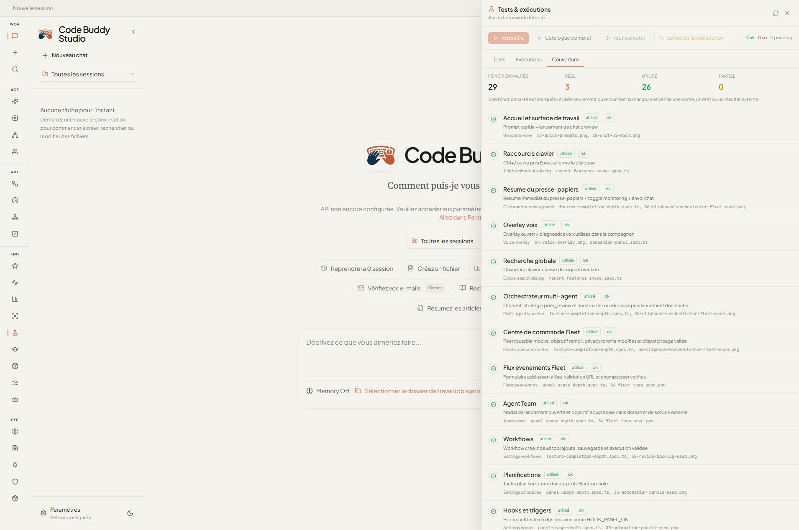
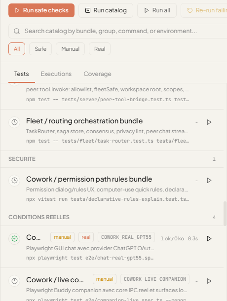
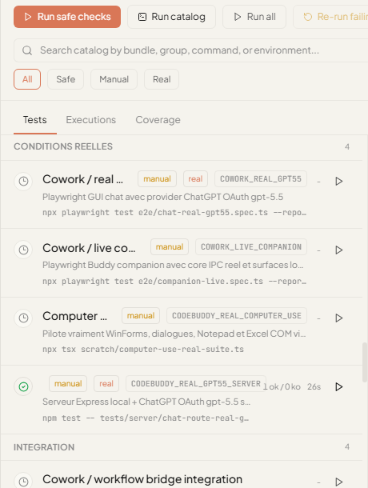

# Code Buddy Studio - Campagne QA autonome

Date de lancement : 25 mai 2026, nuit Europe/Paris
Workspace : `[workspace]`
Application : Code Buddy Studio / Code Buddy core
Jeux de tests : [`overnight-test-datasets.json`](./overnight-test-datasets.json)
Rapport fonctionnel : [`feature-qa.md`](./feature-qa.md)
Rapport machine : [`feature-qa-report.json`](./feature-qa-report.json)

## Objectif

Cette campagne transforme la validation de Code Buddy Studio en vrais tests fonctionnels. Une fonctionnalite n'est plus consideree terminee parce que son panneau s'ouvre : elle doit etre manipulee avec un jeu de donnees controle, produire un etat ou une sortie observable, et laisser une preuve exploitable.

La relance autonome de nuit est activee sur le thread toutes les 10 minutes pour continuer les cycles longs, corriger les bugs trouves et maintenir ce document a jour.

## Definition des statuts

| Statut | Definition |
|---|---|
| `reel` | Appel a un provider/service/runtime materiel reel, pas seulement un mock. |
| `utilise` | Interface ou API manipulee avec assertion sur sortie, etat, persistance ou feedback. |
| `partiel` | Surface seulement ouverte ou dependance externe non validee. Objectif : 0. |

Etat courant de la matrice : `29` fonctionnalites, `3` reelles, `26` utilisees, `0` partielle.



## Jeux de tests

Les donnees sont volontairement reconnaissables pour prouver que le test a bien traverse le flux :

| Domaine | Donnees utilisees | Preuve attendue |
|---|---|---|
| Clipboard | `CLIPBOARD_PANEL_OK` | Resume affiche, monitoring toggle, envoi chat. |
| Orchestrateur | objectif QA, strategie `peer_review`, `2` rounds | Handler de spawn appele, launcher ferme. |
| Fleet | peer `E2E Fleet Peer`, privacy `sensitive`, profil `code` | Feedback de saga Fleet. |
| Favoris / activite / sessions | bookmark `BOOKMARK_PANEL_OK`, evenements Fleet/Scheduled, session peuplee | Filtres, recherche, audit transcript. |
| Workflows | workflow `QA workflow proof`, noeud `tool` | Resultat `WORKFLOW_RUN_OK`. |
| Lessons / user model / spec | reviewer `qa-reviewer`, story "Validate every visible feature" | Statuts `approved` / `accepted`. |
| MCP / plugins | outil `browser.snapshot`, marker `MCP_PLAYGROUND_OK`, plugin `plugin-e2e` | Resultat playground et toggle composant. |
| MCP stdio reel | serveur fixture `tests/fixtures/real-mcp-fixture.mjs`, outils `echo_marker` et `sum_pair` | `MCP_REAL_FIXTURE:OK` et `MCP_SUM:42`. |
| MCP HTTP reel | serveur HTTP JSON-RPC local `/health` + `/rpc`, outils `http_echo_marker` et `http_sum_pair` | `MCP_HTTP_FIXTURE:OK` et `MCP_HTTP_SUM:42`. |
| MCP streamable HTTP | endpoint SSE-like local `/mcp`, transport `streamable_http` | Echec ferme explicite, aucun outil expose, aucune requete reseau envoyee. |
| Fleet loopback reel | Gateway WebSocket local, API key scopee, `FleetListener`, fichier `hello.txt` | `hello from loopback` via `peer.tool.invoke` et chain/chat/session. |
| Fleet mesh deux peers | Gateway WebSocket local, deux `FleetListener`, peers `mesh-alpha` et `mesh-beta` | Plan route avec primary, fallback et parallel lanes sur les deux peers. |
| Serveur chat HTTP reel | serveur Express local, agent deterministe route par l'adaptateur reel | `/api/chat`, SSE legacy, `/api/chat/completions`, `/api/chat/models`. |
| Fleet/MCP local smoke depuis UI | catalogue `Tests & executions`, suites Fleet/MCP/server locales | Bouton lance depuis l'UI, statut `passed`, resultat `6 ok / 0 ko`. |
| Serveur HTTP local depuis Test Runner | ligne `Server / local HTTP chat routes`, suite serveur deterministe | le panneau lance le vrai serveur Express local et affiche `1 ok / 0 ko`. |
| Statuts erreurs provider serveur depuis Test Runner | ligne `Server / provider error status bundle`, provider local `429`/`503`, rate-limit serveur | le panneau lance les routes HTTP d'erreur et affiche `4 ok / 0 ko`, avec `Retry-After` et payloads OpenAI-compatibles. |
| Fleet peer tools depuis Test Runner | ligne `Fleet / peer tool security suite`, suites `peer.tool.invoke` | le panneau lance les tests serveur + fleet et affiche `40 ok / 0 ko`. |
| MCP transports depuis Test Runner | ligne `MCP / real transport suite`, fixtures MCP stdio/HTTP/fail-closed | le panneau lance les transports reels et affiche `3 ok / 0 ko`. |
| Infrastructure MCP/sandbox depuis Test Runner | ligne `Infrastructure / MCP sandbox adapters bundle`, MCP manager/discovery, tool adapter, Electron core adapter LRU/hotswap, sandbox registry, auto-sandbox, OS policy, E2B fallback | le panneau lance les 11 fichiers infrastructure et affiche `190 ok / 0 ko`. |
| Remote control depuis Test Runner | ligne `Cowork / remote control bundle`, remote manager, message distant, cwd/default workdir, panel remote et slash-command bridge | le panneau lance les 9 fichiers remote Cowork et affiche `16 ok / 0 ko`. |
| Device transports depuis Test Runner | ligne `Device / transport adapters bundle`, transports SSH/ADB/local, helpers transport, Tailscale dashboard nodes | le panneau lance les 3 fichiers device/transport et affiche `178 ok / 0 ko`. |
| Sandbox executor Cowork depuis Test Runner | ligne `Cowork / sandbox executor bundle`, validation de commandes, containment workspace, WSL/Lima, protections symlink/destructives | le panneau lance les 3 fichiers sandbox Cowork et affiche `42 ok / 0 ko`. |
| Projet/session/git Cowork depuis Test Runner | ligne `Cowork / project session git bundle`, Git worktrees/compare, workspace selector, recent files, attachments, sessions et insights | le panneau lance les 16 fichiers Cowork projet/session/git et affiche `73 ok / 0 ko`. |
| UI/localisation/layout Cowork depuis Test Runner | ligne `Cowork / UI localization layout bundle`, layout app/chat/welcome/message/config, theme sombre, i18n francais, Fleet Command Center translations, settings, links/markdown | le panneau lance les 20 fichiers Cowork UI/i18n/layout et affiche `95 ok / 0 ko`. |
| Artefacts/documents Cowork depuis Test Runner | ligne `Cowork / artifact document bundle`, artefacts, document workshop, liens/fichiers, preuves DOCX, sorties d'outils et etats MessageCard | le panneau lance les 15 fichiers artefacts/documents Cowork et affiche `125 ok / 0 ko`. |
| Scheduling/session Cowork depuis Test Runner | ligne `Cowork / scheduling session bundle`, scheduled tasks, settings schedule, runNow, Fleet metadata, slash `/schedule` et titres de session | le panneau lance les 14 fichiers scheduling/session Cowork et affiche `90 ok / 0 ko`. |
| Config/providers locaux Cowork depuis Test Runner | ligne `Cowork / local provider config bundle`, API config, diagnostics, ConfigStore profiles/env, Ollama, LM Studio, loopback gateways, retry, modal config | le panneau lance les 18 fichiers config/providers locaux Cowork et affiche `143 ok / 0 ko`. |
| Activite/audit/diagnostics Cowork depuis Test Runner | ligne `Cowork / activity audit diagnostics bundle`, activity feed, global search, audit recall, diagnostics renderer, preview service, event mapping, recent files | le panneau lance les 11 fichiers activite/audit/diagnostics Cowork et affiche `67 ok / 0 ko`. |
| Fleet command/team Cowork depuis Test Runner | ligne `Cowork / Fleet command team bundle`, FleetBridge, IPC dispatch, command center board, discovery YAML, SagaRunner, outcomes/scheduled work, TeamBridge | le panneau lance les 10 fichiers Fleet/Team Cowork et affiche `61 ok / 0 ko`. |
| Permissions/path rules Cowork depuis Test Runner | ligne `Cowork / permission path rules bundle`, PermissionDialog computer-use, quick rules, classification/preview/target rules, fallback declaratif, path containment, UNC | le panneau lance les 12 fichiers permissions/path rules Cowork et affiche `58 ok / 0 ko`. |
| Settings/hooks/MCP/workflows Cowork depuis Test Runner | ligne `Cowork / settings hooks MCP workflows bundle`, settings theme/autostart, hooks dry-runs, MCP env/tool sync, workflow compiler et Orchestrator reel | le panneau lance les 12 fichiers settings/hooks/MCP/workflows Cowork et affiche `62 ok / 0 ko`. |
| Commandes personnalisees/slash Cowork depuis Test Runner | ligne `Cowork / custom commands slash bundle`, persistence Markdown, precedence custom, autocomplete, execution remote, parsing `/schedule` | le panneau lance les 2 fichiers custom commands/slash Cowork et affiche `11 ok / 0 ko`. |
| Knowledge/Hermes/presence Cowork depuis Test Runner | ligne `Cowork / knowledge Hermes presence bundle`, lesson candidates, lessons vault, user model/spec IPC, compagnon IPC, Hermes plan/tool profiles, skill candidate review et presence model flows | le panneau lance les 11 fichiers knowledge/Hermes/presence Cowork et affiche `85 ok / 0 ko`. |
| Chat IPC depuis Test Runner | ligne `Cowork / IPC chat flow`, session `e2e-chat-ipc-session` | le panneau lance le vrai E2E chat et affiche `1 ok / 0 ko`. |
| Compagnon deterministe depuis Test Runner | ligne `Cowork / companion deterministic panel`, cockpit compagnon fixture | le panneau lance le vrai E2E compagnon et affiche `1 ok / 0 ko`. |
| Canaux/messagerie depuis Test Runner | ligne `Channels / messaging adapters bundle`, adapters Slack/Discord/Telegram/WhatsApp/Signal/Matrix/WebChat/Teams/Google Chat et files de messages | le panneau lance les 25 fichiers channels et affiche `1036 ok / 0 ko`. |
| Memoire/contexte depuis Test Runner | ligne `Memory / context persistence bundle`, context manager, compaction, persistent memory, sessions, pruning et checkpoints | le panneau lance les 18 fichiers memoire/contexte et affiche `561 ok / 0 ko`. |
| Contexte/compression/pruning depuis Test Runner | ligne `Context / compression pruning bundle`, web-search context, gaps de compression, garde-fous, scoring, pruning et fallback de compaction | le panneau lance les 14 fichiers contexte/compaction et affiche `282 ok / 0 ko`. |
| Voix/speech/TTS depuis Test Runner | ligne `Voice / speech TTS bundle`, voice control, speech recognition, wake-word fallback, TTS providers, audio tool et voice-to-code | le panneau lance les 9 fichiers voix/audio et affiche `164 ok / 0 ko`. |
| Maintenance/doctor/backup/settings depuis Test Runner | ligne `Maintenance / doctor backup settings bundle`, doctor, onboarding, backup, update notifier, settings et migrations | le panneau lance les 13 fichiers maintenance et affiche `254 ok / 0 ko`. |
| Providers/modeles depuis Test Runner | ligne `Providers / model config bundle`, model registry, pricing, config resolver, ChatGPT OAuth, fallback chain et smart router | le panneau lance les 22 fichiers providers/config et affiche `579 ok / 0 ko`. |
| Resilience provider/erreurs depuis Test Runner | ligne `Providers / resilience error bundle`, retry stream/client, backoff, rate limit, erreurs et recuperation client | le panneau lance les 12 fichiers provider-resilience et affiche `367 ok / 0 ko`. |
| Outils/edition/recherche depuis Test Runner | ligne `Tools / editing search bundle`, text editor, bash, process, sessions, tool selector, recherche, hybrid/usearch index, filtres agent et result sanitizer | le panneau lance les 21 fichiers outils/recherche et affiche `701 ok / 0 ko`. |
| Agent/raisonnement/execution depuis Test Runner | ligne `Agent / reasoning execution bundle`, CodeBuddyAgent, executor, middleware, reasoning facade, prompt builder, message processor et planning flow | le panneau lance les 23 fichiers agent/raisonnement et affiche `686 ok / 0 ko`. |
| Autonome/multi-agent/harnais depuis Test Runner | ligne `Autonomous / multi-agent harness bundle`, agentic coding, checkpoints, verification loop, workflows multi-agent, auto-resolve, pipelines et planner | le panneau lance les 34 fichiers autonome/multi-agent et affiche `451 ok / 0 ko`. |
| Compagnon coeur depuis Test Runner | ligne `Companion / core behaviour bundle`, camera, percepts, missions, privacy, safety ledger, self-evaluation et skill curator | le panneau lance les 15 fichiers compagnon et affiche `56 ok / 0 ko`. |
| Automation navigateur/desktop depuis Test Runner | ligne `Automation / browser desktop bundle`, browser operator, internet scout/proof, route interceptor, screenshot annotator, desktop automation et OCR | le panneau lance les 15 fichiers automation et affiche `262 ok / 0 ko`. |
| Scheduler/hooks/notifications depuis Test Runner | ligne `Automation / scheduler hooks notifications bundle`, scheduler, cron prechecks, hooks, lanes, webhooks et notifications | le panneau lance les 22 fichiers scheduler/hooks et affiche `766 ok / 0 ko`. |
| Securite hardening/audit depuis Test Runner | ligne `Security / hardening audit bundle`, audit logger, bash allowlist/parser, validateurs, policy engine, secrets, path guard et skill scanner | le panneau lance les 18 fichiers securite et affiche `485 ok / 0 ko`. |
| Serveur chat HTTP reel GPT-5.5 | serveur Express local, ChatGPT OAuth, modele `gpt-5.5` | `/api/chat`, SSE legacy, `/api/chat/completions`, `/api/chat/models` avec marqueurs reels. |
| Provider reel | ChatGPT OAuth, `gpt-5.5` | Reponse GUI `REAL-GPT55-COWORK-GUI`. |
| ChatGPT reel depuis Test Runner | ligne `Cowork / real GPT-5.5 chat`, env `COWORK_REAL_GPT55=1` | le panneau lance le vrai E2E Cowork ChatGPT et affiche `1 ok / 0 ko`. |
| Serveur ChatGPT reel depuis Test Runner | ligne `Server / real GPT-5.5 chat API`, env `CODEBUDDY_REAL_GPT55_SERVER=1` | le panneau lance le vrai test serveur Express ChatGPT et affiche `1 ok / 0 ko`. |
| Compagnon live depuis Test Runner | ligne `Cowork / live companion core IPC`, env `COWORK_LIVE_COMPANION=1` | le panneau lance le vrai E2E compagnon live et affiche `1 ok / 0 ko`. |
| CLI headless erreur provider | provider HTTP local qui renvoie 500, `src/index.ts --prompt --quiet --output-format json` | JSON d'erreur conserve et process en exit code `1`. |
| Docker sandbox reel | `DockerSandbox`, image `node:22-slim`, reseau coupe, filesystem read-only | `OK-DOCKER-SANDBOX-REAL`, exit 0, aucun conteneur actif restant, lancement depuis l'UI `1 ok / 0 ko`. |
| Garde-fou `Tests surs` | workspace temporaire avec `test` sur et `test:e2e` manuel dangereux | `SAFE_BATCH_MARKER`, ligne manuelle `pending`, aucun `UNSAFE_E2E_MARKER`. |
| Annulation Test Runner | script `test:slow` long, bouton `Cancel`, RunStore | ligne `skipped`, run `cancelled`, aucun process `CANCEL_START_MARKER` restant. |
| Timeout script Test Runner | script `test:hang` sur, process Node infini, env `CODEBUDDY_TEST_RUNNER_SCRIPT_TIMEOUT_MS=1500` | ligne `failed`, sortie `Timed out after 1500ms`, run `Test runner: test:hang` visible dans `Executions`, aucun process `QA_UI_TIMEOUT_MARKER_*` restant. |
| Relance des echecs Test Runner | mini-projet Vitest `tests/flaky.test.ts`, etat `fail` puis `pass` | premier run `0 ok / 1 ko`, clic `Re-run failing`, second run `1 ok / 0 ko`. |
| Permissions | demande `Bash(git *)`, reponse IPC, regle `Write(docs/*)` | `permission.response` emis et regle sauvegardee. |
| Test runner echec et suivi | workspace temporaire, script `test:fail`, stderr `QA_FAIL_MARKER`, RunStore isole | statut `failed`, compteur `0 ok / 1 ko`, sortie live visible, run `Test runner: test:fail` dans `Executions`. |
| Supervision mobile gateway | snapshots mobile, pairing preview-only, plan d'acceptation sans reseau, gateway policy/contract/listener, approval queue | le panneau lance les 8 fichiers mobile/gateway et affiche `39 ok / 0 ko`. |
| Securite chemin | UNC `\\server\share\report.txt` | Rejet immediat hors workspace. |

## Resultats GUI Cowork

| Commande | Resultat | Couverture |
|---|---:|---|
| `npx playwright test e2e/feature-completion-depth.spec.ts --reporter=list` | 4/4 OK | 13 dernieres surfaces manipulees. |
| `npx playwright test e2e/panel-usage-depth.spec.ts --reporter=list` | 2/2 OK | Fleet add-peer, Team modal, commands, hooks, schedules. |
| `npx playwright test e2e/test-runner-panel.spec.ts --reporter=list` | 1/1 OK | Fenetre Tests & executions utilisee. |
| `npx playwright test e2e/test-runner-failure-flow.spec.ts --reporter=list` | 1/1 OK | Chemin d'echec reel du runner, stderr visible et run observe dans `Executions`. |
| `npx playwright test e2e/test-runner-cowork-ipc-chat.spec.ts --reporter=list --timeout=220000` | 1/1 OK | Ligne `Cowork / IPC chat flow` lancee depuis la fenetre de tests, resultat `1 ok / 0 ko`, capture 59. |
| `npx playwright test e2e/test-runner-companion-deterministic-panel.spec.ts --reporter=list --timeout=340000` | 1/1 OK | Ligne `Cowork / companion deterministic panel` lancee depuis la fenetre de tests, resultat `1 ok / 0 ko`, capture 60. |
| `npx playwright test e2e/test-runner-server-local-http.spec.ts --reporter=list --timeout=200000` | 1/1 OK | Ligne `Server / local HTTP chat routes` lancee depuis la fenetre de tests, resultat `1 ok / 0 ko`, capture 56. |
| `npx playwright test e2e/test-runner-fleet-peer-tool-security.spec.ts --reporter=list --timeout=200000` | 1/1 OK | Ligne `Fleet / peer tool security suite` lancee depuis la fenetre de tests, resultat `40 ok / 0 ko`, capture 57. |
| `npx playwright test e2e/test-runner-mcp-real-transport.spec.ts --reporter=list --timeout=200000` | 1/1 OK | Ligne `MCP / real transport suite` lancee depuis la fenetre de tests, resultat `3 ok / 0 ko`, capture 58. |
| `npx playwright test e2e/test-runner-infra-mcp-sandbox-adapters-bundle.spec.ts --reporter=list --timeout=280000` | 1/1 OK | Ligne `Infrastructure / MCP sandbox adapters bundle` lancee depuis la fenetre de tests, resultat `190 ok / 0 ko`, capture 93. |
| `npx playwright test e2e/test-runner-remote-control-bundle.spec.ts --reporter=list --timeout=220000` | 1/1 OK | Ligne `Cowork / remote control bundle` lancee depuis la fenetre de tests, resultat `16 ok / 0 ko`, capture 94. |
| `npx playwright test e2e/test-runner-device-transport-adapters-bundle.spec.ts --reporter=list --timeout=220000` | 1/1 OK | Ligne `Device / transport adapters bundle` lancee depuis la fenetre de tests, resultat `178 ok / 0 ko`, capture 95. |
| `npx playwright test e2e/test-runner-cowork-sandbox-executor-bundle.spec.ts --reporter=list --timeout=220000` | 1/1 OK | Ligne `Cowork / sandbox executor bundle` lancee depuis la fenetre de tests, resultat `42 ok / 0 ko`, capture 96. |
| `npx playwright test e2e/test-runner-project-session-git-bundle.spec.ts --reporter=list --timeout=240000` | 1/1 OK | Ligne `Cowork / project session git bundle` lancee depuis la fenetre de tests, resultat `73 ok / 0 ko`, capture 97. |
| `npx playwright test e2e/test-runner-ui-localization-layout-bundle.spec.ts --reporter=list --timeout=240000` | 1/1 OK | Ligne `Cowork / UI localization layout bundle` lancee depuis la fenetre de tests, resultat `95 ok / 0 ko`, capture 98. |
| `npx playwright test e2e/test-runner-artifact-document-bundle.spec.ts --reporter=list --timeout=240000` | 1/1 OK | Ligne `Cowork / artifact document bundle` lancee depuis la fenetre de tests, resultat `125 ok / 0 ko`, capture 99. |
| `npx playwright test e2e/test-runner-scheduling-session-bundle.spec.ts --reporter=list --timeout=240000` | 1/1 OK | Ligne `Cowork / scheduling session bundle` lancee depuis la fenetre de tests, resultat `90 ok / 0 ko`, capture 100. |
| `npx playwright test e2e/test-runner-local-provider-config-bundle.spec.ts --reporter=list --timeout=260000` | 1/1 OK | Ligne `Cowork / local provider config bundle` lancee depuis la fenetre de tests, resultat `143 ok / 0 ko`, capture 101. |
| `npx playwright test e2e/test-runner-activity-audit-diagnostics-bundle.spec.ts --reporter=list --timeout=260000` | 1/1 OK | Ligne `Cowork / activity audit diagnostics bundle` lancee depuis la fenetre de tests, resultat `67 ok / 0 ko`, capture 102. |
| `npx playwright test e2e/test-runner-fleet-command-team-bundle.spec.ts --reporter=list --timeout=260000` | 1/1 OK | Ligne `Cowork / Fleet command team bundle` lancee depuis la fenetre de tests, resultat `61 ok / 0 ko`, capture 103. |
| `npx playwright test e2e/test-runner-permission-path-rules-bundle.spec.ts --reporter=list --timeout=260000` | 1/1 OK | Ligne `Cowork / permission path rules bundle` lancee depuis la fenetre de tests, resultat `58 ok / 0 ko`, capture 104. |
| `npx playwright test e2e/test-runner-settings-hooks-mcp-workflows-bundle.spec.ts --reporter=list --timeout=260000` | 1/1 OK | Ligne `Cowork / settings hooks MCP workflows bundle` lancee depuis la fenetre de tests, resultat `62 ok / 0 ko`, capture 105. |
| `npx playwright test e2e/test-runner-custom-commands-slash-bundle.spec.ts --reporter=list --timeout=220000` | 1/1 OK | Ligne `Cowork / custom commands slash bundle` lancee depuis la fenetre de tests, resultat `11 ok / 0 ko`, capture 106. |
| `npx playwright test e2e/test-runner-channels-messaging-adapters-bundle.spec.ts --reporter=list --timeout=320000` | 1/1 OK | Ligne `Channels / messaging adapters bundle` lancee depuis la fenetre de tests, resultat `1036 ok / 0 ko`, capture 70. |
| `npx playwright test e2e/test-runner-memory-context-persistence-bundle.spec.ts --reporter=list --timeout=260000` | 1/1 OK | Ligne `Memory / context persistence bundle` lancee depuis la fenetre de tests, resultat `561 ok / 0 ko`, capture 71. |
| `npx playwright test e2e/test-runner-context-compression-pruning-bundle.spec.ts --reporter=list --timeout=280000` | 1/1 OK | Ligne `Context / compression pruning bundle` lancee depuis la fenetre de tests, resultat `282 ok / 0 ko`, capture 86. |
| `npx playwright test e2e/test-runner-voice-speech-tts-bundle.spec.ts --reporter=list --timeout=280000` | 1/1 OK | Ligne `Voice / speech TTS bundle` lancee depuis la fenetre de tests, resultat `164 ok / 0 ko`, capture 87. |
| `npx playwright test e2e/test-runner-maintenance-doctor-backup-settings-bundle.spec.ts --reporter=list --timeout=300000` | 1/1 OK | Ligne `Maintenance / doctor backup settings bundle` lancee depuis la fenetre de tests, resultat `254 ok / 0 ko`, capture 89. |
| `npx playwright test e2e/test-runner-providers-model-config-bundle.spec.ts --reporter=list --timeout=260000` | 1/1 OK | Ligne `Providers / model config bundle` lancee depuis la fenetre de tests, resultat `579 ok / 0 ko`, capture 72. |
| `npx playwright test e2e/test-runner-provider-resilience-error-bundle.spec.ts --reporter=list --timeout=260000` | 1/1 OK | Ligne `Providers / resilience error bundle` lancee depuis la fenetre de tests, resultat `367 ok / 0 ko`, capture 91. |
| `npx playwright test e2e/test-runner-tools-editing-search-bundle.spec.ts --reporter=list --timeout=320000` | 1/1 OK | Ligne `Tools / editing search bundle` lancee depuis la fenetre de tests, resultat `701 ok / 0 ko`, capture 73. |
| `npx playwright test e2e/test-runner-agent-reasoning-execution-bundle.spec.ts --reporter=list --timeout=320000` | 1/1 OK | Ligne `Agent / reasoning execution bundle` lancee depuis la fenetre de tests, resultat `686 ok / 0 ko`, capture 74. |
| `npx playwright test e2e/test-runner-autonomous-multi-agent-harness-bundle.spec.ts --reporter=list --timeout=380000` | 1/1 OK | Ligne `Autonomous / multi-agent harness bundle` lancee depuis la fenetre de tests, resultat `451 ok / 0 ko`, capture 75. |
| `npx playwright test e2e/test-runner-companion-core-behaviour-bundle.spec.ts --reporter=list --timeout=260000` | 1/1 OK | Ligne `Companion / core behaviour bundle` lancee depuis la fenetre de tests, resultat `56 ok / 0 ko`, capture 76. |
| `npx playwright test e2e/test-runner-browser-desktop-automation-bundle.spec.ts --reporter=list --timeout=320000` | 1/1 OK | Ligne `Automation / browser desktop bundle` lancee depuis la fenetre de tests, resultat `262 ok / 0 ko`, capture 77. |
| `npx playwright test e2e/test-runner-scheduler-hooks-notifications-bundle.spec.ts --reporter=list --timeout=320000` | 1/1 OK | Ligne `Automation / scheduler hooks notifications bundle` lancee depuis la fenetre de tests, resultat `766 ok / 0 ko`, capture 88. |
| `npx playwright test e2e/test-runner-mobile-supervision-gateway-bundle.spec.ts --reporter=list --timeout=260000` | 1/1 OK | Ligne `Mobile / supervision gateway bundle` lancee depuis la fenetre de tests, resultat `39 ok / 0 ko`, capture 90. |
| `npx playwright test e2e/test-runner-security-hardening-audit-bundle.spec.ts --reporter=list --timeout=320000` | 1/1 OK | Ligne `Security / hardening audit bundle` lancee depuis la fenetre de tests, resultat `485 ok / 0 ko`, capture 78. |
| `COWORK_REAL_DOCKER_SANDBOX=1 npx playwright test e2e/test-runner-docker-real.spec.ts --reporter=list` | 1/1 OK | Ligne `Docker / real sandbox smoke` lancee depuis la fenetre de tests, resultat `1 ok / 0 ko`. |
| `npx playwright test e2e/test-runner-safe-batch.spec.ts --reporter=list` | 1/1 OK | `Tests surs` execute seulement le script sur et laisse `test:e2e` manuel en attente. |
| `npx playwright test e2e/test-runner-cancel-flow.spec.ts --reporter=list` | 1/1 OK | Annulation d'un script long, statut `skipped`, run `cancelled`. |
| `CODEBUDDY_TEST_RUNNER_SCRIPT_TIMEOUT_MS=1500 npx playwright test e2e/test-runner-script-timeout-flow.spec.ts --reporter=list` | 1/1 OK | Script local sur infini coupe par timeout depuis l'UI, run `failed` visible dans `Executions`, aucun process restant. |
| `npx playwright test e2e/test-runner-rerun-failing.spec.ts --reporter=list` | 1/1 OK | Mini-projet Vitest reel : premier run KO, fixture corrige, `Re-run failing` OK. |
| `npx playwright test e2e/test-runner-panel.spec.ts e2e/test-runner-failure-flow.spec.ts e2e/test-runner-safe-batch.spec.ts e2e/test-runner-cancel-flow.spec.ts e2e/test-runner-rerun-failing.spec.ts --reporter=list` | 5/5 OK | Regression globale de la fenetre Tests & executions : catalogue, echec, annulation, relance des echecs, garde-fou safe. |
| `npx playwright test e2e/permission-real-flow.spec.ts --reporter=list` | 1/1 OK | Permission dialog, IPC et persistence de regle. |
| `npx playwright test e2e/cowork-smoke.spec.ts --grep "permission\|rule" --reporter=list` | 15/15 OK | Permissions URL, cible GUI, Bash, Edit, Write, folder scope. |
| `npx playwright test --reporter=list` | 49 OK, 2 skips | Suite E2E Cowork complete hors tests reels opt-in. |
| `COWORK_REAL_GPT55=1 npx playwright test e2e/chat-real-gpt55.spec.ts --reporter=list --timeout=240000` | 1/1 OK | Chat reel via ChatGPT `gpt-5.5`. |
| `COWORK_REAL_GPT55=1 npx playwright test e2e/test-runner-cowork-real-gpt55.spec.ts --reporter=list --timeout=360000` | 1/1 OK | La fenetre Tests & executions lance elle-meme le smoke Cowork ChatGPT reel. |
| `CODEBUDDY_REAL_GPT55_SERVER=1 npx playwright test e2e/test-runner-server-real-gpt55.spec.ts --reporter=list --timeout=420000` | 1/1 OK | La fenetre Tests & executions lance elle-meme le smoke serveur ChatGPT reel. |
| `COWORK_LIVE_COMPANION=1 npx playwright test e2e/test-runner-companion-live.spec.ts --reporter=list --timeout=380000` | 1/1 OK | La fenetre Tests & executions lance elle-meme le smoke compagnon live core IPC. |
| `COWORK_LIVE_COMPANION=1 npx playwright test e2e/companion-live.spec.ts --reporter=list --timeout=240000` | 1/1 OK | Companion live, core IPC et surfaces locales. |

Captures principales :


## Resultats Cowork techniques

| Commande | Resultat |
|---|---|
| `npm run typecheck` dans `cowork/` | OK |
| `npm run lint` dans `cowork/` | OK, 0 erreur, 36 warnings legacy |
| `npm run build:e2e` dans `cowork/` | OK, warnings Vite de chunks volumineux |
| `npm test -- --run` dans `cowork/` | OK, 208 fichiers, 1333 tests |
| `npm run test:coverage -- --run` dans `cowork/` | OK, 45.84% statements, 42.48% branches, 55.73% functions, 46.64% lines |
| `npx vitest run tests/test-runner-bridge-catalog.test.ts --reporter=verbose` dans `cowork/` | OK, 7 tests ; catalogue inclut chat IPC, compagnon deterministe, serveur HTTP local, Fleet peer tools, MCP transports reels, infrastructure MCP/sandbox adapters, remote control, device transports, sandbox executor Cowork, projet/session/git Cowork, UI/localisation/layout Cowork, artefacts/documents Cowork, scheduling/session Cowork, config/providers locaux Cowork, activite/audit/diagnostics Cowork, Fleet command/team Cowork, permissions/path rules Cowork, settings/hooks/MCP/workflows Cowork, commandes personnalisees/slash Cowork, canaux/messagerie, memoire/contexte, providers/modeles, provider resilience/erreurs, outils/edition/recherche, agent/raisonnement/execution, autonome/multi-agent/harnais, compagnon coeur, automation navigateur/desktop, securite hardening/audit, Cowork/serveur reels GPT-5.5, timeout d'un process infini et parsing robuste du resume Vitest |

## Resultats Code Buddy core

| Commande | Resultat |
|---|---|
| `npm run typecheck` racine | OK |
| `npm run lint` racine | OK, 0 erreur, 2326 warnings legacy |
| `npm run build` racine | OK |
| `npm test -- --run` racine | OK |
| `npm test -- tests/fleet/fleet-loopback-smoke.test.ts --run` | OK, 9 tests, vrai Gateway WebSocket local + FleetListener |
| `npm test -- tests/fleet/fleet-multi-peer-mesh-smoke.test.ts --run` | OK, 1 test, vrai mesh local a deux peers Fleet |
| `npm test -- tests/mcp/mcp-stdio-real-fixture.test.ts --run` | OK, 1 test, vrai serveur MCP stdio fixture |
| `npm test -- tests/mcp/mcp-http-real-fixture.test.ts --run` | OK, 1 test, vrai endpoint MCP HTTP local |
| `npm test -- tests/mcp/mcp-streamable-http-limitation.test.ts --run` | OK, 1 test, garde-fou fail-closed streamable HTTP |
| `npm test -- tests/mcp/mcp-stdio-real-fixture.test.ts tests/mcp/mcp-http-real-fixture.test.ts tests/mcp/mcp-streamable-http-limitation.test.ts --run` | OK, 3 fichiers, 3 tests MCP reels |
| `npm test -- tests/server/chat-route-real-http.test.ts --run` | OK, 1 test, vrai serveur HTTP local avec agent deterministe |
| `npm test -- tests/server/peer-tool-bridge.test.ts tests/fleet/peer-tool-bridge.test.ts --run` | OK, 2 fichiers, 40 tests de securite `peer.tool.invoke` |
| `CODEBUDDY_REAL_GPT55_SERVER=1 npm test -- tests/server/chat-route-real-gpt55.test.ts --run` | OK, 1 test, vrai serveur HTTP local + vrais appels ChatGPT `gpt-5.5` |
| `npm test -- tests/fleet/fleet-loopback-smoke.test.ts tests/fleet/fleet-multi-peer-mesh-smoke.test.ts tests/mcp/mcp-stdio-real-fixture.test.ts tests/mcp/mcp-http-real-fixture.test.ts tests/mcp/mcp-streamable-http-limitation.test.ts tests/server/chat-route-real-http.test.ts tests/server/peer-tool-bridge.test.ts tests/fleet/peer-tool-bridge.test.ts --run` | OK, 8 fichiers, 54 tests |
| `npm test -- tests\unit\sync.test.ts tests\unit\sync-persistence.test.ts --run` | OK, 2 fichiers, 129 tests |
| `npm test -- tests\security\write-policy.test.ts tests\security\permission-modes.test.ts tests\commands\permissions-handlers.test.ts tests\features\stream-permissions-prompts.test.ts tests\desktop\permission-bridge-unify.test.ts tests\approval-modes.test.ts tests\unit\approval-modes.test.ts --run` | OK, 7 fichiers, 227 tests |
| `npm test -- tests\security-modes.test.ts tests\unit\security-modes.test.ts tests\unit\permission-config.test.ts tests\unit\tool-permissions.test.ts tests\utils\confirmation-service.test.ts --run` | OK, 5 fichiers, 297 tests |
| `npm test -- tests\unit\validation.test.ts --run` | OK, 195 tests |
| `npm test -- tests/cli/cli-flags.test.ts tests/cli/headless-exit-code.test.ts --run` | OK, 2 fichiers, 23 tests ; vrai lancement CLI contre provider HTTP 500, exit code `1` |
| `CODEBUDDY_REAL_DOCKER_SANDBOX=1 npm test -- tests/sandbox/docker-sandbox-real-smoke.test.ts --run` | OK, 1 test ; vrai conteneur Docker `node:22-slim`, reseau coupe, read-only, marker `OK-DOCKER-SANDBOX-REAL` |
| `node dist\index.js --help` | OK, CLI charge et liste les commandes |
| `node dist\index.js whoami` | OK, ChatGPT connecte, compte ChatGPT redacted, plan `pro` |
| `node dist\index.js provider models chatgpt` | OK, `gpt-5.5` default/active |
| `node dist\index.js --prompt "Reply exactly: REAL-GPT55-HEARTBEAT-PERMISSIONS" --output-format text --quiet --model gpt-5.5 --disabled-tools "*" --ephemeral` | OK, reponse exacte `REAL-GPT55-HEARTBEAT-PERMISSIONS` |
| `node dist\index.js doctor --quiet` | OK, 8 checks OK, 11 warnings, 0 erreur |
| `node dist\index.js doctor --quick` | Echec attendu : option inexistante |

## Serveur, Docker, sandbox

| Test | Resultat |
|---|---|
| Serveur local `node dist\index.js server --port 39230 --host 127.0.0.1 --no-auth` puis `GET /api/health` | OK, `status: ok`, checks `database/api/memory: ok` |
| `docker info --format "{{.ServerVersion}}"` | OK, Docker `29.4.3` |
| `docker compose config --quiet` | OK |
| `docker run --rm --network none node:22-slim node -e "console.log('OK-DOCKER-RUNTIME')"` | OK |
| `CODEBUDDY_REAL_DOCKER_SANDBOX=1 npm test -- tests/sandbox/docker-sandbox-real-smoke.test.ts --run` | OK, `OK-DOCKER-SANDBOX-REAL`, exit 0, aucun conteneur actif restant |
| `npm test -- tests/sandbox/docker-sandbox.test.ts tests/unit/sandbox-docker.test.ts tests/agent/research-script-job-runner.test.ts --run` | OK, 3 fichiers, 81 tests |

## Bug trouve et corrige

### Timeout UNC dans les executeurs d'outils

Symptome : le run complet `npm test -- --run` dans `cowork/` a timeoute sur `tests/tool-executor-unc-paths.test.ts`. En isolant le test, le premier cas prenait environ `2740 ms`.

Cause : `ToolExecutor.assertInsideMount()` et `SandboxToolExecutor.assertInsideMount()` appelaient `fs.existsSync` ou `fs.realpathSync` sur un chemin UNC hors workspace (`\\server\share\report.txt`). Sous Windows, cela peut declencher une resolution reseau avant que le chemin soit rejete.

Correction :

- rejet lexical immediat si le chemin normalise n'est dans aucun mount ;
- resolution symlink conservee seulement apres containment lexical ;
- meme protection appliquee a `ToolExecutor` et `SandboxToolExecutor`.

Preuve apres correction :

| Commande | Avant | Apres |
|---|---:|---:|
| `npx vitest run tests/tool-executor-unc-paths.test.ts --reporter=verbose` | premier cas ~2740 ms | premier cas 2 ms |
| `npm test -- --run` dans `cowork/` | 1 timeout | 208 fichiers OK, 1333 tests OK |

Fichiers corriges :

- [`cowork/src/main/tools/tool-executor.ts`](../../../cowork/src/main/tools/tool-executor.ts)
- [`cowork/src/main/tools/sandbox-tool-executor.ts`](../../../cowork/src/main/tools/sandbox-tool-executor.ts)

### Rejection globale SyncManager sur erreur de persistence

Symptome : pendant la relance complete racine, `npm test -- --run` echouait avec des rejections globales issues de `tests/unit/sync.test.ts` :

```text
Unhandled Rejection Error: UNKNOWN: unknown error, open '[workspace]\.codebuddy\sync\state.json'
```

Cause : `SyncManager.save()` et `SyncManager.load()` emettaient l'evenement special Node `error` dans un bloc async. Sans listener `error`, `EventEmitter` transforme cet evenement en exception. Comme `save()` est appele en fire-and-forget apres les mutations d'etat, l'exception devenait une rejection non geree et faisait echouer Vitest.

Correction :

- conservation de l'evenement `error` quand un consommateur a explicitement enregistre un listener ;
- fallback logger quand aucun listener n'est present, pour eviter un crash async silencieux ;
- tests de regression pour les deux cas : avec listener et sans listener ;
- nettoyage des mocks et `dispose()` explicite dans `tests/unit/sync-persistence.test.ts` pour eviter les fuites inter-tests.

Preuve apres correction :

| Commande | Resultat |
|---|---|
| `npm test -- tests\unit\sync.test.ts tests\unit\sync-persistence.test.ts --run` | 2 fichiers OK, 129 tests OK |
| `npm run typecheck` racine | OK |
| `npm test -- --run` racine | OK, aucune rejection globale SyncManager |

Fichiers corriges :

- [`src/sync/index.ts`](../../../src/sync/index.ts)
- [`tests/unit/sync-persistence.test.ts`](../../../tests/unit/sync-persistence.test.ts)

### Sortie live absente dans la fenetre Tests & executions

Symptome : un vrai script de test lance depuis la fenetre `Tests & executions` etait bien marque `failed`, avec le compteur `0 ok / 1 ko`, mais le panneau de sortie restait sur :

```text
No output yet. Run a check to start.
```

Cause : `TestRunnerPanel` s'abonnait a `window.electronAPI.onEvent(...)`, mais le preload Electron n'exposait que `on(...)`. Le listener principal `on(...)` est volontairement unique pour le store global ; il ne fallait pas le reutiliser dans un panneau secondaire car cela aurait remplace le listener applicatif.

Correction :

- ajout d'un abonnement top-level `electronAPI.onEvent()` independant dans le preload ;
- conservation du listener `electronAPI.on()` existant pour le store principal ;
- ajout d'un test E2E qui cree un workspace temporaire avec `test:fail`, lance le script depuis le catalogue, verifie `failed`, `0 ok / 1 ko` et `QA_FAIL_MARKER` dans la sortie live ;
- ajout d'une regression unitaire qui verifie la restitution stderr par `TestRunnerBridge`.

Extension du suivi d'execution :

- chaque check lance depuis le catalogue cree maintenant un run dans le `RunStore` core quand il est disponible ;
- le run porte `channel: cowork`, `source: test-runner`, `origin: cowork-test-runner-panel` et les tags `qa` / `test-runner` ;
- stdout/stderr sont sauvegardes dans l'artefact `test-output.txt` ;
- l'onglet `Executions` retrouve ce run apres le lancement ;
- `CODEBUDDY_RUNS_DIR` permet d'isoler le dossier des runs pendant les E2E.

Extension du catalogue reel :

- le test serveur ChatGPT `gpt-5.5` est visible dans `Tests & executions` sous `Server / real GPT-5.5 chat API` ;
- la ligne est manuelle (`safeToRun=false`) et porte le badge `CODEBUDDY_REAL_GPT55_SERVER` ;
- les checks surs ne consomment donc pas l'abonnement ChatGPT par accident.

Extension du catalogue de regressions :

- le test `CLI / headless provider failure exit` est visible dans `Tests & executions` ;
- la ligne est sure (`safeToRun=true`) car elle utilise seulement un provider HTTP local fixture ;
- l'E2E clique cette ligne depuis le panneau et attend `passed` / `1 ok / 0 ko`.
- le test `Server / local HTTP chat routes` est visible dans `Tests & executions` ;
- la ligne est sure (`safeToRun=true`) car elle demarre un serveur Express local sur port ephemere avec un agent deterministe ;
- l'E2E clique cette ligne depuis le panneau et attend `passed` / `1 ok / 0 ko`.
- la suite `Fleet/MCP local smoke suite` est visible dans `Tests & executions` ;
- la ligne est sure (`safeToRun=true`) car elle demarre seulement des services locaux ephemeres ;
- l'E2E clique cette ligne depuis le panneau et attend `passed` / `6 ok / 0 ko`.

Extension du catalogue Docker :

- le test `Docker / real sandbox smoke` est visible dans `Tests & executions` ;
- la ligne est manuelle (`safeToRun=false`) et porte le badge `CODEBUDDY_REAL_DOCKER_SANDBOX` ;
- le test direct lance vraiment `DockerSandbox` avec `node:22-slim`, reseau coupe et filesystem read-only ;
- l'E2E opt-in clique cette ligne depuis le panneau et attend `passed` / `1 ok / 0 ko`.

Garde-fou `Tests surs` :

- un E2E cree un workspace temporaire avec `test` et `test:e2e` ;
- `test` imprime `SAFE_BATCH_MARKER` et doit passer ;
- `test:e2e` imprime `UNSAFE_E2E_MARKER` puis echoue, mais il est classe manuel par le catalogue ;
- le bouton `Tests surs` lance seulement `test`, laisse `test:e2e` en `pending` et ne fait jamais apparaitre `UNSAFE_E2E_MARKER`.

Annulation des checks :

- un E2E cree un script `test:slow` qui resterait actif indefiniment ;
- le bouton `Cancel` tue le process en cours ;
- la ligne revient en `skipped` au lieu de `failed` ;
- le RunStore termine `Test runner: test:slow` en `cancelled` ;
- sous Windows, le bridge tue l'arbre de processus avec `taskkill /T /F` pour eviter un process enfant orphelin.

Preuve apres correction :

| Commande | Resultat |
|---|---|
| `npm run build:e2e` dans `cowork/` | OK |
| `npx playwright test e2e/test-runner-failure-flow.spec.ts --reporter=list` | 1/1 OK |
| `npx playwright test e2e/test-runner-panel.spec.ts e2e/test-runner-failure-flow.spec.ts --reporter=list` | 2/2 OK |
| `npx playwright test e2e/test-runner-panel.spec.ts --reporter=list` apres `npm run build:e2e` | 1/1 OK ; ligne serveur GPT-5.5 et badge env visibles |
| `npx playwright test e2e/test-runner-panel.spec.ts --reporter=list` apres ajout de `CLI / headless provider failure exit` | 1/1 OK ; la ligne est visible et lancee depuis l'UI |
| `npx playwright test e2e/test-runner-panel.spec.ts --reporter=list` apres ajout de `Fleet/MCP local smoke suite` | 1/1 OK ; la suite Fleet/MCP locale est visible et lancee depuis l'UI |
| `COWORK_REAL_DOCKER_SANDBOX=1 npx playwright test e2e/test-runner-docker-real.spec.ts --reporter=list` | 1/1 OK ; le smoke Docker reel est visible et lance depuis l'UI |
| `COWORK_REAL_GPT55=1 npx playwright test e2e/test-runner-cowork-real-gpt55.spec.ts --reporter=list --timeout=360000` | 1/1 OK ; le smoke Cowork ChatGPT reel est visible et lance depuis l'UI |
| `CODEBUDDY_REAL_GPT55_SERVER=1 npx playwright test e2e/test-runner-server-real-gpt55.spec.ts --reporter=list --timeout=420000` | 1/1 OK ; le smoke serveur ChatGPT reel est visible et lance depuis l'UI |
| `npx playwright test e2e/test-runner-safe-batch.spec.ts --reporter=list` | 1/1 OK ; le batch sur ne lance pas les lignes manuelles |
| `npx playwright test e2e/test-runner-cancel-flow.spec.ts --reporter=list` | 1/1 OK ; le check long est annule et trace en `cancelled` |
| `CODEBUDDY_TEST_RUNNER_SCRIPT_TIMEOUT_MS=1500 npx playwright test e2e/test-runner-script-timeout-flow.spec.ts --reporter=list` | 1/1 OK ; un script sur infini echoue proprement sur timeout depuis l'UI et apparait dans `Executions` |
| `npx playwright test e2e/test-runner-rerun-failing.spec.ts --reporter=list` | 1/1 OK ; le panneau relance seulement le fichier Vitest defaillant apres correction du fixture |
| `npx playwright test e2e/test-runner-panel.spec.ts e2e/test-runner-failure-flow.spec.ts e2e/test-runner-safe-batch.spec.ts e2e/test-runner-cancel-flow.spec.ts e2e/test-runner-rerun-failing.spec.ts --reporter=list` | 5/5 OK ; le paquet runner complet reste vert en une seule relance |
| `npx vitest run tests/test-runner-bridge-catalog.test.ts --reporter=verbose` | 6 tests OK |
| `npm test -- tests\observability\run-store.test.ts --run` | 31 tests OK |
| `npm run build` racine | OK |
| `npm run typecheck` dans `cowork/` | OK |
| `npm run lint` dans `cowork/` | OK, 0 erreur, 36 warnings legacy |
| `npm run lint` racine | OK, 0 erreur, 2326 warnings legacy |

Fichiers corriges :

- [`cowork/src/preload/index.ts`](../../../cowork/src/preload/index.ts)
- [`cowork/src/main/testing/test-runner-bridge.ts`](../../../cowork/src/main/testing/test-runner-bridge.ts)
- [`cowork/e2e/fixtures.ts`](../../../cowork/e2e/fixtures.ts)
- [`cowork/e2e/test-runner-panel.spec.ts`](../../../cowork/e2e/test-runner-panel.spec.ts)
- [`cowork/e2e/test-runner-failure-flow.spec.ts`](../../../cowork/e2e/test-runner-failure-flow.spec.ts)
- [`cowork/e2e/test-runner-script-timeout-flow.spec.ts`](../../../cowork/e2e/test-runner-script-timeout-flow.spec.ts)
- [`cowork/tests/test-runner-bridge-catalog.test.ts`](../../../cowork/tests/test-runner-bridge-catalog.test.ts)
- [`src/observability/run-store.ts`](../../../src/observability/run-store.ts)

Capture :







### Exit code headless provider

Symptome : le chemin `--prompt --quiet --output-format json` pouvait recevoir une erreur fournisseur transformee en message assistant (`Sorry, I encountered an error: ...`) et terminer en code `0`. Le cas avait ete observe avec un timeout `ChatGPT Responses backend did not respond within 60000ms`.

Cause : `processPromptHeadless()` savait finaliser les exceptions directes en `1`, mais les erreurs converties par l'agent en message assistant etaient traitees comme une reponse valide. En plus, certains chemins internes finalisaient avant que l'appelant ne refinalise en `0`.

Correction :

- `processPromptHeadless()` retourne maintenant un code de sortie unique au lieu de finaliser plusieurs fois ;
- les messages assistant canoniques `Sorry, I encountered an error: ...` sont classes en echec headless ;
- ajout d'un test unitaire de detection et d'un test CLI reel qui lance `src/index.ts` contre un serveur HTTP local renvoyant `500 qa forced provider failure`.

Preuve apres correction :

| Commande | Resultat |
|---|---|
| `npm test -- tests/cli/cli-flags.test.ts tests/cli/headless-exit-code.test.ts --run` | OK, 23 tests |
| `npx eslint src/index.ts src/cli/headless-options.ts tests/cli/cli-flags.test.ts tests/cli/headless-exit-code.test.ts` | OK |
| `npm run typecheck` racine | OK |

Fichiers corriges :

- [`src/index.ts`](../../../src/index.ts)
- [`src/cli/headless-options.ts`](../../../src/cli/headless-options.ts)
- [`tests/cli/cli-flags.test.ts`](../../../tests/cli/cli-flags.test.ts)
- [`tests/cli/headless-exit-code.test.ts`](../../../tests/cli/headless-exit-code.test.ts)

## Nouvelles preuves ajoutees pendant la relance

### Fleet loopback reel

Le test `tests/fleet/fleet-loopback-smoke.test.ts` ne se contente pas de mocker une reponse. Il demarre un vrai serveur Gateway WebSocket local, cree une API key avec scopes `fleet:listen` et `peer:invoke`, connecte un vrai `FleetListener`, enregistre le peer dans le registre Fleet et traverse les handlers CLI.

Flux couverts :

- `/fleet tool` vers `peer.tool.invoke` ;
- stream `peer.tool.invoke.stream` ;
- `peer.describe` pour routing ;
- `peer_delegate` ;
- `peer_chain` multi-etapes ;
- `peer.chat-session`.

Preuve : `npm test -- tests/fleet/fleet-loopback-smoke.test.ts --run` -> 9 tests OK.

### Fleet mesh local a deux peers

J'ai ajoute [`tests/fleet/fleet-multi-peer-mesh-smoke.test.ts`](../../../tests/fleet/fleet-multi-peer-mesh-smoke.test.ts). Le test demarre un vrai Gateway WebSocket local, connecte deux `FleetListener` independants, les enregistre comme `mesh-alpha` et `mesh-beta`, puis lance `route_peer` avec `parallelism: 2`.

Preuves :

- deux connexions WebSocket authentifiees par API key scopee ;
- `peer.describe` appele sur les deux peers ;
- plan de routage avec `primary`, `fallback` et `parallel` ;
- les lanes paralleles contiennent `mesh-alpha` et `mesh-beta` ;
- `describeErrors` vide.

Preuve commande : `npm test -- tests/fleet/fleet-multi-peer-mesh-smoke.test.ts --run` -> 1 test OK.

### MCP stdio reel

J'ai ajoute un serveur MCP fixture autonome sous [`tests/fixtures/real-mcp-fixture.mjs`](../../../tests/fixtures/real-mcp-fixture.mjs). Le test [`tests/mcp/mcp-stdio-real-fixture.test.ts`](../../../tests/mcp/mcp-stdio-real-fixture.test.ts) lance ce serveur en processus enfant via le vrai `StdioClientTransport`, laisse `MCPManager` decouvrir les outils, appelle deux tools puis verifie le nettoyage.

Preuves :

- `mcp__qa_fixture__echo_marker({ "message": "OK" })` -> `MCP_REAL_FIXTURE:OK`
- `mcp__qa_fixture__sum_pair({ "left": 20, "right": 22 })` -> `MCP_SUM:42`
- `removeServer('qa_fixture')` -> status `disconnected`, liste d'outils vide.

Preuve commande : `npm test -- tests/mcp/mcp-stdio-real-fixture.test.ts --run` -> 1 test OK.

### MCP HTTP reel

J'ai ajoute [`tests/mcp/mcp-http-real-fixture.test.ts`](../../../tests/mcp/mcp-http-real-fixture.test.ts). Le test demarre un vrai serveur HTTP local sur port ephemere avec endpoints `/health` et `/rpc`, puis laisse `MCPManager` utiliser le transport `http` existant pour effectuer le handshake JSON-RPC MCP.

Flux couverts :

- `initialize` ;
- notification `notifications/initialized` ;
- `tools/list` ;
- deux appels `tools/call`.

Preuves :

- `mcp__qa_http__http_echo_marker({ "message": "OK" })` -> `MCP_HTTP_FIXTURE:OK`
- `mcp__qa_http__http_sum_pair({ "left": 40, "right": 2 })` -> `MCP_HTTP_SUM:42`

Preuve commande : `npm test -- tests/mcp/mcp-http-real-fixture.test.ts --run` -> 1 test OK.

### MCP streamable HTTP fail-closed

J'ai ajoute [`tests/mcp/mcp-streamable-http-limitation.test.ts`](../../../tests/mcp/mcp-streamable-http-limitation.test.ts). Le transport `streamable_http` actuel declare explicitement que les endpoints SSE ne sont pas compatibles avec le pattern request-response MCP implemente ici. Le test transforme cette limite en preuve reproductible au lieu d'une note vague.

Flux couvert :

- demarrage d'un endpoint local SSE-like `/mcp` ;
- tentative d'ajout serveur `MCPManager` avec transport `streamable_http` ;
- rejet explicite avec message actionnable ;
- status serveur `error` ;
- aucun outil enregistre ;
- zero requete envoyee a l'endpoint local, donc pas de demi-connexion silencieuse.

Preuve commande : `npm test -- tests/mcp/mcp-streamable-http-limitation.test.ts --run` -> 1 test OK.

### Serveur chat HTTP reel deterministe

J'ai ajoute [`tests/server/chat-route-real-http.test.ts`](../../../tests/server/chat-route-real-http.test.ts). Ce test demarre le vrai serveur Express avec auth desactivee sur port ephemere. L'agent est controle pour eviter un appel reseau a chaque run, mais les routes, middlewares, queue de session, formatage des reponses et SSE passent par le code serveur reel.

Flux couverts :

- `POST /api/chat` non-stream avec `sessionId` ;
- `POST /api/chat` en SSE legacy ;
- `POST /api/chat/completions` au format OpenAI-compatible ;
- `GET /api/chat/models`.

Preuves :

- `/api/chat` -> `SERVER_CHAT_REAL_HTTP:QA_CHAT_HTTP_OK`
- stream SSE -> chunks contenant `SERVER_STREAM_PART_A:` et `QA_STREAM_OK`, puis `[DONE]`
- `/api/chat/completions` -> objet `chat.completion` et contenu `SERVER_CHAT_REAL_HTTP:QA_OPENAI_HTTP_OK`

Preuve commande : `npm test -- tests/server/chat-route-real-http.test.ts --run` -> 1 test OK.

### Serveur HTTP deterministe depuis le runner

J'ai ajoute [`cowork/e2e/test-runner-server-local-http.spec.ts`](../../../cowork/e2e/test-runner-server-local-http.spec.ts). Le test ouvre la vraie fenetre `Tests & executions`, clique la ligne `Server / local HTTP chat routes`, puis attend `passed` et `1 ok / 0 ko`.

Ce parcours valide :

- le runner UI expose une ligne sure pour `tests/server/chat-route-real-http.test.ts` ;
- le test enfant lance vraiment Vitest a la racine du repo ;
- la suite enfant demarre le vrai serveur Express local sur port ephemere avec auth desactivee ;
- `/api/chat`, le stream SSE legacy, `/api/chat/completions` et `/api/chat/models` passent par le code serveur reel ;
- le panneau parent affiche le resultat du test serveur au lieu de seulement verifier que la ligne existe.

Preuves commandes :

- `npm test -- tests/server/chat-route-real-http.test.ts --run` -> 1 test OK.
- `npx vitest run tests/test-runner-bridge-catalog.test.ts --reporter=verbose` -> 6 tests OK, catalogue serveur local inclus.
- `npm run build:e2e` -> OK.
- `npx playwright test e2e/test-runner-server-local-http.spec.ts --reporter=list --timeout=200000` -> 1 test OK.

Capture :


### Fleet peer tools depuis le runner

J'ai ajoute [`cowork/e2e/test-runner-fleet-peer-tool-security.spec.ts`](../../../cowork/e2e/test-runner-fleet-peer-tool-security.spec.ts). Le test ouvre la vraie fenetre `Tests & executions`, clique la ligne `Fleet / peer tool security suite`, puis attend `passed` et `40 ok / 0 ko`.

Ce parcours valide :

- le runner UI expose une ligne sure pour les suites `tests/server/peer-tool-bridge.test.ts` et `tests/fleet/peer-tool-bridge.test.ts` ;
- les tests enfants lancent vraiment Vitest a la racine du repo ;
- les gardes `peer.tool.invoke` couvrent allowlist, flag `fleetSafe`, workspace root fail-closed, scopes, refus hors workspace et symlink escape ;
- les chemins streaming, troncature, nettoyage ANSI, `PolicyEngine` et audit sont inclus ;
- le panneau parent affiche le compteur reel `40 ok / 0 ko`.

Preuves commandes :

- `npm test -- tests/server/peer-tool-bridge.test.ts tests/fleet/peer-tool-bridge.test.ts --run` -> 2 fichiers OK, 40 tests OK.
- `npx vitest run tests/test-runner-bridge-catalog.test.ts --reporter=verbose` -> 6 tests OK, catalogue Fleet peer tools inclus.
- `npm run typecheck` -> OK.
- `npm run build:e2e` -> OK.
- `npx playwright test e2e/test-runner-fleet-peer-tool-security.spec.ts --reporter=list --timeout=200000` -> 1 test OK.

Capture :


### MCP transports reels depuis le runner

J'ai ajoute [`cowork/e2e/test-runner-mcp-real-transport.spec.ts`](../../../cowork/e2e/test-runner-mcp-real-transport.spec.ts). Le test ouvre la vraie fenetre `Tests & executions`, clique la ligne `MCP / real transport suite`, puis attend `passed` et `3 ok / 0 ko`.

Ce parcours valide :

- le runner UI expose une ligne sure pour les trois fixtures MCP locales ;
- `tests/mcp/mcp-stdio-real-fixture.test.ts` demarre un vrai serveur stdio fixture et invoque `echo_marker` / `sum_pair` ;
- `tests/mcp/mcp-http-real-fixture.test.ts` demarre un vrai serveur HTTP JSON-RPC local avec `/health` et `/rpc` ;
- `tests/mcp/mcp-streamable-http-limitation.test.ts` prouve le fail-closed explicite du transport `streamable_http`, sans requete reseau envoyee ;
- le panneau parent affiche le compteur reel `3 ok / 0 ko`.

Preuves commandes :

- `npm test -- tests/mcp/mcp-stdio-real-fixture.test.ts tests/mcp/mcp-http-real-fixture.test.ts tests/mcp/mcp-streamable-http-limitation.test.ts --run` -> 3 fichiers OK, 3 tests OK.
- `npx vitest run tests/test-runner-bridge-catalog.test.ts --reporter=verbose` -> 6 tests OK, catalogue MCP transports inclus.
- `npm run typecheck` -> OK.
- `npm run build:e2e` -> OK.
- `npx playwright test e2e/test-runner-mcp-real-transport.spec.ts --reporter=list --timeout=200000` -> 1 test OK.
- `npm run lint` -> OK, 0 erreur, 36 warnings legacy.

Capture :


### Bundle infrastructure MCP/sandbox depuis le runner

J'ai ajoute [`cowork/e2e/test-runner-infra-mcp-sandbox-adapters-bundle.spec.ts`](../../../cowork/e2e/test-runner-infra-mcp-sandbox-adapters-bundle.spec.ts). Le test ouvre la vraie fenetre `Tests & executions`, clique la ligne `Infrastructure / MCP sandbox adapters bundle`, puis attend `passed` et `190 ok / 0 ko`.

Ce parcours valide :

- `tests/desktop/codebuddy-engine-adapter-mcp.test.ts`, `tests/desktop/codebuddy-engine-adapter-lru.test.ts` et `tests/desktop/codebuddy-engine-adapter-hotswap.test.ts` : integration MCP de l'adaptateur Electron core, cache LRU, eviction et hotswap de provider ;
- `tests/unit/mcp-tool-adapter.test.ts`, `tests/unit/mcp-discovery.test.ts` et `tests/unit/mcp-enhancements.test.ts` : mapping des outils MCP, discovery, erreurs controlees, ressources et prompts ;
- `tests/sandbox/sandbox-registry.test.ts`, `tests/sandbox/auto-sandbox.test.ts`, `tests/sandbox/os-sandbox.test.ts` et `tests/sandbox/execpolicy.test.ts` : choix de sandbox, fallback local quand Docker manque, restrictions OS et politique d'execution ;
- `tests/unit/e2b-sandbox.test.ts` : fallback E2B et erreurs de configuration sans dependance externe.

Preuves commandes :

- `npm test -- tests/desktop/codebuddy-engine-adapter-mcp.test.ts tests/desktop/codebuddy-engine-adapter-lru.test.ts tests/desktop/codebuddy-engine-adapter-hotswap.test.ts tests/unit/mcp-tool-adapter.test.ts tests/unit/mcp-discovery.test.ts tests/unit/mcp-enhancements.test.ts tests/sandbox/sandbox-registry.test.ts tests/sandbox/auto-sandbox.test.ts tests/sandbox/os-sandbox.test.ts tests/sandbox/execpolicy.test.ts tests/unit/e2b-sandbox.test.ts --run` -> 11 fichiers OK, 190 tests OK.
- `npx vitest run tests/test-runner-bridge-catalog.test.ts --reporter=verbose` -> 7 tests OK avec la ligne infrastructure MCP/sandbox.
- `npm run typecheck` -> OK.
- `npm run build:e2e` -> OK.
- `npx playwright test e2e/test-runner-infra-mcp-sandbox-adapters-bundle.spec.ts --reporter=list --timeout=280000` -> 1 test OK depuis la fenetre `Tests & executions`, avec `190 ok / 0 ko`.
- `npm run lint` -> OK, 0 erreur, 36 warnings legacy.

Capture :


### Bundle remote control Cowork depuis le runner

J'ai ajoute [`cowork/e2e/test-runner-remote-control-bundle.spec.ts`](../../../cowork/e2e/test-runner-remote-control-bundle.spec.ts). Le test ouvre la vraie fenetre `Tests & executions`, clique la ligne `Cowork / remote control bundle`, puis attend `passed` et `16 ok / 0 ko`.

Ce parcours valide :

- `tests/remote-user-message-ui.test.ts` : emission `stream.message` pour une entree utilisateur distante ;
- `tests/remote-manager-port-conflict.test.ts` : conflit de port gateway remote ignore proprement au demarrage ;
- `tests/remote-default-workdir.test.ts`, `tests/remote-cwd-state.test.ts` et `tests/remote-cwd-propagation.test.ts` : workdir par defaut, `!cd`, `[cwd:]`, erreurs de cwd non persistantes et propagation vers `continueSession` ;
- `tests/remote-control-panel-links.test.ts`, `tests/remote-control-panel-imports.test.ts` et `tests/remote-control-panel-claude-layout.test.ts` : garde-fous de liens, imports d'icones et layout du panneau remote ;
- `tests/slash-command-bridge-remote.test.ts` : slash commands autorisees ou bloquees en contexte remote.

Preuves commandes :

- `npx vitest run tests/remote-user-message-ui.test.ts tests/remote-manager-port-conflict.test.ts tests/remote-default-workdir.test.ts tests/remote-cwd-state.test.ts tests/remote-cwd-propagation.test.ts tests/remote-control-panel-links.test.ts tests/remote-control-panel-imports.test.ts tests/remote-control-panel-claude-layout.test.ts tests/slash-command-bridge-remote.test.ts --reporter=verbose` -> 9 fichiers OK, 16 tests OK.
- `npx vitest run tests/test-runner-bridge-catalog.test.ts --reporter=verbose` -> 7 tests OK avec la ligne remote control.
- `npm run typecheck` -> OK.
- `npm run build:e2e` -> OK.
- `npx playwright test e2e/test-runner-remote-control-bundle.spec.ts --reporter=list --timeout=220000` -> 1 test OK depuis la fenetre `Tests & executions`, avec `16 ok / 0 ko`.
- `npm run lint` -> OK, 0 erreur, 36 warnings legacy.

Capture :


### Bundle device transports depuis le runner

J'ai ajoute [`cowork/e2e/test-runner-device-transport-adapters-bundle.spec.ts`](../../../cowork/e2e/test-runner-device-transport-adapters-bundle.spec.ts). Le test ouvre la vraie fenetre `Tests & executions`, clique la ligne `Device / transport adapters bundle`, puis attend `passed` et `178 ok / 0 ko`.

Ce parcours valide :

- `tests/unit/device-transports.test.ts` : transports device SSH, ADB et local avec mocks deterministes ;
- `tests/unit/transport.test.ts` : helpers de transport et contrats generiques ;
- `tests/features/tailscale-dashboard-nodes.test.ts` : modelisation des noeuds Tailscale et affichage dashboard.

Preuves commandes :

- `npm test -- tests/unit/device-transports.test.ts tests/unit/transport.test.ts tests/features/tailscale-dashboard-nodes.test.ts --run` -> 3 fichiers OK, 178 tests OK.
- `npx vitest run tests/test-runner-bridge-catalog.test.ts --reporter=verbose` -> 7 tests OK avec la ligne device transports.
- `npm run typecheck` -> OK.
- `npm run build:e2e` -> OK.
- `npx playwright test e2e/test-runner-device-transport-adapters-bundle.spec.ts --reporter=list --timeout=220000` -> 1 test OK depuis la fenetre `Tests & executions`, avec `178 ok / 0 ko`.
- `npm run lint` -> OK, 0 erreur, 36 warnings legacy.

Capture :


### Bundle sandbox executor Cowork depuis le runner

J'ai ajoute [`cowork/e2e/test-runner-cowork-sandbox-executor-bundle.spec.ts`](../../../cowork/e2e/test-runner-cowork-sandbox-executor-bundle.spec.ts). Le test ouvre la vraie fenetre `Tests & executions`, clique la ligne `Cowork / sandbox executor bundle`, puis attend `passed` et `42 ok / 0 ko`.

Ce parcours valide :

- `tests/tool-executor-sandbox.test.ts` : blocage de commandes destructives (`rm -rf /`, `dd if=`, `mkfs`, pipes `curl|sh`/`wget|sh`, `Set-ExecutionPolicy`), refus de traversal `..`, containment de chemins absolus et validation URL `webFetch` ;
- `tests/sandbox-executor-containment.test.ts` : usage des helpers de containment plutot qu'un simple prefix matching fragile ;
- `tests/sandbox-command-injection.test.ts` : validation stricte `sessionId`, validation de noms de distro WSL, execution Lima via `execFileAsync`, capture stderr, garde anti-metacaracteres et verification `realpath` avant suppression destructive.

Preuves commandes :

- `npx vitest run tests/tool-executor-sandbox.test.ts tests/sandbox-executor-containment.test.ts tests/sandbox-command-injection.test.ts --reporter=verbose` -> 3 fichiers OK, 42 tests OK.
- `npx vitest run tests/test-runner-bridge-catalog.test.ts --reporter=verbose` -> 7 tests OK avec la ligne sandbox executor.
- `npm run typecheck` dans `cowork/` -> OK.
- `npm run typecheck` racine -> OK.
- `npm run build:e2e` -> OK.
- `npx playwright test e2e/test-runner-cowork-sandbox-executor-bundle.spec.ts --reporter=list --timeout=220000` -> 1 test OK depuis la fenetre `Tests & executions`, avec `42 ok / 0 ko`.

Capture :


### Bundle projet/session/git Cowork depuis le runner

J'ai ajoute [`cowork/e2e/test-runner-project-session-git-bundle.spec.ts`](../../../cowork/e2e/test-runner-project-session-git-bundle.spec.ts). Le test ouvre la vraie fenetre `Tests & executions`, clique la ligne `Cowork / project session git bundle`, puis attend `passed` et `73 ok / 0 ko`.

Ce parcours valide :

- `tests/git-bridge-worktree.test.ts` et `tests/git-bridge-compare.test.ts` : creation/listing/suppression de worktree Git temporaire, refus de suppression du worktree courant et comparaison create/modify/delete entre commits ;
- `tests/file-attachment-helpers.test.ts` et `tests/file-attachment-context.test.ts` : MIME types, folders drops, prompts workshop, DOCX reel avec table/image markers, PDF/plain text et prompts implicites ;
- `tests/recent-workspace-files.test.ts`, `tests/workspace-path-constraints.test.ts` et `tests/welcome-project-selector.test.ts` : fichiers recents tries/filtrés, contraintes UNC sandbox et selecteur projet stable ;
- `tests/session-manager-crud.test.ts`, `tests/session-manager-message-cache.test.ts`, `tests/session-manager-queue-concurrency.test.ts`, `tests/session-manager-title-unified.test.ts`, `tests/session-search.test.ts`, `tests/session-resume-dialog.test.ts`, `tests/session-insights-bridge.test.ts`, `tests/session-insights-audit.test.ts` et `tests/session-insights-jump.test.ts` : CRUD sessions, contenu legacy, cache, queue, titres, recherche, reprise, audit transcript et focus sur message.

Preuves commandes :

- `npx vitest run tests/git-bridge-worktree.test.ts tests/git-bridge-compare.test.ts tests/file-attachment-helpers.test.ts tests/file-attachment-context.test.ts tests/recent-workspace-files.test.ts tests/workspace-path-constraints.test.ts tests/session-manager-crud.test.ts tests/session-manager-message-cache.test.ts tests/session-manager-queue-concurrency.test.ts tests/session-manager-title-unified.test.ts tests/session-search.test.ts tests/session-resume-dialog.test.ts tests/session-insights-bridge.test.ts tests/session-insights-audit.test.ts tests/session-insights-jump.test.ts tests/welcome-project-selector.test.ts --reporter=verbose` -> 16 fichiers OK, 73 tests OK.
- `npx vitest run tests/test-runner-bridge-catalog.test.ts --reporter=verbose` -> 7 tests OK avec la ligne projet/session/git.
- `npm run typecheck` dans `cowork/` -> OK.
- `npm run typecheck` racine -> OK.
- `npm run build:e2e` -> OK.
- `npx playwright test e2e/test-runner-project-session-git-bundle.spec.ts --reporter=list --timeout=240000` -> 1 test OK depuis la fenetre `Tests & executions`, avec `73 ok / 0 ko`.

Capture :


### Bundle UI/localisation/layout Cowork depuis le runner

J'ai ajoute [`cowork/e2e/test-runner-ui-localization-layout-bundle.spec.ts`](../../../cowork/e2e/test-runner-ui-localization-layout-bundle.spec.ts). Le test ouvre la vraie fenetre `Tests & executions`, clique la ligne `Cowork / UI localization layout bundle`, puis attend `passed` et `95 ok / 0 ko`.

Ce parcours valide :

- layout app, chat, welcome, message cards et modal config, avec contraintes largeur/scroll ;
- palette sombre, chargement lazy de demarrage et garde de soumission welcome ;
- i18n fr-FR, selecteur de langue, formats de dates/listes et traductions du `Fleet Command Center` ;
- settings tabs/plugin/schedule/provider guidance, focus view et preview browser Fleet/Team ;
- liens locaux/UNC, LaTeX delimiters, listes markdown de prose et pieces jointes longues.

Preuves commandes :

- `npx vitest run tests/app-layout-scroll-lock.test.ts tests/app-startup-lazy-load.test.ts tests/dark-theme-palette.test.ts tests/i18n-french-support.test.ts tests/welcome-view-claude-layout.test.ts tests/welcome-view-submit-guard.test.ts tests/chat-view-claude-layout.test.ts tests/chat-view-width-layout.test.ts tests/message-card-claude-layout.test.ts tests/message-card-file-attachment-layout.test.ts tests/config-modal-claude-layout.test.ts tests/focus-view-surface.test.ts tests/fleet-team-panel-browser-bridge.test.ts tests/settings-surface-tabs.test.ts tests/settings-panel-plugin-entry.test.ts tests/settings-panel-schedule-entry.test.ts tests/provider-guidance-ui.test.ts tests/prose-chat-list-style.test.ts tests/latex-delimiters.test.ts tests/markdown-local-link.test.ts --reporter=verbose` -> 20 fichiers OK, 95 tests OK.
- `npx vitest run tests/test-runner-bridge-catalog.test.ts --reporter=verbose` -> 7 tests OK avec la ligne UI/localisation/layout.
- `npm run typecheck` dans `cowork/` -> OK.
- `npm run typecheck` racine -> OK.
- `npm run build:e2e` -> OK.
- `npx playwright test e2e/test-runner-ui-localization-layout-bundle.spec.ts --reporter=list --timeout=240000` -> 1 test OK depuis la fenetre `Tests & executions`, avec `95 ok / 0 ko`.

Capture :


### Bundle artefacts/documents Cowork depuis le runner

J'ai ajoute [`cowork/e2e/test-runner-artifact-document-bundle.spec.ts`](../../../cowork/e2e/test-runner-artifact-document-bundle.spec.ts). Le test ouvre la vraie fenetre `Tests & executions`, clique la ligne `Cowork / artifact document bundle`, puis attend `passed` et `125 ok / 0 ko`.

Ce parcours valide :

- detection, parsing, chemin et iconographie des artefacts generes ;
- preview passive des contrats de harnais agentic JSON ;
- document workshop depuis pieces jointes DOCX, progression Word/PDF/OCR et readiness du livrable ;
- extraction de chemins depuis sorties d'outils, chemins d'images DOCX et metadonnees JSON ;
- liens locaux, chemins UNC, citations markdown normalisees et etats historiques `AskUserQuestion`.

Preuves commandes :

- `npx vitest run tests/artifact-detector-agentic-harness.test.ts tests/artifact-icon.test.ts tests/artifact-parser.test.ts tests/artifact-path.test.ts tests/artifact-steps.test.ts tests/file-preview-agentic-harness.test.ts tests/chat-view-document-workshop.test.ts tests/document-workshop-flow.test.ts tests/document-workshop-progress.test.ts tests/file-link.test.ts tests/tool-output-path.test.ts tests/tool-result-summary.test.ts tests/message-card-link-handling.test.ts tests/message-card-citation-link-normalization.test.ts tests/message-card-ask-user-question-state.test.ts --reporter=verbose` -> 15 fichiers OK, 125 tests OK.
- `npx vitest run tests/test-runner-bridge-catalog.test.ts --reporter=verbose` -> 7 tests OK avec la ligne artefacts/documents.
- `npm run typecheck` dans `cowork/` -> OK.
- `npm run typecheck` racine -> OK.
- `npm run build:e2e` -> OK.
- `npx playwright test e2e/test-runner-artifact-document-bundle.spec.ts --reporter=list --timeout=240000` -> 1 test OK depuis la fenetre `Tests & executions`, avec `125 ok / 0 ko`.

Capture :


### Bundle scheduling/session Cowork depuis le runner

J'ai ajoute [`cowork/e2e/test-runner-scheduling-session-bundle.spec.ts`](../../../cowork/e2e/test-runner-scheduling-session-bundle.spec.ts). Le test ouvre la vraie fenetre `Tests & executions`, clique la ligne `Cowork / scheduling session bundle`, puis attend `passed` et `90 ok / 0 ko`.

Ce parcours valide :

- helpers de schedule, calcul daily/weekly, normalisation des formulaires et libelles ;
- manager de taches programmees : one-shot, repeating, runNow, anti-doublon, overflow timer, erreurs et tri ;
- store SQLite des scheduled tasks et metadata Fleet sans fuite de prompt ;
- slash-command `/schedule` daily/weekly/one-shot et fallback UI ;
- generation, abort, fallback et update des titres de session, y compris taches programmees.

Preuves commandes :

- `npx vitest run tests/schedule-helpers.test.ts tests/schedule-task-title.test.ts tests/scheduled-task-edge-cases.test.ts tests/scheduled-task-manager.test.ts tests/scheduled-task-session-title-entry.test.ts tests/scheduled-task-store.test.ts tests/session-manager-scheduled-title.test.ts tests/session-title-defaults.test.ts tests/session-title-flow-abort.test.ts tests/session-title-flow.test.ts tests/session-title-utils.test.ts tests/session-update-event.test.ts tests/slash-command-bridge-schedule.test.ts tests/settings-panel-schedule-entry.test.ts --reporter=verbose` -> 14 fichiers OK, 90 tests OK.
- `npx vitest run tests/test-runner-bridge-catalog.test.ts --reporter=verbose` -> 7 tests OK avec la ligne scheduling/session.
- `npm run typecheck` dans `cowork/` -> OK.
- `npm run typecheck` racine -> OK.
- `npm run build:e2e` -> OK.
- `npx playwright test e2e/test-runner-scheduling-session-bundle.spec.ts --reporter=list --timeout=240000` -> 1 test OK depuis la fenetre `Tests & executions`, avec `90 ok / 0 ko`.

Capture :


### Bundle config/providers locaux Cowork depuis le runner

J'ai ajoute [`cowork/e2e/test-runner-local-provider-config-bundle.spec.ts`](../../../cowork/e2e/test-runner-local-provider-config-bundle.spec.ts). Le test ouvre la vraie fenetre `Tests & executions`, clique la ligne `Cowork / local provider config bundle`, puis attend `passed` et `143 ok / 0 ko`.

Ce parcours valide :

- API config state/config sets, presets et bootstrap de l'active set ;
- diagnostics TLS/SNI, IPv6, model probe et discovery locale ;
- ConfigStore profiles/env/config sets/performance et bridges env ChatGPT/Ollama/LM Studio ;
- API/discovery Ollama et LM Studio, plus handling des loopback gateways ;
- retry helper et gating du modal config.

Preuves commandes :

- `npx vitest run tests/api-config-state.test.ts tests/api-config-state-config-sets.test.ts tests/api-diagnostics.test.ts tests/auth-utils.test.ts tests/config-store-config-sets.test.ts tests/config-store-env.test.ts tests/config-store-performance.test.ts tests/config-store-profiles.test.ts tests/config-test-routing.test.ts tests/settings-api-local-providers.test.ts tests/lmstudio-api.test.ts tests/lmstudio-discovery.test.ts tests/ollama-api.test.ts tests/ollama-base-url.test.ts tests/ollama-discovery.test.ts tests/loopback-url.test.ts tests/retry.test.ts tests/use-ipc-config-modal-gate.test.ts --reporter=verbose` -> 18 fichiers OK, 143 tests OK.
- `npx vitest run tests/test-runner-bridge-catalog.test.ts --reporter=verbose` -> 7 tests OK avec la ligne config/providers locaux.
- `npm run typecheck` dans `cowork/` -> OK.
- `npm run typecheck` racine -> OK.
- `npm run build:e2e` -> OK.
- `npx playwright test e2e/test-runner-local-provider-config-bundle.spec.ts --reporter=list --timeout=260000` -> 1 test OK depuis la fenetre `Tests & executions`, avec `143 ok / 0 ko`.

Capture :


### Bundle activite/audit/diagnostics Cowork depuis le runner

J'ai ajoute [`cowork/e2e/test-runner-activity-audit-diagnostics-bundle.spec.ts`](../../../cowork/e2e/test-runner-activity-audit-diagnostics-bundle.spec.ts). Le test ouvre la vraie fenetre `Tests & executions`, clique la ligne `Cowork / activity audit diagnostics bundle`, puis attend `passed` et `67 ok / 0 ko`.

Ce parcours valide :

- activity feed : evenements scheduled/Fleet, labels de saga et compteurs proof-loop ;
- global search : navigation vers messages, grouping, SQL wildcards traites comme litteraux et snippets non-textuels ;
- audit bridge/log viewer : run recall, recall packs, trajectoires redigees, policy evals, golden workflow evals et drafts Fleet ;
- diagnostics : redaction de chemins, tri des erreurs, diagnostics renderer dedupliques ;
- preview service, mapping d'evenements runner et fichiers recents dans le context panel.

Preuves commandes :

- `npx vitest run tests/activity-feed.test.ts tests/global-search-dialog.test.ts tests/global-search-service.test.ts tests/audit-bridge.test.ts tests/audit-log-viewer.test.ts tests/diagnostics-summary.test.ts tests/renderer-diagnostics.test.ts tests/client-event-utils.test.ts tests/runner-event-mapping.test.ts tests/preview-service.test.ts tests/context-panel-recent-files.test.ts --reporter=verbose` -> 11 fichiers OK, 67 tests OK.
- `npx vitest run tests/test-runner-bridge-catalog.test.ts --reporter=verbose` -> 7 tests OK avec la ligne activite/audit/diagnostics.
- `npm run typecheck` dans `cowork/` -> OK.
- `npm run typecheck` racine -> OK.
- `npm run build:e2e` -> OK.
- `npx playwright test e2e/test-runner-activity-audit-diagnostics-bundle.spec.ts --reporter=list --timeout=260000` -> 1 test OK depuis la fenetre `Tests & executions`, avec `67 ok / 0 ko`.

Capture :


### Bundle Fleet command/team Cowork depuis le runner

J'ai ajoute [`cowork/e2e/test-runner-fleet-command-team-bundle.spec.ts`](../../../cowork/e2e/test-runner-fleet-command-team-bundle.spec.ts). Le test ouvre la vraie fenetre `Tests & executions`, clique la ligne `Cowork / Fleet command team bundle`, puis attend `passed` et `61 ok / 0 ko`.

Ce parcours valide :

- FleetBridge : ajout/suppression de peer, persistence, refresh `peer.describe`, events et metadata de chat-session sans contenu ;
- IPC Fleet : refresh capabilities, refus sans capabilities, validation `dispatchProfile`, dispatch saga et exposition aux scheduled tasks ;
- Command center board : regroupement des sagas, drafts de dispatch/schedule, metadata d'erreur, outcomes et suivi tool-policy/internet proof ;
- SagaRunner : primary/fallback/parallel/council/chain, retry sur stall et persistence de metadata accepted dispatch ;
- TeamBridge : events team started/member/task/message et snapshot normalise.

Preuves commandes :

- `npx vitest run tests/aggregator-wiring.test.ts tests/fleet-bridge.test.ts tests/fleet-command-center-board.test.ts tests/fleet-discovery.test.ts tests/fleet-internet-proof-metadata.test.ts tests/fleet-ipc.test.ts tests/fleet-outcome-panel.test.ts tests/fleet-scheduled-work-strip.test.ts tests/saga-runner.test.ts tests/team-bridge.test.ts --reporter=verbose` -> 10 fichiers OK, 61 tests OK.
- `npx vitest run tests/test-runner-bridge-catalog.test.ts --reporter=verbose` -> 7 tests OK avec la ligne Fleet command/team.
- `npm run typecheck` dans `cowork/` -> OK.
- `npm run typecheck` racine -> OK.
- `npm run build:e2e` -> OK.
- `npx playwright test e2e/test-runner-fleet-command-team-bundle.spec.ts --reporter=list --timeout=260000` -> 1 test OK depuis la fenetre `Tests & executions`, avec `61 ok / 0 ko`.

Capture :


### Bundle permissions/path rules Cowork depuis le runner

J'ai ajoute [`cowork/e2e/test-runner-permission-path-rules-bundle.spec.ts`](../../../cowork/e2e/test-runner-permission-path-rules-bundle.spec.ts). Le test ouvre la vraie fenetre `Tests & executions`, clique la ligne `Cowork / permission path rules bundle`, puis attend `passed` et `58 ok / 0 ko`.

Ce parcours valide :

- PermissionDialog computer-use et panneau d'assistance extrait ;
- quick rules settings et injection renderer E2E ;
- classification/grouping des regles, derivation target/site/bash/fichier, preview scoped-rule ;
- fallback matcher declaratif avec precedence deny et regles computer-use/path ;
- containment paths Windows/UNC, PathResolver, PathGuard command conversion et protections UNC dans ToolExecutor/SandboxToolExecutor.

Preuves commandes :

- `npx vitest run tests/declarative-rules-explain.test.ts tests/permission-dialog-computer-use.test.ts tests/permission-rule-classification.test.ts tests/permission-rule-preview.test.ts tests/permission-target-rule.test.ts tests/rules-bridge-fallback.test.ts tests/settings-permission-rules-computer-use.test.ts tests/path-containment.test.ts tests/path-guard-command-conversion.test.ts tests/path-resolver-containment.test.ts tests/tool-executor-unc-paths.test.ts --reporter=verbose` -> 12 fichiers OK, 58 tests OK.
- `npx vitest run tests/test-runner-bridge-catalog.test.ts --reporter=verbose` -> 7 tests OK avec la ligne permissions/path rules.
- `npm run typecheck` dans `cowork/` -> OK.
- `npm run typecheck` racine -> OK.
- `npm run build:e2e` -> OK.
- `npx playwright test e2e/test-runner-permission-path-rules-bundle.spec.ts --reporter=list --timeout=260000` -> 1 test OK depuis la fenetre `Tests & executions`, avec `58 ok / 0 ko`.

Capture :


### Bundle settings/hooks/MCP/workflows Cowork depuis le runner

J'ai ajoute [`cowork/e2e/test-runner-settings-hooks-mcp-workflows-bundle.spec.ts`](../../../cowork/e2e/test-runner-settings-hooks-mcp-workflows-bundle.spec.ts). Le test ouvre la vraie fenetre `Tests & executions`, clique la ligne `Cowork / settings hooks MCP workflows bundle`, puis attend `passed` et `62 ok / 0 ko`.

Ce parcours valide :

- persistence theme settings et hydratation renderer sans boucle de sauvegarde ;
- autostart du backend Code Buddy local, chargement modeles distants et non-autostart sur endpoints distants ;
- hooks bridge : evenements Hermes, dry-run agent, dry-run HTTP avec timeout/headers, dry-run prompt avec fallback thinking ;
- MCP : staging des serveurs bundles, merge d'env auth, sync des serveurs vers engine adapter, parsing/retry des noms d'outils ;
- workflows : compilation DAG lineaire/parallele/condition/approval/loop/setVariable et execution Orchestrator reelle avec approval, loops et variables.

Preuves commandes :

- `npx vitest run tests/bundle-mcp-script.test.ts tests/engine-mcp-sync.test.ts tests/hooks-bridge-agent-dryrun.test.ts tests/hooks-bridge-events.test.ts tests/hooks-bridge-http-dryrun.test.ts tests/hooks-bridge-prompt-dryrun.test.ts tests/mcp-manager-env-merge.test.ts tests/mcp-tool-name.test.ts tests/settings-codebuddy-autostart.test.ts tests/theme-settings-persistence.test.ts tests/workflow-bridge-compilation.test.ts tests/workflow-bridge-integration.test.ts --reporter=verbose` -> 12 fichiers OK, 62 tests OK.
- `npx vitest run tests/test-runner-bridge-catalog.test.ts --reporter=verbose` -> 7 tests OK avec la ligne settings/hooks/MCP/workflows.
- `npm run typecheck` dans `cowork/` -> OK.
- `npm run typecheck` racine -> OK.
- `npm run build:e2e` -> OK.
- `npx playwright test e2e/test-runner-settings-hooks-mcp-workflows-bundle.spec.ts --reporter=list --timeout=260000` -> 1 test OK depuis la fenetre `Tests & executions`, avec `62 ok / 0 ko`.

Capture :


### Bundle commandes personnalisees/slash Cowork depuis le runner

J'ai ajoute [`cowork/tests/custom-commands-service.test.ts`](../../../cowork/tests/custom-commands-service.test.ts) et [`cowork/e2e/test-runner-custom-commands-slash-bundle.spec.ts`](../../../cowork/e2e/test-runner-custom-commands-slash-bundle.spec.ts). Le test UI ouvre la vraie fenetre `Tests & executions`, clique la ligne `Cowork / custom commands slash bundle`, puis attend `passed` et `11 ok / 0 ko`.

Ce parcours valide :

- seed des commandes par defaut `review` et `explain` dans `userData/custom-commands` ;
- sauvegarde Markdown frontmatter avec nom slash normalise (`/QA Panel Proof!!` -> `qa-panel-proof`) ;
- rejet des brouillons invalides sans ecriture de fichier ;
- suppression d'une commande stockee ;
- precedence d'une commande custom `review` sur une commande builtin du meme nom ;
- autocomplete `/rev`, execution locale et execution distante `/review ticket-43` ;
- parsing et creation directe des commandes `/schedule`.

Bug trouve et corrige :

- Les commandes personnalisees sauvegardees reinjectaient dans le prompt le saut de ligne final ajoute par la serialisation Markdown. `CustomCommandsService.parse()` retire maintenant uniquement cette nouvelle ligne technique de fin de fichier, ce qui evite `CUSTOM_REVIEW ticket-42\n` lors de l'execution.

Preuves commandes :

- `npx vitest run tests/custom-commands-service.test.ts tests/slash-command-bridge-schedule.test.ts --reporter=verbose` -> 2 fichiers OK, 11 tests OK.
- `npx vitest run tests/test-runner-bridge-catalog.test.ts --reporter=verbose` -> 7 tests OK avec la ligne commandes personnalisees/slash.
- `npm run typecheck` dans `cowork/` -> OK.
- `npm run typecheck` racine -> OK.
- `npm run build:e2e` -> OK.
- `npx playwright test e2e/test-runner-custom-commands-slash-bundle.spec.ts --reporter=list --timeout=220000` -> 1 test OK depuis la fenetre `Tests & executions`, avec `11 ok / 0 ko`.

Capture :


### Bundle knowledge, Hermes et presence Cowork depuis le runner

J'ai ajoute [`cowork/e2e/test-runner-knowledge-hermes-presence-bundle.spec.ts`](../../../cowork/e2e/test-runner-knowledge-hermes-presence-bundle.spec.ts). Le test UI ouvre la vraie fenetre `Tests & executions`, clique la ligne `Cowork / knowledge Hermes presence bundle`, puis attend `passed` et `85 ok / 0 ko`.

Ce parcours valide :

- IPC des lesson candidates : liste active, empty-state sans projet, refus sans reviewer, approbation et id de lecon ecrit ;
- IPC user model et spec : refus privacy, refus sans reviewer, listing, transitions illegales, planStart/planContinue/planStatus et `spec.next` fail-closed ;
- IPC compagnon : setup, status, percepts, self-state, rapport privacy/export/purge, self-evaluation, radar, improvement cycle, impulses, check-in, missions, safety ledger, camera snapshots et absence de projet ;
- lessons vault : bridge readonly, modal graph, empty state, strip counts/concepts, Browse vault et goal Fleet sur ;
- Hermes strips : plan selectionne, tool profile effectif, badges de decisions et resume des outils de mutation/execution refuses ;
- skill candidate review : chargement depuis workspace root, degradation vide, rejet de workspace relatif, queue UI et goal Fleet sur ;
- presence : detection de modele installe/absent, installation ONNX avec controles taille/magic byte, telechargement HTTP avec redirect/progress/caps, et lifecycle renderer no-model/no-enrollment/permission-denied/running/pause/resume/stop.

Preuves commandes :

- `npx vitest run tests/hermes-plan-strip.test.ts tests/hermes-surfaces-ipc.test.ts tests/lessons-vault-bridge.test.ts tests/lessons-vault-graph.test.ts tests/lessons-vault-strip.test.ts tests/presence-bridge-download.test.ts tests/presence-bridge-model.test.ts tests/presence-service.test.ts tests/skill-candidate-review-bridge.test.ts tests/skill-candidate-review-queue-strip.test.ts tests/tool-profile-inspector-strip.test.ts --reporter=verbose` -> 11 fichiers OK, 85 tests OK.
- `npx vitest run tests/test-runner-bridge-catalog.test.ts --reporter=verbose` -> 7 tests OK avec la ligne knowledge/Hermes/presence.
- `npm run typecheck` dans `cowork/` -> OK.
- `npm run typecheck` racine -> OK.
- `npm run build:e2e` -> OK.
- `npx playwright test e2e/test-runner-knowledge-hermes-presence-bundle.spec.ts --reporter=list --timeout=240000` -> 1 test OK depuis la fenetre `Tests & executions`, avec `85 ok / 0 ko`.

Bug trouve :

- Aucun nouveau bug fonctionnel dans ce paquet. Les sorties Vitest conservent les warnings React/act historiques de ces tests UI, non bloquants.

Capture :


### Chat IPC Cowork depuis le runner

J'ai ajoute [`cowork/e2e/test-runner-cowork-ipc-chat.spec.ts`](../../../cowork/e2e/test-runner-cowork-ipc-chat.spec.ts). Le test ouvre la vraie fenetre `Tests & executions`, clique la ligne `Cowork / IPC chat flow`, puis attend `passed` et `1 ok / 0 ko`.

Ce parcours valide :

- le runner UI expose une ligne sure pour le test `e2e/chat-flow.spec.ts` ;
- le test enfant lance une vraie application Electron isolee via Playwright ;
- le flux chat demarre une session `e2e-chat-ipc-session` via le bridge IPC `session.start` ;
- le message utilisateur initial `Initial GUI chat proof` est rendu ;
- une reponse assistant `OK-CHAT-IPC start` est emise par `server-event` ;
- le flux continue avec `Follow-up GUI chat proof` puis `OK-CHAT-IPC continue` ;
- le panneau parent affiche le compteur reel `1 ok / 0 ko`.

Preuves commandes :

- `npx vitest run tests/test-runner-bridge-catalog.test.ts --reporter=verbose` -> 6 tests OK, catalogue chat IPC inclus.
- `npm run typecheck` -> OK.
- `npm run build:e2e` -> OK.
- `npx playwright test e2e/test-runner-cowork-ipc-chat.spec.ts --reporter=list --timeout=220000` -> 1 test OK.
- `npm run lint` -> OK, 0 erreur, 36 warnings legacy.

Capture :


### Compagnon deterministe depuis le runner

J'ai ajoute [`cowork/e2e/test-runner-companion-deterministic-panel.spec.ts`](../../../cowork/e2e/test-runner-companion-deterministic-panel.spec.ts). Le test ouvre la vraie fenetre `Tests & executions`, clique la ligne `Cowork / companion deterministic panel`, puis attend `passed` et `1 ok / 0 ko`.

Ce parcours valide :

- le runner UI expose une ligne sure pour le test `e2e/companion-panel.spec.ts` ;
- le test enfant lance une vraie application Electron isolee via Playwright ;
- le cockpit compagnon affiche d'abord l'erreur attendue sans projet actif ;
- un projet temporaire est cree depuis les reglages puis selectionne ;
- le backend compagnon fixture expose status, percepts, missions, radar, privacy, voice et camera ;
- les actions self-state, evaluation, radar, improvement loop, check-in, missions, camera et voice diagnostics sont manipulees ;
- le pulse passe par des etats steady, stale, no-presence, degraded et recovery ;
- le panneau parent affiche le compteur reel `1 ok / 0 ko`.

Preuves commandes :

- `npx vitest run tests/test-runner-bridge-catalog.test.ts --reporter=verbose` -> 6 tests OK, catalogue compagnon deterministe inclus.
- `npm run typecheck` -> OK.
- `npm run build:e2e` -> OK.
- `npx playwright test e2e/test-runner-companion-deterministic-panel.spec.ts --reporter=list --timeout=340000` -> 1 test OK.
- `npm run lint` -> OK, 0 erreur, 36 warnings legacy.

Capture :


### Serveur chat HTTP reel ChatGPT gpt-5.5

J'ai ajoute [`tests/server/chat-route-real-gpt55.test.ts`](../../../tests/server/chat-route-real-gpt55.test.ts). Ce test est volontairement opt-in avec `CODEBUDDY_REAL_GPT55_SERVER=1` parce qu'il consomme le compte ChatGPT OAuth et prend environ une minute. Il demarre le vrai serveur Express local, force `CODEBUDDY_PROVIDER=chatgpt`, `CHATGPT_MODEL=gpt-5.5` et `GROK_MODEL=gpt-5.5`, puis appelle :

- `POST /api/chat` non-stream -> `REAL-GPT55-SERVER-CHAT-ROUTE`
- `POST /api/chat` en SSE legacy -> deltas recomposes en `REAL-GPT55-SERVER-STREAM-ROUTE`
- `POST /api/chat/completions` -> objet `chat.completion`, modele `gpt-5.5`, contenu `REAL-GPT55-SERVER-COMPAT-ROUTE`
- `GET /api/chat/models` -> modele `gpt-5.5`, `owned_by: chatgpt`

Premier resultat : le test a d'abord echoue parce que l'assertion lisait les frames SSE brutes. L'application streamait correctement, mais le marqueur etait decoupe en deltas JSON (`REAL`, `-G`, `PT`, etc.). Le test reconstruit maintenant les deltas comme un vrai client.

Preuve commande : `CODEBUDDY_REAL_GPT55_SERVER=1 npm test -- tests/server/chat-route-real-gpt55.test.ts --run` -> 1 test OK, 64.8 s.

### Paquet Fleet/MCP/serveur regroupe

La relance a rejoue les tests Fleet, MCP stdio, MCP HTTP, serveur chat HTTP et peer tools ensemble.

Preuve commande : `npm test -- tests/fleet/fleet-loopback-smoke.test.ts tests/fleet/fleet-multi-peer-mesh-smoke.test.ts tests/mcp/mcp-stdio-real-fixture.test.ts tests/mcp/mcp-http-real-fixture.test.ts tests/mcp/mcp-streamable-http-limitation.test.ts tests/server/chat-route-real-http.test.ts tests/server/peer-tool-bridge.test.ts tests/fleet/peer-tool-bridge.test.ts --run` -> 8 fichiers OK, 54 tests OK. `npm run typecheck` racine passe aussi apres ajout des nouveaux tests.

### Docker sandbox reel depuis le runner

J'ai ajoute [`tests/sandbox/docker-sandbox-real-smoke.test.ts`](../../../tests/sandbox/docker-sandbox-real-smoke.test.ts). Le test est opt-in avec `CODEBUDDY_REAL_DOCKER_SANDBOX=1` pour ne pas rendre la suite standard dependante de Docker Desktop. Il cree un vrai `DockerSandbox`, lance `node:22-slim` en `--network none` et `--read-only`, verifie le marker `OK-DOCKER-SANDBOX-REAL`, controle `CODEBUDDY_CLI=1`, puis confirme que le conteneur n'est plus actif.

J'ai aussi ajoute [`cowork/e2e/test-runner-docker-real.spec.ts`](../../../cowork/e2e/test-runner-docker-real.spec.ts), qui ouvre la vraie fenetre `Tests & executions`, clique `Docker / real sandbox smoke`, attend `passed` et verifie `1 ok / 0 ko`.

Preuves commandes :

- `CODEBUDDY_REAL_DOCKER_SANDBOX=1 npm test -- tests/sandbox/docker-sandbox-real-smoke.test.ts --run` -> 1 test OK.
- `COWORK_REAL_DOCKER_SANDBOX=1 npx playwright test e2e/test-runner-docker-real.spec.ts --reporter=list` -> 1 test OK.

Capture :


### ChatGPT gpt-5.5 reel depuis le runner

J'ai ajoute [`cowork/e2e/test-runner-cowork-real-gpt55.spec.ts`](../../../cowork/e2e/test-runner-cowork-real-gpt55.spec.ts). Le test est opt-in avec `COWORK_REAL_GPT55=1` et ouvre la vraie fenetre `Tests & executions` avant de cliquer la ligne `Cowork / real GPT-5.5 chat`.

Ce parcours valide deux couches a la fois :

- le runner UI trouve la ligne manuelle et lui transmet `COWORK_REAL_GPT55=1` ;
- le test enfant `chat-real-gpt55.spec.ts` configure le profil ChatGPT OAuth dans Cowork, envoie un prompt a `gpt-5.5`, attend `REAL-GPT55-COWORK-GUI` et sauve sa preuve visuelle ;
- le panneau parent revient en statut `passed` avec `1 ok / 0 ko`.

Preuve commande : `COWORK_REAL_GPT55=1 npx playwright test e2e/test-runner-cowork-real-gpt55.spec.ts --reporter=list --timeout=360000` -> 1 test OK.

Capture :


### Compagnon live depuis le runner

J'ai ajoute [`cowork/e2e/test-runner-companion-live.spec.ts`](../../../cowork/e2e/test-runner-companion-live.spec.ts). Le test est opt-in avec `COWORK_LIVE_COMPANION=1` et ouvre la vraie fenetre `Tests & executions` avant de cliquer la ligne `Cowork / live companion core IPC`.

Ce parcours valide :

- le runner UI expose une ligne manuelle compagnon avec badge `COWORK_LIVE_COMPANION` ;
- le test enfant `companion-live.spec.ts` cree un projet local temporaire, appelle les handlers coeur du compagnon, enregistre un self-state, lance auto-evaluation, improvement loop, check-in et inspection camera ou erreur controlee ;
- le panneau parent revient en statut `passed` avec `1 ok / 0 ko`.

Preuves commandes :

- `COWORK_LIVE_COMPANION=1 npx playwright test e2e/companion-live.spec.ts --reporter=list --timeout=240000` -> 1 test OK.
- `COWORK_LIVE_COMPANION=1 npx playwright test e2e/test-runner-companion-live.spec.ts --reporter=list --timeout=380000` -> 1 test OK.

Captures :


### Workflow bridge reel depuis le runner

J'ai ajoute [`cowork/e2e/test-runner-workflow-integration.spec.ts`](../../../cowork/e2e/test-runner-workflow-integration.spec.ts). Le test ouvre la vraie fenetre `Tests & executions`, clique la ligne `Cowork / workflow bridge integration`, puis attend `passed` et `8 ok / 0 ko`.

Retest heartbeat 04:48 : la preuve a ete rejouee apres l'extension du catalogue QA. Le test direct Vitest passe toujours avec 8 scenarios Orchestrator, et la fenetre `Tests & executions` relance la meme suite enfant avec `8 ok / 0 ko`.

Ce parcours valide :

- le runner UI expose une ligne sure pour `tests/workflow-bridge-integration.test.ts` ;
- le test enfant lance vraiment Vitest dans `cowork/` ;
- la suite enfant utilise le vrai `Orchestrator` local et couvre tool node end-to-end, ordre `workflow_started`, branches paralleles, approval pause/resume, boucle 3 iterations, join/convergence, `setVariable` et `outputAs` ;
- le panneau parent sait maintenant compter les 8 tests et plus seulement le `Test Files 1 passed` de Vitest.

Deux bugs ont ete corriges pendant cette preuve :

- le build Electron ne vidait pas toujours `dist-electron/main` et `dist-electron/preload`, ce qui laissait des chunks dynamiques anciens dans le dossier de sortie ;
- la sortie Vitest peut arriver dans le panneau comme une seule ligne logique contenant `Test Files 1 passed ... Tests 8 passed`, et le parseur choisissait alors le premier `1 passed`.

Preuves commandes :

- `npx vitest run tests/workflow-bridge-integration.test.ts --reporter=verbose` -> 1 fichier OK, 8 tests OK.
- `npx vitest run tests/test-runner-bridge-catalog.test.ts --reporter=verbose` -> 6 tests OK, avec regression de parsing Vitest combine.
- `npm run build:e2e` -> OK, avec un seul chunk `test-runner-bridge-*.js` actif apres nettoyage.
- `npx playwright test e2e/test-runner-workflow-integration.spec.ts --reporter=list --timeout=200000` -> 1 test OK.
- `npm run typecheck` -> OK.
- `npm run lint` -> 0 erreur, 36 warnings historiques.

Capture :


### Serveur ChatGPT gpt-5.5 reel depuis le runner

J'ai ajoute [`cowork/e2e/test-runner-server-real-gpt55.spec.ts`](../../../cowork/e2e/test-runner-server-real-gpt55.spec.ts). Le test est opt-in avec `CODEBUDDY_REAL_GPT55_SERVER=1` et ouvre la vraie fenetre `Tests & executions` avant de cliquer la ligne `Server / real GPT-5.5 chat API`.

Premier resultat : la ligne est restee `running` pendant plus de 6 minutes sans retour. Le test direct `CODEBUDDY_REAL_GPT55_SERVER=1 npm test -- tests/server/chat-route-real-gpt55.test.ts --run --reporter=verbose` passait en 63.21 s, donc le provider et le serveur etaient bons ; le bug etait cote runner UI, qui ne posait aucun timeout propre aux checks catalogue longs.

Correction :

- `TestCatalogItem` accepte maintenant `timeoutMs` ;
- les lignes reelles ChatGPT et Docker portent un timeout explicite ;
- `TestRunnerBridge` emet une sortie `Timed out after ...ms`, marque le check `failed`, termine le RunStore en `failed`, et tue l'arbre de processus avec la meme logique que `Cancel`.

Preuves commandes :

- `CODEBUDDY_REAL_GPT55_SERVER=1 npm test -- tests/server/chat-route-real-gpt55.test.ts --run --reporter=verbose` -> 1 test OK, 63.21 s.
- `npm run typecheck` dans `cowork/` -> OK.
- `npx vitest run tests/test-runner-bridge-catalog.test.ts --reporter=verbose` -> 5 tests OK, avec regression timeout deterministe.
- `CODEBUDDY_REAL_GPT55_SERVER=1 npx playwright test e2e/test-runner-server-real-gpt55.spec.ts --reporter=list --timeout=420000` -> 1 test OK.

Regression timeout deterministe :

- le test cree un fichier `timeout-proof.js` temporaire qui imprime `QA_TIMEOUT_MARKER_*` puis reste actif avec `setInterval` ;
- `TestRunnerBridge.runCommand()` le lance avec `timeoutMs: 300` ;
- le resultat devient `failed`, `error: Timed out after 300ms` ;
- sous Windows, une requete `Get-CimInstance Win32_Process` confirme qu'aucun process Node portant le marqueur ne reste actif.

Regression timeout depuis l'UI :

- [`cowork/e2e/test-runner-script-timeout-flow.spec.ts`](../../../cowork/e2e/test-runner-script-timeout-flow.spec.ts) cree un workspace temporaire avec script sur `test:hang` ;
- le script lance `timeout-QA_UI_TIMEOUT_MARKER_*.js`, imprime le marqueur puis reste actif avec `setInterval` ;
- `CODEBUDDY_TEST_RUNNER_SCRIPT_TIMEOUT_MS=1500` force un timeout court pour l'E2E ;
- la ligne devient `failed`, le panneau affiche `Timed out after 1500ms`, et aucun process Node marque ne reste vivant.
- l'onglet `Executions` affiche `Test runner: test:hang`, le statut `failed` et le tag `test-runner`.

Preuves commandes :

- `npm run build:e2e` dans `cowork/` -> OK.
- `CODEBUDDY_TEST_RUNNER_SCRIPT_TIMEOUT_MS=1500 npx playwright test e2e/test-runner-script-timeout-flow.spec.ts --reporter=list` -> 1 test OK.

Capture :


### Garde-fou Tests surs

J'ai ajoute [`cowork/e2e/test-runner-safe-batch.spec.ts`](../../../cowork/e2e/test-runner-safe-batch.spec.ts). Ce test cree un workspace temporaire minimal avec deux scripts :

- `test`, sur, qui imprime `SAFE_BATCH_MARKER` ;
- `test:e2e`, manuel, qui imprimerait `UNSAFE_E2E_MARKER` et sortirait en erreur s'il etait lance.

Le test clique le bouton `Tests surs`, attend `passed` / `1 ok / 0 ko` sur `test`, verifie que `test:e2e` reste `pending` et que la sortie live ne contient pas `UNSAFE_E2E_MARKER`.

Preuve commande : `npx playwright test e2e/test-runner-safe-batch.spec.ts --reporter=list` -> 1 test OK.

Capture :


### Annulation Test Runner

J'ai ajoute [`cowork/e2e/test-runner-cancel-flow.spec.ts`](../../../cowork/e2e/test-runner-cancel-flow.spec.ts). Le premier run a revele un bug potentiel : l'UI pouvait marquer la ligne comme `skipped`, mais le process tue pouvait ensuite revenir en code non-zero et etre interprete comme `failed`. Sous Windows, tuer seulement le process `npm/cmd` risquait aussi de laisser le sous-processus Node actif.

Correction :

- `TestRunnerBridge` garde maintenant un etat `cancellationRequested` ;
- la fermeture du process apres annulation produit un `TestResult` `skipped` ;
- le RunStore termine le run en `cancelled` ;
- sous Windows, `cancel()` utilise `taskkill /pid <pid> /t /f` pour tuer l'arbre de processus.

Preuves commandes :

- `npx playwright test e2e/test-runner-cancel-flow.spec.ts --reporter=list` -> 1 test OK.
- `Get-CimInstance Win32_Process -Filter "name = 'node.exe'" | Where-Object { $_.CommandLine -like '*CANCEL_START_MARKER*' }` -> aucun processus restant.

Capture :


### Relance des tests en echec

J'ai ajoute [`cowork/e2e/test-runner-rerun-failing.spec.ts`](../../../cowork/e2e/test-runner-rerun-failing.spec.ts). Le test cree un mini-projet Vitest temporaire sous `cowork/.tmp-test-runner-rerun`, avec un fichier `state.txt` qui pilote `tests/flaky.test.ts`.

Flux couvert :

- premier clic `Run all` : Vitest echoue vraiment avec `0 ok / 1 ko` ;
- le fixture passe de `fail` a `pass` ;
- clic `Re-run failing` : le panneau relance le fichier defaillant ;
- resultat final `passed`, compteur `1 ok / 0 ko`, aucune ligne encore en echec.

Preuve commande : `npx playwright test e2e/test-runner-rerun-failing.spec.ts --reporter=list` -> 1 test OK.

Capture :


Relance groupee de regression : `npx playwright test e2e/test-runner-panel.spec.ts e2e/test-runner-failure-flow.spec.ts e2e/test-runner-safe-batch.spec.ts e2e/test-runner-cancel-flow.spec.ts e2e/test-runner-rerun-failing.spec.ts --reporter=list` -> 5 tests OK en 59.2 s.

Verification navigateur integre : apres rechargement de `http://127.0.0.1:4177/`, le panneau expose les controles `Tests surs`, `Run all`, `Re-run failing` et la couverture visible `29` fonctionnalites, `3` reel, `26` utilise, `0` partiel. La tentative de capture directe via le navigateur integre a timeoute sur `Page.captureScreenshot`; les preuves visuelles conservees restent donc les captures Playwright ci-dessus.

### Permissions et regles d'autorisation

J'ai ajoute [`cowork/e2e/permission-real-flow.spec.ts`](../../../cowork/e2e/permission-real-flow.spec.ts) pour isoler une preuve lisible du flux permissions Cowork. Le test utilise le vrai renderer Electron, injecte une demande de permission comme le moteur le ferait, observe l'evenement IPC cote main process, sauvegarde une regle de portee dossier et verifie le fichier `.codebuddy/settings.json` du projet temporaire.

Preuves :

- `Bash` avec commande `git status --short` derive la regle `Bash(git *)` ;
- clic `Allow` ferme le dialogue et emet `permission.response` avec `{ toolUseId: "e2e-permission-ipc-allow", result: "allow" }` ;
- `Write(docs\guide.md)` propose une regle fichier ;
- clic "use folder rule" transforme la regle en `Write(docs/*)` ;
- clic "always allow target" persiste `Write(docs/*)` dans les settings projet.

Capture :


Capture depuis le runner :


Preuves commandes :

- `npx playwright test e2e/permission-real-flow.spec.ts --reporter=list` -> 1 test OK.
- `npx playwright test e2e/cowork-smoke.spec.ts --grep "permission|rule" --reporter=list` -> 15 tests OK.
- `npm test -- tests\security\write-policy.test.ts tests\security\permission-modes.test.ts tests\commands\permissions-handlers.test.ts tests\features\stream-permissions-prompts.test.ts tests\desktop\permission-bridge-unify.test.ts tests\approval-modes.test.ts tests\unit\approval-modes.test.ts --run` -> 7 fichiers OK, 227 tests OK.
- `npm test -- tests\security-modes.test.ts tests\unit\security-modes.test.ts tests\unit\permission-config.test.ts tests\unit\tool-permissions.test.ts tests\utils\confirmation-service.test.ts --run` -> 5 fichiers OK, 297 tests OK.
- `npx playwright test e2e/test-runner-permission-real-flow.spec.ts --reporter=list --timeout=200000` -> 1 test OK depuis la fenetre `Tests & executions`.

### Panneaux profonds depuis le runner

J'ai ajoute deux lignes de catalogue pour que la fenetre `Tests & executions` ne se contente plus de prouver les surfaces techniques : elle sait aussi relancer les suites qui manipulent les panneaux metier.

Ligne `Cowork / panel usage depth` :

- lance [`cowork/e2e/panel-usage-depth.spec.ts`](../../../cowork/e2e/panel-usage-depth.spec.ts) depuis la fenetre integree ;
- utilise Fleet add-peer, Team start modal, commandes personnalisees, hooks dry-run et planifications ;
- affiche `passed` et `2 ok / 0 ko`.

Ligne `Cowork / feature completion depth` :

- lance [`cowork/e2e/feature-completion-depth.spec.ts`](../../../cowork/e2e/feature-completion-depth.spec.ts) depuis la fenetre integree ;
- manipule clipboard summary, orchestrateur, Fleet command center, favoris, activite, session insights, focus view, workflows, lecons, modele utilisateur, backlog spec, MCP playground et plugins ;
- affiche `passed` et `4 ok / 0 ko`.

Un premier run des tests runner a echoue car l'app Electron Playwright chargeait encore le build precedent sans les nouvelles lignes catalogue. Apres `npm run build:e2e`, les deux parcours UI sont passes. C'est garde comme preuve utile du besoin de rebuild avant une validation Electron packee.

Preuves commandes :

- `npx playwright test e2e/panel-usage-depth.spec.ts --reporter=list --timeout=220000` -> 2 tests OK.
- `npx playwright test e2e/feature-completion-depth.spec.ts --reporter=list --timeout=260000` -> 4 tests OK.
- `npx vitest run tests/test-runner-bridge-catalog.test.ts --reporter=verbose` -> 6 tests OK avec les deux nouvelles lignes catalogue.
- `npm run build:e2e` -> OK.
- `npx playwright test e2e/test-runner-panel-usage-depth.spec.ts --reporter=list --timeout=320000` -> 1 test OK depuis la fenetre `Tests & executions`.
- `npx playwright test e2e/test-runner-feature-completion-depth.spec.ts --reporter=list --timeout=440000` -> 1 test OK depuis la fenetre `Tests & executions`.
- `npm run typecheck` -> OK.
- `npm run lint` -> 0 erreur, 36 warnings historiques.

Captures :


### Bundle fonctionnel sûr depuis le runner

J'ai ajoute une ligne `Cowork / functional coverage bundle` pour lancer en une seule action les parcours non destructifs les plus importants de l'application. Elle execute :

- `e2e/chat-flow.spec.ts` : demarrage et continuation de chat via IPC Electron ;
- `e2e/companion-panel.spec.ts` : cockpit compagnon deterministe jusqu'a l'improvement loop ;
- `e2e/panel-usage-depth.spec.ts` : Fleet, Team, commandes, hooks et planifications ;
- `e2e/feature-completion-depth.spec.ts` : clipboard, orchestrateur, Fleet command center, connaissances, workflows, backlog, MCP et plugins.

Preuves commandes :

- `npx playwright test e2e/chat-flow.spec.ts e2e/companion-panel.spec.ts e2e/panel-usage-depth.spec.ts e2e/feature-completion-depth.spec.ts --reporter=list --timeout=360000` -> 8 tests OK.
- `npx vitest run tests/test-runner-bridge-catalog.test.ts --reporter=verbose` -> 6 tests OK avec la ligne bundle.
- `npm run build:e2e` -> OK.
- `npx playwright test e2e/test-runner-functional-coverage-bundle.spec.ts --reporter=list --timeout=640000` -> 1 test OK depuis la fenetre `Tests & executions`, avec `8 ok / 0 ko`.
- `npm run typecheck` -> OK.
- `npm run lint` -> 0 erreur, 36 warnings historiques.

Capture :


### Bundle backend deterministe depuis le runner

J'ai ajoute une ligne `Backend / deterministic integration bundle` pour rejouer en une seule action les preuves serveur et protocoles sans reseau externe ni provider reel. Elle execute :

- `tests/cli/headless-exit-code.test.ts` : vrai CLI headless contre provider HTTP local 500, exit code non-zero ;
- `tests/server/chat-route-real-http.test.ts` : vrai serveur Express local `/api/chat`, SSE, completions et models ;
- `tests/fleet/fleet-loopback-smoke.test.ts` et `tests/fleet/fleet-multi-peer-mesh-smoke.test.ts` : Gateway WebSocket local, peer loopback, mesh deux peers et routing ;
- `tests/server/peer-tool-bridge.test.ts` et `tests/fleet/peer-tool-bridge.test.ts` : allowlist, `fleetSafe`, racine workspace, scopes, streaming, troncature, ANSI sanitization, `PolicyEngine` et audit ;
- `tests/mcp/mcp-stdio-real-fixture.test.ts`, `tests/mcp/mcp-http-real-fixture.test.ts`, `tests/mcp/mcp-streamable-http-limitation.test.ts` : transports MCP stdio/HTTP reels et fail-closed streamable HTTP.

Preuves commandes :

- `npm test -- tests/cli/headless-exit-code.test.ts tests/server/chat-route-real-http.test.ts tests/fleet/fleet-loopback-smoke.test.ts tests/fleet/fleet-multi-peer-mesh-smoke.test.ts tests/server/peer-tool-bridge.test.ts tests/fleet/peer-tool-bridge.test.ts tests/mcp/mcp-stdio-real-fixture.test.ts tests/mcp/mcp-http-real-fixture.test.ts tests/mcp/mcp-streamable-http-limitation.test.ts --run` -> 9 fichiers OK, 55 tests OK.
- `npx vitest run tests/test-runner-bridge-catalog.test.ts --reporter=verbose` -> 6 tests OK avec la ligne backend bundle.
- `npm run build:e2e` -> OK.
- `npx playwright test e2e/test-runner-backend-deterministic-bundle.spec.ts --reporter=list --timeout=340000` -> 1 test OK depuis la fenetre `Tests & executions`, avec `55 ok / 0 ko`.
- `npm run typecheck` -> OK.
- `npm run lint` -> 0 erreur, 36 warnings historiques.

Capture :


### Bundle permissions et securite depuis le runner

J'ai ajoute une ligne `Permissions / security policy bundle` pour rejouer le socle d'autorisation depuis la fenetre `Tests & executions`. Elle execute :

- write policy et permission modes ;
- handlers de commandes permissions et prompts stream ;
- bridge desktop permission ;
- approval modes ;
- security modes ;
- permission config, tool permissions et confirmation service.

Preuves commandes :

- `npm test -- tests/security/write-policy.test.ts tests/security/permission-modes.test.ts tests/commands/permissions-handlers.test.ts tests/features/stream-permissions-prompts.test.ts tests/desktop/permission-bridge-unify.test.ts tests/approval-modes.test.ts tests/unit/approval-modes.test.ts tests/security-modes.test.ts tests/unit/security-modes.test.ts tests/unit/permission-config.test.ts tests/unit/tool-permissions.test.ts tests/utils/confirmation-service.test.ts --run` -> 12 fichiers OK, 524 tests OK.
- `npx vitest run tests/test-runner-bridge-catalog.test.ts --reporter=verbose` -> 6 tests OK avec la ligne permissions bundle.
- `npm run build:e2e` -> OK.
- `npx playwright test e2e/test-runner-permissions-security-bundle.spec.ts --reporter=list --timeout=280000` -> 1 test OK depuis la fenetre `Tests & executions`, avec `524 ok / 0 ko`.
- `npm run typecheck` -> OK.
- `npm run lint` -> 0 erreur, 36 warnings historiques.

Capture :


### Bundle Docker et sandbox depuis le runner

J'ai ajoute une ligne opt-in `Docker / sandbox full bundle` pour rejouer ensemble le vrai smoke Docker et les tests de sandbox locaux. Elle expose le badge `CODEBUDDY_REAL_DOCKER_SANDBOX` et execute :

- `tests/sandbox/docker-sandbox-real-smoke.test.ts` : vrai conteneur `node:22-slim`, reseau coupe, filesystem read-only et suppression apres execution ;
- `tests/sandbox/docker-sandbox.test.ts` : comportement `DockerSandbox` et garde-fous ;
- `tests/unit/sandbox-docker.test.ts` : policy Docker, montage et configuration ;
- `tests/agent/research-script-job-runner.test.ts` : job runner, logs et timeout de script long.

Preuves commandes :

- `CODEBUDDY_REAL_DOCKER_SANDBOX=1 npm test -- tests/sandbox/docker-sandbox-real-smoke.test.ts tests/sandbox/docker-sandbox.test.ts tests/unit/sandbox-docker.test.ts tests/agent/research-script-job-runner.test.ts --run` -> 4 fichiers OK, 82 tests OK.
- `npx vitest run tests/test-runner-bridge-catalog.test.ts --reporter=verbose` -> 6 tests OK avec la ligne Docker bundle.
- `npm run build:e2e` -> OK.
- `npx playwright test e2e/test-runner-docker-sandbox-full-bundle.spec.ts --reporter=list --timeout=360000` -> 1 test OK depuis la fenetre `Tests & executions`, avec `82 ok / 0 ko`.
- `npm run typecheck` -> OK.
- `npm run lint` -> 0 erreur, 36 warnings historiques.

Capture :


### Bundle observabilite et run tracking depuis le runner

J'ai ajoute une ligne `Observability / run tracking bundle` pour valider depuis la fenetre `Tests & executions` le suivi des executions que le harnais doit lui-meme exploiter. Elle execute :

- `tests/observability/run-store.test.ts` : persistance, evenements, artefacts et metriques de run ;
- `tests/observability/run-trajectory-export.test.ts` : export de trajectoire ;
- `tests/observability/run-recall-pack.test.ts` : packs de rappel exploitables ;
- `tests/observability/policy-evals.test.ts` et `tests/observability/golden-workflow-evals.test.ts` : evaluations policy/golden workflows ;
- `tests/observability/mobile-supervision-snapshot.test.ts` : snapshot supervision mobile ;
- `tests/commands/run-commands.test.ts` : commandes `run` liste/show/tail/replay ;
- `tests/daemon/cron-run-recording.test.ts` : enregistrement des executions cron ;
- `tests/observability.test.ts` et `tests/unit/observability-dashboard.test.ts` : dashboard et agregations observabilite.

Preuves commandes :

- `npm test -- tests/observability/run-store.test.ts tests/observability/run-trajectory-export.test.ts tests/observability/run-recall-pack.test.ts tests/observability/policy-evals.test.ts tests/observability/golden-workflow-evals.test.ts tests/observability/mobile-supervision-snapshot.test.ts tests/commands/run-commands.test.ts tests/daemon/cron-run-recording.test.ts tests/observability.test.ts tests/unit/observability-dashboard.test.ts --run` -> 10 fichiers OK, 135 tests OK.
- `npx vitest run tests/test-runner-bridge-catalog.test.ts --reporter=verbose` -> 6 tests OK avec la ligne observabilite bundle.
- `npm run build:e2e` -> OK.
- `npx playwright test e2e/test-runner-observability-run-tracking-bundle.spec.ts --reporter=list --timeout=280000` -> 1 test OK depuis la fenetre `Tests & executions`, avec `135 ok / 0 ko`.
- `npm run typecheck` -> OK.
- `npm run lint` -> 0 erreur, 36 warnings historiques.

Capture :


### Bundle supervision mobile et gateway depuis le runner

J'ai ajoute une ligne `Mobile / supervision gateway bundle` pour rejouer depuis `Tests & executions` les garde-fous de supervision mobile qui permettent a l'application de preparer une supervision distante sans activer le reseau ni les mutations par accident. Elle execute :

- `tests/observability/mobile-supervision-snapshot.test.ts` : snapshot mobile ;
- `tests/observability/mobile-supervision-pairing-state.test.ts` : etat de pairing preview-only ;
- `tests/observability/mobile-supervision-pairing-acceptance-plan.test.ts` : plan d'acceptation sans reseau et sans mutations ;
- `tests/observability/mobile-supervision-gateway-policy.test.ts` : policy gateway, autorisations et blocages ;
- `tests/observability/mobile-supervision-gateway-listener-shell.test.ts` et `tests/observability/mobile-supervision-gateway-contract.test.ts` : shell listener desactive et contrat gateway ;
- `tests/observability/mobile-supervision-approval-queue.test.ts` : file d'approbation read-only/pending/blocked ;
- `tests/server/mobile.test.ts` : routes serveur mobile.

Preuves commandes :

- `npm test -- tests/observability/mobile-supervision-snapshot.test.ts tests/observability/mobile-supervision-pairing-state.test.ts tests/observability/mobile-supervision-pairing-acceptance-plan.test.ts tests/observability/mobile-supervision-gateway-policy.test.ts tests/observability/mobile-supervision-gateway-listener-shell.test.ts tests/observability/mobile-supervision-gateway-contract.test.ts tests/observability/mobile-supervision-approval-queue.test.ts tests/server/mobile.test.ts --run` -> 8 fichiers OK, 39 tests OK.
- `npx vitest run tests/test-runner-bridge-catalog.test.ts --reporter=verbose` -> 7 tests OK avec la ligne supervision mobile/gateway.
- `npm run build:e2e` -> OK.
- `npx playwright test e2e/test-runner-mobile-supervision-gateway-bundle.spec.ts --reporter=list --timeout=260000` -> 1 test OK depuis la fenetre `Tests & executions`, avec `39 ok / 0 ko`.
- `npm run typecheck` -> OK.

Capture :


### Bundle Gateway temps reel depuis le runner

J'ai ajoute une ligne `Gateway / realtime websocket bundle` pour rejouer le socle temps reel local depuis `Tests & executions`. Elle execute :

- `tests/server/websocket.test.ts` : handler WebSocket serveur ;
- `tests/server/broadcast-backpressure.test.ts` : broadcast et clients lents ;
- `tests/server/lane-queue-server.test.ts` : serialisation HTTP/WebSocket par session ;
- `tests/server/fleet-bridge.test.ts` : evenements Fleet vers WebSocket ;
- `tests/server/peer-rpc.test.ts` et `tests/server/peer-chat-bridge.test.ts` : RPC peers et chat peer ;
- `tests/gateway/ws-transport.test.ts`, `tests/gateway/ws-transport-backpressure.test.ts`, `tests/gateway/gateway.test.ts`, `tests/gateway/tls-pairing.test.ts` : transport Gateway, backpressure, coeur Gateway et pairing TLS ;
- `tests/fleet/heartbeat-broadcaster.test.ts` et `tests/fleet/peer-session-bridge.test.ts` : heartbeats et sessions peer.

Preuves commandes :

- `npm test -- tests/server/websocket.test.ts tests/server/broadcast-backpressure.test.ts tests/server/lane-queue-server.test.ts tests/server/fleet-bridge.test.ts tests/server/peer-rpc.test.ts tests/server/peer-chat-bridge.test.ts tests/gateway/ws-transport.test.ts tests/gateway/ws-transport-backpressure.test.ts tests/gateway/gateway.test.ts tests/gateway/tls-pairing.test.ts tests/fleet/heartbeat-broadcaster.test.ts tests/fleet/peer-session-bridge.test.ts --run` -> 12 fichiers OK, 218 tests OK.
- `npx vitest run tests/test-runner-bridge-catalog.test.ts --reporter=verbose` -> 6 tests OK avec la ligne Gateway bundle.
- `npm run build:e2e` -> OK.
- `npx playwright test e2e/test-runner-gateway-realtime-websocket-bundle.spec.ts --reporter=list --timeout=280000` -> 1 test OK depuis la fenetre `Tests & executions`, avec `218 ok / 0 ko`.
- `npm run typecheck` -> OK.
- `npm run lint` -> 0 erreur, 36 warnings historiques.

Capture :


### Bundle A2A, ACP et canaux depuis le runner

J'ai ajoute une ligne `A2A / ACP channel bundle` pour rejouer les protocoles d'integration agent/canal depuis `Tests & executions`. Elle execute :

- `tests/server/a2a-protocol.test.ts` : route logique A2A serveur, agent card, registration, submit/cancel ;
- `tests/server/acp-routes.test.ts` : sessions ACP, queue, cancel, soft close, fire-and-forget et resume ;
- `tests/server/channel-a2a-bridge.test.ts` et `tests/server/channel-intake.test.ts` : pont canaux vers A2A, `/skill`, `/agent`, allowlist utilisateurs, erreurs hub et intake configure ;
- `tests/protocols/a2a.test.ts` : serveur/client A2A, historique, cancel, events et result extraction ;
- `tests/protocols/a2a-task-router.test.ts` : remote routing, timeout, erreurs et normalisation URL ;
- `tests/protocols/a2a-skill-selection.test.ts` et `tests/protocols/a2a-skill-routing.test.ts` : selection et routing par skill ;
- `tests/protocols/a2a-remote-agents.test.ts` : registre d'agents distants et heartbeat ;
- `tests/protocols/a2a-codebuddy-executor.test.ts` : executor entrant Code Buddy, tool dispatch, caps, fleet-safe et audit.

Preuves commandes :

- `npm test -- tests/server/a2a-protocol.test.ts tests/server/acp-routes.test.ts tests/server/channel-a2a-bridge.test.ts tests/server/channel-intake.test.ts tests/protocols/a2a.test.ts tests/protocols/a2a-task-router.test.ts tests/protocols/a2a-skill-selection.test.ts tests/protocols/a2a-skill-routing.test.ts tests/protocols/a2a-remote-agents.test.ts tests/protocols/a2a-codebuddy-executor.test.ts --run` -> 10 fichiers OK, 82 tests OK.
- `npx vitest run tests/test-runner-bridge-catalog.test.ts --reporter=verbose` -> 6 tests OK avec la ligne A2A/ACP bundle.
- `npm run build:e2e` -> OK.
- `npx playwright test e2e/test-runner-a2a-acp-channel-bundle.spec.ts --reporter=list --timeout=280000` -> 1 test OK depuis la fenetre `Tests & executions`, avec `82 ok / 0 ko`.
- `npm run typecheck` -> OK.
- `npm run lint` -> 0 erreur, 36 warnings historiques.

Capture :


### Bundle canaux et messagerie depuis le runner

J'ai ajoute une ligne `Channels / messaging adapters bundle` pour rejouer depuis `Tests & executions` les adapters de messagerie et leurs garanties de session/securite. Elle execute :

- `tests/channels/channels.test.ts` et `tests/channels/channel-handlers-additional-channels.test.ts` : registre des canaux et handlers additionnels ;
- `tests/channels/slack-block-builder.test.ts`, `tests/channels/slack.test.ts`, `tests/channels/discord.test.ts`, `tests/channels/telegram.test.ts`, `tests/channels/teams.test.ts`, `tests/channels/google-chat.test.ts`, `tests/channels/webchat.test.ts`, `tests/channels/whatsapp.test.ts`, `tests/channels/signal.test.ts`, `tests/channels/matrix.test.ts` et `tests/channels/feishu-cards.test.ts` : adapters et formats de messages ;
- `tests/channels/message-serialization.test.ts`, `tests/channels/offline-queue.test.ts`, `tests/channels/session-isolation-integration.test.ts`, `tests/channels/session-identity.test.ts`, `tests/channels/reconnection-manager.test.ts` et `tests/channels/identity-links-integration.test.ts` : serialisation, file offline, sessions, reconnexion et identites ;
- `tests/channels/group-security.test.ts`, `tests/channels/dm-pairing.test.ts`, `tests/channels/dm-pairing-integration.test.ts`, `tests/channels/peer-routing-integration.test.ts`, `tests/channels/new-channels.test.ts` et `tests/channels/dm-policy/engine.test.ts` : securite de groupe, DM pairing, routage peers, nouveaux canaux et policy engine DM.

Preuves commandes :

- `npm test -- tests/channels/channels.test.ts tests/channels/channel-handlers-additional-channels.test.ts tests/channels/slack-block-builder.test.ts tests/channels/slack.test.ts tests/channels/discord.test.ts tests/channels/telegram.test.ts tests/channels/teams.test.ts tests/channels/google-chat.test.ts tests/channels/webchat.test.ts tests/channels/whatsapp.test.ts tests/channels/signal.test.ts tests/channels/matrix.test.ts tests/channels/message-serialization.test.ts tests/channels/offline-queue.test.ts tests/channels/session-isolation-integration.test.ts tests/channels/session-identity.test.ts tests/channels/group-security.test.ts tests/channels/dm-pairing.test.ts tests/channels/dm-pairing-integration.test.ts tests/channels/reconnection-manager.test.ts tests/channels/peer-routing-integration.test.ts tests/channels/identity-links-integration.test.ts tests/channels/new-channels.test.ts tests/channels/feishu-cards.test.ts tests/channels/dm-policy/engine.test.ts --run` -> 25 fichiers OK, 1036 tests OK.
- `npx vitest run tests/test-runner-bridge-catalog.test.ts --reporter=verbose` -> 6 tests OK avec la ligne canaux/messagerie.
- `npm run build:e2e` -> OK.
- `npx playwright test e2e/test-runner-channels-messaging-adapters-bundle.spec.ts --reporter=list --timeout=320000` -> 1 test OK depuis la fenetre `Tests & executions`, avec `1036 ok / 0 ko`.
- `npm run typecheck` -> OK.
- `npm run lint` -> 0 erreur, 36 warnings historiques.

Capture :


### Bundle memoire et contexte depuis le runner

J'ai ajoute une ligne `Memory / context persistence bundle` pour rejouer depuis `Tests & executions` les mecanismes qui conservent et restaurent le contexte de travail. Elle execute :

- `tests/enhanced-memory.test.ts`, `tests/memory/persistent-memory.test.ts`, `tests/memory/user-model.test.ts`, `tests/memory/memory-provider.test.ts`, `tests/memory/decision-memory.test.ts`, `tests/unit/memory.test.ts` et `tests/unit/memory-commands.test.ts` : memoire persistante, modele utilisateur, provider memoire, decisions et commandes ;
- `tests/context-manager-v2.test.ts`, `tests/context/context-engine.test.ts`, `tests/context/bootstrap-loader.test.ts` et `tests/context/auto-compact-threshold.test.ts` : budget de contexte, moteur de contexte, bootstrap loader et seuils auto-compact ;
- `tests/context/transcript-repair.test.ts`, `tests/context/tool-pair-preserver.test.ts`, `tests/context/two-phase-compaction.test.ts` et `tests/context/precompaction-flush.test.ts` : reparation transcript, conservation des paires tool-call, compaction et flush avant compaction ;
- `tests/session-export.test.ts`, `tests/session-pruning/pruning.test.ts` et `tests/checkpoint-manager.test.ts` : export de sessions, pruning et checkpoints.

Preuves commandes :

- `npm test -- tests/enhanced-memory.test.ts tests/context-manager-v2.test.ts tests/context/transcript-repair.test.ts tests/context/tool-pair-preserver.test.ts tests/context/two-phase-compaction.test.ts tests/context/context-engine.test.ts tests/context/precompaction-flush.test.ts tests/context/auto-compact-threshold.test.ts tests/context/bootstrap-loader.test.ts tests/memory/persistent-memory.test.ts tests/memory/user-model.test.ts tests/memory/memory-provider.test.ts tests/memory/decision-memory.test.ts tests/unit/memory.test.ts tests/unit/memory-commands.test.ts tests/session-export.test.ts tests/session-pruning/pruning.test.ts tests/checkpoint-manager.test.ts --run` -> 18 fichiers OK, 561 tests OK.
- `npx vitest run tests/test-runner-bridge-catalog.test.ts --reporter=verbose` -> 6 tests OK avec la ligne memoire/contexte.
- `npm run build:e2e` -> OK.
- `npx playwright test e2e/test-runner-memory-context-persistence-bundle.spec.ts --reporter=list --timeout=260000` -> 1 test OK depuis la fenetre `Tests & executions`, avec `561 ok / 0 ko`.
- `npm run typecheck` -> OK.
- `npm run lint` -> 0 erreur, 36 warnings historiques.

Capture :


### Bundle providers, modeles et configuration depuis le runner

J'ai ajoute une ligne `Providers / model config bundle` pour rejouer depuis `Tests & executions` le socle provider et configuration modele. Elle execute :

- `tests/config/resolve-model.test.ts`, `tests/config/model-registry.test.ts`, `tests/config/model-pricing.test.ts`, `tests/config/model-defaults.test.ts`, `tests/config/migration.test.ts`, `tests/config/env-schema.test.ts`, `tests/config/config-resolver.test.ts` et `tests/config/agent-defaults.test.ts` : resolution modele, registry, pricing, defaults, migrations, schema env et resolver ;
- `tests/toml-config.test.ts` et `tests/config-validator.test.ts` : configuration TOML et validation ;
- `tests/llm-provider.test.ts`, `tests/providers/fallback-chain.test.ts`, `tests/providers/smart-router.test.ts`, `tests/providers/codex-oauth.test.ts`, `tests/codebuddy/providers/provider-openai-compat-hooks.test.ts`, `tests/codebuddy/providers/provider-chatgpt-responses.test.ts` et `tests/codebuddy/providers/provider-gemini-cli.test.ts` : providers, ChatGPT OAuth `gpt-5.5`, fallback chain, smart router et hooks ;
- `tests/unit/provider-manager.test.ts`, `tests/unit/provider-command.test.ts`, `tests/unit/providers.test.ts`, `tests/unit/models.test.ts` et `tests/unit/models-snapshot.test.ts` : manager/commandes providers et snapshots modeles.

Preuves commandes :

- `npm test -- tests/config/resolve-model.test.ts tests/config/model-registry.test.ts tests/config/model-pricing.test.ts tests/config/model-defaults.test.ts tests/config/migration.test.ts tests/config/env-schema.test.ts tests/config/config-resolver.test.ts tests/config/agent-defaults.test.ts tests/toml-config.test.ts tests/config-validator.test.ts tests/llm-provider.test.ts tests/providers/fallback-chain.test.ts tests/providers/smart-router.test.ts tests/providers/codex-oauth.test.ts tests/codebuddy/providers/provider-openai-compat-hooks.test.ts tests/codebuddy/providers/provider-chatgpt-responses.test.ts tests/codebuddy/providers/provider-gemini-cli.test.ts tests/unit/provider-manager.test.ts tests/unit/provider-command.test.ts tests/unit/providers.test.ts tests/unit/models.test.ts tests/unit/models-snapshot.test.ts --run` -> 22 fichiers OK, 579 tests OK.
- `npx vitest run tests/test-runner-bridge-catalog.test.ts --reporter=verbose` -> 7 tests OK avec la ligne providers/modeles.
- `npm run build:e2e` -> OK.
- `npx playwright test e2e/test-runner-providers-model-config-bundle.spec.ts --reporter=list --timeout=260000` -> 1 test OK depuis la fenetre `Tests & executions`, avec `579 ok / 0 ko`.
- `npm run typecheck` -> OK.
- `npm run lint` -> 0 erreur, 36 warnings historiques.

Capture :


### Bundle resilience provider et erreurs depuis le runner

J'ai ajoute une ligne `Providers / resilience error bundle` pour rejouer depuis `Tests & executions` les chemins qui doivent rester exploitables quand un provider ralentit, coupe un stream, renvoie une limite ou produit une reponse mal formee. Elle execute :

- `tests/codebuddy/stream-retry.test.ts` et `tests/codebuddy/client-stream-retry.test.ts` : retry de stream, erreurs retryables/non-retryables, duplication controlee de prefixe et opt-in client ;
- `tests/streaming/retry-policy.test.ts`, `tests/unit/retry.test.ts`, `tests/rate-limiter.test.ts` et `tests/unit/rate-limit-display.test.ts` : backoff, circuit breaker, timeout, queue pleine, limites de requetes/tokens et affichage utilisateur ;
- `tests/utils/errors.test.ts`, `tests/unit/errors.test.ts`, `tests/unit/error-handling-audit.test.ts`, `tests/unit/client.test.ts`, `tests/unit/codebuddy-client.test.ts` et `tests/unit/codebuddy-client-gemini-malformed.test.ts` : normalisation d'erreurs, audit, recovery client et retry Gemini malformed.

Preuves commandes :

- `npm test -- tests/codebuddy/stream-retry.test.ts tests/codebuddy/client-stream-retry.test.ts tests/streaming/retry-policy.test.ts tests/unit/retry.test.ts tests/rate-limiter.test.ts tests/unit/rate-limit-display.test.ts tests/utils/errors.test.ts tests/unit/errors.test.ts tests/unit/error-handling-audit.test.ts tests/unit/client.test.ts tests/unit/codebuddy-client.test.ts tests/unit/codebuddy-client-gemini-malformed.test.ts --run` -> 12 fichiers OK, 367 tests OK.
- `npx vitest run tests/test-runner-bridge-catalog.test.ts --reporter=verbose` -> 7 tests OK avec la ligne provider resilience/erreurs.
- `npm run typecheck` -> OK.
- `npm run build:e2e` -> OK.
- `npx playwright test e2e/test-runner-provider-resilience-error-bundle.spec.ts --reporter=list --timeout=260000` -> 1 test OK depuis la fenetre `Tests & executions`, avec `367 ok / 0 ko`.

Capture :


### Bundle statuts erreurs provider serveur depuis le runner

J'ai ajoute une ligne `Server / provider error status bundle` pour verifier que les erreurs provider ne disparaissent pas au dernier metre HTTP. Avant correction, les routes chat serveur repliaient les echecs provider en `500`, ce qui rendait impossible pour le client de distinguer une limite `429`, un backend indisponible `503` ou une erreur interne locale.

Elle execute `tests/server/chat-route-provider-error.test.ts`, qui demarre un vrai serveur Express local via `startServer()` avec un agent adapte deterministe. Les cas couverts sont :

- `/api/chat` avec provider `429` : la route renvoie HTTP `429`, code `RATE_LIMITED`, details `providerStatus: 429`, et header `Retry-After: 17` ;
- `/api/chat/completions` avec provider `503` : la route renvoie HTTP `503` et une erreur OpenAI-compatible `type: server_error`, `code: PROVIDER_UNAVAILABLE` ;
- `/api/chat/completions` avec provider `429` : la route renvoie HTTP `429`, `Retry-After: 17`, `type: rate_limit_error` et `code: RATE_LIMITED` ;
- rate-limit serveur local : il reste distinct d'un rate-limit provider et continue a produire son propre `RATE_LIMITED`.

Preuves commandes :

- `npm test -- tests/server/chat-route-provider-error.test.ts tests/server/chat-route-real-http.test.ts --run` -> 2 fichiers OK, 5 tests OK.
- `npx vitest run tests/test-runner-bridge-catalog.test.ts --reporter=verbose` -> 7 tests OK avec la ligne serveur/provider error.
- `npm run typecheck` racine -> OK.
- `npm run typecheck` dans `cowork/` -> OK.
- `npm run lint` dans `cowork/` -> 0 erreur, 36 warnings historiques.
- `npm run build:e2e` -> OK.
- `npx playwright test e2e/test-runner-server-provider-error-status-bundle.spec.ts --reporter=list --timeout=240000` -> 1 test OK depuis la fenetre `Tests & executions`, avec `4 ok / 0 ko`.

Capture :


### Bundle outils, edition et recherche depuis le runner

J'ai ajoute une ligne `Tools / editing search bundle` pour rejouer depuis `Tests & executions` les outils qui manipulent fichiers, shell, recherche et selection de tools. Elle execute :

- `tests/tools/text-editor.test.ts`, `tests/tools/ls-tool.test.ts`, `tests/tools/process-tool.test.ts`, `tests/tools/plan-tool.test.ts`, `tests/tools/session-tools.test.ts`, `tests/tools/tool-selector.test.ts`, `tests/tools/bash-tool.test.ts` et `tests/tools/bash-streaming.test.ts` : edition, listing, processus, plan, sessions, selection de tools et bash ;
- `tests/unit/text-editor.test.ts`, `tests/unit/tools.test.ts`, `tests/unit/tools-core.test.ts`, `tests/unit/search-tool.test.ts`, `tests/unit/enhanced-search.test.ts` et `tests/unit/codebuddy-client-search-compat.test.ts` : outils core, compatibilite recherche client et recherche avancee ;
- `tests/search/hybrid-search.test.ts` et `tests/search/usearch-index.test.ts` : index hybride et index vectoriel local ;
- `tests/agent/tool-handler-filter.test.ts`, `tests/agent/tool-executor.test.ts`, `tests/agent/execution/tool-selection-lite.test.ts`, `tests/agent/middleware/tool-filter.test.ts` et `tests/tools/hooks/result-sanitizer.test.ts` : filtres agent, execution outil, selection de tools et nettoyage des resultats.

Bug trouve et corrige :

- premier lancement UI : les 701 tests Vitest passaient bien, mais le panneau affichait `0 ok / 0 ko` ;
- cause : le parseur pouvait accrocher un mauvais bloc `Tests` avant le resume Vitest final ;
- correction : `TestRunnerBridge` scanne les resumes `Tests` contenant de vrais compteurs et choisit le dernier ;
- regression : `uses the last Vitest Tests summary when earlier output contains Tests text` dans `tests/test-runner-bridge-catalog.test.ts`.

Preuves commandes :

- `npm test -- tests/tools/text-editor.test.ts tests/tools/ls-tool.test.ts tests/tools/process-tool.test.ts tests/tools/plan-tool.test.ts tests/tools/session-tools.test.ts tests/tools/tool-selector.test.ts tests/tools/bash-tool.test.ts tests/tools/bash-streaming.test.ts tests/unit/text-editor.test.ts tests/unit/tools.test.ts tests/unit/tools-core.test.ts tests/unit/search-tool.test.ts tests/unit/enhanced-search.test.ts tests/unit/codebuddy-client-search-compat.test.ts tests/search/hybrid-search.test.ts tests/search/usearch-index.test.ts tests/agent/tool-handler-filter.test.ts tests/agent/tool-executor.test.ts tests/agent/execution/tool-selection-lite.test.ts tests/agent/middleware/tool-filter.test.ts tests/tools/hooks/result-sanitizer.test.ts --run` -> 21 fichiers OK, 701 tests passes, 39 skips volontaires.
- `npx vitest run tests/test-runner-bridge-catalog.test.ts --reporter=verbose` -> 7 tests OK avec la ligne outils/edition/recherche et la regression de parsing Vitest.
- `npm run build:e2e` -> OK.
- `npx playwright test e2e/test-runner-tools-editing-search-bundle.spec.ts --reporter=list --timeout=320000` -> 1 test OK depuis la fenetre `Tests & executions`, avec `701 ok / 0 ko`.
- `npm run typecheck` -> OK.
- `npm run lint` -> 0 erreur, 36 warnings historiques.

Capture :


### Bundle agent, raisonnement et execution depuis le runner

J'ai ajoute une ligne `Agent / reasoning execution bundle` pour rejouer depuis `Tests & executions` le coeur de l'agent conversationnel. Elle execute :

- `tests/agent/codebuddy-agent.test.ts`, `tests/agent/agent-executor-lanes.test.ts`, `tests/agent/execution/agent-executor.test.ts`, `tests/agent/execution/context-pipeline-user-model.test.ts` et `tests/agent/execution/fleet-tool-hooks.test.ts` : agent principal, boucle d'execution, lanes, contexte utilisateur et hooks Fleet ;
- `tests/agent/middleware/workflow-guard.test.ts`, `tests/agent/middleware/verification-enforcement.test.ts`, `tests/agent/middleware/state-bag.test.ts`, `tests/agent/middleware/quality-gate-middleware.test.ts`, `tests/agent/middleware/pipeline.test.ts`, `tests/agent/middleware/learning-first.test.ts`, `tests/agent/middleware/auto-repair-middleware.test.ts` et `tests/agent/middleware/auto-observation.test.ts` : gardes workflow, verification, etat, qualite, apprentissage, auto-reparation et observations ;
- `tests/reasoning.test.ts`, `tests/reasoning/think-handlers.test.ts`, `tests/reasoning/reasoning-middleware.test.ts`, `tests/reasoning/reasoning-facade.test.ts` et `tests/agent/streaming/reasoning.test.ts` : raisonnement, slash `/think`, middleware et streaming ;
- `tests/services/prompt-builder.test.ts`, `tests/services/prompt-builder-query-aware.test.ts`, `tests/agent/message-processor.test.ts`, `tests/unit/message-processor.test.ts` et `tests/agent/planning-flow.test.ts` : system prompt, prompt query-aware, traitement messages et planning flow.

Preuves commandes :

- `npm test -- tests/agent/codebuddy-agent.test.ts tests/agent/agent-executor-lanes.test.ts tests/agent/execution/agent-executor.test.ts tests/agent/execution/context-pipeline-user-model.test.ts tests/agent/execution/fleet-tool-hooks.test.ts tests/agent/middleware/workflow-guard.test.ts tests/agent/middleware/verification-enforcement.test.ts tests/agent/middleware/state-bag.test.ts tests/agent/middleware/quality-gate-middleware.test.ts tests/agent/middleware/pipeline.test.ts tests/agent/middleware/learning-first.test.ts tests/agent/middleware/auto-repair-middleware.test.ts tests/agent/middleware/auto-observation.test.ts tests/reasoning.test.ts tests/reasoning/think-handlers.test.ts tests/reasoning/reasoning-middleware.test.ts tests/reasoning/reasoning-facade.test.ts tests/agent/streaming/reasoning.test.ts tests/services/prompt-builder.test.ts tests/services/prompt-builder-query-aware.test.ts tests/agent/message-processor.test.ts tests/unit/message-processor.test.ts tests/agent/planning-flow.test.ts --run` -> 23 fichiers OK, 686 tests passes, 1 skip volontaire.
- `npx vitest run tests/test-runner-bridge-catalog.test.ts --reporter=verbose` -> 7 tests OK avec la ligne agent/raisonnement/execution.
- `npm run build:e2e` -> OK.
- `npx playwright test e2e/test-runner-agent-reasoning-execution-bundle.spec.ts --reporter=list --timeout=320000` -> 1 test OK depuis la fenetre `Tests & executions`, avec `686 ok / 0 ko`.
- `npm run typecheck` -> OK.

Capture :


### Bundle autonome, multi-agent et harnais depuis le runner

J'ai ajoute une ligne `Autonomous / multi-agent harness bundle` pour rejouer depuis `Tests & executions` les fonctions d'execution autonome et de coordination multi-agent. Elle execute :

- `tests/agent/autonomous/agentic-coding-contract.test.ts`, `tests/agent/autonomous/agentic-coding-runner.test.ts`, `tests/agent/autonomous/agentic-coding-runner-security.test.ts`, `tests/agent/autonomous/checkpoint-manager.test.ts`, `tests/agent/autonomous/checkpoint-resume.test.ts`, `tests/agent/autonomous/edit-proposal-producer.test.ts`, `tests/agent/autonomous/task-decomposer.test.ts`, `tests/agent/autonomous/verification-loop.test.ts`, `tests/agent/autonomous/fleet-llm-routing.test.ts` et `tests/agent/autonomous/fleet-tick-handler.test.ts` : runner autonome, securite, checkpoints, decomposition, verification loop et routage Fleet LLM ;
- `tests/agent/multi-agent/worktree-isolation.test.ts`, `tests/agent/multi-agent/workflow-persistence.test.ts`, `tests/agent/multi-agent/workflow-orchestrator.test.ts`, `tests/agent/multi-agent/workflow-multi-persistence.test.ts`, `tests/agent/multi-agent/workflow-event-streamer.test.ts`, `tests/agent/multi-agent/workflow-cost-manager.test.ts`, `tests/agent/multi-agent/sessions-yield.test.ts`, `tests/agent/multi-agent/session-fleet-bridge.test.ts`, `tests/agent/multi-agent/persistence-integration.test.ts`, `tests/agent/multi-agent/metrics-ttl.test.ts`, `tests/agent/multi-agent/metrics-persistence.test.ts`, `tests/agent/multi-agent/heterogeneous-providers.test.ts`, `tests/agent/multi-agent/fleet-workflow-bridge.test.ts`, `tests/agent/multi-agent/coordinator-integration.test.ts`, `tests/agent/multi-agent/auto-resolve.test.ts`, `tests/agent/multi-agent/auto-resolve-mas-integration.test.ts` et `tests/agent/multi-agent/async-background.test.ts` : isolation worktree, persistence, orchestration, flux d'evenements, couts, sessions, metriques, providers heterogenes et auto-resolve ;
- `tests/workflows/pipeline-integration.test.ts`, `tests/workflows/pipeline-approval.test.ts`, `tests/workflows/agent-pipeline.test.ts`, `tests/planner/task-graph.test.ts`, `tests/planner/delegation-engine.test.ts`, `tests/integration/multi-agent.test.ts` et `tests/advanced-parallel-executor.test.ts` : pipelines, approbations, graph planner, delegation engine, integration multi-agent et parallel executor.

Preuves commandes :

- `npm test -- tests/agent/autonomous/agentic-coding-contract.test.ts tests/agent/autonomous/agentic-coding-runner.test.ts tests/agent/autonomous/agentic-coding-runner-security.test.ts tests/agent/autonomous/checkpoint-manager.test.ts tests/agent/autonomous/checkpoint-resume.test.ts tests/agent/autonomous/edit-proposal-producer.test.ts tests/agent/autonomous/task-decomposer.test.ts tests/agent/autonomous/verification-loop.test.ts tests/agent/autonomous/fleet-llm-routing.test.ts tests/agent/autonomous/fleet-tick-handler.test.ts tests/agent/multi-agent/worktree-isolation.test.ts tests/agent/multi-agent/workflow-persistence.test.ts tests/agent/multi-agent/workflow-orchestrator.test.ts tests/agent/multi-agent/workflow-multi-persistence.test.ts tests/agent/multi-agent/workflow-event-streamer.test.ts tests/agent/multi-agent/workflow-cost-manager.test.ts tests/agent/multi-agent/sessions-yield.test.ts tests/agent/multi-agent/session-fleet-bridge.test.ts tests/agent/multi-agent/persistence-integration.test.ts tests/agent/multi-agent/metrics-ttl.test.ts tests/agent/multi-agent/metrics-persistence.test.ts tests/agent/multi-agent/heterogeneous-providers.test.ts tests/agent/multi-agent/fleet-workflow-bridge.test.ts tests/agent/multi-agent/coordinator-integration.test.ts tests/agent/multi-agent/auto-resolve.test.ts tests/agent/multi-agent/auto-resolve-mas-integration.test.ts tests/agent/multi-agent/async-background.test.ts tests/workflows/pipeline-integration.test.ts tests/workflows/pipeline-approval.test.ts tests/workflows/agent-pipeline.test.ts tests/planner/task-graph.test.ts tests/planner/delegation-engine.test.ts tests/integration/multi-agent.test.ts tests/advanced-parallel-executor.test.ts --run` -> 34 fichiers OK, 451 tests OK.
- `npx vitest run tests/test-runner-bridge-catalog.test.ts --reporter=verbose` -> 7 tests OK avec la ligne autonome/multi-agent/harnais.
- `npm run build:e2e` -> OK.
- `npx playwright test e2e/test-runner-autonomous-multi-agent-harness-bundle.spec.ts --reporter=list --timeout=380000` -> 1 test OK depuis la fenetre `Tests & executions`, avec `451 ok / 0 ko`.

Capture :


### Bundle compagnon coeur depuis le runner

J'ai ajoute une ligne `Companion / core behaviour bundle` pour rejouer depuis `Tests & executions` les modules internes du compagnon, au-dela de l'ouverture du cockpit et du smoke live IPC. Elle execute :

- `tests/companion-camera.test.ts`, `tests/companion-cards.test.ts`, `tests/companion-check-in.test.ts`, `tests/companion-competitive-radar.test.ts`, `tests/companion-gateway.test.ts`, `tests/companion-improvement-cycle.test.ts`, `tests/companion-impulses.test.ts`, `tests/companion-mission-board.test.ts`, `tests/companion-mission-runner.test.ts`, `tests/companion-mode.test.ts`, `tests/companion-percepts.test.ts`, `tests/companion-privacy.test.ts`, `tests/companion-safety-ledger.test.ts`, `tests/companion-self-evaluation.test.ts` et `tests/companion-skill-curator.test.ts` : camera, cartes, check-in, radar, gateway, boucle d'amelioration, impulses, missions, percepts, privacy, ledger de securite, auto-evaluation et curation de skills.

Preuves commandes :

- `npm test -- tests/companion-camera.test.ts tests/companion-cards.test.ts tests/companion-check-in.test.ts tests/companion-competitive-radar.test.ts tests/companion-gateway.test.ts tests/companion-improvement-cycle.test.ts tests/companion-impulses.test.ts tests/companion-mission-board.test.ts tests/companion-mission-runner.test.ts tests/companion-mode.test.ts tests/companion-percepts.test.ts tests/companion-privacy.test.ts tests/companion-safety-ledger.test.ts tests/companion-self-evaluation.test.ts tests/companion-skill-curator.test.ts --run` -> 15 fichiers OK, 56 tests OK.
- `npx vitest run tests/test-runner-bridge-catalog.test.ts --reporter=verbose` -> 7 tests OK avec la ligne compagnon coeur.
- `npm run build:e2e` -> OK.
- `npx playwright test e2e/test-runner-companion-core-behaviour-bundle.spec.ts --reporter=list --timeout=260000` -> 1 test OK depuis la fenetre `Tests & executions`, avec `56 ok / 0 ko`.

Capture :


### Bundle automation navigateur et desktop depuis le runner

J'ai ajoute une ligne `Automation / browser desktop bundle` pour rejouer depuis `Tests & executions` les surfaces d'automatisation navigateur et bureau que le harnais utilise pour agir et produire des preuves visuelles. Elle execute :

- `tests/browser-automation/batch-actions.test.ts`, `tests/browser-automation/browser-manager-refs.test.ts`, `tests/browser-automation/browser-operator-executor.test.ts`, `tests/browser-automation/browser-operator-session.test.ts`, `tests/browser-automation/browser-stagehand-actions.test.ts`, `tests/browser-automation/internet-proof-plan.test.ts`, `tests/browser-automation/internet-scout-plan.test.ts`, `tests/browser-automation/internet-scout-runner.test.ts`, `tests/browser-automation/profile-manager.test.ts`, `tests/browser-automation/route-interceptor.test.ts` et `tests/browser-automation/screenshot-annotator.test.ts` : actions navigateur, sessions, routage, profils, preuves internet et annotations de captures ;
- `tests/desktop-automation/automation.test.ts`, `tests/desktop-automation/native-providers.test.ts`, `tests/desktop-automation/smart-snapshot-ocr.test.ts` et `tests/desktop-automation/smart-snapshot-refs.test.ts` : provider desktop, automation native, OCR et references de snapshots.

Preuves commandes :

- `npm test -- tests/browser-automation/batch-actions.test.ts tests/browser-automation/browser-manager-refs.test.ts tests/browser-automation/browser-operator-executor.test.ts tests/browser-automation/browser-operator-session.test.ts tests/browser-automation/browser-stagehand-actions.test.ts tests/browser-automation/internet-proof-plan.test.ts tests/browser-automation/internet-scout-plan.test.ts tests/browser-automation/internet-scout-runner.test.ts tests/browser-automation/profile-manager.test.ts tests/browser-automation/route-interceptor.test.ts tests/browser-automation/screenshot-annotator.test.ts tests/desktop-automation/automation.test.ts tests/desktop-automation/native-providers.test.ts tests/desktop-automation/smart-snapshot-ocr.test.ts tests/desktop-automation/smart-snapshot-refs.test.ts --run` -> 15 fichiers OK, 262 tests OK.
- `npx vitest run tests/test-runner-bridge-catalog.test.ts --reporter=verbose` -> 7 tests OK avec la ligne automation navigateur/desktop.
- `npm run build:e2e` -> OK.
- `npx playwright test e2e/test-runner-browser-desktop-automation-bundle.spec.ts --reporter=list --timeout=320000` -> 1 test OK depuis la fenetre `Tests & executions`, avec `262 ok / 0 ko`.

Capture :


### Bundle securite hardening et audit depuis le runner

J'ai ajoute une ligne `Security / hardening audit bundle` pour rejouer depuis `Tests & executions` les garde-fous de securite bas niveau qui completent le bundle permissions. Elle execute :

- `tests/security/audit-logger.test.ts`, `tests/security/bash-allowlist/allowlist-store.test.ts`, `tests/security/bash-allowlist/pattern-matcher.test.ts`, `tests/security/bash-parser.test.ts`, `tests/security/code-validator.test.ts`, `tests/security/context-engine-trust.test.ts`, `tests/security/dangerous-patterns.test.ts`, `tests/security/env-blocklist.test.ts`, `tests/security/policy-engine.test.ts`, `tests/security/security-audit.test.ts`, `tests/security/skill-scanner.test.ts`, `tests/security/syntax-validator.test.ts`, `tests/security/tool-policy/policy-resolver.test.ts`, `tests/security/tool-policy/profiles.test.ts`, `tests/security/trust-folders.test.ts`, `tests/unit/secrets-detector.test.ts`, `tests/utils/path-validator.test.ts` et `tests/security-manager.test.ts` : audit, bash allowlist/parser, validateurs, patterns dangereux, secrets, path guard, trust folders, policy engine et scanner de skills.

Preuves commandes :

- `npm test -- tests/security/audit-logger.test.ts tests/security/bash-allowlist/allowlist-store.test.ts tests/security/bash-allowlist/pattern-matcher.test.ts tests/security/bash-parser.test.ts tests/security/code-validator.test.ts tests/security/context-engine-trust.test.ts tests/security/dangerous-patterns.test.ts tests/security/env-blocklist.test.ts tests/security/policy-engine.test.ts tests/security/security-audit.test.ts tests/security/skill-scanner.test.ts tests/security/syntax-validator.test.ts tests/security/tool-policy/policy-resolver.test.ts tests/security/tool-policy/profiles.test.ts tests/security/trust-folders.test.ts tests/unit/secrets-detector.test.ts tests/utils/path-validator.test.ts tests/security-manager.test.ts --run` -> 18 fichiers OK, 485 tests OK, 10 skips volontaires.
- `npx vitest run tests/test-runner-bridge-catalog.test.ts --reporter=verbose` -> 7 tests OK avec la ligne securite hardening/audit.
- `npm run build:e2e` -> OK.
- `npx playwright test e2e/test-runner-security-hardening-audit-bundle.spec.ts --reporter=list --timeout=320000` -> 1 test OK depuis la fenetre `Tests & executions`, avec `485 ok / 0 ko`.

Capture :


### Bundle CLI et commandes depuis le runner

J'ai ajoute une ligne `CLI / command surface bundle` pour rejouer depuis `Tests & executions` la surface de commandes qui sert a piloter Code Buddy hors GUI. Elle execute :

- `tests/cli/cli-flags.test.ts`, `tests/cli/headless-exit-code.test.ts`, `tests/cli/model-listing.test.ts` et `tests/cli/session-commands.test.ts` : flags CLI, sorties headless, model listing et sessions ;
- `tests/commands/core-handlers.test.ts`, `tests/commands/slash-commands.test.ts`, `tests/commands/context-handlers.test.ts`, `tests/commands/session-handlers.test.ts`, `tests/commands/permissions-handlers.test.ts`, `tests/commands/security-handlers.test.ts`, `tests/commands/tools-commands.test.ts`, `tests/commands/backup-handlers.test.ts`, `tests/commands/agents-handler.test.ts`, `tests/commands/agent-handlers.test.ts`, `tests/commands/run-commands.test.ts`, `tests/commands/worktree-handlers.test.ts`, `tests/commands/fleet-commands.test.ts` et `tests/commands/handlers/auth-handlers.test.ts` : handlers principaux, slash, contexte, permissions, securite, outils, backup, agents, runs, worktrees, Fleet et auth ;
- `tests/unit/slash-commands.test.ts`, `tests/unit/config-command.test.ts` et `tests/unit/memory-commands.test.ts` : logique unitaire des commandes slash/config/memoire.

Preuves commandes :

- `npm test -- tests/cli/cli-flags.test.ts tests/cli/headless-exit-code.test.ts tests/cli/model-listing.test.ts tests/cli/session-commands.test.ts tests/commands/core-handlers.test.ts tests/commands/slash-commands.test.ts tests/commands/context-handlers.test.ts tests/commands/session-handlers.test.ts tests/commands/permissions-handlers.test.ts tests/commands/security-handlers.test.ts tests/commands/tools-commands.test.ts tests/commands/backup-handlers.test.ts tests/commands/agents-handler.test.ts tests/commands/agent-handlers.test.ts tests/commands/run-commands.test.ts tests/commands/worktree-handlers.test.ts tests/commands/fleet-commands.test.ts tests/commands/handlers/auth-handlers.test.ts tests/unit/slash-commands.test.ts tests/unit/config-command.test.ts tests/unit/memory-commands.test.ts --run` -> 21 fichiers OK, 561 tests OK.
- `npx vitest run tests/test-runner-bridge-catalog.test.ts --reporter=verbose` -> 7 tests OK avec la ligne CLI/commandes.
- `npm run build:e2e` -> OK.
- `npx playwright test e2e/test-runner-cli-command-surface-bundle.spec.ts --reporter=list --timeout=320000` -> 1 test OK depuis la fenetre `Tests & executions`, avec `561 ok / 0 ko`.
- `npm run typecheck` -> OK.

Capture :


### Bundle plugins et skills depuis le runner

J'ai ajoute une ligne `Plugins / skills bundle` pour rejouer depuis `Tests & executions` le systeme d'extensions et de competences. Elle execute :

- `tests/plugins/provider-onboarding.test.ts`, `tests/plugins/plugin-sdk-channel.test.ts`, `tests/plugins/plugin-manager.test.ts`, `tests/plugins/plugin-conflict-detector.test.ts`, `tests/plugins/gitnexus.test.ts`, `tests/plugins/extra-providers.test.ts` et `tests/plugins/cloud-providers.test.ts` : onboarding, SDK channel, manager, conflits et providers ;
- `tests/features/plugins-teams-output.test.ts`, `tests/features/plugins-commands-summarize.test.ts`, `tests/integration/plugin-cli.test.ts` et `tests/unit/plugins.test.ts` : sorties plugins, resume de commandes, CLI plugin et logique unitaire ;
- `tests/skills/unified-registry.test.ts`, `tests/skills/starter-packs.test.ts`, `tests/skills/skill-registry.test.ts`, `tests/skills/skill-prompt-integration.test.ts`, `tests/skills/skill-manager.test.ts`, `tests/skills/skill-loader.test.ts`, `tests/skills/skill-layering.test.ts`, `tests/skills/legacy-adapter.test.ts`, `tests/skills/hub.test.ts`, `tests/skills/eligibility.test.ts`, `tests/skills/deprecation-warnings.test.ts` et `tests/skills/bundled-skills.test.ts` : registry, starter packs, prompt integration, manager, loader, layering, adaptateur legacy, hub, eligibility et deprecations.

Preuves commandes :

- `npm test -- tests/plugins/provider-onboarding.test.ts tests/plugins/plugin-sdk-channel.test.ts tests/plugins/plugin-manager.test.ts tests/plugins/plugin-conflict-detector.test.ts tests/plugins/gitnexus.test.ts tests/plugins/extra-providers.test.ts tests/plugins/cloud-providers.test.ts tests/features/plugins-teams-output.test.ts tests/features/plugins-commands-summarize.test.ts tests/integration/plugin-cli.test.ts tests/unit/plugins.test.ts tests/skills/unified-registry.test.ts tests/skills/starter-packs.test.ts tests/skills/skill-registry.test.ts tests/skills/skill-prompt-integration.test.ts tests/skills/skill-manager.test.ts tests/skills/skill-loader.test.ts tests/skills/skill-layering.test.ts tests/skills/legacy-adapter.test.ts tests/skills/hub.test.ts tests/skills/eligibility.test.ts tests/skills/deprecation-warnings.test.ts tests/skills/bundled-skills.test.ts --run` -> 23 fichiers OK, 751 tests passes, 5 skips volontaires.
- `npx vitest run tests/test-runner-bridge-catalog.test.ts --reporter=verbose` -> 7 tests OK avec la ligne plugins/skills.
- `npm run build:e2e` -> OK.
- `npx playwright test e2e/test-runner-plugins-skills-bundle.spec.ts --reporter=list --timeout=320000` -> 1 test OK depuis la fenetre `Tests & executions`, avec `751 ok / 0 ko`.
- `npm run typecheck` -> OK.

Capture :


### Bundle UI terminal et observer depuis le runner

J'ai ajoute une ligne `UI / terminal observer bundle` pour rejouer depuis `Tests & executions` l'interface terminal/Ink, les composants UI et les outils d'observation. Elle execute :

- `tests/ui/accessibility.test.ts`, `tests/ui/chat-interface.test.tsx`, `tests/ui/diff-renderer-logic.test.ts`, `tests/ui/keyboard-shortcuts.test.ts`, `tests/ui/metrics-dashboard.test.ts`, `tests/ui/status-line.test.ts`, `tests/ui/tabbed-question.test.ts`, `tests/ui/themes.test.ts` et `tests/ui/tool-stream-output.test.ts` : accessibilite, ChatInterface, rendu diff, raccourcis, dashboard, status line, questions tabbees, themes et streaming tools ;
- `tests/unit/ui-components.test.ts`, `tests/unit/clipboard.test.ts`, `tests/unit/clipboard-manager.test.ts`, `tests/unit/browser-commands.test.ts`, `tests/tools/gui-tool.test.ts`, `tests/observer/event-trigger.test.ts` et `tests/observer/screen-observer.test.ts` : exports composants, clipboard, commandes navigateur, GUI tool et observer.

Preuves commandes :

- `npm test -- tests/ui/accessibility.test.ts tests/ui/chat-interface.test.tsx tests/ui/diff-renderer-logic.test.ts tests/ui/keyboard-shortcuts.test.ts tests/ui/metrics-dashboard.test.ts tests/ui/status-line.test.ts tests/ui/tabbed-question.test.ts tests/ui/themes.test.ts tests/ui/tool-stream-output.test.ts tests/unit/ui-components.test.ts tests/unit/clipboard.test.ts tests/unit/clipboard-manager.test.ts tests/unit/browser-commands.test.ts tests/tools/gui-tool.test.ts tests/observer/event-trigger.test.ts tests/observer/screen-observer.test.ts --run` -> 16 fichiers OK, 376 tests OK.
- `npx vitest run tests/test-runner-bridge-catalog.test.ts --reporter=verbose` -> 7 tests OK avec la ligne UI/terminal/observer.
- `npm run build:e2e` -> OK.
- `npx playwright test e2e/test-runner-terminal-ui-observer-bundle.spec.ts --reporter=list --timeout=320000` -> 1 test OK depuis la fenetre `Tests & executions`, avec `376 ok / 0 ko`.
- `npm run typecheck` -> OK.

Capture :


### Bundle config, auth et providers depuis le runner

J'ai ajoute une ligne `Config / auth provider bundle` pour rejouer depuis `Tests & executions` les profils, l'OAuth ChatGPT, le doctor, les providers et la configuration modele. Elle execute :

- `tests/auth/profile-manager.test.ts`, `tests/auth/oauth/manager.test.ts`, `tests/auth/oauth/model-profiles.test.ts`, `tests/doctor/chatgpt-oauth-check.test.ts`, `tests/providers/codex-oauth.test.ts` et `tests/providers/codex-oauth-e2e.test.ts` : profils, OAuth, doctor ChatGPT et OAuth Codex ;
- `tests/codebuddy/providers/provider-openai-compat-hooks.test.ts`, `tests/codebuddy/providers/provider-chatgpt-responses.test.ts`, `tests/codebuddy/providers/provider-gemini-cli.test.ts`, `tests/codebuddy/client-stream-retry.test.ts` et `tests/codebuddy/client-gemini-vision.test.ts` : providers, hooks, retry streaming et vision Gemini ;
- `tests/config/resolve-model.test.ts`, `tests/config/model-registry.test.ts`, `tests/config/model-pricing.test.ts`, `tests/config/model-defaults.test.ts`, `tests/config/migration.test.ts`, `tests/config/env-schema.test.ts`, `tests/config/config-resolver.test.ts`, `tests/config/agent-defaults.test.ts`, `tests/config-validator.test.ts`, `tests/toml-config.test.ts`, `tests/unit/config.test.ts`, `tests/unit/config-loader.test.ts`, `tests/unit/config-migrator.test.ts`, `tests/unit/config-mutator.test.ts`, `tests/unit/jsonc-config.test.ts`, `tests/unit/provider-command.test.ts`, `tests/unit/provider-manager.test.ts`, `tests/unit/providers.test.ts`, `tests/unit/models.test.ts` et `tests/unit/models-snapshot.test.ts` : registry, pricing, defaults, migrations, schema env, resolver, TOML/JSONC, mutators et commandes providers.

Preuves commandes :

- `npm test -- tests/auth/profile-manager.test.ts tests/auth/oauth/manager.test.ts tests/auth/oauth/model-profiles.test.ts tests/doctor/chatgpt-oauth-check.test.ts tests/providers/codex-oauth.test.ts tests/providers/codex-oauth-e2e.test.ts tests/codebuddy/providers/provider-openai-compat-hooks.test.ts tests/codebuddy/providers/provider-chatgpt-responses.test.ts tests/codebuddy/providers/provider-gemini-cli.test.ts tests/codebuddy/client-stream-retry.test.ts tests/codebuddy/client-gemini-vision.test.ts tests/config/resolve-model.test.ts tests/config/model-registry.test.ts tests/config/model-pricing.test.ts tests/config/model-defaults.test.ts tests/config/migration.test.ts tests/config/env-schema.test.ts tests/config/config-resolver.test.ts tests/config/agent-defaults.test.ts tests/config-validator.test.ts tests/toml-config.test.ts tests/unit/config.test.ts tests/unit/config-loader.test.ts tests/unit/config-migrator.test.ts tests/unit/config-mutator.test.ts tests/unit/jsonc-config.test.ts tests/unit/provider-command.test.ts tests/unit/provider-manager.test.ts tests/unit/providers.test.ts tests/unit/models.test.ts tests/unit/models-snapshot.test.ts --run` -> 31 fichiers OK, 849 tests OK.
- `npx vitest run tests/test-runner-bridge-catalog.test.ts --reporter=verbose` -> 7 tests OK avec la ligne config/auth/provider.
- `npm run build:e2e` -> OK.
- `npx playwright test e2e/test-runner-config-auth-provider-bundle.spec.ts --reporter=list --timeout=320000` -> 1 test OK depuis la fenetre `Tests & executions`, avec `849 ok / 0 ko`.
- `npm run typecheck` -> OK.

Capture :


### Bundle data, sessions, sync et cache depuis le runner

J'ai ajoute une ligne `Data / session sync cache bundle` pour rejouer depuis `Tests & executions` les couches de stockage local, session, sync et caches. Elle execute :

- `tests/database.test.ts`, `tests/unit/database-layer.test.ts`, `tests/kv-cache-config.test.ts`, `tests/unit/cache.test.ts`, `tests/utils/cache.test.ts`, `tests/utils/lru-cache.test.ts`, `tests/unit/distributed-cache.test.ts`, `tests/unit/response-cache.test.ts`, `tests/unit/prompt-cache.test.ts` et `tests/optimization/prompt-cache.test.ts` : database layer, KV config, caches, LRU, cache distribue, response cache et prompt cache ;
- `tests/persistence/session-lock.test.ts`, `tests/persistence/conversation-branches.test.ts`, `tests/unit/session-timeline.test.ts`, `tests/unit/session-store.test.ts`, `tests/unit/session-replay.test.ts`, `tests/unit/session-export.test.ts`, `tests/unit/session-export-formats.test.ts`, `tests/unit/session-enhancements-update-channel.test.ts` et `tests/unit/session-cleanup.test.ts` : locks, branches conversationnelles, timeline/store/replay/export/formats/update channel et cleanup ;
- `tests/sync/cloud-sync.test.ts`, `tests/unit/sync.test.ts`, `tests/unit/sync-persistence.test.ts`, `tests/unit/sync-bindings.test.ts`, `tests/unit/cloud-storage-factory.test.ts`, `tests/fleet/peer-session-store.test.ts`, `tests/scheduler/cron-session.test.ts` et `tests/scheduler/cron-precheck-persistence.test.ts` : cloud sync, persistence, bindings, cloud storage, peer session store et persistence cron.

Preuves commandes :

- `npm test -- tests/database.test.ts tests/kv-cache-config.test.ts tests/persistence/session-lock.test.ts tests/persistence/conversation-branches.test.ts tests/sync/cloud-sync.test.ts tests/unit/sync.test.ts tests/unit/sync-persistence.test.ts tests/unit/sync-bindings.test.ts tests/unit/session-timeline.test.ts tests/unit/session-store.test.ts tests/unit/session-replay.test.ts tests/unit/session-export.test.ts tests/unit/session-export-formats.test.ts tests/unit/session-enhancements-update-channel.test.ts tests/unit/session-cleanup.test.ts tests/unit/database-layer.test.ts tests/unit/cloud-storage-factory.test.ts tests/unit/response-cache.test.ts tests/unit/prompt-cache.test.ts tests/unit/cache.test.ts tests/unit/distributed-cache.test.ts tests/utils/cache.test.ts tests/utils/lru-cache.test.ts tests/optimization/prompt-cache.test.ts tests/fleet/peer-session-store.test.ts tests/scheduler/cron-session.test.ts tests/scheduler/cron-precheck-persistence.test.ts --run` -> 27 fichiers OK, 900 tests OK.
- `npx vitest run tests/test-runner-bridge-catalog.test.ts --reporter=verbose` -> 7 tests OK avec la ligne data/session/sync/cache.
- `npm run build:e2e` -> OK.
- `npx playwright test e2e/test-runner-data-session-sync-cache-bundle.spec.ts --reporter=list --timeout=320000` -> 1 test OK depuis la fenetre `Tests & executions`, avec `900 ok / 0 ko`.
- `npm run typecheck` -> OK.

Capture :


### Bundle serveur, API et MCP depuis le runner

J'ai ajoute une ligne `Server / API MCP platform bundle` pour rejouer depuis `Tests & executions` les fondations serveur locales, le protocole MCP et les routes JSON-RPC. Elle execute :

- `tests/server/api-server.test.ts`, `tests/server/auth.test.ts`, `tests/server/middleware.test.ts`, `tests/server/mobile.test.ts`, `tests/server/native-engine-routes.test.ts`, `tests/server/server-startup.test.ts` et `tests/server/workflow-builder.test.ts` : API server, auth, middleware, routes mobile/native, demarrage serveur et workflow builder ;
- `tests/canvas/canvas-server.test.ts`, `tests/unit/http-server.test.ts`, `tests/unit/rest-server.test.ts`, `tests/unit/ide-extensions-server.test.ts` et `tests/lsp-server.test.ts` : canvas, HTTP/REST, serveur extensions IDE et LSP ;
- `tests/mcp/mcp-server.test.ts`, `tests/mcp/mcp-agent-server.test.ts`, `tests/mcp/client.test.ts`, `tests/unit/mcp-client.test.ts`, `tests/unit/mcp-server.test.ts`, `tests/unit/mcp-oauth.test.ts`, `tests/integrations/mcp-server.test.ts` et `tests/integrations/json-rpc-server.test.ts` : MCP client/server/OAuth, agent server, integration MCP et JSON-RPC.

Preuves commandes :

- `npm test -- tests/server/api-server.test.ts tests/server/auth.test.ts tests/server/middleware.test.ts tests/server/mobile.test.ts tests/server/native-engine-routes.test.ts tests/server/server-startup.test.ts tests/server/workflow-builder.test.ts tests/canvas/canvas-server.test.ts tests/unit/http-server.test.ts tests/unit/rest-server.test.ts tests/unit/ide-extensions-server.test.ts tests/lsp-server.test.ts tests/mcp/mcp-server.test.ts tests/mcp/mcp-agent-server.test.ts tests/mcp/client.test.ts tests/unit/mcp-client.test.ts tests/unit/mcp-server.test.ts tests/unit/mcp-oauth.test.ts tests/integrations/mcp-server.test.ts tests/integrations/json-rpc-server.test.ts --run` -> 20 fichiers OK, 702 tests OK.
- `npx vitest run tests/test-runner-bridge-catalog.test.ts --reporter=verbose` -> 7 tests OK avec la ligne serveur/API/MCP.
- `npm run build:e2e` -> OK.
- `npx playwright test e2e/test-runner-server-api-mcp-platform-bundle.spec.ts --reporter=list --timeout=320000` -> 1 test OK depuis la fenetre `Tests & executions`, avec `702 ok / 0 ko`.
- `npm run typecheck` -> OK.

Capture :


### Bundle Fleet routing et orchestration depuis le runner

J'ai ajoute une ligne `Fleet / routing orchestration bundle` pour rejouer depuis `Tests & executions` les couches Fleet qui decident, orchestrent et agregent les pairs. Elle execute :

- `tests/fleet/task-router.test.ts`, `tests/fleet/dispatch-profile.test.ts`, `tests/fleet/privacy-lint.test.ts`, `tests/fleet/capability-registry.test.ts` et `tests/fleet/cost-tracker.test.ts` : routage, profils de dispatch, lint vie privee, capacites et couts ;
- `tests/fleet/saga-store.test.ts`, `tests/fleet/result-aggregator-consensus.test.ts`, `tests/fleet/autonomous-tick-broadcaster.test.ts` et `tests/fleet/compaction-bridge.test.ts` : persistence de saga, consensus, ticks autonomes et bridge de compaction ;
- `tests/fleet/peer-chat-stream.test.ts`, `tests/fleet/peer-chat-client-factory.test.ts`, `tests/fleet/fleet-registry.test.ts`, `tests/fleet/fleet-listener.test.ts`, `tests/fleet/fleet-handler.test.ts` et `tests/fleet/fleet-chat-helper.test.ts` : chat peer, registry, listener, handler et helpers.

Preuves commandes :

- `npm test -- tests/fleet/task-router.test.ts tests/fleet/saga-store.test.ts tests/fleet/result-aggregator-consensus.test.ts tests/fleet/privacy-lint.test.ts tests/fleet/peer-chat-stream.test.ts tests/fleet/peer-chat-client-factory.test.ts tests/fleet/fleet-registry.test.ts tests/fleet/fleet-listener.test.ts tests/fleet/fleet-handler.test.ts tests/fleet/fleet-chat-helper.test.ts tests/fleet/dispatch-profile.test.ts tests/fleet/cost-tracker.test.ts tests/fleet/compaction-bridge.test.ts tests/fleet/capability-registry.test.ts tests/fleet/autonomous-tick-broadcaster.test.ts --run` -> 15 fichiers OK, 357 tests OK.
- `npx vitest run tests/test-runner-bridge-catalog.test.ts --reporter=verbose` -> 7 tests OK avec la ligne Fleet routing/orchestration.
- `npm run build:e2e` -> OK.
- `npx playwright test e2e/test-runner-fleet-routing-orchestration-bundle.spec.ts --reporter=list --timeout=280000` -> 1 test OK depuis la fenetre `Tests & executions`, avec `357 ok / 0 ko`.
- `npm run typecheck` -> OK.

Capture :


### Bundle contexte, compression et pruning depuis le runner

J'ai ajoute une ligne `Context / compression pruning bundle` pour rejouer depuis `Tests & executions` les mecanismes qui limitent, nettoient et restaurent le contexte de travail. Elle execute :

- `tests/context/web-search.test.ts`, `tests/context/observation-variator.test.ts`, `tests/context/importance-scorer.test.ts` et `tests/context/guard.test.ts` : enrichissement/reduction de contexte, variation des observations, scoring d'importance et garde-fous ;
- `tests/context/restorable-compression-gaps.test.ts`, `tests/context/dangling-patch.test.ts` et `tests/context/context-manager-v2-gaps.test.ts` : trous de compression restaurables, patchs pendants et gaps du ContextManager v2 ;
- `tests/context/pruning/ttl-manager.test.ts`, `tests/context/pruning/soft-trim.test.ts` et `tests/context/pruning/hard-clear.test.ts` : expiration TTL, trimming doux et nettoyage dur ;
- `tests/context/compaction/progressive-fallback.test.ts`, `tests/context/compaction/parallel-summarizer.test.ts`, `tests/context/compaction/memory-flush.test.ts` et `tests/context/compaction/adaptive-chunker.test.ts` : fallback progressif, summarisation parallele, flush memoire et decoupage adaptatif.

Preuves commandes :

- `npm test -- tests/context/web-search.test.ts tests/context/restorable-compression-gaps.test.ts tests/context/dangling-patch.test.ts tests/context/context-manager-v2-gaps.test.ts tests/context/pruning/ttl-manager.test.ts tests/context/observation-variator.test.ts tests/context/pruning/soft-trim.test.ts tests/context/importance-scorer.test.ts tests/context/pruning/hard-clear.test.ts tests/context/guard.test.ts tests/context/compaction/progressive-fallback.test.ts tests/context/compaction/parallel-summarizer.test.ts tests/context/compaction/memory-flush.test.ts tests/context/compaction/adaptive-chunker.test.ts --run` -> 14 fichiers OK, 282 tests OK.
- `npx vitest run tests/test-runner-bridge-catalog.test.ts --reporter=verbose` -> 7 tests OK avec la ligne contexte/compression/pruning.
- `npm run build:e2e` -> OK.
- `npx playwright test e2e/test-runner-context-compression-pruning-bundle.spec.ts --reporter=list --timeout=280000` -> 1 test OK depuis la fenetre `Tests & executions`, avec `282 ok / 0 ko`.
- `npm run typecheck` -> OK.

Capture :


### Bundle voix, speech et TTS depuis le runner

J'ai ajoute une ligne `Voice / speech TTS bundle` pour rejouer depuis `Tests & executions` les fonctions vocales au-dela de l'ouverture de l'overlay micro. Elle execute :

- `tests/voice-control.test.ts`, `tests/voice/speech-recognition.test.ts` et `tests/voice/wake-word.test.ts` : commandes voix, reconnaissance speech et wake-word avec fallback texte quand `PICOVOICE_ACCESS_KEY` est absent ;
- `tests/talk-mode/tts.test.ts`, `tests/talk-mode/audioreader-tts.test.ts`, `tests/talk-mode/providers/openai-tts.test.ts` et `tests/talk-mode/providers/edge-tts.test.ts` : file TTS, lecture, provider OpenAI et provider Edge ;
- `tests/tools/audio-tool.test.ts` et `tests/unit/voice-to-code.test.ts` : outil audio et transformation voix -> code ;
- cote Cowork, `tests/voice-bridge.test.ts`, `tests/voice-conversation-session.test.ts` et `tests/voice-playback-interrupt.test.ts` : protocole worker de transcription, etat d'une conversation vocale, barge-in et interruption playback.

Preuves commandes :

- `npm test -- tests/voice-control.test.ts tests/voice/speech-recognition.test.ts tests/voice/wake-word.test.ts tests/talk-mode/tts.test.ts tests/talk-mode/audioreader-tts.test.ts tests/talk-mode/providers/openai-tts.test.ts tests/talk-mode/providers/edge-tts.test.ts tests/tools/audio-tool.test.ts tests/unit/voice-to-code.test.ts --run` -> 9 fichiers OK, 164 tests OK.
- `npx vitest run tests/voice-bridge.test.ts tests/voice-conversation-session.test.ts tests/voice-playback-interrupt.test.ts --reporter=verbose` -> 3 fichiers Cowork OK, 11 tests OK.
- `npx vitest run tests/test-runner-bridge-catalog.test.ts --reporter=verbose` -> 7 tests OK avec la ligne voix/speech/TTS.
- `npm run build:e2e` -> OK.
- `npx playwright test e2e/test-runner-voice-speech-tts-bundle.spec.ts --reporter=list --timeout=280000` -> 1 test OK depuis la fenetre `Tests & executions`, avec `164 ok / 0 ko`.
- `npm run typecheck` -> OK.

Capture :


### Bundle scheduler, hooks et notifications depuis le runner

J'ai ajoute une ligne `Automation / scheduler hooks notifications bundle` pour rejouer depuis `Tests & executions` les fonctions qui lancent, filtrent et surveillent les executions de l'application. Elle execute :

- `tests/scheduler/watchdog-handlers.test.ts`, `tests/scheduler/scheduled-delivery.test.ts`, `tests/scheduler/pre-check-runner.test.ts`, `tests/scheduler/cron-session.test.ts` et `tests/scheduler/cron-precheck-persistence.test.ts` : watchdog, livraison planifiee, pre-checks, sessions cron et persistence des fingerprints ;
- `tests/hooks/user-hooks.test.ts`, `tests/hooks/moltbot-hooks.test.ts`, `tests/hooks/lifecycle-hooks.test.ts`, `tests/hooks/input-handler.test.ts`, `tests/hooks/hermes-lifecycle-hooks.test.ts` et `tests/hooks/advanced-hooks.test.ts` : hooks utilisateur, lifecycle, entree, Hermes et evaluation avancee ;
- `tests/tools/hooks/tool-hooks.test.ts`, `tests/tools/hooks/session-lanes.test.ts`, `tests/unit/hook-manager.test.ts` et `tests/unit/hook-llm-evaluation.test.ts` : hooks outils, lanes, manager et evaluation LLM ;
- `tests/webhooks/webhook-manager.test.ts`, `tests/triggers/webhook-trigger.test.ts`, `tests/unit/webhooks.test.ts`, `tests/proactive/notification-manager.test.ts`, `tests/agent/proactive/notification-default-sink.test.ts` et `tests/unit/notifications.test.ts` : webhooks, triggers, notifications proactives et sink par defaut.

Preuves commandes :

- `npm test -- tests/scheduler/watchdog-handlers.test.ts tests/scheduler/scheduled-delivery.test.ts tests/scheduler/pre-check-runner.test.ts tests/scheduler/cron-session.test.ts tests/scheduler/cron-precheck-persistence.test.ts tests/hooks/user-hooks.test.ts tests/hooks/moltbot-hooks.test.ts tests/hooks/lifecycle-hooks.test.ts tests/hooks/input-handler.test.ts tests/hooks/hermes-lifecycle-hooks.test.ts tests/hooks/advanced-hooks.test.ts tests/tools/hooks/tool-hooks.test.ts tests/tools/hooks/session-lanes.test.ts tests/webhooks/webhook-manager.test.ts tests/triggers/webhook-trigger.test.ts tests/unit/hook-manager.test.ts tests/unit/hook-llm-evaluation.test.ts tests/unit/scheduler.test.ts tests/unit/webhooks.test.ts tests/proactive/notification-manager.test.ts tests/agent/proactive/notification-default-sink.test.ts tests/unit/notifications.test.ts --run` -> 22 fichiers OK, 766 tests OK.
- `npx vitest run tests/test-runner-bridge-catalog.test.ts --reporter=verbose` -> 7 tests OK avec la ligne scheduler/hooks/notifications.
- `npm run build:e2e` -> OK.
- `npx playwright test e2e/test-runner-scheduler-hooks-notifications-bundle.spec.ts --reporter=list --timeout=320000` -> 1 test OK depuis la fenetre `Tests & executions`, avec `766 ok / 0 ko`.
- `npm run typecheck` -> OK.

Capture :


### Bundle maintenance, doctor, backup et settings depuis le runner

J'ai ajoute une ligne `Maintenance / doctor backup settings bundle` pour rejouer depuis `Tests & executions` les parcours d'installation, diagnostic et maintenance qui rendent l'application exploitable hors demo. Elle execute :

- `tests/doctor/doctor.test.ts`, `tests/doctor/chatgpt-oauth-check.test.ts` et `tests/unit/doctor-fix.test.ts` : checks doctor, diagnostic OAuth ChatGPT, credentials recents/invalides et corrections automatiques ;
- `tests/wizard/onboarding.test.ts`, `tests/commands/backup-handlers.test.ts`, `tests/utils/update-notifier.test.ts`, `tests/update-notifier.test.ts` et `tests/unit/update-tag.test.ts` : onboarding, commandes backup, notifier de mise a jour et canaux/tags update ;
- `tests/utils/settings-manager.test.ts`, `tests/unit/settings-manager-baseurl.test.ts`, `tests/unit/migration-manager.test.ts`, `tests/config/migration.test.ts` et `tests/features/hooks-policies-memory-settings.test.ts` : settings, base URL, migrations et paquet settings/policies/memory/hooks.

Preuves commandes :

- `npm test -- tests/doctor/doctor.test.ts tests/doctor/chatgpt-oauth-check.test.ts tests/unit/doctor-fix.test.ts tests/wizard/onboarding.test.ts tests/commands/backup-handlers.test.ts tests/utils/update-notifier.test.ts tests/update-notifier.test.ts tests/utils/settings-manager.test.ts tests/unit/settings-manager-baseurl.test.ts tests/unit/update-tag.test.ts tests/unit/migration-manager.test.ts tests/config/migration.test.ts tests/features/hooks-policies-memory-settings.test.ts --run` -> 13 fichiers OK, 254 tests OK, 3 skips volontaires.
- `npx vitest run tests/test-runner-bridge-catalog.test.ts --reporter=verbose` -> 7 tests OK avec la ligne maintenance/doctor/backup/settings.
- `npm run build:e2e` -> OK.
- `npx playwright test e2e/test-runner-maintenance-doctor-backup-settings-bundle.spec.ts --reporter=list --timeout=300000` -> 1 test OK depuis la fenetre `Tests & executions`, avec `254 ok / 0 ko`.
- `npm run typecheck` -> OK.

Capture :


## Warnings et risques restants

| Zone | Risque |
|---|---|
| Lint Cowork | 36 warnings legacy (`any`, hooks deps), non bloquants. |
| Lint racine | 2326 warnings legacy, non bloquants mais dette technique reelle. |
| Doctor | Voice input, TTS, RTK, ICM et plusieurs API keys absents ; normal pour un poste sans ces options, mais pas "production complete". |
| Coverage Cowork | 46.64% lignes : la campagne valide les parcours visibles et suites existantes, pas chaque branche de code. |
| Fleet/MCP/remote production | Les parcours locaux non destructifs, le manager MCP, les adapters sandbox, le remote control Cowork et les transports device sont valides ; un mesh Fleet reel, des serveurs MCP distants et des gateways remote de production doivent encore etre rejoues avec secrets/services de production. |
| MCP streamable HTTP | Le transport est volontairement fail-closed pour les endpoints SSE ; il faudra une vraie integration streamable HTTP avant de le classer comme supporte. |
| Docker reel | Les preuves Docker necessitent Docker Desktop demarre et l'image `node:22-slim` disponible ou telechargeable. |
| Build Vite | Warnings de chunks > 500 kB et imports statiques/dynamiques melanges. |

## Prochaine vague autonome

1. Rejouer les gateways remote/Fleet/MCP sur un environnement de production controle, avec secrets, peers reels et devices autorises.
2. Traiter les warnings lint qui touchent du code modifie recemment, puis separer la dette historique.
3. Rejouer un run complet racine apres plusieurs vagues autonomes pour confirmer l'absence de regression globale.
4. Transformer le fail-closed `streamable_http` en support reel si cette integration devient prioritaire.
5. Rejouer ces statuts d'erreur contre un provider externe reel en situation de limite ou d'indisponibilite controlee, uniquement si cela peut etre fait sans perturber le compte ni consommer inutilement le quota.

## Passe Antigravity V1.1 handover

J'ai retrouve le rapport Antigravity hors repo dans `[user-home]\.gemini\antigravity-cli\brain\[handover-id]\handover_report.md`, puis j'ai verifie les 7 lots annonces : self-healing JSON, facts memory, watchdog navigateur, GPR/BALD, DAG workflow loop/batch, Kokoro TTS et alignement securite OSINT.

Bugs/endurcissements appliques pendant cette passe :

- Le parseur `src/utils/llm-retry.ts` promettait plus que son implementation : il ne reparait pas vraiment les sorties avec texte autour, virgules finales ou fermetures `}` / `]` tronquees. Il extrait maintenant le premier objet/tableau JSON equilibre, nettoie les fences markdown, repare les virgules finales et complete les fermetures simples sans transformer un simple `{` invalide en JSON valide.
- `src/utils/audio-player.ts` construisait une commande shell avec le chemin WAV. Il utilise maintenant `execFile` avec argv natifs (`powershell`, `afplay`, `aplay`/`paplay`/`play`), ce qui evite l'interpolation shell des chemins.
- Le watchdog `src/browser-automation/browser-operator-executor.ts` detectait bien Cloudflare/CAPTCHA, mais une action longue pouvait ne s'interrompre qu'apres son retour. Les actions Stagehand sont maintenant racees avec le signal watchdog et le test couvre une navigation pendante interrompue par checkpoint.

Preuves commandes :

- `npm test -- tests/unit/llm-retry.test.ts tests/unit/facts-memory.test.ts tests/unit/browser-watchdog.test.ts tests/unit/bayesian-qualifier.test.ts tests/unit/workflows-loops.test.ts tests/unit/kokoro-tts.test.ts tests/unit/audio-player.test.ts tests/unit/text-to-speech-manager.test.ts tests/enhanced-memory.test.ts` -> 9 fichiers OK, 57 tests OK.
- `npm run typecheck` -> OK.
- `npm test -- tests/workflow-bridge-compilation.test.ts tests/workflow-bridge-integration.test.ts` depuis `cowork/` -> 2 fichiers OK, 31 tests OK.
- `npx eslint src/utils/llm-retry.ts src/utils/audio-player.ts src/browser-automation/browser-operator-executor.ts tests/unit/llm-retry.test.ts tests/unit/audio-player.test.ts tests/unit/browser-watchdog.test.ts tests/unit/text-to-speech-manager.test.ts` -> 0 erreur, warnings legacy uniquement (`any`/imports historiques).

Risque restant : cette passe valide les implementations deterministes et les integrations locales annoncees dans le handover. Elle ne prouve pas encore un vrai telechargement/generation Kokoro complet ni une navigation Stagehand contre un site externe en conditions reseau reelles ; ces deux points doivent rester en opt-in pour eviter consommation, lenteur et effets de bord.
