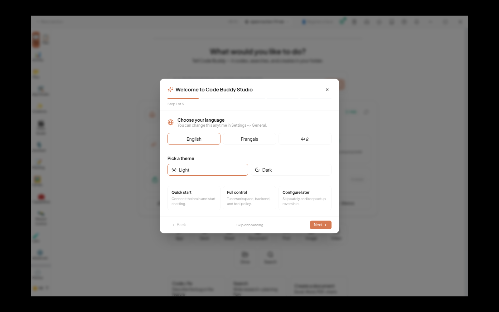
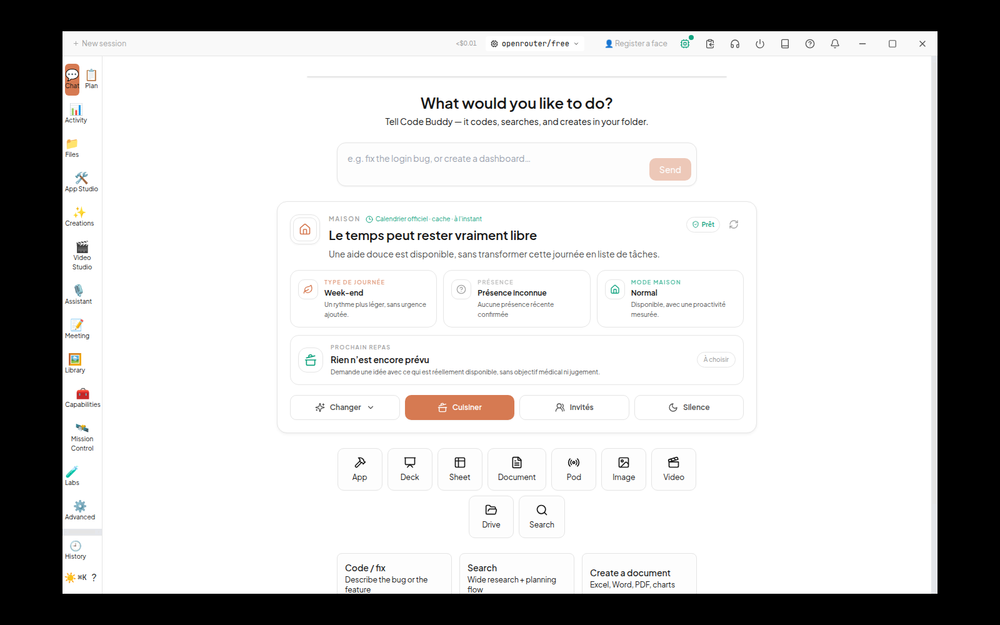
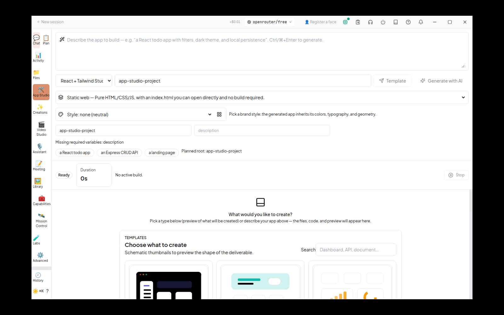

# Réparation du build Cowork / App Builder — ASTRA — 2026-09-12

Les deux causes sont levées. Le build Linux produit les trois sorties, Electron affiche une vraie interface, et le clic sur le rail ouvre App Studio. Aucun changement de règle de sécurité, de lint ou de politique d’outils. Aucun test retiré, aucune installation, aucun push.

- Dépôt : `~/DEV/code-buddy-appbuilder-2026-09-12`.
- Branche : `astra/appbuilder-reload-2026-09-12` ; base vérifiée : `86f9bd9bbd37f8022d6087423c13e600dd3b34cf`.
- Correctif : `80f7111cf` (`fix(cowork): restore Linux build and ship SQL fallback`). Ce rapport et les preuves sont dans le commit documentaire qui le suit.
- Preuves conservées : [répertoire des preuves](appbuilder-build-astra/commands.json) ; travaux temporaires et harnais locaux dans `_qa/appbuilder/` (ignoré par Git).

## Décision, en trois lignes

1. Piste **(b)** : `metadata-catalog.ts` contient les données pures ; `tool-groups.ts` importe ce catalogue pour les aperçus de politique du rendu.
2. `metadata.ts` réexporte le même objet et garde les fonctions CLI, le journal Node, le verrou d’avertissement unique et le filtre d’environnement ; données et corps des fonctions comparés au témoin, identiques hors espaces finaux.
3. Seul `alasql` est externalisé côté principal ; son inclusion explicite dans `prepare-core-runtime.js` garantit la livraison de sa fermeture de dépendances dans `resources/node_modules` et refuse le packaging si le paquet déclaré manque.

`react-native-fs` n’a pas besoin d’être ajouté à `external` : une fois `alasql` externalisé, Rollup ne parcourt plus ses branches React Native. Aucun module n’a été externalisé ou remplacé par un shim côté rendu.

## Reproduction des causes

Les commandes ci-dessous ont toutes été bornées par `timeout 900`. Builds, tests et diffs longs passent par `lm-resizer exec --json -- …` ; `exit_code` est celui de la commande enfant. Le harnais `_qa/appbuilder/run.py` conserve chaque JSON et configure les répertoires temporaires et le stockage lm-resizer dans ce dépôt.

| État | Commande | Sortie | Preuve |
|---|---|---:|---|
| Base | `npx tsc -p .` | 0 | Compilation initiale rejouée, puis compilation finale conservée ci-dessous |
| Base | `cd cowork && npx vite build` | 1 | [Flow `import typeof`, via alasql](appbuilder-build-astra/baseline-vite-cowork.txt) |
| Seul alasql externalisé | `cd cowork && npx vite build` | 1 | [Principal 18,11 s, preload 71 ms ; rendu échoue sur `homedir`](appbuilder-build-astra/baseline-renderer.txt) |
| Corrigé | `npx tsc -p .` | **0** | [Journal](appbuilder-build-astra/final-tsc.txt) |
| Corrigé | `cd cowork && npx vite build` | **0** | [Journal brut](appbuilder-build-astra/fixed-vite.txt) : rendu 12,37 s, principal 18,44 s, preload 156 ms |
| Corrigé | `npm run typecheck` | **0** | [Journal](appbuilder-build-astra/typecheck.txt), inclut gpuNode identity et companion-core |
| Corrigé | `npm run lint` | **0** | [Journal brut final](appbuilder-build-astra/lint-final.txt) : 0 erreur, 2 497 avertissements ; aucune règle changée |
| Corrigé | `git diff --check` | **0** | Après suppression d’une ligne blanche finale introduite pendant l’extraction |

Le build conserve ses avertissements non bloquants : base Browserslist ancienne, tailles de chunks et modules importés à la fois statiquement et dynamiquement. Après correction, plus d’avertissement d’externalisation Node pour le navigateur et aucune occurrence de `__vite-browser-external` dans `cowork/dist`.

### Fichiers réellement produits

| Artefact | Taille en octets |
|---|---:|
| `cowork/dist/index.html` | 945 |
| `cowork/dist-electron/main/index.js` (chargeur) | 171 |
| `cowork/dist-electron/main/index-C9gUtTMF.js` (principal effectif) | 5 939 554 |
| `cowork/dist-electron/preload/index.js` | 46 102 |
| `cowork/dist-electron/main/` : 38 fichiers | 7 776 801 |
| `cowork/dist-electron/preload/` : 1 fichier | 46 102 |
| `cowork/dist/` : 261 fichiers | 11 249 909 |

## Tests ciblés et témoin

Commande racine, sortie **0**, **45/45** tests, 6 fichiers ([journal](appbuilder-build-astra/root-tests.txt)) :

```sh
timeout 900 lm-resizer exec --raw-on-failure -- npm test --   tests/tools/tool-effect.test.ts   tests/tools/context-expand-metadata.test.ts   tests/tools/active-tool-metadata-readers.test.ts   tests/tools/tool-aliases-invariant.test.ts   tests/security/tool-policy/policy-resolver.test.ts   tests/fleet/dispatch-profile.test.ts
```

Commande Cowork, sortie **0**, **25/25** tests, 6 fichiers ([journal final après restitution du correctif](appbuilder-build-astra/cowork-tests-restored.txt)) :

```sh
cd cowork
timeout 900 lm-resizer exec --raw-on-failure -- npx vitest run   tests/renderer-core-boundary.test.ts   tests/tool-profile-inspector-strip.test.ts   tests/hermes-plan-strip.test.ts   tests/vite-config-watch-ignore.test.ts   tests/core-runtime-packaging.test.ts   src/tests/prepare-core-runtime.test.ts
```

Les exécutions enregistrées utilisent `--json` au lieu de `--raw-on-failure`, afin de conserver les métriques et codes de sortie. Les journaux bruts des échecs ont été relus.

**Témoin : 3 échecs / 25 tests**, sortie **1**, avec les quatre fichiers de production concernés restitués exactement depuis `git show 86f9bd9bb:<fichier>`, et les trois nouveaux tests conservés. Restitution du correctif garantie par `finally`, sans stash ni reset. [Journal témoin](appbuilder-build-astra/witness-final.txt).

- Le nouveau test de bundle navigateur refuse `fs`, `path`, `os` amenés par le journal.
- Le nouveau test de livraison constate qu’alasql et sa dépendance ne sont pas sélectionnés.
- Le nouveau test de refus constate que l’absence d’alasql ne fait pas échouer le packaging.
- Les **22 tests existants** passent sur le témoin ; aucun test rouge préexistant n’a été écarté. Après correction, les 25 passent.

La suite globale et `npm run validate` (qui la déclenche) n’ont pas été lancées, conformément à la consigne explicite ; lint et typecheck complets, tests filtrés effectués avant commit.

## Avertissement CLI conservé, sans mock

Commande réelle du CLI compilé, environnement de vérification isolé, sortie **0** :

```sh
timeout 900 python3 _qa/appbuilder/isolated.py node dist/index.js   tools profile safe astra_missing_effect_probe astra_missing_effect_probe
```

Deux décisions `deny`, deux `effect=unknown`, **un seul avertissement** sur stderr ([sortie complète](appbuilder-build-astra/cli-warning-real.txt)) :

```text
WARN  tool metadata missing effect class; treating as unknown {"tool":"astra_missing_effect_probe"}
```

Le test existant `tool-effect.test.ts` vérifie aussi le verrou anti-répétition avec un espion sur `logger.warn`. La preuve ci-dessus passe par Commander et le véritable journal.

## Repli SQL dans une arborescence Electron livrable

La première sonde a révélé qu’alasql est dans les **optionalDependencies** racine, exclues par défaut du staging : une simple externalisation aurait réparé le build local en cassant le repli livré. Le script de staging inclut désormais explicitement ce paquet déclaré et sa fermeture, sans activer toutes les autres options du cœur.

La [sonde conservée](appbuilder-build-astra/package-probe.cjs.txt), exécutée par `timeout 900 node _qa/appbuilder/package-probe.cjs`, sortie **0**, utilise les fonctions réelles `collectInstalledRuntimePackagePaths` et `copyTreeWithHardlinks`. Elle vérifie que chaque paquet de la fermeture SQL appartient à la sélection de production : **414 paquets installés**, y compris les dépendances transitives optionnelles disponibles sur cet hôte. Elle construit un véritable `app.asar` avec une entrée `dist-electron/main/index.js` et les paquets voisins dans `resources/node_modules`.

Commande de vérification, sortie **0** ([journal](appbuilder-build-astra/package-electron.txt)) :

```sh
timeout 900 python3 _qa/appbuilder/isolated.py xvfb-run -a   -s '-screen 0 1600x1000x24'   ./cowork/node_modules/electron/dist/electron --no-sandbox --disable-gpu   ./_qa/appbuilder/sql-package/resources/app.asar
```

Depuis cette archive, `require.resolve('alasql')` est **asserté égal** à `<repo>/_qa/appbuilder/sql-package/resources/node_modules/alasql/dist/alasql.fs.js`, puis `require('alasql')('SELECT 6 * 7 AS answer')` est asserté égal à `[{"answer":42}]`. Il ne suffit donc pas que le paquet soit trouvé dans le `node_modules` du checkout. Les tests existants de configuration de packaging vérifient que Linux, macOS et Windows copient ce staging vers `resources/node_modules`.

Limite précise : c’est un test réel de résolution et d’exécution depuis ASAR, pas la fabrication d’un AppImage complet. `app.isPackaged` vaut `false` avec le binaire Electron de développement ; la résolution testée part néanmoins bien de l’archive et de son emplacement livré.

## Démarrage et App Studio

Parcours : lancement Electron → premier accueil → **Configure later** → tour **Skip** → rechargement de contrôle → clic réel **App Studio** dans le rail → formulaire et galerie visibles. Aucun changement direct du store pour contourner la navigation.

Browser plugin not available : Playwright local a été utilisé via CDP, sur un port aléatoire choisi par Electron. Aucun navigateur ou paquet installé. Xvfb : **1600×1000**, fenêtre **1400×900**. Page `file://<repo>/cowork/dist/index.html`, titre **Code Buddy Studio**.

Commande demandée exécutée depuis `cowork/`, avec le seul ajout fonctionnel `--remote-debugging-port=0` pour piloter l’interface :

```sh
timeout 900 python3 ../_qa/appbuilder/isolated.py xvfb-run -a   -s '-screen 0 1600x1000x24' sh ../_qa/appbuilder/electron-display.sh
# electron-display.sh enregistre DISPLAY et le PID, puis exec :
env NODE_ENV=production ./node_modules/electron/dist/electron   --no-sandbox --disable-gpu --remote-debugging-port=0   ./dist-electron/main/index.js
```

Le harnais isole les paramètres utilisateur et journaux sous `_qa/appbuilder/`, retire les identifiants d’API de son environnement et ne touche pas à la copie de Patrice. L’application n’a lancé aucune génération ni installation de projet. Les seuls états créés sont ceux du profil de test.

`timeout 900 node _qa/appbuilder/ui-navigate.cjs` → **0** ; captures par `timeout 900 import -window root <capture.png>` → **0** avec le DISPLAY et le XAUTHORITY de notre Xvfb. Application arrêtée explicitement par **SIGTERM** sur son PID ; le processus et son Xvfb sont terminés, commande de lancement sortie **0**.

| Contrôle | Résultat |
|---|---|
| Identité de la page et titre | Conforme |
| Fenêtre non blanche | Accueil et rail visibles |
| Moteur et base | `SQLite database initialized successfully` ; `Using Code Buddy engine (embedded)` |
| Overlay d’erreur de framework | Aucun |
| Console principale : erreurs / avertissements | **Aucun** dans le journal de cette exécution |
| Console du rendu au rechargement et à la navigation | **0** `pageerror`, `error`, `warning` ([JSON](appbuilder-build-astra/renderer-errors.json)) |
| Navigation App Studio | Formulaire, cibles de génération, styles, état Ready et galerie visibles |

Console principale : **aucune ligne d’erreur à coller**. Le [journal complet](appbuilder-build-astra/electron-main.log.txt) est conservé, ainsi que la [trace de navigation](appbuilder-build-astra/ui-navigation-final.log.txt).

La mention `Missing required variables: description` dans App Studio correspond au champ de description vide du formulaire ; aucun build n’est en cours. La création d’un projet et un appel IA ne font pas partie de cette preuve d’ouverture.

### Captures X11

Premier démarrage avec accueil :



Accueil après fermeture des guides :



App Studio ouvert depuis le rail :



## Balayage des imports du rendu vers le cœur

Recherche `rg -n '\.\./\.\./\.\./\.\./src/|@codebuddy' cowork/src/renderer`, complétée par un parcours AST des imports (distingue `import type` et imports exécutés). [Liste trouvée](appbuilder-build-astra/renderer-imports.txt).

| Consommateur du rendu | Module du cœur | Node après correction |
|---|---|---|
| `tool-profile-inspector-strip.tsx` | `fleet/dispatch-profile.ts` → politique → catalogue | Non ; chaîne fautive corrigée |
| `hermes-plan-strip.tsx` | `agent/hermes-agent-profile.ts` → dispatch | Non ; même correction |
| `browser-operator-draft-strip.tsx` | `browser-operator-session.ts`, `internet-scout-plan.ts` | Non ; fonctions pures et types |
| `fleet-command-center-helpers.ts` | `agent/agent-run-contract.ts` | Non ; construction de données |
| `useIPC.ts` | `conversation/conversation-orchestrator.ts` | Non ; orchestration d’état pure |
| `message/ContextOptimizationNotice.tsx` | `shared/context-optimization-metadata.ts` | Non ; présentation de données |
| `fleet-outcome-panel.tsx`, `FleetCommandCenter.tsx` | `AgentRun` | Type uniquement, effacé |
| `types/index.ts` | `ContextOptimizationMetadata` | Type uniquement, effacé |

Le nouveau test découvre les imports exécutés et les compile ensemble avec **esbuild `platform: browser`**, sans externals, sans polyfills et sans fichiers écrits. Il vérifie l’absence du journal dans le graphe et l’absence d’imports externes dans les sorties. Aucun autre consommateur trouvé ne tire encore Node ; seuls les modules qui cassaient le build ont été corrigés.

## Incidents de vérification, limites et outillage

- Un premier essai de Vite lancé par erreur depuis la racine avec `--prefix cowork` n’appliquait pas le bon cwd : sortie 1 sur l’entrée Electron absente. Il est exclu de la mesure témoin ; ses neuf fichiers générés ont été retirés nommément et la compilation du cœur a été refaite ensuite et le vrai build depuis `cowork/` est documenté ci-dessus.
- Première capture X11 refusée faute de XAUTHORITY ; corrigée en reprenant l’autorité de **notre** processus Xvfb, sans desserrer les accès X11.
- Premier pilote UI attendait un bouton disparu après `Configure later` ; il a été arrêté. Le suivant a correctement refusé un clic intercepté par le tour d’accueil (timeout 10 s). Le parcours final clique `Skip`, sans forcer le clic ni masquer un défaut du produit.
- Les trois premiers appels Code Explorer ont précédé la fin de l’analyse et ont répondu « No graph snapshot found » ; les consultations utiles ont été rejouées après indexation. `TOOL_METADATA` n’a pas été reconnu comme symbole ; `rg` et l’impact de `resolveToolEffect` ont complété le graphe. L’index de base correspondait à `86f9bd9bb` avant les modifications ; analyse incrémentale après chaque commit.
- La mission ne fournit pas de nouvel emploi CI Linux ni d’AppImage : le build local, les tests de frontière et l’ouverture réelle sont prouvés. La génération de projets reste hors essai.

Outillage : **8 appels Code Explorer (context/impact/query), 21 commandes via lm-resizer, 728 927 octets économisés** (volumes de sortie, pas tokens facturés). [Comptabilité par commande](appbuilder-build-astra/commands.json) ; la compilation initiale silencieuse ajoute une commande à cette liste, avec zéro octet. Journaux bruts pertinents relus avant commit. Les copies commitées normalisent uniquement le chemin du clone en `<repo>` et les espaces de fin de ligne (les NUL de modules virtuels sont échappés en `\0`) ; originaux conservés dans `_qa/appbuilder/`. Les `.txt` ont été ajoutés individuellement avec `git add -f`, car la règle générale `*.txt` les ignore.

Index par tranche : correctif `80f7111cf`, réindexé après commit ; tranche documentaire, analyse incrémentale après son commit. Réservation libérée à la passation. Aucun push, aucun service préexistant arrêté ou modifié ; ComfyUI 8188/8189 et `~/code-buddy` intacts.

**VERDICT: 2/2 causes levées ; témoin 3/25**
