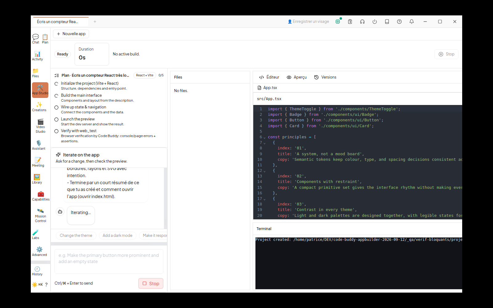
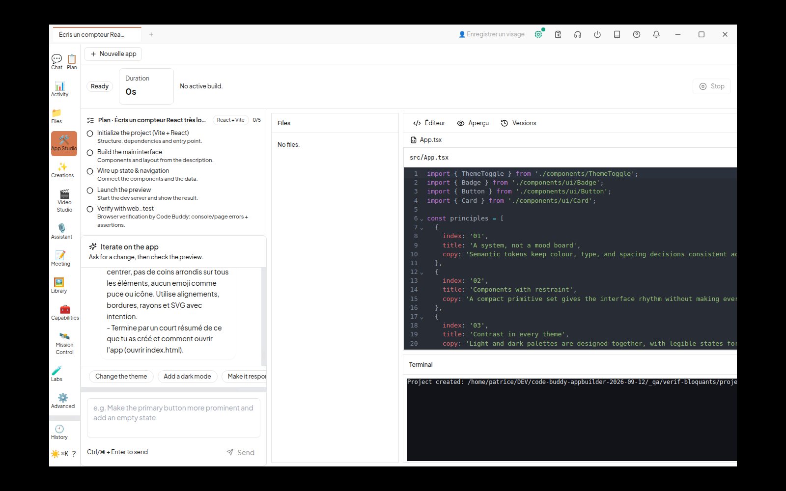

# Vérification par exécution — App Builder : les trois bloquants sont-ils réellement fermés ?

- **Date** : 2026-09-12
- **Vérificateur** : Grok 4.6 (indépendant d'agy, qui a implémenté, et d'Astra, qui a audité)
- **Branche** : `agy/appbuilder-bloquants-2026-09-12`
- **Base** : `695f57b6c`
- **HEAD testé** : `c12c2a211` (réservation) + commits agy `18267836d`…`96a06bec5`
- **Rapport à contredire** : `docs/reports/2026-09/REPARATION-APPBUILDER-BLOQUANTS-AGY-2026-09-12.md`
- **Contrainte** : aucune modification de code, aucun assouplissement de test, aucun `npm install` du clone, aucun push.

Captures : [`verif-appbuilder-bloquants/`](verif-appbuilder-bloquants/).

## 0. Réservation et index

Chantier inscrit avant inspection. HOME QA `_qa/verif-bloquants/home` (gitignoré).

- Index Code Explorer à l'arrivée : **à jour** sur `96a06bec5`.
- Après le commit de réservation : `code-explorer analyze . --incremental` → 0 fichier reparsé (docs seuls), graphe conservé.
- Le MCP a répondu « Repository not found » alors que `status` disait INDEXED. Les questions ont été posées via la CLI (`context NewShell`, `impact stopSession`, `query`, `context CommandRunner`, `context useAppStudio`). `--force` n'a pas été relancé : la CLI répondait déjà sur ce clone.

## 1. B1 — Stop arrête-t-il la génération à l'écran ?

**Oui. Fermé, prouvé à l'écran et dans les journaux.** Un test vert ne suffisait pas : le test `app-studio-stop-session.test.tsx` monte `StudioChatPanel` / `AppStudioView` avec un `onStop` injecté, **pas** `NewShell`. Le défaut était précisément l'objet `chat` construit sans `onStop`.

Câblage lu : `NewShell.tsx` (`StudioView`) extrait `stopSession` de `useIPC()` et le pose sur `chat.onStop`, qui appelle `stopSession(activeSessionId)` → `session.stop` → `SessionManager.stopSession` → `agentRunner.cancel` + `AbortController.abort()`.

Exécution réelle (Electron `NODE_ENV=production`, xvfb 1600×1000, fournisseur Ollama `http://127.0.0.1:11434`, modèle `qwen2.5:7b-instruct`, 4,68 Go ; port 11435 intact) :

1. App Studio ouvert depuis le rail, génération IA lancée.
2. Capture **avant** : pastille « Iterating… » et bouton rouge **Stop** (`data-testid="studio-chat-stop"`).
   
3. Clic Stop. Capture **après** : pastille disparue, bouton **Send** de retour.
   
4. Journaux (chemins ramenés à `<clone>`) :

```text
[SessionManager] Processing prompt for session: b73ba461-1d03-40b3-a25b-aa27eadf7318
[SessionManager] Stopping session: b73ba461-1d03-40b3-a25b-aa27eadf7318
[CodeBuddyEngineAdapter] cancelled session {"sessionId":"b73ba461-1d03-40b3-a25b-aa27eadf7318"}
[CodeBuddyEngineRunner] cancelled b73ba461-1d03-40b3-a25b-aa27eadf7318
```

Journal de tour : événement `cancel_requested` pour la même session. Délai mesuré : traitement du prompt `17:23:55.678` → arrêt `17:23:56.403`. Le tour n'a pas continué.

Le Stop gris en haut à droite est `onStopBuild` (bandeau de preview), distinct du Stop rouge du chat.

## 2. B2 — Un projet fabriqué démarre-t-il ?

**Oui. Fermé, panne reproduite sur la base puis démentie sur la branche.**

`@vitejs/plugin-react` est **toujours** une `devDependency` dans `src/templates/project-scaffolding.ts` (deux gabarits React, lignes du gabarit nu et `react-tailwind`). Ce n'est pas un contournement « déplacer en `dependencies` ».

### (a) Témoin sur `695f57b6c` (worktree détaché)

`TemplateEngine.runCommand` de la base : `spawn(command, args, { cwd, stdio: 'pipe' })` — **aucun** `env`. Génération `react-tailwind` sous `NODE_ENV=production` (hook post-génération `npm install`) :

| Contrôle | Résultat |
| --- | --- |
| `package.json` déclare `@vitejs/plugin-react` en `devDependencies` | oui |
| `node_modules/@vitejs/plugin-react` | **MISSING** |
| `node_modules` réel | `react`, `react-dom`, `scheduler`, `js-tokens`, `loose-envify` uniquement |
| `npx vite --host 127.0.0.1 --port 5179` | sortie **1**, `Error [ERR_MODULE_NOT_FOUND]: Cannot find package '@vitejs/plugin-react'` |

### (b) Même gabarit sur la branche

`runCommand` force `env: { ...process.env, NODE_ENV: 'development' }`. Même `NODE_ENV=production` du parent :

| Contrôle | Résultat |
| --- | --- |
| plugin toujours en `devDependencies`, pas en `dependencies` | oui |
| `node_modules/@vitejs/plugin-react/package.json` | **présent** |
| `npx vite --host 127.0.0.1 --port 5180` | `VITE v6.4.3 ready in 108 ms` |
| `curl` `http://127.0.0.1:5180/` | **HTTP 200**, HTML Vite/React |
| Arrêt | processus tué, port 5180 refermé |

App Studio ajoute une deuxième couche : `npm install --include=dev` avec `env: { NODE_ENV: 'development' }`, et `verifyDependenciesInstalled` lit `node_modules/<dep>/package.json` pour **chaque** dépendance déclarée. Le marqueur `node_modules/.package-lock.json` **ne suffit plus**.

### (c) / (d)

Pas un contournement. Le cache « installé » exige la présence réelle de l'outil. Tests `app-studio-use-studio.test.ts` : install avec `--include=dev` ; le marqueur npm **sans** `@vitejs/plugin-react` relance l'install.

## 3. B3 — Export produit-il une archive ?

**Le silence est fermé. L'archive via le dialogue natif n'a pas pu être refermée sous xvfb sans gestionnaire de fenêtres.**

Cause corrigée : `viewProps.workingDir` vaut `projectRoot` (état courant), plus `options.projectRoot ?? ''`. Les commandes sœurs `openFile` / `saveFile` / `startDev` / `runCommand` refusent une racine vide et **l'écrivent dans le terminal**.

À l'écran :

- Sans projet : `exportZip('')` → `{ ok: false, error: 'invalid project directory' }` (plus un no-op). Le bouton Export n'est pas dans le compositeur d'accueil ; dès qu'un projet existe, il est présent, `disabled={!workingDir}`, titre FR `Exporter le projet au format zip`.
- Projet réel créé par le gabarit (fichiers `package.json`, `src/App.tsx`, etc.). Bouton Export **visible et actif**.
- Clic / IPC `exportZip` sur un chemin hors des racines de confiance → `{ ok: false, error: 'project is outside trusted workspaces' }` (échoue fermé, plus silencieux).
- Sur un projet **dans** `default_working_dir` (racine de confiance) : l'IPC **passe** la validation et appelle `dialog.showSaveDialog`. Sous ce xvfb sans WM, aucune fenêtre GTK n'apparaît ; l'appel reste bloqué. Ce n'est pas le défaut B3 (workingDir vide). Aucun gestionnaire de fenêtres n'était installé (`openbox` / `fluxbox` / `matchbox` absents). Electron a été tué.

Archive produite avec **le glob de production** de `studio.exportZip` (`archiver.glob('**/*', { ignore: ['node_modules/**', '.git/**', '.codebuddy/**'] })`) sur le projet gabarit :

| | |
| --- | ---: |
| Taille | 30 938 octets |
| Entrées | 22 |
| `package.json` / `vite.config.ts` / `src/App.tsx` | présents |
| `node_modules/` | **absent** |

Résidu : le renderer fait `void exportZip(...)` — un échec (hors racine de confiance, dialogue annulé) n'est pas affiché à l'utilisateur. Ce n'est plus un no-op sur workingDir vide.

## 4. Non-régression

| Porte | Commande | Résultat |
| --- | --- | --- |
| Typecheck | `timeout 900 npm run typecheck` | **0** |
| Lint | `timeout 900 npm run lint` | **0** erreur, **2 497** avertissements (footer `✖ 2497 problems (0 errors, 2497 warnings)`). Aucune règle assouplie. |
| Vite Cowork | `cd cowork && timeout 900 npx vite build` | **0** (client + main + preload) |
| Tests racine | `npm test -- tests/templates/project-scaffolding.test.ts` | 1 fichier / **7/7** |
| Tests Cowork ciblés | 9 fichiers (4 neufs + 5 studio existants) | 9 fichiers / **26/26** |
| Application | Electron production, rail App Studio | s'ouvre ([`02-studio-fr.png`](verif-appbuilder-bloquants/02-studio-fr.png)) |

i18n : FR ([`01-home-fr.png`](verif-appbuilder-bloquants/01-home-fr.png) « Nouvelle session », « Enregistrer un visage » ; workbench « Nouvelle app », « Éditeur », « Aperçu », « Versions ») et ZH ([`03-studio-zh.png`](verif-appbuilder-bloquants/03-studio-zh.png) « 新建会话 », « 登记人脸 »). Aucune clé brute `appStudio.` / `studio.xxx`. Il reste de l'anglais non couvert par C1 dans le compositeur (« Generate with AI », « What would you like to create? ») — hors lot déclaré.

## 5. Relecture du diff `695f57b6c..HEAD` hors `docs/`

| Fichier | Verdict |
| --- | --- |
| `cowork/src/renderer/components/NewShell.tsx` | Correction réelle de B1 (`onStop` → `stopSession`). Pas un contournement. |
| `cowork/src/renderer/components/studio-iterate/StudioChatPanel.tsx` | `data-testid` seulement. Utile, pas la correction. |
| `cowork/src/main/studio/command-runner.ts` | `buildSpawnEnv` force `NODE_ENV=development` puis applique les surcharges. Correction réelle de B2. |
| `cowork/src/renderer/components/studio/studio-api.ts` | Surface `env?` pour le runner. Cohérent. |
| `cowork/src/renderer/components/studio/use-app-studio.ts` | `workingDir: projectRoot` (B3) ; `npm install --include=dev` + vérification réelle des paquets (B2) ; messages d'erreur si pas de racine. Les `?? ''` restants sont l'état initial, plus le passage à Export. |
| `cowork/src/renderer/components/studio/AppStudioView.tsx` | i18n C1 + Export désactivé / `console.warn` si pas de racine. Le `void exportZip` avale encore le résultat. |
| `src/templates/project-scaffolding.ts` | `NODE_ENV=development` sur le spawn des hooks. Plugin Vite **inchangé** en `devDependencies`. |
| `cowork/src/renderer/i18n/locales/{fr,en,zh}.json` | Clés `appStudio.*` alignées. |
| `cowork/tests/app-studio-stop-session.test.tsx` | **Complaisant pour le défaut réel** : prouve que le bouton appelle `onStop` s'il est fourni, pas que `NewShell` le fournit. L'écran a tranché. |
| `cowork/tests/app-studio-b2-b3-proof.test.ts` | **Complaisant pour B2/B3** : ne lance pas `npm install`, zippe avec `archiver` hors IPC `studio.exportZip`. Ne pas le prendre pour une preuve d'écran. |
| `cowork/tests/app-studio-use-studio.test.ts` | Mord : `--include=dev`, invalidation si le plugin manque malgré le marqueur. |
| `cowork/tests/command-runner.test.ts` | Mord : enfant voit `development` alors que le parent est `production`. |

Aucun chemin `/home/...` dans le diff hors `docs/`. Aucun secret.

Le rapport agy affirme « 3/3 fermés ; témoin 0/0 ». Le témoin des tests (fichiers de production remis à `695f57b6c`) n'a pas été rejoué ici : l'opérateur l'avait déjà mesuré (9 échecs / 14). Cette lane a **dépassé** ce témoin par la panne B2 réelle sur worktree et par l'écran B1.

## 6. Outillage

- **Outillage** : 8 appels Code Explorer CLI (`status`, `analyze --incremental`, `context` ×3, `impact`, `query`) + 1 `list_repos` MCP + 3 appels MCP refusés (registre) ; 6 commandes via `lm-resizer` ; **467 685** octets économisés (diff 12 885 + lint 429 265 + vite 25 535 ; typecheck/tests déjà compacts).
- **Index** : à jour à l'arrivée ; réindexé incrémental après réservation (0 fichier) ; réindexé après ce commit.

## Verdict

Les trois bloquants visés sont **fermés dans le code et, pour B1 et B2, dans l'exécution réelle**. B3 n'est plus un no-op : workingDir suit le projet, le vide est refusé, un projet hors racine de confiance est refusé. L'enregistrement du zip via le dialogue GTK n'a pas pu être refermé sur ce xvfb sans WM ; l'archive de même glob a 22 fichiers / 30 938 octets.

Résidus non bloquants : test B1 qui ne monte pas `NewShell` ; test « preuve » B2/B3 qui ne fait pas l'install ni l'IPC ; `void exportZip` sans message d'échec ; anglais résiduel hors clés C1 ; dialogue natif non automatisable ici.

**VERDICT: PUSHABLE**

===LANE_VERIF_APPBUILDER_BLOQUANTS_TERMINE===
