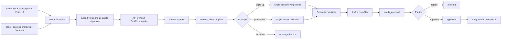

# Raccordement du signal Vision IA au moteur Autoblog de PostCommander

Date de l’étude : **28 juillet 2026**
Périmètre : `~/.codebuddy/veille/`, les études et scripts de `~/code-buddy`,
et le checkout `~/DEV/PostCommander`, audité en lecture seule.

## Décision en une phrase

La bonne architecture n’est pas de donner davantage de contexte à
`generateIdeas()`. Il faut **retirer au modèle le choix du sujet** : un
extracteur local transforme la veille en candidats mesurés, PostCommander les
importe dans les piliers, puis le modèle ne choisit plus que l’angle, le plan et
la formulation. Toute sortie reste un brouillon soumis à Patrice.

La chaîne de responsabilité cible est donc :

```text
signal observé → sujet canonique → preuves → routage → angle → brouillon
               → contrôles → needs_approval → décision de Patrice
```

**Règle absolue : aucune publication automatique.** Une approbation ne doit
elle-même déclencher aucune publication : Patrice approuve, puis programme ou
publie explicitement.

---

## 1. Inventaire factuel du signal disponible

### 1.1 État constaté sur disque

L’état ci-dessous est celui réellement lu le 28 juillet 2026, pas celui d’une
description antérieure du corpus.

| Élément | État vérifié |
|---|---|
| Dossier `~/.codebuddy/veille/` | 275 Mio environ, **1 373 fichiers physiques** |
| `inventaire-vision-ia.json` | 1 412 533 octets, mis à jour à `2026-07-28T09:08:46+02:00` |
| Entrées de l’inventaire | **678 vidéos** |
| Vidéos réellement attribuées à Vision IA | **668** |
| Autres chaînes présentes dans ce même inventaire | **10 vidéos** : Matt Wolfe (2), Matthew Berman (2), Theoretically Media (2), Two Minute Papers (2), AI Explained (1), MattVidPro (1) |
| Période Vision IA | du 10 juin 2023 au 28 juillet 2026 |
| Compteurs de vues Vision IA | **665 sur 668** ; 3 valeurs nulles |
| Durées Vision IA | **666 sur 668** |
| Transcriptions | **674 `.txt`** et **674 sidecars `.json`** |
| Transcriptions Vision IA | **664 sur 668** |
| Vidéos Vision IA sans transcription | `EEzWktOqnAY`, `Zb7hwUyANlU`, `eCEq_ld1IAg`, `sl0WCUKKYxA` |
| `raw/vision-ia-videos.jsonl` | **667 lignes**, 268 159 961 octets |
| `BASE-CONNAISSANCES-VISIONAI.md` | inventaire tabulaire de 678 entrées et 18 fiches présentées comme analysées |
| `analyses/` | **13 fichiers JSON** présents |
| `CATALOGUE-OUTILS.md` | **93 entrées dédupliquées**, et non 38 dans l’état actuel |
| `index.json` | 94 entités dans `items`, mais seulement 18 vidéos dans `seen_videos` |

La valeur « 693 fichiers » correspond donc à un comptage plus ancien ou à des
documents logiques. Le stockage actuel associe notamment un `.txt` et un
sidecar `.json` à chaque transcription, ce qui double presque le nombre de
fichiers.

Il existe aussi un écart historique explicable : l’étude transversale
`2026-07-28-analyse-chaine-vision-ia.md` a été arrêtée à **667 vidéos jusqu’au
26 juillet**. L’inventaire courant contient désormais **668 vidéos Vision IA**,
dont celle du 28 juillet, plus 10 vidéos de veille comparables. Pour toute
mesure de la chaîne, il faut filtrer :

```text
channel_id == "UCyc03X3uRuxM9n7fyRH_gIw"
```

Le nom du fichier `inventaire-vision-ia.json` et son `channel_id` de tête ne
suffisent pas à garantir que chaque ligne vient de Vision IA.

### 1.2 Ce que les fichiers permettent réellement d’extraire

#### Métadonnées éditoriales et de performance

Chaque entrée de `inventaire-vision-ia.json` porte :

- l’identifiant YouTube stable ;
- le titre ;
- la date et l’heure de publication ISO ;
- la durée en secondes lorsqu’elle est disponible ;
- le compteur de vues relevé lors de l’inventaire ;
- l’URL ;
- la description intégrale, qui contient souvent chapitres, liens et sources ;
- le nom et l’identifiant de chaîne.

Exemple de contrôle de cohérence : le maximum observé est
« L’interview INTERDITE de l’ex-PDG de Google FUITE », publiée le
27 novembre 2024, avec **1 159 519 vues** au relevé. Ce compteur est un
instantané, pas une courbe de progression.

`raw/vision-ia-videos.jsonl` conserve, pour 667 vidéos, le JSON brut de
`yt-dlp`. Il contient bien davantage : vues, likes, commentaires, chapitres,
miniatures, tags, formats et métadonnées de playlist. Il pèse 268 Mo surtout à
cause des listes de formats, miniatures et sous-titres disponibles. Il ne faut
pas le charger tel quel dans PostCommander.

#### Transcriptions

Les fichiers `transcripts/<video_id>.txt` sont du texte français nettoyé,
ligne par ligne, **sans timecodes**. Ils sont directement interrogeables par
recherche plein texte ou extraction d’entités. Les sidecars
`transcripts/<video_id>.json` donnent :

```json
{
  "video_id": "2f3jm04Rso4",
  "language": "fr-orig",
  "source": "2f3jm04Rso4.fr-orig.vtt",
  "downloaded_at": "2026-07-28T04:33:03+02:00",
  "characters": 17730
}
```

On peut donc relier sans ambiguïté texte, vidéo, date, titre et vues. En
revanche, le `.txt` ne permet pas de retrouver précisément le moment où une
entité est prononcée. Pour fabriquer des citations vidéo minutées, il faudrait
conserver ou retraiter le VTT source.

#### Entités, outils, entreprises et modèles

Deux représentations coexistent :

1. `CATALOGUE-OUTILS.md` est une vue humaine de **93 entités** : nom, éditeur,
   fonction, lien cité, scores Code Buddy/média/biomédical/Lisa, première
   mention et recommandation ;
2. `index.json.items` est la représentation structurée actuelle : 94 entités
   réparties en 34 modèles, 27 outils, 13 annonces, 8 recherches, 7 méthodes,
   4 jeux de données et 1 formation.

Les 94 entités totalisent 107 rattachements à des vidéos. Ce catalogue ne
représente toutefois que les **18 vidéos présentes dans `seen_videos`**, pas
les 668 vidéos Vision IA. Il sert de dictionnaire de départ, pas de série
temporelle complète. Son `first_seen` signifie donc « première observation
parmi les fiches analysées », pas « première mention historique dans la
chaîne ».

Le dossier `analyses/` contient 13 analyses JSON détaillées. Une analyse porte
notamment `main_subject`, `summary`, un bloc `editorial` (hook, structure, CTA,
format) et des `items` structurés avec éditeur, type, lien, usages, preuve et
scores. Cinq fiches visibles dans `index.json`/la base Markdown n’ont pas de
fichier homologue dans `analyses/` au moment du contrôle.

### 1.3 Structure exacte de `inventaire-vision-ia.json`

Le document est un **objet**, pas un tableau. Son schéma constaté est :

```ts
{
  version: 1;
  channel_id: string;
  channel_name: string;
  uploads_playlist_id: string;
  count: number;                // 678
  updated_at: string;           // ISO 8601
  videos: Array<{
    video_id: string;
    channel_name: string;
    channel_id: string;
    title: string;
    published: string;          // ISO 8601
    upload_date: string;        // YYYYMMDD ou chaîne vide
    duration: number | null;    // secondes
    view_count: number | null;
    url: string;
    description: string;
  }>;
}
```

Les 678 objets `videos` ont exactement ces onze clés. Attention à
l’incohérence sémantique : les champs de tête désignent Vision IA, mais dix
éléments de `videos` désignent d’autres chaînes.

### 1.4 Structure exacte de `index.json`

Le document est également un objet. Les nombres ci-dessous sont ceux du
fichier contrôlé :

```ts
{
  version: 1;
  created_at: string;

  aliases: Record<string, string>;       // 43 alias → clé canonique

  items: Record<string, {               // 94 entités
    key: string;
    name: string;
    family: string;
    publisher?: string;
    link?: string;
    kind:
      | "annonce"
      | "formation"
      | "jeu de données"
      | "modèle"
      | "méthode"
      | "outil"
      | "recherche";
    description: string;
    use_cases: string[];
    evidence: string;
    code_buddy: {
      score: number;
      justification: string;
      a_tester: boolean;
    };
    media: {
      score: number;
      justification: string;
      a_tester: boolean;
    };
    lisa: {
      score: number;
      justification: string;
    };
    biomedical: {
      score: number;
      justification: string;
      a_tester: boolean;
    };
    first_seen: string;
    last_seen: string;
    occurrences: number;
    sources: Array<{
      video_id: string;
      title: string;
      channel: string;
      published: string;
      url: string;
    }>;
  }>;

  reports: Array<{                      // 2 rapports
    analyzed_at: string;
    channel: string;
    new_tool_keys: string[];
    summary: string;
    title: string;
    url: string;
    video_id: string;
  }>;

  seen_videos: Record<string, {         // 18 vidéos
    analyzed_at: string;
    channel: string;
    title: string;
    published: string;
    url: string;
    transcript_language: string;
    item_keys: string[];
    main_subject?: string;              // présent sur 13
    summary?: string;                   // présent sur 13
    editorial?: {
      hook: string;
      structure: string[];
      cta: string;
      format: string;
    };                                  // présent sur 13
  }>;

  tools: Record<string, {               // 16 entrées, ancien schéma
    aliases: string[];
    code_buddy: { reason: string; score: number };
    first_seen_at: string;
    kind: string;
    lisa_topic: { reason: string; score: number };
    media: { reason: string; score: number };
    name: string;
    recommendation: string;
    sightings: string[];
    source: {
      channel: string;
      published: string;
      url: string;
      video_id: string;
      video_title: string;
    };
    source_quote: string;
    use_case: string;
    what_it_does: string;
  }>;

  videos: Record<string, {              // 2 entrées, ancien schéma
    analyzed_at: string;
    channel: string;
    duplicate_names: string[];
    model: string;
    new_tool_keys: string[];
    status: string;
    title: string;
    transcript_sha256: string;
    url: string;
  }>;
}
```

`items`/`seen_videos` et `tools`/`videos` sont deux générations de schéma
présentes simultanément. Le raccordement doit lire d’abord `items` et
`seen_videos`, et considérer `tools` et `videos` comme compatibilité historique.
Il ne faut pas additionner leurs compteurs.

### 1.5 Qualité et limites du corpus

- Les vues sont un seul relevé, sans historique J+1/J+7/J+30.
- Le compteur global `updated_at` donne l’heure approximative du relevé, pas
  une heure par vidéo.
- Les transcriptions automatiques comportent des erreurs de noms propres.
- Les descriptions et transcriptions rapportent parfois une affirmation
  secondaire : elles ne remplacent pas la source primaire.
- Le catalogue d’entités est riche mais ne couvre que 18 vidéos analysées.
- Le corpus reflète les décisions d’une chaîne, ses miniatures, sa croissance,
  son audience et sa distribution YouTube.

**Biais central : Vision IA n’est pas “le marché”.** C’est un excellent signal
éditorial sur ce qui a été choisi et a fonctionné auprès d’un public donné. Ce
n’est ni le volume de recherche Google, ni l’intention d’achat de décideurs, ni
la demande des lecteurs de Patrice. Il faut l’utiliser comme un capteur parmi
d’autres, jamais comme une vérité générale.

---

## 2. Signaux à calculer

### 2.1 Performance par sujet, corrigée de l’ancienneté

Le ratio naïf `vues / jours` est utile pour une première inspection, mais il
survalorise mécaniquement les vidéos toutes fraîches et suppose à tort une
croissance linéaire.

La meilleure mesure disponible avec un seul instantané est un **résidu de
performance par cohorte d’âge** :

1. calculer `age_jours = updated_at - published` ;
2. regrouper provisoirement en 0–7, 8–30, 31–90, 91–365 et plus de 365 jours ;
3. dans chaque cohorte, comparer `log(1 + vues)` à la médiane et à la dispersion
   robuste (MAD) ;
4. attribuer à chaque vidéo un percentile ou un z-score robuste ;
5. agréger par sujet avec la médiane, pas la somme, afin qu’un thème très
   fréquent ne gagne pas uniquement par volume.

Quand assez de données sont disponibles, une régression robuste est meilleure :

```text
log(1 + vues) ~ spline(log(1 + âge)) + année de publication
                + durée + format + récapitulatif_hebdo
performance_corrigée = résidu du modèle
```

**Ce que cela vaut :** un classement relatif au reste de la chaîne, à âge
comparable.
**Limites :** aucune correction fiable de miniature, CTR, rétention,
abonnés au moment de la publication, promotion externe ou changement
d’algorithme. Un score élevé n’établit pas que le sujet, seul, a causé les vues.

Priorité de collecte future : enregistrer un snapshot compact
`video_id, observed_at, view_count` chaque jour. Après quelques mois, les vues
à J+1, J+7, J+30 et la pente récente seront bien plus informatives que le
résidu historique.

### 2.2 Récurrence et capacité à nourrir un média

Après regroupement multi-label des titres et transcriptions, calculer pour
chaque thème :

- nombre de vidéos distinctes ;
- nombre de mois et trimestres actifs ;
- médiane du délai entre deux traitements ;
- part des récapitulatifs et part des mono-sujets ;
- médiane de performance corrigée ;
- persistance : trimestres actifs / trimestres observables depuis la première
  mention.

Un thème durable a une présence répartie dans le temps et une performance
correcte, pas seulement dix mentions dans une semaine.

**Ce que cela vaut :** très bon indicateur de “réservoir éditorial” pour un
pilier.
**Limites :** la récurrence peut refléter l’obsession du créateur ou les
communiqués répétés d’un éditeur. Une vidéo hebdomadaire contient plusieurs
sujets : le classement doit être multi-label et compter les vidéos distinctes,
pas le nombre brut de mots.

### 2.3 Fraîcheur et réactivité

La mesure souhaitée est :

```text
délai_réaction = published_at_vidéo - announced_at_source_primaire
```

Le premier terme existe. **Le second n’existe pas de manière fiable dans le
corpus local.** Les descriptions et `index.items.link` fournissent parfois
l’URL primaire, mais `sources[].published` est la date de la vidéo, pas celle
de l’annonce.

Il faut donc enrichir chaque événement avec :

- URL primaire canonique ;
- `announced_at` lu sur le billet officiel, le papier, le dépôt ou le
  communiqué ;
- type de date (`publication`, `mise à jour`, `embargo`) ;
- niveau de confiance et méthode d’extraction.

Si aucune source primaire datée n’est trouvée, le délai reste `null`. Il ne
faut pas inventer une date à partir du titre.

**Ce que cela vaut :** bon indicateur opérationnel de la fenêtre de réaction
de Vision IA et du temps restant pour Lisa/les blogs.
**Limites :** annonces sous embargo, fuseaux horaires, republications et
sources modifiées. Ce signal exige un enrichissement Web, il n’est pas
calculable honnêtement à partir du seul JSON actuel.

### 2.4 Entités montantes

Le `CATALOGUE-OUTILS.md` fournit une amorce d’ontologie, mais sa colonne
« première mention » ne suffit pas. Il faut parcourir les 664 transcriptions
Vision IA disponibles et compter, par mois :

- nombre de vidéos distinctes mentionnant l’entité ;
- fréquence pour 100 vidéos publiées ;
- fréquence pour 100 000 caractères de transcription ;
- nombre de cooccurrences avec des thèmes stratégiques ;
- première et dernière apparition ;
- momentum : fréquence sur 90 jours comparée aux 180 jours précédents ;
- pente sur six mois, avec un minimum de trois vidéos distinctes.

La résolution d’entités doit utiliser les 43 alias existants, puis les enrichir
(`Claude`, `Anthropic Claude`, versions Opus/Sonnet ; `Gemini`, modèles et
éditeur). Les versions doivent rester distinctes sous une famille commune.

**Ce que cela vaut :** bon détecteur de montée durable et de bascule d’acteur.
**Limites :** erreurs de transcription, renommages, mentions négatives ou
sponsorisées, et effet “récap hebdo”. Compter les vidéos distinctes et garder
le contexte de phrase limite les faux signaux.

### 2.5 Les creux : couverture, demande et opportunité

Il faut distinguer trois notions que le corpus Vision IA ne peut pas confondre :

1. **creux de couverture** : sujet très présent dans les flux externes, peu
   traité par Vision IA ;
2. **creux de demande** : requêtes ou impressions élevées, peu de contenu
   disponible ;
3. **creux stratégique** : sujet demandé et pertinent pour Agile Up ou Patrice,
   même si l’audience généraliste est modeste.

`find-subjects.py` sait déjà agréger Google News et neuf flux tech français,
filtrer par fraîcheur, dédupliquer, appliquer `editorial_policy.py`, puis faire
classer uniquement des titres sourcés. Il mesure donc une **pression
médiatique**, pas une demande de recherche.

Pour un vrai score de creux :

```text
opportunité =
  demande_externe_normalisée
  × adéquation_au_site
  × faiblesse_de_couverture_Vision_IA
  × capacité_de_contribution_originale
```

Sources externes possibles, par ordre de valeur :

- impressions, requêtes et positions de Google Search Console des deux sites ;
- tendances de requêtes avec historique et géographie France ;
- nombre de sources primaires et de médias indépendants sur sept jours ;
- commentaires/questions récurrents de l’audience, si disponibles ;
- autres chaînes comparables, à condition d’élargir les dix vidéos actuellement
  présentes.

**Ce que cela vaut :** c’est le meilleur détecteur de place éditoriale quand il
croise demande et légitimité.
**Limites :** les RSS ne mesurent pas la demande, les volumes SEO ne mesurent
pas l’intention commerciale et Search Console ne voit que les requêtes pour
lesquelles les sites ont déjà une visibilité. Sans donnée externe, on peut
calculer un creux de couverture, pas un creux de demande.

### 2.6 Score de sélection recommandé

Ne pas réduire la décision à un score opaque. Conserver les composantes et
leurs preuves :

```text
25 % performance corrigée Vision IA
20 % récurrence/persistance
15 % momentum des entités
15 % corroboration externe et fraîcheur
15 % adéquation au public du site
10 % capacité de contribution originale
− pénalité doublon
− pénalité source primaire absente
− pénalité sujet exclu ou sensible
```

Le score sert à ordonner une file. Il ne donne jamais une autorisation de
publication.

---

## 3. Raccordement technique à PostCommander

### 3.1 État réel du checkout PostCommander

Le code actuel ne forme pas encore la chaîne décrite dans l’énoncé. Deux
circuits parallèles existent :

- `server/src/services/pillars/index.ts:336-403` : `generateIdeas()` demande au
  LLM des idées et les insère dans `content_ideas` ;
- `server/src/workers/autoblog.worker.ts:70-224` : Autoblog parcourt
  `auto_blog_configs` et régénère périodiquement à partir du même champ
  `topic`.

Le worker ne lit ni `content_pillars`, ni `content_ideas`, et le schéma
`auto_blog_configs` n’a ni `pillar_id` ni `idea_id`
(`server/src/db/schema.ts:429-455`). Pour `news-comment` seulement, il appelle
`searchWeb(conf.topic, 3)`.

Quatre écarts doivent être corrigés avant tout raccordement :

1. le même `topic` peut être retraité à chaque fréquence sans mémoire de sujet ;
2. en cas d’échec de lecture de patricehuetz.fr, les lignes 51–58 du worker
   renvoient trois **fausses sources de secours** ;
3. le marqueur `publish:patricehuetz.fr` permet un appel direct à l’API de
   publication, et une erreur réseau est même annoncée comme succès simulé
   (`autoblog.worker.ts:175-199`) ;
4. le post généré est inséré directement en `scheduled` à H+1
   (`autoblog.worker.ts:202-217`), alors que le journal dit “saved draft”.

Cela contourne le circuit réel
`draft → needs_approval → approved` disponible dans `posts` et
`post_approvals` (`server/src/db/schema.ts:89-135` et
`server/src/controllers/posts-collab.controller.ts:195-295`).

### 3.2 Architecture cible



L’extracteur doit vivre avec les données, par exemple sous
`~/code-buddy/scripts/influencer/`, et produire un artefact compact comme :

```text
~/.codebuddy/veille/exports/postcommander-subjects.v1.json
```

Il ne doit copier ni les 275 Mo ni les transcriptions complètes dans
PostCommander. Il exporte seulement les candidats, métriques, preuves et
chemins/URLs utiles.

### 3.3 Contrat d’export proposé

```json
{
  "version": 1,
  "generated_at": "2026-07-28T12:00:00+02:00",
  "source_snapshot": {
    "inventory_updated_at": "2026-07-28T09:08:46+02:00",
    "vision_ia_channel_id": "UCyc03X3uRuxM9n7fyRH_gIw"
  },
  "candidates": [
    {
      "id": "sig_sha256...",
      "canonical_key": "famille-entite-evenement",
      "canonical_topic": "Sujet factuel, sans angle inventé",
      "entities": ["éditeur", "modèle"],
      "themes": ["modèles-locaux", "souveraineté"],
      "metrics": {
        "performance_percentile": 0.81,
        "recurrence": 0.74,
        "momentum": 0.68,
        "external_coverage": 0.52,
        "external_demand": null,
        "overall_score": 0.71
      },
      "evidence": [
        {
          "type": "youtube",
          "video_id": "…",
          "title": "…",
          "published_at": "…",
          "view_count": 123456,
          "url": "https://www.youtube.com/watch?v=…"
        }
      ],
      "primary_sources": [
        {
          "url": "https://…",
          "publisher": "…",
          "published_at": "…",
          "verified_at": "…"
        }
      ],
      "substance": {
        "distinct_videos": 10,
        "distinct_primary_sources": 3,
        "proposed_contribution": "Comparaison longitudinale absente des annonces",
        "ready": true
      },
      "route": {
        "target": "agile-up",
        "confidence": 0.86,
        "reasons": ["données", "architecture", "souveraineté"]
      }
    }
  ]
}
```

`null` est une information : une demande externe non mesurée ne doit jamais
devenir zéro ni être devinée par un LLM.

### 3.4 Modèle de données PostCommander

La solution robuste est une petite table de provenance, pas un gros JSON
enfoui dans `description`.

#### Nouvelle table `subject_signals`

Champs minimaux :

- `id`, `user_id`, `workspace_id` ;
- `external_id` et `canonical_key` ;
- `topic`, `entities` JSON, `themes` JSON ;
- `metrics` JSONB, `evidence` JSONB, `primary_sources` JSONB ;
- `proposed_contribution`, `substance_ready` ;
- `target_site`, `route_confidence`, `route_reasons` ;
- `source_snapshot_at`, `imported_at` ;
- `status` : `new`, `shortlisted`, `rejected`, `consumed`.

Contrainte unique : `(workspace_id, external_id)`.

#### Enrichissement de `content_ideas`

Ajouter :

- `source`: `manual | llm | signal` ;
- `signal_id` nullable, clé étrangère ;
- `target_site`: `agile-up | patricehuetz | human_review` ;
- `canonical_key` ;
- `content_format`: `article | lisa_long | lisa_short`.

Contraintes uniques :

```text
(workspace_id, signal_id, target_site, content_format)
(workspace_id, canonical_key, target_site, content_format)
```

La seconde protège aussi les imports historiques sans `signal_id`.

#### Évolution de `auto_blog_configs`

Le champ `topic` peut rester pour compatibilité manuelle, mais une configuration
pilotée par signal doit ajouter :

- `pillar_id` ;
- `topic_source`: `manual | signal` ;
- `target_site` ;
- `max_drafts_per_week` ;
- `min_substance_ready = true`.

Le job enfant devient :

```ts
{ configId: string, ideaId: string }
```

Le dispatcher réclame atomiquement la prochaine idée éligible, afin que deux
workers ne rédigent pas le même sujet.

#### Traçabilité dans `posts`

Ajouter `content_idea_id`, `target_site` et éventuellement
`research_bundle` JSONB. `platforms: ["linkedin"]` ne doit plus servir de
destination fictive à un article de blog.

### 3.5 API et fichiers concernés

Modifications futures, non réalisées dans cette étude :

| Besoin | Fichiers concernés |
|---|---|
| Migration et nouvelles colonnes | `server/src/db/schema.ts`, nouvelle migration `server/drizzle/*` |
| Validation du contrat d’import | `shared/src/schemas/pillars.ts` ou nouveau `shared/src/schemas/signals.ts` |
| Import idempotent | `server/src/services/pillars/index.ts`, `server/src/controllers/pillars.controller.ts`, `server/src/routes/pillars.routes.ts` |
| Endpoint | `POST /api/pillars/:id/signals/import` ; option `dryRun=true` recommandée |
| Types client | `client/src/services/api.ts` |
| Boîte de réception et routage | `client/src/pages/PillarsPage.tsx` |
| Sélection d’une idée plutôt que du thème statique | `server/src/workers/autoblog.worker.ts` |
| Dossier de preuves transmis au rédacteur | `server/src/services/llm/types.ts`, `server/src/services/llm/index.ts`, `server/src/services/ai/blog-prompts.ts` |
| Cible et suppression de l’autopublication | `shared/src/schemas/autoblog.ts`, `server/src/controllers/autoblog.controller.ts`, `client/src/services/autoblog.ts`, `client/src/pages/AutoBlogPage.tsx`, `client/src/pages/wizards/AutoBlogWizard.tsx` |
| Approbation | réutiliser `server/src/controllers/posts-collab.controller.ts` et `client/src/pages/ApprovalsPage.tsx` |

`generateIdeas()` peut rester pour les idées manuelles, mais le mode signal ne
doit jamais l’appeler. Un modèle peut proposer trois **angles** pour un
`canonical_topic` immuable ; il ne peut ni changer l’entité, ni ajouter une
annonce absente des preuves.

### 3.6 Déduplication et mémoire de publication

La déduplication doit fonctionner à quatre niveaux :

1. **identité forte** : même URL primaire, même identifiant YouTube ou même
   `external_id` ;
2. **clé canonique** : normalisation accents/casse/version, alias d’entités,
   type d’événement et fenêtre temporelle ;
3. **similarité sémantique** : titre + résumé, utilisée comme alerte à partir
   d’un seuil élevé, jamais comme suppression silencieuse ;
4. **mémoire éditoriale** : recherche dans idées, brouillons, articles
   approuvés, programmés et publiés des deux sites.

Une nouvelle version d’un modèle n’est pas automatiquement un doublon. Elle
doit répondre à une question nouvelle : nouvelle capacité, nouveau coût,
nouvelle conséquence ou retour d’expérience mis à jour.

Le passage à `published` consomme le couple
`signal_id + target_site + content_format`. Un même signal peut donc alimenter
un article, une longue et un Short, mais pas deux fois le même format sur le
même site.

---

## 4. Routage entre les deux blogs

### 4.1 Règle automatique

Calculer deux scores explicables, de 0 à 5.

| Signal | `agile-up.com` — Journal | `patricehuetz.fr` — blog |
|---|---:|---:|
| Architecture, code, agents, API, infrastructure, sécurité | +2 | 0 |
| Open source, local, confidentialité, souveraineté des données | +2 | 0 |
| Coûts, benchmarks reproductibles, productivité d’équipe, décision build/buy | +2 | 0 |
| Écriture, narration, personnages, édition, saga, métier d’auteur | 0 | +2 |
| Coulisses réelles d’un livre ou d’un univers de Patrice | 0 | +3 |
| IA créative utilisée dans un processus de romancier | +1 si pipeline technique | +2 si expérience d’auteur |
| Actualité générale sans conséquence propre au public | 0 | 0 |

Décision :

```text
si max(score_agile, score_patrice) < 3       → rejet ou arbitrage humain
si abs(score_agile - score_patrice) < 2      → arbitrage humain
sinon                                        → site au score le plus élevé
```

Le routage décide du **public**, pas seulement du vocabulaire :

- `agile-up.com` : “quelle décision technique ou organisationnelle un
  responsable doit-il prendre ?” ;
- `patricehuetz.fr` : “qu’est-ce que cela change au travail d’écrire, à la
  fabrication d’une saga ou au regard d’un romancier ?”.

Le Journal d’Agile Up reste ainsi une vitrine d’expertise pour des décideurs
techniques. Le blog de Patrice — 18 articles signalés dans le périmètre de la
mission — reste un espace de lecteur et d’auteur, pas un second magazine
technique généraliste.

Un sujet “nouveau modèle vidéo” peut donc devenir :

- sur Agile Up : architecture, données, coûts et reproductibilité d’un pipeline
  média ;
- chez Patrice : ce que l’outil change — ou ne change pas — à la continuité
  visuelle d’un personnage.

Ce ne sont deux articles légitimes que s’ils ont deux thèses et deux preuves
propres. Sinon, un seul site est choisi.

### 4.2 Ce qui reste humain

Patrice arbitre obligatoirement :

- tout score serré ou faible ;
- toute affirmation à la première personne ;
- tout sujet touchant un client, un partenaire ou une situation personnelle ;
- tout sujet juridique, médical, social ou réputationnel ;
- toute proposition susceptible de brouiller la ligne éditoriale d’un site ;
- toute réutilisation d’un signal déjà publié ailleurs ;
- la “contribution originale” promise par l’article.

`editorial_policy.py` doit être appliqué avant import, puis une seconde fois
côté PostCommander. Le filtre actuel couvre notamment France Travail,
l’assurance chômage, le CCAS et les partenaires configurés localement.

---

## 5. Qualité : la contrainte supérieure au volume

### 5.1 Le risque exact

Google ne sanctionne pas un texte parce qu’une IA a participé à sa rédaction.
Il vise le contenu produit à grande échelle sans valeur ajoutée, notamment
l’**abus de contenu à grande échelle**. Ses recommandations demandent de
l’information originale, une analyse substantielle, une expérience réelle, des
sources claires et un contenu créé d’abord pour des personnes. Elles précisent
que des pages, voire un site entier, peuvent être moins bien classés ou omis en
cas de violation :

- [Créer du contenu utile, fiable et axé sur les personnes](https://developers.google.com/search/docs/fundamentals/creating-helpful-content) ;
- [Recommandations de Google sur le contenu généré par IA](https://developers.google.com/search/docs/fundamentals/using-gen-ai-content) ;
- [Google Search Essentials](https://developers.google.com/search/docs/essentials).

La conséquence pratique n’est pas “cacher l’IA”, mais démontrer qui a écrit,
comment les faits ont été vérifiés et pourquoi cette page mérite d’exister.

### 5.2 Cadence prudente

Cadence proposée :

- pilote de huit semaines : **un article maximum par semaine au total** sur les
  deux sites ;
- après revue Search Console et qualité : **deux articles maximum par semaine
  au total**, jamais plus d’un par site et par semaine ;
- au moins 72 heures entre deux publications ;
- aucune obligation de remplir le quota.

La cadence est un plafond. Si aucun sujet ne franchit le seuil de substance, la
bonne cadence est zéro.

### 5.3 Seuil de substance

Chaque candidat doit déclarer avant rédaction :

```text
CONTRIBUTION ORIGINALE :
En quoi cet article apporte-t-il quelque chose que les trois meilleurs
résultats ou les annonces officielles n’apportent pas ?
```

Le brouillon n’est autorisé que s’il satisfait au moins un patron fort :

- synthèse longitudinale de 5 à 10 vidéos réparties dans le temps, recoupée par
  au moins deux sources primaires ;
- test maison reproductible avec protocole, captures, résultats et limites ;
- étude de cas Agile Up anonymisée et vérifiable ;
- comparaison chiffrée que les annonces ne font pas ;
- retour d’expérience réel de Patrice, fourni par Patrice et non inventé ;
- essai de romancier appuyé sur un passage, une décision de narration ou une
  coulisse concrète.

Pour les articles de synthèse proposés dans la mission, viser **10 vidéos sur
un même thème** est un excellent seuil. Pour une annonce très récente, remplacer
ce volume par un test original ou une comparaison primaire solide.

Le prompt actuel de `blog-prompts.ts` exige un retour d’expérience à la première
personne. C’est dangereux si `authorContext` ne fournit aucune expérience
réelle. La future consigne doit interdire “j’ai testé” sans pièce de preuve.

### 5.4 Sources et fact-checking

Exigences minimales :

- source primaire pour chaque annonce, prix, benchmark ou capacité ;
- au moins une source indépendante pour les affirmations contestables ;
- liens au niveau de l’affirmation, puis bibliographie datée ;
- date de consultation pour les pages susceptibles d’évoluer ;
- Vision IA citée comme source secondaire d’analyse, jamais comme preuve
  unique d’un fait technique ;
- distinction explicite entre annonce éditeur, démonstration, benchmark et test
  maison ;
- aucune source fictive ou de secours.

Le fallback codé dans `fetchPatriceBlogArticles()` et le “succès simulé” de
publication doivent être supprimés avant toute activation réelle. Une panne
doit produire un échec visible, pas une donnée inventée.

### 5.5 Circuit obligatoire

```text
draft
  → contrôles automatiques non créatifs
    (sources, liens, doublon, substance, destination, politique éditoriale)
  → needs_approval
  → relecture et décision de Patrice
  → approved ou rejected
  → programmation/publication explicite par Patrice
```

Checklist humaine :

- la thèse est-elle vraie et utile pour ce public ?
- la contribution originale promise est-elle réellement présente ?
- chaque chiffre est-il sourcé ?
- les citations et illustrations sont-elles autorisées ?
- les passages à la première personne viennent-ils de Patrice ?
- le titre décrit-il le contenu sans exagération trompeuse ?
- le site cible est-il le bon ?
- un article proche existe-t-il déjà ?

La case “Activer la publication automatique sur patricehuetz.fr” de
`client/src/pages/AutoBlogPage.tsx:220-237` doit disparaître. Il ne faut pas la
remplacer par une case similaire pour Agile Up.

---

## 6. Un sujet, trois sorties

Le sujet canonique devient un **dossier de recherche partagé**, pas un texte à
copier-coller.

### 6.1 Dossier commun

Mutualisable :

- événement et question centrale ;
- sources primaires et secondaires ;
- chronologie ;
- faits, chiffres, incertitudes et contre-arguments ;
- entités et prononciations ;
- captures officielles, schémas et droits d’usage ;
- résultats d’un éventuel test maison ;
- liste des affirmations autorisées et interdites.

Le dossier conserve un `signal_id` unique et trois états de sortie :

```text
article_status
lisa_long_status
lisa_short_status
```

### 6.2 Article Journal

Destination selon le routage :

- Agile Up : décision, architecture, sécurité, données, souveraineté, coût ;
- patricehuetz.fr : expérience d’écriture, coulisses, narration, regard
  d’auteur.

L’article porte la profondeur, les tableaux, les liens et la démonstration
reproductible. Il ne reprend pas la dramatisation des titres Vision IA comme
une conclusion factuelle.

### 6.3 Vidéo longue de Lisa

Le format reprend de Vision IA la structure “tension puis résolution” :

1. choc ou question et preuve visible ;
2. contexte narratif ;
3. explication technique vulgarisée ;
4. démonstration ou comparaison ;
5. conséquences ;
6. limite et nuance ;
7. conclusion.

La recherche et les illustrations sont mutualisées avec l’article, mais le
script, le rythme, la voix, les transitions, le montage et le CTA sont propres
à la longue. Une source écrite lisible dans un article doit devenir une preuve
visuelle ou une animation compréhensible à l’écran.

### 6.4 Short de Lisa

Le format Ninon observé impose une transformation, pas un résumé automatique :

- thèse avant 3 secondes ;
- enjeu avant 10 secondes ;
- mécanisme et deux preuves jusqu’à 45–50 secondes ;
- implication, limite ou question avant la fin ;
- écran partagé fréquent : preuve/B-roll en haut, Lisa de face en bas ;
- sous-titres adaptés au rythme oral.

Le Short mutualise le fait central, une ou deux sources, une capture forte et
la prononciation. Il ne mutualise pas la structure longue, les tableaux, le
titre SEO, les illustrations horizontales ni le niveau de nuance détaillé.

### 6.5 Matrice de mutualisation

| Actif | Article | Longue Lisa | Short Lisa |
|---|---:|---:|---:|
| Sources et fact-checking | commun | commun | sous-ensemble |
| Chronologie et chiffres | commun | commun | 1–2 chiffres |
| Test maison | détaillé | démontré | résultat visible |
| Angle | propre au site | grand public | une seule promesse |
| Script/texte | 1 000–2 500 mots | 15–20 min | 45–75 s |
| Illustrations | captures/tableaux | 16:9, changements fréquents | 9:16, split-screen |
| CTA | lecture/contact | abonnement/épisode | question/suite |
| Validation Patrice | obligatoire | obligatoire | obligatoire |

Une seule collecte de sources peut donc économiser du temps. Les trois
productions restent trois objets éditoriaux, relus séparément.

---

## 7. Plan d’exécution par rapport effort/valeur

### 7.1 Faisable immédiatement avec l’existant

| Action | Effort | Valeur | Décision |
|---|---:|---:|---|
| Mettre les configs Autoblog en pause tant que le worker contourne l’approbation | très faible | critique | à faire avant tout essai réel |
| Retirer opérationnellement tout marqueur `publish:*` des configurations | très faible | critique | à faire immédiatement, puis supprimer la fonction par développement |
| Produire chaque semaine une shortlist manuelle à partir de l’inventaire, de `find-subjects.py` et de `editorial_policy.py` | faible | forte | pilote sans crédit ni nouvelle infrastructure |
| Filtrer explicitement l’inventaire sur le `channel_id` Vision IA | très faible | forte | obligatoire |
| Choisir manuellement le site et rédiger la contribution originale avant tout prompt | faible | forte | obligatoire |
| Importer manuellement 3 à 5 sujets comme `content_ideas` existantes | faible | moyenne | acceptable pour tester l’UX, sans lancer Autoblog |
| Utiliser `draft → needs_approval` et faire relire chaque sortie par Patrice | faible | critique | règle permanente |

Le pilote immédiat peut être entièrement manuel : le signal choisit le sujet,
Patrice choisit le site et la contribution, puis seulement la rédaction est
assistée. Il n’est pas nécessaire d’attendre l’automatisation pour valider la
valeur éditoriale.

### 7.2 Développement à fort rendement

#### Lot 1 — Sécurité et vérité des états

Effort : faible à moyen. Valeur : critique.

- supprimer l’appel de publication directe et son interrupteur UI ;
- supprimer les sources fictives et les succès simulés ;
- faire produire au worker un `draft`, puis `needs_approval`, jamais
  `scheduled` ;
- corriger les libellés de logs ;
- tests garantissant qu’aucun job Autoblog ne peut publier ou programmer.

#### Lot 2 — Export et import idempotent

Effort : moyen. Valeur : très forte.

- extracteur local compact ;
- contrat JSON v1 et mode `--dry-run` ;
- table `subject_signals` ;
- endpoint d’import avec rapport `créé / doublon / rejeté / erreur` ;
- lien vers `content_ideas` et affichage des preuves.

#### Lot 3 — Autoblog piloté par idée

Effort : moyen. Valeur : très forte.

- configuration liée à un pilier et un site ;
- job `{configId, ideaId}` ;
- réservation atomique ;
- dossier de recherche transmis au prompt ;
- mémoire par `signal_id`, site et format.

#### Lot 4 — Routage et seuil de substance

Effort : moyen. Valeur : forte.

- règles déterministes et score explicable ;
- file `human_review` ;
- contribution originale obligatoire ;
- blocage si source primaire ou substance insuffisante.

### 7.3 Développement utile après le pilote

| Action | Effort | Valeur attendue |
|---|---:|---:|
| Extraire les entités des 664 transcriptions et enrichir les alias | moyen/fort | forte pour le momentum |
| Conserver des snapshots quotidiens compacts de vues | faible | forte après 30–90 jours |
| Rattacher les dates des sources primaires | moyen | forte pour la réactivité |
| Importer Search Console des deux sites | moyen | très forte pour les vrais creux de demande |
| Étendre le corpus comparable au-delà des dix vidéos externes | moyen | moyenne à forte |
| Tableau de bord un sujet → trois sorties | moyen | forte si la production vidéo démarre régulièrement |

### 7.4 Ce qui ne vaut pas l’effort maintenant

- indexer les 275 Mo bruts dans une base vectorielle avant d’avoir validé dix
  sujets manuellement ;
- demander à un LLM de recalculer tous les scores à chaque passage ;
- faire du temps réel : un export quotidien ou hebdomadaire suffit ;
- copier le style de titre catastrophiste comme règle SEO ;
- produire un article pour chaque variation de requête ;
- automatiser la publication, même après approbation ;
- créer deux articles quasi identiques pour occuper les deux domaines ;
- traiter les RSS comme une preuve de demande.

---

## 8. Ordre recommandé et critères de réussite

### Phase 0 — une semaine, sans développement de raccordement

1. figer toute autopublication ;
2. sélectionner cinq sujets avec les signaux existants ;
3. écrire pour chacun le site, les preuves et la contribution originale ;
4. n’en retenir qu’un pour le pilote “article + longue + Short” ;
5. faire valider les trois sorties par Patrice.

Succès : le dossier commun réduit réellement la recherche sans homogénéiser les
trois formats.

### Phase 1 — raccordement minimal sûr

1. sécuriser le worker ;
2. ajouter l’export compact ;
3. importer idempotemment dans les piliers ;
4. afficher la provenance et le routage ;
5. générer uniquement des brouillons.

Succès :

- zéro sujet inventé par `generateIdeas()` en mode signal ;
- zéro doublon exact ;
- zéro publication ou programmation sans action explicite de Patrice ;
- 100 % des chiffres importants reliés à une source ;
- 100 % des sujets avec une contribution originale déclarée.

### Phase 2 — mesure

Après huit semaines :

- taux de candidats retenus ;
- temps humain de recherche et de relecture ;
- taux de brouillons rejetés et motifs ;
- impressions/clics/temps de lecture par site ;
- performance vidéo à J+1/J+7/J+30 ;
- nombre de dossiers ayant produit deux ou trois sorties réellement distinctes.

La décision de monter à deux articles hebdomadaires dépend de ces résultats, pas
de la capacité du moteur à générer davantage.

## Conclusion

Le patrimoine utile n’est pas seulement un stock de transcriptions ou une liste
de 93 outils. C’est la jointure entre **un sujet, sa date, ses vues, son texte,
ses entités et sa répétition dans le temps**. Cette jointure permet de remplacer
l’idéation libre par une file de sujets défendables.

Le raccordement doit cependant rester modeste : export compact, import
idempotent, preuves visibles, routage explicable et approbation humaine. La
valeur vient du choix et de la substance ; le modèle reste un excellent
architecte d’angle et rédacteur, mais il ne doit plus être le capteur de
demande.
