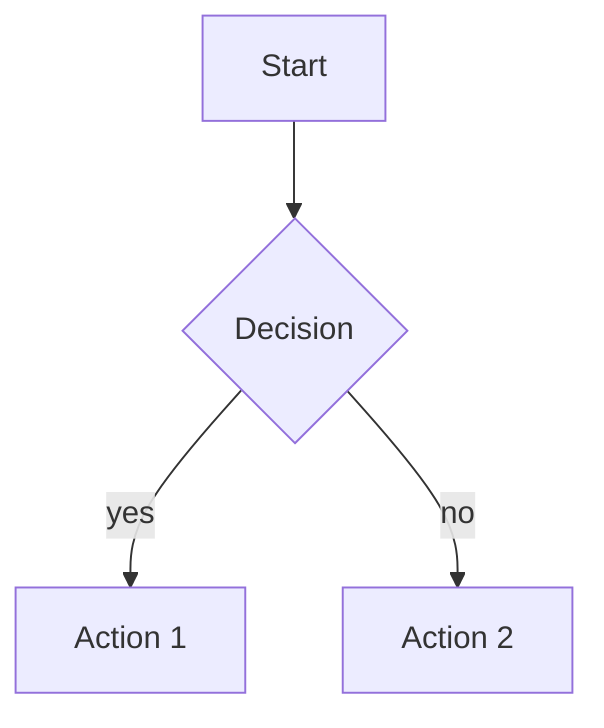
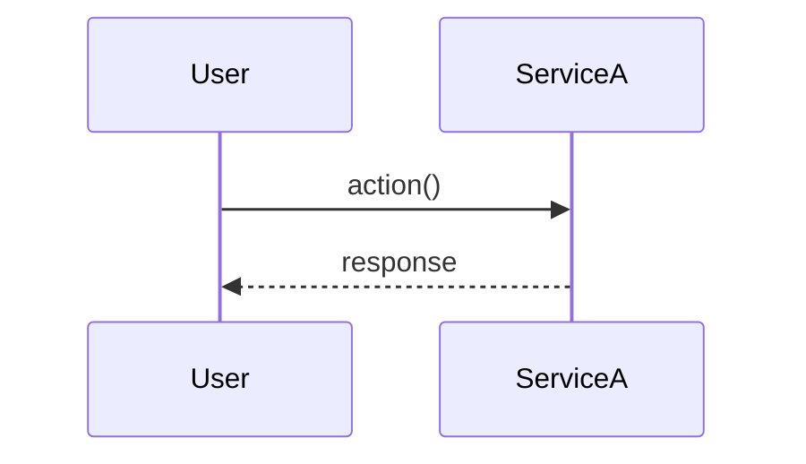
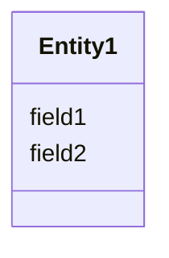

# {{project_name}} — Réponses détaillées

**Document réponse aux Questions/Impacts soulevés par {{questioner}}**

| | |
|---|---|
| **Version** | {{version}} ({{version_label}}) |
| **Date** | {{delivery_date}} |
| **Auteur** | {{author}} |
| **Repo analysé** | `{{repo_path}}`, indexé le {{indexed_at}} ({{nb_files}} fichiers, {{nb_nodes}} nœuds, {{nb_edges}} arêtes) |
| **Méthodologie** | Doc Q/R technique v1.0 — chaque traitement clé décrit selon §Présentation / §Source / §Préconditions / §Algorithme / §Post-conditions / §Cas d'erreur |

---

## 1. Executive Summary

### 1.1 Question posée

<!-- Reformuler la question principale du client en 2-3 phrases. -->

### 1.2 Réponse synthétique

| Question | Réponse | Sévérité technique |
|---|---|---|
| Q1.1–1.X (paramétrage) | <réponse synthétique> | — |
| Q1.X (point sensible) | <réponse> | 🔴 **Constat critique #1** |
| Q2.X (autre point sensible) | <réponse> | 🟡 |

### 1.3 Effort estimé

**X-Y j/h** côté <stack> pour la <thématique> (BDD : N j, backend : N j, IHM : N j, tests : N j).

### 1.4 Lecture conseillée

- Section **2 — Constats critiques** : à lire en priorité si vous décidez du chiffrage / planning.
- Section **3 — Cartographie technique** : référence à garder ouverte pendant la lecture des sections 4–5.
- Section **4 — Questions Métier** : pour valider les hypothèses fonctionnelles.
- Section **5 — Impacts techniques** : algorithmes formalisés, à utiliser comme spec dev.
- Section **6 — Exemple numérique** : trace pédagogique du calcul.
- Sections **7 (diagrammes)** et **8 (synthèse impacts)** : support de revue technique.

---

## 2. Constats critiques

### 2.1 🔴 Constat #1 — <Titre court actionnable>

**Source :** `path/to/file.cs:LINE`

```<lang>
// Citation littérale du code
```

**Pourquoi c'est critique :**

<Explication 2-4 paragraphes : ce qui se passe, ce que le code dit, et pourquoi c'est sensible.>

**Exemple chiffré (post <changement>) :**

| Étape | Comportement actuel | Comportement attendu | Comportement réel |
|---|---|---|---|
| <étape 1> | … | … | … |
| <étape 2> | … | … | … |

**Conséquence :** <ce qui se produit côté métier ou côté run>

**Action recommandée :** <décision à prendre, par qui, avant quand>

### 2.2 🟡 Constat #2 — <Titre>

<idem structure mais sans cartouche rouge>

### 2.3 🔴 Constat #3 — <Titre>

<idem structure>

---

## 3. Cartographie technique de référence

### 3.1 Architecture (couches)

```
┌──────────────────────────────────────────────────────────────┐
│  <Layer 1>                                                   │
└──────────────────────────────────────────────────────────────┘
                            │
┌──────────────────────────────────────────────────────────────┐
│  <Layer 2>                                                   │
└──────────────────────────────────────────────────────────────┘
                            │
┌──────────────────────────────────────────────────────────────┐
│  <Layer 3>                                                   │
└──────────────────────────────────────────────────────────────┘
```

### 3.2 Méthodes clés

| # | Méthode | Fichier:Ligne | Rôle |
|---|---|---|---|
| 1 | `<MethodName>` | `<file:line>` | <rôle> |

### 3.3 Tables / Entités clés

| Table | Champs critiques | Type | Notes |
|---|---|---|---|

### 3.4 Énumérations métier

```<lang>
<extracted enums>
```

---

## 4. Questions Métier (§1 du document source)

### 4.1 Q1.1 — <Titre court reformulé>

**Question :** « <texte original client> »

#### §4.1.1 Présentation

<2-3 lignes pour qu'un non-tech comprenne>

#### §4.1.2 Source

`<file:line>` — `<MethodName>(...)`.

#### §4.1.3 Préconditions

- <condition 1>
- <condition 2>

#### §4.1.4 Algorithme

```
ENTRÉE : <param typés>
SORTIE : <type retour>

1. <étape>
2. <étape>
3. <étape>
```

#### §4.1.5 Post-conditions

- <invariant 1>
- <invariant 2>

#### §4.1.6 Cas d'erreur

- <exception/code/NRE possible>

#### §4.1.7 Impact <thématique>

<ce qui change pour la migration / refonte demandée>

---

<!-- Répéter §4.X pour chaque question Q1.X jusqu'à la fin de §1 du DOCX client -->
<!-- Puis §5.X pour chaque question Q2.X -->

---

## 5. Impacts techniques (§2 du document source)

### 5.1 Q2.1 — <Titre>

<idem structure §X.X.1-7>

---

## 6. Exemple numérique tracé

**Scénario synthétique** (cohérent avec une capture du document source, pas un dossier réel) :

| Donnée d'entrée | Valeur |
|---|---|
| <var 1> | <val> |
| <var 2> | <val> |

**Trace d'exécution** :

```
1. <étape avec valeurs intermédiaires>
2. <étape>
3. <étape> → résultat
```

**Sortie obtenue** :

```
<output>
```

---

## 7. Diagrammes Mermaid

### 7.1 <Titre diagramme principal> (flowchart)



### 7.2 <Séquence>



### 7.3 <Modèle de données>



---

## 8. Synthèse — Impacts du <thématique> sur le code

| Composant | Modification requise | Difficulté | Risque |
|---|---|---|---|

**Effort total :** X-Y j/h (...).

---

## 9. Préconisations & roadmap

<!-- ATTENTION — Cette section §9 sera EXTRAITE par _build_companion.py vers un document compagnon -->
<!-- séparé. Elle ne doit PAS apparaître dans la doc Q/R principale livrée au client.    -->
<!-- Voir methodologie/METHODOLOGIE-DOC-QR-TECHNIQUE.md §1.2 pour la justification.       -->

### 9.1 Phase 0 — Cadrage métier

### 9.2 Phase 1 — <…>

### 9.3 Phase 2 — <…>

### 9.4 Phase 3 — <…>

### 9.5 Phase 4 — Validation pré-prod

---

## 10. Annexes

### 10.1 Glossaire des codes BDD

| Préfixe | Table | Sens | Exemples |
|---|---|---|---|

### 10.2 Liste des fichiers à modifier

```
<arborescence>
```

### 10.3 Tests existants à reprendre

- <test 1>
- <test 2>

<!-- §10.4 (Catalogue formules) et §10.5 (Check-list validation) sont auto-générés par _build_qr_md.py -->
<!-- §10.6 (Vérification croisée Codex) est auto-généré par _build_qr_pdf.py -->

---

*Document généré le {{delivery_date}} par {{author}} avec Claude Opus 4.7 (1M ctx) — {{version_label}}.*
*Tous les chemins, numéros de ligne et signatures de méthodes sont vérifiables dans le repo `{{repo_path}}` (commit indexé le {{indexed_at}}).*
